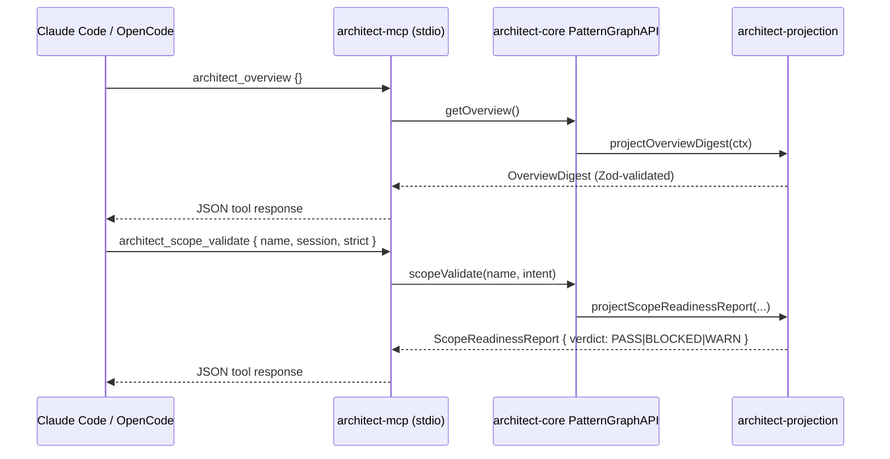

# Architect — Technical Architecture

> **A note on shape.** This is a library + CLI + MCP-server family with **no database, no HTTP server, no hosted infrastructure**. The architecture document below is reshaped accordingly. "Deployment Architecture" means npm publishing; "Observability Architecture" means CI gates and validation reports; "Data Layer" means the in-memory PatternGraph computed from annotated source.

---

## System Architecture Diagram

### Package dependency graph (acyclic, load-bearing)

```mermaid
flowchart LR
  core[architect-core]
  projection[architect-projection]
  guard[architect-guard]
  cli[architect-cli]
  mcp[architect-mcp]
  meta[architect &#40;meta&#41;]

  core --> projection
  core --> guard
  guard --> cli
  core --> mcp
  projection --> mcp

  meta -. depends on all five .-> core
  meta -. .-> projection
  meta -. .-> guard
  meta -. .-> cli
  meta -. .-> mcp
```

### Build flow (PatternGraph construction)

```mermaid
flowchart LR
  src[("Annotated TS source<br/>(packages/**/*.ts)")]
  feat[("Gherkin specs<br/>(architect/specs/<br/>architect/decisions/<br/>tests/features/)")]
  scanner["scanner/ + extractor/<br/>(architect-core)"]
  raw["RawDataset"]
  transform["transformToPatternGraph<br/>+ Zod validation"]
  graph["PatternGraph<br/>(in-memory)"]
  api["PatternGraphAPI"]
  proj["project* fragments<br/>(architect-projection)"]
  render["render* (markdown / JSON / compact)"]
  out["docs-live/ · CLI output · MCP tool response"]

  src --> scanner
  feat --> scanner
  scanner --> raw
  raw --> transform
  transform --> graph
  graph --> api
  api --> proj
  proj --> render
  render --> out
```

### Session-scoped flow (agent calling MCP)



---

## Technology Stack

### Language

**TypeScript 5.8+ (strict, ESM-only)** with all four CLAUDE.md strictness flags:

- `verbatimModuleSyntax: true`
- `noUncheckedIndexedAccess: true`
- `noPropertyAccessFromIndexSignature: true` (architect-base addition)
- `exactOptionalPropertyTypes: true`

ESM-only (`"type": "module"`). No CommonJS dual-export complexity.

### Framework

**None.** No application framework. Packages are composed by hand from:

- `commander`-style CLI parsing (`pattern-graph-cli.ts`)
- `@modelcontextprotocol/sdk` for MCP
- `@cucumber/gherkin` for architect-state spec parsing
- `@amiceli/vitest-cucumber` for executable tests
- `zod` `^4.1.11` for boundary validation

### Database

**None.** No persistent store. State lives in annotated source + Gherkin features on disk. The runtime computes a typed **PatternGraph** in memory from those files. See ADR-003 (source-first) and ADR-006 (single read model).

### Infrastructure

- **npm registry** as the publishing target.
- **Six publishable packages** plus one private workspace package, published via `@changesets/cli`.
- **No hosted service**, no IaC, no cloud provider.
- **Node ≥ 20.0.0**, **pnpm 10.4.1** pinned.

### Test framework

- `vitest` `^4.1.4`
- `@amiceli/vitest-cucumber` `^6.3.0` for Gherkin execution
- `@vitest/coverage-v8` `^4.1.4` for coverage instrumentation
- **0 `.test.ts` files in production paths** by policy (ADR-002).

---

## Domain Model

The codebase is organized into bounded contexts visible in the package split:

| Bounded Context            | Package                                               | Aggregates / Entities                                                                                   |
| -------------------------- | ----------------------------------------------------- | ------------------------------------------------------------------------------------------------------- |
| **Canonical Model**        | `@libar-dev/architect-core`                           | `PatternGraph` (root aggregate), `ExtractedPattern`, `TagRegistry`, `WorkflowConfig`, FSM state machine |
| **Projection / Rendering** | `@libar-dev/architect-projection`                     | `Fragment` (per-kind), `RenderableDocument` (codec output), `Renderer` (markdown / json / compact)      |
| **Process Enforcement**    | `@libar-dev/architect-guard`                          | `ProcessState`, `SessionState`, `ProcessViolation`, lint engine                                         |
| **Surface Composition**    | `@libar-dev/architect-cli`                            | CLI dispatch only — no domain types                                                                     |
| **Surface Composition**    | `@libar-dev/architect-mcp`                            | MCP tool registry, pipeline session, file watcher                                                       |
| **Methodology**            | `@libar-dev/architect-spec` (`formal-spec/`, private) | The Architect Spec — defines the _language_ the other packages parse                                    |

**Cross-domain relationships:**

- `architect-projection` consumes `PatternGraph` from `architect-core` — read-only.
- `architect-guard` consumes `PatternGraph` + FSM types from core — read + validation logic only, no graph mutation.
- `architect-cli` and `architect-mcp` are composition roots — they wire core + projection + guard without owning domain types.
- `formal-spec/` is the language definition the implementation parses; no JS dependency between them (ships as a separate package at v1.0).

---

## Data Layer (in-memory PatternGraph)

There is no database. The "data layer" is the typed in-memory `PatternGraph` computed from annotated source + Gherkin features.

### Top-level `PatternGraph` (the read model — ADR-006)

(`packages/architect-core/src/validation-schemas/pattern-graph.ts:106-123`)

| Field                                                             | Type                                           | Notes                                                                     |
| ----------------------------------------------------------------- | ---------------------------------------------- | ------------------------------------------------------------------------- |
| `patterns`                                                        | `ExtractedPattern[]`                           | All discovered patterns.                                                  |
| `tagRegistry`                                                     | `TagRegistry`                                  | Tag prefix + metadata-tag definitions.                                    |
| `byStatus`                                                        | `ExactStatusGroups`                            | 5 buckets: `candidate` / `roadmap` / `active` / `completed` / `deferred`. |
| `byNormalizedStatus`                                              | `StatusGroups`                                 | 4 buckets: `completed` / `active` / `planned` / `candidate`.              |
| `byMaturity`                                                      | `Record<string, ExtractedPattern[]>`           | `idea` / `plan` / `design` / `executable`.                                |
| `byPhase`, `byQuarter`, `byRole`, `bySourceType`, `byProductArea` | indexes                                        | Additional grouping views.                                                |
| `counts`                                                          | `StatusCounts`                                 | `{ completed, active, planned, candidate, total }`.                       |
| `relationshipIndex`                                               | `Record<string, RelationshipEntry>` (optional) | Edge index keyed by pattern name.                                         |
| `archIndex`                                                       | `ArchIndex` (optional)                         | `byRole` / `byContext` / `byLayer` / `byView`.                            |
| `featureParseFailures`                                            | `PatternParseFailure[]` (optional)             | Tolerant-ingestion artifact.                                              |

### `ExtractedPattern` — the node (PascalCase only)

(`packages/architect-core/src/validation-schemas/extracted-pattern.ts:63-124`, `z.strictObject`)

- **Identity:** `id` (matches `pattern-[a-f0-9]{8}`), `name` (matches `^[A-Z][A-Za-z0-9]+$`), `status`, `role`, `source` (`{ file, lines: [start,end] }`), `extractedAt` (ISO 8601).
- **Edges:** `uses`, `implementsPatterns`, `extendsPattern`, `seeAlso`, `apiRef`, `parent`/`children`, `executableSpecs`.
- **Process metadata:** `phase`, `release`, `quarter`, `completed`, `effort`, `effortActual`, `team`, `productArea`, `priority`, `risk`, `workflow`.
- **ADR fields:** `adr`, `adrStatus`, `adrCategory`, `adrTheme`, `adrLayer`, `adrSupersedes`, `adrSupersededBy`.
- **Embedded artifacts:** `rules` (`BusinessRule[]`), `deliverables`, `extractedShapes`, `exports`, `scenarios`.

### Edge kinds — **seven**, not four

The projection layer models **seven** relation kinds (CLAUDE.md frames it as four — see Known Issues):

```
'depends-on' | 'uses' | 'enables' | 'implements' | 'extends' | 'see-also' | 'api-ref'
```

### Four-tier **maturity** taxonomy (the "ladder")

```ts
MATURITY_VALUES = ['idea', 'plan', 'design', 'executable'];
```

Default mapping from `status` → `maturity`:

| status      | default maturity |
| ----------- | ---------------- |
| `candidate` | `idea`           |
| `roadmap`   | `plan`           |
| `active`    | `design`         |
| `completed` | `executable`     |
| `deferred`  | `plan`           |

### FSM (ProcessGuard)

States and transitions (`packages/architect-core/src/validation/fsm/`):

```
roadmap   → active | deferred
active    → completed | roadmap
completed → (terminal — requires @architect-unlock-reason)
deferred  → roadmap
```

Protection levels: `none` (roadmap, deferred) → `scope` (active, no scope creep) → `hard` (completed, no edits without unlock).

ProcessGuard rule IDs: `completed-protection`, `scope-creep`, `invalid-status-transition`, `session-scope`, `session-excluded`, `deliverable-removed`.

---

## API Contracts

There are **no HTTP endpoints**. The "API contracts" are the CLI subcommand surface, the MCP tool registry, and the JS API exports from the three contentful packages (`architect-core`, `-projection`, `-guard`).

### CLI Surface (7 bins, 24 subcommands on `architect`)

| Bin                       | Purpose                                                       |
| ------------------------- | ------------------------------------------------------------- |
| `architect`               | Main query / context / lifecycle dispatcher (24 subcommands). |
| `architect-generate`      | Run doc generators (`pnpm docs:all`).                         |
| `architect-guard`         | Pre-commit / CI process-guard FSM enforcement.                |
| `architect-lint-patterns` | Lint `@architect-*` JSDoc annotations on `.ts`.               |
| `architect-lint-steps`    | Lint Gherkin step definitions.                                |
| `architect-validate`      | DoD + anti-pattern detection.                                 |
| `architect-mcp`           | MCP server (stdio).                                           |

`architect` subcommands group into: query/context (`overview`, `status`, `context`, `dep-tree`, `files`, `pattern`, `list`, `search`), lifecycle (`scope-validate`, `handoff`), generation (`documentation`, `bundle`), architecture (`arch roles|bounded-context|neighborhood|compare|coverage|dangling|orphans|blocking`), introspection (`rules`, `diagnostics`, `tags`, `taxonomy`, `sources`, `unannotated`), and meta (`query`, `repl`, `help`, `version`).

### MCP Surface (21 tools — `ARCHITECT_MCP_TOOLS`)

Every input schema is `z.strictObject(...).readonly()`. MCP-name convention: underscores end-to-end.

| MCP tool                      | Input Zod keys                                                                               | CLI verb parity     |
| ----------------------------- | -------------------------------------------------------------------------------------------- | ------------------- |
| `architect_overview`          | `{}`                                                                                         | `overview`          |
| `architect_coverage`          | `{}`                                                                                         | (no CLI verb)       |
| `architect_context`           | `{ name, session? }`                                                                         | `context`           |
| `architect_files`             | `{ name, related? }`                                                                         | `files`             |
| `architect_dep_tree`          | `{ name, maxDepth? }`                                                                        | `dep-tree`          |
| `architect_scope_validate`    | `{ name, session, strict? }`                                                                 | `scope-validate`    |
| `architect_handoff`           | `{ name, session?, modifiedFiles? (max 200) }`                                               | `handoff`           |
| `architect_status`            | `{}`                                                                                         | `status`            |
| `architect_pattern`           | `{ name }`                                                                                   | `pattern`           |
| `architect_bundle`            | `{ name, mode?, include?, estimateTokens? }`                                                 | `bundle`            |
| `architect_list`              | `{ status?, role?, namesOnly?, count? }`                                                     | `list`              |
| `architect_open_questions`    | `{ parent? }`                                                                                | `open-questions`    |
| `architect_search`            | `{ query }`                                                                                  | `search`            |
| `architect_rules`             | `{ pattern?, productArea?, onlyInvariants? }` (`pattern` & `productArea` mutually exclusive) | `rules`             |
| `architect_taxonomy`          | `{ exampleOverrides? }`                                                                      | `taxonomy`          |
| `architect_arch_neighborhood` | `{ name }`                                                                                   | `arch neighborhood` |
| `architect_arch_blocking`     | `{}`                                                                                         | `arch blocking`     |
| `architect_rebuild`           | `{}`                                                                                         | (no CLI verb)       |
| `architect_config`            | `{}`                                                                                         | (no CLI verb)       |
| `architect_documentation`     | `{ documentType, disclosure?, filter? }`                                                     | `documentation`     |
| `architect_help`              | `{}`                                                                                         | (lists tools)       |

### Canonical JSON output shapes

All CLI verbs with `--format json` and all MCP tools return typed Projection Fragments:

- **`OverviewDigest`** — `{ kind, progress, activePhases[], blocking[], cliHints? }`.
- **`SessionContextBundle`** — `{ kind, patterns, sessionType, metadata[], specFiles, stubs[], dependencies[], sharedDependencies[], consumers[], architectureNeighbors[], deliverables[], fsm, fsmByPattern[], testFiles }`.
- **`ScopeReadinessReport`** — `{ kind, pattern, sessionType, checks[], verdict: 'PASS' | 'BLOCKED' | 'WARN' }`.
- **`ValidatePatternsOutput`** — `{ summary: { issues[], stats }, diagnostics[] }`.

### JS API (exported from the three contentful packages)

- **`@libar-dev/architect-core`** — `createArchitect`, `defineConfig`, `loadConfig`, `buildPatternGraph`, `createPatternGraphAPI`, `parseAtBoundary`, all FSM types, all taxonomy constants, all config schemas.
- **`@libar-dev/architect-projection`** — `project*` and `parseAndProject*` functions, Zod-validated fragments. Trust boundary: `parseAndProject*` is the raw-input entrypoint; internal `project*` assumes Zod-validated input.
- **`@libar-dev/architect-guard`** — `ProcessGuard`, `runLintPatternsCli`, `runValidatePatternsCli`, DoD validator, anti-pattern detector, git helpers.
- **`@libar-dev/architect-cli`** and **`@libar-dev/architect` (meta)** — bins only, no JS API.

---

## Architectural Decisions

Nine decisions on disk: `adr-001`, `-002`, `-003`, `-005`, `-006`, `-007`, `-008`, `-009`, plus `pdr-001`. The "missing" ADR-004 slot is occupied by **PDR-001**, which carries `@architect-adr:004` internally.

### ADR-001 — Taxonomy canonical values & process constants

- **Status:** accepted / completed · **Category:** process
- **Context:** Without canonical values, organic growth produces drift ("Generator" vs "Generators", "Process" vs "DeliveryProcess") and inconsistent grouping in generated docs.
- **Decision:** Define canonical values for taxonomy enums, FSM states (with protection levels), valid transitions, tag format types, and source ownership rules.
- **Rationale:** FSM protection prevents silent modification of completed specs and scope creep on active ones. Explicit format types let parsers stop guessing CSV-vs-string.
- **Consequences:** Generated docs group coherently; FSM enforcement is auditable; existing non-canonical specs needed a one-time migration.

### ADR-002 — Gherkin-only testing policy

- **Status:** accepted / completed (unlocked once to add process-workflow include tag) · **Category:** testing
- **Context:** 97 legacy `.test.ts` files alongside Gherkin features undermined the "Gherkin IS sufficient" thesis.
- **Decision:** All tests are `.feature` files with step definitions; no new `.test.ts` files; edge cases use Scenario Outline + Examples.
- **Rationale (verbatim):** _"Parallel `.test.ts` files create a hidden test layer invisible to the documentation pipeline, undermining the single source of truth principle this package enforces."_
- **Consequences:** Single source of truth for tests AND docs; living documentation always matches test coverage; Scenario Outline more verbose than parameterized tests.

### ADR-003 — Source-first pattern architecture

- **Status:** accepted / completed · **Category:** process
- **Context:** Tier-1 specs went stale after implementation (only 39% of 44 specs had traceability), retroactive annotation triggered merge conflicts, tier-1 specs duplicated 200–400 lines from executable specs.
- **Decision:** Invert ownership. TS source code is the canonical pattern definition. Tier-1 specs become ephemeral planning documents. The three durable artifacts are annotated source, executable specs, and decision specs.
- **Rationale (verbatim):** _"If pattern identity lives in tier 1 specs, it becomes stale after implementation and diverges from the code that actually realizes the pattern."_
- **Key rule:** `@architect-pattern` _defines_ (exactly one file per pattern); `@architect-implements` is UML _realization_ (many-to-one).

### PDR-001 (= ADR-004) — Session-workflow-command design decisions

- **Status:** accepted / roadmap · **Category:** process · **Product area:** DataAPI
- **Context:** Adding `scope-validate` and `handoff` raised seven design questions (DD-1..DD-7).
- **Key decisions:**
  - **DD-1:** Text output with `=== SECTION ===` markers, never JSON.
  - **DD-2:** Git integration opt-in via `--git`; domain logic never invokes shell.
  - **DD-3:** Session type inferred from FSM status; overridable by `--session`. Mapping: `candidate→planning`, `roadmap→design`, `active→implement`, `completed→review`, `deferred→design`.
  - **DD-4:** Severity matches ProcessGuard: `PASS` / `BLOCKED` / `WARN`; `--strict` promotes WARN → BLOCKED.
  - **DD-5..DD-7:** Date handling, output composition, overlap with `ProcessGuard` (see source for detail).

### ADR-005 — Codec-based markdown rendering (codec / renderer separation)

- **Status:** accepted / completed (retroactive unlock during rebrand) · **Category:** architecture
- **Decision:** Adopt a codec architecture. Each document type has a **codec** that decodes a PatternGraph into a `RenderableDocument` (IR with sections, headings, tables, paragraphs, code blocks). A separate **renderer** turns IR into markdown.
- **Rationale (verbatim):** _"Pure functions are deterministic and trivially testable. For the same PatternGraph, a codec always produces the same RenderableDocument."_
- **Consequences:** Codecs are pure functions; IR is inspectable; composable via `CompositeCodec`; same dataset → multiple outputs. Cost: extra abstraction; IR vocabulary must cover every needed output pattern.

### ADR-006 — Single read-model architecture

- **Status:** accepted / completed (unlocked to add Verified-by sections and acceptance criteria) · **Category:** architecture · **Uses ADR-005.**
- **Decision:** The PatternGraph is the **single** read model for all consumers. Validators, codecs, and query APIs consume the same pre-computed model.
- **Rationale (verbatim):** _"Bypassing the read model forces consumers to re-derive data that the PatternGraph already computes, creating duplicate logic and divergent behavior when the pipeline evolves."_
- **Negative space:** Stage-1 exceptions (`lint-patterns.ts`, `AntiPatternDetector`, `CoverageAnalyzer`, `SessionStateReader`) exist only for consumers that need data the PatternGraph _intentionally doesn't model_.

### ADR-007 — Coordinated taxonomy redesign (currently active)

- **Status:** accepted / **active** (the only currently-active ADR) · **Category:** architecture · **Uses:** ADR-001, EnforcementConfiguration, PerspectiveAwareProjections.
- **Decision:** Replace the binary track tag with a maturity axis (`idea`/`plan`/`design`/`executable`); replace categories+presets with a unified role system; add `EnforcementConfiguration` for ProcessGuard; add `PerspectiveAwareProjections`; migrate `derive-state.ts` and `DoDValidator` to the PatternGraph; add Zod output schemas for MCP tools.
- **Key constraint:** _"All seven changes ship as ONE coordinated breaking change. Three internal consumers, no public users, pre-release only. All consumers update simultaneously."_

### ADR-008 — Step-definition stubs live in the architect-state folder

- **Status:** accepted / completed · **Category:** process · **Uses:** ADR-003, ADR-002.
- **Decision:** Step stubs live in `architect/step-stubs/{pattern-name}/` as TypeScript files with real vitest-cucumber structure and `throw new Error` bodies. They move to `tests/steps/` during implementation and are deleted from `step-stubs/` when complete.
- **Rationale (verbatim):** _"Code stubs proved that design artifacts must live outside compiled/linted/executed paths. The same principle applies to test skeletons."_

### ADR-009 — Projection trust boundary & W7 naming

- **Status:** accepted / completed · **Category:** architecture (refinement) · **See-also:** ADR-005, ADR-006.
- **Decision:** **`parseAndProject*` functions are the raw-input trust boundary for external consumers.** They parse options once, then call typed `project*` helpers. Projection builders construct typed fragments directly and do not re-parse their own outputs on hot paths.
- **Markdown sub-boundary:** Fragment text fields are plain text unless a renderer-owned block explicitly marks inline Markdown as trusted. Markdown renderers escape labels, validate URL schemes, reject protocol-relative targets.
- **Rationale (verbatim):** _"Re-parsing projection outputs contradicts the trust-boundary contract and makes CLI/MCP hot paths pay for duplicate full-object walks."_

---

## Design Principles

The codebase makes the same opinionated choice in many places — together they form a coherent value system.

| Principle                            | Evidence                                                                                                                                              |
| ------------------------------------ | ----------------------------------------------------------------------------------------------------------------------------------------------------- |
| **Type safety over convenience**     | Four CLAUDE.md strictness flags, no-`any` rule, custom `architect-local/no-suppression-comments` ESLint plugin + `scripts/guard-no-suppressions.mjs`. |
| **Parse once at the trust boundary** | ADR-009; every cross-package contract is a Zod `strictObject`; consumer-facing entrypoints are `parseAndProject*`.                                    |
| **Single source of truth**           | ADR-003 (source-first), ADR-006 (single read model), ADR-002 (Gherkin-only — tests and docs share one source).                                        |
| **Deletion over deprecation**        | AGENTS.md §No-BC: no `@deprecated`, no BC aliases, no `_var` renames; the no-suppressions guard enforces this on CI.                                  |
| **Determinism over flexibility**     | Codec/renderer split (ADR-005); pure-function projections; deterministic verdict words; perf-regression gate on projection.                           |
| **Acyclic, declared dependencies**   | `core ← projection`, `core ← guard ← cli`, `core, projection ← mcp` — load-bearing in AGENTS.md; no circular imports enforced by lint.                |
| **Architecture-as-fitness-function** | `scope-validate`, `arch dangling --strict`, `arch blocking`, the ProcessGuard FSM — all enforce architectural invariants in CI rather than reviews.   |

---

## Trade-offs & Constraints

- **Velocity + cleanliness over backward compatibility.** Pre-1.0 is paid for by breaking changes. The maintainer carries near-zero shim cost; external consumers carry migration cost. Long-term, the platform is bet on quality and a small, opinionated consumer base.
- **Implementation flexibility over methodology immutability.** `@libar-dev/architect-spec` (`formal-spec/`) is the durable artifact; the implementation can be rewritten. Inverse of most products.
- **No CI workflow file in the repo.** AGENTS.md claims "CI-enforced doctrine," but `.github/workflows/` is absent in this worktree — see Known Issues / `technical-debt-analysis.md` §Item 5.
- **Two Gherkin parsers in play.** `@cucumber/gherkin` parses architect-state at doc-gen/build time; `@amiceli/vitest-cucumber` parses executable specs at test time. Mitigated by documentation; structurally still a footgun.
- **No telemetry, no analytics, no usage signal.** Trade-off: no data-driven decisions about which verbs / tools / sessions are actually used.
- **Strictness vs ergonomics in TypeScript.** `noUncheckedIndexedAccess` + `exactOptionalPropertyTypes` add real authoring friction. The codebase pays that cost willingly.

---

## Configuration Architecture

### `architect.config.ts` (project config file)

Loaded by `loadProjectConfig` (`packages/architect-core/src/config/config-loader.ts:67-86,148-236`), which walks parents from `baseDir` looking for `architect.config.ts` (then `.js`), stopping at the `.git` root. If discovery fails, `createDefaultResolvedConfig()` returns a valid resolved config with `isDefault: true`.

Top-level schema fields (all `z.strictObject`, see `project-config-schema.ts:102-116`):

- `tagPrefix` (default `@architect-`)
- `fileOptInTag` (default `@architect`)
- `roles[]` (`RoleDefinition[]`, falls back to `ARCHITECT_PACKAGE_ROLES`)
- `productAreas[]` (canonical whitelist)
- `sources.{typescript[], features[], stubs[], exclude[]}` (TS globs; `..` rejected)
- `output.{directory, overwrite}` (defaults `docs-generated`, `false`)
- `generators[]` (default `['patterns']`; 8 generators via `DEFAULT_GENERATORS`)
- `generatorOverrides`, `tagExampleOverrides`, `contextInferenceRules`
- `project.{name, purpose, license, version, regeneration}`
- `workflowPath`, `packages[]`

**Validation quirks:**

- Two undocumented keys (`codecOptions`, `referenceDocConfigs`) are silently stripped before validation — see Known Issues.
- Failed validation returns structured `ConfigLoadError` with joined Zod issue paths.

### Environment variables

The runtime is intentionally near-env-free:

| Env var    | Read by                                | Behavior                                                                   |
| ---------- | -------------------------------------- | -------------------------------------------------------------------------- |
| `DEBUG`    | `error-handler.ts:223`, `shared.ts:27` | If truthy, prints stack trace on CLI error. On/off only.                   |
| `INIT_CWD` | `runtime-helpers.ts`                   | **Fallback only** — used if `process.cwd()` throws.                        |
| `PWD`      | `runtime-helpers.ts`                   | **Fallback only** — last-resort if `cwd()` throws and `INIT_CWD` is empty. |

No `ARCHITECT_*` env knobs. All other configuration lives in `architect.config.ts` or on the command line.

### Versioning policy (`.changeset/config.json`)

- `fixed: [[architect, architect-core, architect-projection, architect-guard, architect-cli, architect-mcp]]` — all 6 publishable packages version in lockstep.
- `linked: []`, `access: public`, `baseBranch: main`.
- `updateInternalDependencies: patch` — `workspace:*` deps emit patch bumps.
- `ignore: ["@libar-dev/architect-spec", "architect-self-host-example"]`.

---

## Deployment Architecture

The deployment unit is **the npm registry**. Each release publishes the six in-lockstep packages plus updates `@libar-dev/architect` (meta). `@libar-dev/architect-spec` stays private until v1.0 graduation.

### Release procedure

```bash
pnpm changeset                # author a changeset
git push                      # land changes, merge to main
pnpm changeset:version        # bumps per fixed-group rule
git commit -am "chore: version packages"
git push
pnpm release                  # = pnpm build && pnpm changeset:publish
```

### Rollback

npm registry is the rollback surface — `npm deprecate <pkg>@<bad-version>`. No automation around this.

### Infrastructure overview

Not applicable in the cloud-infra sense:

- **npm registry** — publishing target.
- **Git** — source of truth (annotated production code + executable specs).
- **Local filesystem on developer machines** — where the MCP server and CLI bins run.
- **Agent harness (Claude Code / OpenCode / Cursor)** — the runtime host for the MCP server.

No cloud provider, no IaC, no container runtime, no message queue, no CDN.

---

## Authentication Architecture

**Not applicable.** No user authentication, no API key, no OAuth, no permission model. The MCP server runs as a child process of the agent under the user's own credentials. The CLI runs as the user. Trust boundary = the local user account.

---

## Event Architecture

**Not applicable.** No HTTP server, no webhook receivers, no event publishers. The closest analogue is `architect-mcp --watch`, which subscribes to filesystem changes (500 ms debounce) and rebuilds the in-memory PatternGraph in place. No external pub/sub.

---

## Scalability & Performance

### Current capacity

- **Source files scanned:** 329 TS + 128 `.feature` files at the pinned commit.
- **PatternGraph nodes:** in the low hundreds; relationship edges in the low thousands.
- **MCP server cold start:** ~1–2 seconds on the dogfood workspace.
- **Test suite:** ~2828 tests across the 5 publishable packages; runs in well under a minute on a modern laptop.

### Bottlenecks

- **Cold start** of the MCP server is the dominant latency consumer for agents. For workspaces >1000 source files, expect linear growth in scan time. The `--watch` flag amortizes this.
- **PatternGraph build** is the hot path. The perf-regression gate is the early-warning system.

### Horizontal vs vertical scaling

The platform runs locally per developer; "horizontal scaling" doesn't apply. The vertical-scaling lever is fewer / better-targeted globs in `sources.typescript` and `sources.features`.

### Caching

The MCP server caches the full PatternGraph in memory between calls. `--no-cache` on the CLI forces a fresh build. There is no on-disk cache file.

---

## Observability Architecture

Build-time / developer-time toolchain — no long-lived process serving traffic. The "observability" surface is deterministic diagnostic verbs + validation reports + the perf-regression gate.

### Diagnostic verbs (CLI / MCP)

| Verb                                 | Surfaces                                                                                            |
| ------------------------------------ | --------------------------------------------------------------------------------------------------- |
| `architect overview`                 | Progress + active phases + blocking patterns. JSON: `OverviewDigest`.                               |
| `architect status`                   | FSM state counts. JSON: `StatusDistribution`.                                                       |
| `architect diagnostics`              | Extraction-pipeline diagnostics dump (failed parses, unresolved references, schema-rejected nodes). |
| `architect arch dangling [--strict]` | Patterns referencing IDs that don't resolve. `--strict` exits non-zero on any.                      |
| `architect arch blocking`            | Patterns currently blocking progress.                                                               |
| `architect arch orphans`             | Patterns with no edges.                                                                             |
| `architect arch coverage`            | Annotation coverage across the source.                                                              |
| `architect unannotated`              | Patterns with missing/incomplete annotations.                                                       |

### Validation reports

| Command                                              | Output                                                                                                                  |
| ---------------------------------------------------- | ----------------------------------------------------------------------------------------------------------------------- |
| `pnpm exec architect-validate --dod --anti-patterns` | `ValidatePatternsOutput`: `{ summary: { issues[], stats }, diagnostics[] }`. The all-in-one "is everything okay" check. |
| `pnpm exec architect-lint-patterns`                  | Annotation-lint output (`LintOutput`).                                                                                  |
| `pnpm exec architect-lint-steps`                     | Step-definition lint output.                                                                                            |
| `pnpm exec architect-guard --staged \| --all`        | ProcessGuard FSM enforcement (six rules).                                                                               |

### Debugging capabilities

- **Increase verbosity:** `DEBUG=1 pnpm architect:query -- overview` prints full stack traces.
- **Inspect resolved config:** `pnpm architect:query -- --dry-run` or MCP tool `architect_config`.
- **Inspect PatternGraph:** `sources`, `diagnostics`, `arch dangling`, `arch orphans`, `arch coverage`, `unannotated` (all support `--format json`).
- **Watch-mode loop:** `pnpm exec architect-mcp --watch` (500 ms debounce).

---

## Monitoring & Alerting

CI-gate behaviors, not pager alerts:

| Rule                                                                | Threshold                         | Action                                              |
| ------------------------------------------------------------------- | --------------------------------- | --------------------------------------------------- |
| `pnpm test` failure                                                 | Any test fails                    | Block merge.                                        |
| `pnpm validate:all` finds an issue                                  | Any DoD or anti-pattern violation | Block merge.                                        |
| `pnpm exec architect-guard --staged` rule fires at `error` severity | Any error-severity rule           | Block commit (pre-commit hook).                     |
| `pnpm exec architect-guard --all --strict` warns                    | Any warning, in `--strict` mode   | Block merge.                                        |
| Projection perf regression                                          | Median latency > `baseline × 1.5` | Block merge; require profile + fix or new baseline. |
| `pnpm guard:no-suppressions` finds a forbidden comment              | Any match in `packages/*/src`     | Block merge.                                        |
| `architect arch dangling --strict` finds an unresolved reference    | Any dangling ref                  | Block merge.                                        |
| Format / lint failure                                               | Any                               | Block merge.                                        |

---

## SLA & SLO Targets

**Not applicable.** No service running, no users to slice metrics by. The closest analogue is **release health**: does the latest `2.0.0-pre.N` install cleanly, pass tests against the dogfood, and not regress the perf gate?

The only enforced performance contract is the projection perf regression gate (`baseline × 1.5` on the 36-pattern / 108-rule fixture).

---

## Cross-references

- **Functional requirements + business context:** `prd.md`.
- **Epic / story breakdown:** `epics.md`.
- **CLI verb reference:** `docs/CLI.md`.
- **MCP setup:** `docs/MCP-SETUP.md`.
- **Configuration:** `docs/CONFIGURATION.md`.
- **ProcessGuard FSM rules:** `docs/PROCESS-GUARD.md`.
- **Validation:** `docs/VALIDATION.md`.
