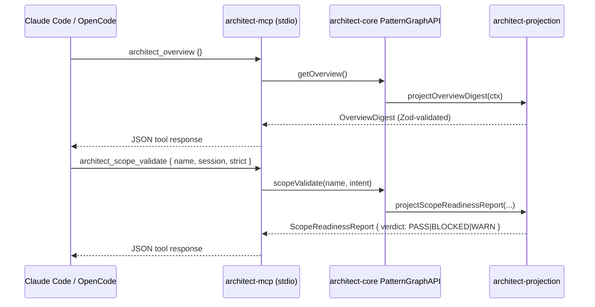

# Integration Points

> **Generated by StackShift** | Commit: `b875ff1` | Date: `2026-05-17T19:27:22Z`
> Run `/stackshift.refresh-docs` to update with latest changes.

Single source of truth for the **consumption surfaces** of `@libar-dev/architect-*` and the dependencies that flow through them. There are no inbound HTTP services to integrate with — this is a library + CLI + MCP-server family. The integration points below are what an external consumer or downstream agent talks to.

---

## External Services & APIs Consumed

The package family has **no runtime external service dependencies.** No HTTP clients, no SDKs for third-party APIs, no payment processors, no email providers, no analytics. Build-time and registry-time dependencies only:

| Surface                        | Service                     | Purpose                                                                                                                     |
| ------------------------------ | --------------------------- | --------------------------------------------------------------------------------------------------------------------------- |
| Distribution                   | **npm registry**            | All six publishable packages are published via `@changesets/cli` to `npmjs.com` (`.changeset/config.json: access: public`). |
| MCP transport                  | **stdio** (local process)   | The MCP server runs as a child process of the agent (Claude Code, etc.). No network. No remote endpoint.                    |
| Spec parsing (architect state) | `@cucumber/gherkin`         | Parses `architect/specs/`, `architect/decisions/`, `formal-spec/` at doc-gen + PatternGraph build time.                     |
| Spec parsing (executable)      | `@amiceli/vitest-cucumber`  | Parses `tests/features/`, `packages/*/tests/features/` at test time via vitest.                                             |
| Schema validation              | `zod` `^4.1.11`             | Cross-package contracts; every CLI/MCP input is a `z.strictObject`.                                                         |
| MCP SDK                        | `@modelcontextprotocol/sdk` | MCP server framework. Used by `@libar-dev/architect-mcp` only.                                                              |
| Test runner                    | `vitest` `^4.1.4`           | All test execution (executable Gherkin runs via `@amiceli/vitest-cucumber` plugin).                                         |
| Release tooling                | `@changesets/cli` `^2.27.0` | Versioning and publishing (`fixed` group across the 6 publishable packages).                                                |

There is no rate-limit / quota story to document; nothing the platform calls has one.

---

## Internal Package Dependencies

The package family is intentionally **acyclic**. Documented in `AGENTS.md` as load-bearing.

```mermaid
flowchart LR
  core[architect-core]
  projection[architect-projection]
  guard[architect-guard]
  cli[architect-cli]
  mcp[architect-mcp]
  meta[architect &#40;meta&#41;]

  core --> projection
  core --> guard
  guard --> cli
  core --> mcp
  projection --> mcp

  meta -. depends on all five .-> core
  meta -. .-> projection
  meta -. .-> guard
  meta -. .-> cli
  meta -. .-> mcp
```

Rules to remember when picking which package to import:

- **`@libar-dev/architect-core`** — the canonical model. `PatternGraphAPI`, `buildPatternGraph`, FSM types (`ProcessStatus`, `ProtectionLevel`, `isValidTransition`), Zod schemas, taxonomy constants, config loader. **The FSM contract lives in core, not guard.**
- **`@libar-dev/architect-projection`** — the codec/renderer pipeline. Import this when you want to transform a PatternGraph into a typed Fragment (markdown / JSON / compact).
- **`@libar-dev/architect-guard`** — FSM enforcement + lint engines + anti-pattern detection. Import this when you need `ProcessGuard` policy or to run the lint rules programmatically.
- **`@libar-dev/architect-cli`** — composition root for the six non-MCP bins. **No JS API expected.** External integrators usually shell out to the bins or shell into `pnpm exec`.
- **`@libar-dev/architect-mcp`** — the MCP server. Usually started by an agent harness; not imported directly.
- **`@libar-dev/architect` (meta)** — `bin`-only re-export. Has **no JS exports**. Install this only when you want every CLI on your `PATH`.

`formal-spec/` (`@libar-dev/architect-spec`, `private: true`) is in the workspace but **not published**. Do not import from it as if it were stable.

---

## CLI Surface (24 subcommands across 7 bins)

Pinned to commit `b875ff1`. Source of truth: `packages/architect-cli/src/cli/pattern-graph-cli-commands.ts:17-42` (the `COMMAND_NAMES` array) plus per-bin entry files.

### Bin → JS module map

| Bin                       | Entry file                                                                             | Purpose                                                            |
| ------------------------- | -------------------------------------------------------------------------------------- | ------------------------------------------------------------------ |
| `architect`               | `packages/architect-cli/src/cli/pattern-graph-cli.ts:1`                                | Main query / context / lifecycle dispatcher. 24 subcommands below. |
| `architect-generate`      | `packages/architect-cli/src/cli/generate-docs.ts`                                      | Run doc generators (`pnpm docs:all`).                              |
| `architect-guard`         | `packages/architect-guard/src/cli/lint-process.ts:391` (via `architect-cli` re-export) | Pre-commit / CI process-guard FSM enforcement.                     |
| `architect-lint-patterns` | `packages/architect-cli/src/cli/lint-patterns.ts`                                      | Lint `@architect-*` JSDoc annotations on `.ts`.                    |
| `architect-lint-steps`    | `packages/architect-cli/src/cli/lint-steps.ts`                                         | Lint Gherkin step definitions.                                     |
| `architect-validate`      | `packages/architect-cli/src/cli/validate-patterns.ts`                                  | DoD + anti-pattern detection against the PatternGraph.             |
| `architect-mcp`           | `packages/architect-mcp/src/cli/mcp-server.ts`                                         | MCP server (stdio).                                                |

### `architect` global flags

(`packages/architect-cli/src/cli/pattern-graph-cli.ts:43-130`)

`-h/--help`, `-v/--version`, `-b/--base-dir <dir>`, `-i/--input <path>` (repeatable), `-f/--feature <path>` (repeatable), `--session planning|design|implement`, `--depth <int>`, `--dry-run`, `--no-cache`, `--format compact|json`. Legacy `--category` is hard-rejected.

### `architect` subcommands → projection mapping

| Subcommand       | Signature                                                                                                                                                     | Underlying projection                                      |
| ---------------- | ------------------------------------------------------------------------------------------------------------------------------------------------------------- | ---------------------------------------------------------- |
| `overview`       | `overview`                                                                                                                                                    | `projectOverviewDigest(ctx)`                               |
| `status`         | `status`                                                                                                                                                      | `projectStatusDistribution(ctx)`                           |
| `context`        | `context <pattern> [--session planning\|design\|implement]`                                                                                                   | `projectSessionContextBundle(ctx, …)`                      |
| `dep-tree`       | `dep-tree <pattern> [--depth <n>]`                                                                                                                            | `projectDependencyTree(ctx, …)`                            |
| `files`          | `files <pattern> [--related]`                                                                                                                                 | `projectFileReadingList(ctx, …)`                           |
| `scope-validate` | `scope-validate <pattern> <design\|implement> [--type …] [--strict]`                                                                                          | `projectScopeReadinessReport(projection, …)`               |
| `handoff`        | `handoff --pattern <p> [--session planning\|design\|implement\|review] [--modified-file <path>]…`                                                             | `requireProjectedHandoff(ctx, …)`                          |
| `query`          | `query <method> [args...]`                                                                                                                                    | Whitelisted `PatternGraphAPI` method invocation            |
| `pattern`        | `pattern <name>`                                                                                                                                              | `projectPatternDetail(ctx, name)`                          |
| `documentation`  | `documentation <document-type> [--disclosure <level>] [--filter <status=csv>]…`                                                                               | `projectDocumentationBundle(ctx, …)`                       |
| `bundle`         | `bundle <pattern> [--mode plan\|design\|implement\|review] [--include rules,scenarios,deps,open-questions,docstring] [--estimate-tokens]`                     | `projectPatternBundle(projection, …)`                      |
| `list`           | `list [--status <v>] [--role <tag>] [--parent <P>] [--count] [--names-only]`                                                                                  | `projectPatternCatalog(projection, …)`                     |
| `open-questions` | `open-questions [--parent <P>] [--format compact\|json]`                                                                                                      | `projectOpenQuestionList(ctx, …)`                          |
| `search`         | `search <query>`                                                                                                                                              | Fuzzy match over `projectPatternCatalog().root.names`      |
| `arch`           | `arch roles\|bounded-context [name]\|neighborhood <p>\|compare <a> <b>\|coverage\|dangling [--baseline <p>] [--write-baseline] [--strict]\|orphans\|blocking` | Dispatched via `writeStructuredResponse(ctx,'arch',…)`     |
| `rules`          | `rules [--product-area <n>] [--pattern <n>] [--package <ws>] [--feature <glob>] [--only-invariants] [--count] [--names-only]`                                 | `projectBusinessRuleSet(ctx, …)`                           |
| `diagnostics`    | `diagnostics`                                                                                                                                                 | Extraction diagnostics dump                                |
| `tags`           | `tags`                                                                                                                                                        | Tag catalogue                                              |
| `taxonomy`       | `taxonomy [--count]`                                                                                                                                          | `projectTaxonomyDigest(ctx)`                               |
| `sources`        | `sources`                                                                                                                                                     | Source-file inventory                                      |
| `unannotated`    | `unannotated`                                                                                                                                                 | Patterns with missing/incomplete annotations               |
| `repl`           | `repl`                                                                                                                                                        | Interactive REPL (`runRepl` in `pattern-graph-cli.ts:166`) |
| `help`           | `help`                                                                                                                                                        | Per-command help                                           |
| `version`        | `version`                                                                                                                                                     | Print version                                              |

### `architect-guard` flags

(`packages/architect-guard/src/cli/lint-process.ts:142-190`)

Modes: `--staged` (default — pre-commit), `--all`, `--files`. Options: `-f/--file <path>` (repeatable), `-b/--base-dir <dir>`, `--strict`, `--ignore-session`, `--show-state`, `--format pretty|json`.

Exit codes: `0` (clean / warn-only), `1` (errors or `--strict`+warnings).

Rule IDs: `completed-protection`, `invalid-status-transition`, `scope-creep`, `session-excluded` (errors); `session-scope`, `deliverable-removed` (warnings). All come from `packages/architect-guard/src/lint/process-guard/types.ts:210-216`.

### `architect-generate` flags

`-g/--generator <name>` (repeatable), `-o <dir>`, `-f` (force), `--list-generators`, `--base-dir <dir>`, `--disclosure <level>`, `--filter <status=csv>` (repeatable). Eight default generators in `pnpm docs:all`: `patterns`, `architecture`, `roadmap`, `changelog`, `requirements-executable`, `requirements-specs`, `decisions`, `taxonomy`.

---

## MCP Surface (21 tools)

Source of truth: `ARCHITECT_MCP_TOOLS` (`packages/architect-mcp/src/tool-metadata.ts:1-71`). Every input schema is `z.strictObject(...).readonly()` (`packages/architect-mcp/src/tool-input-schemas.ts:26-30`).

> **Count discrepancy:** CLAUDE.md says 21 tools; the meta-package `description` says 18; `docs/MCP-SETUP.md` lists 18. The shipped registry has 21. CLAUDE.md is correct; the other two are stale. See `technical-debt-analysis.md`.

### Tool registry → CLI parity

MCP-name convention: underscores end-to-end (`architect_scope_validate`, not `architect_scope-validate`).

| MCP tool                      | Input Zod keys                                                                                        | CLI verb parity                        |
| ----------------------------- | ----------------------------------------------------------------------------------------------------- | -------------------------------------- |
| `architect_overview`          | `{}`                                                                                                  | `overview`                             |
| `architect_coverage`          | `{}`                                                                                                  | (no CLI verb — see `unannotated`)      |
| `architect_context`           | `{ name: string, session?: 'planning'\|'design'\|'implement' }`                                       | `context`                              |
| `architect_files`             | `{ name: string, related?: boolean }`                                                                 | `files`                                |
| `architect_dep_tree`          | `{ name: string, maxDepth?: int 1..50 }`                                                              | `dep-tree`                             |
| `architect_scope_validate`    | `{ name: string, session: 'design'\|'implement', strict?: boolean }`                                  | `scope-validate`                       |
| `architect_handoff`           | `{ name: string, session?: HandoffSessionType, modifiedFiles?: string[] (max 200) }`                  | `handoff`                              |
| `architect_status`            | `{}`                                                                                                  | `status`                               |
| `architect_pattern`           | `{ name: string }`                                                                                    | `pattern`                              |
| `architect_bundle`            | `{ name: string, mode?, include?, estimateTokens?: boolean }`                                         | `bundle`                               |
| `architect_list`              | `{ status?, role?, namesOnly?, count? }`                                                              | `list`                                 |
| `architect_open_questions`    | `{ parent? }` (`OpenQuestionsFilterShape`)                                                            | `open-questions`                       |
| `architect_search`            | `{ query: string }`                                                                                   | `search`                               |
| `architect_rules`             | `{ pattern?, productArea?, onlyInvariants?: boolean }` — `pattern` & `productArea` mutually exclusive | `rules`                                |
| `architect_taxonomy`          | `{ exampleOverrides? }` (`TaxonomyDigestOptionsSchema`)                                               | `taxonomy`                             |
| `architect_arch_neighborhood` | `{ name: string }`                                                                                    | `arch neighborhood`                    |
| `architect_arch_blocking`     | `{}`                                                                                                  | `arch blocking`                        |
| `architect_rebuild`           | `{}`                                                                                                  | (no CLI verb — `--no-cache` flag)      |
| `architect_config`            | `{}`                                                                                                  | (no CLI verb — `dry-run` prints it)    |
| `architect_documentation`     | `{ documentType: …, disclosure?, filter?: { status?: AcceptedStatus[] } }`                            | `documentation` / `architect-generate` |
| `architect_help`              | `{}`                                                                                                  | (lists tools)                          |

Server instructions string (`tool-metadata.ts:85-86`):

> _"Use architect_overview first. Then use architect_scope_validate and architect_context for focused delivery work."_

### MCP client wiring

Per `docs/MCP-SETUP.md`:

```json
{
  "mcpServers": {
    "architect": {
      "command": "npx",
      "args": ["architect-mcp"],
      "cwd": "${workspaceFolder}"
    }
  }
}
```

Server flags (passed inside `args`): `--input <glob>` (repeatable), `--features <glob>` (repeatable), `--base-dir <dir>`, `--watch` (file watcher, 500ms debounce), `--help`, `--version`.

The MCP server loads the pipeline once (~1–2s on a 329-file workspace) and dispatches O(1). Call `architect_rebuild` to refresh manually; or pass `--watch` for auto-rebuild.

---

## JS API Exports

Source of truth: the three top-level `src/index.ts` barrels. **No JS API on `@libar-dev/architect-cli` or the `@libar-dev/architect` meta package** — they ship bins only.

### `@libar-dev/architect-core`

The big API surface. Categorized:

- **Architect factory:** `createArchitect`, `defineConfig`, `loadConfig`, `loadProjectConfig`, `findConfigFile`, `applyProjectSourceDefaults`, `mergeSourcesForGenerator`, `resolveProjectConfig`, `createDefaultResolvedConfig`.
- **Pipeline / build:** `buildPatternGraph`, `mergePatterns`, `transformToPatternGraph`, `transformToPatternGraphWithValidation`. Types: `BuildResult`, `DanglingReference`, `MalformedPattern`, `PipelineError`, `PipelineOptions`, `PipelineWarning`, `RawDataset`, `RuntimePatternGraph`, `ScanMetadata`, `TransformResult`.
- **Read API:** `createPatternGraphAPI`, type `PatternGraphAPI`. Helpers: `getPatternName`, `findPatternByName`, `findPatternParseFailure`, `getCanonicalRelationshipIndex`, `getRelationshipsForPattern`, `getRelationships`, `allPatternNames`, `resolveRoleDefinition`, `resolveCanonicalRole`, `suggestPattern`, `firstImplements`. Architecture helpers: `computeNeighborhood`, `compareContexts`. Inventory: `aggregateTagUsage`, `buildSourceInventory`, `findOrphanPatterns`. Edge classification: `classifyEdgeExternality`, `buildDeclaredPatternIndex`, `inferPackageId`, `resolveUsesTarget`.
- **Domain enums:** Schemas `AcceptedStatusSchema`, `DeliverableStatusSchema`, `HandoffSessionTypeSchema`, `MaturitySchema`, `ProcessStatusSchema`, `RenderFormatSchema`, `ScopeTypeSchema`, `SessionTypeSchema`. Types `HandoffSessionType`, `RenderFormat`, `ScopeType`, `SessionType`.
- **Workspace / packages:** `PackageSchema`, `PackageConfigSchema`, `PackageMatcherSchema`, `createPackageResolver`. Self-hosting constants: `ARCHITECT_PACKAGE_ROLES`, `PACKAGE_SELF_HOSTING_SOURCES`, `WORKSPACE_TAG_REGISTRY`, `resolveWorkspaceSources`.
- **Boundary validation:** `BoundaryParseError`, `parseAtBoundary`, `formatZodError`. Utilities: `assertHasValue`, `assertNoNullBytes`.
- **Taxonomy constants:** `ACCEPTED_STATUS_VALUES`, `ADR_CATEGORY_VALUES`, `BOUNDED_CONTEXT_TAG`, `CANONICAL_FEATURE_ONLY_TAG_SUFFIXES`, `CORE_PATTERNS_FORMAT`, `DEFAULT_GENERATORS`, `DEFAULT_ROLES`, `DDD_ES_CQRS_ROLES`, `DELIVERABLE_STATUS_VALUES`, `FORMAT_TYPES`, `HIERARCHY_LEVELS`, `MATURITY_VALUES`, `NORMALIZED_STATUS_VALUES`, `PRIORITY_VALUES`, `PROCESS_STATUS_VALUES`, `RISK_LEVELS`, `WORKFLOW_VALUES`, `STATUS_NORMALIZATION_MAP`. Predicates: `isPatternActive`, `isPatternCandidate`, `isPatternComplete`, `isPatternPlanned`, `isDeliverableStatusComplete`/`Pending`/`InProgress`/`Terminal`, `normalizeStatus`, `inferMaturity`, `registerUnifiedRoleTaxonomy`, `buildRegistry`.
- **Config schemas:** `ArchitectProjectConfigSchema`, `SourcesConfigSchema`, `OutputConfigSchema`, `GeneratorSourceOverrideSchema`, `isProjectConfig`. Types: `ArchitectConfig`, `ArchitectInstance`, `ResolvedConfig`, `ResolvedProjectConfig`, `ProjectMetadata`.
- **Workflow / FSM:** `CANONICAL_PHASES`, `CANONICAL_PHASE_NAMES`, `CANONICAL_PHASE_ORDINALS`, `loadDefaultWorkflow`, `loadWorkflowFromPath`, `formatWorkflowLoadError`. Types: `LoadedWorkflow`, `WorkflowConfig`, `WorkflowLoadError`. The FSM validation lives in `validation/fsm/` (transitions, states, protection levels) — `isValidTransition`, `ProtectionLevel`, etc.
- **Misc:** `parseFeatureFile` (Gherkin parser entry), `inferContext`, `createRegexBuilders`, `CLI_SCHEMA`, `EXTRACTION_DIAGNOSTIC_CODES`, `createDiagnostic`.

### `@libar-dev/architect-projection`

Top-level barrel re-exports `./blocks/schema.js`, `./disclosure/index.js`, `./routing/index.js`, `./fragments/index.js`, `./projections/index.js`, `./renderers/index.js`. Categorized projection functions:

- **Filter:** `ProjectionFilterSchema`, `MaturityValueSchema`, `StatusValueSchema`, `filterPattern`, `filterPatterns`.
- **Pattern relations:** `projectArchitectureComparison`, `projectBoundedContext`, `projectArchitectureNeighborhood`, `projectDependencyEdges`, `projectDependencyTree`, `parseAndProjectDependencyTree`, `projectPatternBundle`, `parseAndProjectPatternBundle`, `projectPatternCatalog`, `parseAndProjectPatternCatalog`, `projectPatternDetail`, `projectPatternSummary`, `projectOpenQuestionList`, `parseAndProjectOpenQuestionList`, `projectOrphanPatternList`. Schemas: `BundleIncludeSchema`, `BundleModeSchema`, `PatternBundleOptionsSchema`, `OpenQuestionListOptionsSchema`.
- **Delivery reporting:** `projectCompletedMilestones`, `projectCurrentWork`, `projectPhaseProgress`, `projectRoadmapTimeline`, `projectReleaseNotesDigest`, `projectStatusDistribution`, `projectTraceabilityMatrix`.
- **Governance:** `projectBusinessRule`, `projectBusinessRuleSet`, `parseAndProjectBusinessRuleSet`, `projectDecisionCatalog`, `projectDecisionRecord`, `projectTaxonomyDigest`, `parseAndProjectTaxonomyDigest`, `summarizeTaxonomyDigest`, `projectValidationRuleDigest`.
- **Execution context:** `projectDeliverable`, `projectDeliverableManifest`, `projectFileReadingList`, `parseAndProjectFileReadingList`, `projectHandoffRecord`, `parseAndProjectHandoffRecord`, `projectScopeReadinessReport`, `parseAndProjectScopeReadinessReport`, `projectSessionContextBundle`, `parseAndProjectSessionContext`.
- **Operational insights:** `projectAnnotationCoverage`, `projectOverviewDigest`, `projectRequirementDigest`, `projectRequirementExecutableDigest`, `projectRequirementSpecsDigest`, `projectRoleProfile`, `projectRoleProfiles`, `projectSourceInventoryDigest`, `projectTagUsage`.
- **Documentation composition:** `SUPPORTED_DOCUMENTATION_TYPES`, `SUPPORTED_DOCUMENTATION_TYPE_REGISTRY`, `getDocumentationTypeMetadata`, `getSupportedDocumentationTypeMetadata`, `resolveProjectionFilter`, `projectConfig`, `parseAndProjectConfig`, `projectDocumentationBundle`, `parseAndProjectDocumentationBundle`, `projectPrChangeReview`, `parseAndProjectPrChangeReview`, `parseAndProjectArchitectureDiagram`.
- **Context / renderers:** Types `ProjectionContext`, `PerspectiveHint`, `TagExampleOverride`, `TagExampleOverrides`, `ProjectionInput`, `MarkdownRenderEvent`, `RenderCompactOptions`, `RenderJsonOptions`, `RenderMarkdownOptions`, `RenderUiOptions`. Errors: `ProjectionError`, `ProjectionErrorCode`.

**Subpath exports:** `@libar-dev/architect-projection/projections`, `/disclosure`, `/blocks`, `/fragments`, `/renderers`.

**Trust boundary (ADR-009):** `parseAndProject*` is the raw-input boundary. External consumers call those; internal hot paths call the typed `project*` directly.

### `@libar-dev/architect-guard`

Re-exports `./git/index.js`, `./cli/shared.js`, `./lint/*` (engine, rules, idea-tier, steps), `./lint/process-guard/*`, `./validation/*` (dod-validator, anti-patterns).

- **CLI runners (for embedding):** `runLintPatternsCli`, `runLintProcessCli`, `runLintStepsCli`, `runValidatePatternsCli`.
- **ProcessGuard types:** `ProcessState`, `FileState`, `SessionState`, `SessionStatus`, `ChangeDetection`, `StatusTransition`, `DeliverableChange`, `ValidationResult`, `ProcessViolation`, `ViolationSeverity`, `ProcessGuardRule`, `ProcessGuardRuleDefinition`, `LintProcessOptions`, `ValidationMode`, `DeciderInput`, `DeciderOutput`.
- **Lint / validation:** Anti-pattern detectors and DoD validator (`./validation/anti-patterns`, `./validation/dod-validator`); generic lint engine + rules; step-definition linter (`./lint/steps`); idea-tier linter (`./lint/idea-tier`).
- **Git helpers:** Full re-export of `./git/index.js` (staged-file detection used by `architect-guard --staged`).

---

## Data Flow Diagrams

### Build flow (PatternGraph construction)

```mermaid
flowchart LR
  src[("Annotated TS source<br/>(packages/**/*.ts)")]
  feat[("Gherkin specs<br/>(architect/specs/<br/>architect/decisions/<br/>tests/features/)")]
  scanner["scanner/ + extractor/<br/>(architect-core)"]
  raw["RawDataset"]
  transform["transformToPatternGraph<br/>+ Zod validation"]
  graph["PatternGraph<br/>(in-memory)"]
  api["PatternGraphAPI"]
  proj["project* fragments<br/>(architect-projection)"]
  render["render* (markdown / JSON / compact)"]
  out["docs-live/  ·  CLI output  ·  MCP tool response"]

  src --> scanner
  feat --> scanner
  scanner --> raw
  raw --> transform
  transform --> graph
  graph --> api
  api --> proj
  proj --> render
  render --> out
```

### Session-scoped flow (agent calling MCP)



The agent never reads files directly when this surface is wired. The `_shared/` doctrine in `.agents/skills/` makes this explicit: prefer the Data API over `Read`/`Glob`/`Grep`.

---

## Authentication & Authorization Flows

Not applicable. There is no user authentication, no API key, no OAuth, no permission model. The MCP server runs as a child process of the agent under the user's own credentials. The CLI runs as the user. Trust boundary = the local user account.

---

## Third-Party SDK Usage

Strictly minimal. No payment, no email, no analytics, no auth provider.

| Domain                       | SDK / Library               | Pinned version                  | Update strategy                                                                 |
| ---------------------------- | --------------------------- | ------------------------------- | ------------------------------------------------------------------------------- |
| Validation                   | `zod`                       | `^4.1.11`                       | Caret range; majors require coordinated audit of all `strictObject` boundaries. |
| MCP server                   | `@modelcontextprotocol/sdk` | (transitive in `architect-mcp`) | Pinned by the MCP server package.                                               |
| Gherkin parsing (state)      | `@cucumber/gherkin`         | (transitive)                    | Caret range via `architect-core`.                                               |
| Gherkin parsing (executable) | `@amiceli/vitest-cucumber`  | `^6.3.0`                        | Caret range; pinned alongside vitest.                                           |
| Test runner                  | `vitest`                    | `^4.1.4`                        | Caret; perf-regression gate guards drift.                                       |
| Build / TS execution         | `tsx`                       | `^4.7.0`                        | Caret.                                                                          |
| Release tooling              | `@changesets/cli`           | `^2.27.0`                       | Caret.                                                                          |

---

## Webhook & Event Integrations

Not applicable. No HTTP server, no webhook receivers, no event publishers. The closest analogue is `architect-mcp --watch`, which subscribes to filesystem changes (500ms debounce) and rebuilds the in-memory PatternGraph in place. No external pub/sub.

---

## Cross-references

- Configuration knobs the surfaces expose → `configuration-reference.md`
- Data shapes flowing through the surfaces → `data-architecture.md`
- Test coverage of each surface → `test-documentation.md`
- Issues with the surfaces (e.g., MCP tool-count drift) → `technical-debt-analysis.md`
- Why this surface shape was chosen → `decision-rationale.md` (especially ADR-005, ADR-006, ADR-009)
- Canonical CLI / MCP reference: `docs/CLI.md`, `docs/MCP-SETUP.md`, `.agents/skills/architect-data-api/SKILL.md`
