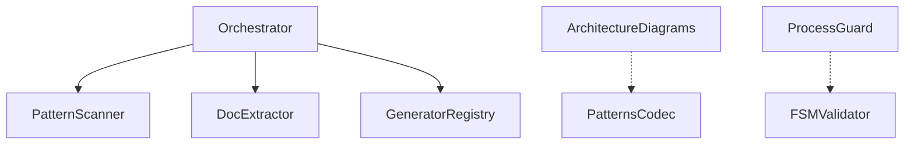

# @libar-dev/delivery-process

**A source-first delivery process where everything is code.**

Turn TypeScript annotations and Gherkin feature files into **living documentation**, **architecture diagrams**, **dependency graphs**, **traceability matrices**, and **enforced delivery workflows**.

[](https://www.npmjs.com/package/@libar-dev/delivery-process)
[](https://github.com/libar-dev/delivery-process/actions)
[](https://opensource.org/licenses/MIT)
[](https://nodejs.org/)

> **Pre-release v0.1.0-pre.0** - This is an early release. We welcome feedback and contributions.

## What You Get

- **Living docs** generated directly from code and specs (no manual Markdown)
- **Architecture maps** with dependency and relationship graphs (Mermaid)
- **Roadmap enforcement** via a finite-state workflow guard
- **Traceability** from roadmap -> specs -> code
- **AI-native APIs** for typed queries and agent context

## Why Source-First?

Traditional docs drift from code. This package makes **code the single source of truth**:

| Aspect             | Traditional Docs             | Source-First (This Package)                       |
| ------------------ | ---------------------------- | ------------------------------------------------- |
| **Source**         | Separate Markdown/Confluence | Annotations in TypeScript + Gherkin feature files |
| **Freshness**      | Manual updates -> drift      | Always generated -> always current                |
| **Enforcement**    | Guidelines                   | FSM-enforced workflow (roadmap -> active -> done) |
| **Traceability**   | Manual links                 | Rich relationships (implements, uses, depends-on) |
| **AI Integration** | Parse Markdown               | Direct typed ProcessStateAPI queries              |

## How It Works

**Feature files** own planning metadata (status, phase, effort, depends-on):

```gherkin
@libar-docs
@libar-docs-pattern:ArchitectureDiagramGeneration
@libar-docs-status:roadmap
@libar-docs-phase:23
@libar-docs-effort:1w
Feature: Architecture Diagram Generation
```

**TypeScript files** own implementation relationships:

```typescript
/**
 * @libar-docs
 * @libar-docs-pattern Pattern Scanner
 * @libar-docs-status completed
 * @libar-docs-uses glob, AST Parser
 * @libar-docs-used-by Doc Extractor, Orchestrator
 */
export async function scanPatterns(...) { ... }
```

## Quick Start

### 1. Install

```bash
npm install @libar-dev/delivery-process@pre
# or pnpm add @libar-dev/delivery-process@pre
```

**Requirements:** Node.js >= 18.0.0 (ESM only)

### 2. Annotate Your Code

```typescript
/** @libar-docs */

/**
 * @libar-docs-pattern Pattern Scanner
 * @libar-docs-status completed
 * @libar-docs-uses AST Parser, Tag Registry
 */
export class PatternScanner { ... }
```

### 3. Generate Docs

```bash
npx generate-docs -g patterns,roadmap -i "src/**/*.ts" -o docs -f
```

### 4. Enforce Workflow (Pre-commit Hook)

```bash
npx lint-process --staged
```

See [docs/INDEX.md](docs/INDEX.md) for full navigation.

## CLI Commands

| Command                 | Purpose                                       |
| ----------------------- | --------------------------------------------- |
| `generate-docs`         | Generate documentation from annotated sources |
| `lint-patterns`         | Validate annotation quality                   |
| `lint-process`          | Validate delivery workflow (pre-commit hooks) |
| `validate-patterns`     | Cross-source validation with DoD checks       |
| `generate-tag-taxonomy` | Generate tag reference from TypeScript source |

## ProcessStateAPI - For AI Agents

Give your AI assistant typed queries instead of making it parse Markdown:

```typescript
import {
  generators,
  api as apiModule,
  createDefaultTagRegistry,
} from '@libar-dev/delivery-process';

const tagRegistry = createDefaultTagRegistry();
const dataset = generators.transformToMasterDataset({
  patterns: extractedPatterns,
  tagRegistry,
});
const api = apiModule.createProcessStateAPI(dataset);

// Status queries
api.getCurrentWork(); // Active patterns
api.getRoadmapItems(); // Available to start
api.getCompletionPercentage(); // Overall progress

// Relationship queries
api.getPatternDependencies('Orchestrator'); // What it uses
api.getPatternRelationships('Orchestrator'); // All relationships
api.getRelatedPatterns('PatternScanner'); // Everything connected

// Workflow queries
api.isValidTransition('roadmap', 'active');
api.getProtectionInfo('completed'); // { level: 'hard', requiresUnlock: true }
```

## Rich Relationship Model

The package supports a full taxonomy of relationships:

| Relationship   | Tag(s)                               | Arrow Style | Meaning                         |
| -------------- | ------------------------------------ | ----------- | ------------------------------- |
| Realization    | `@libar-docs-implements`             | `..>`       | Code realizes a pattern spec    |
| Generalization | `@libar-docs-extends`                | `-->>`      | Pattern extends another         |
| Dependency     | `@libar-docs-uses` / `used-by`       | `-->`       | Technical coupling              |
| Sequencing     | `@libar-docs-depends-on` / `enables` | `-.->`      | Roadmap ordering                |
| Hierarchy      | `@libar-docs-parent` / `level`       | -           | Epic -> Phase -> Task           |
| Traceability   | `@libar-docs-executable-specs`       | `...>`      | Links tiers (roadmap <-> specs) |

Auto-generated dependency graph example:



## Configuration

```typescript
import { createDeliveryProcess } from '@libar-dev/delivery-process';

// Default: DDD-ES-CQRS preset (21 categories)
const dp = createDeliveryProcess();

// Generic preset (3 categories, simpler)
const dp = createDeliveryProcess({ preset: 'generic' });
```

| Preset                  | Tag Prefix     | Categories | Use Case                         |
| ----------------------- | -------------- | ---------- | -------------------------------- |
| `ddd-es-cqrs` (default) | `@libar-docs-` | 21         | DDD/Event Sourcing architectures |
| `generic`               | `@docs-`       | 3          | Simple projects                  |

## Documentation

- **[docs/INDEX.md](docs/INDEX.md)** - Documentation navigation hub
- **[docs/METHODOLOGY.md](docs/METHODOLOGY.md)** - Core thesis and FSM
- **[docs/PROCESS-GUARD.md](docs/PROCESS-GUARD.md)** - Workflow enforcement
- **[docs/GHERKIN-PATTERNS.md](docs/GHERKIN-PATTERNS.md)** - Writing effective specs
- **[docs/CONFIGURATION.md](docs/CONFIGURATION.md)** - Presets and custom tags
- **[INSTRUCTIONS.md](INSTRUCTIONS.md)** - Complete tag reference

## License

MIT © Libar AI
