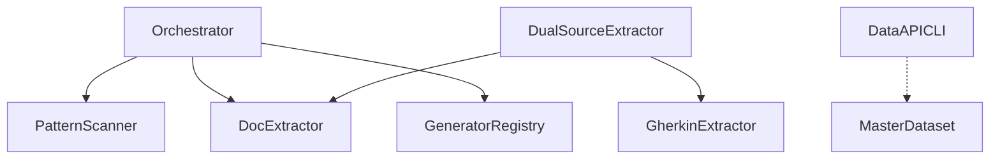

# @libar-dev/delivery-process

**A source-first delivery process where everything is code.**

Turn TypeScript annotations and Gherkin feature files into **living documentation**, **architecture diagrams**, **dependency graphs**, and **enforced delivery workflows**.

[](https://www.npmjs.com/package/@libar-dev/delivery-process)
[](https://github.com/libar-dev/delivery-process/actions)
[](https://opensource.org/licenses/MIT)
[](https://nodejs.org/)

> **Pre-release v0.1.0-pre.0** — We welcome feedback and contributions.

---

## The Problem

Documentation drifts from reality. Roadmaps get stale. Requirements live in Jira, code in GitHub, and status tracking in spreadsheets. When AI coding assistants need context, they parse Markdown files that may already be outdated.

Teams spend time **updating docs** instead of **updating code that generates docs**.

## The Solution

Make **code the single source of truth**:

| Aspect             | Traditional Docs             | Source-First (This Package)         |
| ------------------ | ---------------------------- | ----------------------------------- |
| **Source**         | Separate Markdown/Confluence | Annotations in code + Gherkin specs |
| **Freshness**      | Manual updates → drift       | Generated → always current          |
| **Enforcement**    | Guidelines (ignored)         | FSM-validated transitions           |
| **Traceability**   | Manual links                 | Auto-generated dependency graphs    |
| **AI Integration** | Parse stale Markdown         | CLI queries with typed JSON output  |

---

## Built for AI-Assisted Development

Traditional docs optimize for human reading. This package optimizes for **AI agent consumption**.

```bash
# Instead of: "Read ROADMAP.md and tell me what's active"
pnpm process:query -- query getCurrentWork

# Instead of: "Can we start working on TransformDataset?"
pnpm process:query -- query isValidTransition roadmap active

# Instead of: "What does DualSourceExtractor depend on?"
pnpm process:query -- dep-tree DualSourceExtractor
```

**Claude Code, Cursor, GitHub Copilot Workspace** — any AI that can run shell commands gets typed JSON access to your delivery state. No Markdown parsing. No context drift.

---

## Proven: Structured Specs Beat Human Prompts

This methodology was validated across **422 executable specifications** and a **8.8M line monorepo**. The results challenged assumptions about AI context management.

### The Discovery

| Metric                             | Traditional Prompts | Structured Specs                     |
| ---------------------------------- | ------------------- | ------------------------------------ |
| Context usage during heavy editing | ~100% (fills up)    | **50-65%** (stays low)               |
| After context compaction           | Breaks continuity   | **No impact** — results stay perfect |
| Work completed per session         | 1X baseline         | **5X increase**                      |
| Planning/decision overhead         | High                | **Near zero**                        |

### Why Structured Specs Work Better

Traditional AI prompts are verbose and imprecise:

```
"We need to implement a validation system that checks if status transitions
are valid according to the FSM rules defined in our methodology document.
It should handle the four states (roadmap, active, completed, deferred) and
validate that transitions follow the allowed paths..."
```

Structured specs are concise and typed:

```gherkin
Rule: Status transitions must follow FSM

  Scenario Outline: Valid transitions pass
    Given a file with status "<from>"
    When status changes to "<to>"
    Then validation passes

    Examples:
      | from    | to        |
      | roadmap | active    |
      | active  | completed |
```

**The AI understands structure better than prose.** Gherkin files compress into context more efficiently than explanatory paragraphs.

### Real Results: 3-Session MVP

The Process Guard validation system was implemented in 3 sessions using only structured specs as context:

| Session | Context Used      | Observation                                        |
| ------- | ----------------- | -------------------------------------------------- |
| 1       | 100% → compressed | Speed **increased** after compression              |
| 2       | **65%**           | First time context stayed low during heavy editing |
| 3       | **55%**           | Context actually **decreased** during work         |

### Implementation Sessions Become Mechanical

With structured specs:

- **No complicated planning** in implementation sessions
- **No decision-making overhead** — decisions live in specs
- **No prose explanations** — structured patterns are self-documenting
- **Context compaction doesn't break anything** — specs survive compression

> "Providing the specs and the implementation workflow doc is all that is needed."

This transforms implementation sessions from creative problem-solving to **mechanical spec-to-test transformation** — dramatically more reliable and 5X more productive.

### Before: Fighting AI-Generated Code with ESLint

Before structured specs, AI assistants generated patterns that violated architectural constraints. The "solution" was **106 custom ESLint rules**:

```
eslint-rules/
├── prevent-unsafe-patterns.ts      # 800+ lines catching AI mistakes
├── enforce-parallel-queries.ts     # AI forgot async patterns
├── no-action-wrapper-queries.ts    # AI mixed action/query contexts
├── require-query-bounds.ts         # AI forgot pagination
├── workflow-determinism/           # 13 rules for workflow safety
│   ├── no-date-now.ts
│   ├── no-math-random.ts
│   ├── no-process-env.ts
│   └── ... (10 more)
└── ... (90+ more rules)
```

Each rule required tests, maintenance, exception lists, and `@architectural-directive` comments scattered through code. **Constant whack-a-mole.**

### After: AI Understands Structured Patterns

With structured specs, the AI generates correct patterns _from the start_:

```gherkin
Rule: Workflow functions must be deterministic

  Scenario Outline: Non-deterministic calls are forbidden
    Given a workflow function
    When it calls "<forbidden>"
    Then compilation fails

    Examples:
      | forbidden       |
      | Date.now()      |
      | Math.random()   |
      | process.env     |
```

**Result:** 106 ESLint rules → 0. The AI reads the spec and generates deterministic code. No enforcement needed.

### Scale Validation

The methodology was proven on a complex monorepo:

```
Monorepo totals:
├── 8.8M lines of code
├── 43,949 files
├── 378 Gherkin feature files
├── 12,770 TypeScript files
└── Built in 3-4 weeks with this approach

delivery-process package:
├── 1.6M lines
├── 120 feature files
└── 422 executable specifications
```

---

## How It Works

This package documents itself using its own annotation system. Here's a real example from the codebase:

**TypeScript annotations** define pattern metadata and relationships:

```typescript
/**
 * @libar-docs
 * @libar-docs-pattern TransformDataset
 * @libar-docs-status completed
 * @libar-docs-uses MasterDataset, ExtractedPattern, TagRegistry
 * @libar-docs-used-by Orchestrator
 *
 * ## TransformDataset - Single-Pass Pattern Transformation
 *
 * Transforms raw extracted patterns into a MasterDataset with all
 * pre-computed views in a single O(n) pass.
 */
export function transformToMasterDataset(input: TransformInput): MasterDataset {
  // ...
}
```

**Gherkin feature files** own planning metadata:

```gherkin
@libar-docs
@libar-docs-pattern:TransformDataset
@libar-docs-status:completed
@libar-docs-phase:12
Feature: Transform Dataset

  Background: Deliverables
    | Deliverable              | Status    |
    | Single-pass transformer  | completed |
    | Pre-computed views       | completed |

  Scenario: Transform patterns to MasterDataset
    Given extracted patterns from TypeScript and Gherkin
    When I call transformToMasterDataset
    Then I get a MasterDataset with status, phase, and category groups
```

**Run the generator:**

```bash
npx generate-docs -g patterns -i "src/**/*.ts" --features "specs/**/*.feature" -o docs -f
```

**Get living documentation** — pattern registries, dependency graphs, roadmaps — all generated from your annotated source.

---

## Quick Start

### 1. Install

```bash
# npm
npm install @libar-dev/delivery-process@pre

# pnpm (recommended)
pnpm add @libar-dev/delivery-process@pre

# yarn
yarn add @libar-dev/delivery-process@pre
```

**Requirements:**

- Node.js >= 18.0.0
- ESM project (`"type": "module"` in package.json)

### 2. Annotate Your Code

Add opt-in marker and pattern metadata:

```typescript
/** @docs */

/**
 * @docs-pattern UserAuthentication
 * @docs-status roadmap
 * @docs-uses SessionManager, TokenValidator
 *
 * ## User Authentication
 *
 * Handles user login, logout, and session management.
 */
export class UserAuthentication {
  // ...
}
```

> **Note:** Tag prefix is configurable. Default generic preset uses `@docs-*`. See [Configuration](#configuration).

### 3. Generate Documentation

```bash
npx generate-docs -g patterns -i "src/**/*.ts" -o docs -f
```

### 4. Enforce Workflow (Pre-commit Hook)

```bash
npx lint-process --staged
```

This validates FSM transitions and blocks invalid status changes.

---

## CLI Commands

| Command                 | Purpose                                                |
| ----------------------- | ------------------------------------------------------ |
| `generate-docs`         | Generate documentation from annotated sources          |
| `lint-patterns`         | Validate annotation quality (missing tags, etc.)       |
| `lint-process`          | Validate delivery workflow FSM transitions             |
| `validate-patterns`     | Cross-source validation with Definition of Done checks |
| `generate-tag-taxonomy` | Generate tag reference from TypeScript taxonomy        |

See [INSTRUCTIONS.md](INSTRUCTIONS.md) for full CLI reference.

---

## Design-First Development

The package enforces a clear separation between **design artifacts** and **production code**.

### The Problem with Design Stubs in src/

Many projects mix design artifacts with production code:

```javascript
// eslint.config.js — Don't do this
{
  files: ["**/src/durability/intentCompletion.ts"],
  rules: { "@typescript-eslint/no-unused-vars": "off" }  // ESLint exceptions for "not-yet-real" code
}
```

This causes confusion, accidental imports of unimplemented code, and maintenance burden.

### The Solution: Design Artifacts Outside src/

| Location                                     | Content                                       | ESLint     | When Moved             |
| -------------------------------------------- | --------------------------------------------- | ---------- | ---------------------- |
| `delivery-process/stubs/{pattern-name}/*.ts` | API shapes, interfaces, throw-not-implemented | Excluded   | Implementation session |
| `src/**/*.ts`                                | **Production code only**                      | Full rules | Already there          |

**Design stub pattern:**

```typescript
// delivery-process/stubs/my-feature/my-feature.ts
/**
 * @libar-docs
 * @libar-docs-status roadmap
 * @libar-docs-implements MyFeature
 *
 * ## My Feature - Design Stub
 *
 * API design for the upcoming feature.
 * Target: src/path/to/final/location.ts
 */
export interface MyConfig {
  timeout: number;
}

export function myFeature(config: MyConfig): Result {
  throw new Error('MyFeature not yet implemented - roadmap pattern');
}
```

**Benefits:**

- No ESLint exceptions needed — stubs are excluded from linting
- Clear separation: `delivery-process/stubs/` = design, `src/` = production
- Safe iteration on API shapes without breaking anything
- Moving to `src/` signals implementation started

---

## FSM-Enforced Workflow

Status transitions are **validated programmatically**, not just documented:

```
roadmap ──→ active ──→ completed
    │          │
    │          ↓
    │       roadmap (blocked/regressed)
    ↓
deferred ──→ roadmap
```

| State       | Protection Level | What's Allowed                           |
| ----------- | ---------------- | ---------------------------------------- |
| `roadmap`   | None             | Full editing                             |
| `active`    | **Scope-locked** | Implementation only, no new deliverables |
| `completed` | **Hard-locked**  | Requires `@docs-unlock-reason` to modify |
| `deferred`  | None             | Full editing                             |

**Pre-commit enforcement:**

```bash
# In package.json scripts
"lint:process": "lint-process --staged"

# Or in .husky/pre-commit
npx lint-process --staged
```

Invalid transitions are **rejected at commit time** — not discovered weeks later.

---

## Data API CLI

For AI coding sessions, use the CLI to query delivery state directly from annotated sources:

```bash
# Status overview
pnpm process:query -- overview

# What's currently being worked on?
pnpm process:query -- query getCurrentWork

# Session context bundle for a pattern
pnpm process:query -- context MyPattern --session design

# FSM transition check
pnpm process:query -- query isValidTransition roadmap active

# Dependency tree
pnpm process:query -- dep-tree Orchestrator
```

| Approach                 | Context Cost | Accuracy              | Speed   |
| ------------------------ | ------------ | --------------------- | ------- |
| Parse generated Markdown | High         | Snapshot at gen time  | Slow    |
| **Data API CLI**         | Low          | Real-time from source | Instant |

---

## Rich Relationship Model

The package supports a full taxonomy of relationships:

| Relationship | Tag(s)                               | Meaning              |
| ------------ | ------------------------------------ | -------------------- |
| Dependency   | `@docs-uses` / `@docs-used-by`       | Technical coupling   |
| Sequencing   | `@docs-depends-on` / `@docs-enables` | Roadmap ordering     |
| Hierarchy    | `@docs-parent` / `@docs-level`       | Epic → Phase → Task  |
| Realization  | `@docs-implements`                   | Code realizes a spec |

Auto-generated Mermaid dependency graph:



---

## How It Compares

| Tool                 | Living Docs | FSM Enforcement | AI API | Code-First | Context Efficient |
| -------------------- | ----------- | --------------- | ------ | ---------- | ----------------- |
| **This package**     | ✓           | ✓               | ✓      | ✓          | ✓ (50-65%)        |
| Backstage            | ✓           | ✗               | ✗      | ✗ (YAML)   | ✗                 |
| Notion/Confluence    | ✗           | ✗               | ✗      | ✗          | ✗                 |
| Docusaurus/VitePress | ✗           | ✗               | ✗      | Partial    | ✗                 |
| Gherkin Living Doc   | ✓           | ✗               | ✗      | ✓          | Partial           |
| Human prompts to AI  | ✗           | ✗               | ✗      | ✗          | ✗ (100%)          |

**Key differentiators:**

- **FSM enforcement** — Not just docs; validated state machine transitions
- **Dual-source** — TypeScript relationships + Gherkin planning = complete picture
- **AI-native** — CLI provides typed JSON queries, not string parsing
- **Context efficient** — Structured specs use 50-65% context vs 100% for prose prompts
- **Compaction resilient** — Specs survive context compression; prose doesn't

**Note on AI models:** This methodology was validated primarily with Claude Opus 4.5. The structured spec approach appears to leverage advanced pattern-recognition capabilities particularly well.

---

## Document Durability Model

Not all specs are equal. The package recognizes different durability levels:

| Document Type               | Durability | After Implementation           | Content Ownership           |
| --------------------------- | ---------- | ------------------------------ | --------------------------- |
| **Decision docs (ADR/PDR)** | Permanent  | Remains valid until superseded | Intro, context, rationale   |
| **Behavior specs**          | Permanent  | Must pass tests                | Rules, examples, edge cases |
| **Tier 1 roadmap specs**    | Temporary  | Becomes clutter                | Deliverables (until done)   |
| **Generated docs**          | Derived    | Regenerated from sources       | —                           |

### Why This Matters

**Decisions own "why"** — they're durable by design:

```gherkin
Rule: Context - Why we need FSM validation
  # This content remains valid for years

Rule: Decision - How FSM validation works
  # Implementation details that rarely change
```

**Behavior specs own "what"** — they're tested:

```gherkin
Scenario: Invalid transition fails
  Given status "roadmap"
  When changing to "completed"
  Then validation fails  # If this breaks, tests fail
```

**Tier 1 specs own "when"** — they're temporary:

```gherkin
Background: Deliverables
  | Deliverable | Status |
  | FSM types   | Done   |  # Tracking until completion
```

This hierarchy enables **documentation generation from durable sources** — decisions and behavior specs stay current; tier 1 specs can be archived.

---

## Use Cases

| Scenario                       | How This Package Helps                    |
| ------------------------------ | ----------------------------------------- |
| **Multi-phase roadmaps**       | FSM-enforced status transitions           |
| **AI coding sessions**         | Data API CLI for typed context            |
| **Documentation generation**   | Mermaid diagrams, pattern registries      |
| **Traceability requirements**  | Two-tier specs link planning to code      |
| **Pre-commit validation**      | `lint-process` blocks invalid transitions |
| **Architecture documentation** | Auto-generated dependency graphs          |

---

## Configuration

```typescript
// delivery-process.config.ts
import { defineConfig } from '@libar-dev/delivery-process/config';

// Libar-generic preset (default) — this package uses it
export default defineConfig({
  preset: 'libar-generic',
  sources: { typescript: ['src/**/*.ts'], features: ['specs/*.feature'] },
  output: { directory: 'docs-generated', overwrite: true },
});

// DDD-ES-CQRS preset — complex domain architectures
export default defineConfig({
  preset: 'ddd-es-cqrs',
  sources: { typescript: ['packages/*/src/**/*.ts'] },
});

// Generic preset — shorter tag names (@docs-* prefix)
export default defineConfig({
  preset: 'generic',
  sources: { typescript: ['src/**/*.ts'] },
});
```

| Preset                    | Tag Prefix      | Categories | Use Case                           |
| ------------------------- | --------------- | ---------- | ---------------------------------- |
| `libar-generic` (default) | `@libar-docs-*` | 3          | Simple projects (this package)     |
| `ddd-es-cqrs`             | `@libar-docs-*` | 21         | DDD/Event Sourcing architectures   |
| `generic`                 | `@docs-*`       | 3          | Simple projects with @docs- prefix |

See [docs/CONFIGURATION.md](docs/CONFIGURATION.md) for custom presets.

---

## Documentation

**[docs/INDEX.md](docs/INDEX.md)** provides a complete table of contents with section links, line numbers, and reading paths by role.

**Start here:**

| Document                               | When to read                 |
| -------------------------------------- | ---------------------------- |
| [README](README.md)                    | Installation and quick start |
| [CONFIGURATION](docs/CONFIGURATION.md) | Setting up presets and tags  |
| [METHODOLOGY](docs/METHODOLOGY.md)     | Understanding the "why"      |

**Go deeper:**

| Document                                     | Audience   | Focus                     |
| -------------------------------------------- | ---------- | ------------------------- |
| [ARCHITECTURE](docs/ARCHITECTURE.md)         | Developers | Pipeline, codecs, schemas |
| [SESSION-GUIDES](docs/SESSION-GUIDES.md)     | AI/Devs    | Day-to-day workflows      |
| [GHERKIN-PATTERNS](docs/GHERKIN-PATTERNS.md) | Writers    | Writing effective specs   |
| [PROCESS-GUARD](docs/PROCESS-GUARD.md)       | Team Leads | FSM enforcement rules     |
| [VALIDATION](docs/VALIDATION.md)             | CI/CD      | Automated quality checks  |
| [INSTRUCTIONS](INSTRUCTIONS.md)              | Reference  | Tag and CLI reference     |

---

## Contributing

We welcome contributions! Please see our [contributing guidelines](CONTRIBUTING.md).

1. Fork the repository
2. Create a feature branch
3. Run tests: `pnpm test`
4. Submit a pull request

---

## License

MIT © Libar AI
