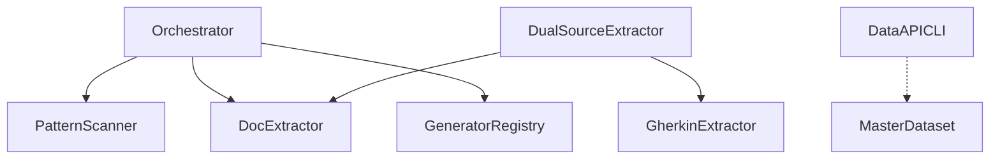

# @libar-dev/delivery-process

**Context engineering for AI-assisted codebases.**

Turn TypeScript annotations and Gherkin specs into a **structured, queryable delivery state** — living documentation, architecture graphs, and FSM-enforced workflows that AI agents consume without hallucinating.

[](https://www.npmjs.com/package/@libar-dev/delivery-process)
[](https://github.com/libar-dev/delivery-process/actions)
[](https://opensource.org/licenses/MIT)
[](https://nodejs.org/)
[](https://docs.npmjs.com/generating-provenance-statements)

> **v1.0.0-pre.0** — Pre-release for validation. We welcome feedback and contributions.

---

## Why This Exists

AI coding agents (Claude Code, Cursor, Copilot Workspace) need architectural context to generate correct code. Today they scrape README files, parse stale Markdown, and guess at relationships — leading to hallucinated imports, violated patterns, and wasted context windows.

This package makes **code the single source of truth** for both humans and machines:

| Aspect             | Traditional Docs             | Context Engineering (This Package)  |
| ------------------ | ---------------------------- | ----------------------------------- |
| **Source**         | Separate Markdown/Confluence | Annotations in code + Gherkin specs |
| **Freshness**      | Manual updates → drift       | Generated → always current          |
| **Enforcement**    | Guidelines (ignored)         | FSM-validated transitions           |
| **Traceability**   | Manual links                 | Auto-generated dependency graphs    |
| **AI Integration** | Parse stale Markdown         | CLI queries with typed JSON output  |

---

## Built for AI-Assisted Development

Traditional docs optimize for human reading. This package optimizes for **AI agent consumption**.

```bash
# Instead of: "Read ROADMAP.md and tell me what's active"
pnpm process:query -- query getCurrentWork

# Instead of: "Can we start working on TransformDataset?"
pnpm process:query -- query isValidTransition roadmap active

# Instead of: "What does DualSourceExtractor depend on?"
pnpm process:query -- dep-tree DualSourceExtractor
```

**Claude Code, Cursor, GitHub Copilot Workspace** — any AI that can run shell commands gets typed JSON access to your delivery state. No Markdown parsing. No context drift. No hallucinated relationships.

---

## Quick Start

### 1. Install

```bash
# npm
npm install @libar-dev/delivery-process@pre

# pnpm (recommended)
pnpm add @libar-dev/delivery-process@pre

# yarn
yarn add @libar-dev/delivery-process@pre
```

**Requirements:**

- Node.js >= 18.0.0
- ESM project (`"type": "module"` in package.json)

### 2. Annotate Your Code

Add opt-in marker and pattern metadata:

```typescript
/** @docs */

/**
 * @docs-pattern UserAuthentication
 * @docs-status roadmap
 * @docs-uses SessionManager, TokenValidator
 *
 * ## User Authentication
 *
 * Handles user login, logout, and session management.
 */
export class UserAuthentication {
  // ...
}
```

> **Note:** Tag prefix is configurable. The `generic` preset uses `@docs-*` (shown above). The default `libar-generic` preset uses `@libar-docs-*`. See [Configuration](#configuration).

### 3. Generate Documentation

```bash
npx generate-docs -g patterns -i "src/**/*.ts" -o docs -f
```

### 4. Enforce Workflow (Pre-commit Hook)

```bash
npx lint-process --staged
```

This validates FSM transitions and blocks invalid status changes.

---

## How It Works

This package documents itself using its own annotation system. Here's a real example from the codebase:

**TypeScript annotations** define pattern metadata and relationships:

```typescript
/**
 * @libar-docs
 * @libar-docs-pattern TransformDataset
 * @libar-docs-status completed
 * @libar-docs-uses MasterDataset, ExtractedPattern, TagRegistry
 * @libar-docs-used-by Orchestrator
 *
 * ## TransformDataset - Single-Pass Pattern Transformation
 *
 * Transforms raw extracted patterns into a MasterDataset with all
 * pre-computed views in a single O(n) pass.
 */
export function transformToMasterDataset(input: TransformInput): MasterDataset {
  // ...
}
```

**Gherkin feature files** own planning metadata:

```gherkin
@libar-docs
@libar-docs-pattern:TransformDataset
@libar-docs-status:completed
@libar-docs-phase:12
Feature: Transform Dataset

  Background: Deliverables
    | Deliverable              | Status    |
    | Single-pass transformer  | completed |
    | Pre-computed views       | completed |

  Scenario: Transform patterns to MasterDataset
    Given extracted patterns from TypeScript and Gherkin
    When I call transformToMasterDataset
    Then I get a MasterDataset with status, phase, and category groups
```

**Run the generator:**

```bash
npx generate-docs -g patterns -i "src/**/*.ts" --features "specs/**/*.feature" -o docs -f
```

**Get living documentation** — pattern registries, dependency graphs, roadmaps — all generated from your annotated source.

**Pipeline:** `Config → Scanner → Extractor → Transformer → Codec` — files become patterns, patterns become a MasterDataset, the MasterDataset renders to Markdown and JSON.

---

## What Gets Generated

The codec pipeline produces rich, multi-format documents from a single config declaration. Every content block below is **derived from annotations** — not hand-authored:

| Content Block                     | Source                                         | Example                                                   |
| --------------------------------- | ---------------------------------------------- | --------------------------------------------------------- |
| **Convention tables**             | Gherkin `Rule:` Invariant/Rationale            | FSM protection levels, tag format types, source ownership |
| **Live Mermaid diagrams**         | `@docs-uses`, `@docs-depends-on` relationships | C4Context, sequence, class, state, flowchart (6 types)    |
| **API Types**                     | `@docs-shape` on TypeScript declarations       | Functions, interfaces, constants, type aliases with JSDoc |
| **Behavior specifications**       | Feature descriptions + `Rule:` blocks          | Collapsible rules with verified-by scenario lists         |
| **Architecture decision records** | Decision feature files                         | Context/Decision/Consequences with structured tables      |
| **Roadmap & status tracking**     | `@docs-status`, `@docs-phase` tags             | Phase progress, deliverable tables, completion metrics    |

**Config-driven generation:** A single `ReferenceDocConfig` object produces a complete reference document — convention tables, scoped diagrams, extracted types, and behavior specs composed automatically. 13 configs produce 27 generators (detailed + AI-compact pairs).

**See it live:** [docs-live/product-areas/](docs-live/product-areas/) contains 7 generated product area documents with live Mermaid diagrams and extracted API types — all from annotations in this codebase.

---

## CLI Commands

| Command                 | Purpose                                                | Docs                                      |
| ----------------------- | ------------------------------------------------------ | ----------------------------------------- |
| `generate-docs`         | Generate documentation from annotated sources          | See flags below                           |
| `process-api`           | Query delivery state for AI coding sessions            | [PROCESS-API.md](docs/PROCESS-API.md)     |
| `lint-patterns`         | Validate annotation quality (missing tags, etc.)       | [VALIDATION.md](docs/VALIDATION.md)       |
| `lint-process`          | Validate delivery workflow FSM transitions             | [PROCESS-GUARD.md](docs/PROCESS-GUARD.md) |
| `lint-steps`            | Validate vitest-cucumber feature/step compatibility    | [VALIDATION.md](docs/VALIDATION.md)       |
| `validate-patterns`     | Cross-source validation with Definition of Done checks | [VALIDATION.md](docs/VALIDATION.md)       |
| `generate-tag-taxonomy` | _(Deprecated)_ Generate tag reference from taxonomy    | See flags below                           |

### generate-docs

Generate documentation from annotated sources.

```bash
generate-docs [options]
```

| Flag                         | Short | Description                                    | Default             |
| ---------------------------- | ----- | ---------------------------------------------- | ------------------- |
| `--input <pattern>`          | `-i`  | Glob pattern for TypeScript files (repeatable) | from config         |
| `--generators <names>`       | `-g`  | Generator names (comma-separated)              | `patterns`          |
| `--features <pattern>`       |       | Glob pattern for Gherkin files                 | -                   |
| `--exclude <pattern>`        | `-e`  | Exclude pattern (repeatable)                   | -                   |
| `--output <dir>`             | `-o`  | Output directory                               | `docs/architecture` |
| `--base-dir <path>`          | `-b`  | Base directory                                 | cwd                 |
| `--overwrite`                | `-f`  | Overwrite existing files                       | false               |
| `--workflow <file>`          | `-w`  | Workflow config JSON file                      | -                   |
| `--list-generators`          |       | List available generators                      | -                   |
| `--git-diff-base <branch>`   |       | PR Changes: base branch for diff               | -                   |
| `--changed-files <file>`     |       | PR Changes: explicit file list                 | -                   |
| `--release-filter <version>` |       | PR Changes: filter by release                  | -                   |

```bash
# Generate pattern docs
generate-docs -g patterns -i "src/**/*.ts" -o docs -f

# List all available generators
generate-docs --list-generators

# Generate with Gherkin specs
generate-docs -g patterns -i "src/**/*.ts" --features "specs/**/*.feature" -o docs -f
```

### generate-tag-taxonomy

> **Deprecated:** Use `generate-docs -g taxonomy` instead for codec-based generation with progressive disclosure. This standalone command will be removed in a future version.

Generate a complete tag reference document from the TypeScript taxonomy source.

```bash
generate-tag-taxonomy [options]
```

| Flag               | Short | Description             | Default                             |
| ------------------ | ----- | ----------------------- | ----------------------------------- |
| `--output <path>`  | `-o`  | Output file path        | `docs/architecture/TAG_TAXONOMY.md` |
| `--overwrite`      | `-f`  | Overwrite existing file | false                               |
| `--base-dir <dir>` | `-b`  | Base directory          | cwd                                 |

```bash
npx generate-tag-taxonomy -o TAG_TAXONOMY.md -f
```

For tag concepts and taxonomy architecture, see [docs/TAXONOMY.md](docs/TAXONOMY.md).

---

## Proven at Scale

This methodology was validated across **422 executable specifications** and an **8.8M line monorepo** (43,949 files). The results challenged assumptions about AI context management.

### The Discovery

| Metric                             | Traditional Prompts | Structured Specs                     |
| ---------------------------------- | ------------------- | ------------------------------------ |
| Context usage during heavy editing | ~100% (fills up)    | **50-65%** (stays low)               |
| After context compaction           | Breaks continuity   | **No impact** — results stay perfect |
| Work completed per session         | 1X baseline         | **5X increase**                      |
| Planning/decision overhead         | High                | **Near zero**                        |

### Why It Works

Traditional AI prompts are verbose and imprecise. Structured specs are concise and typed:

```gherkin
Rule: Status transitions must follow FSM

  Scenario Outline: Valid transitions pass
    Given a file with status "<from>"
    When status changes to "<to>"
    Then validation passes

    Examples:
      | from    | to        |
      | roadmap | active    |
      | active  | completed |
```

**The AI understands structure better than prose.** Gherkin files compress into context more efficiently than explanatory paragraphs.

### Real Results: 3-Session MVP

The Process Guard validation system was implemented in 3 sessions using only structured specs as context:

| Session | Context Used      | Observation                                        |
| ------- | ----------------- | -------------------------------------------------- |
| 1       | 100% → compressed | Speed **increased** after compression              |
| 2       | **65%**           | First time context stayed low during heavy editing |
| 3       | **55%**           | Context actually **decreased** during work         |

### Before/After: ESLint Rules

Before structured specs, AI assistants generated patterns that violated architectural constraints. The workaround was **106 custom ESLint rules** — each requiring tests, maintenance, and exception lists. With structured specs, the AI reads the spec and generates correct patterns from the start. **106 ESLint rules → 0.**

---

## FSM-Enforced Workflow

Status transitions are **validated programmatically**, not just documented:

```
roadmap ──→ active ──→ completed
    │          │
    │          ↓
    │       roadmap (blocked/regressed)
    ↓
deferred ──→ roadmap
```

| State       | Protection Level | What's Allowed                           |
| ----------- | ---------------- | ---------------------------------------- |
| `roadmap`   | None             | Full editing                             |
| `active`    | **Scope-locked** | Implementation only, no new deliverables |
| `completed` | **Hard-locked**  | Requires `@docs-unlock-reason` to modify |
| `deferred`  | None             | Full editing                             |

**Pre-commit enforcement:**

```bash
# In package.json scripts
"lint:process": "lint-process --staged"

# Or in .husky/pre-commit
npx lint-process --staged
```

Invalid transitions are **rejected at commit time** — not discovered weeks later.

---

## Data API CLI

For AI coding sessions, use the CLI to query delivery state directly from annotated sources:

```bash
# Status overview
pnpm process:query -- overview

# What's currently being worked on?
pnpm process:query -- query getCurrentWork

# Session context bundle for a pattern
pnpm process:query -- context MyPattern --session design

# FSM transition check
pnpm process:query -- query isValidTransition roadmap active

# Dependency tree
pnpm process:query -- dep-tree Orchestrator
```

| Approach                 | Context Cost | Accuracy              | Speed   |
| ------------------------ | ------------ | --------------------- | ------- |
| Parse generated Markdown | High         | Snapshot at gen time  | Slow    |
| **Data API CLI**         | Low          | Real-time from source | Instant |

---

## Rich Relationship Model

The package supports a full taxonomy of relationships:

| Relationship | Tag(s)                               | Meaning              |
| ------------ | ------------------------------------ | -------------------- |
| Dependency   | `@docs-uses` / `@docs-used-by`       | Technical coupling   |
| Sequencing   | `@docs-depends-on` / `@docs-enables` | Roadmap ordering     |
| Hierarchy    | `@docs-parent` / `@docs-level`       | Epic → Phase → Task  |
| Realization  | `@docs-implements`                   | Code realizes a spec |

Auto-generated Mermaid dependency graph:



---

## How It Compares

| Tool                       | Living Docs | FSM Enforcement | AI API | Code-First | AI Context Optimized |
| -------------------------- | ----------- | --------------- | ------ | ---------- | -------------------- |
| **This package**           | Yes         | Yes             | Yes    | Yes        | Yes (50-65%)         |
| Backstage                  | Yes         | No              | No     | No (YAML)  | No                   |
| Mintlify / GitBook         | Partial     | No              | No     | No         | No                   |
| Notion / Confluence        | No          | No              | No     | No         | No                   |
| Docusaurus / VitePress     | No          | No              | No     | Partial    | No                   |
| Gherkin Living Doc         | Yes         | No              | No     | Yes        | Partial              |
| CLAUDE.md / manual prompts | No          | No              | No     | No         | No (100%)            |

**Key differentiators:**

- **FSM enforcement** — Not just docs; validated state machine transitions at commit time
- **Dual-source** — TypeScript owns runtime relationships, Gherkin owns planning constraints = complete picture
- **AI-native** — CLI provides typed JSON queries, not string parsing
- **Context efficient** — Structured specs use 50-65% context vs 100% for prose prompts
- **Compaction resilient** — Specs survive context compression; prose doesn't

**Note on AI models:** This methodology was validated primarily with Claude (Anthropic). The structured spec approach benefits any LLM-based coding assistant, leveraging pattern-recognition capabilities particularly well.

---

## Design-First Development

The package enforces a clear separation between **design artifacts** (stubs in `delivery-process/stubs/`) and **production code** (in `src/`). Design stubs use `throw new Error('not yet implemented')` and are excluded from ESLint, avoiding the need for lint exceptions on unfinished code. See [docs/METHODOLOGY.md](docs/METHODOLOGY.md) for the full stub workflow.

---

## Document Durability Model

Not all specs are equal. Decision docs and behavior specs are **permanent** (tested, durable). Tier 1 roadmap specs are **temporary** (tracking until completion). Generated docs are **derived** (regenerated from source). This hierarchy enables documentation generation from durable sources — details in [docs/METHODOLOGY.md](docs/METHODOLOGY.md).

---

## Use Cases

| Scenario                       | How This Package Helps                    |
| ------------------------------ | ----------------------------------------- |
| **Multi-phase roadmaps**       | FSM-enforced status transitions           |
| **AI coding sessions**         | Data API CLI for typed context            |
| **Documentation generation**   | Mermaid diagrams, pattern registries      |
| **Traceability requirements**  | Two-tier specs link planning to code      |
| **Pre-commit validation**      | `lint-process` blocks invalid transitions |
| **Architecture documentation** | Auto-generated dependency graphs          |

---

## Configuration

```typescript
// delivery-process.config.ts
import { defineConfig } from '@libar-dev/delivery-process/config';

// Libar-generic preset (default) — this package uses it
export default defineConfig({
  preset: 'libar-generic',
  sources: { typescript: ['src/**/*.ts'], features: ['specs/*.feature'] },
  output: { directory: 'docs-generated', overwrite: true },
});

// DDD-ES-CQRS preset — complex domain architectures
export default defineConfig({
  preset: 'ddd-es-cqrs',
  sources: { typescript: ['packages/*/src/**/*.ts'] },
});

// Generic preset — shorter tag names (@docs-* prefix)
export default defineConfig({
  preset: 'generic',
  sources: { typescript: ['src/**/*.ts'] },
});
```

| Preset                    | Tag Prefix      | Categories | Use Case                           |
| ------------------------- | --------------- | ---------- | ---------------------------------- |
| `libar-generic` (default) | `@libar-docs-*` | 3          | Simple projects (this package)     |
| `ddd-es-cqrs`             | `@libar-docs-*` | 21         | DDD/Event Sourcing architectures   |
| `generic`                 | `@docs-*`       | 3          | Simple projects with @docs- prefix |

See [docs/CONFIGURATION.md](docs/CONFIGURATION.md) for custom presets.

---

## Documentation

**[docs/INDEX.md](docs/INDEX.md)** provides a complete table of contents with section links, line numbers, and reading paths by role.

**Start here:**

| Document                               | When to read                 |
| -------------------------------------- | ---------------------------- |
| [README](README.md)                    | Installation and quick start |
| [CONFIGURATION](docs/CONFIGURATION.md) | Setting up presets and tags  |
| [METHODOLOGY](docs/METHODOLOGY.md)     | Understanding the "why"      |

**Go deeper:**

| Document                                     | Audience   | Focus                     |
| -------------------------------------------- | ---------- | ------------------------- |
| [ARCHITECTURE](docs/ARCHITECTURE.md)         | Developers | Pipeline, codecs, schemas |
| [SESSION-GUIDES](docs/SESSION-GUIDES.md)     | AI/Devs    | Day-to-day workflows      |
| [GHERKIN-PATTERNS](docs/GHERKIN-PATTERNS.md) | Writers    | Writing effective specs   |
| [PROCESS-GUARD](docs/PROCESS-GUARD.md)       | Team Leads | FSM enforcement rules     |
| [VALIDATION](docs/VALIDATION.md)             | CI/CD      | Automated quality checks  |
| [TAXONOMY](docs/TAXONOMY.md)                 | Reference  | Tag taxonomy and API      |

---

## License

MIT © Libar AI
