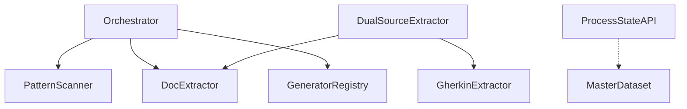

# @libar-dev/delivery-process

**A source-first delivery process where everything is code.**

Turn TypeScript annotations and Gherkin feature files into **living documentation**, **architecture diagrams**, **dependency graphs**, and **enforced delivery workflows**.

[](https://www.npmjs.com/package/@libar-dev/delivery-process)
[](https://github.com/libar-dev/delivery-process/actions)
[](https://opensource.org/licenses/MIT)
[](https://nodejs.org/)

> **Pre-release v0.1.0-pre.0** — We welcome feedback and contributions.

---

## The Problem

Documentation drifts from reality. Roadmaps get stale. Requirements live in Jira, code in GitHub, and status tracking in spreadsheets. When AI coding assistants need context, they parse Markdown files that may already be outdated.

Teams spend time **updating docs** instead of **updating code that generates docs**.

## The Solution

Make **code the single source of truth**:

| Aspect             | Traditional Docs             | Source-First (This Package)         |
| ------------------ | ---------------------------- | ----------------------------------- |
| **Source**         | Separate Markdown/Confluence | Annotations in code + Gherkin specs |
| **Freshness**      | Manual updates → drift       | Generated → always current          |
| **Enforcement**    | Guidelines (ignored)         | FSM-validated transitions           |
| **Traceability**   | Manual links                 | Auto-generated dependency graphs    |
| **AI Integration** | Parse stale Markdown         | Typed ProcessStateAPI queries       |

---

## Built for AI-Assisted Development

Traditional docs optimize for human reading. This package optimizes for **AI agent consumption**.

```typescript
import { createProcessStateAPI } from '@libar-dev/delivery-process';

const api = createProcessStateAPI(masterDataset);

// Instead of: "Read ROADMAP.md and tell me what's active"
api.getCurrentWork(); // → [{ name: "ProcessStateAPI", status: "active" }, ...]

// Instead of: "Can we start working on TransformDataset?"
api.isValidTransition('roadmap', 'active'); // → true

// Instead of: "What does DualSourceExtractor depend on?"
api.getPatternDependencies('DualSourceExtractor');
// → { uses: ["DocExtractor", "GherkinExtractor"], usedBy: ["Orchestrator"] }
```

**Claude Code, Cursor, GitHub Copilot Workspace** — any AI that can execute TypeScript gets typed access to your delivery state. No Markdown parsing. No context drift.

---

## How It Works

This package documents itself using its own annotation system. Here's a real example from the codebase:

**TypeScript annotations** define pattern metadata and relationships:

```typescript
/**
 * @libar-docs
 * @libar-docs-pattern TransformDataset
 * @libar-docs-status completed
 * @libar-docs-uses MasterDataset, ExtractedPattern, TagRegistry
 * @libar-docs-used-by Orchestrator
 *
 * ## TransformDataset - Single-Pass Pattern Transformation
 *
 * Transforms raw extracted patterns into a MasterDataset with all
 * pre-computed views in a single O(n) pass.
 */
export function transformToMasterDataset(input: TransformInput): MasterDataset {
  // ...
}
```

**Gherkin feature files** own planning metadata:

```gherkin
@libar-docs
@libar-docs-pattern:TransformDataset
@libar-docs-status:completed
@libar-docs-phase:12
Feature: Transform Dataset

  Background: Deliverables
    | Deliverable              | Status    |
    | Single-pass transformer  | completed |
    | Pre-computed views       | completed |

  Scenario: Transform patterns to MasterDataset
    Given extracted patterns from TypeScript and Gherkin
    When I call transformToMasterDataset
    Then I get a MasterDataset with status, phase, and category groups
```

**Run the generator:**

```bash
npx generate-docs -g patterns -i "src/**/*.ts" --features "specs/**/*.feature" -o docs -f
```

**Get living documentation** — pattern registries, dependency graphs, roadmaps — all generated from your annotated source.

---

## Quick Start

### 1. Install

```bash
# npm
npm install @libar-dev/delivery-process@pre

# pnpm (recommended)
pnpm add @libar-dev/delivery-process@pre

# yarn
yarn add @libar-dev/delivery-process@pre
```

**Requirements:**

- Node.js >= 18.0.0
- ESM project (`"type": "module"` in package.json)

### 2. Annotate Your Code

Add opt-in marker and pattern metadata:

```typescript
/** @docs */

/**
 * @docs-pattern UserAuthentication
 * @docs-status roadmap
 * @docs-uses SessionManager, TokenValidator
 *
 * ## User Authentication
 *
 * Handles user login, logout, and session management.
 */
export class UserAuthentication {
  // ...
}
```

> **Note:** Tag prefix is configurable. Default generic preset uses `@docs-*`. See [Configuration](#configuration).

### 3. Generate Documentation

```bash
npx generate-docs -g patterns -i "src/**/*.ts" -o docs -f
```

### 4. Enforce Workflow (Pre-commit Hook)

```bash
npx lint-process --staged
```

This validates FSM transitions and blocks invalid status changes.

---

## CLI Commands

| Command                 | Purpose                                                |
| ----------------------- | ------------------------------------------------------ |
| `generate-docs`         | Generate documentation from annotated sources          |
| `lint-patterns`         | Validate annotation quality (missing tags, etc.)       |
| `lint-process`          | Validate delivery workflow FSM transitions             |
| `validate-patterns`     | Cross-source validation with Definition of Done checks |
| `generate-tag-taxonomy` | Generate tag reference from TypeScript taxonomy        |

See [INSTRUCTIONS.md](INSTRUCTIONS.md) for full CLI reference.

---

## FSM-Enforced Workflow

Status transitions are **validated programmatically**, not just documented:

```
roadmap ──→ active ──→ completed
    │          │
    │          ↓
    │       roadmap (blocked/regressed)
    ↓
deferred ──→ roadmap
```

| State       | Protection Level | What's Allowed                           |
| ----------- | ---------------- | ---------------------------------------- |
| `roadmap`   | None             | Full editing                             |
| `active`    | **Scope-locked** | Implementation only, no new deliverables |
| `completed` | **Hard-locked**  | Requires `@docs-unlock-reason` to modify |
| `deferred`  | None             | Full editing                             |

**Pre-commit enforcement:**

```bash
# In package.json scripts
"lint:process": "lint-process --staged"

# Or in .husky/pre-commit
npx lint-process --staged
```

Invalid transitions are **rejected at commit time** — not discovered weeks later.

---

## ProcessStateAPI

For AI coding sessions, use typed queries instead of parsing generated Markdown:

```typescript
import {
  scanPatterns,
  extractPatterns,
  generators,
  api as apiModule,
  createDefaultTagRegistry,
} from '@libar-dev/delivery-process';

// 1. Scan and extract patterns
const scanned = await scanPatterns({ include: ['src/**/*.ts'] });
const extracted = await extractPatterns(scanned);

// 2. Build the dataset
const tagRegistry = createDefaultTagRegistry();
const dataset = generators.transformToMasterDataset({
  patterns: extracted,
  tagRegistry,
});

// 3. Create the API
const api = apiModule.createProcessStateAPI(dataset);

// Status queries
api.getCurrentWork(); // Active patterns
api.getRoadmapItems(); // Available to start
api.getCompletionPercentage(); // Overall progress

// FSM queries
api.isValidTransition('roadmap', 'active');
api.getProtectionInfo('completed'); // { level: 'hard', requiresUnlock: true }

// Relationship queries
api.getPatternDependencies('Orchestrator');
api.getRelatedPatterns('PatternScanner');
```

| Approach                 | Context Cost | Accuracy                    | Speed   |
| ------------------------ | ------------ | --------------------------- | ------- |
| Parse generated Markdown | High         | Snapshot at generation time | Slow    |
| **ProcessStateAPI**      | Low          | Real-time from source       | Instant |

---

## Rich Relationship Model

The package supports a full taxonomy of relationships:

| Relationship | Tag(s)                               | Meaning              |
| ------------ | ------------------------------------ | -------------------- |
| Dependency   | `@docs-uses` / `@docs-used-by`       | Technical coupling   |
| Sequencing   | `@docs-depends-on` / `@docs-enables` | Roadmap ordering     |
| Hierarchy    | `@docs-parent` / `@docs-level`       | Epic → Phase → Task  |
| Realization  | `@docs-implements`                   | Code realizes a spec |

Auto-generated Mermaid dependency graph:



---

## How It Compares

| Tool                 | Living Docs | FSM Enforcement | AI API | Code-First |
| -------------------- | ----------- | --------------- | ------ | ---------- |
| **This package**     | ✓           | ✓               | ✓      | ✓          |
| Backstage            | ✓           | ✗               | ✗      | ✗ (YAML)   |
| Notion/Confluence    | ✗           | ✗               | ✗      | ✗          |
| Docusaurus/VitePress | ✗           | ✗               | ✗      | Partial    |
| Gherkin Living Doc   | ✓           | ✗               | ✗      | ✓          |

**Key differentiators:**

- **FSM enforcement** — Not just docs; validated state machine transitions
- **Dual-source** — TypeScript relationships + Gherkin planning = complete picture
- **AI-native** — ProcessStateAPI provides typed queries, not string parsing

---

## Use Cases

| Scenario                       | How This Package Helps                    |
| ------------------------------ | ----------------------------------------- |
| **Multi-phase roadmaps**       | FSM-enforced status transitions           |
| **AI coding sessions**         | ProcessStateAPI for typed context         |
| **Documentation generation**   | Mermaid diagrams, pattern registries      |
| **Traceability requirements**  | Two-tier specs link planning to code      |
| **Pre-commit validation**      | `lint-process` blocks invalid transitions |
| **Architecture documentation** | Auto-generated dependency graphs          |

---

## Configuration

```typescript
import { createDeliveryProcess } from '@libar-dev/delivery-process';

// Libar-generic preset (default) — this package uses it
const dp = createDeliveryProcess();
// Tag prefix: @libar-docs-*
// Categories: core, api, infra

// DDD-ES-CQRS preset — complex domain architectures
const dp = createDeliveryProcess({ preset: 'ddd-es-cqrs' });
// Tag prefix: @libar-docs-*
// Categories: 21 domain-specific categories

// Generic preset — shorter tag names
const dp = createDeliveryProcess({ preset: 'generic' });
// Tag prefix: @docs-*
// Categories: core, api, infra
```

| Preset                    | Tag Prefix      | Categories | Use Case                           |
| ------------------------- | --------------- | ---------- | ---------------------------------- |
| `libar-generic` (default) | `@libar-docs-*` | 3          | Simple projects (this package)     |
| `ddd-es-cqrs`             | `@libar-docs-*` | 21         | DDD/Event Sourcing architectures   |
| `generic`                 | `@docs-*`       | 3          | Simple projects with @docs- prefix |

See [docs/CONFIGURATION.md](docs/CONFIGURATION.md) for custom presets.

---

## Documentation

**[docs/INDEX.md](docs/INDEX.md)** provides a complete table of contents with section links, line numbers, and reading paths by role.

**Start here:**

| Document                               | When to read                 |
| -------------------------------------- | ---------------------------- |
| [README](README.md)                    | Installation and quick start |
| [CONFIGURATION](docs/CONFIGURATION.md) | Setting up presets and tags  |
| [METHODOLOGY](docs/METHODOLOGY.md)     | Understanding the "why"      |

**Go deeper:**

| Document                                     | Audience   | Focus                     |
| -------------------------------------------- | ---------- | ------------------------- |
| [ARCHITECTURE](docs/ARCHITECTURE.md)         | Developers | Pipeline, codecs, schemas |
| [SESSION-GUIDES](docs/SESSION-GUIDES.md)     | AI/Devs    | Day-to-day workflows      |
| [GHERKIN-PATTERNS](docs/GHERKIN-PATTERNS.md) | Writers    | Writing effective specs   |
| [PROCESS-GUARD](docs/PROCESS-GUARD.md)       | Team Leads | FSM enforcement rules     |
| [VALIDATION](docs/VALIDATION.md)             | CI/CD      | Automated quality checks  |
| [INSTRUCTIONS](INSTRUCTIONS.md)              | Reference  | Tag and CLI reference     |

---

## Contributing

We welcome contributions! Please see our [contributing guidelines](CONTRIBUTING.md).

1. Fork the repository
2. Create a feature branch
3. Run tests: `pnpm test`
4. Submit a pull request

---

## License

MIT © Libar AI
