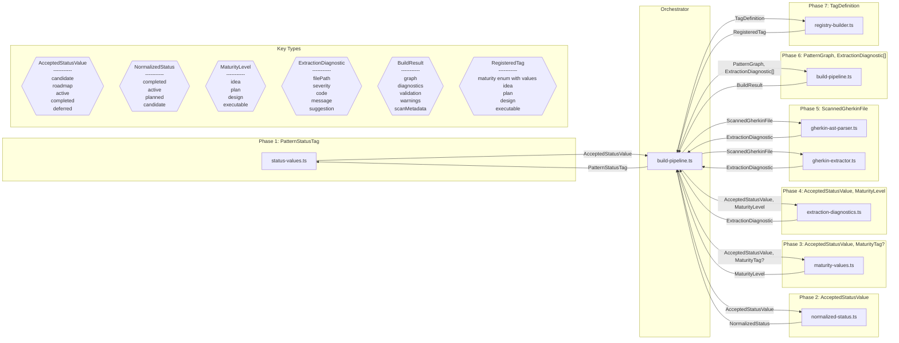

# Design Review: StatusMaturityExtraction

**Purpose:** Auto-generated design review with sequence and component diagrams
**Detail Level:** Design review artifact from sequence annotations

---

**Pattern:** StatusMaturityExtraction | **Phase:** Phase 49 | **Status:** completed | **Orchestrator:** build-pipeline | **Steps:** 7 | **Participants:** 8

**Source:** `architect/specs/status-maturity-extraction.feature`

---

## Annotation Convention

This design review is generated from the following annotations:

| Tag                   | Level    | Format | Purpose                            |
| --------------------- | -------- | ------ | ---------------------------------- |
| sequence-orchestrator | Feature  | value  | Identifies the coordinator module  |
| sequence-step         | Rule     | number | Explicit execution ordering        |
| sequence-module       | Rule     | csv    | Maps Rule to deliverable module(s) |
| sequence-error        | Scenario | flag   | Marks scenario as error/alt path   |

Description markers: `**Input:**` and `**Output:**` in Rule descriptions define data flow types for sequence diagram call arrows and component diagram edges.

---

## Sequence Diagram — Runtime Interaction Flow

Generated from: `@architect-sequence-step`, `@architect-sequence-module`, ``, `**Input:**`/`**Output:**`markers, and`@architect-sequence-orchestrator` on the Feature.

```mermaid
sequenceDiagram
    participant User
    participant build_pipeline as "build-pipeline.ts"
    participant status_values as "status-values.ts"
    participant normalized_status as "normalized-status.ts"
    participant maturity_values as "maturity-values.ts"
    participant extraction_diagnostics as "extraction-diagnostics.ts"
    participant gherkin_ast_parser as "gherkin-ast-parser.ts"
    participant gherkin_extractor as "gherkin-extractor.ts"
    participant registry_builder as "registry-builder.ts"

    User->>build_pipeline: invoke

    Note over build_pipeline: Rule 1 — `ACCEPTED_STATUS_VALUES` contains all `PROCESS_STATUS_VALUES` plus `candidate`. `AcceptedStatusValue` is the type used at extraction boundaries (registry builder, Zod schemas, parser, extractor). `ProcessStatusValue` is the type used by the FSM transition matrix, protection levels, and ProcessGuard. `PROCESS_STATUS_VALUES` remains a 4-element array. `ACCEPTED_STATUS_VALUES` becomes a 5-element array: `['candidate', ...PROCESS_STATUS_VALUES]`.

    build_pipeline->>+status_values: PatternStatusTag
    status_values-->>-build_pipeline: AcceptedStatusValue

    Note over build_pipeline: Rule 2 — `STATUS_NORMALIZATION_MAP` maps `candidate` to `candidate` (NOT `planned`). `NORMALIZED_STATUS_VALUES` expands from 3 to 4 values: completed, active, planned, candidate. `StatusGroupsSchema` gains a `candidate` array. `StatusCountsSchema` gains a `candidate` integer count. Completion percentage uses `completed / (total - candidate) * 100`.

    build_pipeline->>+normalized_status: AcceptedStatusValue
    normalized_status-->>-build_pipeline: NormalizedStatus

    Note over build_pipeline: Rule 3 — Every ExtractedPattern has a `maturity` field with one of four values: idea, plan, design, executable. When `@architect-maturity` is absent, the default is inferred from status: candidate defaults to idea, roadmap defaults to plan, active defaults to design, completed defaults to executable, deferred defaults to plan. An explicit `@architect-maturity` tag overrides the inferred default. Users only tag maturity when deviating from the default.

    build_pipeline->>+maturity_values: AcceptedStatusValue, MaturityTag?
    maturity_values-->>-build_pipeline: MaturityLevel

    Note over build_pipeline: Rule 4 — Certain status-maturity combinations are semantically contradictory and produce an extraction diagnostic at severity `warning` (not error): candidate cannot be design or executable (cannot be design+ without promotion), roadmap cannot be idea (cannot be idea without demotion), active must be design or executable (must be at least design-level), completed must be executable (must be at terminal maturity), deferred accepts plan or design only. Invalid patterns are still extracted — warning diagnostics do not block extraction. These warnings surface via `BuildResult.diagnostics` alongside other extraction diagnostics, NOT through the lint rule system in `src/lint/rules.ts`. The diagnostic code for invalid combinations is `invalid-maturity-combination`. Valid status-maturity combinations: - candidate: idea, plan - roadmap: plan, design - active: design, executable - completed: executable - deferred: plan, design

    build_pipeline->>+extraction_diagnostics: AcceptedStatusValue, MaturityLevel
    extraction_diagnostics-->>-build_pipeline: ExtractionDiagnostic

    alt Candidate with design maturity produces warning
        build_pipeline-->>User: error
        build_pipeline->>build_pipeline: exit(1)
    end

    alt Active with plan maturity produces warning
        build_pipeline-->>User: error
        build_pipeline->>build_pipeline: exit(1)
    end

    alt Deferred with executable maturity produces warning
        build_pipeline-->>User: error
        build_pipeline->>build_pipeline: exit(1)
    end

    Note over build_pipeline: Rule 5 — Five actively-emitted diagnostic codes exist: `unrecognized-status` (status value not in ACCEPTED_STATUS_VALUES), `missing-status` (gate tag present but no status tag), `missing-pattern-name` (gate tag present but no pattern tag), `invalid-enum-value` (any enum tag with unrecognized value), `invalid-maturity-combination` (status-maturity combination that is not semantically valid). `parse-failure` remains reserved in the diagnostic type and is owned by `GherkinParseFailureDiagnostics`. Each ExtractionDiagnostic includes filePath, severity (error/warning/info), code, message, and suggestion.

    build_pipeline->>+gherkin_ast_parser: ScannedGherkinFile
    gherkin_ast_parser-->>-build_pipeline: ExtractionDiagnostic
    build_pipeline->>+gherkin_extractor: ScannedGherkinFile
    gherkin_extractor-->>-build_pipeline: ExtractionDiagnostic

    alt Unrecognized status produces diagnostic with suggestion
        build_pipeline-->>User: error
        build_pipeline->>build_pipeline: exit(1)
    end

    alt Missing status produces diagnostic
        build_pipeline-->>User: error
        build_pipeline->>build_pipeline: exit(1)
    end

    alt Missing pattern name produces diagnostic
        build_pipeline-->>User: error
        build_pipeline->>build_pipeline: exit(1)
    end

    alt Invalid enum value on any tag produces diagnostic
        build_pipeline-->>User: error
        build_pipeline->>build_pipeline: exit(1)
    end

    Note over build_pipeline: Rule 6 — `buildPatternGraph()` returns `Result⟨BuildResult, PipelineError⟩` where `BuildResult` contains `graph`, `diagnostics`, `validation`, `warnings`, and `scanMetadata`. The `Result⟨⟩` monad wrapper is preserved for pipeline-level errors. All callers (orchestrator, CLI, MCP pipeline session) destructure the `BuildResult` to access graph and diagnostics. No file with a gate tag is silently dropped — every exclusion is captured in the diagnostics array.

    build_pipeline->>+build_pipeline: PatternGraph, ExtractionDiagnostic[]
    build_pipeline-->>-build_pipeline: BuildResult

    Note over build_pipeline: Rule 7 — `@architect-maturity` is registered in the registry builder as an enum tag with values idea, plan, design, executable. The tag is OPTIONAL at all conformance levels. When absent, `inferMaturity(status)` provides the default. `ExtractedPattern.maturity` is always populated (never undefined). The `byMaturity` pre-computed view groups patterns by maturity level for O(1) access.

    build_pipeline->>+registry_builder: TagDefinition
    registry_builder-->>-build_pipeline: RegisteredTag

```

---

## Component Diagram — Types and Data Flow

Generated from: `@architect-sequence-module` (nodes), `**Input:**`/`**Output:**` (edges and type shapes), deliverables table (locations), and `sequence-step` (grouping).

---

## Key Type Definitions

| Type                   | Fields                                                   | Produced By                                                   | Consumed By       |
| ---------------------- | -------------------------------------------------------- | ------------------------------------------------------------- | ----------------- |
| `AcceptedStatusValue`  | candidate, roadmap, active, completed, deferred          | status-values                                                 | normalized-status |
| `NormalizedStatus`     | completed, active, planned, candidate                    | normalized-status                                             |                   |
| `MaturityLevel`        | idea, plan, design, executable                           | maturity-values                                               |                   |
| `ExtractionDiagnostic` | filePath, severity, code, message, suggestion            | extraction-diagnostics, gherkin-ast-parser, gherkin-extractor |                   |
| `BuildResult`          | graph, diagnostics, validation, warnings, scanMetadata   | build-pipeline                                                |                   |
| `RegisteredTag`        | maturity enum with values idea, plan, design, executable | registry-builder                                              |                   |

---

## Design Questions

Verify these design properties against the diagrams above:

| #    | Question                             | Auto-Check                      | Diagram   |
| ---- | ------------------------------------ | ------------------------------- | --------- |
| DQ-1 | Is the execution ordering correct?   | 7 steps in monotonic order      | Sequence  |
| DQ-2 | Are all interfaces well-defined?     | 6 distinct types across 7 steps | Component |
| DQ-3 | Is error handling complete?          | 7 error paths identified        | Sequence  |
| DQ-4 | Is data flow unidirectional?         | Review component diagram edges  | Component |
| DQ-5 | Does validation prove the full path? | Review final step               | Both      |

---

## Findings

Record design observations from reviewing the diagrams above. Each finding should reference which diagram revealed it and its impact on the spec.

| #   | Finding                                     | Diagram Source | Impact on Spec |
| --- | ------------------------------------------- | -------------- | -------------- |
| F-1 | (Review the diagrams and add findings here) | —              | —              |

---

## Summary

The StatusMaturityExtraction design review covers 7 sequential steps across 8 participants with 6 key data types and 7 error paths.
