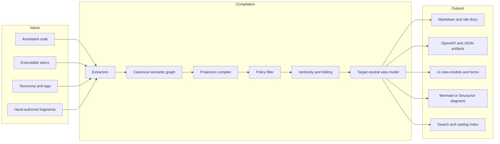
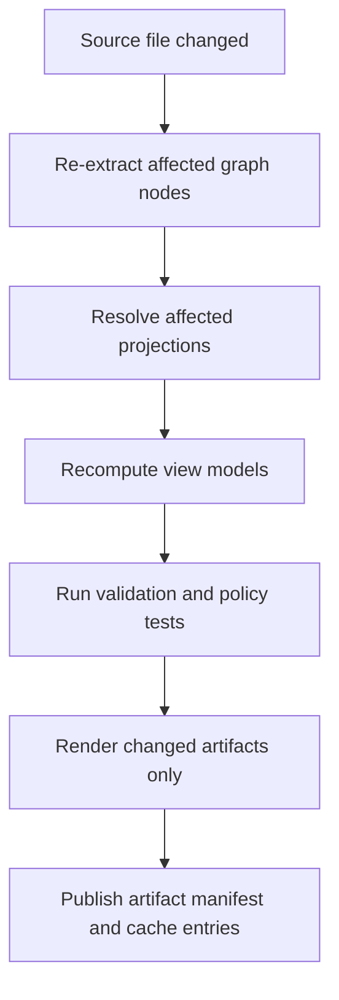

# Projection Architecture for Single Source Multi Audience Systems

## Executive summary

Your best design target is **not** a single all-powerful template engine. The strongest proven pattern across mature ecosystems is to separate the problem into four layers: a **canonical semantic model** built from source artifacts, **projection definitions** that select and transform that model, **policy and verbosity controls** that shape what different audiences may see, and **target-specific renderers** for APIs, docs, UI, and diagrams. That decomposition is already visible in mature systems: Smithy separates sources, imports, projections, transforms, selectors, and plugins; GraphQL separates schema, selection sets, fragments, and directives; DITA separates content reuse, key-based indirection, and conditional processing; Markdoc separates AST, validation, partials, variables, and renderers; Structurizr separates architecture model, views, documentation, and exports; JSON Forms separates data schema from UI schema; and OPA/OpenFGA separate policy decision logic from application logic. citeturn55view1turn56view0turn29view0turn21view0turn22view0turn22view2turn60view0turn19view1turn31view0turn33view1turn25view0turn38view0turn37view0

The practical implication for your repo is that **“projections” should be treated as compiled read models**. Microsoft’s CQRS guidance is a useful framing here: read models exist to return DTOs or projections optimized for the presentation layer, can use schemas different from the write model, and are often implemented as materialized views that can be regenerated when the source of truth changes. That is extremely close to what your “universal doc generator” wants to do for Markdown, UI, APIs, and live diagrams. citeturn53view0

For implementation, the most repo-applicable and lowest-regret architecture is:

1. **Extract** annotated code, executable specs, and hand-curated taxonomy into a **canonical graph or IR** with stable IDs, typed entities, typed relationships, tags, provenance, and policy metadata.
2. Define **projection manifests** as data, not code-only, with explicit selectors, transforms, verbosity profiles, and audience policies.
3. Compile each projection into a **target-neutral view model** before rendering anything.
4. Render the same compiled view model into Markdown, JSON/OpenAPI fragments, UI schemas or view-models, and diagram definitions.
5. Make policy filtering happen **before render**, not after, and keep authorization logic in a dedicated business/policy layer rather than scattered in renderers. citeturn58view0turn38view0turn37view0

If you want one sentence to guide the repo design, it is this:

**Build a semantic graph plus a small projection DSL, then compile projections into read models that render into docs, APIs, UIs, and diagrams.**

_Assumptions used in this report: programming language, framework, and repo size are unconstrained; annotated code and executable specs can be parsed into structured facts; taxonomy/tag metadata is curated and versionable; and you want a repository-local system rather than a SaaS-only workflow._

## Comparative landscape

The landscape is fragmented, but in a useful way: each mature tool proves one sub-problem extremely well. The table below is most useful if you read it as **“what should I borrow?”** rather than **“what should I adopt wholesale?”**

| Tool or pattern                  | Proven capability to borrow                                                                                                                                                                            | Ecosystem                                                                                             | Integration effort | Main trade-offs                                                                                                                      | Evidence                                                                                   |
| -------------------------------- | ------------------------------------------------------------------------------------------------------------------------------------------------------------------------------------------------------ | ----------------------------------------------------------------------------------------------------- | ------------------ | ------------------------------------------------------------------------------------------------------------------------------------ | ------------------------------------------------------------------------------------------ |
| **Smithy**                       | First-class **projections** with distinct `sources`, `imports`, `transforms`, `plugins`, and selector DSL; shape filtering by tag or trait is directly relevant to audience-specific output generation | JVM-first, but official docs and generators span Java, TypeScript, Rust, Python, Kotlin, Go, and more | **Medium**         | Excellent for model-driven APIs and structured metadata; less natural for long-form prose and rich UI without an adapter layer       | citeturn55view1turn56view0                                                             |
| **OpenAPI plus JSON Schema**     | Standard HTTP API contracts; schema composition with `allOf`, `anyOf`, `oneOf`; rich extensions; JSON Schema dialect support                                                                           | Broad, language-agnostic API ecosystem                                                                | **Low to medium**  | Great output target and validation surface, but weaker as the only source of truth for prose, UI semantics, and domain relationships | citeturn48view2turn48view1turn28view0                                                 |
| **GraphQL**                      | Client-selected response projections, reusable fragments, conditional inclusion with directives, and strong API-side patterns for shaping data per consumer                                            | Broad, API and front-end ecosystems                                                                   | **Medium**         | Excellent pattern source for selector syntax and verbosity toggles; schema/runtime complexity and security controls need discipline  | citeturn29view0turn57view0turn57view1turn58view0                                     |
| **CUE**                          | Unified treatment of **data, schema, and policy constraints**; top-down constraints, defaults, cross-file reasoning, validation, querying, and generation pipelines                                    | Polyglot data/config ecosystem                                                                        | **Medium**         | Superb for canonical IR validation and constraint composition; not a docs/UI renderer by itself                                      | citeturn59view1turn59view0                                                             |
| **Markdoc**                      | Markdown-native AST, validation, custom tags, variables, partials, and multiple renderers; ideal for docs with interactive or conditional blocks                                                       | JavaScript/TypeScript docs stack                                                                      | **Low**            | Great narrative output layer; you still need a strong semantic model underneath to avoid doc logic becoming the source of truth      | citeturn60view0turn19view1turn19view0                                                 |
| **DITA**                         | Industrial-strength content reuse with `conref`, `keyref`, `conkeyref`, key scopes, and conditional processing profiles for audience/platform/product                                                  | Enterprise publishing ecosystem                                                                       | **Medium to high** | Extremely proven for reuse and audience variants, but the key system is powerful and explicitly complex for implementers             | citeturn22view0turn21view0turn22view1turn22view2turn23view0                         |
| **Structurizr DSL plus Mermaid** | Architecture model as code; modular includes, workspace extension, attached docs, and export to Mermaid; practical bridge between architecture facts and diagrams                                      | Architecture-as-code ecosystem                                                                        | **Low to medium**  | Strong for system structure and views; narrower than a general semantic projection engine                                            | citeturn31view0turn32view0turn33view0turn33view1turn33view2turn54view0turn30view0 |
| **Sphinx-Needs**                 | Typed engineering objects, filtering by status/tags/types, JSON-Schema-based validation, and flow relationships rendered through PlantUML                                                              | Python/Sphinx ecosystem                                                                               | **Medium**         | Excellent reference for traceability and engineering-object linking; less ideal if your repo is not already Sphinx-centric           | citeturn34view0turn36view4turn36view1turn36view3turn36view2                         |
| **JSON Forms**                   | Same JSON Schema plus separate UI schema with rule-based visibility and layout; proven “one data model, multiple UI views” pattern                                                                     | React, Angular, Vue                                                                                   | **Low**            | Good inspiration for UI projections and rule-driven exposure; limited for prose/diagram output                                       | citeturn25view0                                                                         |
| **OPA plus OpenFGA**             | Centralized policy decision, structured policy output, and relation-based authorization models that fit audience-specific access control                                                               | Cloud-native policy/auth ecosystems                                                                   | **Medium**         | Adds governance and safety; can become over-engineered if your audience rules are simple                                             | citeturn38view0turn37view0turn41view0                                                 |

The key conclusion from the landscape is that **no single mature tool covers your whole problem cleanly**. The highest-confidence path is to combine ideas, not to force-fit one ecosystem. The most transferable ideas are: **Smithy-like projection manifests**, **GraphQL-like field fragments and conditional inclusion**, **CUE-like constraints**, **DITA/Markdoc reuse constructs**, **Structurizr-like architecture views**, and **OPA/OpenFGA-like policy separation**. citeturn55view1turn56view0turn29view0turn59view1turn22view2turn60view0turn31view0turn38view0turn37view0

## Recommended architecture and data model

The most practical architecture for your repo is a **compile pipeline**, not a runtime-only template system. Think in terms of **extract → normalize → project → authorize → fold → render**. That mirrors mature projection systems and read-model patterns: select only what matters, shape it for the target, and render from a stable intermediate form. Smithy’s build pipeline, CQRS read models, and GraphQL’s selection model all point in that direction. citeturn55view1turn53view0turn29view0



### The core pattern

Treat your semantic model as a **typed graph with provenance**. Graph shape matters because most of your use cases are relationship-driven: API surface, doc sections, diagrams, UI grouping, traceability, and access control all depend on traversing relationships, not merely reading flat records. Smithy selectors explicitly model the source as a traversable graph of shapes and relationships, DITA keys introduce late-bound indirection and scoped references, and OpenFGA’s relation-based model shows why access control works better on typed object relationships than on ad hoc flags. citeturn56view0turn23view0turn37view0

A good **canonical entity shape** for your repo is:

```yaml
# proposed canonical semantic graph node
id: entity.order
kind: entity # entity | operation | view | field | rule | diagram | fragment
title: Order
description: >
  Business order aggregate and its operational surfaces.
traits:
  status: public
  maturity: stable
  audience: [api, docs, ui]
  domain: commerce
  pii: false
tags:
  - order
  - aggregate
  - external
attributes:
  owner: team-commerce
  sourceLanguage: typescript
  version: v1
relationships:
  - type: contains
    target: field.order.id
  - type: contains
    target: field.order.total
  - type: implementedBy
    target: code.symbol.Order
  - type: specifiedBy
    target: spec.order.lifecycle
  - type: visualizedBy
    target: diagram.order.lifecycle
provenance:
  derivedFrom:
    - path: src/domain/order.ts
      symbol: Order
    - path: specs/order.feature
      case: 'Order is submitted'
  curatedBy:
    - taxonomy/domain.yaml#order
visibility:
  classification: public
  allowedAudiences: [api, docs, ui]
  deniedContexts: []
```

That shape is intentionally **richer than OpenAPI or Markdown**, because the canonical model must support all targets. CUE is particularly attractive for validating this IR because it is designed so that data, schema, and policy constraints can coexist, and it supports validation, querying, and generation with the same underlying model. Its design also strongly favors top-down constraints and boilerplate reduction without overlay chains that are hard to reason about. citeturn59view1turn59view0

### Recommended abstractions

Your implementation should define these abstractions explicitly:

| Abstraction               | What it is                                                                                     | Why it matters                                                |
| ------------------------- | ---------------------------------------------------------------------------------------------- | ------------------------------------------------------------- |
| **Canonical graph**       | The normalized repository truth with nodes, edges, tags, traits, provenance, and policy labels | Prevents each renderer from inventing its own interpretation  |
| **Projection definition** | Declarative selector plus transform plus policy plus target settings                           | Makes projection logic testable and reusable                  |
| **Fragment**              | Reusable subgraph or content block with a stable ID                                            | Replaces duplicated prose or repeated UI field groups         |
| **View model**            | Target-neutral, render-friendly structure compiled from a projection                           | Lets multiple renderers reuse the same semantics              |
| **Verbosity profile**     | Rules for summary, standard, detailed, and diagnostic output                                   | Gives you one-source-to-many-detail-levels without copy-paste |
| **Policy context**        | Subject, audience, environment, and classification facts for filtering                         | Ensures access control is structural, not string-based        |
| **Artifact manifest**     | Content hash, dependencies, generated files, and provenance                                    | Enables CI, incremental generation, and cache correctness     |

### Strong design recommendations

First, make **audience**, **verbosity**, and **security** orthogonal dimensions. DITA’s conditional processing shows the value of audience/platform/product filters, but its complexity is a warning against collapsing all concerns into one expression system. Keep these axes separate in your projection model even if they share syntax underneath. citeturn22view2turn23view0

Second, keep **projection selection** separate from **rendering**. GraphQL fragments are useful because they package reusable field sets independent of transport formatting, and Markdoc is useful because it parses to an AST that can be validated and transformed before rendering. Follow that pattern. citeturn29view0turn60view0turn19view0

Third, use **indirection by stable IDs**, not file paths. DITA `keyref` and `conkeyref`, GraphQL global IDs for caching, and Structurizr identifiers and workspace extension all support the same lesson: stable symbolic references survive repo churn better than path-based inclusion. citeturn21view0turn22view1turn57view0turn33view0

Fourth, treat diagrams as **another projection target**, not as hand-authored one-offs. Mermaid renders text-defined diagrams dynamically, Structurizr can attach documentation and export Mermaid, and Structurizr can also be extended from code or automatic extraction. That means your diagram definitions should be compiled from the same graph and not edited as separate truth unless deliberately curated and round-tripped. citeturn30view0turn33view1turn33view2turn54view0

## Proposed projection DSL and reference contracts

A practical DSL for your repo should feel like a hybrid of **Smithy selectors**, **GraphQL fragments/directives**, and **CUE-style constraints**. It should remain small. The biggest failure mode in systems like this is inventing a broad templating language that slowly becomes a second programming language. Markdoc’s design is a good guardrail here: declarative, machine-readable, analyzable, and intentionally not arbitrary code. citeturn60view0turn19view0

### A projection definition

```yaml
# proposed projection manifest
id: docs.order.public.summary
sources:
  roots:
    - entity.order
selector:
  include:
    - 'self'
    - 'out(contains, implementedBy, specifiedBy, visualizedBy)'
    - 'descendants(type in [field, rule, diagram])'
  where:
    all:
      - "traits.status != 'deprecated'"
      - "visibility.classification in ['public', 'partner']"
transform:
  derive:
    - 'summary = coalesce(attributes.summary, description)'
    - "uiGroup = tags.contains('important') ? 'primary' : 'secondary'"
  map:
    - from: 'attributes.owner'
      to: 'meta.owner'
verbosity:
  profile: summary
  includeWhen:
    - "kind != 'rule' || tags.contains('essential')"
  collapseWhen:
    - "kind == 'diagram' && traits.detail == 'deep'"
  maxDepth: 2
policy:
  audience: docs
  subject: anonymous
  deny:
    - "tags.contains('internal')"
    - "visibility.classification == 'secret'"
render:
  target: markdown
  layout: reference-page
  fragments:
    - shared.disclaimer.publicBeta
```

Why this shape works:

- `selector` is structural, not renderer-specific, following Smithy’s selector idea. citeturn56view0
- `transform` is a pure shaping phase, closer to a read model than to a template. CQRS explicitly encourages query-side DTOs optimized for presentation. citeturn53view0
- `verbosity` is declarative and field-aware, borrowing the spirit of GraphQL directives and fragment reuse, and Markdoc’s support for conditional/interactive content. citeturn29view0turn60view0
- `policy` is separate from render logic, matching GraphQL authorization guidance and OPA’s policy separation. citeturn58view0turn38view0

### A target-neutral view model

```json
{
  "projectionId": "docs.order.public.summary",
  "entity": {
    "id": "entity.order",
    "title": "Order",
    "summary": "Business order aggregate and its operational surfaces.",
    "meta": {
      "owner": "team-commerce",
      "maturity": "stable"
    }
  },
  "sections": [
    {
      "id": "overview",
      "title": "Overview",
      "level": "summary",
      "items": ["field.order.id", "field.order.total"]
    },
    {
      "id": "lifecycle",
      "title": "Lifecycle",
      "level": "summary",
      "items": ["spec.order.lifecycle", "diagram.order.lifecycle"],
      "collapsed": true
    }
  ],
  "artifacts": {
    "diagramRefs": ["diagram.order.lifecycle"]
  }
}
```

### A renderer contract

```ts
// proposed interface
type ProjectionContext = {
  audience: 'api' | 'docs' | 'ui' | 'diagram';
  verbosity: 'summary' | 'standard' | 'detailed' | 'diagnostic';
  subject?: { id: string; roles: string[]; relations?: string[] };
  locale?: string;
};

type Renderer<TArtifact> = {
  target: string;
  validate(viewModel: ViewModel): ValidationIssue[];
  render(viewModel: ViewModel, ctx: ProjectionContext): TArtifact;
};
```

### A compile pipeline

```ts
function compileProjection(
  graph: SemanticGraph,
  def: ProjectionDef,
  ctx: ProjectionContext,
): ViewModel {
  const selected = selectGraph(graph, def.selector);
  const transformed = applyTransforms(selected, def.transform);

  // Policy before render
  const authorized = applyPolicy(transformed, def.policy, ctx);

  // Verbosity after policy, so users never “expand into” forbidden data
  const folded = applyVerbosity(authorized, def.verbosity, ctx.verbosity);

  return buildViewModel(folded, def.render.layout);
}
```

That evaluation order matters. GraphQL’s official guidance is explicit that authorization belongs in the business logic layer, not scattered through presentation logic, and OPA exists specifically to decouple policy decision-making from enforcement. citeturn58view0turn38view0

### A verbosity and progressive disclosure model

```ts
function applyVerbosity(
  graph: ProjectedGraph,
  rules: VerbosityRules,
  profile: VerbosityProfile,
): ProjectedGraph {
  return graph.mapNode((node) => {
    const min = node.meta.minVerbosity ?? 'summary';
    const max = node.meta.maxVerbosity ?? 'diagnostic';

    if (!isWithin(profile, min, max)) return omit(node);

    if (rules.collapseWhen?.some((expr) => evalExpr(expr, node, profile))) {
      return collapse(node, {
        teaser: node.summary ?? node.title,
        reason: 'available on expand',
      });
    }

    return node;
  });
}
```

The goal is to replace duplicated “short” and “long” templates with a single content graph plus **folding rules**. GraphQL already proves that conditional structure changes such as `@include` and `@skip` are practical; Markdoc proves that custom tags and renderers can support collapsible and interactive sections; DITA proves that audience-targeted conditional processing at scale is valuable, even if its full machinery is heavier than most repos need. citeturn29view0turn60view0turn22view2

### A live-diagram sync loop

```ts
async function regenerateAffectedDiagrams(changedFiles: string[]) {
  const affectedNodes = dependencyIndex.lookup(changedFiles);
  const affectedProjections = reverseProjectionIndex.lookup(affectedNodes);

  for (const projectionId of affectedProjections) {
    const vm = compileProjection(graphStore.current(), defs[projectionId], {
      audience: 'diagram',
      verbosity: 'standard',
    });

    const mermaidSource = mermaidRenderer.render(vm, {
      audience: 'diagram',
      verbosity: 'standard',
    });

    await writeArtifact(`generated/${projectionId}.mmd`, mermaidSource);
    await validateMermaid(mermaidSource);
  }
}
```

Use the same mechanism for architecture diagrams, but prefer **generated diagram definitions** over generated bitmaps so that drift is reviewable in diff form. Mermaid is explicitly designed around text definitions rendered dynamically, and Structurizr can export Mermaid definitions from its architecture model. citeturn30view0turn33view2

### A reference API contract for runtime projections

If you want runtime inspection or a preview UI, expose a narrow API like this:

```http
POST /projection/resolve
Content-Type: application/json

{
  "projectionId": "docs.order.public.summary",
  "audience": "docs",
  "verbosity": "summary",
  "subject": { "id": "anon", "roles": ["guest"] },
  "format": "markdown"
}
```

```json
{
  "projectionId": "docs.order.public.summary",
  "version": "sha256:...",
  "sourceDigest": "sha256:...",
  "artifacts": [
    {
      "format": "markdown",
      "content": "# Order\n..."
    }
  ],
  "explain": {
    "selectedNodes": 18,
    "redactedNodes": 4,
    "collapsedNodes": 3
  }
}
```

Make the response explainable. OPA is useful inspiration here because policy decisions are not limited to allow/deny; it can return structured output. That is exactly what you want for “why did this chunk disappear?” or “why is this section folded?” debugging. citeturn38view0

## Roadmap, risks, and metrics

A staged implementation is safer than trying to build the full universal generator in one pass. Your milestones should optimize for **semantic stability first**, **projection ergonomics second**, **output breadth third**, and **hardening last**.

| Milestone                     | Deliverable                                                                                                | Exit criteria                                                                                    | Main risks                                          |
| ----------------------------- | ---------------------------------------------------------------------------------------------------------- | ------------------------------------------------------------------------------------------------ | --------------------------------------------------- |
| **Foundation**                | Canonical graph schema, extractors for annotated code and executable specs, provenance tracking            | At least one domain slice compiles into a stable graph; every node has stable ID and provenance  | Taxonomy instability; extractor drift               |
| **Projection core**           | Projection DSL, selector engine, transform engine, verbosity profiles, explanation/debug output            | One projection compiles to target-neutral view model; deterministic outputs across repeated runs | DSL over-generalization; selector brittleness       |
| **First renderers**           | Markdown renderer, JSON or OpenAPI renderer, diagram renderer, UI view-model or JSON Forms renderer        | Same view model renders to at least three targets without duplicating domain rules               | Too much target-specific leakage into compile phase |
| **Policy and governance**     | Audience rules, classification labels, redaction, access tests, projection ownership                       | Forbidden content is filtered pre-render; negative tests prove non-leakage                       | Render-time leakage; inconsistent policy semantics  |
| **Incremental builds and CI** | Dependency graph, content-addressed cache, affected-projection rebuilding, snapshot and conformance checks | Single-file changes rebuild only affected projections; cache hit rate becomes measurable         | Incorrect invalidation; hidden side effects         |
| **Repo adoption**             | Migration of high-value docs and API/UI surfaces to generated projections                                  | Majority of repeated content replaced by fragments or projections; manual drift drops            | Social resistance; mixed-source ambiguity           |

### Metrics that actually matter

Measure these from the beginning:

| Metric                      | Why it matters                                                  |
| --------------------------- | --------------------------------------------------------------- |
| **Projection coverage**     | Percent of target artifacts generated from the canonical graph  |
| **Duplicate content ratio** | Whether verbosity and fragments are really reducing duplication |
| **Manual drift incidents**  | How often generated and source truths diverge                   |
| **Invalid reference count** | Broken IDs, unresolved links, stale diagram nodes               |
| **Projection compile p95**  | Whether developer feedback loops stay fast                      |
| **Affected-build ratio**    | Whether incremental dependency tracking is working              |
| **Cache hit rate**          | Whether CI and local caching are paying off                     |
| **Redaction failure count** | Security regression metric                                      |
| **Selector churn**          | Whether your selectors are overly coupled to repo structure     |

### Risks and mitigations

The biggest architectural risk is **building the DSL before stabilizing the semantic model**. Most failed internal generator systems do too much in templates because their underlying model is weak. Start with a graph you can query and validate. CUE is especially helpful here because it encourages explicit constraints and cross-file reasoning without inheritance or overlay chains that are hard to explain. citeturn59view0

The next risk is **turning target concerns into domain concerns**. OpenAPI, JSON Forms, Markdoc, and Mermaid all want to impose their own structure. Resist that. Your core graph should not know about Markdown headings, React components, or Mermaid arrow syntax. It should know about entities, operations, relations, and policies. OpenAPI, UI schema, and Markdown are outputs. citeturn48view2turn25view0turn60view0turn30view0

A third risk is **eventual consistency confusion** if you add asynchronous or distributed generation. CQRS patterns are very helpful here, but they come with classic trade-offs: read models can lag, and rebuilding materialized views needs discipline. If generation becomes asynchronous, version every compiled view model and artifact with a digest or revision so a UI or doc page can state exactly which semantic snapshot it is showing. citeturn53view0

A fourth risk is **security leakage through expansion controls**. If data is merely hidden in the UI and not removed from the compiled artifact, users may still extract it. This is why policy must be evaluated before verbosity folding and rendering. GraphQL’s authorization guidance and OPA’s policy separation both support that design. citeturn58view0turn38view0

## Testing, CI, performance, and security

Testing should focus on **semantic correctness**, **policy correctness**, and **determinism**, not only on golden-file snapshots.

### CI checks to add

| Check                              | What it should fail on                                          | Why it matters                                                 | Evidence                                                                                                                                                                                |
| ---------------------------------- | --------------------------------------------------------------- | -------------------------------------------------------------- | --------------------------------------------------------------------------------------------------------------------------------------------------------------------------------------- |
| **Extractor validation**           | Missing IDs, malformed tags, unresolved source provenance       | Prevents corrupted graph state from cascading into all outputs | Proposed check; aligns with graph-first model                                                                                                                                           |
| **Projection schema validation**   | Invalid projection manifests or illegal fields                  | Keeps projection definitions analyzable and editor-friendly    | Smithy exposes JSON Schema for build config; Markdoc has AST validation; Sphinx-Needs has JSON-Schema-based validation citeturn55view1turn19view0turn36view1                       |
| **Selector resolution tests**      | Empty or unexpectedly broad selections                          | Stops silent content loss or leakage                           | Smithy selectors are explicit graph traversals and matches citeturn56view0                                                                                                           |
| **Policy negative tests**          | Internal or secret nodes appearing in public artifacts          | Most important security gate                                   | GraphQL recommends business-layer auth; OPA decouples policy; OpenFGA recommends defining and testing models iteratively citeturn58view0turn38view0turn37view0                     |
| **Deterministic render snapshots** | Output changes without semantic input changes                   | Essential for reviewability and stable CI                      | Markdoc’s AST-based render architecture helps; Structurizr and Mermaid both emit text artifacts citeturn60view0turn33view2turn30view0                                              |
| **Diagram parse validation**       | Invalid Mermaid or Structurizr output                           | Prevents diagram drift and broken docs                         | Mermaid is text-defined and renderable dynamically; Structurizr provides export and validate/inspect commands in its CLI surface citeturn30view0turn31view0                         |
| **Reference integrity**            | Broken fragment refs, unresolved keys, missing related entities | Your system is built on indirection                            | DITA’s key and content references, Structurizr includes/docs, and GraphQL global IDs all reinforce stable references citeturn21view0turn22view0turn32view0turn33view1turn57view0 |
| **Performance budgets**            | Compile time, affected-build ratio, pathological selector cost  | Keeps the system usable at scale                               | Bazel and Nx both treat reproducible, bounded tasks as cacheable build actions citeturn42view0turn46view1                                                                           |

### Performance and incremental generation

Use a **content-addressed incremental build** model. Bazel’s remote cache is the clearest primary-source example: builds are broken into discrete actions with explicitly declared inputs and outputs, and cache storage separates action metadata from content-addressed artifacts. Nx applies the same idea at workspace-task level with explicit cacheable tasks, inputs, and outputs, and it warns that only side-effect-free tasks should be cached. That is exactly the right model for generated projections. citeturn42view0turn46view1

A good cache key for your system is:

```text
hash(
  sourceDigests +
  projectionDefinition +
  rendererVersion +
  policyModelVersion +
  verbosityProfile +
  locale +
  targetFormat
)
```

Make dependency tracking explicit:



If you expose GraphQL as one of your projection targets, borrow GraphQL’s own scaling lessons too: use stable IDs for cacheable objects; for first-party clients, allowlist trusted documents; and apply depth or complexity limits to user-driven projection queries. citeturn57view0turn57view1

### Security and audience control

Your system should support **classification labels** and **relation-based audience access** at the semantic node level. That means a node can be public for docs, internal for UI admin tools, and restricted for API generation. OpenFGA’s modeling guidance is useful because it starts from resources, object types, relations, and the question “why could user U perform action A on object O?” rather than from scattered role checks. Zanzibar’s paper is the large-scale proof that a uniform relation-based access model and configuration language can work across many services. citeturn37view0turn41view0

A strong minimal rule set for your repo is:

- **Classification**: `public | partner | internal | secret`
- **Audience**: `api | docs | ui | diagram | search`
- **Action**: `view | expand | export | inspect`
- **Decision**: `allow | redact | collapse | deny`

OPA is attractive here because policy results can be structured data, not only booleans. That lets policies drive redaction and folding decisions, not just page-level permission checks. citeturn38view0

One caution specific to diagrams: Mermaid’s documentation warns that user-supplied diagram text can contain malicious scripts and recommends a sandboxed iframe mode for untrusted content. Structurizr’s Mermaid export also notes that Mermaid configuration may need `securityLevel: "loose"` for exported diagrams to render correctly. In practice, that means **generated diagrams should come only from trusted internal semantic models**, while any user-authored or externally supplied diagram text should be sandboxed and reviewed more defensively. citeturn30view0turn33view2

## Primary sources and open questions

### Prioritized sources to consult next

| Priority           | Source                                                                                                                                                                     | Why it should be near the top of your reading list                                                                     |
| ------------------ | -------------------------------------------------------------------------------------------------------------------------------------------------------------------------- | ---------------------------------------------------------------------------------------------------------------------- |
| **Highest**        | Smithy `smithy-build.json` and selector specification citeturn55view1turn56view0                                                                                       | Closest direct precedent for declarative model projections, selectors, transforms, and plugins                         |
| **Highest**        | Microsoft CQRS pattern guidance citeturn53view0                                                                                                                         | Best framing for treating projections as read models and materialized views                                            |
| **Highest**        | CUE docs and the “Logic of CUE” concept guide citeturn59view1turn59view0                                                                                               | Best source for constraint-first IR design, validation, and boilerplate reduction                                      |
| **Highest**        | GraphQL queries, caching, security, and authorization docs citeturn29view0turn57view0turn57view1turn58view0                                                          | Best patterns for reusable field selection, conditional detail, trusted documents, demand control, and auth boundaries |
| **High**           | OpenAPI and JSON Schema primary docs citeturn48view2turn48view1turn28view0turn26view0                                                                                | Strongest standard surface for generated API contracts and schema composition                                          |
| **High**           | Markdoc overview, partials, validation docs citeturn60view0turn19view1turn19view0                                                                                     | Practical blueprint for declarative docs composition, AST validation, and multiple renderers                           |
| **High**           | DITA keyref, conref, conkeyref, and DITAVAL docs citeturn21view0turn22view0turn22view1turn22view2turn23view0                                                        | Most mature publishing model for reuse, indirection, and audience conditioning                                         |
| **High**           | Structurizr DSL, docs attachment, workspace extension, Mermaid export, and DSL-to-code docs citeturn31view0turn32view0turn33view0turn33view1turn33view2turn54view0 | Best reference for architecture-model-driven docs and diagrams that stay connected to code                             |
| **High**           | JSON Forms docs citeturn25view0                                                                                                                                         | Strongest practical example of same data schema plus separate UI schema and rules                                      |
| **High**           | OPA docs, OpenFGA modeling guide, Zanzibar paper citeturn38view0turn37view0turn41view0                                                                                | Best source set for per-audience access control that is centralized and explainable                                    |
| **Useful**         | Sphinx-Needs docs on intro, filtering, validation, and flow rendering citeturn34view0turn36view4turn36view1turn36view3turn36view2                                   | Good reference for traceability-heavy engineering documentation and graph-like need relationships                      |
| **Useful**         | Bazel remote caching and Nx cache-task docs citeturn42view0turn46view1                                                                                                 | Practical primary sources for incremental generation, cache correctness, and CI design                                 |
| **Useful caution** | Research on modern JSON Schema complexity citeturn24academia2                                                                                                           | Important warning if your DSL leans heavily on dynamic references or complex subschema composition                     |

### Open questions and limitations

A few design decisions depend on repo facts that were not specified.

If your annotated code is concentrated in one language with strong AST tooling, your extractor layer can be aggressive and semantic. If it is highly polyglot, start with a smaller core model and more hand-curated augmentation. That affects how much of the graph is derived automatically versus curated manually.

If your executable specs emit machine-readable traces, state transitions, or evidence artifacts, you should ingest those as first-class provenance and verification nodes. If they are only pass/fail tests, the graph should still link them, but they will contribute less richly to projections.

If your access model is truly simple, start with repo-local policy functions and defer OpenFGA. If audience and classification rules are likely to become organizationally important, design your graph and projection contract so a relation-based policy engine can slot in later without redesigning every renderer.

The one thing I would **not** leave ambiguous is the core architecture decision: **stable canonical graph first, projection manifests second, renderers last**. That is the highest-confidence, most reusable, and least duplicative path supported by the primary sources above.
