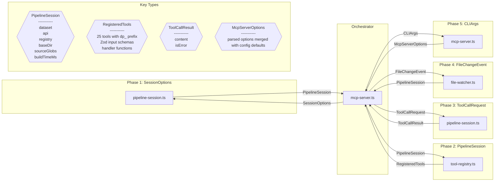

# Design Review: MCPServerIntegration

**Purpose:** Auto-generated design review with sequence and component diagrams
**Detail Level:** Design review artifact from sequence annotations

---

**Pattern:** MCPServerIntegration | **Phase:** Phase 46 | **Status:** active | **Orchestrator:** mcp-server | **Steps:** 5 | **Participants:** 4

**Source:** `delivery-process/specs/mcp-server-integration.feature`

---

## Annotation Convention

This design review is generated from the following annotations:

| Tag                   | Level    | Format | Purpose                            |
| --------------------- | -------- | ------ | ---------------------------------- |
| sequence-orchestrator | Feature  | value  | Identifies the coordinator module  |
| sequence-step         | Rule     | number | Explicit execution ordering        |
| sequence-module       | Rule     | csv    | Maps Rule to deliverable module(s) |
| sequence-error        | Scenario | flag   | Marks scenario as error/alt path   |

Description markers: `**Input:**` and `**Output:**` in Rule descriptions define data flow types for sequence diagram call arrows and component diagram edges.

---

## Sequence Diagram — Runtime Interaction Flow

Generated from: `@libar-docs-sequence-step`, `@libar-docs-sequence-module`, `@libar-docs-sequence-error`, `**Input:**`/`**Output:**` markers, and `@libar-docs-sequence-orchestrator` on the Feature.

```mermaid
sequenceDiagram
    participant User
    participant mcp_server as "mcp-server.ts"
    participant pipeline_session as "pipeline-session.ts"
    participant tool_registry as "tool-registry.ts"
    participant file_watcher as "file-watcher.ts"

    User->>mcp_server: invoke

    Note over mcp_server: Rule 1 — The MCP server communicates over stdio using JSON-RPC. It builds the pipeline once during initialization, then enters a request-response loop. No non-MCP output is written to stdout (no console.log, no pnpm banners).

    mcp_server->>+pipeline_session: SessionOptions
    pipeline_session-->>-mcp_server: PipelineSession

    alt Server starts with explicit input globs
        mcp_server-->>User: error
        mcp_server->>mcp_server: exit(1)
    end

    Note over mcp_server: Rule 2 — Every CLI subcommand is registered as an MCP tool with a JSON Schema describing its input parameters. Tool names use snake_case with a &quot;dp_&quot; prefix to avoid collisions with other MCP servers.

    mcp_server->>+tool_registry: PipelineSession
    tool_registry-->>-mcp_server: RegisteredTools

    alt Tool call with missing required parameter returns error
        mcp_server-->>User: error
        mcp_server->>mcp_server: exit(1)
    end

    Note over mcp_server: Rule 3 — The pipeline runs exactly once during server initialization. All subsequent tool calls read from in-memory MasterDataset. A manual rebuild can be triggered via a &quot;dp_rebuild&quot; tool, and overlapping rebuild requests coalesce so the final in-memory session reflects the newest completed build.

    mcp_server->>+pipeline_session: ToolCallRequest
    pipeline_session-->>-mcp_server: ToolCallResult

    alt Concurrent reads during rebuild use previous dataset
        mcp_server-->>User: error
        mcp_server->>mcp_server: exit(1)
    end

    Note over mcp_server: Rule 4 — When —watch is enabled, changes to source files trigger an automatic pipeline rebuild. Multiple rapid changes are debounced into a single rebuild (default 500ms window).

    mcp_server->>+file_watcher: FileChangeEvent
    file_watcher-->>-mcp_server: PipelineSession

    alt Rebuild failure during watch does not crash server
        mcp_server-->>User: error
        mcp_server->>mcp_server: exit(1)
    end

    Note over mcp_server: Rule 5 — The server works with .mcp.json (Claude Code), claude_desktop_config.json (Claude Desktop), and any MCP client. It accepts —input, —features, —base-dir args, auto-detects delivery-process.config.ts, and reports the package version accurately through the CLI.

    mcp_server->>+mcp_server: CLIArgs
    mcp_server-->>-mcp_server: McpServerOptions

    alt No config file and no explicit globs
        mcp_server-->>User: error
        mcp_server->>mcp_server: exit(1)
    end

```

---

## Component Diagram — Types and Data Flow

Generated from: `@libar-docs-sequence-module` (nodes), `**Input:**`/`**Output:**` (edges and type shapes), deliverables table (locations), and `sequence-step` (grouping).



---

## Key Type Definitions

| Type               | Fields                                                          | Produced By                    | Consumed By   |
| ------------------ | --------------------------------------------------------------- | ------------------------------ | ------------- |
| `PipelineSession`  | dataset, api, registry, baseDir, sourceGlobs, buildTimeMs       | pipeline-session, file-watcher | tool-registry |
| `RegisteredTools`  | 25 tools with dp\_ prefix, Zod input schemas, handler functions | tool-registry                  |               |
| `ToolCallResult`   | content, isError                                                | pipeline-session               |               |
| `McpServerOptions` | parsed options merged with config defaults                      | mcp-server                     |               |

---

## Design Questions

Verify these design properties against the diagrams above:

| #    | Question                             | Auto-Check                      | Diagram   |
| ---- | ------------------------------------ | ------------------------------- | --------- |
| DQ-1 | Is the execution ordering correct?   | 5 steps in monotonic order      | Sequence  |
| DQ-2 | Are all interfaces well-defined?     | 4 distinct types across 5 steps | Component |
| DQ-3 | Is error handling complete?          | 5 error paths identified        | Sequence  |
| DQ-4 | Is data flow unidirectional?         | Review component diagram edges  | Component |
| DQ-5 | Does validation prove the full path? | Review final step               | Both      |

---

## Findings

Record design observations from reviewing the diagrams above. Each finding should reference which diagram revealed it and its impact on the spec.

| #   | Finding                                     | Diagram Source | Impact on Spec |
| --- | ------------------------------------------- | -------------- | -------------- |
| F-1 | (Review the diagrams and add findings here) | —              | —              |

---

## Summary

The MCPServerIntegration design review covers 5 sequential steps across 4 participants with 4 key data types and 5 error paths.
