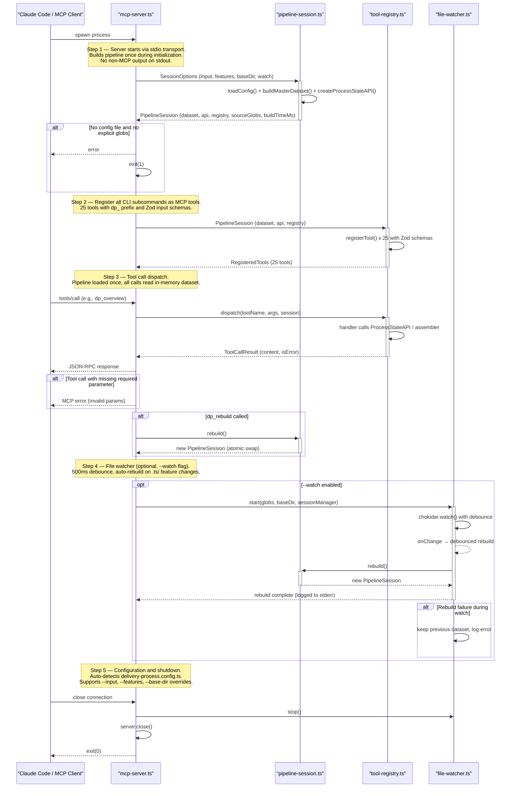
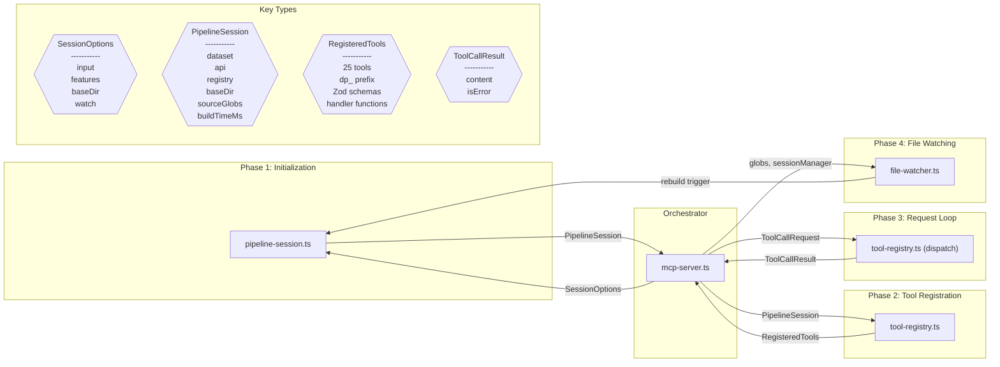

# Design Review: MCPServerIntegration

**Purpose:** Design review with sequence and component diagrams for the MCP server
**Detail Level:** Design review artifact from sequence annotations

---

**Pattern:** MCPServerIntegration | **Phase:** Phase 46 | **Status:** active | **Orchestrator:** mcp-server | **Steps:** 5 | **Participants:** 4

**Source:** `delivery-process/specs/mcp-server-integration.feature`

---

## Annotation Convention

This design review is generated from the following annotations:

| Tag                   | Level    | Format | Purpose                            |
| --------------------- | -------- | ------ | ---------------------------------- |
| sequence-orchestrator | Feature  | value  | Identifies the coordinator module  |
| sequence-step         | Rule     | number | Explicit execution ordering        |
| sequence-module       | Rule     | csv    | Maps Rule to deliverable module(s) |
| sequence-error        | Scenario | flag   | Marks scenario as error/alt path   |

Description markers: `**Input:**` and `**Output:**` in Rule descriptions define data flow types for sequence diagram call arrows and component diagram edges.

---

## Sequence Diagram — Runtime Interaction Flow

Generated from: `@libar-docs-sequence-step`, `@libar-docs-sequence-module`, `@libar-docs-sequence-error`, `**Input:**`/`**Output:**` markers, and `@libar-docs-sequence-orchestrator` on the Feature.

---

## Component Diagram — Types and Data Flow

Generated from: `@libar-docs-sequence-module` (nodes), `**Input:**`/`**Output:**` (edges and type shapes), deliverables table (locations), and `sequence-step` (grouping).

---

## Key Type Definitions

| Type               | Fields                                                    | Produced By            | Consumed By                             |
| ------------------ | --------------------------------------------------------- | ---------------------- | --------------------------------------- |
| `SessionOptions`   | input, features, baseDir, watch                           | CLI arg parser         | pipeline-session                        |
| `PipelineSession`  | dataset, api, registry, baseDir, sourceGlobs, buildTimeMs | pipeline-session       | tool-registry, file-watcher, mcp-server |
| `RegisteredTools`  | 25 tools with dp\_ prefix, Zod schemas, handler functions | tool-registry          | mcp-server (via McpServer)              |
| `ToolCallResult`   | content, isError                                          | tool-registry handlers | mcp-server (→ JSON-RPC response)        |
| `FileChangeEvent`  | filePath, eventType                                       | chokidar               | file-watcher                            |
| `McpServerOptions` | input, features, baseDir, watch, version                  | CLI arg parser         | mcp-server                              |

---

## Design Questions

Verify these design properties against the diagrams above:

| #    | Question                           | Auto-Check                      | Diagram   |
| ---- | ---------------------------------- | ------------------------------- | --------- |
| DQ-1 | Is the execution ordering correct? | 5 steps in monotonic order      | Sequence  |
| DQ-2 | Are all interfaces well-defined?   | 6 distinct types across 5 steps | Component |
| DQ-3 | Is error handling complete?        | 5 error paths identified        | Sequence  |
| DQ-4 | Is data flow unidirectional?       | Review component diagram edges  | Component |
| DQ-5 | Does the server isolate stdout?    | console.log redirected at load  | Sequence  |

---

## Design Decisions Summary

| #     | Decision                                                  | Rationale                                                                                                                      |
| ----- | --------------------------------------------------------- | ------------------------------------------------------------------------------------------------------------------------------ |
| DD-1  | Atomic dataset swap on rebuild                            | During rebuild, tool calls read from previous PipelineSession. New session replaces it atomically after successful build.      |
| DD-2  | Config auto-detection mirrors CLI                         | Uses same applyProjectSourceDefaults() function, then falls back to filesystem detection.                                      |
| DD-3  | No caching layer                                          | CLI uses dataset-cache.ts for inter-process caching, but in-process memory is sufficient for long-lived server.                |
| DD-4  | Text output for session-aware tools                       | context, overview, scope-validate return formatted text matching CLI output — what Claude Code expects for direct consumption. |
| DD-5  | JSON output for data tools                                | pattern, list, status return JSON for structured querying.                                                                     |
| DD-6  | Synchronous handlers where possible                       | MCP SDK ToolCallback accepts both sync and async returns. Avoids require-await lint violations.                                |
| DD-7  | dp\_ tool prefix                                          | Per spec invariant. Avoids collision with other MCP servers in multi-server setups.                                            |
| DD-8  | Stdout isolation via console.log redirect                 | MCP JSON-RPC uses stdout exclusively. console.log → console.error at module load time.                                         |
| DD-9  | Chokidar EventEmitter cast for Node 20                    | chokidar v5 typed EventEmitter requires Node 22+ @types/node. Cast to plain EventEmitter.                                      |
| DD-10 | Pipeline failure fatal at startup, non-fatal during watch | Startup with bad config exits immediately. File-watch rebuild failure keeps previous dataset.                                  |

---

## Findings

Record design observations from reviewing the diagrams above. Each finding should reference which diagram revealed it and its impact on the spec.

| #   | Finding                                                                                                                                                                                                                                                  | Diagram Source | Impact on Spec                                    |
| --- | -------------------------------------------------------------------------------------------------------------------------------------------------------------------------------------------------------------------------------------------------------- | -------------- | ------------------------------------------------- |
| F-1 | The tool-registry appears twice in the component diagram (registration + dispatch) because it serves two roles: static registration at startup and dynamic dispatch at runtime. This is correct — a single module handles both.                          | Component      | None — intentional dual-role design               |
| F-2 | File watcher triggers rebuild on pipeline-session directly, bypassing mcp-server. This is correct — the watcher has a reference to the sessionManager, so the new dataset is available to the next tool call without orchestrator involvement.           | Sequence       | None — by-design for simplicity                   |
| F-3 | No tool for query (the raw ProcessStateAPI method dispatcher). The CLI has a `query` subcommand that calls arbitrary API methods. The MCP server exposes each method as a dedicated tool instead, providing better discoverability and input validation. | Both           | DD-4 captures this — no generic query tool needed |

---

## Summary

The MCPServerIntegration design review covers 5 sequential steps across 4 participants (mcp-server, pipeline-session, tool-registry, file-watcher) with 6 key data types and 5 error paths. The architecture is a thin transport layer — all business logic delegates to existing ProcessStateAPI methods and CLI assembler functions. The 10 design decisions document key trade-offs around stdout isolation, output format selection, rebuild atomicity, and Node.js compatibility.
