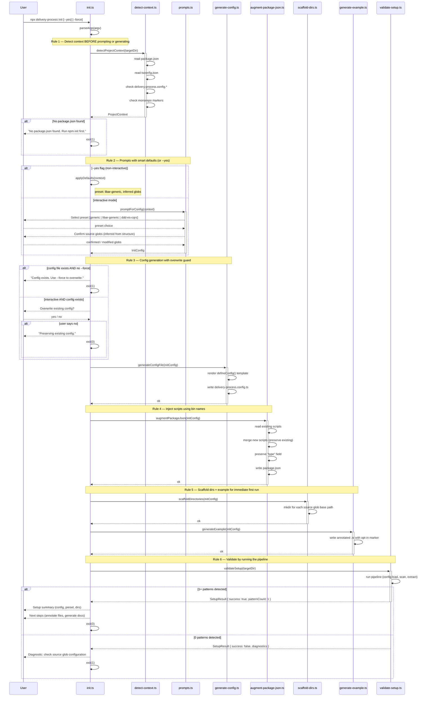
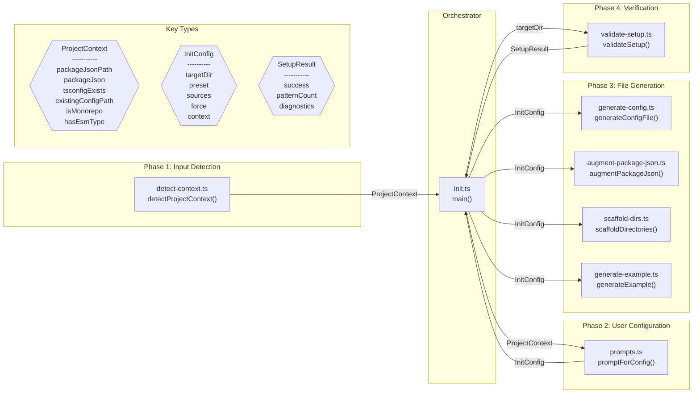

# SetupCommand — Design Review

> **Phase 45** | Date: 2026-03-12 | Status: draft
>
> Visual verification of the Interactive Setup Command design before stub creation.
> Spec: `delivery-process/specs/setup-command.feature`
>
> **Generation target:** This document is the reference output for a design review
> diagram generator. The diagrams below should be producible from the sequence
> annotations in the spec file. See [Annotation Convention](#annotation-convention)
> for the new tags that make generation possible.

---

## Annotation Convention

The SetupCommand spec introduces **sequence diagram annotations** — a new tag category
that captures runtime interaction flow, enabling generated Mermaid diagrams from spec
annotations. These annotations complement the existing architecture tags (`arch-role`,
`arch-context`, `arch-layer`) which capture static structure.

### New Tags

| Tag                     | Level    | Format   | Purpose                            | Example                                      |
| ----------------------- | -------- | -------- | ---------------------------------- | -------------------------------------------- |
| `sequence-orchestrator` | Feature  | `value`  | Identifies the coordinator module  | `@libar-docs-sequence-orchestrator:init-cli` |
| `sequence-step`         | Rule     | `number` | Explicit execution ordering        | `@libar-docs-sequence-step:1`                |
| `sequence-module`       | Rule     | `csv`    | Maps Rule to deliverable module(s) | `@libar-docs-sequence-module:detect-context` |
| `sequence-error`        | Scenario | `flag`   | Marks scenario as error/alt path   | `@libar-docs-sequence-error`                 |

### New Description Markers

| Marker        | Level            | Purpose                            | Example                                   |
| ------------- | ---------------- | ---------------------------------- | ----------------------------------------- |
| `**Input:**`  | Rule description | Input type for this sequence step  | `**Input:** targetDir: string`            |
| `**Output:**` | Rule description | Output type for this sequence step | `**Output:** ProjectContext -- fields...` |

These extend the existing structured description convention (`**Invariant:**`, `**Rationale:**`, `**Verified by:**`).

### How Generation Works

```
SPEC (.feature with sequence annotations)
  ↓
SCANNER (gherkin-ast-parser.ts)
  → Extract sequence-step, sequence-module from Rule tags
  → Extract sequence-error from Scenario tags
  → Extract Input/Output from Rule descriptions
  ↓
EXTRACTOR (gherkin-extractor.ts)
  → Build ordered sequence steps with participants and types
  → Identify error/alt paths from sequence-error scenarios
  ↓
TRANSFORMER (transform-dataset.ts)
  → Add sequenceIndex to MasterDataset (parallel to archIndex)
  → Pre-compute: steps[], participants[], errorPaths[], dataFlowTypes[]
  ↓
CODEC (DesignReviewCodec or extended ReferenceDocCodec)
  → Render sequenceDiagram from ordered steps + alt blocks
  → Render graph LR from participants + Input/Output types
  → Render Design Questions table from findings
```

### Module ID Resolution

The `sequence-module` tag value is the **Location basename** from the deliverables table
(without path prefix or extension). The generator resolves display names:

| sequence-module value  | Deliverables Table Location            | Display Name              |
| ---------------------- | -------------------------------------- | ------------------------- |
| `detect-context`       | `src/cli/init/detect-context.ts`       | `detect-context.ts`       |
| `prompts`              | `src/cli/init/prompts.ts`              | `prompts.ts`              |
| `generate-config`      | `src/cli/init/generate-config.ts`      | `generate-config.ts`      |
| `augment-package-json` | `src/cli/init/augment-package-json.ts` | `augment-package-json.ts` |
| `scaffold-dirs`        | `src/cli/init/scaffold-dirs.ts`        | `scaffold-dirs.ts`        |
| `generate-example`     | `src/cli/init/generate-example.ts`     | `generate-example.ts`     |
| `validate-setup`       | `src/cli/init/validate-setup.ts`       | `validate-setup.ts`       |
| `init-cli`             | `src/cli/init.ts`                      | `init.ts`                 |

---

## Design Questions

| #    | Question                                   | Answer                                    | Verified By                 |
| ---- | ------------------------------------------ | ----------------------------------------- | --------------------------- |
| DQ-1 | Is the interaction sequence correct?       | Yes — matches Rule 1-6 ordering           | Sequence Diagram            |
| DQ-2 | Are module interfaces well-defined?        | Yes — 3 types bridge all 9 deliverables   | Component Diagram           |
| DQ-3 | Is error handling complete?                | 3 early-exit paths + 1 validation failure | Sequence Diagram alt blocks |
| DQ-4 | Is data flow unidirectional?               | Yes — no backward dependencies            | Component Diagram arrows    |
| DQ-5 | Does validation prove the full write path? | Yes — reads config from disk, not memory  | Both diagrams               |

---

## 1. Sequence Diagram — Runtime Interaction Flow

Generated from: `@libar-docs-sequence-step`, `@libar-docs-sequence-module`,
`@libar-docs-sequence-error`, `**Input:**`/`**Output:**` markers, and
`@libar-docs-sequence-orchestrator` on the Feature.



### What This Verifies

- **Ordering matches invariants**: Detection (Rule 1) completes before any prompting (Rule 2) or generation (Rules 3-5). Validation (Rule 6) runs last.
- **Error exits are explicit**: Four exit paths visible — no package.json, config exists without --force, user declines overwrite, validation fails.
- **Flag behavior is visible**: `--yes` skips prompts (alt block), `--force` bypasses overwrite guard (alt block). Both are conditional branches, not hidden logic.
- **Each deliverable maps to one participant**: All 8 code deliverables appear. The 9th (bin entry in package.json) is an install-time concern, not a runtime participant.
- **Validation reads from disk**: `validateSetup(targetDir)` receives the directory path, not in-memory state. It discovers the config file it just wrote, proving the full write path.

### Generation Notes

The sequence diagram above is the target output. A generator would:

1. **Participants**: Derive from `sequence-orchestrator` (Feature) + `sequence-module` (each Rule) + `User` (implicit)
2. **Call ordering**: Follow `sequence-step` numbers — each step becomes a CLI→Module call
3. **Call signatures**: Parse `**Input:**` for parameters, `**Output:**` for return types
4. **Alt blocks**: Generate from `@sequence-error` scenarios — scenario name becomes the alt condition
5. **Notes**: Generate from Rule names — "Rule N — {Rule name}" between each step group

**Open question for generator design:** The detailed internal steps within each participant
(e.g., `Detect->>Detect: read package.json`) come from the Rule's Invariant description.
A v1 generator could omit these and produce a cleaner but less detailed diagram. A v2
could extract verbs from the Invariant text.

---

## 2. Component Diagram — Types and Data Flow

Generated from: `@libar-docs-sequence-module` (nodes), `**Input:**`/`**Output:**`
(edges and type shapes), deliverables table (locations), and `sequence-step` (grouping).



### Key Type Definitions

| Type             | Fields                                                                                                                                                                                                                                | Produced By                       | Consumed By             | Notes                                  |
| ---------------- | ------------------------------------------------------------------------------------------------------------------------------------------------------------------------------------------------------------------------------------- | --------------------------------- | ----------------------- | -------------------------------------- |
| `ProjectContext` | `packageJsonPath: string \| null`, `packageJson: PackageJsonShape \| null`, `tsconfigExists: boolean`, `tsconfigModuleResolution: string \| null`, `existingConfigPath: string \| null`, `isMonorepo: boolean`, `hasEsmType: boolean` | `detect-context.ts`               | `prompts.ts`, `init.ts` | Immutable snapshot of filesystem state |
| `InitConfig`     | `targetDir: string`, `preset: PresetName`, `sources: SourcesConfig`, `force: boolean`, `context: ProjectContext`                                                                                                                      | `prompts.ts` (or `applyDefaults`) | All 4 generators        | Carries raw context for downstream use |
| `SetupResult`    | `success: boolean`, `patternCount: number`, `diagnostics: string[]`                                                                                                                                                                   | `validate-setup.ts`               | `init.ts`               | Pipeline execution outcome             |

### What This Verifies

- **Unidirectional data flow**: `ProjectContext` flows forward into `InitConfig`, never backward. Each generator receives `InitConfig`, no generator produces data consumed by another generator.
- **Orchestrator is sole coordinator**: `init.ts` calls each module. No module-to-module calls. This matches the project's existing CLI pattern where `main()` sequences helpers.
- **Validation is decoupled from generation**: `validate-setup.ts` receives only `targetDir`, not in-memory `InitConfig`. It loads the config from disk, which proves the config generation path works end-to-end.
- **`InitConfig` is the central contract**: Four generators depend on it. If this type changes, all four modules are affected. This makes it the highest-leverage type to get right in stubs.
- **`InitConfig.context` carries raw `ProjectContext`**: Generators like `augment-package-json` need `hasEsmType` to decide whether to preserve or set the `"type"` field. Carrying the raw context avoids a lossy transformation.

### Generation Notes

The component diagram is derivable from annotations:

1. **Module nodes**: Each `sequence-module` value → a node labeled with Location basename + primary function name
2. **Type nodes**: Distinct `**Output:**` types → hexagon nodes with field lists
3. **Edges**: Step N's `**Output:**` type flows to the orchestrator, then to Step N+1's `**Input:**` type
4. **Subgraph grouping**: Steps with the same `**Input:**` type group together (e.g., steps 3-5 all take `InitConfig`)
5. **Orchestrator**: The `sequence-orchestrator` module sits at the center, receiving all outputs and dispatching to next steps

---

## Findings

| #   | Finding                                                                                                                                                                                                                                                                   | Diagram Source                                                                         | Impact on Spec                                                                                                                                                                                                                                  |
| --- | ------------------------------------------------------------------------------------------------------------------------------------------------------------------------------------------------------------------------------------------------------------------------- | -------------------------------------------------------------------------------------- | ----------------------------------------------------------------------------------------------------------------------------------------------------------------------------------------------------------------------------------------------- |
| F-1 | No rollback mechanism — if config generation succeeds but package.json augmentation fails, the project has a partial setup                                                                                                                                                | Sequence Diagram: generators run sequentially with no compensating transactions        | **Acceptable for v1.** Partial setup is diagnosable (user can see which files were created). Add a note to the failure diagnostic output listing which files were written. Rollback adds complexity disproportionate to the failure likelihood. |
| F-2 | Validation step runs the pipeline which requires the package to be installed. When invoked via `npx @libar-dev/delivery-process init`, the package IS available (npx downloads it). But `validate-setup.ts` must import from the package, not from relative `src/` paths. | Sequence Diagram: `validateSetup(targetDir)` runs the pipeline                         | **Spec impact: none.** Implementation detail — the validator calls `loadConfig()` and `buildMasterDataset()` from the installed package, same as `process-api` does. No new dependency needed.                                                  |
| F-3 | `InitConfig` should carry raw `ProjectContext` (not a processed subset) because `augment-package-json` needs `hasEsmType` and `packageJson` to make preserving decisions                                                                                                  | Component Diagram: `InitConfig` has `context: ProjectContext` field                    | **Design decision: confirmed.** The `context` field on `InitConfig` carries the full `ProjectContext`. This avoids re-reading filesystem state in generators.                                                                                   |
| F-4 | The interactive overwrite prompt (config exists, no --force, interactive mode) has three outcomes: yes (overwrite), no (exit 0), and the --yes+exists case (exit 1). These need distinct handling.                                                                        | Sequence Diagram: nested alt block for overwrite guard                                 | **Spec is already correct** — Rule 3 says "never overwrite without confirmation" and the validation scenario covers the --yes case. The sequence diagram makes the three-way branch explicit.                                                   |
| F-5 | `scaffold-dirs.ts` needs to extract base paths from glob patterns (e.g., `src/**/*.ts` → `src/`). This is non-trivial for complex globs like `{src,lib}/**/*.ts`.                                                                                                         | Component Diagram: `scaffoldDirectories(initConfig)` receives `sources: SourcesConfig` | **New design detail.** The scaffolder should use a simple heuristic: take the prefix before the first glob character (`*`, `{`, `?`). Edge cases are acceptable for v1 — the user can create directories manually.                              |

---

## Summary

The two diagrams confirm that the SetupCommand spec's 6 Rules map cleanly to a linear
pipeline with 3 key types bridging all modules. The design is coherent:

- **No circular dependencies** between modules
- **No missing data** — every generator gets what it needs via `InitConfig`
- **Error handling is complete** — 4 distinct failure modes, each with a user-facing message
- **Validation proves the full path** — end-to-end from config file write to pipeline execution

Five findings were recorded. F-1 (no rollback) and F-5 (glob base path extraction) are
the most significant — both are acceptable for v1 with documented limitations.

**Next steps:**

1. Register the new sequence tags in `src/taxonomy/registry-builder.ts`
2. Add `**Input:**`/`**Output:**` extraction to the business rules parser
3. Create a DesignReviewCodec (or extend ReferenceDocCodec with DiagramScope for sequence diagrams)
4. Create TypeScript stubs in `delivery-process/stubs/setup-command/` using the type definitions from this review
