# Architecture

**Purpose:** Auto-generated architecture diagram from source annotations
**Detail Level:** Component diagram with bounded context subgraphs

---

## Overview

This diagram was auto-generated from 94 annotated source files across 10 bounded contexts.

| Metric | Count |
| --- | --- |
| Total Components | 94 |
| Bounded Contexts | 10 |
| Component Roles | 1 |

---

## System Overview

Component architecture with bounded context isolation:

```mermaid
graph TB
    subgraph api["Api BC"]
        ProcessStateTypes["ProcessStateTypes"]
        ProcessStateAPI["ProcessStateAPI"]
        APIModule["APIModule"]
    end
    subgraph cli["Cli BC"]
        CLIVersionHelper["CLIVersionHelper"]
        ValidatePatternsCLI["ValidatePatternsCLI"]
        LintProcessCLI["LintProcessCLI"]
        LintPatternsCLI["LintPatternsCLI"]
        TagTaxonomyCLI["TagTaxonomyCLI"]
        Documentation_Generator_CLI["Documentation Generator CLI"]
        CLIErrorHandler["CLIErrorHandler"]
    end
    subgraph config["Config BC"]
        WorkflowLoader["WorkflowLoader"]
        ConfigurationTypes["ConfigurationTypes"]
        RegexBuilders["RegexBuilders"]
        ConfigurationPresets["ConfigurationPresets"]
        DeliveryProcessFactory["DeliveryProcessFactory"]
        ConfigurationDefaults["ConfigurationDefaults"]
        ConfigLoader["ConfigLoader"]
    end
    subgraph extractor["Extractor BC"]
        ShapeExtractor["ShapeExtractor"]
        LayerInference["LayerInference"]
        GherkinExtractor["GherkinExtractor"]
        DualSourceExtractor["DualSourceExtractor"]
        Document_Extractor["Document Extractor"]
    end
    subgraph generator["Generator BC"]
        WarningCollector["WarningCollector"]
        GeneratorTypes["GeneratorTypes"]
        SourceMappingValidator["SourceMappingValidator"]
        SourceMapper["SourceMapper"]
        GeneratorRegistry["GeneratorRegistry"]
        Documentation_Generation_Orchestrator["Documentation Generation Orchestrator"]
        ContentDeduplicator["ContentDeduplicator"]
        CodecBasedGenerator["CodecBasedGenerator"]
        TransformDataset["TransformDataset"]
        PipelineModule["PipelineModule"]
        BuiltInGenerators["BuiltInGenerators"]
        DecisionDocGenerator["DecisionDocGenerator"]
        CodecGeneratorRegistration["CodecGeneratorRegistration"]
    end
    subgraph lint["Lint BC"]
        LintRules["LintRules"]
        LintModule["LintModule"]
        LintEngine["LintEngine"]
        ProcessGuardTypes["ProcessGuardTypes"]
        ProcessGuardModule["ProcessGuardModule"]
        DetectChanges["DetectChanges"]
        DeriveProcessState["DeriveProcessState"]
        ProcessGuardDecider["ProcessGuardDecider"]
    end
    subgraph renderer["Renderer BC"]
        RenderableUtils["RenderableUtils"]
        RenderableDocument["RenderableDocument"]
        UniversalRenderer["UniversalRenderer"]
        RenderableDocumentModel_RDM_["RenderableDocumentModel(RDM)"]
        DocumentGenerator["DocumentGenerator"]
        ValidationRulesCodec["ValidationRulesCodec"]
        TimelineCodec["TimelineCodec"]
        TaxonomyCodec["TaxonomyCodec"]
        SharedCodecSchema["SharedCodecSchema"]
        SessionCodec["SessionCodec"]
        RequirementsCodec["RequirementsCodec"]
        ReportingCodecs["ReportingCodecs"]
        PrChangesCodec["PrChangesCodec"]
        PlanningCodecs["PlanningCodecs"]
        PatternsCodec["PatternsCodec"]
        DocumentCodecs["DocumentCodecs"]
        RichContentHelpers["RichContentHelpers"]
        DecisionDocCodec["DecisionDocCodec"]
        BusinessRulesCodec["BusinessRulesCodec"]
        ArchitectureCodec["ArchitectureCodec"]
        AdrDocumentCodec["AdrDocumentCodec"]
        CodecBaseOptions["CodecBaseOptions"]
    end
    subgraph scanner["Scanner BC"]
        Pattern_Scanner["Pattern Scanner[infrastructure]"]
        GherkinScanner["GherkinScanner"]
        GherkinASTParser["GherkinASTParser"]
        TypeScript_AST_Parser["TypeScript AST Parser[infrastructure]"]
    end
    subgraph taxonomy["Taxonomy BC"]
        StatusValues["StatusValues"]
        RiskLevels["RiskLevels"]
        TagRegistryBuilder["TagRegistryBuilder"]
        NormalizedStatus["NormalizedStatus"]
        LayerTypes["LayerTypes"]
        HierarchyLevels["HierarchyLevels"]
        FormatTypes["FormatTypes"]
        CategoryDefinitions["CategoryDefinitions"]
    end
    subgraph validation["Validation BC"]
        WorkflowConfigSchema["WorkflowConfigSchema"]
        Tag_Registry_Configuration["Tag Registry Configuration"]
        OutputSchemas["OutputSchemas"]
        MasterDataset["MasterDataset"]
        ExtractedShapeSchema["ExtractedShapeSchema"]
        ExtractedPatternSchema["ExtractedPatternSchema"]
        DualSourceSchemas["DualSourceSchemas"]
        DocDirectiveSchema["DocDirectiveSchema"]
        CodecUtils["CodecUtils"]
        DoDValidationTypes["DoDValidationTypes"]
        ValidationModule["ValidationModule"]
        DoDValidator["DoDValidator"]
        AntiPatternDetector["AntiPatternDetector"]
        FSMValidator["FSMValidator"]
        FSMTransitions["FSMTransitions"]
        FSMStates["FSMStates"]
        FSMModule["FSMModule"]
    end
    subgraph shared["Shared Infrastructure"]
        WorkflowConfigSchema["WorkflowConfigSchema"]
        Tag_Registry_Configuration["Tag Registry Configuration"]
        OutputSchemas["OutputSchemas"]
        MasterDataset["MasterDataset"]
        ExtractedShapeSchema["ExtractedShapeSchema"]
        ExtractedPatternSchema["ExtractedPatternSchema"]
        DualSourceSchemas["DualSourceSchemas"]
        DocDirectiveSchema["DocDirectiveSchema"]
        CodecUtils["CodecUtils"]
        DoDValidationTypes["DoDValidationTypes"]
        ValidationModule["ValidationModule"]
        GherkinScanner["GherkinScanner"]
        GherkinASTParser["GherkinASTParser"]
        StatusValues["StatusValues"]
        RiskLevels["RiskLevels"]
        NormalizedStatus["NormalizedStatus"]
        LayerTypes["LayerTypes"]
        HierarchyLevels["HierarchyLevels"]
        FormatTypes["FormatTypes"]
        RenderableUtils["RenderableUtils"]
        RenderableDocument["RenderableDocument"]
        UniversalRenderer["UniversalRenderer"]
        RenderableDocumentModel_RDM_["RenderableDocumentModel(RDM)"]
        DocumentGenerator["DocumentGenerator"]
        LintModule["LintModule"]
        LintEngine["LintEngine"]
        WarningCollector["WarningCollector"]
        GeneratorTypes["GeneratorTypes"]
        SourceMappingValidator["SourceMappingValidator"]
        GeneratorRegistry["GeneratorRegistry"]
        CodecBasedGenerator["CodecBasedGenerator"]
        ShapeExtractor["ShapeExtractor"]
        LayerInference["LayerInference"]
        GherkinExtractor["GherkinExtractor"]
        DualSourceExtractor["DualSourceExtractor"]
        WorkflowLoader["WorkflowLoader"]
        ConfigurationTypes["ConfigurationTypes"]
        RegexBuilders["RegexBuilders"]
        ConfigurationPresets["ConfigurationPresets"]
        ConfigurationDefaults["ConfigurationDefaults"]
        CLIVersionHelper["CLIVersionHelper"]
        ValidatePatternsCLI["ValidatePatternsCLI"]
        LintProcessCLI["LintProcessCLI"]
        LintPatternsCLI["LintPatternsCLI"]
        TagTaxonomyCLI["TagTaxonomyCLI"]
        Documentation_Generator_CLI["Documentation Generator CLI"]
        CLIErrorHandler["CLIErrorHandler"]
        ProcessStateTypes["ProcessStateTypes"]
        APIModule["APIModule"]
        FSMValidator["FSMValidator"]
        FSMTransitions["FSMTransitions"]
        FSMStates["FSMStates"]
        FSMModule["FSMModule"]
        ValidationRulesCodec["ValidationRulesCodec"]
        TimelineCodec["TimelineCodec"]
        TaxonomyCodec["TaxonomyCodec"]
        SharedCodecSchema["SharedCodecSchema"]
        RequirementsCodec["RequirementsCodec"]
        ReportingCodecs["ReportingCodecs"]
        PrChangesCodec["PrChangesCodec"]
        PlanningCodecs["PlanningCodecs"]
        DocumentCodecs["DocumentCodecs"]
        RichContentHelpers["RichContentHelpers"]
        BusinessRulesCodec["BusinessRulesCodec"]
        AdrDocumentCodec["AdrDocumentCodec"]
        ProcessGuardTypes["ProcessGuardTypes"]
        ProcessGuardModule["ProcessGuardModule"]
        DetectChanges["DetectChanges"]
        DeriveProcessState["DeriveProcessState"]
        PipelineModule["PipelineModule"]
        BuiltInGenerators["BuiltInGenerators"]
        CodecGeneratorRegistration["CodecGeneratorRegistration"]
        CodecBaseOptions["CodecBaseOptions"]
    end
    ExtractedPatternSchema --> DocDirectiveSchema
    DoDValidator --> DoDValidationTypes
    DoDValidator --> DualSourceExtractor
    AntiPatternDetector --> DoDValidationTypes
    GherkinScanner --> GherkinASTParser
    TypeScript_AST_Parser --> DocDirectiveSchema
    LintModule --> LintRules
    LintModule --> LintEngine
    LintEngine --> LintRules
    LintEngine --> CodecUtils
    SourceMapper -.-> DecisionDocCodec
    SourceMapper -.-> ShapeExtractor
    SourceMapper -.-> GherkinASTParser
    GeneratorRegistry --> GeneratorTypes
    Documentation_Generation_Orchestrator --> Pattern_Scanner
    GherkinExtractor --> GherkinASTParser
    DualSourceExtractor --> GherkinExtractor
    DualSourceExtractor --> GherkinScanner
    Document_Extractor --> Pattern_Scanner
    WorkflowLoader --> WorkflowConfigSchema
    WorkflowLoader --> CodecUtils
    RegexBuilders --> ConfigurationTypes
    ConfigurationPresets --> ConfigurationTypes
    DeliveryProcessFactory --> ConfigurationTypes
    DeliveryProcessFactory --> ConfigurationPresets
    DeliveryProcessFactory --> RegexBuilders
    ConfigLoader --> DeliveryProcessFactory
    ConfigLoader --> ConfigurationTypes
    ValidatePatternsCLI --> GherkinScanner
    ValidatePatternsCLI --> DualSourceExtractor
    ValidatePatternsCLI --> CodecUtils
    LintProcessCLI --> ProcessGuardModule
    LintPatternsCLI --> LintEngine
    LintPatternsCLI --> LintRules
    TagTaxonomyCLI --> ConfigLoader
    ProcessStateAPI --> MasterDataset
    ProcessStateAPI --> FSMValidator
    ArchitectureCodec --> MasterDataset
    DetectChanges --> DeriveProcessState
    TransformDataset --> MasterDataset
    PipelineModule --> TransformDataset
    BuiltInGenerators --> GeneratorRegistry
    BuiltInGenerators --> CodecBasedGenerator
    DecisionDocGenerator -.-> DecisionDocCodec
    DecisionDocGenerator -.-> SourceMapper
```

---

## Legend

| Arrow Style | Relationship | Description |
| --- | --- | --- |
| `-->` | uses | Direct dependency (solid arrow) |
| `-.->`  | depends-on | Weak dependency (dashed arrow) |
| `..->`  | implements | Realization relationship (dotted arrow) |
| `-->>`  | extends | Generalization relationship (open arrow) |

---

## Component Inventory

All components with architecture annotations:

| Component | Context | Role | Layer | Source File |
| --- | --- | --- | --- | --- |
| 🚧 Process State API | api | - | application | src/api/process-state.ts |
| ✅ Config Loader | config | - | infrastructure | src/config/config-loader.ts |
| ✅ Delivery Process Factory | config | - | application | src/config/factory.ts |
| ✅ Document Extractor | extractor | - | application | src/extractor/doc-extractor.ts |
| ✅ Content Deduplicator | generator | - | infrastructure | src/generators/content-deduplicator.ts |
| ✅ Decision Doc Generator | generator | - | application | src/generators/built-in/decision-doc-generator.ts |
| ✅ Documentation Generation Orchestrator | generator | - | application | src/generators/orchestrator.ts |
| ✅ Source Mapper | generator | - | infrastructure | src/generators/source-mapper.ts |
| ✅ Transform Dataset | generator | - | application | src/generators/pipeline/transform-dataset.ts |
| ✅ Lint Rules | lint | - | application | src/lint/rules.ts |
| 🚧 Process Guard Decider | lint | - | application | src/lint/process-guard/decider.ts |
| ✅ Architecture Codec | renderer | - | application | src/renderable/codecs/architecture.ts |
| ✅ Decision Doc Codec | renderer | - | application | src/renderable/codecs/decision-doc.ts |
| ✅ Patterns Codec | renderer | - | application | src/renderable/codecs/patterns.ts |
| ✅ Session Codec | renderer | - | application | src/renderable/codecs/session.ts |
| ✅ Pattern Scanner | scanner | infrastructure | infrastructure | src/scanner/pattern-scanner.ts |
| ✅ TypeScript AST Parser | scanner | infrastructure | infrastructure | src/scanner/ast-parser.ts |
| ✅ Category Definitions | taxonomy | - | domain | src/taxonomy/categories.ts |
| ✅ Tag Registry Builder | taxonomy | - | domain | src/taxonomy/registry-builder.ts |
| ✅ Anti Pattern Detector | validation | - | application | src/validation/anti-patterns.ts |
| ✅ DoD Validator | validation | - | application | src/validation/dod-validator.ts |
| ✅ Adr Document Codec | - | - | - | src/renderable/codecs/adr.ts |
| 🚧 API Module | - | - | - | src/api/index.ts |
| ✅ Built In Generators | - | - | - | src/generators/built-in/index.ts |
| 📋 Business Rules Codec | - | - | - | src/renderable/codecs/business-rules.ts |
| ✅ CLI Error Handler | - | - | - | src/cli/error-handler.ts |
| ✅ CLI Version Helper | - | - | - | src/cli/version.ts |
| ✅ Codec Based Generator | - | - | - | src/generators/codec-based.ts |
| ✅ Codec Base Options | - | - | - | src/renderable/codecs/types/base.ts |
| ✅ Codec Generator Registration | - | - | - | src/generators/built-in/codec-generators.ts |
| ✅ Codec Utils | - | - | - | src/validation-schemas/codec-utils.ts |
| ✅ Configuration Defaults | - | - | - | src/config/defaults.ts |
| ✅ Configuration Presets | - | - | - | src/config/presets.ts |
| ✅ Configuration Types | - | - | - | src/config/types.ts |
| 🚧 Derive Process State | - | - | - | src/lint/process-guard/derive-state.ts |
| 🚧 Detect Changes | - | - | - | src/lint/process-guard/detect-changes.ts |
| ✅ Doc Directive Schema | - | - | - | src/validation-schemas/doc-directive.ts |
| ✅ Documentation Generator CLI | - | - | - | src/cli/generate-docs.ts |
| ✅ Document Codecs | - | - | - | src/renderable/codecs/index.ts |
| ✅ Document Generator | - | - | - | src/renderable/generate.ts |
| ✅ DoD Validation Types | - | - | - | src/validation/types.ts |
| ✅ Dual Source Extractor | - | - | - | src/extractor/dual-source-extractor.ts |
| ✅ Dual Source Schemas | - | - | - | src/validation-schemas/dual-source.ts |
| ✅ Extracted Pattern Schema | - | - | - | src/validation-schemas/extracted-pattern.ts |
| ✅ Extracted Shape Schema | - | - | - | src/validation-schemas/extracted-shape.ts |
| ✅ Format Types | - | - | - | src/taxonomy/format-types.ts |
| 🚧 FSM Module | - | - | - | src/validation/fsm/index.ts |
| 🚧 FSM States | - | - | - | src/validation/fsm/states.ts |
| 🚧 FSM Transitions | - | - | - | src/validation/fsm/transitions.ts |
| 🚧 FSM Validator | - | - | - | src/validation/fsm/validator.ts |
| ✅ Generator Registry | - | - | - | src/generators/registry.ts |
| ✅ Generator Types | - | - | - | src/generators/types.ts |
| ✅ Gherkin AST Parser | - | - | - | src/scanner/gherkin-ast-parser.ts |
| ✅ Gherkin Extractor | - | - | - | src/extractor/gherkin-extractor.ts |
| ✅ Gherkin Scanner | - | - | - | src/scanner/gherkin-scanner.ts |
| ✅ Hierarchy Levels | - | - | - | src/taxonomy/hierarchy-levels.ts |
| ✅ Layer Inference | - | - | - | src/extractor/layer-inference.ts |
| ✅ Layer Types | - | - | - | src/taxonomy/layer-types.ts |
| ✅ Lint Engine | - | - | - | src/lint/engine.ts |
| ✅ Lint Module | - | - | - | src/lint/index.ts |
| ✅ Lint Patterns CLI | - | - | - | src/cli/lint-patterns.ts |
| 🚧 Lint Process CLI | - | - | - | src/cli/lint-process.ts |
| ✅ Master Dataset | - | - | - | src/validation-schemas/master-dataset.ts |
| ✅ Normalized Status | - | - | - | src/taxonomy/normalized-status.ts |
| ✅ Output Schemas | - | - | - | src/validation-schemas/output-schemas.ts |
| ✅ Pipeline Module | - | - | - | src/generators/pipeline/index.ts |
| ✅ Planning Codecs | - | - | - | src/renderable/codecs/planning.ts |
| ✅ Pr Changes Codec | - | - | - | src/renderable/codecs/pr-changes.ts |
| 🚧 Process Guard Module | - | - | - | src/lint/process-guard/index.ts |
| 🚧 Process Guard Types | - | - | - | src/lint/process-guard/types.ts |
| 🚧 Process State Types | - | - | - | src/api/types.ts |
| ✅ Regex Builders | - | - | - | src/config/regex-builders.ts |
| ✅ Renderable Document | - | - | - | src/renderable/schema.ts |
| ✅ Renderable Document Model(RDM) | - | - | - | src/renderable/index.ts |
| ✅ Renderable Utils | - | - | - | src/renderable/utils.ts |
| ✅ Reporting Codecs | - | - | - | src/renderable/codecs/reporting.ts |
| ✅ Requirements Codec | - | - | - | src/renderable/codecs/requirements.ts |
| ✅ Rich Content Helpers | - | - | - | src/renderable/codecs/helpers.ts |
| ✅ Risk Levels | - | - | - | src/taxonomy/risk-levels.ts |
| ✅ Shape Extractor | - | - | - | src/extractor/shape-extractor.ts |
| ✅ Shared Codec Schema | - | - | - | src/renderable/codecs/shared-schema.ts |
| ✅ Source Mapping Validator | - | - | - | src/generators/source-mapping-validator.ts |
| ✅ Status Values | - | - | - | src/taxonomy/status-values.ts |
| ✅ Tag Registry Configuration | - | - | - | src/validation-schemas/tag-registry.ts |
| ⏸️ Tag Taxonomy CLI | - | - | - | src/cli/generate-tag-taxonomy.ts |
| ✅ Taxonomy Codec | - | - | - | src/renderable/codecs/taxonomy.ts |
| ✅ Timeline Codec | - | - | - | src/renderable/codecs/timeline.ts |
| ✅ Universal Renderer | - | - | - | src/renderable/render.ts |
| ✅ Validate Patterns CLI | - | - | - | src/cli/validate-patterns.ts |
| ✅ Validation Module | - | - | - | src/validation/index.ts |
| ✅ Validation Rules Codec | - | - | - | src/renderable/codecs/validation-rules.ts |
| ✅ Warning Collector | - | - | - | src/generators/warning-collector.ts |
| ✅ Workflow Config Schema | - | - | - | src/validation-schemas/workflow-config.ts |
| ✅ Workflow Loader | - | - | - | src/config/workflow-loader.ts |
