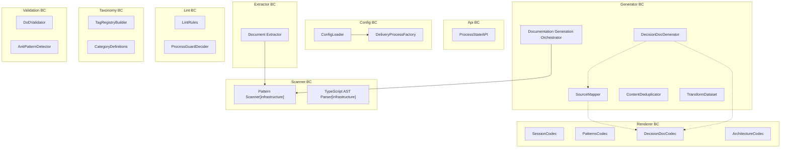

# Architecture

**Purpose:** Auto-generated architecture diagram from source annotations
**Detail Level:** Component diagram with bounded context subgraphs

---

## Overview

This diagram was auto-generated from 21 annotated source files across 9 bounded contexts.

| Metric | Count |
| --- | --- |
| Total Components | 21 |
| Bounded Contexts | 9 |
| Component Roles | 1 |

---

## System Overview

Component architecture with bounded context isolation:

---

## Legend

| Arrow Style | Relationship | Description |
| --- | --- | --- |
| `-->` | uses | Direct dependency (solid arrow) |
| `-.->`  | depends-on | Weak dependency (dashed arrow) |
| `..->`  | implements | Realization relationship (dotted arrow) |
| `-->>`  | extends | Generalization relationship (open arrow) |

---

## Component Inventory

All components with architecture annotations:

| Component | Context | Role | Layer | Source File |
| --- | --- | --- | --- | --- |
| 🚧 Process State API | api | - | application | src/api/process-state.ts |
| ✅ Config Loader | config | - | infrastructure | src/config/config-loader.ts |
| ✅ Delivery Process Factory | config | - | application | src/config/factory.ts |
| ✅ Document Extractor | extractor | - | application | src/extractor/doc-extractor.ts |
| ✅ Content Deduplicator | generator | - | infrastructure | src/generators/content-deduplicator.ts |
| ✅ Decision Doc Generator | generator | - | application | src/generators/built-in/decision-doc-generator.ts |
| ✅ Documentation Generation Orchestrator | generator | - | application | src/generators/orchestrator.ts |
| ✅ Source Mapper | generator | - | infrastructure | src/generators/source-mapper.ts |
| ✅ Transform Dataset | generator | - | application | src/generators/pipeline/transform-dataset.ts |
| ✅ Lint Rules | lint | - | application | src/lint/rules.ts |
| 🚧 Process Guard Decider | lint | - | application | src/lint/process-guard/decider.ts |
| ✅ Architecture Codec | renderer | - | application | src/renderable/codecs/architecture.ts |
| ✅ Decision Doc Codec | renderer | - | application | src/renderable/codecs/decision-doc.ts |
| ✅ Patterns Codec | renderer | - | application | src/renderable/codecs/patterns.ts |
| ✅ Session Codec | renderer | - | application | src/renderable/codecs/session.ts |
| ✅ Pattern Scanner | scanner | infrastructure | infrastructure | src/scanner/pattern-scanner.ts |
| ✅ TypeScript AST Parser | scanner | infrastructure | infrastructure | src/scanner/ast-parser.ts |
| ✅ Category Definitions | taxonomy | - | domain | src/taxonomy/categories.ts |
| ✅ Tag Registry Builder | taxonomy | - | domain | src/taxonomy/registry-builder.ts |
| ✅ Anti Pattern Detector | validation | - | application | src/validation/anti-patterns.ts |
| ✅ DoD Validator | validation | - | application | src/validation/dod-validator.ts |
