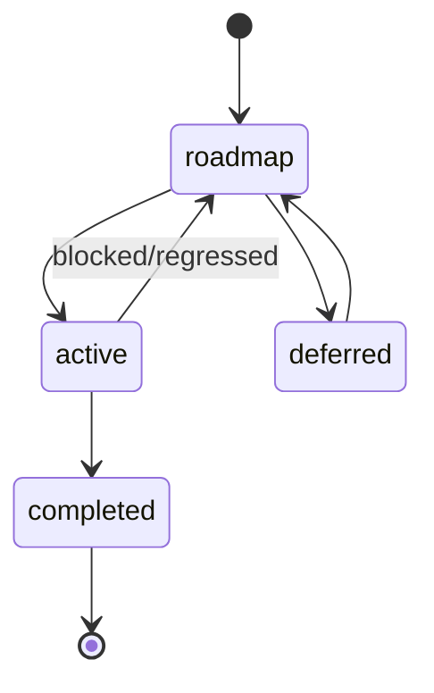

# Next Session: Generate VALIDATION-RULES.md from Process Guard Source

## Context

The TaxonomyCodec is complete and proves the code-first documentation principle. The next step is to **generate validation rules documentation** from the Process Guard implementation, replacing manually maintained reference docs.

**Why VALIDATION-RULES.md is the ideal next candidate:**
1. ALL data exists in `src/lint/process-guard.ts` and `src/validation/` modules
2. The 7 validation rules are defined as TypeScript constants with descriptions
3. FSM transitions are defined in `src/taxonomy/status-values.ts`
4. Protection levels are encoded in the Decider pattern implementation
5. Changes to validation rules require manual doc updates today (maintenance burden)

---

## Objective

Create a `ValidationRulesCodec` that generates `docs-generated/VALIDATION-RULES.md` from TypeScript source, providing:
- Complete validation rule reference
- FSM state diagram (Mermaid)
- Protection level matrix
- Error message catalog with fix instructions

**Output Structure:**
```
docs-generated/
├── VALIDATION-RULES.md              # Main validation reference (generated)
└── validation/
    ├── fsm-transitions.md           # FSM state diagram and transitions
    ├── error-catalog.md             # All error messages with fixes
    └── protection-levels.md         # Protection matrix by status
```

---

## Technical Requirements

### 1. Create ValidationRulesCodec

**Location:** `src/renderable/codecs/validation-rules.ts`

**Input:** `MasterDataset` (standard codec pattern)

**Output:** `RenderableDocument` with sections:

```typescript
interface ValidationRulesDocSections {
  // Main doc sections
  overview: Section;              // What is Process Guard, why it exists
  rules: Section;                 // Table of 7 validation rules
  fsmDiagram: Section;            // Mermaid state diagram
  protectionLevels: Section;      // Protection matrix by status
  errorCatalog: Section;          // All errors with severity and fixes
  cliUsage: Section;              // CLI flags and examples
  escapeHatches: Section;         // How to override validations

  // Additional files
  additionalFiles: DetailFile[];
}
```

**Data Sources:**

| Source File | Data to Extract |
|-------------|-----------------|
| `src/lint/process-guard.ts` | Rule definitions, severities, error messages |
| `src/taxonomy/status-values.ts` | FSM states, valid transitions |
| `src/validation/fsm-validator.ts` | Transition validation logic |
| `src/lint/derive-process-state.ts` | Protection level derivation |

### 2. Extract Validation Rules

From `src/lint/process-guard.ts`, extract:

```typescript
interface ValidationRule {
  ruleId: string;           // e.g., "completed-protection"
  severity: 'error' | 'warning';
  description: string;      // Human-readable explanation
  trigger: string;          // What causes this rule to fire
  fix: string;              // How to resolve the violation
}
```

**7 Known Rules:**
1. `completed-protection` - Completed specs require unlock tag
2. `invalid-status-transition` - Must follow FSM path
3. `scope-creep` - Active specs cannot add deliverables
4. `session-excluded` - Cannot modify excluded files
5. `missing-relationship-target` - Relationship target not found
6. `session-scope` - File outside session scope
7. `deliverable-removed` - Deliverable was removed

### 3. Extract FSM States

From `src/taxonomy/status-values.ts`:

```typescript
interface FSMState {
  status: string;           // roadmap, active, completed, deferred
  protection: string;       // none, scope-locked, hard-locked
  allowedTransitions: string[];
  isTerminal: boolean;
}
```

Generate Mermaid state diagram:


### 4. Protection Level Matrix

| Status | Protection | Can Add Deliverables | Needs Unlock |
|--------|------------|---------------------|--------------|
| roadmap | None | Yes | No |
| active | Scope-locked | No | No |
| completed | Hard-locked | No | Yes |
| deferred | None | Yes | No |

### 5. Register Generator

**Location:** `src/generators/built-in/codec-generators.ts`

```typescript
/**
 * Validation Rules Generator
 * Generates VALIDATION-RULES.md + validation/*.md detail files
 */
generatorRegistry.register(createCodecGenerator('validation-rules', 'validation-rules'));
```

### 6. Add CLI Script

**Location:** `package.json`

```json
"docs:validation": "tsx src/cli/generate-docs.ts -g validation-rules -i 'src/**/*.ts' -o docs-generated -f"
```

---

## Expected Output Format

### Main VALIDATION-RULES.md

```markdown
# Validation Rules Reference

> Process Guard validates delivery workflow changes at commit time.

## Overview

**7 validation rules** | **4 FSM states** | **3 protection levels**

Process Guard uses a Decider pattern to validate proposed changes against
the current process state, ensuring workflow integrity.

---

## Validation Rules

| Rule ID | Severity | Description |
|---------|----------|-------------|
| `completed-protection` | error | Completed specs require `@libar-docs-unlock-reason` |
| `invalid-status-transition` | error | Must follow FSM path |
| `scope-creep` | error | Active specs cannot add new deliverables |
| ... | ... | ... |

[Full rule reference](validation/error-catalog.md)

---

## FSM States

\`\`\`mermaid
stateDiagram-v2
    [*] --> roadmap
    roadmap --> active
    roadmap --> deferred
    active --> completed
    active --> roadmap : blocked
    deferred --> roadmap
    completed --> [*]
\`\`\`

**Valid Transitions:**
- `roadmap` → `active` → `completed` (normal flow)
- `active` → `roadmap` (blocked/regressed)
- `roadmap` ↔ `deferred` (parking)

[FSM details](validation/fsm-transitions.md)

---

## Protection Levels

| Status | Protection | Allowed | Blocked |
|--------|------------|---------|---------|
| `roadmap` | None | Full editing | - |
| `active` | Scope-locked | Edit existing | Add deliverables |
| `completed` | Hard-locked | Nothing | Any change |
| `deferred` | None | Full editing | - |

[Protection details](validation/protection-levels.md)

---

## CLI Usage

\`\`\`bash
# Pre-commit (default mode)
lint-process --staged

# CI pipeline with strict mode
lint-process --all --strict

# Debug: show derived process state
lint-process --staged --show-state
\`\`\`

| Flag | Description |
|------|-------------|
| `--staged` | Validate staged files only |
| `--all` | Validate all tracked files |
| `--strict` | Treat warnings as errors |
| `--ignore-session` | Skip session scope validation |

---

## Escape Hatches

| Situation | Solution | Example |
|-----------|----------|---------|
| Fix bug in completed spec | Add unlock tag | `@libar-docs-unlock-reason:'Fix-typo'` |
| Modify outside scope | Use ignore flag | `lint-process --staged --ignore-session` |
```

---

## Implementation Steps

1. **Explore the Process Guard implementation**
   - Read `src/lint/process-guard.ts` for rule definitions
   - Read `src/taxonomy/status-values.ts` for FSM states
   - Read `src/validation/fsm-validator.ts` for transition logic

2. **Create the codec** (`src/renderable/codecs/validation-rules.ts`)
   - Follow TaxonomyCodec pattern
   - Extract rules from Decider implementation
   - Build FSM diagram from status values

3. **Register the generator**
   - Add to `generate.ts` (DOCUMENT_TYPES, CODEC_MAP, CODEC_FACTORY_MAP)
   - Add to `codec-generators.ts`

4. **Add CLI script**
   - Add `docs:validation` to package.json

5. **Verify output**
   - Run `pnpm docs:validation`
   - Compare with manual docs in CLAUDE.md validation section

6. **Add tests**
   - Create `tests/features/codecs/validation-rules.feature`

---

## Key Files to Reference

| File | Purpose |
|------|---------|
| `src/lint/process-guard.ts` | Rule definitions, Decider implementation |
| `src/lint/derive-process-state.ts` | Process state derivation |
| `src/taxonomy/status-values.ts` | FSM states and transitions |
| `src/validation/fsm-validator.ts` | Transition validation |
| `src/renderable/codecs/taxonomy.ts` | Reference codec pattern |
| `CLAUDE.md` (Validation section) | Manual docs to compare |

---

## Validation Checklist

- [ ] `pnpm build` passes
- [ ] `pnpm typecheck` passes
- [ ] `pnpm lint` passes
- [ ] `pnpm docs:validation` runs successfully
- [ ] Generated `docs-generated/VALIDATION-RULES.md` contains:
  - [ ] All 7 validation rules with descriptions
  - [ ] FSM state diagram (Mermaid)
  - [ ] Protection level matrix
  - [ ] CLI usage examples
  - [ ] Error catalog with fixes
- [ ] Content matches or exceeds CLAUDE.md validation section
- [ ] Tests pass (`pnpm test validation-rules`)

---

## Success Criteria

The generated `docs-generated/VALIDATION-RULES.md` should:
1. Contain ALL 7 validation rules from Process Guard
2. Include FSM diagram generated from status-values.ts
3. Show protection levels derived from code
4. Provide error catalog with fix instructions
5. Stay automatically in sync when validation rules change
6. Require zero manual maintenance

This extends the code-first documentation proof to **behavioral rules**, showing that
even complex validation logic can be documented automatically from source.
