# Pattern Registry

**Purpose:** Quick reference for discovering and implementing patterns
**Detail Level:** Overview with links to details

---

## Progress

**Overall:** [██████████████░░░░░░] 200/289 (69% complete)

| Status | Count |
| --- | --- |
| ✅ Completed | 200 |
| 🚧 Active | 47 |
| 📋 Planned | 42 |
| **Total** | 289 |

---

## Categories

- [Architecture](#architecture) (5)
- [Behavior](#behavior) (41)
- [Cli](#cli) (12)
- [Config](#config) (1)
- [Core](#core) (72)
- [DDD](#ddd) (84)
- [Extract](#extract) (1)
- [Extractor](#extractor) (3)
- [Generator](#generator) (3)
- [Infra](#infra) (1)
- [Lint](#lint) (10)
- [Opportunity 2](#opportunity-2) (1)
- [Opportunity 3](#opportunity-3) (1)
- [Opportunity 4](#opportunity-4) (1)
- [Opportunity 5](#opportunity-5) (1)
- [Opportunity 6](#opportunity-6) (1)
- [Opportunity 8](#opportunity-8) (1)
- [Pattern](#pattern) (13)
- [Pattern Relationships](#pattern-relationships) (2)
- [Poc](#poc) (1)
- [Renderable](#renderable) (1)
- [Scanner](#scanner) (5)
- [Shape](#shape) (2)
- [Status](#status) (10)
- [Types](#types) (2)
- [Used](#used) (1)
- [Utils](#utils) (1)
- [Validation](#validation) (12)

---

## All Patterns

| Pattern | Category | Status | Description |
| --- | --- | --- | --- |
| ✅ Adr Document Codec | Core | completed | Transforms MasterDataset into RenderableDocument for Architecture Decision Records. |
| ✅ Anti Pattern Detector | Validation | completed | Detects violations of the dual-source documentation architecture and process hygiene issues that lead to... |
| ✅ Anti Pattern Detector Testing | Behavior | completed | Detects violations of the dual-source documentation architecture and process hygiene issues that lead to... |
| ✅ Arch Generator Registration | Architecture | completed | As a CLI user I want an architecture generator registered in the generator registry So that I can run pnpm... |
| ✅ Arch Index Dataset | Architecture | completed | As a documentation generator I want an archIndex built during dataset transformation So that I can efficiently look... |
| ✅ Architecture Codec | Core | completed | Transforms MasterDataset into a RenderableDocument containing architecture diagrams (Mermaid) generated from source... |
| ✅ Arch Tag Extraction | Architecture | completed | As a documentation generator I want architecture tags extracted from source code So that I can generate accurate... |
| ✅ Ast Parser | Scanner | completed | The AST Parser extracts @libar-docs-* directives from TypeScript source files using the TypeScript compiler API. |
| ✅ Built In Generators | Generator | completed | Registers all codec-based generators on import using the RDM (RenderableDocument Model) architecture. |
| ✅ Business Rules Codec | Core | completed | :Progressive-disclosure-by-product-area Transforms MasterDataset into a RenderableDocument for business rules output. |
| ✅ Business Rules Document Codec | DDD | completed | Tests the BusinessRulesCodec transformation from MasterDataset to RenderableDocument. |
| ✅ Category Definitions | Core | completed | Categories are used to classify patterns and organize documentation. |
| ✅ CLI Error Handler | Cli | completed | Provides type-safe error handling for all CLI commands using the DocError discriminated union pattern. |
| ✅ CLI Version Helper | Cli | completed | Reads package version from package.json for CLI --version flag. |
| ✅ Codec Based Generator | Core | completed | Adapts the new RenderableDocument Model (RDM) codec system to the existing DocumentGenerator interface. |
| ✅ Codec Based Generator Testing | DDD | completed | Tests the CodecBasedGenerator which adapts the RenderableDocument Model (RDM) codec system to the DocumentGenerator... |
| ✅ Codec Base Options | Core | completed | Shared types, interfaces, and utilities for all document codecs. |
| ✅ Codec Driven Reference Generation | DDD | completed | Each reference document (Process Guard, Taxonomy, Validation, etc.) required a hand-coded recipe feature that... |
| ✅ Codec Generator Registration | Core | completed | Registers codec-based generators for the RenderableDocument Model (RDM) system. |
| ✅ Codec Utils | Core | completed | Provides factory functions for creating type-safe JSON parsing and serialization pipelines using Zod schemas. |
| ✅ Collection Utilities | Core | completed | Provides shared utilities for working with arrays and collections, such as grouping items by a key function. |
| ✅ Component Diagram Generation | Architecture | completed | As a documentation generator I want to generate component diagrams from architecture metadata So that system... |
| ✅ Composite Codec Testing | DDD | completed | Assembles reference documents from multiple codec outputs by concatenating RenderableDocument sections. |
| ✅ Config Loader | Core | completed | Discovers and loads `delivery-process.config.ts` files for hierarchical configuration. |
| ✅ Config Loader Testing | Behavior | completed | The config loader discovers and loads `delivery-process.config.ts` files for hierarchical configuration, enabling... |
| ✅ Config Resolution | Behavior | completed | resolveProjectConfig transforms a raw DeliveryProcessProjectConfig into a fully resolved ResolvedConfig with all... |
| ✅ Config Schema Validation | Validation | completed | Configuration schemas validate scanner and generator inputs with security constraints to prevent path traversal... |
| ✅ Configuration API | Behavior | completed | The createDeliveryProcess factory provides a type-safe way to configure the delivery process with custom tag prefixes... |
| ✅ Configuration Defaults | Core | completed | Centralized default constants for the delivery-process package. |
| ✅ Configuration Presets | Core | completed | Predefined configuration presets for common use cases. |
| ✅ Configuration Types | Core | completed | Type definitions for the delivery process configuration system. |
| ✅ Content Deduplication | DDD | completed | Context: Multiple sources may extract identical content, leading to duplicate sections in generated documentation. |
| ✅ Content Deduplicator | Core | completed | Identifies and merges duplicate sections extracted from multiple sources. |
| ✅ Context Inference | Behavior | completed | Patterns in standard directories (src/validation/, src/scanner/) should automatically receive architecture context... |
| ✅ Convention Extractor Testing | Behavior | completed | Extracts convention content from MasterDataset decision records tagged with @libar-docs-convention. |
| ✅ Cross Cutting Document Inclusion | DDD | completed | The reference doc codec assembles content from four sources, each with its own selection mechanism: conventionTags... |
| ✅ Data API Architecture Queries | DDD | completed | The current `arch` subcommand provides basic queries (roles, context, layer, graph) but lacks deeper analysis needed... |
| ✅ Data API Context Assembly | DDD | completed | Starting a Claude Code design or implementation session requires assembling 30-100KB of curated, multi-source context... |
| ✅ Data API Design Session Support | DDD | completed | Starting a design or implementation session requires manually compiling elaborate context prompts. |
| ✅ Data API Output Shaping | DDD | completed | The ProcessStateAPI CLI returns raw `ExtractedPattern` objects via `JSON.stringify`. |
| ✅ Data API Stub Integration | DDD | completed | Design sessions produce code stubs in `delivery-process/stubs/` with rich metadata: `@target` (destination file... |
| ✅ Decision Doc Codec | Core | completed | Parses decision documents (ADR/PDR in .feature format) and extracts content for documentation generation. |
| ✅ Decision Doc Codec Testing | DDD | completed | Validates the Decision Doc Codec that parses decision documents (ADR/PDR in .feature format) and extracts content for... |
| ✅ Decision Doc Generator | Core | completed | Orchestrates the full pipeline for generating documentation from decision documents (ADR/PDR in .feature format): 1. |
| ✅ Decision Doc Generator Testing | DDD | completed | The Decision Doc Generator orchestrates the full documentation generation pipeline from decision documents (ADR/PDR in . |
| ✅ Declaration Level Shape Tagging | DDD | completed | The current shape extraction system operates at file granularity. |
| ✅ Declaration Level Shape Tagging Testing | DDD | completed | Tests the discoverTaggedShapes function that scans TypeScript source code for declarations annotated with the... |
| ✅ Dedent Helper | Behavior | completed | The dedent helper function normalizes indentation in code blocks extracted from DocStrings. |
| ✅ Define Config Testing | Behavior | completed | The defineConfig identity function and DeliveryProcessProjectConfigSchema provide type-safe configuration authoring... |
| ✅ Delivery Process Factory | Core | completed | Main factory function for creating configured delivery process instances. |
| ✅ Description Header Normalization | DDD | completed | Pattern descriptions should not create duplicate headers when rendered. |
| ✅ Description Quality Foundation | Behavior | completed | Enhanced documentation generation with human-readable names, behavior file verification, and numbered acceptance... |
| ✅ Detect Changes Testing | Behavior | completed | Tests for the detectDeliverableChanges function that parses git diff output. |
| ✅ Directive Detection | Behavior | completed | Pure functions that detect @libar-docs directives in TypeScript source code. |
| ✅ Doc Directive Schema | Validation | completed | Zod schemas for validating parsed @libar-docs-* directives from JSDoc comments. |
| ✅ Doc String Media Type | DDD | completed | DocString language hints (mediaType) should be preserved through the parsing pipeline from feature files to rendered... |
| ✅ Document Extractor | Core | completed | Converts scanned file data into complete ExtractedPattern objects with unique IDs, inferred names, categories, and... |
| ✅ Documentation Generation Orchestrator | Core | completed | Orchestrates the complete documentation generation pipeline: Scanner → Extractor → Generators → File Writer Extracts... |
| ✅ Documentation Generator CLI | Core | completed | Replaces multiple specialized CLIs with one unified interface that supports multiple generators in a single run. |
| ✅ Documentation Orchestrator | DDD | completed | Tests the orchestrator's pattern merging, conflict detection, and generator coordination capabilities. |
| ✅ Document Codecs | Core | completed | Barrel export for all document codecs. |
| ✅ Document Generator | Core | completed | Simplified document generation using codecs. |
| ✅ DoD Validation Types | Validation | completed | Types and schemas for Definition of Done (DoD) validation and anti-pattern detection. |
| ✅ DoD Validator | Validation | completed | Validates that completed phases meet Definition of Done criteria: 1. |
| ✅ DoD Validator Testing | Behavior | completed | Validates that completed phases meet Definition of Done criteria: 1. |
| ✅ Dual Source Extractor | Extractor | completed | Extracts pattern metadata from both TypeScript code stubs (@libar-docs-*) and Gherkin feature files (@libar-docs-*),... |
| ✅ Dual Source Extractor Testing | Behavior | completed | Extracts and combines pattern metadata from both TypeScript code stubs (@libar-docs-) and Gherkin feature files... |
| ✅ Dual Source Schemas | Validation | completed | Zod schemas for dual-source extraction types. |
| ✅ Error Factories | Types | completed | Error factories create structured, discriminated error types with consistent message formatting. |
| ✅ Error Handling Unification | Behavior | completed | All CLI commands and extractors should use the DocError discriminated union pattern for consistent, structured error... |
| ✅ Extends Tag Testing | DDD | completed | Tests for the @libar-docs-extends tag which establishes generalization relationships between patterns (pattern... |
| ✅ Extracted Pattern Schema | Validation | completed | Zod schema for validating complete extracted patterns with code, metadata, relationships, and source information. |
| ✅ Extracted Shape Schema | Pattern | completed | Zod schema for TypeScript type definitions extracted from source files via the @libar-docs-extract-shapes tag. |
| ✅ Extraction Pipeline Enhancements Testing | DDD | completed | Validates extraction pipeline capabilities for ReferenceDocShowcase: function signature surfacing, full... |
| ✅ Extract Summary | Renderable | completed | The extractSummary function transforms multi-line pattern descriptions into concise, single-line summaries suitable... |
| ✅ File Discovery | Scanner | completed | The file discovery system uses glob patterns to find TypeScript files for documentation extraction. |
| ✅ Format Types | Core | completed | Defines how tag values are parsed and validated. |
| ✅ FSM Validator Testing | Behavior | completed | Pure validation functions for the 4-state FSM defined in PDR-005. |
| ✅ Generate Docs Cli | Cli | completed | Command-line interface for generating documentation from annotated TypeScript. |
| ✅ Generate Tag Taxonomy Cli | Cli | completed | Command-line interface for generating TAG_TAXONOMY.md from tag registry configuration. |
| ✅ Generator Registry | Generator | completed | Manages registration and lookup of document generators (both built-in and custom). |
| ✅ Generator Registry Testing | DDD | completed | Tests the GeneratorRegistry registration, lookup, and listing capabilities. |
| ✅ Generator Types | Generator | completed | Minimal interface for pluggable generators that produce documentation from patterns. |
| ✅ Gherkin Ast Parser | Scanner | completed | The Gherkin AST parser extracts feature metadata, scenarios, and steps from .feature files for timeline generation... |
| ✅ Gherkin AST Parser | Scanner | completed | Parses Gherkin feature files using @cucumber/gherkin and extracts structured data including feature metadata, tags,... |
| ✅ Gherkin Extractor | Extractor | completed | Transforms scanned Gherkin feature files into ExtractedPattern objects for inclusion in generated documentation. |
| ✅ Gherkin Rules Support | DDD | completed | Feature files were limited to flat scenario lists. |
| ✅ Gherkin Scanner | Scanner | completed | Scans .feature files for pattern metadata encoded in Gherkin tags. |
| ✅ Handoff Generator Impl | Pattern | completed | Pure function that assembles a handoff document from ProcessStateAPI and MasterDataset. |
| ✅ Handoff Generator Tests | DDD | completed | Multi-session work loses critical state between sessions when handoff documentation is manual or forgotten. |
| ✅ Hierarchy Levels | Core | completed | Three-level hierarchy for organizing work: - epic: Multi-quarter strategic initiatives - phase: Standard work units... |
| ✅ Implementation Link Path Normalization | DDD | completed | Links to implementation files in generated pattern documents should have correct relative paths. |
| ✅ Implements Tag Processing | DDD | completed | Tests for the @libar-docs-implements tag which links implementation files to their corresponding roadmap pattern... |
| ✅ Layered Diagram Generation | Architecture | completed | As a documentation generator I want to generate layered architecture diagrams from metadata So that system... |
| ✅ Layer Inference | Extractor | completed | Infers feature file layer (timeline, domain, integration, e2e, component) from directory path patterns. |
| ✅ Layer Inference Testing | Behavior | completed | The layer inference module classifies feature files into testing layers (timeline, domain, integration, e2e,... |
| ✅ Layer Types | Core | completed | Inferred from feature file directory paths: - timeline: Process/workflow features (delivery-process) - domain:... |
| ✅ Lint Engine | Lint | completed | Orchestrates lint rule execution against parsed directives. |
| ✅ Lint Engine Testing | Lint | completed | The lint engine orchestrates rule execution, aggregates violations, and formats output for human and machine... |
| ✅ Linter Validation Testing | DDD | completed | Tests for lint rules that validate relationship integrity, detect conflicts, and ensure bidirectional traceability... |
| ✅ Lint Module | Lint | completed | Provides lint rules and engine for pattern annotation quality checking. |
| ✅ Lint Patterns Cli | Cli | completed | Command-line interface for validating pattern annotation quality. |
| ✅ Lint Patterns CLI | Cli | completed | Validates pattern annotations for quality and completeness. |
| ✅ Lint Process Cli | Cli | completed | Command-line interface for validating changes against delivery process rules. |
| ✅ Lint Rules | Lint | completed | Defines lint rules that check @libar-docs-* directives for completeness and quality. |
| ✅ Lint Rules Testing | Lint | completed | The lint system validates @libar-docs-* documentation annotations for quality. |
| ✅ Master Dataset | Core | completed | Defines the schema for a pre-computed dataset that holds all extracted patterns along with derived views (by status,... |
| ✅ Mermaid Relationship Rendering | DDD | completed | Tests for rendering all relationship types in Mermaid dependency graphs with distinct visual styles per relationship... |
| ✅ Mvp Workflow Implementation | DDD | completed | PDR-005 defines a 4-state workflow FSM (`roadmap, active, completed, deferred`) but the delivery-process package... |
| ✅ Normalized Status | Core | completed | The delivery-process system uses a two-level status taxonomy: 1. |
| ✅ Output Schemas | Core | completed | Zod schemas for JSON output formats used by CLI tools. |
| ✅ Pattern Scanner | Core | completed | Discovers TypeScript files matching glob patterns and filters to only those with `@libar-docs` opt-in. |
| ✅ Pattern Id Generator | Core | completed | Generates unique, deterministic pattern IDs based on file path and line number. |
| ✅ Pattern Relationship Model | DDD | completed | Problem: The delivery process lacks a comprehensive relationship model between artifacts. |
| ✅ Patterns Codec | Core | completed | Transforms MasterDataset into a RenderableDocument for pattern registry output. |
| ✅ Patterns Codec Testing | Behavior | completed | The PatternsDocumentCodec transforms MasterDataset into a RenderableDocument for generating PATTERNS.md and category... |
| ✅ Pattern Tag Extraction | Behavior | completed | The extractPatternTags function parses Gherkin feature tags into structured metadata objects for pattern processing. |
| ✅ Phase State Machine Validation | DDD | completed | Phase lifecycle state transitions are not enforced programmatically despite being documented in PROCESS_SETUP.md. |
| ✅ Pipeline Module | Infra | completed | Barrel export for the unified transformation pipeline components. |
| ✅ Planning Codecs | Core | completed | Transforms MasterDataset into RenderableDocuments for planning outputs: - PLANNING-CHECKLIST.md (pre-planning... |
| ✅ Planning Codec Testing | Behavior | completed | The planning codecs (PlanningChecklistCodec, SessionPlanCodec, SessionFindingsCodec) transform MasterDataset into... |
| ✅ Poc Integration | DDD | completed | End-to-end integration tests that exercise the full documentation generation pipeline using the actual POC decision... |
| ✅ Pr Changes Codec | Core | completed | Transforms MasterDataset into RenderableDocument for PR-scoped output. |
| ✅ Pr Changes Codec Testing | Behavior | completed | The PrChangesCodec transforms MasterDataset into RenderableDocument for PR-scoped documentation. |
| ✅ Pr Changes Generation | Behavior | completed | The delivery process generates PR-CHANGES.md from active or completed phases, formatted for PR descriptions, code... |
| ✅ Pr Changes Options | DDD | completed | Tests the PrChangesCodec filtering capabilities for generating PR-scoped documentation. |
| ✅ Prd Implementation Section Testing | DDD | completed | Tests the Implementations section rendering in pattern documents. |
| ✅ Preset System | Behavior | completed | Presets provide pre-configured taxonomies for different project types. |
| ✅ Process Api Cli | Cli | completed | Command-line interface for querying delivery process state via ProcessStateAPI. |
| ✅ Process Guard Linter | DDD | completed | During planning and implementation sessions, accidental modifications occur: - Specs outside the intended scope get... |
| ✅ Process Guard Testing | Behavior | completed | Pure validation functions for enforcing delivery process rules per PDR-005. |
| ✅ Process State API CLI | DDD | completed | The ProcessStateAPI provides 27 typed query methods for efficient state queries, but Claude Code sessions cannot use... |
| ✅ Process State API Testing | Behavior | completed | Programmatic interface for querying delivery process state. |
| ✅ Project Config Loader | Behavior | completed | loadProjectConfig loads and resolves configuration from file, supporting both new-style defineConfig and legacy... |
| ✅ Public API | Core | completed | Main entry point for the @libar-dev/delivery-process package. |
| ✅ Reference Codec Testing | Behavior | completed | Parameterized codec factory that creates reference document codecs from configuration objects. |
| ✅ Reference Generator Testing | Behavior | completed | Registers reference document generators from project config. |
| ✅ Regex Builders | Core | completed | Type-safe regex factory functions for tag detection and normalization. |
| ✅ Remaining Work Enhancement | Behavior | completed | Enhanced REMAINING-WORK.md generation with priority-based sorting, quarter grouping, and progressive disclosure for... |
| ✅ Remaining Work Summary Accuracy | DDD | completed | Summary totals in REMAINING-WORK.md must match the sum of phase table rows. |
| ✅ Renderable Document | Core | completed | Universal intermediate format for all generated documentation. |
| ✅ Renderable Document Model(RDM) | Core | completed | Unified document generation using codecs and a universal renderer. |
| ✅ Renderable Utils | Core | completed | Utility functions for document codecs. |
| ✅ Reporting Codecs | Core | completed | Transforms MasterDataset into RenderableDocuments for reporting outputs: - CHANGELOG-GENERATED.md (Keep a Changelog... |
| ✅ Reporting Codec Testing | Behavior | completed | The reporting codecs (ChangelogCodec, TraceabilityCodec, OverviewCodec) transform MasterDataset into... |
| ✅ Requirements Adr Codec Testing | Behavior | completed | The RequirementsDocumentCodec and AdrDocumentCodec transform MasterDataset into RenderableDocuments for PRD-style and... |
| ✅ Requirements Codec | Core | completed | Transforms MasterDataset into RenderableDocument for PRD/requirements output. |
| ✅ Result Monad | Types | completed | The Result type provides explicit error handling via a discriminated union. |
| ✅ Rich Content Helpers | Core | completed | Shared helper functions for rendering Gherkin rich content in document codecs. |
| ✅ Risk Levels | Core | completed | Three-tier risk classification for roadmap planning. |
| ✅ Robustness Integration | DDD | completed | Context: Document generation pipeline needs validation, deduplication, and warning collection to work together... |
| ✅ Rule Keyword Po C | Poc | completed | This feature tests whether vitest-cucumber supports the Rule keyword for organizing scenarios under business rules. |
| ✅ Scanner Core | Behavior | completed | The scanPatterns function orchestrates file discovery, directive detection, and AST parsing to extract documentation... |
| ✅ Scoped Architectural View | DDD | completed | Full architecture diagrams show every annotated pattern in the project. |
| ✅ Scope Validator Impl | Pattern | completed | Pure function composition over ProcessStateAPI and MasterDataset. |
| ✅ Scope Validator Tests | DDD | completed | Starting an implementation or design session without checking prerequisites wastes time when blockers are discovered... |
| ✅ Session Codec | Core | completed | Transforms MasterDataset into RenderableDocuments for session/planning outputs: - SESSION-CONTEXT.md (current session... |
| ✅ Session Codec Testing | Behavior | completed | The session codecs (SessionContextCodec, RemainingWorkCodec) transform MasterDataset into RenderableDocuments for AI... |
| ✅ Session File Lifecycle | Behavior | completed | Orphaned session files are automatically cleaned up during generation, maintaining a clean docs-living/sessions/... |
| ✅ Session Handoffs | Behavior | completed | The delivery process supports mid-phase handoffs between sessions and coordination across multiple developers through... |
| ✅ Shape Extraction | DDD | completed | Documentation comments duplicate type definitions that exist in the same file. |
| ✅ Shape Extraction Testing | DDD | completed | Validates the shape extraction system that extracts TypeScript type definitions (interfaces, type aliases, enums,... |
| ✅ Shape Extractor | Pattern | completed | Extracts TypeScript type definitions (interfaces, type aliases, enums, function signatures) from source files for... |
| ✅ Shape Matcher Testing | Behavior | completed | Matches file paths against glob patterns for TypeScript shape extraction. |
| ✅ Shape Selector Testing | DDD | completed | Tests the filterShapesBySelectors function that provides fine-grained shape selection via structural discriminated... |
| ✅ Shared Codec Schema | Core | completed | Provides a simplified RenderableDocument output schema for use with Zod 4 codecs. |
| ✅ Source Mapper | Core | completed | Aggregates content from multiple source files based on source mapping tables parsed from decision documents. |
| ✅ Source Mapper Testing | DDD | completed | The Source Mapper aggregates content from multiple source files based on source mapping tables parsed from decision... |
| ✅ Source Mapping Validator | Core | completed | Performs pre-flight checks on source mapping tables before extraction begins. |
| ✅ Source Mapping Validator Testing | DDD | completed | Context: Source mappings reference files that may not exist, use invalid extraction methods, or have incompatible... |
| ✅ Source Merging | Behavior | completed | mergeSourcesForGenerator computes effective sources for a specific generator by applying per-generator overrides to... |
| ✅ Status Transition Detection Testing | Behavior | completed | Tests for the detectStatusTransitions function that parses git diff output. |
| ✅ Status Values | Core | completed | THE single source of truth for FSM state values in the monorepo (per PDR-005 FSM). |
| ✅ String Utilities | Core | completed | Provides shared utilities for string manipulation used across the delivery-process package, including slugification... |
| ✅ String Utils | Utils | completed | String utilities provide consistent text transformations across the codebase. |
| ✅ Table Extraction | DDD | completed | Tables in business rule descriptions should appear exactly once in output. |
| ✅ Tag Registry Configuration | Core | completed | Defines the structure and validation for tag taxonomy configuration. |
| ✅ Tag Registry Builder | Core | completed | Constructs a complete TagRegistry from TypeScript constants. |
| ✅ Taxonomy Codec | Core | completed | Transforms MasterDataset into a RenderableDocument for taxonomy reference output. |
| ✅ Taxonomy Codec Testing | DDD | completed | Validates the Taxonomy Codec that transforms MasterDataset into a RenderableDocument for tag taxonomy reference... |
| ✅ Timeline Codec | Core | completed | Transforms MasterDataset into RenderableDocuments for timeline outputs: - ROADMAP.md (phase breakdown with progress)... |
| ✅ Timeline Codec Testing | Behavior | completed | The timeline codecs (RoadmapDocumentCodec, CompletedMilestonesCodec, CurrentWorkCodec) transform MasterDataset into... |
| ✅ Transform Dataset | Core | completed | Transforms raw extracted patterns into a MasterDataset with all pre-computed views. |
| ✅ Transform Dataset Testing | Behavior | completed | The transformToMasterDataset function transforms raw extracted patterns into a MasterDataset with all pre-computed... |
| ✅ TypeScript AST Parser | Core | completed | Parses TypeScript source files using @typescript-eslint/typescript-estree to extract @libar-docs-* directives with... |
| ✅ TypeScript Taxonomy Implementation | DDD | completed | As a delivery-process developer I want taxonomy defined in TypeScript with Zod integration So that I get compile-time... |
| ✅ Universal Doc Generator Robustness | DDD | completed | This feature transforms the PoC document generator into a production-ready universal generator capable of operating... |
| ✅ Universal Markdown Renderer | Behavior | completed | The universal renderer converts RenderableDocument to markdown. |
| ✅ Universal Renderer | Core | completed | Converts RenderableDocument to output strings. |
| ✅ Utils Module | Core | completed | Common helper functions used across the delivery-process package. |
| ✅ Validate Patterns Cli | Cli | completed | Command-line interface for cross-validating TypeScript patterns vs Gherkin feature files. |
| ✅ Validate Patterns CLI | Cli | completed | Cross-validates TypeScript patterns vs Gherkin feature files. |
| ✅ Validation Module | Validation | completed | Barrel export for validation module providing: - Definition of Done (DoD) validation for completed phases -... |
| ✅ Validation Rules Codec | Core | completed | Transforms MasterDataset into a RenderableDocument for Process Guard validation rules reference. |
| ✅ Validation Rules Codec Testing | DDD | completed | Validates the Validation Rules Codec that transforms MasterDataset into a RenderableDocument for Process Guard... |
| ✅ Warning Collector | Core | completed | Provides a unified system for capturing, categorizing, and reporting non-fatal issues during document generation. |
| ✅ Warning Collector Testing | DDD | completed | The warning collector provides a unified system for capturing, categorizing, and reporting non-fatal issues during... |
| ✅ Workflow Config Schema | Validation | completed | Zod schemas for validating workflow configuration files that define status models, phase definitions, and artifact... |
| ✅ Workflow Loader | Config | completed | Loads and validates workflow configuration from JSON files in the catalogue. |
| ✅ Zod Codec Migration | Behavior | completed | All JSON parsing and serialization uses type-safe Zod codec pattern, replacing raw JSON.parse/stringify with... |
| 🚧 API Module | Core | active | Central export for the Process State API, providing a TypeScript interface for querying delivery process state. |
| 🚧 Arch Queries Impl | Pattern | active | Pure functions over MasterDataset for deep architecture exploration. |
| 🚧 Arch Queries Test | DDD | active | - |
| 🚧 Composite Codec | Core | active | Assembles reference documents from multiple codec outputs by concatenating RenderableDocument sections. |
| 🚧 Config Resolver | Core | active | Resolves a raw `DeliveryProcessProjectConfig` into a fully-resolved `ResolvedConfig` with all defaults applied, stubs... |
| 🚧 Context Assembler Impl | Pattern | active | Pure function composition over MasterDataset. |
| 🚧 Context Assembler Tests | DDD | active | Tests for assembleContext(), buildDepTree(), buildFileReadingList(), and buildOverview() pure functions that operate... |
| 🚧 Context Formatter Impl | Pattern | active | First plain-text formatter in the codebase. |
| 🚧 Context Formatter Tests | DDD | active | Tests for formatContextBundle(), formatDepTree(), formatFileReadingList(), and formatOverview() plain text rendering... |
| 🚧 Coverage Analyzer Impl | Pattern | active | Reports annotation completeness by comparing scannable files (from glob) against annotated patterns in MasterDataset. |
| 🚧 Define Config | Core | active | Identity function for type-safe project configuration. |
| 🚧 Deliverable Status Taxonomy | Core | active | Canonical status values for deliverables in Gherkin Background tables. |
| 🚧 Depends On Tag Testing | Pattern Relationships | active | Tests extraction of @libar-docs-depends-on and @libar-docs-enables relationship tags from Gherkin files. |
| 🚧 Derive Process State | Lint | active | :GherkinScanner,FSMValidator Derives process state from @libar-docs-* annotations in files. |
| 🚧 Detect Changes | Lint | active | Detects changes from git diff including: - Modified, added, deleted files - Status transitions (@libar-docs-status... |
| 🚧 File Cache | Pattern | active | Simple Map-based cache for file contents during a single generation run. |
| 🚧 FSM Module | Validation | active | :PDR005MvpWorkflow Central export for the 4-state FSM defined in PDR-005: ``` roadmap ──→ active ──→ completed │     ... |
| 🚧 FSM States | Extract | active | :PDR005MvpWorkflow Defines the 4-state FSM from PDR-005 MVP Workflow: - roadmap: Planned work (fully editable) -... |
| 🚧 FSM Transitions | Validation | active | :PDR005MvpWorkflow Defines valid transitions between FSM states per PDR-005: ``` roadmap ──→ active ──→ completed │  ... |
| 🚧 FSM Validator | Validation | active | :PDR005MvpWorkflow Pure validation functions following the Decider pattern: - No I/O, no side effects - Return... |
| 🚧 Fuzzy Matcher Impl | Core | active | Provides fuzzy matching for pattern names with tiered scoring: exact (1.0) > prefix (0.9) > substring (0.7) >... |
| 🚧 Fuzzy Match Tests | DDD | active | Validates tiered fuzzy matching: exact > prefix > substring > Levenshtein. |
| 🚧 Lint Process CLI | Cli | active | Validates git changes against delivery process rules. |
| 🚧 Output Pipeline Impl | Core | active | Post-processing pipeline that transforms raw API results into shaped CLI output. |
| 🚧 Output Pipeline Tests | DDD | active | Validates the output pipeline transforms: summarization, modifiers, list filters, empty stripping, and format output. |
| 🚧 Pattern Helpers | Pattern | active | Common helper functions used by context-assembler, arch-queries, and other API modules that need pattern name... |
| 🚧 Pattern Helpers Tests | DDD | active | - |
| 🚧 Pattern Summarizer Impl | Core | active | Projects the full ExtractedPattern (~3.5KB per pattern) down to a PatternSummary (~100 bytes) for list queries. |
| 🚧 Pattern Summarize Tests | DDD | active | Validates that summarizePattern() projects ExtractedPattern (~3.5KB) to PatternSummary (~100 bytes) with the correct... |
| 🚧 Process API CLI Impl | Core | active | Exposes ProcessStateAPI methods as CLI subcommands with JSON output. |
| 🚧 Process Guard Decider | Lint | active | :FSMValidator,DeriveProcessState,DetectChanges Pure function that validates changes against process rules. |
| 🚧 Process Guard Module | Lint | active | :FSMValidator,DeriveProcessState,DetectChanges,ProcessGuardDecider Enforces delivery process rules by validating... |
| 🚧 Process Guard Types | Lint | active | :FSMValidator Defines types for the process guard linter including: - Process state derived from file annotations -... |
| 🚧 Process State API | Core | active | TypeScript interface for querying delivery process state. |
| 🚧 Process State API Relationship Queries | DDD | active | Problem: ProcessStateAPI currently supports dependency queries (`uses`, `usedBy`, `dependsOn`, `enables`) but lacks... |
| 🚧 Process State Types | Core | active | :MasterDataset Type definitions for the ProcessStateAPI query interface. |
| 🚧 Project Config Schema | Core | active | Zod validation schema for `DeliveryProcessProjectConfig`. |
| 🚧 Project Config Types | Core | active | Unified project configuration for the delivery-process package. |
| 🚧 Reference Doc Showcase | DDD | active | The Reference Generation Sample document exercises a small fraction of the reference codec's capabilities: 2... |
| 🚧 Reference Document Codec | Pattern | active | A single codec factory that creates reference document codecs from configuration objects. |
| 🚧 Reference Generator Registration | Pattern | active | Registers all reference document generators. |
| 🚧 Source Merger | Core | active | Computes effective sources for a specific generator by applying per-generator overrides to the base resolved sources. |
| 🚧 Step Lint Vitest Cucumber | DDD | active | Hours are lost debugging vitest-cucumber-specific issues that only surface at test runtime. |
| 🚧 Stub Resolver Impl | Pattern | active | Identifies design session stubs in the MasterDataset and resolves them against the filesystem to determine... |
| 🚧 Stub Resolver Tests | DDD | active | Design session stubs need structured discovery and resolution to determine which stubs have been implemented and... |
| 🚧 Stub Taxonomy Tag Tests | DDD | active | Stub metadata (target path, design session) was stored as plain text in JSDoc descriptions, invisible to structured... |
| 🚧 Uses Tag Testing | Pattern Relationships | active | Tests extraction and processing of @libar-docs-uses and @libar-docs-used-by relationship tags from TypeScript files. |
| 📋 Architecture Delta | Opportunity 5 | planned | Architecture evolution is not visible between releases. |
| 📋 Architecture Diagram Generation | DDD | planned | Problem: Architecture documentation requires manually maintaining mermaid diagrams that duplicate information already... |
| 📋 ArchQueries — Neighborhood, Comparison, Tags, Sources, and CLI Context | Status | planned | Extends the existing `arch` subcommand with deeper analysis and adds new top-level discovery commands (tags, sources). |
| 📋 Business Rules Generator | DDD | planned | Business Value: Enable stakeholders to understand domain constraints without reading implementation details or full... |
|  CategoryDefinition | Shape | planned | - |
| 📋 Claude Module Generation | DDD | planned | Problem: CLAUDE.md modules are hand-written markdown files that drift from source code over time. |
| 📋 Cli Behavior Testing | DDD | planned | All 5 CLI commands (generate-docs, lint-patterns, lint-process, validate-patterns, generate-tag-taxonomy) have zero... |
| 📋 Codec Behavior Testing | DDD | planned | Of 17 document codecs in src/renderable/codecs/, only 3 have behavior specs: - PatternsDocumentCodec (tested) -... |
| 📋 ContextAssembler — Session-Oriented Context Bundle Builder | Status | planned | Pure function composition over MasterDataset. |
| 📋 ContextFormatter — Plain Text Renderer for Context Bundles | Status | planned | First plain-text formatter in the codebase. |
| 📋 CoverageAnalyzer — Annotation Coverage and Taxonomy Gap Detection | Status | planned | Reports annotation completeness by comparing scannable files (from glob) against annotated patterns in MasterDataset. |
| 📋 Cross Source Validation | DDD | planned | The delivery process uses dual sources (TypeScript phase files and Gherkin feature files) that must remain consistent. |
| 📋 Data API CLI Ergonomics | DDD | planned | The process-api CLI runs the full pipeline (scan, extract, transform) on every invocation, taking 2-5 seconds. |
| 📋 Data API Platform Integration | DDD | planned | The process-api CLI requires subprocess invocation for every query, adding shell overhead and preventing stateful... |
| 📋 Data API Relationship Graph | DDD | planned | The current API provides flat relationship lookups (`getPatternDependencies`, `getPatternRelationships`) but no... |
| 📋 DoD Validation | Opportunity 2 | planned | Phase completion is currently subjective ("done when we feel it"). |
| 📋 Effort Variance Tracking | Opportunity 3 | planned | No systematic way to track planned vs actual effort. |
| 📋 FuzzyMatcher — Pattern Name Fuzzy Search | Status | planned | Provides fuzzy matching for pattern names with tiered scoring: exact (1.0) > prefix (0.9) > substring (0.7) >... |
| 📋 Generator Infrastructure Testing | DDD | planned | Core generator infrastructure lacks behavior specs: - `src/generators/orchestrator.ts` (~420 lines) - Main entry... |
| 📋 HandoffGenerator — Session-End State Summary | Status | planned | Pure function that assembles a handoff document from ProcessStateAPI and MasterDataset. |
| 📋 Kebab Case Slugs | DDD | planned | As a documentation generator I need to generate readable, URL-safe slugs from pattern names So that generated file... |
| 📋 Living Roadmap CLI | Opportunity 8 | planned | Roadmap is a static document that requires regeneration. |
| 📋 OutputPipeline — CLI Output Shaping and Formatting | Status | planned | Post-processing pipeline that transforms raw API results into shaped CLI output. |
| 📋 PatternSummarizer — Compact Pattern Projection | Status | planned | Projects the full ExtractedPattern (~3.5KB per pattern) down to a PatternSummary (~100 bytes) for list queries. |
| 📋 Phase Numbering Conventions | DDD | planned | Phase numbers are assigned manually without validation, leading to potential conflicts (duplicate numbers), gaps that... |
| 📋 Prd Implementation Section | DDD | planned | Problem: Implementation files with `@libar-docs-implements:PatternName` contain rich relationship metadata... |
| 📋 Progressive Governance | Opportunity 6 | planned | Enterprise governance patterns applied everywhere create overhead. |
| 📋 Release Association Rules | DDD | planned | PDR-002 and PDR-003 define conventions for separating specs from release metadata, but there's no automated enforcement. |
| 📋 Rich Content Helpers Testing | DDD | planned | As a document codec author I need helpers to render Gherkin rich content So that DataTables, DocStrings, and... |
| 📋 ScopeValidator — Pre-flight Session Readiness Checker | Status | planned | Pure function composition over ProcessStateAPI and MasterDataset. |
|  SectionBlock | Shape | planned | - |
| 📋 Session File Cleanup | DDD | planned | Session files (docs-living/sessions/phase-*.md) are ephemeral working documents for active phases. |
|  Shared Mermaid Diagram Utilities | Used | planned | Sanitization and formatting helpers shared across architecture.ts and reference.ts diagram builders. |
| 📋 Status Aware Eslint Suppression | DDD | planned | Design artifacts (code stubs with `@libar-docs-status roadmap`) intentionally have unused exports that define API... |
| 📋 Step Definition Completion | DDD | planned | 7 feature files in tests/features/behavior/ have complete Gherkin specs but NO step definitions. |
| 📋 Step Lint Extended Rules | DDD | planned | The initial lint-steps CLI catches 8 vitest-cucumber traps, but 4 documented traps from... |
| 📋 Streaming Git Diff | DDD | planned | The process guard (`lint-process --all`) fails with `ENOBUFS` error on large repositories. |
| 📋 StubResolver — Design Stub Discovery and Resolution | Status | planned | Identifies design session stubs in the MasterDataset and resolves them against the filesystem to determine... |
| ⏸️ Tag Taxonomy CLI | Cli | planned | by the codec-based TaxonomyCodec which: - Fits the MasterDataset pipeline architecture - Provides progressive... |
| 📋 Test Content Blocks | DDD | planned | This feature demonstrates what content blocks are captured and rendered by the PRD generator. |
| 📋 Traceability Enhancements | Opportunity 4 | planned | Current TRACEABILITY.md shows 15% coverage (timeline → behavior). |
| 📋 Traceability Generator | DDD | planned | Business Value: Provide audit-ready traceability matrices that demonstrate test coverage for business rules without... |

---

### Architecture

5/5 complete (100%)

- [✅ Arch Generator Registration](patterns/arch-generator-registration.md)
- [✅ Arch Index Dataset](patterns/arch-index-dataset.md)
- [✅ Arch Tag Extraction](patterns/arch-tag-extraction.md)
- [✅ Component Diagram Generation](patterns/component-diagram-generation.md)
- [✅ Layered Diagram Generation](patterns/layered-diagram-generation.md)

---

### Behavior

41/41 complete (100%)

- [✅ Anti Pattern Detector Testing](patterns/anti-pattern-detector-testing.md)
- [✅ Config Loader Testing](patterns/config-loader-testing.md)
- [✅ Config Resolution](patterns/config-resolution.md)
- [✅ Configuration API](patterns/configuration-api.md)
- [✅ Context Inference](patterns/context-inference.md)
- [✅ Convention Extractor Testing](patterns/convention-extractor-testing.md)
- [✅ Dedent Helper](patterns/dedent-helper.md)
- [✅ Define Config Testing](patterns/define-config-testing.md)
- [✅ Description Quality Foundation](patterns/description-quality-foundation.md)
- [✅ Detect Changes Testing](patterns/detect-changes-testing.md)
- [✅ Directive Detection](patterns/directive-detection.md)
- [✅ DoD Validator Testing](patterns/do-d-validator-testing.md)
- [✅ Dual Source Extractor Testing](patterns/dual-source-extractor-testing.md)
- [✅ Error Handling Unification](patterns/error-handling-unification.md)
- [✅ FSM Validator Testing](patterns/fsm-validator-testing.md)
- [✅ Layer Inference Testing](patterns/layer-inference-testing.md)
- [✅ Patterns Codec Testing](patterns/patterns-codec-testing.md)
- [✅ Pattern Tag Extraction](patterns/pattern-tag-extraction.md)
- [✅ Planning Codec Testing](patterns/planning-codec-testing.md)
- [✅ Pr Changes Codec Testing](patterns/pr-changes-codec-testing.md)
- [✅ Pr Changes Generation](patterns/pr-changes-generation.md)
- [✅ Preset System](patterns/preset-system.md)
- [✅ Process Guard Testing](patterns/process-guard-testing.md)
- [✅ Process State API Testing](patterns/process-state-api-testing.md)
- [✅ Project Config Loader](patterns/project-config-loader.md)
- [✅ Reference Codec Testing](patterns/reference-codec-testing.md)
- [✅ Reference Generator Testing](patterns/reference-generator-testing.md)
- [✅ Remaining Work Enhancement](patterns/remaining-work-enhancement.md)
- [✅ Reporting Codec Testing](patterns/reporting-codec-testing.md)
- [✅ Requirements Adr Codec Testing](patterns/requirements-adr-codec-testing.md)
- [✅ Scanner Core](patterns/scanner-core.md)
- [✅ Session Codec Testing](patterns/session-codec-testing.md)
- [✅ Session File Lifecycle](patterns/session-file-lifecycle.md)
- [✅ Session Handoffs](patterns/session-handoffs.md)
- [✅ Shape Matcher Testing](patterns/shape-matcher-testing.md)
- [✅ Source Merging](patterns/source-merging.md)
- [✅ Status Transition Detection Testing](patterns/status-transition-detection-testing.md)
- [✅ Timeline Codec Testing](patterns/timeline-codec-testing.md)
- [✅ Transform Dataset Testing](patterns/transform-dataset-testing.md)
- [✅ Universal Markdown Renderer](patterns/universal-markdown-renderer.md)
- [✅ Zod Codec Migration](patterns/zod-codec-migration.md)

---

### Cli

10/12 complete (83%)

- [✅ CLI Error Handler](patterns/cli-error-handler.md)
- [✅ CLI Version Helper](patterns/cli-version-helper.md)
- [✅ Generate Docs Cli](patterns/generate-docs-cli.md)
- [✅ Generate Tag Taxonomy Cli](patterns/generate-tag-taxonomy-cli.md)
- [✅ Lint Patterns Cli](patterns/lint-patterns-cli.md)
- [✅ Lint Patterns CLI](patterns/lint-patterns-cli.md)
- [✅ Lint Process Cli](patterns/lint-process-cli.md)
- [✅ Process Api Cli](patterns/process-api-cli.md)
- [✅ Validate Patterns Cli](patterns/validate-patterns-cli.md)
- [✅ Validate Patterns CLI](patterns/validate-patterns-cli.md)
- [🚧 Lint Process CLI](patterns/lint-process-cli.md)
- [⏸️ Tag Taxonomy CLI](patterns/tag-taxonomy-cli.md)

---

### Config

1/1 complete (100%)

- [✅ Workflow Loader](patterns/workflow-loader.md)

---

### Core

58/72 complete (81%)

- [✅ Adr Document Codec](patterns/adr-document-codec.md)
- [✅ Architecture Codec](patterns/architecture-codec.md)
- [✅ Business Rules Codec](patterns/business-rules-codec.md)
- [✅ Category Definitions](patterns/category-definitions.md)
- [✅ Codec Based Generator](patterns/codec-based-generator.md)
- [✅ Codec Base Options](patterns/codec-base-options.md)
- [✅ Codec Generator Registration](patterns/codec-generator-registration.md)
- [✅ Codec Utils](patterns/codec-utils.md)
- [✅ Collection Utilities](patterns/collection-utilities.md)
- [✅ Config Loader](patterns/config-loader.md)
- [✅ Configuration Defaults](patterns/configuration-defaults.md)
- [✅ Configuration Presets](patterns/configuration-presets.md)
- [✅ Configuration Types](patterns/configuration-types.md)
- [✅ Content Deduplicator](patterns/content-deduplicator.md)
- [✅ Decision Doc Codec](patterns/decision-doc-codec.md)
- [✅ Decision Doc Generator](patterns/decision-doc-generator.md)
- [✅ Delivery Process Factory](patterns/delivery-process-factory.md)
- [✅ Document Extractor](patterns/document-extractor.md)
- [✅ Documentation Generation Orchestrator](patterns/documentation-generation-orchestrator.md)
- [✅ Documentation Generator CLI](patterns/documentation-generator-cli.md)
- [✅ Document Codecs](patterns/document-codecs.md)
- [✅ Document Generator](patterns/document-generator.md)
- [✅ Format Types](patterns/format-types.md)
- [✅ Hierarchy Levels](patterns/hierarchy-levels.md)
- [✅ Layer Types](patterns/layer-types.md)
- [✅ Master Dataset](patterns/master-dataset.md)
- [✅ Normalized Status](patterns/normalized-status.md)
- [✅ Output Schemas](patterns/output-schemas.md)
- [✅ Pattern Scanner](patterns/pattern-scanner.md)
- [✅ Pattern Id Generator](patterns/pattern-id-generator.md)
- [✅ Patterns Codec](patterns/patterns-codec.md)
- [✅ Planning Codecs](patterns/planning-codecs.md)
- [✅ Pr Changes Codec](patterns/pr-changes-codec.md)
- [✅ Public API](patterns/public-api.md)
- [✅ Regex Builders](patterns/regex-builders.md)
- [✅ Renderable Document](patterns/renderable-document.md)
- [✅ Renderable Document Model(RDM)](patterns/renderable-document-model-rdm.md)
- [✅ Renderable Utils](patterns/renderable-utils.md)
- [✅ Reporting Codecs](patterns/reporting-codecs.md)
- [✅ Requirements Codec](patterns/requirements-codec.md)
- [✅ Rich Content Helpers](patterns/rich-content-helpers.md)
- [✅ Risk Levels](patterns/risk-levels.md)
- [✅ Session Codec](patterns/session-codec.md)
- [✅ Shared Codec Schema](patterns/shared-codec-schema.md)
- [✅ Source Mapper](patterns/source-mapper.md)
- [✅ Source Mapping Validator](patterns/source-mapping-validator.md)
- [✅ Status Values](patterns/status-values.md)
- [✅ String Utilities](patterns/string-utilities.md)
- [✅ Tag Registry Configuration](patterns/tag-registry-configuration.md)
- [✅ Tag Registry Builder](patterns/tag-registry-builder.md)
- [✅ Taxonomy Codec](patterns/taxonomy-codec.md)
- [✅ Timeline Codec](patterns/timeline-codec.md)
- [✅ Transform Dataset](patterns/transform-dataset.md)
- [✅ TypeScript AST Parser](patterns/type-script-ast-parser.md)
- [✅ Universal Renderer](patterns/universal-renderer.md)
- [✅ Utils Module](patterns/utils-module.md)
- [✅ Validation Rules Codec](patterns/validation-rules-codec.md)
- [✅ Warning Collector](patterns/warning-collector.md)
- [🚧 API Module](patterns/api-module.md)
- [🚧 Composite Codec](patterns/composite-codec.md)
- [🚧 Config Resolver](patterns/config-resolver.md)
- [🚧 Define Config](patterns/define-config.md)
- [🚧 Deliverable Status Taxonomy](patterns/deliverable-status-taxonomy.md)
- [🚧 Fuzzy Matcher Impl](patterns/fuzzy-matcher-impl.md)
- [🚧 Output Pipeline Impl](patterns/output-pipeline-impl.md)
- [🚧 Pattern Summarizer Impl](patterns/pattern-summarizer-impl.md)
- [🚧 Process API CLI Impl](patterns/process-apicli-impl.md)
- [🚧 Process State API](patterns/process-state-api.md)
- [🚧 Process State Types](patterns/process-state-types.md)
- [🚧 Project Config Schema](patterns/project-config-schema.md)
- [🚧 Project Config Types](patterns/project-config-types.md)
- [🚧 Source Merger](patterns/source-merger.md)

---

### DDD

50/84 complete (60%)

- [✅ Business Rules Document Codec](patterns/business-rules-document-codec.md)
- [✅ Codec Based Generator Testing](patterns/codec-based-generator-testing.md)
- [✅ Codec Driven Reference Generation](patterns/codec-driven-reference-generation.md)
- [✅ Composite Codec Testing](patterns/composite-codec-testing.md)
- [✅ Content Deduplication](patterns/content-deduplication.md)
- [✅ Cross Cutting Document Inclusion](patterns/cross-cutting-document-inclusion.md)
- [✅ Data API Architecture Queries](patterns/data-api-architecture-queries.md)
- [✅ Data API Context Assembly](patterns/data-api-context-assembly.md)
- [✅ Data API Design Session Support](patterns/data-api-design-session-support.md)
- [✅ Data API Output Shaping](patterns/data-api-output-shaping.md)
- [✅ Data API Stub Integration](patterns/data-api-stub-integration.md)
- [✅ Decision Doc Codec Testing](patterns/decision-doc-codec-testing.md)
- [✅ Decision Doc Generator Testing](patterns/decision-doc-generator-testing.md)
- [✅ Declaration Level Shape Tagging](patterns/declaration-level-shape-tagging.md)
- [✅ Declaration Level Shape Tagging Testing](patterns/declaration-level-shape-tagging-testing.md)
- [✅ Description Header Normalization](patterns/description-header-normalization.md)
- [✅ Doc String Media Type](patterns/doc-string-media-type.md)
- [✅ Documentation Orchestrator](patterns/documentation-orchestrator.md)
- [✅ Extends Tag Testing](patterns/extends-tag-testing.md)
- [✅ Extraction Pipeline Enhancements Testing](patterns/extraction-pipeline-enhancements-testing.md)
- [✅ Generator Registry Testing](patterns/generator-registry-testing.md)
- [✅ Gherkin Rules Support](patterns/gherkin-rules-support.md)
- [✅ Handoff Generator Tests](patterns/handoff-generator-tests.md)
- [✅ Implementation Link Path Normalization](patterns/implementation-link-path-normalization.md)
- [✅ Implements Tag Processing](patterns/implements-tag-processing.md)
- [✅ Linter Validation Testing](patterns/linter-validation-testing.md)
- [✅ Mermaid Relationship Rendering](patterns/mermaid-relationship-rendering.md)
- [✅ Mvp Workflow Implementation](patterns/mvp-workflow-implementation.md)
- [✅ Pattern Relationship Model](patterns/pattern-relationship-model.md)
- [✅ Phase State Machine Validation](patterns/phase-state-machine-validation.md)
- [✅ Poc Integration](patterns/poc-integration.md)
- [✅ Pr Changes Options](patterns/pr-changes-options.md)
- [✅ Prd Implementation Section Testing](patterns/prd-implementation-section-testing.md)
- [✅ Process Guard Linter](patterns/process-guard-linter.md)
- [✅ Process State API CLI](patterns/process-state-apicli.md)
- [✅ Remaining Work Summary Accuracy](patterns/remaining-work-summary-accuracy.md)
- [✅ Robustness Integration](patterns/robustness-integration.md)
- [✅ Scoped Architectural View](patterns/scoped-architectural-view.md)
- [✅ Scope Validator Tests](patterns/scope-validator-tests.md)
- [✅ Shape Extraction](patterns/shape-extraction.md)
- [✅ Shape Extraction Testing](patterns/shape-extraction-testing.md)
- [✅ Shape Selector Testing](patterns/shape-selector-testing.md)
- [✅ Source Mapper Testing](patterns/source-mapper-testing.md)
- [✅ Source Mapping Validator Testing](patterns/source-mapping-validator-testing.md)
- [✅ Table Extraction](patterns/table-extraction.md)
- [✅ Taxonomy Codec Testing](patterns/taxonomy-codec-testing.md)
- [✅ TypeScript Taxonomy Implementation](patterns/type-script-taxonomy-implementation.md)
- [✅ Universal Doc Generator Robustness](patterns/universal-doc-generator-robustness.md)
- [✅ Validation Rules Codec Testing](patterns/validation-rules-codec-testing.md)
- [✅ Warning Collector Testing](patterns/warning-collector-testing.md)
- [🚧 Arch Queries Test](patterns/arch-queries-test.md)
- [🚧 Context Assembler Tests](patterns/context-assembler-tests.md)
- [🚧 Context Formatter Tests](patterns/context-formatter-tests.md)
- [🚧 Fuzzy Match Tests](patterns/fuzzy-match-tests.md)
- [🚧 Output Pipeline Tests](patterns/output-pipeline-tests.md)
- [🚧 Pattern Helpers Tests](patterns/pattern-helpers-tests.md)
- [🚧 Pattern Summarize Tests](patterns/pattern-summarize-tests.md)
- [🚧 Process State API Relationship Queries](patterns/process-state-api-relationship-queries.md)
- [🚧 Reference Doc Showcase](patterns/reference-doc-showcase.md)
- [🚧 Step Lint Vitest Cucumber](patterns/step-lint-vitest-cucumber.md)
- [🚧 Stub Resolver Tests](patterns/stub-resolver-tests.md)
- [🚧 Stub Taxonomy Tag Tests](patterns/stub-taxonomy-tag-tests.md)
- [📋 Architecture Diagram Generation](patterns/architecture-diagram-generation.md)
- [📋 Business Rules Generator](patterns/business-rules-generator.md)
- [📋 Claude Module Generation](patterns/claude-module-generation.md)
- [📋 Cli Behavior Testing](patterns/cli-behavior-testing.md)
- [📋 Codec Behavior Testing](patterns/codec-behavior-testing.md)
- [📋 Cross Source Validation](patterns/cross-source-validation.md)
- [📋 Data API CLI Ergonomics](patterns/data-apicli-ergonomics.md)
- [📋 Data API Platform Integration](patterns/data-api-platform-integration.md)
- [📋 Data API Relationship Graph](patterns/data-api-relationship-graph.md)
- [📋 Generator Infrastructure Testing](patterns/generator-infrastructure-testing.md)
- [📋 Kebab Case Slugs](patterns/kebab-case-slugs.md)
- [📋 Phase Numbering Conventions](patterns/phase-numbering-conventions.md)
- [📋 Prd Implementation Section](patterns/prd-implementation-section.md)
- [📋 Release Association Rules](patterns/release-association-rules.md)
- [📋 Rich Content Helpers Testing](patterns/rich-content-helpers-testing.md)
- [📋 Session File Cleanup](patterns/session-file-cleanup.md)
- [📋 Status Aware Eslint Suppression](patterns/status-aware-eslint-suppression.md)
- [📋 Step Definition Completion](patterns/step-definition-completion.md)
- [📋 Step Lint Extended Rules](patterns/step-lint-extended-rules.md)
- [📋 Streaming Git Diff](patterns/streaming-git-diff.md)
- [📋 Test Content Blocks](patterns/test-content-blocks.md)
- [📋 Traceability Generator](patterns/traceability-generator.md)

---

### Extract

0/1 complete (0%)

- [🚧 FSM States](patterns/fsm-states.md)

---

### Extractor

3/3 complete (100%)

- [✅ Dual Source Extractor](patterns/dual-source-extractor.md)
- [✅ Gherkin Extractor](patterns/gherkin-extractor.md)
- [✅ Layer Inference](patterns/layer-inference.md)

---

### Generator

3/3 complete (100%)

- [✅ Built In Generators](patterns/built-in-generators.md)
- [✅ Generator Registry](patterns/generator-registry.md)
- [✅ Generator Types](patterns/generator-types.md)

---

### Infra

1/1 complete (100%)

- [✅ Pipeline Module](patterns/pipeline-module.md)

---

### Lint

5/10 complete (50%)

- [✅ Lint Engine](patterns/lint-engine.md)
- [✅ Lint Engine Testing](patterns/lint-engine-testing.md)
- [✅ Lint Module](patterns/lint-module.md)
- [✅ Lint Rules](patterns/lint-rules.md)
- [✅ Lint Rules Testing](patterns/lint-rules-testing.md)
- [🚧 Derive Process State](patterns/derive-process-state.md)
- [🚧 Detect Changes](patterns/detect-changes.md)
- [🚧 Process Guard Decider](patterns/process-guard-decider.md)
- [🚧 Process Guard Module](patterns/process-guard-module.md)
- [🚧 Process Guard Types](patterns/process-guard-types.md)

---

### Opportunity 2

0/1 complete (0%)

- [📋 DoD Validation](patterns/do-d-validation.md)

---

### Opportunity 3

0/1 complete (0%)

- [📋 Effort Variance Tracking](patterns/effort-variance-tracking.md)

---

### Opportunity 4

0/1 complete (0%)

- [📋 Traceability Enhancements](patterns/traceability-enhancements.md)

---

### Opportunity 5

0/1 complete (0%)

- [📋 Architecture Delta](patterns/architecture-delta.md)

---

### Opportunity 6

0/1 complete (0%)

- [📋 Progressive Governance](patterns/progressive-governance.md)

---

### Opportunity 8

0/1 complete (0%)

- [📋 Living Roadmap CLI](patterns/living-roadmap-cli.md)

---

### Pattern

4/13 complete (31%)

- [✅ Extracted Shape Schema](patterns/extracted-shape-schema.md)
- [✅ Handoff Generator Impl](patterns/handoff-generator-impl.md)
- [✅ Scope Validator Impl](patterns/scope-validator-impl.md)
- [✅ Shape Extractor](patterns/shape-extractor.md)
- [🚧 Arch Queries Impl](patterns/arch-queries-impl.md)
- [🚧 Context Assembler Impl](patterns/context-assembler-impl.md)
- [🚧 Context Formatter Impl](patterns/context-formatter-impl.md)
- [🚧 Coverage Analyzer Impl](patterns/coverage-analyzer-impl.md)
- [🚧 File Cache](patterns/file-cache.md)
- [🚧 Pattern Helpers](patterns/pattern-helpers.md)
- [🚧 Reference Document Codec](patterns/reference-document-codec.md)
- [🚧 Reference Generator Registration](patterns/reference-generator-registration.md)
- [🚧 Stub Resolver Impl](patterns/stub-resolver-impl.md)

---

### Pattern Relationships

0/2 complete (0%)

- [🚧 Depends On Tag Testing](patterns/depends-on-tag-testing.md)
- [🚧 Uses Tag Testing](patterns/uses-tag-testing.md)

---

### Poc

1/1 complete (100%)

- [✅ Rule Keyword Po C](patterns/rule-keyword-po-c.md)

---

### Renderable

1/1 complete (100%)

- [✅ Extract Summary](patterns/extract-summary.md)

---

### Scanner

5/5 complete (100%)

- [✅ Ast Parser](patterns/ast-parser.md)
- [✅ File Discovery](patterns/file-discovery.md)
- [✅ Gherkin Ast Parser](patterns/gherkin-ast-parser.md)
- [✅ Gherkin AST Parser](patterns/gherkin-ast-parser.md)
- [✅ Gherkin Scanner](patterns/gherkin-scanner.md)

---

### Shape

0/2 complete (0%)

- [ CategoryDefinition](patterns/category-definition.md)
- [ SectionBlock](patterns/section-block.md)

---

### Status

0/10 complete (0%)

- [📋 ArchQueries — Neighborhood, Comparison, Tags, Sources, and CLI Context](patterns/arch-queries-neighborhood-comparison-tags-sources-and-cli-context.md)
- [📋 ContextAssembler — Session-Oriented Context Bundle Builder](patterns/context-assembler-session-oriented-context-bundle-builder.md)
- [📋 ContextFormatter — Plain Text Renderer for Context Bundles](patterns/context-formatter-plain-text-renderer-for-context-bundles.md)
- [📋 CoverageAnalyzer — Annotation Coverage and Taxonomy Gap Detection](patterns/coverage-analyzer-annotation-coverage-and-taxonomy-gap-detection.md)
- [📋 FuzzyMatcher — Pattern Name Fuzzy Search](patterns/fuzzy-matcher-pattern-name-fuzzy-search.md)
- [📋 HandoffGenerator — Session-End State Summary](patterns/handoff-generator-session-end-state-summary.md)
- [📋 OutputPipeline — CLI Output Shaping and Formatting](patterns/output-pipeline-cli-output-shaping-and-formatting.md)
- [📋 PatternSummarizer — Compact Pattern Projection](patterns/pattern-summarizer-compact-pattern-projection.md)
- [📋 ScopeValidator — Pre-flight Session Readiness Checker](patterns/scope-validator-pre-flight-session-readiness-checker.md)
- [📋 StubResolver — Design Stub Discovery and Resolution](patterns/stub-resolver-design-stub-discovery-and-resolution.md)

---

### Types

2/2 complete (100%)

- [✅ Error Factories](patterns/error-factories.md)
- [✅ Result Monad](patterns/result-monad.md)

---

### Used

0/1 complete (0%)

- [ Shared Mermaid Diagram Utilities](patterns/shared-mermaid-diagram-utilities.md)

---

### Utils

1/1 complete (100%)

- [✅ String Utils](patterns/string-utils.md)

---

### Validation

9/12 complete (75%)

- [✅ Anti Pattern Detector](patterns/anti-pattern-detector.md)
- [✅ Config Schema Validation](patterns/config-schema-validation.md)
- [✅ Doc Directive Schema](patterns/doc-directive-schema.md)
- [✅ DoD Validation Types](patterns/do-d-validation-types.md)
- [✅ DoD Validator](patterns/do-d-validator.md)
- [✅ Dual Source Schemas](patterns/dual-source-schemas.md)
- [✅ Extracted Pattern Schema](patterns/extracted-pattern-schema.md)
- [✅ Validation Module](patterns/validation-module.md)
- [✅ Workflow Config Schema](patterns/workflow-config-schema.md)
- [🚧 FSM Module](patterns/fsm-module.md)
- [🚧 FSM Transitions](patterns/fsm-transitions.md)
- [🚧 FSM Validator](patterns/fsm-validator.md)

---

## Dependencies

Pattern relationships and dependencies:

```mermaid
graph TD
    UtilsModule --> StringUtilities
    UtilsModule --> CollectionUtilities
    DoDValidator --> DoDValidationTypes
    DoDValidator --> GherkinTypes
    DoDValidator --> DualSourceExtractor
    AntiPatternDetector --> DoDValidationTypes
    AntiPatternDetector --> GherkinTypes
    OutputSchemas --> Zod
    OutputSchemas --> LintSeveritySchema
    MasterDataset --> Zod
    MasterDataset --> ExtractedPattern
    MasterDataset --> TagRegistry
    ExtractedShapeSchema ..-> ShapeExtraction
    ExtractedPatternSchema --> DocDirectiveSchema
    DualSourceSchemas ..-> MvpWorkflowImplementation
    DocDirectiveSchema ..-> MvpWorkflowImplementation
    CodecUtils --> Zod
    Pattern_Scanner --> glob
    Pattern_Scanner --> AST_Parser
    GherkinScanner --> GherkinASTParser
    GherkinScanner --> GherkinTypes
    GherkinScanner ..-> GherkinRulesSupport
    GherkinASTParser --> GherkinTypes
    GherkinASTParser ..-> GherkinRulesSupport
    TypeScript_AST_Parser --> TagRegistry
    TypeScript_AST_Parser --> DocDirectiveSchema
    TypeScript_AST_Parser --> typescript_estree
    TagRegistryBuilder ..-> TypeScriptTaxonomyImplementation
    LintRules ..-> PatternRelationshipModel
    LintModule --> LintRules
    LintModule --> LintEngine
    LintEngine --> LintRules
    LintEngine --> CodecUtils
    ValidatePatternsCLI --> PatternScanner
    ValidatePatternsCLI --> GherkinScanner
    ValidatePatternsCLI --> DocExtractor
    ValidatePatternsCLI --> DualSourceExtractor
    ValidatePatternsCLI --> CodecUtils
    ProcessAPICLIImpl --> ProcessStateAPI
    ProcessAPICLIImpl --> MasterDataset
    ProcessAPICLIImpl --> Pattern_Scanner
    ProcessAPICLIImpl --> Doc_Extractor
    ProcessAPICLIImpl --> Gherkin_Scanner
    ProcessAPICLIImpl --> Gherkin_Extractor
    ProcessAPICLIImpl --> PatternSummarizerImpl
    ProcessAPICLIImpl --> FuzzyMatcherImpl
    ProcessAPICLIImpl --> OutputPipelineImpl
    ProcessAPICLIImpl ..-> ProcessStateAPICLI
    OutputPipelineImpl --> PatternSummarizerImpl
    OutputPipelineImpl ..-> DataAPIOutputShaping
    LintProcessCLI --> ProcessGuardModule
    LintPatternsCLI --> LintEngine
    LintPatternsCLI --> LintRules
    LintPatternsCLI --> PatternScanner
    TagTaxonomyCLI --> ConfigLoader
    TagTaxonomyCLI --> TagTaxonomyGenerator
    Documentation_Generator_CLI --> Orchestrator
    Documentation_Generator_CLI --> Generator_Registry
    CLIErrorHandler --> DocError
    SourceMapper -.-> DecisionDocCodec
    SourceMapper -.-> ShapeExtractor
    SourceMapper -.-> GherkinASTParser
    GeneratorRegistry --> GeneratorTypes
    Documentation_Generation_Orchestrator --> Pattern_Scanner
    Documentation_Generation_Orchestrator --> Doc_Extractor
    Documentation_Generation_Orchestrator --> Gherkin_Scanner
    Documentation_Generation_Orchestrator --> Gherkin_Extractor
    Documentation_Generation_Orchestrator --> Generator_Registry
    Documentation_Generation_Orchestrator --> JSON_Output_Codec
    WorkflowLoader --> WorkflowConfigSchema
    WorkflowLoader --> CodecUtils
    ConfigResolver --> ProjectConfigTypes
    ConfigResolver --> DeliveryProcessFactory
    ConfigResolver --> ConfigurationDefaults
    RegexBuilders --> ConfigurationTypes
    ProjectConfigTypes --> ConfigurationTypes
    ProjectConfigTypes --> ConfigurationPresets
    ProjectConfigSchema --> ProjectConfigTypes
    ConfigurationPresets --> ConfigurationTypes
    ConfigurationPresets --> Categories
    ConfigurationPresets --> RegistryBuilder
    SourceMerger --> ProjectConfigTypes
    DeliveryProcessFactory --> ConfigurationTypes
    DeliveryProcessFactory --> ConfigurationPresets
    DeliveryProcessFactory --> RegexBuilders
    DeliveryProcessFactory --> TagRegistry
    DefineConfig --> ProjectConfigTypes
    ConfigLoader --> DeliveryProcessFactory
    ConfigLoader --> ConfigurationTypes
    ShapeExtractor --> typescript_estree
    ShapeExtractor ..-> ShapeExtraction
    GherkinExtractor --> GherkinTypes
    GherkinExtractor --> GherkinASTParser
    GherkinExtractor ..-> GherkinRulesSupport
    DualSourceExtractor --> DocExtractor
    DualSourceExtractor --> GherkinExtractor
    DualSourceExtractor --> GherkinScanner
    Document_Extractor --> Pattern_Scanner
    Document_Extractor --> Tag_Registry
    Document_Extractor --> Zod
    PatternSummarizerImpl --> ProcessStateAPI
    PatternSummarizerImpl ..-> DataAPIOutputShaping
    StubResolverImpl --> ProcessStateAPI
    StubResolverImpl ..-> DataAPIStubIntegration
    ScopeValidatorImpl --> ProcessStateAPI
    ScopeValidatorImpl --> MasterDataset
    ScopeValidatorImpl --> StubResolverImpl
    ScopeValidatorImpl ..-> DataAPIDesignSessionSupport
    ProcessStateAPI --> MasterDataset
    ProcessStateAPI --> FSMValidator
    ProcessStateAPI ..-> PhaseStateMachineValidation
    PatternHelpers ..-> DataAPIOutputShaping
    HandoffGeneratorImpl --> ProcessStateAPI
    HandoffGeneratorImpl --> MasterDataset
    HandoffGeneratorImpl --> ContextFormatterImpl
    HandoffGeneratorImpl ..-> DataAPIDesignSessionSupport
    FuzzyMatcherImpl ..-> DataAPIOutputShaping
    CoverageAnalyzerImpl --> Pattern_Scanner
    CoverageAnalyzerImpl --> MasterDataset
    CoverageAnalyzerImpl ..-> DataAPIArchitectureQueries
    ContextFormatterImpl --> ContextAssemblerImpl
    ContextFormatterImpl ..-> DataAPIContextAssembly
    ContextAssemblerImpl --> ProcessStateAPI
    ContextAssemblerImpl --> MasterDataset
    ContextAssemblerImpl --> PatternSummarizerImpl
    ContextAssemblerImpl --> FuzzyMatcherImpl
    ContextAssemblerImpl --> StubResolverImpl
    ContextAssemblerImpl ..-> DataAPIContextAssembly
    ArchQueriesImpl --> ProcessStateAPI
    ArchQueriesImpl --> MasterDataset
    ArchQueriesImpl ..-> DataAPIArchitectureQueries
    PatternSummarizer___Compact_Pattern_Projection --> ProcessStateAPI
    PatternSummarizer___Compact_Pattern_Projection ..-> DataAPIOutputShaping
    OutputPipeline___CLI_Output_Shaping_and_Formatting --> PatternSummarizer
    OutputPipeline___CLI_Output_Shaping_and_Formatting ..-> DataAPIOutputShaping
    FuzzyMatcher___Pattern_Name_Fuzzy_Search ..-> DataAPIOutputShaping
    ContextFormatter___Plain_Text_Renderer_for_Context_Bundles --> ContextAssembler
    ContextFormatter___Plain_Text_Renderer_for_Context_Bundles ..-> DataAPIContextAssembly
    ContextAssembler___Session_Oriented_Context_Bundle_Builder --> ProcessStateAPI
    ContextAssembler___Session_Oriented_Context_Bundle_Builder --> MasterDataset
    ContextAssembler___Session_Oriented_Context_Bundle_Builder --> PatternSummarizer
    ContextAssembler___Session_Oriented_Context_Bundle_Builder ..-> DataAPIContextAssembly
    StubResolver___Design_Stub_Discovery_and_Resolution --> ProcessStateAPI
    StubResolver___Design_Stub_Discovery_and_Resolution ..-> DataAPIStubIntegration
    CoverageAnalyzer___Annotation_Coverage_and_Taxonomy_Gap_Detection --> Pattern_Scanner
    CoverageAnalyzer___Annotation_Coverage_and_Taxonomy_Gap_Detection --> MasterDataset
    CoverageAnalyzer___Annotation_Coverage_and_Taxonomy_Gap_Detection ..-> DataAPIArchitectureQueries
    ArchQueries___Neighborhood__Comparison__Tags__Sources__and_CLI_Context --> ProcessStateAPI
    ArchQueries___Neighborhood__Comparison__Tags__Sources__and_CLI_Context --> MasterDataset
    ArchQueries___Neighborhood__Comparison__Tags__Sources__and_CLI_Context --> Pattern_Scanner
    ArchQueries___Neighborhood__Comparison__Tags__Sources__and_CLI_Context ..-> DataAPIArchitectureQueries
    ScopeValidator___Pre_flight_Session_Readiness_Checker --> ProcessStateAPI
    ScopeValidator___Pre_flight_Session_Readiness_Checker --> MasterDataset
    ScopeValidator___Pre_flight_Session_Readiness_Checker --> StubResolver
    ScopeValidator___Pre_flight_Session_Readiness_Checker ..-> DataAPIDesignSessionSupport
    HandoffGenerator___Session_End_State_Summary --> ProcessStateAPI
    HandoffGenerator___Session_End_State_Summary --> MasterDataset
    HandoffGenerator___Session_End_State_Summary --> ContextFormatterImpl
    HandoffGenerator___Session_End_State_Summary ..-> DataAPIDesignSessionSupport
    FSMValidator ..-> PhaseStateMachineValidation
    FSMTransitions ..-> PhaseStateMachineValidation
    FSMStates ..-> PhaseStateMachineValidation
    ReferenceDocumentCodec ..-> CodecDrivenReferenceGeneration
    PatternsCodec ..-> PatternRelationshipModel
    CompositeCodec ..-> ReferenceDocShowcase
    ArchitectureCodec --> MasterDataset
    ArchitectureCodec --> ArchIndex
    ProcessGuardTypes ..-> ProcessGuardLinter
    ProcessGuardModule ..-> ProcessGuardLinter
    DetectChanges --> DeriveProcessState
    DetectChanges ..-> ProcessGuardLinter
    DeriveProcessState ..-> ProcessGuardLinter
    ProcessGuardDecider ..-> ProcessGuardLinter
    ReferenceGeneratorRegistration ..-> CodecDrivenReferenceGeneration
    BuiltInGenerators --> GeneratorRegistry
    BuiltInGenerators --> CodecBasedGenerator
    DecisionDocGenerator -.-> DecisionDocCodec
    DecisionDocGenerator -.-> SourceMapper
    TransformDataset --> MasterDataset
    TransformDataset --> ExtractedPattern
    TransformDataset --> TagRegistry
    TransformDataset --> NormalizeStatus
    TransformDataset ..-> PatternRelationshipModel
    PipelineModule --> TransformDataset
    UniversalDocGeneratorRobustness -.-> DocGenerationProofOfConcept
    StreamingGitDiff -.-> ProcessGuardLinter
    StepLintExtendedRules -.-> StepLintVitestCucumber
    ScopedArchitecturalView -.-> ArchitectureDiagramGeneration
    ScopedArchitecturalView -.-> ShapeExtraction
    ReferenceDocShowcase -.-> CodecDrivenReferenceGeneration
    ReferenceDocShowcase -.-> ScopedArchitecturalView
    ReferenceDocShowcase -.-> ShapeExtraction
    DocGenerationProofOfConcept -.-> ShapeExtraction
    DeclarationLevelShapeTagging -.-> ShapeExtraction
    DeclarationLevelShapeTagging -.-> ReferenceDocShowcase
    DataAPIDesignSessionSupport -.-> DataAPIContextAssembly
    DataAPIDesignSessionSupport -.-> DataAPIStubIntegration
    DataAPIContextAssembly -.-> DataAPIOutputShaping
    DataAPIContextAssembly -.-> DataAPIStubIntegration
    DataAPIArchitectureQueries -.-> DataAPIOutputShaping
    CrossCuttingDocumentInclusion -.-> DeclarationLevelShapeTagging
    CrossCuttingDocumentInclusion -.-> ReferenceDocShowcase
    CodecDrivenReferenceGeneration -.-> DocGenerationProofOfConcept
    CodecDrivenReferenceGeneration -.-> ScopedArchitecturalView
    ClaudeModuleGeneration -.-> ArchitectureDiagramGeneration
    PDR001SessionWorkflowCommands -.-> DataAPIDesignSessionSupport
    LintRulesTesting ..-> LintRules
    LintEngineTesting ..-> LintEngine
    StatusTransitionDetectionTesting ..-> DetectChanges
    ProcessGuardTesting ..-> ProcessGuardLinter
    FSMValidatorTesting ..-> PhaseStateMachineValidation
    DoDValidatorTesting ..-> DoDValidation
    DetectChangesTesting ..-> DetectChanges
    AntiPatternDetectorTesting ..-> AntiPatternDetector
    GeneratorRegistryTesting ..-> GeneratorRegistry
    GeneratorRegistryTesting ..-> GeneratorInfrastructureTesting
    PrdImplementationSectionTesting ..-> PrdImplementationSection
    PrChangesOptions ..-> GeneratorInfrastructureTesting
    DocumentationOrchestrator ..-> GeneratorInfrastructureTesting
    CodecBasedGeneratorTesting ..-> CodecBasedGenerator
    CodecBasedGeneratorTesting ..-> GeneratorInfrastructureTesting
    BusinessRulesDocumentCodec ..-> BusinessRulesGenerator
    ShapeExtractionTesting ..-> ReferenceDocShowcase
    ExtractionPipelineEnhancementsTesting ..-> ReferenceDocShowcase
    DualSourceExtractorTesting ..-> DualSourceExtractor
    DeclarationLevelShapeTaggingTesting ..-> DeclarationLevelShapeTagging
    DefineConfigTesting ..-> DefineConfig
    ConfigLoaderTesting ..-> ConfigLoader
    TransformDatasetTesting ..-> TransformDataset
    RichContentHelpersTesting ..-> RichContentHelpers
    PatternsCodecTesting ..-> PatternsCodec
    LayerInferenceTesting ..-> LayerInference
    KebabCaseSlugs -.-> StringUtils
    ErrorHandlingUnification -.-> ResultMonad
    ErrorHandlingUnification -.-> ErrorFactories
    ProcessStateAPITesting ..-> ProcessStateAPICLI
    WarningCollectorTesting ..-> WarningCollector
    ValidationRulesCodecTesting ..-> ValidationRulesCodec
    TaxonomyCodecTesting ..-> TaxonomyCodec
    SourceMappingValidatorTesting ..-> SourceMappingValidator
    SourceMapperTesting ..-> SourceMapper
    DecisionDocGeneratorTesting ..-> DecisionDocGenerator
    DecisionDocCodecTesting ..-> DecisionDocCodec
    ValidatePatternsCli ..-> CliBehaviorTesting
    ProcessApiCli ..-> ProcessStateAPICLI
    LintProcessCli ..-> CliBehaviorTesting
    LintPatternsCli ..-> CliBehaviorTesting
    GenerateTagTaxonomyCli ..-> CliBehaviorTesting
    GenerateDocsCli ..-> CliBehaviorTesting
    UsesTagTesting ..-> PatternRelationshipModel
    MermaidRelationshipRendering ..-> PatternRelationshipModel
    LinterValidationTesting ..-> PatternRelationshipModel
    ImplementsTagProcessing ..-> PatternRelationshipModel
    ExtendsTagTesting ..-> PatternRelationshipModel
    DependsOnTagTesting ..-> PatternRelationshipModel
    LayeredDiagramGeneration ..-> ArchitectureDiagramGeneration
    ArchGeneratorRegistration ..-> ArchitectureDiagramGeneration
    ComponentDiagramGeneration ..-> ArchitectureDiagramGeneration
    ArchTagExtraction ..-> ArchitectureDiagramGeneration
    ArchIndexDataset ..-> ArchitectureDiagramGeneration
    TimelineCodecTesting ..-> CodecBehaviorTesting
    ShapeSelectorTesting ..-> ReferenceDocShowcase
    ShapeSelectorTesting ..-> DeclarationLevelShapeTagging
    ShapeMatcherTesting ..-> ReferenceDocShowcase
    ShapeMatcherTesting ..-> DeclarationLevelShapeTagging
    SessionCodecTesting ..-> CodecBehaviorTesting
    RequirementsAdrCodecTesting ..-> CodecBehaviorTesting
    ReportingCodecTesting ..-> CodecBehaviorTesting
    ReferenceGeneratorTesting ..-> ReferenceDocShowcase
    ReferenceCodecTesting ..-> ReferenceDocShowcase
    PrChangesCodecTesting ..-> CodecBehaviorTesting
    PlanningCodecTesting ..-> CodecBehaviorTesting
    ConventionExtractorTesting ..-> ReferenceDocShowcase
    CompositeCodecTesting ..-> ReferenceDocShowcase
```



---
