# Pattern Registry

**Purpose:** Quick reference for discovering and implementing patterns
**Detail Level:** Overview with links to details

---

## Progress

**Overall:** [█████████████░░░░░░░] 71/108 (66% complete)

| Status | Count |
| --- | --- |
| ✅ Completed | 71 |
| 🚧 Active | 13 |
| 📋 Planned | 24 |
| **Total** | 108 |

---

## Categories

- [Cli](#cli) (6)
- [Config](#config) (1)
- [Core](#core) (45)
- [DDD](#ddd) (21)
- [Extractor](#extractor) (3)
- [Generator](#generator) (3)
- [Infra](#infra) (1)
- [Lint](#lint) (8)
- [Opportunity 2](#opportunity-2) (1)
- [Opportunity 3](#opportunity-3) (1)
- [Opportunity 4](#opportunity-4) (1)
- [Opportunity 5](#opportunity-5) (1)
- [Opportunity 6](#opportunity-6) (1)
- [Opportunity 8](#opportunity-8) (1)
- [Scanner](#scanner) (2)
- [Validation](#validation) (12)

---

## All Patterns

| Pattern | Category | Status | Description |
| --- | --- | --- | --- |
| ✅ Adr Document Codec | Core | completed | Transforms MasterDataset into RenderableDocument for Architecture Decision Records. |
| ✅ Anti Pattern Detector | Validation | completed | Detects violations of the dual-source documentation architecture and process hygiene issues that lead to... |
| ✅ Architecture Codec | Core | completed | Transforms MasterDataset into a RenderableDocument containing architecture diagrams (Mermaid) generated from source... |
| ✅ Built In Generators | Generator | completed | Registers all codec-based generators on import using the RDM (RenderableDocument Model) architecture. |
| ✅ CLI Error Handler | Cli | completed | Provides type-safe error handling for all CLI commands using the DocError discriminated union pattern. |
| ✅ CLI Version Helper | Cli | completed | Reads package version from package.json for CLI --version flag. |
| ✅ Codec Based Generator | Core | completed | Adapts the new RenderableDocument Model (RDM) codec system to the existing DocumentGenerator interface. |
| ✅ Codec Base Options | Core | completed | Shared types, interfaces, and utilities for all document codecs. |
| ✅ Codec Generator Registration | Core | completed | Registers codec-based generators for the RenderableDocument Model (RDM) system. |
| ✅ Codec Utils | Core | completed | Provides factory functions for creating type-safe JSON parsing and serialization pipelines using Zod schemas. |
| ✅ Collection Utilities | Core | completed | Provides shared utilities for working with arrays and collections, such as grouping items by a key function. |
| ✅ Config Loader | Core | completed | Discovers and loads `delivery-process.config.ts` files for hierarchical configuration. |
| ✅ Configuration Defaults | Core | completed | Centralized default constants for the delivery-process package. |
| ✅ Configuration Presets | Core | completed | Predefined configuration presets for common use cases. |
| ✅ Configuration Types | Core | completed | Type definitions for the delivery process configuration system. |
| ✅ Delivery Process Factory | Core | completed | Main factory function for creating configured delivery process instances. |
| ✅ Doc Directive Schema | Validation | completed | Zod schemas for validating parsed @libar-docs-* directives from JSDoc comments. |
| ✅ Document Extractor | Core | completed | Converts scanned file data into complete ExtractedPattern objects with unique IDs, inferred names, categories, and... |
| ✅ Documentation Generation Orchestrator | Core | completed | Orchestrates the complete documentation generation pipeline: Scanner → Extractor → Generators → File Writer Extracts... |
| ✅ Documentation Generator CLI | Core | completed | Replaces multiple specialized CLIs with one unified interface that supports multiple generators in a single run. |
| ✅ Document Generator | Core | completed | Simplified document generation using codecs. |
| ✅ DoD Validation Types | Validation | completed | Types and schemas for Definition of Done (DoD) validation and anti-pattern detection. |
| ✅ DoD Validator | Validation | completed | Validates that completed phases meet Definition of Done criteria: 1. |
| ✅ Dual Source Extractor | Extractor | completed | Extracts pattern metadata from both TypeScript code stubs (@libar-docs-*) and Gherkin feature files (@libar-docs-*),... |
| ✅ Dual Source Schemas | Validation | completed | Zod schemas for dual-source extraction types. |
| ✅ Extracted Pattern Schema | Validation | completed | Zod schema for validating complete extracted patterns with code, metadata, relationships, and source information. |
| ✅ Generator Registry | Generator | completed | Manages registration and lookup of document generators (both built-in and custom). |
| ✅ Generator Types | Generator | completed | Minimal interface for pluggable generators that produce documentation from patterns. |
| ✅ Gherkin AST Parser | Scanner | completed | Parses Gherkin feature files using @cucumber/gherkin and extracts structured data including feature metadata, tags,... |
| ✅ Gherkin Extractor | Extractor | completed | Transforms scanned Gherkin feature files into ExtractedPattern objects for inclusion in generated documentation. |
| ✅ Gherkin Rules Support | DDD | completed | Feature files were limited to flat scenario lists. |
| ✅ Gherkin Scanner | Scanner | completed | Scans .feature files for pattern metadata encoded in Gherkin tags. |
| ✅ Layer Inference | Extractor | completed | Infers feature file layer (timeline, domain, integration, e2e, component) from directory path patterns. |
| ✅ Lint Engine | Lint | completed | Orchestrates lint rule execution against parsed directives. |
| ✅ Lint Module | Lint | completed | Provides lint rules and engine for pattern annotation quality checking. |
| ✅ Lint Patterns CLI | Cli | completed | Validates pattern annotations for quality and completeness. |
| ✅ Lint Rules | Lint | completed | Defines lint rules that check @libar-docs-* directives for completeness and quality. |
| ✅ Master Dataset | Core | completed | Defines the schema for a pre-computed dataset that holds all extracted patterns along with derived views (by status,... |
| ✅ Mvp Workflow Implementation | DDD | completed | PDR-005 defines a 4-state workflow FSM (`roadmap, active, completed, deferred`) but the delivery-process package... |
| ✅ Output Schemas | Core | completed | Zod schemas for JSON output formats used by CLI tools. |
| ✅ Pattern Scanner | Core | completed | Discovers TypeScript files matching glob patterns and filters to only those with `@libar-docs` opt-in. |
| ✅ Pattern Id Generator | Core | completed | Generates unique, deterministic pattern IDs based on file path and line number. |
| ✅ Pattern Relationship Model | DDD | completed | Problem: The delivery process lacks a comprehensive relationship model between artifacts. |
| ✅ Patterns Codec | Core | completed | Transforms MasterDataset into a RenderableDocument for pattern registry output. |
| ✅ Phase State Machine Validation | DDD | completed | Phase lifecycle state transitions are not enforced programmatically despite being documented in PROCESS_SETUP.md. |
| ✅ Pipeline Module | Infra | completed | Barrel export for the unified transformation pipeline components. |
| ✅ Planning Codecs | Core | completed | Transforms MasterDataset into RenderableDocuments for planning outputs: - PLANNING-CHECKLIST.md (pre-planning... |
| ✅ Pr Changes Codec | Core | completed | Transforms MasterDataset into RenderableDocument for PR-scoped output. |
| ✅ Process Guard Linter | DDD | completed | During planning and implementation sessions, accidental modifications occur: - Specs outside the intended scope get... |
| ✅ Public API | Core | completed | Main entry point for the @libar-dev/delivery-process package. |
| ✅ Regex Builders | Core | completed | Type-safe regex factory functions for tag detection and normalization. |
| ✅ Renderable Document | Core | completed | Universal intermediate format for all generated documentation. |
| ✅ Renderable Utils | Core | completed | Utility functions for document codecs. |
| ✅ Reporting Codecs | Core | completed | Transforms MasterDataset into RenderableDocuments for reporting outputs: - CHANGELOG-GENERATED.md (Keep a Changelog... |
| ✅ Requirements Codec | Core | completed | Transforms MasterDataset into RenderableDocument for PRD/requirements output. |
| ✅ Rich Content Helpers | Core | completed | Shared helper functions for rendering Gherkin rich content in document codecs. |
| ✅ Session Codec | Core | completed | Transforms MasterDataset into RenderableDocuments for session/planning outputs: - SESSION-CONTEXT.md (current session... |
| ✅ Shared Codec Schema | Core | completed | Provides a simplified RenderableDocument output schema for use with Zod 4 codecs. |
| ✅ String Utilities | Core | completed | Provides shared utilities for string manipulation used across the delivery-process package, including slugification... |
| ✅ Tag Registry Configuration | Core | completed | Defines the structure and validation for external tag taxonomy configuration. |
| ✅ Tag Taxonomy CLI | Cli | completed | Generates TAG_TAXONOMY.md from tag-registry.json. |
| ✅ Timeline Codec | Core | completed | Transforms MasterDataset into RenderableDocuments for timeline outputs: - ROADMAP.md (phase breakdown with progress)... |
| ✅ Transform Dataset | Core | completed | Transforms raw extracted patterns into a MasterDataset with all pre-computed views. |
| ✅ TypeScript AST Parser | Core | completed | Parses TypeScript source files using @typescript-eslint/typescript-estree to extract @libar-docs-* directives with... |
| ✅ TypeScript Taxonomy Implementation | DDD | completed | As a delivery-process developer I want taxonomy defined in TypeScript with Zod integration So that I get compile-time... |
| ✅ Universal Renderer | Core | completed | Converts RenderableDocument to Markdown. |
| ✅ Utils Module | Core | completed | Common helper functions used across the delivery-process package. |
| ✅ Validate Patterns CLI | Cli | completed | Cross-validates TypeScript patterns vs Gherkin feature files. |
| ✅ Validation Module | Validation | completed | Barrel export for validation module providing: - Definition of Done (DoD) validation for completed phases -... |
| ✅ Workflow Config Schema | Validation | completed | Zod schemas for validating workflow configuration files that define status models, phase definitions, and artifact... |
| ✅ Workflow Loader | Config | completed | Loads and validates workflow configuration from JSON files in the catalogue. |
| 🚧 API Module | Core | active | Central export for the Process State API, providing a TypeScript interface for querying delivery process state. |
| 🚧 Derive Process State | Lint | active | :GherkinScanner,FSMValidator Derives process state from @libar-docs-* annotations in files. |
| 🚧 Detect Changes | Lint | active | :DeriveProcessState Detects changes from git diff including: - Modified, added, deleted files - Status transitions... |
| 🚧 FSM Module | Validation | active | :PDR005MvpWorkflow Central export for the 4-state FSM defined in PDR-005: ``` roadmap ──→ active ──→ completed │     ... |
| 🚧 FSM States | Validation | active | :PDR005MvpWorkflow Defines the 4-state FSM from PDR-005 MVP Workflow: - roadmap: Planned work (fully editable) -... |
| 🚧 FSM Transitions | Validation | active | :PDR005MvpWorkflow Defines valid transitions between FSM states per PDR-005: ``` roadmap ──→ active ──→ completed │  ... |
| 🚧 FSM Validator | Validation | active | :PDR005MvpWorkflow Pure validation functions following the Decider pattern: - No I/O, no side effects - Return... |
| 🚧 Lint Process CLI | Cli | active | :ProcessGuardModule Validates git changes against delivery process rules. |
| 🚧 Process Guard Decider | Lint | active | :FSMValidator,DeriveProcessState,DetectChanges Pure function that validates changes against process rules. |
| 🚧 Process Guard Module | Lint | active | :FSMValidator,DeriveProcessState,DetectChanges,ProcessGuardDecider Enforces delivery process rules by validating... |
| 🚧 Process Guard Types | Lint | active | :FSMValidator Defines types for the process guard linter including: - Process state derived from file annotations -... |
| 🚧 Process State API | Core | active | :FSMValidator TypeScript interface for querying delivery process state. |
| 🚧 Process State Types | Core | active | :MasterDataset Type definitions for the ProcessStateAPI query interface. |
| 📋 Architecture Delta | Opportunity 5 | planned | Architecture evolution is not visible between releases. |
| 📋 Architecture Diagram Generation | DDD | planned | Problem: Architecture documentation requires manually maintaining mermaid diagrams that duplicate information already... |
| 📋 Business Rules Codec | Core | planned | Transforms MasterDataset into a RenderableDocument for business rules output. |
| 📋 Business Rules Generator | DDD | planned | Business Value: Enable stakeholders to understand domain constraints without reading implementation details or full... |
| 📋 Cli Behavior Testing | DDD | planned | All 5 CLI commands (generate-docs, lint-patterns, lint-process, validate-patterns, generate-tag-taxonomy) have zero... |
| 📋 Codec Behavior Testing | DDD | planned | Of 17 document codecs in src/renderable/codecs/, only 3 have behavior specs: - PatternsDocumentCodec (tested) -... |
| 📋 Cross Source Validation | DDD | planned | The delivery process uses dual sources (TypeScript phase files and Gherkin feature files) that must remain consistent. |
|  Document Codecs | Core | planned | Barrel export for all document codecs. |
| 📋 DoD Validation | Opportunity 2 | planned | Phase completion is currently subjective ("done when we feel it"). |
| 📋 Effort Variance Tracking | Opportunity 3 | planned | No systematic way to track planned vs actual effort. |
| 📋 Generator Infrastructure Testing | DDD | planned | Core generator infrastructure lacks behavior specs: - `src/generators/orchestrator.ts` (~420 lines) - Main entry... |
| 📋 Living Roadmap CLI | Opportunity 8 | planned | Roadmap is a static document that requires regeneration. |
| 📋 Phase Numbering Conventions | DDD | planned | Phase numbers are assigned manually without validation, leading to potential conflicts (duplicate numbers), gaps that... |
| 📋 Prd Implementation Section | DDD | planned | Problem: Implementation files with `@libar-docs-implements:PatternName` contain rich relationship metadata... |
| 📋 Process State API CLI | DDD | planned | The ProcessStateAPI provides 27 typed query methods for efficient state queries, but Claude Code sessions cannot use... |
| 📋 Process State API Relationship Queries | DDD | planned | Problem: ProcessStateAPI currently supports dependency queries (`uses`, `usedBy`, `dependsOn`, `enables`) but lacks... |
| 📋 Progressive Governance | Opportunity 6 | planned | Enterprise governance patterns applied everywhere create overhead. |
| 📋 Release Association Rules | DDD | planned | PDR-002 and PDR-003 define conventions for separating specs from release metadata, but there's no automated enforcement. |
|  Renderable Document Model (RDM) | Core | planned | Unified document generation using codecs and a universal renderer. |
| 📋 Session File Cleanup | DDD | planned | Session files (docs-living/sessions/phase-*.md) are ephemeral working documents for active phases. |
| 📋 Status Aware Eslint Suppression | DDD | planned | Design artifacts (code stubs with `@libar-docs-status roadmap`) intentionally have unused exports that define API... |
| 📋 Step Definition Completion | DDD | planned | 7 feature files in tests/features/behavior/ have complete Gherkin specs but NO step definitions. |
| 📋 Traceability Enhancements | Opportunity 4 | planned | Current TRACEABILITY.md shows 15% coverage (timeline → behavior). |
| 📋 Traceability Generator | DDD | planned | Business Value: Provide audit-ready traceability matrices that demonstrate test coverage for business rules without... |

---

### Cli

5/6 complete (83%)

- [✅ CLI Error Handler](patterns/cli-error-handler.md)
- [✅ CLI Version Helper](patterns/cli-version-helper.md)
- [✅ Lint Patterns CLI](patterns/lint-patterns-cli.md)
- [✅ Tag Taxonomy CLI](patterns/tag-taxonomy-cli.md)
- [✅ Validate Patterns CLI](patterns/validate-patterns-cli.md)
- [🚧 Lint Process CLI](patterns/lint-process-cli.md)

---

### Config

1/1 complete (100%)

- [✅ Workflow Loader](patterns/workflow-loader.md)

---

### Core

39/45 complete (87%)

- [✅ Adr Document Codec](patterns/adr-document-codec.md)
- [✅ Architecture Codec](patterns/architecture-codec.md)
- [✅ Codec Based Generator](patterns/codec-based-generator.md)
- [✅ Codec Base Options](patterns/codec-base-options.md)
- [✅ Codec Generator Registration](patterns/codec-generator-registration.md)
- [✅ Codec Utils](patterns/codec-utils.md)
- [✅ Collection Utilities](patterns/collection-utilities.md)
- [✅ Config Loader](patterns/config-loader.md)
- [✅ Configuration Defaults](patterns/configuration-defaults.md)
- [✅ Configuration Presets](patterns/configuration-presets.md)
- [✅ Configuration Types](patterns/configuration-types.md)
- [✅ Delivery Process Factory](patterns/delivery-process-factory.md)
- [✅ Document Extractor](patterns/document-extractor.md)
- [✅ Documentation Generation Orchestrator](patterns/documentation-generation-orchestrator.md)
- [✅ Documentation Generator CLI](patterns/documentation-generator-cli.md)
- [✅ Document Generator](patterns/document-generator.md)
- [✅ Master Dataset](patterns/master-dataset.md)
- [✅ Output Schemas](patterns/output-schemas.md)
- [✅ Pattern Scanner](patterns/pattern-scanner.md)
- [✅ Pattern Id Generator](patterns/pattern-id-generator.md)
- [✅ Patterns Codec](patterns/patterns-codec.md)
- [✅ Planning Codecs](patterns/planning-codecs.md)
- [✅ Pr Changes Codec](patterns/pr-changes-codec.md)
- [✅ Public API](patterns/public-api.md)
- [✅ Regex Builders](patterns/regex-builders.md)
- [✅ Renderable Document](patterns/renderable-document.md)
- [✅ Renderable Utils](patterns/renderable-utils.md)
- [✅ Reporting Codecs](patterns/reporting-codecs.md)
- [✅ Requirements Codec](patterns/requirements-codec.md)
- [✅ Rich Content Helpers](patterns/rich-content-helpers.md)
- [✅ Session Codec](patterns/session-codec.md)
- [✅ Shared Codec Schema](patterns/shared-codec-schema.md)
- [✅ String Utilities](patterns/string-utilities.md)
- [✅ Tag Registry Configuration](patterns/tag-registry-configuration.md)
- [✅ Timeline Codec](patterns/timeline-codec.md)
- [✅ Transform Dataset](patterns/transform-dataset.md)
- [✅ TypeScript AST Parser](patterns/type-script-ast-parser.md)
- [✅ Universal Renderer](patterns/universal-renderer.md)
- [✅ Utils Module](patterns/utils-module.md)
- [🚧 API Module](patterns/api-module.md)
- [🚧 Process State API](patterns/process-state-api.md)
- [🚧 Process State Types](patterns/process-state-types.md)
- [📋 Business Rules Codec](patterns/business-rules-codec.md)
- [ Document Codecs](patterns/document-codecs.md)
- [ Renderable Document Model (RDM)](patterns/renderable-document-model-rdm.md)

---

### DDD

6/21 complete (29%)

- [✅ Gherkin Rules Support](patterns/gherkin-rules-support.md)
- [✅ Mvp Workflow Implementation](patterns/mvp-workflow-implementation.md)
- [✅ Pattern Relationship Model](patterns/pattern-relationship-model.md)
- [✅ Phase State Machine Validation](patterns/phase-state-machine-validation.md)
- [✅ Process Guard Linter](patterns/process-guard-linter.md)
- [✅ TypeScript Taxonomy Implementation](patterns/type-script-taxonomy-implementation.md)
- [📋 Architecture Diagram Generation](patterns/architecture-diagram-generation.md)
- [📋 Business Rules Generator](patterns/business-rules-generator.md)
- [📋 Cli Behavior Testing](patterns/cli-behavior-testing.md)
- [📋 Codec Behavior Testing](patterns/codec-behavior-testing.md)
- [📋 Cross Source Validation](patterns/cross-source-validation.md)
- [📋 Generator Infrastructure Testing](patterns/generator-infrastructure-testing.md)
- [📋 Phase Numbering Conventions](patterns/phase-numbering-conventions.md)
- [📋 Prd Implementation Section](patterns/prd-implementation-section.md)
- [📋 Process State API CLI](patterns/process-state-apicli.md)
- [📋 Process State API Relationship Queries](patterns/process-state-api-relationship-queries.md)
- [📋 Release Association Rules](patterns/release-association-rules.md)
- [📋 Session File Cleanup](patterns/session-file-cleanup.md)
- [📋 Status Aware Eslint Suppression](patterns/status-aware-eslint-suppression.md)
- [📋 Step Definition Completion](patterns/step-definition-completion.md)
- [📋 Traceability Generator](patterns/traceability-generator.md)

---

### Extractor

3/3 complete (100%)

- [✅ Dual Source Extractor](patterns/dual-source-extractor.md)
- [✅ Gherkin Extractor](patterns/gherkin-extractor.md)
- [✅ Layer Inference](patterns/layer-inference.md)

---

### Generator

3/3 complete (100%)

- [✅ Built In Generators](patterns/built-in-generators.md)
- [✅ Generator Registry](patterns/generator-registry.md)
- [✅ Generator Types](patterns/generator-types.md)

---

### Infra

1/1 complete (100%)

- [✅ Pipeline Module](patterns/pipeline-module.md)

---

### Lint

3/8 complete (38%)

- [✅ Lint Engine](patterns/lint-engine.md)
- [✅ Lint Module](patterns/lint-module.md)
- [✅ Lint Rules](patterns/lint-rules.md)
- [🚧 Derive Process State](patterns/derive-process-state.md)
- [🚧 Detect Changes](patterns/detect-changes.md)
- [🚧 Process Guard Decider](patterns/process-guard-decider.md)
- [🚧 Process Guard Module](patterns/process-guard-module.md)
- [🚧 Process Guard Types](patterns/process-guard-types.md)

---

### Opportunity 2

0/1 complete (0%)

- [📋 DoD Validation](patterns/do-d-validation.md)

---

### Opportunity 3

0/1 complete (0%)

- [📋 Effort Variance Tracking](patterns/effort-variance-tracking.md)

---

### Opportunity 4

0/1 complete (0%)

- [📋 Traceability Enhancements](patterns/traceability-enhancements.md)

---

### Opportunity 5

0/1 complete (0%)

- [📋 Architecture Delta](patterns/architecture-delta.md)

---

### Opportunity 6

0/1 complete (0%)

- [📋 Progressive Governance](patterns/progressive-governance.md)

---

### Opportunity 8

0/1 complete (0%)

- [📋 Living Roadmap CLI](patterns/living-roadmap-cli.md)

---

### Scanner

2/2 complete (100%)

- [✅ Gherkin AST Parser](patterns/gherkin-ast-parser.md)
- [✅ Gherkin Scanner](patterns/gherkin-scanner.md)

---

### Validation

8/12 complete (67%)

- [✅ Anti Pattern Detector](patterns/anti-pattern-detector.md)
- [✅ Doc Directive Schema](patterns/doc-directive-schema.md)
- [✅ DoD Validation Types](patterns/do-d-validation-types.md)
- [✅ DoD Validator](patterns/do-d-validator.md)
- [✅ Dual Source Schemas](patterns/dual-source-schemas.md)
- [✅ Extracted Pattern Schema](patterns/extracted-pattern-schema.md)
- [✅ Validation Module](patterns/validation-module.md)
- [✅ Workflow Config Schema](patterns/workflow-config-schema.md)
- [🚧 FSM Module](patterns/fsm-module.md)
- [🚧 FSM States](patterns/fsm-states.md)
- [🚧 FSM Transitions](patterns/fsm-transitions.md)
- [🚧 FSM Validator](patterns/fsm-validator.md)

---

## Dependencies

Pattern relationships and dependencies:

```mermaid
graph TD
    OutputSchemas --> Zod
    OutputSchemas --> LintSeveritySchema
    MasterDataset --> Zod
    MasterDataset --> ExtractedPattern
    MasterDataset --> TagRegistry
    ExtractedPatternSchema --> DocDirectiveSchema
    CodecUtils --> Zod
    DoDValidator --> DoDValidationTypes
    DoDValidator --> GherkinTypes
    DoDValidator --> DualSourceExtractor
    AntiPatternDetector --> DoDValidationTypes
    AntiPatternDetector --> GherkinTypes
    UtilsModule --> StringUtilities
    UtilsModule --> CollectionUtilities
    Pattern_Scanner --> glob
    Pattern_Scanner --> AST_Parser
    GherkinScanner --> GherkinASTParser
    GherkinScanner --> GherkinTypes
    GherkinASTParser --> GherkinTypes
    TypeScript_AST_Parser --> TagRegistry
    TypeScript_AST_Parser --> DocDirectiveSchema
    TypeScript_AST_Parser --> typescript_estree
    LintModule --> LintRules
    LintModule --> LintEngine
    LintEngine --> LintRules
    LintEngine --> CodecUtils
    GeneratorRegistry --> GeneratorTypes
    Documentation_Generation_Orchestrator --> Pattern_Scanner
    Documentation_Generation_Orchestrator --> Doc_Extractor
    Documentation_Generation_Orchestrator --> Gherkin_Scanner
    Documentation_Generation_Orchestrator --> Gherkin_Extractor
    Documentation_Generation_Orchestrator --> Generator_Registry
    Documentation_Generation_Orchestrator --> JSON_Output_Codec
    GherkinExtractor --> GherkinTypes
    GherkinExtractor --> GherkinASTParser
    DualSourceExtractor --> DocExtractor
    DualSourceExtractor --> GherkinExtractor
    DualSourceExtractor --> GherkinScanner
    Document_Extractor --> Pattern_Scanner
    Document_Extractor --> Tag_Registry
    Document_Extractor --> Zod
    ValidatePatternsCLI --> PatternScanner
    ValidatePatternsCLI --> GherkinScanner
    ValidatePatternsCLI --> DocExtractor
    ValidatePatternsCLI --> DualSourceExtractor
    ValidatePatternsCLI --> CodecUtils
    LintPatternsCLI --> LintEngine
    LintPatternsCLI --> LintRules
    LintPatternsCLI --> PatternScanner
    TagTaxonomyCLI --> ConfigLoader
    TagTaxonomyCLI --> TagTaxonomyGenerator
    Documentation_Generator_CLI --> Orchestrator
    Documentation_Generator_CLI --> Generator_Registry
    CLIErrorHandler --> DocError
    WorkflowLoader --> WorkflowConfigSchema
    WorkflowLoader --> CodecUtils
    RegexBuilders --> ConfigurationTypes
    ConfigurationPresets --> ConfigurationTypes
    ConfigurationPresets --> Categories
    ConfigurationPresets --> RegistryBuilder
    DeliveryProcessFactory --> ConfigurationTypes
    DeliveryProcessFactory --> ConfigurationPresets
    DeliveryProcessFactory --> RegexBuilders
    DeliveryProcessFactory --> TagRegistry
    ConfigLoader --> DeliveryProcessFactory
    ConfigLoader --> ConfigurationTypes
    ArchitectureCodec --> MasterDataset
    ArchitectureCodec --> ArchIndex
    TransformDataset --> MasterDataset
    TransformDataset --> ExtractedPattern
    TransformDataset --> TagRegistry
    TransformDataset --> NormalizeStatus
    PipelineModule --> TransformDataset
    BuiltInGenerators --> GeneratorRegistry
    BuiltInGenerators --> CodecBasedGenerator
```



---
