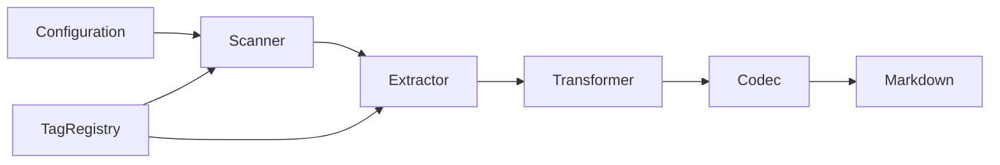

# Taxonomy Reference

**Purpose:** Tag taxonomy configuration for code-first documentation
**Detail Level:** Overview with links to details

---

## Overview

**3 categories** | **42 metadata tags** | **3 aggregation tags**

Current configuration uses `@libar-docs-` prefix with `@libar-docs` file opt-in.

| Component | Count | Description |
| --- | --- | --- |
| Categories | 3 | Pattern classification by domain |
| Metadata Tags | 42 | Pattern enrichment and relationships |
| Aggregation Tags | 3 | Document routing |

---

## Categories

Domain classifications for organizing patterns by priority.

| Tag | Domain | Priority | Description |
| --- | --- | --- | --- |
| `core` | Core | 1 | Core patterns |
| `api` | API | 2 | Public APIs |
| `infra` | Infrastructure | 3 | Infrastructure |

[Full category reference](taxonomy/categories.md)

---

## Metadata Tags

Tags for enriching patterns with additional metadata.

### Core Tags

| Tag | Format | Purpose | Required | Example |
| --- | --- | --- | --- | --- |
| `pattern` | value | Explicit pattern name | Yes | `@libar-docs-pattern CommandOrchestrator` |
| `status` | enum | Work item lifecycle status (per PDR-005 FSM) | No | `@libar-docs-status roadmap` |
| `core` | flag | Marks as essential/must-know pattern | No | `@libar-docs-core` |
| `usecase` | quoted-value | Use case association | No | `@libar-docs-usecase "When handling command failures"` |

### Relationship Tags

| Tag | Format | Purpose | Required | Example |
| --- | --- | --- | --- | --- |
| `uses` | csv | Patterns this depends on | No | `@libar-docs-uses CommandBus, EventStore` |
| `used-by` | csv | Patterns that depend on this | No | `@libar-docs-used-by SagaOrchestrator` |
| `depends-on` | csv | Roadmap dependencies (pattern or phase names) | No | `@libar-docs-depends-on EventStore, CommandBus` |
| `enables` | csv | Patterns this enables | No | `@libar-docs-enables SagaOrchestrator, ProjectionBuilder` |
| `implements` | csv | Patterns this code file realizes (realization relationship) | No | `@libar-docs-implements EventStoreDurability, IdempotentAppend` |
| `extends` | value | Base pattern this pattern extends (generalization relationship) | No | `@libar-docs-extends ProjectionCategories` |
| `see-also` | csv | Related patterns for cross-reference without dependency implication | No | `@libar-docs-see-also AgentAsBoundedContext, CrossContextIntegration` |
| `api-ref` | csv | File paths to implementation APIs (replaces 'See:' Markdown text in Rules) | No | `@libar-docs-api-ref @libar-dev/platform-core/src/durability/outbox.ts` |

### Timeline Tags

| Tag | Format | Purpose | Required | Example |
| --- | --- | --- | --- | --- |
| `phase` | number | Roadmap phase number (unified across monorepo) | No | `@libar-docs-phase 14` |
| `release` | value | Target release version (semver or vNEXT for unreleased work) | No | `@libar-docs-release v0.1.0` |
| `quarter` | value | Delivery quarter for timeline tracking | No | `@libar-docs-quarter Q1-2026` |
| `completed` | value | Completion date (YYYY-MM-DD format) | No | `@libar-docs-completed 2026-01-08` |
| `effort` | value | Estimated effort (4h, 2d, 1w format) | No | `@libar-docs-effort 2d` |
| `effort-actual` | value | Actual effort spent (4h, 2d, 1w format) | No | `@libar-docs-effort-actual 3d` |
| `team` | value | Responsible team assignment | No | `@libar-docs-team platform` |
| `workflow` | enum | Workflow discipline for process tracking | No | `@libar-docs-workflow implementation` |
| `risk` | enum | Risk level for planning | No | `@libar-docs-risk medium` |
| `priority` | enum | Priority level for roadmap ordering | No | `@libar-docs-priority high` |

### ADR Tags

| Tag | Format | Purpose | Required | Example |
| --- | --- | --- | --- | --- |
| `adr` | value | ADR/PDR number for decision tracking | No | `@libar-docs-adr 015` |
| `adr-status` | enum | ADR/PDR decision status | No | `@libar-docs-adr-status accepted` |
| `adr-category` | value | ADR/PDR category (architecture, process, tooling) | No | `@libar-docs-adr-category architecture` |
| `adr-supersedes` | value | ADR/PDR number this decision supersedes | No | `@libar-docs-adr-supersedes 012` |
| `adr-superseded-by` | value | ADR/PDR number that supersedes this decision | No | `@libar-docs-adr-superseded-by 020` |
| `adr-theme` | enum | Theme grouping for related decisions (from synthesis) | No | `@libar-docs-adr-theme persistence` |
| `adr-layer` | enum | Evolutionary layer of the decision | No | `@libar-docs-adr-layer foundation` |

### Architecture Tags

| Tag | Format | Purpose | Required | Example |
| --- | --- | --- | --- | --- |
| `arch-role` | enum | Architectural role for diagram generation (component type) | No | `@libar-docs-arch-role projection` |
| `arch-context` | value | Bounded context this component belongs to (for subgraph grouping) | No | `@libar-docs-arch-context orders` |
| `arch-layer` | enum | Architectural layer for layered diagrams | No | `@libar-docs-arch-layer application` |

### Other Tags

| Tag | Format | Purpose | Required | Example |
| --- | --- | --- | --- | --- |
| `brief` | value | Path to pattern brief markdown | No | `@libar-docs-brief docs/briefs/decider-pattern.md` |
| `product-area` | value | Product area for PRD grouping | No | `@libar-docs-product-area PlatformCore` |
| `user-role` | value | Target user persona for this feature | No | `@libar-docs-user-role Developer` |
| `business-value` | value | Business value statement (hyphenated for tag format) | No | `@libar-docs-business-value eliminates-event-replay-complexity` |
| `constraint` | value | Technical constraint affecting feature implementation | No | `@libar-docs-constraint requires-convex-backend` |
| `level` | enum | Hierarchy level for epic->phase->task breakdown | No | `@libar-docs-level epic` |
| `parent` | value | Parent pattern name in hierarchy (links tasks to phases, phases to epics) | No | `@libar-docs-parent AggregateArchitecture` |
| `executable-specs` | csv | Links roadmap spec to package executable spec locations (PDR-007) | No | `@libar-docs-executable-specs platform-decider/tests/features/behavior` |
| `roadmap-spec` | value | Links package spec back to roadmap pattern for traceability (PDR-007) | No | `@libar-docs-roadmap-spec DeciderPattern` |
| `extract-shapes` | csv | TypeScript type names to extract from this file for documentation | No | `@libar-docs-extract-shapes DeciderInput, ValidationResult, ProcessViolation` |

[Full metadata tag reference](taxonomy/metadata-tags.md)

---

## Aggregation Tags

Tags that route patterns to specific aggregated documents.

| Tag | Target Document | Purpose |
| --- | --- | --- |
| `overview` | OVERVIEW.md | Architecture overview patterns |
| `decision` | DECISIONS.md | ADR-style decisions (auto-numbered) |
| `intro` | None | Package introduction (template placeholder) |

---

## Format Types

How tag values are parsed and validated.

| Format | Description | Example |
| --- | --- | --- |
| `value` | Simple string value | `@libar-docs-pattern MyPattern` |
| `enum` | Constrained to predefined values | `@libar-docs-status roadmap` |
| `quoted-value` | String in quotes (preserves spaces) | `@libar-docs-usecase "When X happens"` |
| `csv` | Comma-separated values | `@libar-docs-uses A, B, C` |
| `number` | Numeric value | `@libar-docs-phase 14` |
| `flag` | Boolean presence (no value) | `@libar-docs-core` |

[Format type details](taxonomy/format-types.md)

---

## Presets

Available configuration presets.

| Preset | Tag Prefix | Categories | Use Case |
| --- | --- | --- | --- |
| `generic` | `@docs-` | 3 | Simple projects with @docs- prefix |
| `libar-generic` | `@libar-docs-` | 3 | Default preset with @libar-docs- prefix |
| `ddd-es-cqrs` | `@libar-docs-` | 21 | Full DDD/ES/CQRS taxonomy |

---

## Architecture

Taxonomy source files and pipeline flow.

```plaintext
src/taxonomy/
├── categories.ts          # Category definitions (21 DDD-ES-CQRS)
├── format-types.ts        # Format type constants
├── registry-builder.ts    # Single source of truth builder
├── status-values.ts       # Status FSM values
├── generator-options.ts   # Generator option values
├── hierarchy-levels.ts    # Hierarchy level values
├── risk-levels.ts         # Risk level values
└── index.ts               # Barrel export
```



---
