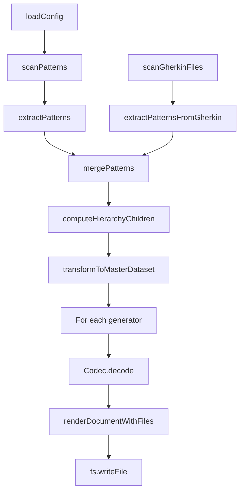

# ArchitectureReference

**Purpose:** Full documentation generated from decision document
**Detail Level:** detailed

---

**Problem:**
  The ARCHITECTURE.md document (1300+ lines) describes the four-stage pipeline,
  MasterDataset schema, codec system, and block vocabulary. Maintaining this
  manually leads to drift from actual TypeScript interfaces and implementations.

  **Solution:**
  Auto-generate key architecture sections from annotated source code.
  TypeScript schemas define the data structures; documentation is a projection.
  Approximately 40% of content can be extracted from source annotations.

  **Target Documents:**

| Output | Purpose | Detail Level |
| docs-generated/docs/ARCHITECTURE-REFERENCE.md | Detailed human reference | detailed |
| docs-generated/_claude-md/architecture/architecture-reference.md | Compact AI context | summary |

  **Source Mapping:**

| Section | Source File | Extraction Method |
| --- | --- | --- |
| Design Principles | THIS DECISION (Rule: Design Principles) | Rule block table |
| Four-Stage Pipeline | THIS DECISION (Rule: Four-Stage Pipeline) | Rule block content |
| MasterDataset Schema | THIS DECISION (Rule: MasterDataset Schema) | Rule block content |
| RenderableDocument Schema | THIS DECISION (Rule: RenderableDocument Schema) | Rule block content |
| Block Vocabulary | THIS DECISION (Rule: Block Vocabulary) | Rule block table |
| Codec Factory Pattern | THIS DECISION (Rule: Codec Factory Pattern) | Rule block content |
| Generator Types | src/generators/types.ts | extract-shapes tag |
| Transform Function | src/generators/pipeline/transform-dataset.ts | extract-shapes tag |
| Available Codecs | THIS DECISION (Rule: Available Codecs) | Rule block content |
| Progressive Disclosure | THIS DECISION (Rule: Progressive Disclosure) | Rule block table |
| Codec to Generator Mapping | THIS DECISION (Rule: Codec to Generator Mapping) | Rule block content |
| Status Normalization | THIS DECISION (Rule: Status Normalization) | Rule block content |
| Result Monad Pattern | THIS DECISION (Rule: Result Monad Pattern) | Rule block content |
| Orchestrator Pipeline | THIS DECISION (Rule: Orchestrator Pipeline) | Rule block content |

---

## Implementation Details

### Design Principles

**Context:** The package follows specific architectural principles.

    **Decision:** These are the key design principles:

| Principle | Description |
| --- | --- |
| Single Source of Truth | Code and .feature files are authoritative; docs are generated projections |
| Single-Pass Transformation | All derived views computed in O(n) time, not redundant O(n) per section |
| Codec-Based Rendering | Zod 4 codecs transform MasterDataset to RenderableDocument to Markdown |
| Schema-First Validation | Zod schemas define types; runtime validation at all boundaries |
| Result Monad | Explicit error handling via Result T,E instead of exceptions |

### Four-Stage Pipeline

**Context:** The documentation generation pipeline consists of four stages.

    **Decision:** The four stages are:

| Stage | Purpose | Key Files | Input | Output |
| --- | --- | --- | --- | --- |
| Scanner | File discovery and AST parsing | pattern-scanner.ts, gherkin-scanner.ts | Source files | ScannedFile[] |
| Extractor | Pattern extraction from AST | doc-extractor.ts, gherkin-extractor.ts | ScannedFile[] | ExtractedPattern[] |
| Transformer | Single-pass view computation | transform-dataset.ts | ExtractedPattern[] | MasterDataset |
| Codec | Document generation | codecs/*.ts, render.ts | MasterDataset | Markdown files |

    **Pipeline Diagram:**

```mermaid
graph LR
        CONFIG[CONFIG] --> SCANNER
        SCANNER[SCANNER<br/>TypeScript + Gherkin<br/>files] --> EXTRACTOR
        EXTRACTOR[EXTRACTOR<br/>ExtractedPattern[]] --> TRANSFORMER
        TRANSFORMER[TRANSFORMER<br/>MasterDataset<br/>pre-computed views] --> CODEC
        CODEC[CODEC<br/>RenderableDocument<br/>to Markdown]
```

### MasterDataset Schema

**Context:** MasterDataset is the central data structure with all pre-computed views.

    **Decision:** The schema contains:

    - patterns: All extracted patterns (both TypeScript and Gherkin)
    - tagRegistry: Tag registry for category lookups
    - byStatus: Patterns grouped by normalized status (completed, active, planned)
    - byPhase: Patterns grouped by phase number with pre-computed counts
    - byQuarter: Patterns grouped by quarter (e.g., "Q4-2024")
    - byCategory: Patterns grouped by category
    - bySource: Patterns grouped by source type (typescript, gherkin, roadmap, prd)
    - counts: Overall status counts (completed, active, planned, total)
    - relationshipIndex: Optional dependency graph (uses, usedBy, dependsOn, enables)
    - archIndex: Optional architecture index for diagram generation

    See src/validation-schemas/master-dataset.ts for the complete Zod schema.

### RenderableDocument Schema

**Context:** RenderableDocument is the universal intermediate format.

    **Decision:** All document codecs output this format. The renderer converts it to markdown.

    - title: Document title (becomes H1)
    - purpose: Optional description (rendered as blockquote)
    - detailLevel: Optional detail level indicator
    - sections: Array of SectionBlock (the document content)
    - additionalFiles: Record of path to RenderableDocument for progressive disclosure

    See src/renderable/schema.ts for block builders and type definitions.

### Block Vocabulary

**Context:** RenderableDocument uses a fixed vocabulary of 9 section block types.

    **Decision:** Block types are grouped by purpose:

| Category | Block Types | Markdown Output |
| --- | --- | --- |
| Structural | heading, paragraph, separator | ## Title, text, --- |
| Content | table, list, code, mermaid | tables, lists, fenced code |
| Progressive | collapsible, link-out | details/summary, links to files |

    **Block Type Details:**

| Block | Key Properties | Usage |
| --- | --- | --- |
| heading | level (1-6), text | Section headers |
| paragraph | text | Body text |
| separator | (none) | Horizontal rules |
| table | columns, rows, alignment | Data tables |
| list | ordered, items | Bullet or numbered lists |
| code | language, content | Code snippets |
| mermaid | content | Mermaid diagrams |
| collapsible | summary, content | Expandable sections |
| link-out | text, path | Links to detail files |

### Codec Factory Pattern

**Context:** Every codec provides both a default instance and a factory function.

    **Decision:** The two-export pattern enables both simple and customized usage:

```typescript
// Default codec with standard options
    import { PatternsDocumentCodec } from './codecs';
    const doc = PatternsDocumentCodec.decode(dataset);

    // Factory for custom options
    import { createPatternsCodec } from './codecs';
    const codec = createPatternsCodec({ generateDetailFiles: false });
    const doc = codec.decode(dataset);
```

**Common Options:**

| Option | Type | Default | Description |
| --- | --- | --- | --- |
| generateDetailFiles | boolean | true | Create progressive disclosure files |
| detailLevel | summary, standard, detailed | standard | Output verbosity |
| limits.recentItems | number | 10 | Max recent items in summaries |
| limits.collapseThreshold | number | 5 | Items before collapsing |

### Generator Types

```typescript
/**
 * @libar-docs-generator
 * @libar-docs-pattern GeneratorTypes
 * @libar-docs-status completed
 * @libar-docs-used-by GeneratorRegistry, GeneratorFactory, Orchestrator, SectionRegistry
 * @libar-docs-extract-shapes DocumentGenerator, GeneratorContext, GeneratorOutput
 *
 * ## GeneratorTypes - Pluggable Document Generation Interface
 *
 * Minimal interface for pluggable generators that produce documentation from patterns.
 * Both JSON-configured built-in generators and TypeScript custom generators implement this.
 *
 * ### When to Use
 *
 * - Creating a new document format (ADRs, planning docs, API specs)
 * - Building custom generators in TypeScript
 * - Integrating with the unified CLI
 *
 * ### Key Concepts
 *
 * - **Generator:** Transforms patterns → document files
 * - **Context:** Runtime environment (base paths, registries, scenarios)
 * - **Output:** Map of file paths → content
 */
interface DocumentGenerator {
  /** Unique generator name (e.g., "patterns", "adrs", "planning") */
  readonly name: string;

  /** Optional description shown in --list-generators */
  readonly description?: string;

  /**
   * Generate documentation from extracted patterns.
   *
   * @param patterns - Extracted patterns from source code
   * @param context - Runtime context (paths, registry, scenario map)
   * @returns Generated files with paths relative to outputDir
   */
  generate(
    patterns: readonly ExtractedPattern[],
    context: GeneratorContext
  ): Promise<GeneratorOutput>;
}
```

```typescript
/**
 * Runtime context provided to generators.
 */
interface GeneratorContext {
  /** Base directory for resolving relative paths */
  readonly baseDir: string;

  /** Output directory for generated files */
  readonly outputDir: string;

  /** Tag registry with category/aggregation definitions */
  readonly registry: TagRegistry;

  /** Optional workflow configuration for status handling */
  readonly workflow?: LoadedWorkflow;

  /**
   * Pre-computed pattern views for efficient access.
   *
   * Contains patterns grouped by status, phase, quarter, category, and source,
   * computed in a single pass. Sections should use these pre-computed views
   * instead of filtering the raw patterns array.
   */
  readonly masterDataset?: RuntimeMasterDataset;

  /**
   * Optional codec-specific options for document generation.
   *
   * Used to pass runtime configuration (e.g., changedFiles for PR changes)
   * through the CLI → Orchestrator → Generator → Codec pipeline.
   *
   * @example
   * ```typescript
   * const context: GeneratorContext = {
   *   // ... other fields
   *   codecOptions: {
   *     "pr-changes": { changedFiles: ["src/foo.ts"], releaseFilter: "v0.2.0" }
   *   }
   * };
   * ```
   */
  readonly codecOptions?: CodecOptions;
}
```

```typescript
/**
 * Output from generator execution.
 */
interface GeneratorOutput {
  /** Files to write (path relative to outputDir) */
  readonly files: readonly OutputFile[];

  /** Files to delete for cleanup (path relative to outputDir) */
  readonly filesToDelete?: readonly string[];

  /** Optional metadata for registry.json or other purposes */
  readonly metadata?: Record<string, unknown>;
}
```

### Transform Function

```typescript
/**
 * Runtime MasterDataset with optional workflow
 *
 * Extends the Zod-compatible MasterDataset with workflow reference.
 * LoadedWorkflow contains Maps which aren't JSON-serializable,
 * so it's kept separate from the Zod schema.
 */
interface RuntimeMasterDataset extends MasterDataset {
  /** Optional workflow configuration (not serializable) */
  readonly workflow?: LoadedWorkflow;
}
```

```typescript
/**
 * Raw input data for transformation
 */
interface RawDataset {
  /** Extracted patterns from TypeScript and/or Gherkin sources */
  readonly patterns: readonly ExtractedPattern[];

  /** Tag registry for category lookups */
  readonly tagRegistry: TagRegistry;

  /** Optional workflow configuration for phase names (can be undefined) */
  readonly workflow?: LoadedWorkflow | undefined;
}
```

```typescript
/**
 * Transform raw extracted data into a MasterDataset with all pre-computed views.
 *
 * This is a ONE-PASS transformation that computes:
 * - Status-based groupings (completed/active/planned)
 * - Phase-based groupings with counts
 * - Quarter-based groupings for timeline views
 * - Category-based groupings for taxonomy
 * - Source-based views (TypeScript vs Gherkin, roadmap, PRD)
 * - Aggregate statistics (counts, phase count, category count)
 * - Optional relationship index
 *
 * @param raw - Raw dataset with patterns, registry, and optional workflow
 * @returns MasterDataset with all pre-computed views
 *
 * @example
 * ```typescript
 * const masterDataset = transformToMasterDataset({
 *   patterns: mergedPatterns,
 *   tagRegistry: registry,
 *   workflow,
 * });
 *
 * // Access pre-computed views
 * const completed = masterDataset.byStatus.completed;
 * const phase3Patterns = masterDataset.byPhase.find(p => p.phaseNumber === 3);
 * const q42024 = masterDataset.byQuarter["Q4-2024"];
 * ```
 */
function transformToMasterDataset(raw: RawDataset): RuntimeMasterDataset;
```

### Available Codecs

**Context:** The package provides multiple specialized codecs for different documentation needs.

    **Decision:** Codecs are grouped by purpose. Pattern-focused codecs generate pattern registries, requirements, and ADRs. Timeline-focused codecs generate roadmaps, milestones, current work, and changelogs. Session-focused codecs generate session context, remaining work, PR changes, and traceability views. Planning codecs generate checklists, session plans, and findings.

    See src/renderable/generate.ts for the complete DOCUMENT_TYPES registry with all codecs, output paths, and descriptions.

### Progressive Disclosure

**Context:** Large documents are split into main index plus detail files.

    **Decision:** Each codec has specific split logic:

| Codec | Split By | Detail Path Pattern |
| --- | --- | --- |
| patterns | Category | patterns/category.md |
| roadmap | Phase | phases/phase-N-name.md |
| milestones | Quarter | milestones/quarter.md |
| current | Active Phase | current/phase-N-name.md |
| requirements | Product Area | requirements/area-slug.md |
| session | Incomplete Phase | sessions/phase-N-name.md |
| remaining | Incomplete Phase | remaining/phase-N-name.md |
| adrs | Category (at threshold) | decisions/category-slug.md |
| pr-changes | None | Single file only |

    **Detail Level Options:**

| Value | Behavior |
| --- | --- |
| summary | Minimal output, key metrics only |
| standard | Default with all sections |
| detailed | Maximum detail, all optional sections |

### Codec to Generator Mapping

**Context:** Each codec is exposed via a CLI generator flag.

    **Decision:** The CODEC_MAP and CODEC_FACTORY_MAP in src/renderable/generate.ts define the mapping from generator names to codec instances and factory functions. Generator names match the CLI -g flag values (e.g., -g patterns, -g roadmap).

    See src/renderable/generate.ts for DOCUMENT_TYPES (output paths), CODEC_MAP (default instances), and CODEC_FACTORY_MAP (factory functions for custom options).

### Status Normalization

**Context:** Source annotations use various status values that must be normalized.

    **Decision:** All status values are normalized to three canonical display states: completed, active, and planned. The STATUS_NORMALIZATION_MAP in src/taxonomy/normalized-status.ts defines the mapping from raw FSM states to display buckets.

    See src/taxonomy/normalized-status.ts for NORMALIZED_STATUS_VALUES, STATUS_NORMALIZATION_MAP, and the normalizeStatus function.

### Result Monad Pattern

**Context:** The package uses explicit error handling instead of exceptions.

    **Decision:** All operations return Result T,E for type-safe error handling:

```typescript
type Result<T, E> = { ok: true; value: T } | { ok: false; error: E };

    // Usage
    const result = await scanPatterns(options);
    if (result.ok) {
      const { files } = result.value;
    } else {
      console.error(result.error);
    }
```

**Benefits:**
    - No exception swallowing
    - Partial success scenarios supported
    - Type-safe error handling at boundaries

### Orchestrator Pipeline

**Context:** The orchestrator coordinates the complete documentation generation pipeline.

    **Decision:** The orchestrator executes these steps:

| Step | Operation | Key Function |
| --- | --- | --- |
| 1 | Load configuration | loadConfig() |
| 2 | Scan TypeScript sources | scanPatterns() |
| 3 | Extract TypeScript patterns | extractPatterns() |
| 4 | Scan Gherkin sources | scanGherkinFiles() |
| 5 | Extract Gherkin patterns | extractPatternsFromGherkin() |
| 6 | Merge patterns | mergePatterns() |
| 7 | Compute hierarchy | computeHierarchyChildren() |
| 8 | Transform to MasterDataset | transformToMasterDataset() |
| 9 | Run codecs | Codec.decode() for each generator |
| 10 | Write output files | fs.writeFile() |

    **Orchestrator Flow Diagram:**


