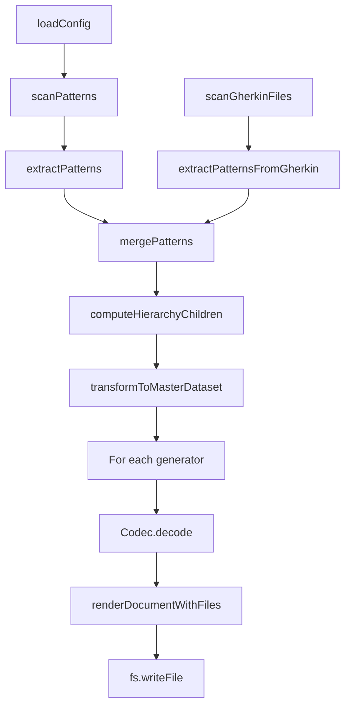

# ArchitectureReference

**Purpose:** Full documentation generated from decision document
**Detail Level:** detailed

---

**Problem:**
  The ARCHITECTURE.md document (1300+ lines) describes the four-stage pipeline,
  MasterDataset schema, codec system, and block vocabulary. Maintaining this
  manually leads to drift from actual TypeScript interfaces and implementations.

  **Solution:**
  Auto-generate key architecture sections from annotated source code.
  TypeScript schemas define the data structures; documentation is a projection.
  Approximately 40% of content can be extracted from source annotations.

  **Target Documents:**

| Output | Purpose | Detail Level |
| docs-generated/docs/ARCHITECTURE-REFERENCE.md | Detailed human reference | detailed |
| docs-generated/_claude-md/architecture/architecture-reference.md | Compact AI context | summary |

  **Source Mapping:**

| Section | Source File | Extraction Method |
| --- | --- | --- |
| Design Principles | THIS DECISION (Rule: Design Principles) | Rule block table |
| Four-Stage Pipeline | THIS DECISION (Rule: Four-Stage Pipeline) | Rule block content + Mermaid |
| MasterDataset Schema | src/validation-schemas/master-dataset.ts | extract-shapes tag |
| RenderableDocument | src/renderable/schema.ts | extract-shapes tag |
| Block Vocabulary | THIS DECISION (Rule: Block Vocabulary) | Rule block table |
| Codec Factory Pattern | THIS DECISION (Rule: Codec Factory Pattern) | Rule block content |
| Generator Types | src/generators/types.ts | extract-shapes tag |
| Transform Function | src/generators/pipeline/transform-dataset.ts | extract-shapes tag |
| Available Codecs | THIS DECISION (Rule: Available Codecs) | Rule block table |
| Progressive Disclosure | THIS DECISION (Rule: Progressive Disclosure) | Rule block table |
| Codec Mapping | THIS DECISION (Rule: Codec to Generator Mapping) | Rule block table |

---

## Implementation Details

### Design Principles

**Context:** The package follows specific architectural principles.

    **Decision:** These are the key design principles:

| Principle | Description |
| --- | --- |
| Single Source of Truth | Code and .feature files are authoritative; docs are generated projections |
| Single-Pass Transformation | All derived views computed in O(n) time, not redundant O(n) per section |
| Codec-Based Rendering | Zod 4 codecs transform MasterDataset to RenderableDocument to Markdown |
| Schema-First Validation | Zod schemas define types; runtime validation at all boundaries |
| Result Monad | Explicit error handling via Result T,E instead of exceptions |

### Block Vocabulary

**Context:** RenderableDocument uses a fixed vocabulary of 9 section block types.

    **Decision:** Block types are grouped by purpose:

| Category | Block Types | Markdown Output |
| --- | --- | --- |
| Structural | heading, paragraph, separator | ## Title, text, --- |
| Content | table, list, code, mermaid | tables, lists, fenced code |
| Progressive | collapsible, link-out | details/summary, links to files |

    **Block Type Details:**

| Block | Key Properties | Usage |
| --- | --- | --- |
| heading | level (1-6), text | Section headers |
| paragraph | text | Body text |
| separator | (none) | Horizontal rules |
| table | columns, rows, alignment | Data tables |
| list | ordered, items | Bullet or numbered lists |
| code | language, content | Code snippets |
| mermaid | content | Mermaid diagrams |
| collapsible | summary, content | Expandable sections |
| link-out | text, path | Links to detail files |

### Available Codecs

**Context:** The package provides multiple specialized codecs for different documentation needs.

    **Decision:** Codecs are grouped by purpose:

    **Pattern-Focused Codecs:**

| Codec | Output | Purpose |
| --- | --- | --- |
| PatternsDocumentCodec | PATTERNS.md + patterns/*.md | Pattern registry by category |
| RequirementsDocumentCodec | PRODUCT-REQUIREMENTS.md | PRD grouped by product area |
| AdrDocumentCodec | DECISIONS.md + decisions/*.md | Architecture Decision Records |

    **Timeline-Focused Codecs:**

| Codec | Output | Purpose |
| --- | --- | --- |
| RoadmapDocumentCodec | ROADMAP.md + phases/*.md | Development roadmap by phase |
| CompletedMilestonesCodec | COMPLETED-MILESTONES.md | Historical record by quarter |
| CurrentWorkCodec | CURRENT-WORK.md | Active development work |
| ChangelogCodec | CHANGELOG.md | Keep a Changelog format |

    **Session-Focused Codecs:**

| Codec | Output | Purpose |
| --- | --- | --- |
| SessionContextCodec | SESSION-CONTEXT.md | Current session for AI agents |
| RemainingWorkCodec | REMAINING-WORK.md | Incomplete work summary |
| PrChangesCodec | working/PR-CHANGES.md | PR-scoped view by changed files |
| TraceabilityCodec | TRACEABILITY.md | Timeline to behavior coverage |

    **Planning Codecs:**

| Codec | Output | Purpose |
| --- | --- | --- |
| PlanningChecklistCodec | PLANNING-CHECKLIST.md | Pre-planning questions |
| SessionPlanCodec | SESSION-PLAN.md | Implementation plans |
| SessionFindingsCodec | SESSION-FINDINGS.md | Retrospective discoveries |

### Progressive Disclosure

**Context:** Large documents are split into main index plus detail files.

    **Decision:** Each codec has specific split logic:

| Codec | Split By | Detail Path Pattern |
| --- | --- | --- |
| patterns | Category | patterns/category.md |
| roadmap | Phase | phases/phase-N-name.md |
| milestones | Quarter | milestones/quarter.md |
| current | Active Phase | current/phase-N-name.md |
| requirements | Product Area | requirements/area-slug.md |
| session | Incomplete Phase | sessions/phase-N-name.md |
| remaining | Incomplete Phase | remaining/phase-N-name.md |
| adrs | Category (at threshold) | decisions/category-slug.md |
| pr-changes | None | Single file only |

    **Detail Level Options:**

| Value | Behavior |
| --- | --- |
| summary | Minimal output, key metrics only |
| standard | Default with all sections |
| detailed | Maximum detail, all optional sections |

### Codec Mapping

**Context:** Each codec is exposed via a CLI generator flag.

    **Decision:** The mapping from codec to generator name:

| Codec | Generator Name | CLI Flag |
| --- | --- | --- |
| PatternsDocumentCodec | patterns | -g patterns |
| RoadmapDocumentCodec | roadmap | -g roadmap |
| CompletedMilestonesCodec | milestones | -g milestones |
| CurrentWorkCodec | current | -g current |
| RequirementsDocumentCodec | requirements | -g requirements |
| SessionContextCodec | session | -g session |
| RemainingWorkCodec | remaining | -g remaining |
| PrChangesCodec | pr-changes | -g pr-changes |
| AdrDocumentCodec | adrs | -g adrs |
| PlanningChecklistCodec | planning-checklist | -g planning-checklist |
| SessionPlanCodec | session-plan | -g session-plan |
| SessionFindingsCodec | session-findings | -g session-findings |
| ChangelogCodec | changelog | -g changelog |
| TraceabilityCodec | traceability | -g traceability |
| OverviewCodec | overview-rdm | -g overview-rdm |

## Design Principles

**Context:** The package follows specific architectural principles.

    **Decision:** These are the key design principles:

| Principle | Description |
| --- | --- |
| Single Source of Truth | Code and .feature files are authoritative; docs are generated projections |
| Single-Pass Transformation | All derived views computed in O(n) time, not redundant O(n) per section |
| Codec-Based Rendering | Zod 4 codecs transform MasterDataset to RenderableDocument to Markdown |
| Schema-First Validation | Zod schemas define types; runtime validation at all boundaries |
| Result Monad | Explicit error handling via Result T,E instead of exceptions |

## Four-Stage Pipeline

**Context:** The documentation generation pipeline consists of four stages.

    **Decision:** The four stages are:

| Stage | Purpose | Key Files | Input | Output |
| --- | --- | --- | --- | --- |
| Scanner | File discovery and AST parsing | pattern-scanner.ts, gherkin-scanner.ts | Source files | ScannedFile[] |
| Extractor | Pattern extraction from AST | doc-extractor.ts, gherkin-extractor.ts | ScannedFile[] | ExtractedPattern[] |
| Transformer | Single-pass view computation | transform-dataset.ts | ExtractedPattern[] | MasterDataset |
| Codec | Document generation | codecs/*.ts, render.ts | MasterDataset | Markdown files |

    **Pipeline Diagram:**

```mermaid
graph LR
        CONFIG[CONFIG] --> SCANNER
        SCANNER[SCANNER<br/>TypeScript + Gherkin<br/>files] --> EXTRACTOR
        EXTRACTOR[EXTRACTOR<br/>ExtractedPattern[]] --> TRANSFORMER
        TRANSFORMER[TRANSFORMER<br/>MasterDataset<br/>pre-computed views] --> CODEC
        CODEC[CODEC<br/>RenderableDocument<br/>to Markdown]
```

## MasterDataset Schema

**Context:** MasterDataset is the central data structure with all pre-computed views.

    **Decision:** The schema contains:

    - patterns: All extracted patterns (both TypeScript and Gherkin)
    - tagRegistry: Tag registry for category lookups
    - byStatus: Patterns grouped by normalized status (completed, active, planned)
    - byPhase: Patterns grouped by phase number with pre-computed counts
    - byQuarter: Patterns grouped by quarter (e.g., "Q4-2024")
    - byCategory: Patterns grouped by category
    - bySource: Patterns grouped by source type (typescript, gherkin, roadmap, prd)
    - counts: Overall status counts (completed, active, planned, total)
    - relationshipIndex: Optional dependency graph (uses, usedBy, dependsOn, enables)
    - archIndex: Optional architecture index for diagram generation

    See src/validation-schemas/master-dataset.ts for the complete Zod schema.

## RenderableDocument Schema

**Context:** RenderableDocument is the universal intermediate format.

    **Decision:** All document codecs output this format. The renderer converts it to markdown.

    - title: Document title (becomes H1)
    - purpose: Optional description (rendered as blockquote)
    - detailLevel: Optional detail level indicator
    - sections: Array of SectionBlock (the document content)
    - additionalFiles: Record of path to RenderableDocument for progressive disclosure

    See src/renderable/schema.ts for block builders and type definitions.

## Block Vocabulary

**Context:** RenderableDocument uses a fixed vocabulary of 9 section block types.

    **Decision:** Block types are grouped by purpose:

| Category | Block Types | Markdown Output |
| --- | --- | --- |
| Structural | heading, paragraph, separator | ## Title, text, --- |
| Content | table, list, code, mermaid | tables, lists, fenced code |
| Progressive | collapsible, link-out | details/summary, links to files |

    **Block Type Details:**

| Block | Key Properties | Usage |
| --- | --- | --- |
| heading | level (1-6), text | Section headers |
| paragraph | text | Body text |
| separator | (none) | Horizontal rules |
| table | columns, rows, alignment | Data tables |
| list | ordered, items | Bullet or numbered lists |
| code | language, content | Code snippets |
| mermaid | content | Mermaid diagrams |
| collapsible | summary, content | Expandable sections |
| link-out | text, path | Links to detail files |

## Codec Factory Pattern

**Context:** Every codec provides both a default instance and a factory function.

    **Decision:** The two-export pattern enables both simple and customized usage:

```typescript
// Default codec with standard options
    import { PatternsDocumentCodec } from './codecs';
    const doc = PatternsDocumentCodec.decode(dataset);

    // Factory for custom options
    import { createPatternsCodec } from './codecs';
    const codec = createPatternsCodec({ generateDetailFiles: false });
    const doc = codec.decode(dataset);
```

**Common Options:**

| Option | Type | Default | Description |
| --- | --- | --- | --- |
| generateDetailFiles | boolean | true | Create progressive disclosure files |
| detailLevel | summary, standard, detailed | standard | Output verbosity |
| limits.recentItems | number | 10 | Max recent items in summaries |
| limits.collapseThreshold | number | 5 | Items before collapsing |

## Available Codecs

**Context:** The package provides multiple specialized codecs for different documentation needs.

    **Decision:** Codecs are grouped by purpose:

    **Pattern-Focused Codecs:**

| Codec | Output | Purpose |
| --- | --- | --- |
| PatternsDocumentCodec | PATTERNS.md + patterns/*.md | Pattern registry by category |
| RequirementsDocumentCodec | PRODUCT-REQUIREMENTS.md | PRD grouped by product area |
| AdrDocumentCodec | DECISIONS.md + decisions/*.md | Architecture Decision Records |

    **Timeline-Focused Codecs:**

| Codec | Output | Purpose |
| --- | --- | --- |
| RoadmapDocumentCodec | ROADMAP.md + phases/*.md | Development roadmap by phase |
| CompletedMilestonesCodec | COMPLETED-MILESTONES.md | Historical record by quarter |
| CurrentWorkCodec | CURRENT-WORK.md | Active development work |
| ChangelogCodec | CHANGELOG.md | Keep a Changelog format |

    **Session-Focused Codecs:**

| Codec | Output | Purpose |
| --- | --- | --- |
| SessionContextCodec | SESSION-CONTEXT.md | Current session for AI agents |
| RemainingWorkCodec | REMAINING-WORK.md | Incomplete work summary |
| PrChangesCodec | working/PR-CHANGES.md | PR-scoped view by changed files |
| TraceabilityCodec | TRACEABILITY.md | Timeline to behavior coverage |

    **Planning Codecs:**

| Codec | Output | Purpose |
| --- | --- | --- |
| PlanningChecklistCodec | PLANNING-CHECKLIST.md | Pre-planning questions |
| SessionPlanCodec | SESSION-PLAN.md | Implementation plans |
| SessionFindingsCodec | SESSION-FINDINGS.md | Retrospective discoveries |

## Progressive Disclosure

**Context:** Large documents are split into main index plus detail files.

    **Decision:** Each codec has specific split logic:

| Codec | Split By | Detail Path Pattern |
| --- | --- | --- |
| patterns | Category | patterns/category.md |
| roadmap | Phase | phases/phase-N-name.md |
| milestones | Quarter | milestones/quarter.md |
| current | Active Phase | current/phase-N-name.md |
| requirements | Product Area | requirements/area-slug.md |
| session | Incomplete Phase | sessions/phase-N-name.md |
| remaining | Incomplete Phase | remaining/phase-N-name.md |
| adrs | Category (at threshold) | decisions/category-slug.md |
| pr-changes | None | Single file only |

    **Detail Level Options:**

| Value | Behavior |
| --- | --- |
| summary | Minimal output, key metrics only |
| standard | Default with all sections |
| detailed | Maximum detail, all optional sections |

## Status Normalization

**Context:** Source annotations use various status values that must be normalized.

    **Decision:** All status values are normalized to three canonical states:

| Input Status | Normalized To |
| --- | --- |
| completed, implemented | completed |
| active, partial, in-progress | active |
| roadmap, planned, deferred, undefined | planned |

## Codec to Generator Mapping

**Context:** Each codec is exposed via a CLI generator flag.

    **Decision:** The mapping from codec to generator name:

| Codec | Generator Name | CLI Flag |
| --- | --- | --- |
| PatternsDocumentCodec | patterns | -g patterns |
| RoadmapDocumentCodec | roadmap | -g roadmap |
| CompletedMilestonesCodec | milestones | -g milestones |
| CurrentWorkCodec | current | -g current |
| RequirementsDocumentCodec | requirements | -g requirements |
| SessionContextCodec | session | -g session |
| RemainingWorkCodec | remaining | -g remaining |
| PrChangesCodec | pr-changes | -g pr-changes |
| AdrDocumentCodec | adrs | -g adrs |
| PlanningChecklistCodec | planning-checklist | -g planning-checklist |
| SessionPlanCodec | session-plan | -g session-plan |
| SessionFindingsCodec | session-findings | -g session-findings |
| ChangelogCodec | changelog | -g changelog |
| TraceabilityCodec | traceability | -g traceability |
| OverviewCodec | overview-rdm | -g overview-rdm |

## Result Monad Pattern

**Context:** The package uses explicit error handling instead of exceptions.

    **Decision:** All operations return Result T,E for type-safe error handling:

```typescript
type Result<T, E> = { ok: true; value: T } | { ok: false; error: E };

    // Usage
    const result = await scanPatterns(options);
    if (result.ok) {
      const { files } = result.value;
    } else {
      console.error(result.error);
    }
```

**Benefits:**
    - No exception swallowing
    - Partial success scenarios supported
    - Type-safe error handling at boundaries

## Orchestrator Pipeline

**Context:** The orchestrator coordinates the complete documentation generation pipeline.

    **Decision:** The orchestrator executes these steps:

| Step | Operation | Key Function |
| --- | --- | --- |
| 1 | Load configuration | loadConfig() |
| 2 | Scan TypeScript sources | scanPatterns() |
| 3 | Extract TypeScript patterns | extractPatterns() |
| 4 | Scan Gherkin sources | scanGherkinFiles() |
| 5 | Extract Gherkin patterns | extractPatternsFromGherkin() |
| 6 | Merge patterns | mergePatterns() |
| 7 | Compute hierarchy | computeHierarchyChildren() |
| 8 | Transform to MasterDataset | transformToMasterDataset() |
| 9 | Run codecs | Codec.decode() for each generator |
| 10 | Write output files | fs.writeFile() |

    **Orchestrator Flow Diagram:**



---

<details>
<summary>Generation Warnings</summary>

- warning: No @libar-docs-extract-shapes tag found in src/validation-schemas/master-dataset.ts

- warning: No @libar-docs-extract-shapes tag found in src/renderable/schema.ts

- warning: No @libar-docs-extract-shapes tag found in src/generators/types.ts

- warning: No @libar-docs-extract-shapes tag found in src/generators/pipeline/transform-dataset.ts

</details>
