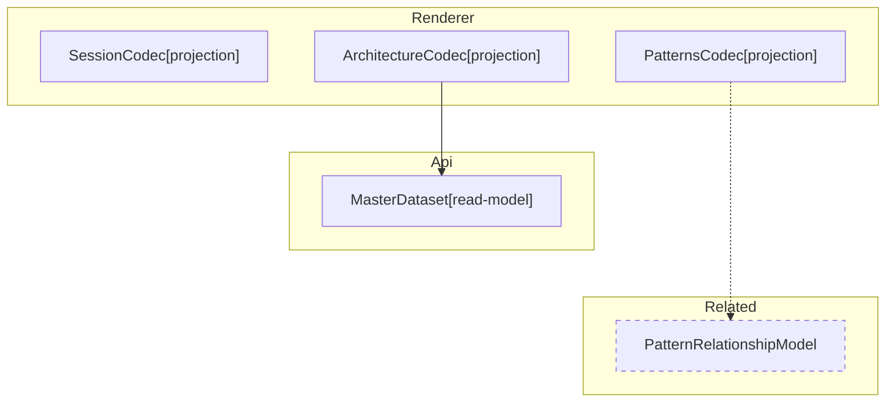

# Codec Architecture

**Purpose:** Reference document: Codec Architecture
**Detail Level:** Full reference

---

## Codec Transformation

Scoped architecture diagram showing component relationships:



---

## API Types

### MasterDatasetSchema (const)

/**
 * Master Dataset - Unified view of all extracted patterns
 *
 * Contains raw patterns plus pre-computed views and statistics.
 * This is the primary data structure passed to generators and sections.
 */

```typescript
MasterDatasetSchema = z.object({
  // ─────────────────────────────────────────────────────────────────────────
  // Raw Data
  // ─────────────────────────────────────────────────────────────────────────

  /** All extracted patterns (both TypeScript and Gherkin) */
  patterns: z.array(ExtractedPatternSchema),

  /** Tag registry for category lookups */
  tagRegistry: TagRegistrySchema,

  // Note: workflow is not in the Zod schema because LoadedWorkflow contains Maps
  // (statusMap, phaseMap) which are not JSON-serializable. When workflow access
  // is needed, get it from SectionContext/GeneratorContext instead.

  // ─────────────────────────────────────────────────────────────────────────
  // Pre-computed Views
  // ─────────────────────────────────────────────────────────────────────────

  /** Patterns grouped by normalized status */
  byStatus: StatusGroupsSchema,

  /** Patterns grouped by phase number (sorted ascending) */
  byPhase: z.array(PhaseGroupSchema),

  /** Patterns grouped by quarter (e.g., "Q4-2024") */
  byQuarter: z.record(z.string(), z.array(ExtractedPatternSchema)),

  /** Patterns grouped by category */
  byCategory: z.record(z.string(), z.array(ExtractedPatternSchema)),

  /** Patterns grouped by source type */
  bySource: SourceViewsSchema,

  // ─────────────────────────────────────────────────────────────────────────
  // Aggregate Statistics
  // ─────────────────────────────────────────────────────────────────────────

  /** Overall status counts */
  counts: StatusCountsSchema,

  /** Number of distinct phases */
  phaseCount: z.number().int().nonnegative(),

  /** Number of distinct categories */
  categoryCount: z.number().int().nonnegative(),

  // ─────────────────────────────────────────────────────────────────────────
  // Relationship Data (optional)
  // ─────────────────────────────────────────────────────────────────────────

  /** Optional relationship index for dependency graph */
  relationshipIndex: z.record(z.string(), RelationshipEntrySchema).optional(),

  // ─────────────────────────────────────────────────────────────────────────
  // Architecture Data (optional)
  // ─────────────────────────────────────────────────────────────────────────

  /** Optional architecture index for diagram generation */
  archIndex: ArchIndexSchema.optional(),
})
```

### StatusGroupsSchema (const)

/**
 * Status-based grouping of patterns
 *
 * Patterns are normalized to three canonical states:
 * - completed: implemented, completed
 * - active: active, partial, in-progress
 * - planned: roadmap, planned, undefined
 */

```typescript
StatusGroupsSchema = z.object({
  /** Patterns with status 'completed' or 'implemented' */
  completed: z.array(ExtractedPatternSchema),

  /** Patterns with status 'active', 'partial', or 'in-progress' */
  active: z.array(ExtractedPatternSchema),

  /** Patterns with status 'roadmap', 'planned', or undefined */
  planned: z.array(ExtractedPatternSchema),
})
```

### StatusCountsSchema (const)

/**
 * Status counts for aggregate statistics
 */

```typescript
StatusCountsSchema = z.object({
  /** Number of completed patterns */
  completed: z.number().int().nonnegative(),

  /** Number of active patterns */
  active: z.number().int().nonnegative(),

  /** Number of planned patterns */
  planned: z.number().int().nonnegative(),

  /** Total number of patterns */
  total: z.number().int().nonnegative(),
})
```

### PhaseGroupSchema (const)

/**
 * Phase grouping with patterns and counts
 *
 * Groups patterns by their phase number, with pre-computed
 * status counts for each phase.
 */

```typescript
PhaseGroupSchema = z.object({
  /** Phase number (e.g., 1, 2, 3, 14, 39) */
  phaseNumber: z.number().int(),

  /** Optional phase name from workflow config */
  phaseName: z.string().optional(),

  /** Patterns in this phase */
  patterns: z.array(ExtractedPatternSchema),

  /** Pre-computed status counts for this phase */
  counts: StatusCountsSchema,
})
```

### SourceViewsSchema (const)

/**
 * Source-based views for different data origins
 */

```typescript
SourceViewsSchema = z.object({
  /** Patterns from TypeScript files (.ts) */
  typescript: z.array(ExtractedPatternSchema),

  /** Patterns from Gherkin feature files (.feature) */
  gherkin: z.array(ExtractedPatternSchema),

  /** Patterns with phase metadata (roadmap items) */
  roadmap: z.array(ExtractedPatternSchema),

  /** Patterns with PRD metadata (productArea, userRole, businessValue) */
  prd: z.array(ExtractedPatternSchema),
})
```

### RelationshipEntrySchema (const)

/**
 * Relationship index for dependency tracking
 *
 * Maps pattern names to their relationship metadata.
 */

```typescript
RelationshipEntrySchema = z.object({
  /** Patterns this pattern uses (from @libar-docs-uses) */
  uses: z.array(z.string()),

  /** Patterns that use this pattern (from @libar-docs-used-by) */
  usedBy: z.array(z.string()),

  /** Patterns this pattern depends on (from @libar-docs-depends-on) */
  dependsOn: z.array(z.string()),

  /** Patterns this pattern enables (from @libar-docs-enables) */
  enables: z.array(z.string()),

  // UML-inspired relationship fields (PatternRelationshipModel)
  /** Patterns this item implements (realization relationship) */
  implementsPatterns: z.array(z.string()),

  /** Files/patterns that implement this pattern (computed inverse with file paths) */
  implementedBy: z.array(ImplementationRefSchema),

  /** Pattern this extends (generalization relationship) */
  extendsPattern: z.string().optional(),

  /** Patterns that extend this pattern (computed inverse) */
  extendedBy: z.array(z.string()),

  /** Related patterns for cross-reference without dependency (from @libar-docs-see-also tag) */
  seeAlso: z.array(z.string()),

  /** File paths to implementation APIs (from @libar-docs-api-ref tag) */
  apiRef: z.array(z.string()),
})
```

### ArchIndexSchema (const)

/**
 * Architecture index for diagram generation
 *
 * Groups patterns by architectural metadata for rendering component diagrams.
 */

```typescript
ArchIndexSchema = z.object({
  /** Patterns grouped by arch-role (bounded-context, projection, saga, etc.) */
  byRole: z.record(z.string(), z.array(ExtractedPatternSchema)),

  /** Patterns grouped by arch-context (orders, inventory, etc.) */
  byContext: z.record(z.string(), z.array(ExtractedPatternSchema)),

  /** Patterns grouped by arch-layer (domain, application, infrastructure) */
  byLayer: z.record(z.string(), z.array(ExtractedPatternSchema)),

  /** Patterns grouped by arch-view (named architectural views for scoped diagrams) */
  byView: z.record(z.string(), z.array(ExtractedPatternSchema)),

  /** Patterns with any architecture metadata (for diagram generation) */
  all: z.array(ExtractedPatternSchema),
})
```

### RenderableDocument (type)

```typescript
type RenderableDocument = {
  title: string;
  purpose?: string;
  detailLevel?: string;
  sections: SectionBlock[];
  additionalFiles?: Record<string, RenderableDocument>;
};
```

### SectionBlock (type)

```typescript
type SectionBlock =
  | HeadingBlock
  | ParagraphBlock
  | SeparatorBlock
  | TableBlock
  | ListBlock
  | CodeBlock
  | MermaidBlock
  | CollapsibleBlock
  | LinkOutBlock;
```

### HeadingBlock (type)

```typescript
type HeadingBlock = z.infer<typeof HeadingBlockSchema>;
```

### TableBlock (type)

```typescript
type TableBlock = z.infer<typeof TableBlockSchema>;
```

### ListBlock (type)

```typescript
type ListBlock = z.infer<typeof ListBlockSchema>;
```

### CodeBlock (type)

```typescript
type CodeBlock = z.infer<typeof CodeBlockSchema>;
```

### MermaidBlock (type)

```typescript
type MermaidBlock = z.infer<typeof MermaidBlockSchema>;
```

### CollapsibleBlock (type)

```typescript
type CollapsibleBlock = {
  type: 'collapsible';
  summary: string;
  content: SectionBlock[];
};
```

---
