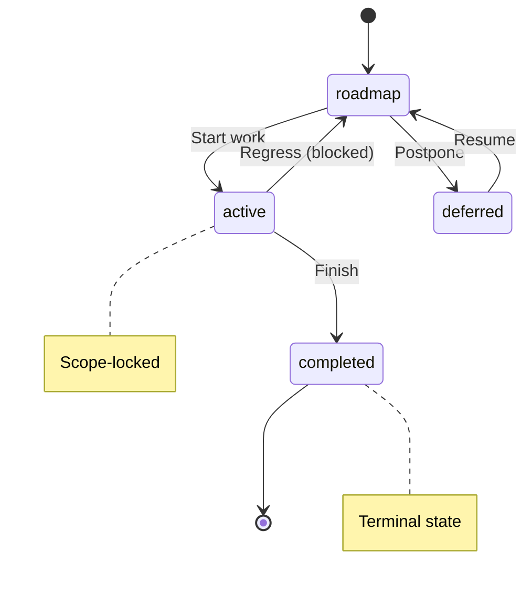
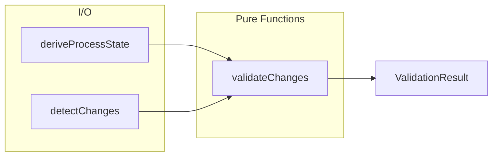

# ProcessGuardReference

**Purpose:** Full documentation generated from decision document
**Detail Level:** detailed

---

**Problem:**
  Process Guard validates delivery workflow changes at commit time.
  Developers need quick access to validation rules, error messages, fixes, and CLI usage.
  Maintaining this documentation manually leads to drift from actual implementation.

  **Solution:**
  Auto-generate the Process Guard reference documentation from annotated source code.
  The source code defines the validation rules, error messages, and CLI options.
  Documentation becomes a projection of the implementation, always in sync.

  **Target Documents:**

| Output | Purpose | Detail Level |
| docs-generated/docs/PROCESSGUARDREFERENCE.md | Detailed human reference | detailed |
| docs-generated/_claude-md/validation/processguardreference.md | Compact AI context | summary |

  **Source Mapping:**

| Section | Source File | Extraction Method |
| --- | --- | --- |
| FSM Protection Levels | src/validation/fsm/states.ts | extract-shapes tag |
| FSM Valid Transitions | src/validation/fsm/transitions.ts | extract-shapes tag |
| FSM Diagram | THIS DECISION (Rule: FSM Diagram) | Fenced code block (Mermaid) |
| Validation Rules Types | src/lint/process-guard/types.ts | extract-shapes tag |
| Decider Function | src/lint/process-guard/decider.ts | extract-shapes tag |
| CLI Config | src/cli/lint-process.ts | extract-shapes tag |
| Escape Hatches | THIS DECISION (Rule: Escape Hatches) | Rule block table |
| Rule Descriptions | THIS DECISION (Rule: Rule Descriptions) | Rule block table |
| CLI Usage | THIS DECISION (Rule: CLI Usage) | Rule block content |
| Error Messages and Fixes | THIS DECISION (Rule: Error Messages and Fixes) | Rule block content |
| Programmatic API | THIS DECISION (Rule: Programmatic API) | Rule block content |
| Architecture | THIS DECISION (Rule: Architecture) | Rule block content |
| Related Documentation | THIS DECISION (Rule: Related Documentation) | Rule block table |

---

## Implementation Details

### FSM Protection Levels

```typescript
/**
 * Protection level mapping per PDR-005
 *
 * | State     | Protection | Meaning                          |
 * |-----------|------------|----------------------------------|
 * | roadmap   | none       | Planning phase, fully editable   |
 * | active    | scope      | In progress, no new deliverables |
 * | completed | hard       | Done, requires unlock to modify  |
 * | deferred  | none       | Parked, fully editable           |
 */
const PROTECTION_LEVELS: Readonly<Record<ProcessStatusValue, ProtectionLevel>>;
```

```typescript
/**
 * Protection level types for FSM states
 *
 * - `none`: Fully editable, no restrictions
 * - `scope`: Scope-locked, prevents adding new deliverables
 * - `hard`: Hard-locked, requires explicit unlock-reason annotation
 */
type ProtectionLevel = 'none' | 'scope' | 'hard';
```

```typescript
/**
 * Get the protection level for a status
 *
 * @param status - Process status value
 * @returns Protection level for the status
 *
 * @example
 * ```typescript
 * getProtectionLevel("active"); // → "scope"
 * getProtectionLevel("completed"); // → "hard"
 * ```
 */
function getProtectionLevel(status: ProcessStatusValue): ProtectionLevel;
```

```typescript
/**
 * Check if a status is a terminal state (cannot transition out)
 *
 * Terminal states require explicit unlock to modify.
 *
 * @param status - Process status value
 * @returns true if the status is terminal
 *
 * @example
 * ```typescript
 * isTerminalState("completed"); // → true
 * isTerminalState("active"); // → false
 * ```
 */
function isTerminalState(status: ProcessStatusValue): boolean;
```

```typescript
/**
 * Check if a status is fully editable (no protection)
 *
 * @param status - Process status value
 * @returns true if the status has no protection
 */
function isFullyEditable(status: ProcessStatusValue): boolean;
```

```typescript
/**
 * Check if a status is scope-locked
 *
 * @param status - Process status value
 * @returns true if the status prevents scope changes
 */
function isScopeLocked(status: ProcessStatusValue): boolean;
```

### FSM Valid Transitions

```typescript
/**
 * Valid FSM transitions matrix
 *
 * Maps each state to the list of states it can transition to.
 *
 * | From      | Valid Targets              | Notes                        |
 * |-----------|----------------------------|------------------------------|
 * | roadmap   | active, deferred, roadmap  | Can start, park, or stay     |
 * | active    | completed, roadmap         | Can finish or regress        |
 * | completed | (none)                     | Terminal state               |
 * | deferred  | roadmap                    | Must go through roadmap      |
 */
const VALID_TRANSITIONS: Readonly<
  Record<ProcessStatusValue, readonly ProcessStatusValue[]>
>;
```

```typescript
/**
 * Check if a transition between two states is valid
 *
 * @param from - Current status
 * @param to - Target status
 * @returns true if the transition is allowed
 *
 * @example
 * ```typescript
 * isValidTransition("roadmap", "active"); // → true
 * isValidTransition("roadmap", "completed"); // → false (must go through active)
 * isValidTransition("completed", "active"); // → false (terminal state)
 * ```
 */
function isValidTransition(from: ProcessStatusValue, to: ProcessStatusValue): boolean;
```

```typescript
/**
 * Get all valid transitions from a given state
 *
 * @param status - Current status
 * @returns Array of valid target states (empty for terminal states)
 *
 * @example
 * ```typescript
 * getValidTransitionsFrom("roadmap"); // → ["active", "deferred", "roadmap"]
 * getValidTransitionsFrom("completed"); // → []
 * ```
 */
function getValidTransitionsFrom(status: ProcessStatusValue): readonly ProcessStatusValue[];
```

```typescript
/**
 * Get a human-readable description of why a transition is invalid
 *
 * @param from - Current status
 * @param to - Attempted target status
 * @param options - Optional message options with registry for prefix
 * @returns Error message describing the violation
 *
 * @example
 * ```typescript
 * getTransitionErrorMessage("roadmap", "completed");
 * // → "Cannot transition from 'roadmap' to 'completed'. Must go through 'active' first."
 *
 * getTransitionErrorMessage("completed", "active");
 * // → "Cannot transition from 'completed' (terminal state). Use unlock-reason tag to modify."
 * ```
 */
function getTransitionErrorMessage(
  from: ProcessStatusValue,
  to: ProcessStatusValue,
  options?: TransitionMessageOptions
): string;
```

### FSM Diagram

The FSM enforces valid state transitions. Protection levels and transitions
    are defined in TypeScript (extracted via @extract-shapes).



### Validation Rules Types

```typescript
/**
 * Process guard rule identifiers.
 *
 * Note: `taxonomy-locked-tag` and `taxonomy-enum-in-use` were removed when
 * taxonomy moved from JSON to TypeScript. TypeScript changes require
 * recompilation, making runtime validation unnecessary.
 */
type ProcessGuardRule =
  | 'completed-protection'
  | 'scope-creep'
  | 'invalid-status-transition'
  | 'session-scope'
  | 'session-excluded'
  | 'deliverable-removed';
```

```typescript
/**
 * Input to the process guard decider.
 * Contains all information needed for validation.
 */
interface DeciderInput {
  readonly state: ProcessState;
  readonly changes: ChangeDetection;
  readonly options: DeciderOptions;
}
```

```typescript
/**
 * Result of process guard validation.
 */
interface ValidationResult {
  /** Whether all checks passed (no errors) */
  readonly valid: boolean;
  /** Blocking violations (must be fixed) */
  readonly violations: readonly ProcessViolation[];
  /** Non-blocking warnings */
  readonly warnings: readonly ProcessViolation[];
  /** Process state at time of validation */
  readonly processState: ProcessState;
  /** Changes that were validated */
  readonly changes: ChangeDetection;
}
```

| Property | Description |
| --- | --- |
| `valid` | Whether all checks passed (no errors) |
| `violations` | Blocking violations (must be fixed) |
| `warnings` | Non-blocking warnings |
| `processState` | Process state at time of validation |
| `changes` | Changes that were validated |

```typescript
/**
 * A validation violation from the process guard linter.
 */
interface ProcessViolation {
  /** Unique rule ID that triggered the violation */
  readonly rule: ProcessGuardRule;
  /** Severity (error = blocking, warning = informational) */
  readonly severity: ViolationSeverity;
  /** Human-readable error message */
  readonly message: string;
  /** File that triggered the violation */
  readonly file: string;
  /** Suggested fix or action */
  readonly suggestion?: string;
}
```

| Property | Description |
| --- | --- |
| `rule` | Unique rule ID that triggered the violation |
| `severity` | Severity (error = blocking, warning = informational) |
| `message` | Human-readable error message |
| `file` | File that triggered the violation |
| `suggestion` | Suggested fix or action |

```typescript
/**
 * State for a single file derived from its @libar-docs-* annotations.
 */
interface FileState {
  /** Absolute file path */
  readonly path: string;
  /** Relative path from project root */
  readonly relativePath: string;
  /** Status from @libar-docs-status annotation */
  readonly status: ProcessStatusValue;
  /** Normalized status for display */
  readonly normalizedStatus: NormalizedStatus;
  /** Protection level from FSM (none/scope/hard) */
  readonly protection: ProtectionLevel;
  /** Deliverable names from Background table */
  readonly deliverables: readonly string[];
  /** Whether file has @libar-docs-unlock-reason */
  readonly hasUnlockReason: boolean;
  /** The unlock reason text if present */
  readonly unlockReason?: string;
}
```

| Property | Description |
| --- | --- |
| `path` | Absolute file path |
| `relativePath` | Relative path from project root |
| `status` | Status from @libar-docs-status annotation |
| `normalizedStatus` | Normalized status for display |
| `protection` | Protection level from FSM (none/scope/hard) |
| `deliverables` | Deliverable names from Background table |
| `hasUnlockReason` | Whether file has @libar-docs-unlock-reason |
| `unlockReason` | The unlock reason text if present |

### Decider Function

```typescript
/**
 * Validate changes against process rules.
 *
 * Pure function following the Decider pattern:
 * - Takes all inputs explicitly (no hidden state)
 * - Returns result without side effects
 * - Emits events for observability
 *
 * @param input - Complete input including state, changes, and options
 * @returns DeciderOutput with validation result and events
 *
 * @example
 * ```typescript
 * const output = validateChanges({
 *   state: processState,
 *   changes: changeDetection,
 *   options: { strict: false, ignoreSession: false },
 * });
 *
 * if (!output.result.valid) {
 *   console.log('Violations:', output.result.violations);
 * }
 * ```
 */
function validateChanges(input: DeciderInput): DeciderOutput;
```

### CLI Config

```typescript
/**
 * CLI configuration
 */
interface ProcessGuardCLIConfig {
  /** Validation mode */
  mode: ValidationMode;
  /** Specific files to validate (when mode is 'files') */
  files: string[];
  /** Treat warnings as errors */
  strict: boolean;
  /** Ignore session scope rules */
  ignoreSession: boolean;
  /** Show derived process state (debugging) */
  showState: boolean;
  /** Base directory for relative paths */
  baseDir: string;
  /** Output format */
  format: 'pretty' | 'json';
  /** Show help */
  help: boolean;
  /** Show version */
  version: boolean;
}
```

| Property | Description |
| --- | --- |
| `mode` | Validation mode |
| `files` | Specific files to validate (when mode is 'files') |
| `strict` | Treat warnings as errors |
| `ignoreSession` | Ignore session scope rules |
| `showState` | Show derived process state (debugging) |
| `baseDir` | Base directory for relative paths |
| `format` | Output format |
| `help` | Show help |
| `version` | Show version |

### Escape Hatches

**Context:** Sometimes process rules need to be bypassed for legitimate reasons.

    **Decision:** These escape hatches are available:

| Situation | Solution | Example |
| --- | --- | --- |
| Fix bug in completed spec | Add unlock-reason tag | @libar-docs-unlock-reason:'Fix-typo' |
| Modify outside session scope | Use --ignore-session flag | lint-process --staged --ignore-session |
| CI treats warnings as errors | Use --strict flag | lint-process --all --strict |

### Rule Descriptions

Process Guard validates 6 rules (types extracted from TypeScript):

| Rule | Severity | Human Description |
| --- | --- | --- |
| completed-protection | error | Cannot modify completed specs without unlock-reason |
| invalid-status-transition | error | Status transition must follow FSM |
| scope-creep | error | Cannot add deliverables to active specs |
| session-excluded | error | Cannot modify files excluded from session |
| session-scope | warning | File not in active session scope |
| deliverable-removed | warning | Deliverable was removed (informational) |

### CLI Usage

Process Guard is invoked via the lint-process CLI command.
    Configuration interface (`ProcessGuardCLIConfig`) is extracted from `src/cli/lint-process.ts`.

    **CLI Commands:**

| Command | Purpose |
| --- | --- |
| `lint-process --staged` | Pre-commit validation (default mode) |
| `lint-process --all --strict` | CI pipeline with strict mode |
| `lint-process --file specs/my-feature.feature` | Validate specific file |
| `lint-process --staged --show-state` | Debug: show derived process state |
| `lint-process --staged --ignore-session` | Override session scope checking |

    **CLI Options:**

| Option | Description |
| --- | --- |
| `--staged` | Validate staged files only (pre-commit) |
| `--all` | Validate all tracked files (CI) |
| `--strict` | Treat warnings as errors (exit 1) |
| `--ignore-session` | Skip session scope validation |
| `--show-state` | Debug: show derived process state |
| `--format json` | Machine-readable JSON output |

    **Integration:** See `.husky/pre-commit` for pre-commit hook setup and `package.json` scripts section for npm script configuration.

### Error Messages and Fixes

**Context:** Each validation rule produces a specific error message with actionable fix guidance.

    **Error Message Reference:**

| Rule | Severity | Example Error | Fix |
| --- | --- | --- | --- |
| completed-protection | error | Cannot modify completed spec without unlock reason | Add unlock-reason tag |
| invalid-status-transition | error | Invalid status transition: roadmap to completed | Follow FSM path |
| scope-creep | error | Cannot add deliverables to active spec | Remove deliverable or revert to roadmap |
| session-scope | warning | File not in active session scope | Add to scope or use --ignore-session |
| session-excluded | error | File is explicitly excluded from session | Remove from exclusion or use --ignore-session |
| deliverable-removed | warning | Deliverable removed: "Unit tests" | Informational only |

    **Common Invalid Transitions:**

| Attempted | Why Invalid | Valid Path |
| --- | --- | --- |
| roadmap to completed | Must go through active | roadmap to active to completed |
| deferred to active | Must return to roadmap first | deferred to roadmap to active |
| deferred to completed | Cannot skip two states | deferred to roadmap to active to completed |
| completed to any | Terminal state | Use unlock-reason tag to modify |

    **Fix Patterns:**

    1. **completed-protection**: Add `unlock-reason` tag with hyphenated reason
    2. **invalid-status-transition**: Follow FSM path (roadmap to active to completed)
    3. **scope-creep**: Remove new deliverable OR revert status to `roadmap` temporarily
    4. **session-scope**: Add file to session scope OR use `--ignore-session` flag
    5. **session-excluded**: Remove from exclusion list OR use `--ignore-session` flag

    For detailed fix examples with code snippets, see [PROCESS-GUARD.md](/docs/PROCESS-GUARD.md).

### Programmatic API

Process Guard can be used programmatically for custom integrations.

    **Usage Example:**

```typescript
import {
      deriveProcessState,
      detectStagedChanges,
      validateChanges,
      hasErrors,
      summarizeResult,
    } from '@libar-dev/delivery-process/lint';

    const state = (await deriveProcessState({ baseDir: '.' })).value;
    const changes = detectStagedChanges('.').value;
    const { result } = validateChanges({
      state,
      changes,
      options: { strict: false, ignoreSession: false },
    });

    if (hasErrors(result)) {
      console.log(summarizeResult(result));
      for (const v of result.violations) {
        console.log(`[${v.rule}] ${v.file}: ${v.message}`);
      }
      process.exit(1);
    }
```

**API Functions:**

| Category | Function | Description |
| --- | --- | --- |
| State | deriveProcessState(cfg) | Build state from file annotations |
| Changes | detectStagedChanges(dir) | Parse staged git diff |
| Changes | detectBranchChanges(dir) | Parse all changes vs main |
| Changes | detectFileChanges(dir, f) | Parse specific files |
| Validate | validateChanges(input) | Run all validation rules |
| Results | hasErrors(result) | Check for blocking errors |
| Results | hasWarnings(result) | Check for warnings |
| Results | summarizeResult(result) | Human-readable summary |

### Architecture

Process Guard uses the Decider pattern for testable validation.

    **Data Flow Diagram:**



**Principle:** State is derived from file annotations - there is no separate state file to maintain.

### Related Documentation

**Context:** Related documentation for deeper understanding.

| Document | Relationship | Focus |
| --- | --- | --- |
| VALIDATION-REFERENCE.md | Sibling | DoD validation, anti-pattern detection |
| SESSION-GUIDES-REFERENCE.md | Prerequisite | Planning/Implementation workflows that Process Guard enforces |
| CONFIGURATION-REFERENCE.md | Reference | Presets and tag configuration |
| METHODOLOGY-REFERENCE.md | Background | Code-first documentation philosophy |
