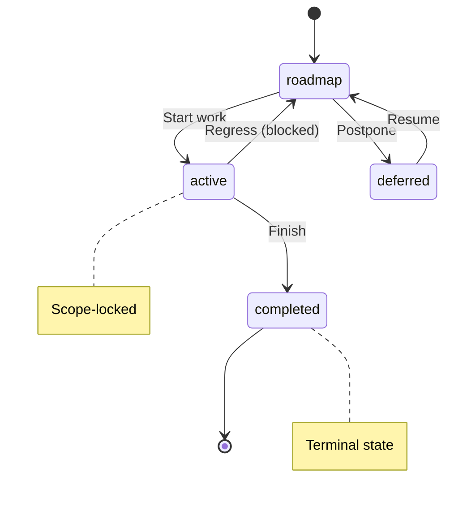
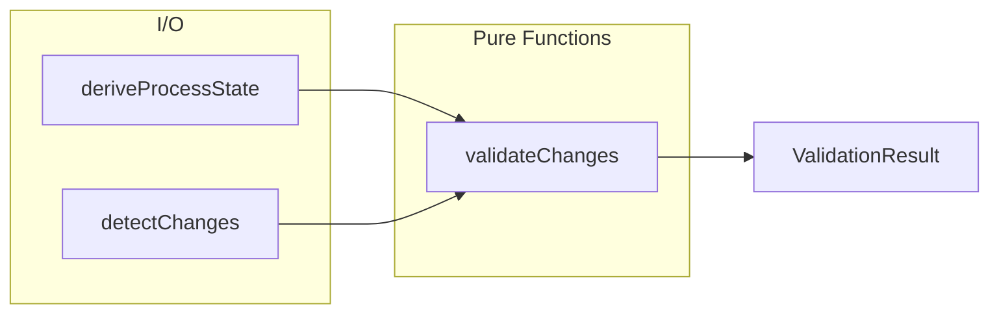

# ProcessGuard

**Purpose:** Full documentation generated from decision document
**Detail Level:** detailed

---

**Context:**
  The delivery workflow needs protection against accidental modifications:
  - Completed specs get modified without explicit unlock reason
  - Status transitions bypass FSM rules (e.g., roadmap -> completed)
  - Active specs expand scope unexpectedly with new deliverables
  - Changes occur outside session boundaries without warning

  Without validation, the delivery process relies on human discipline alone.
  Mistakes ripple through documentation generation and workflow tracking.

  **Decision:**
  Implement a Decider-based linter that validates git changes at commit time:
  - **Pure functions:** No I/O in validation logic, easy to test
  - **Derived state:** State computed from file annotations, not stored separately
  - **Protection levels:** Files inherit protection from `@libar-docs-status` tag
  - **FSM enforcement:** Transitions validated against PDR-005 state machine
  - **Session scoping:** Warnings for out-of-scope files, errors for excluded files
  - **Escape hatch:** `@libar-docs-unlock-reason` allows modifying completed specs

  **Consequences:**
  - (+) Invalid workflow transitions caught before commit
  - (+) Scope creep prevented on active specs
  - (+) Completed work protected from accidental modification
  - (+) Session boundaries enforce focus
  - (-) Learning curve for unlock-reason workflow
  - (-) Requires pre-commit hook setup

  **Target Documents:**

  | Output | Purpose | Detail Level |
  | docs/PROCESS-GUARD.md | Detailed human reference | detailed |
  | _claude-md/validation/process-guard.md | Compact AI context | summary |

  **Source Mapping:**

  | Section | Source File | Extraction Method |
  | Context | THIS DECISION (Rule: Context - Why Process Guard Exists) | Decision rule description |
  | How It Works | THIS DECISION (Rule: Decision - How Process Guard Works) | Decision rule description |
  | Trade-offs | THIS DECISION (Rule: Consequences - Trade-offs of This Approach) | Decision rule description |
  | Validation Rules | tests/features/validation/process-guard.feature | Rule blocks |
  | Protection Levels | delivery-process/specs/process-guard-linter.feature | Scenario Outline Examples |
  | Valid Transitions | delivery-process/specs/process-guard-linter.feature | Scenario Outline Examples |
  | API Types | src/lint/process-guard/types.ts | @extract-shapes tag |
  | Decider API | src/lint/process-guard/decider.ts | @extract-shapes tag |
  | CLI Options | src/cli/lint-process.ts | JSDoc section |
  | Error Messages | src/lint/process-guard/decider.ts | createViolation() patterns |

---

## Context

### Why Process Guard Exists

The delivery workflow defines states for specifications:
    - **roadmap:** Planning phase, fully editable
    - **active:** Implementation in progress, scope-locked
    - **completed:** Work finished, hard-locked
    - **deferred:** Parked work, fully editable

    Without enforcement, these states are advisory only. Process Guard
    makes them enforceable through pre-commit validation.

## Decision

### How Process Guard Works

Process Guard implements 7 validation rules:

    | Rule ID | Severity | What It Checks |
    | completed-protection | error | Completed specs require unlock reason |
    | invalid-status-transition | error | Transitions must follow FSM |
    | scope-creep | error | Active specs cannot add deliverables |
    | session-excluded | error | Cannot modify excluded files |
    | missing-relationship-target | warning | Relationship target must exist |
    | session-scope | warning | File outside session scope |
    | deliverable-removed | warning | Deliverable was removed |

    The linter runs as a pre-commit hook via Husky.
    See `.husky/pre-commit` for the hook configuration.

    Pre-commit: `npx lint-process --staged`
    CI pipeline: `npx lint-process --all --strict`

## Implementation Details

### Context

The delivery workflow defines states for specifications:
    - **roadmap:** Planning phase, fully editable
    - **active:** Implementation in progress, scope-locked
    - **completed:** Work finished, hard-locked
    - **deferred:** Parked work, fully editable

    Without enforcement, these states are advisory only. Process Guard
    makes them enforceable through pre-commit validation.

### How It Works

Process Guard implements 7 validation rules:

    | Rule ID | Severity | What It Checks |
    | completed-protection | error | Completed specs require unlock reason |
    | invalid-status-transition | error | Transitions must follow FSM |
    | scope-creep | error | Active specs cannot add deliverables |
    | session-excluded | error | Cannot modify excluded files |
    | missing-relationship-target | warning | Relationship target must exist |
    | session-scope | warning | File outside session scope |
    | deliverable-removed | warning | Deliverable was removed |

    The linter runs as a pre-commit hook via Husky.
    See `.husky/pre-commit` for the hook configuration.

    Pre-commit: `npx lint-process --staged`
    CI pipeline: `npx lint-process --all --strict`

### Trade-offs

**Benefits:**
    - Catches workflow errors before they enter git history
    - Prevents accidental scope creep during active development
    - Protects completed work from unintended modifications
    - Clear escape hatch via unlock-reason annotation

    **Costs:**
    - Requires understanding of FSM states and transitions
    - Initial friction when modifying completed specs
    - Pre-commit hook adds a few seconds to commit time

### Validation Rules

### Completed files require unlock-reason to modify

### Status transitions must follow PDR-005 FSM

### Active specs cannot add new deliverables

### Files outside active session scope trigger warnings

### Explicitly excluded files trigger errors

### Multiple rules validate independently

### Protection Levels

| status | protection | restriction |
| --- | --- | --- |
| roadmap | none | Fully editable |
| deferred | none | Fully editable |
| active | scope | Errors on new deliverables |
| completed | hard | Requires @libar-docs-unlock-reason |

### Valid Transitions

| from | to |
| --- | --- |
| roadmap | active |
| roadmap | deferred |
| active | completed |
| active | roadmap |
| deferred | roadmap |
| roadmap | roadmap |

| from | to |
| --- | --- |
| roadmap | completed |
| deferred | active |
| deferred | completed |
| completed | active |
| completed | roadmap |
| completed | deferred |

### API Types

```typescript
/**
 * Process guard rule identifiers.
 *
 * Note: `taxonomy-locked-tag` and `taxonomy-enum-in-use` were removed when
 * taxonomy moved from JSON to TypeScript. TypeScript changes require
 * recompilation, making runtime validation unnecessary.
 */
type ProcessGuardRule =
  | 'completed-protection'
  | 'scope-creep'
  | 'invalid-status-transition'
  | 'session-scope'
  | 'session-excluded'
  | 'deliverable-removed';
```

```typescript
/**
 * Input to the process guard decider.
 * Contains all information needed for validation.
 */
interface DeciderInput {
  readonly state: ProcessState;
  readonly changes: ChangeDetection;
  readonly options: DeciderOptions;
}
```

```typescript
/**
 * Result of process guard validation.
 */
interface ValidationResult {
  /** Whether all checks passed (no errors) */
  readonly valid: boolean;
  /** Blocking violations (must be fixed) */
  readonly violations: readonly ProcessViolation[];
  /** Non-blocking warnings */
  readonly warnings: readonly ProcessViolation[];
  /** Process state at time of validation */
  readonly processState: ProcessState;
  /** Changes that were validated */
  readonly changes: ChangeDetection;
}
```

| Property | Description |
| --- | --- |
| `valid` | Whether all checks passed (no errors) |
| `violations` | Blocking violations (must be fixed) |
| `warnings` | Non-blocking warnings |
| `processState` | Process state at time of validation |
| `changes` | Changes that were validated |

```typescript
/**
 * A validation violation from the process guard linter.
 */
interface ProcessViolation {
  /** Unique rule ID that triggered the violation */
  readonly rule: ProcessGuardRule;
  /** Severity (error = blocking, warning = informational) */
  readonly severity: ViolationSeverity;
  /** Human-readable error message */
  readonly message: string;
  /** File that triggered the violation */
  readonly file: string;
  /** Suggested fix or action */
  readonly suggestion?: string;
}
```

| Property | Description |
| --- | --- |
| `rule` | Unique rule ID that triggered the violation |
| `severity` | Severity (error = blocking, warning = informational) |
| `message` | Human-readable error message |
| `file` | File that triggered the violation |
| `suggestion` | Suggested fix or action |

```typescript
/**
 * State for a single file derived from its @libar-docs-* annotations.
 */
interface FileState {
  /** Absolute file path */
  readonly path: string;
  /** Relative path from project root */
  readonly relativePath: string;
  /** Status from @libar-docs-status annotation */
  readonly status: ProcessStatusValue;
  /** Normalized status for display */
  readonly normalizedStatus: NormalizedStatus;
  /** Protection level from FSM (none/scope/hard) */
  readonly protection: ProtectionLevel;
  /** Deliverable names from Background table */
  readonly deliverables: readonly string[];
  /** Whether file has @libar-docs-unlock-reason */
  readonly hasUnlockReason: boolean;
  /** The unlock reason text if present */
  readonly unlockReason?: string;
}
```

| Property | Description |
| --- | --- |
| `path` | Absolute file path |
| `relativePath` | Relative path from project root |
| `status` | Status from @libar-docs-status annotation |
| `normalizedStatus` | Normalized status for display |
| `protection` | Protection level from FSM (none/scope/hard) |
| `deliverables` | Deliverable names from Background table |
| `hasUnlockReason` | Whether file has @libar-docs-unlock-reason |
| `unlockReason` | The unlock reason text if present |

### Decider API

```typescript
/**
 * Validate changes against process rules.
 *
 * Pure function following the Decider pattern:
 * - Takes all inputs explicitly (no hidden state)
 * - Returns result without side effects
 * - Emits events for observability
 *
 * @param input - Complete input including state, changes, and options
 * @returns DeciderOutput with validation result and events
 *
 * @example
 * ```typescript
 * const output = validateChanges({
 *   state: processState,
 *   changes: changeDetection,
 *   options: { strict: false, ignoreSession: false },
 * });
 *
 * if (!output.result.valid) {
 *   console.log('Violations:', output.result.violations);
 * }
 * ```
 */
function validateChanges(input: DeciderInput): DeciderOutput;
```

### CLI Options

Validates git changes against delivery process rules.

### Error Messages

| Error Code |
|---|
| completed-protection |
| invalid-status-transition |
| scope-creep |
| deliverable-removed |
| session-scope |
| session-excluded |

## Consequences

### Trade-offs of This Approach

**Benefits:**
    - Catches workflow errors before they enter git history
    - Prevents accidental scope creep during active development
    - Protects completed work from unintended modifications
    - Clear escape hatch via unlock-reason annotation

    **Costs:**
    - Requires understanding of FSM states and transitions
    - Initial friction when modifying completed specs
    - Pre-commit hook adds a few seconds to commit time

## FSM Diagram

The FSM enforces valid state transitions. Protection levels and transitions
    are defined in TypeScript (extracted via @extract-shapes).



## Escape Hatches

**Context:** Sometimes process rules need to be bypassed for legitimate reasons.

    **Decision:** These escape hatches are available:

| Situation | Solution | Example |
| --- | --- | --- |
| Fix bug in completed spec | Add unlock-reason tag | @libar-docs-unlock-reason:'Fix-typo' |
| Modify outside session scope | Use --ignore-session flag | lint-process --staged --ignore-session |
| CI warnings blocking pipeline | Omit --strict flag | lint-process --all (warnings won't fail) |

## Rule Descriptions

Process Guard validates 7 rules (types extracted from TypeScript):

| Rule | Severity | Human Description |
| --- | --- | --- |
| completed-protection | error | Cannot modify completed specs without unlock-reason |
| invalid-status-transition | error | Status transition must follow FSM |
| scope-creep | error | Cannot add deliverables to active specs |
| session-excluded | error | Cannot modify files excluded from session |
| missing-relationship-target | warning | Relationship target must exist |
| session-scope | warning | File not in active session scope |
| deliverable-removed | warning | Deliverable was removed (informational) |

## CLI Usage

Process Guard is invoked via the lint-process CLI command.
    Configuration interface (`ProcessGuardCLIConfig`) is extracted from `src/cli/lint-process.ts`.

    **CLI Commands:**

| Command | Purpose |
| --- | --- |
| `lint-process --staged` | Pre-commit validation (default mode) |
| `lint-process --all --strict` | CI pipeline with strict mode |
| `lint-process --file specs/my-feature.feature` | Validate specific file |
| `lint-process --staged --show-state` | Debug: show derived process state |
| `lint-process --staged --ignore-session` | Override session scope checking |

    **CLI Options:**

| Option | Description |
| --- | --- |
| `--staged` | Validate staged files only (pre-commit) |
| `--all` | Validate all tracked files (CI) |
| `--strict` | Treat warnings as errors (exit 1) |
| `--ignore-session` | Skip session scope validation |
| `--show-state` | Debug: show derived process state |
| `--format json` | Machine-readable JSON output |
| `--file <path>` | Validate a specific file |

    **Integration:** See `.husky/pre-commit` for pre-commit hook setup and `package.json` scripts section for npm script configuration.

## Programmatic API

Process Guard can be used programmatically for custom integrations.

    **Usage Example:**

```typescript
import {
      deriveProcessState,
      detectStagedChanges,
      validateChanges,
      hasErrors,
      summarizeResult,
    } from '@libar-dev/delivery-process/lint';

    const state = (await deriveProcessState({ baseDir: '.' })).value;
    const changes = detectStagedChanges('.').value;
    const { result } = validateChanges({
      state,
      changes,
      options: { strict: false, ignoreSession: false },
    });

    if (hasErrors(result)) {
      console.log(summarizeResult(result));
      for (const v of result.violations) {
        console.log(`[${v.rule}] ${v.file}: ${v.message}`);
      }
      process.exit(1);
    }
```

**API Functions:**

| Category | Function | Description |
| --- | --- | --- |
| State | deriveProcessState(cfg) | Build state from file annotations |
| Changes | detectStagedChanges(dir) | Parse staged git diff |
| Changes | detectBranchChanges(dir) | Parse all changes vs main |
| Changes | detectFileChanges(dir, f) | Parse specific files |
| Validate | validateChanges(input) | Run all validation rules |
| Results | hasErrors(result) | Check for blocking errors |
| Results | hasWarnings(result) | Check for warnings |
| Results | summarizeResult(result) | Human-readable summary |

## Architecture

Process Guard uses the Decider pattern for testable validation.

    **Data Flow Diagram:**



**Principle:** State is derived from file annotations - there is no separate state file to maintain.

## Related Documentation

**Context:** Related documentation for deeper understanding.

| Document | Relationship | Focus |
| --- | --- | --- |
| VALIDATION-REFERENCE.md | Sibling | DoD validation, anti-pattern detection |
| SESSION-GUIDES-REFERENCE.md | Prerequisite | Planning/Implementation workflows that Process Guard enforces |
| CONFIGURATION-REFERENCE.md | Reference | Presets and tag configuration |
| METHODOLOGY-REFERENCE.md | Background | Code-first documentation philosophy |
