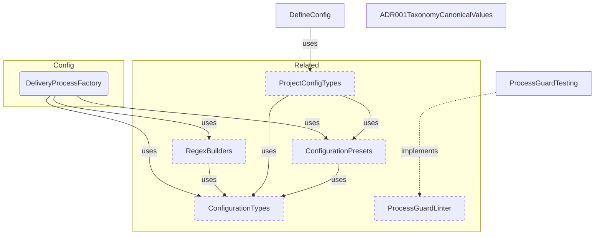
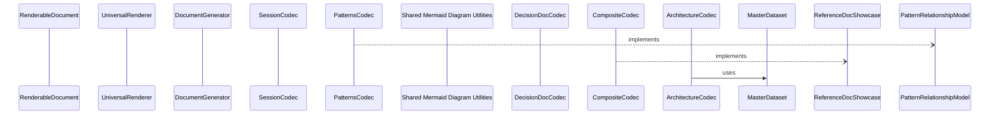
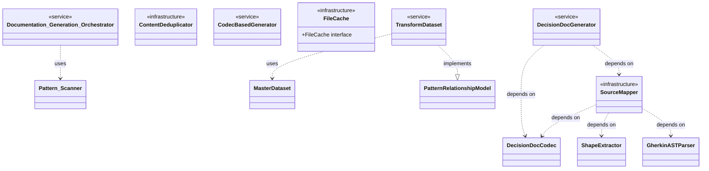
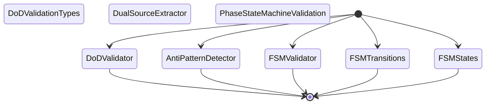
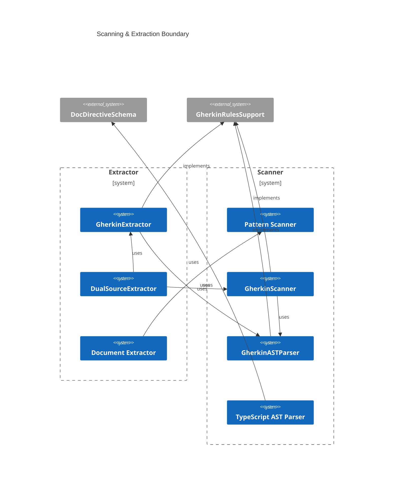
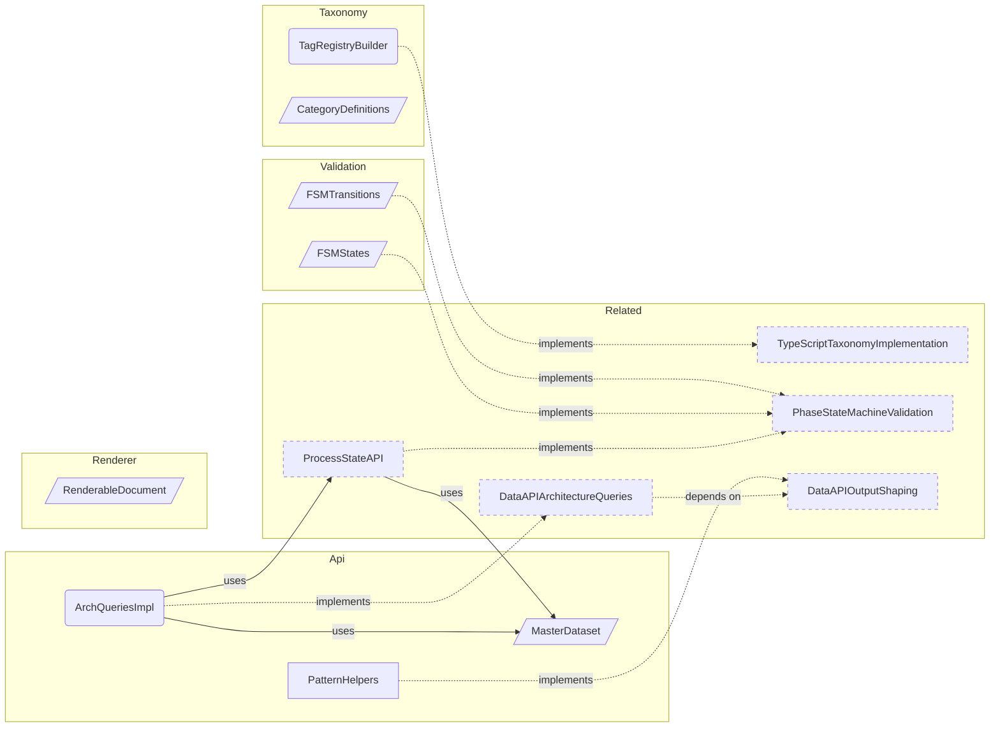

# Reference Generation Sample

**Purpose:** Reference document: Reference Generation Sample
**Detail Level:** Full reference

---

## Product area canonical values

**Invariant:** The product-area tag uses one of 7 canonical values. Each value represents a reader-facing documentation section, not a source module.

| Value | Reader Question | Covers |
| --- | --- | --- |
| Annotation | How do I annotate code? | Scanning, extraction, tag parsing, dual-source |
| Configuration | How do I configure the tool? | Config loading, presets, resolution |
| Generation | How does code become docs? | Codecs, generators, rendering, diagrams |
| Validation | How is the workflow enforced? | FSM, DoD, anti-patterns, process guard, lint |
| DataAPI | How do I query process state? | Process state API, stubs, context assembly, CLI |
| CoreTypes | What foundational types exist? | Result monad, error factories, string utils |
| Process | How does the session workflow work? | Session lifecycle, handoffs, conventions |

---

## ADR category canonical values

**Invariant:** The adr-category tag uses one of 4 values.

| Value | Purpose |
| --- | --- |
| architecture | System structure, component design, data flow |
| process | Workflow, conventions, annotation rules |
| testing | Test strategy, verification approach |
| documentation | Documentation generation, content structure |

---

## FSM status values and protection levels

**Invariant:** Pattern status uses exactly 4 values with defined protection levels. These are enforced by Process Guard at commit time.

| Status | Protection | Can Add Deliverables | Allowed Actions |
| --- | --- | --- | --- |
| roadmap | None | Yes | Full editing |
| active | Scope-locked | No | Edit existing deliverables only |
| completed | Hard-locked | No | Requires unlock-reason tag |
| deferred | None | Yes | Full editing |

---

## Valid FSM transitions

**Invariant:** Only these transitions are valid. All others are rejected by Process Guard. Completed is a terminal state. Modifications require `@libar-docs-unlock-reason` escape hatch.

| From | To | Trigger |
| --- | --- | --- |
| roadmap | active | Start work |
| roadmap | deferred | Postpone |
| active | completed | All deliverables done |
| active | roadmap | Blocked/regressed |
| deferred | roadmap | Resume planning |

---

## Tag format types

**Invariant:** Every tag has one of 6 format types that determines how its value is parsed.

| Format | Parsing | Example |
| --- | --- | --- |
| flag | Boolean presence, no value | @libar-docs-core |
| value | Simple string | @libar-docs-pattern MyPattern |
| enum | Constrained to predefined list | @libar-docs-status completed |
| csv | Comma-separated values | @libar-docs-uses A, B, C |
| number | Numeric value | @libar-docs-phase 15 |
| quoted-value | Preserves spaces | @libar-docs-brief:'Multi word' |

---

## Source ownership

**Invariant:** Relationship tags have defined ownership by source type. Anti-pattern detection enforces these boundaries.

| Tag | Correct Source | Wrong Source | Rationale |
| --- | --- | --- | --- |
| uses | TypeScript | Feature files | TS owns runtime dependencies |
| depends-on | Feature files | TypeScript | Gherkin owns planning dependencies |
| quarter | Feature files | TypeScript | Gherkin owns timeline metadata |
| team | Feature files | TypeScript | Gherkin owns ownership metadata |

---

## Quarter format convention

**Invariant:** The quarter tag uses `YYYY-QN` format (e.g., `2026-Q1`). ISO-year-first sorting works lexicographically.

---

## Deliverable status canonical values

**Invariant:** Deliverable status (distinct from pattern FSM status) uses exactly 6 values, enforced by Zod schema at parse time.

| Value | Meaning |
| --- | --- |
| complete | Work is done |
| in-progress | Work is ongoing |
| pending | Work has not started |
| deferred | Work postponed |
| superseded | Replaced by another |
| n/a | Not applicable |

---

## Configuration Components

Scoped architecture diagram showing component relationships:



---

## Renderer Pipeline

Scoped architecture diagram showing component relationships:



---

## Generator Class Model

Scoped architecture diagram showing component relationships:



---

## Validation State Model

Scoped architecture diagram showing component relationships:



---

## Scanning & Extraction Boundary

Scoped architecture diagram showing component relationships:



---

## Domain Layer Overview

Scoped architecture diagram showing component relationships:



---

## API Types

### normalizeStatus (function)

````typescript
/**
 * Normalize any status string to a display bucket
 *
 * Maps status values to three canonical display states:
 * - "completed": completed
 * - "active": active
 * - "planned": roadmap, deferred, planned, or any unknown value
 *
 * Per PDR-005: deferred items are treated as planned (not actively worked on)
 *
 * @param status - Raw status from pattern (case-insensitive)
 * @returns "completed" | "active" | "planned"
 *
 * @example
 * ```typescript
 * normalizeStatus("completed")   // → "completed"
 * normalizeStatus("active")      // → "active"
 * normalizeStatus("roadmap")     // → "planned"
 * normalizeStatus("deferred")    // → "planned"
 * normalizeStatus(undefined)     // → "planned"
 * ```
 */
````

```typescript
function normalizeStatus(status: string | undefined): NormalizedStatus;
```

| Parameter | Type | Description |
| --- | --- | --- |
| status |  | Raw status from pattern (case-insensitive) |

**Returns:** "completed" | "active" | "planned"

### DELIVERABLE_STATUS_VALUES (const)

```typescript
/**
 * Canonical deliverable status values
 *
 * These are the ONLY accepted values for the Status column in
 * Gherkin Background deliverable tables. Values are lowercased
 * at extraction time before schema validation.
 *
 * - complete: Work is done
 * - in-progress: Work is ongoing
 * - pending: Work hasn't started
 * - deferred: Work postponed
 * - superseded: Replaced by another deliverable
 * - n/a: Not applicable
 *
 */
```

```typescript
DELIVERABLE_STATUS_VALUES = [
  'complete',
  'in-progress',
  'pending',
  'deferred',
  'superseded',
  'n/a',
] as const
```

### CategoryDefinition (interface)

```typescript
interface CategoryDefinition {
  /** Category tag name without prefix (e.g., "core", "api", "ddd", "saga") */
  readonly tag: string;
  /** Human-readable domain name for display (e.g., "Strategic DDD", "Event Sourcing") */
  readonly domain: string;
  /** Display order priority - lower values appear first in sorted output */
  readonly priority: number;
  /** Brief description of the category's purpose and typical patterns */
  readonly description: string;
  /** Alternative tag names that map to this category (e.g., "es" for "event-sourcing") */
  readonly aliases: readonly string[];
}
```

| Property | Description |
| --- | --- |
| tag | Category tag name without prefix (e.g., "core", "api", "ddd", "saga") |
| domain | Human-readable domain name for display (e.g., "Strategic DDD", "Event Sourcing") |
| priority | Display order priority - lower values appear first in sorted output |
| description | Brief description of the category's purpose and typical patterns |
| aliases | Alternative tag names that map to this category (e.g., "es" for "event-sourcing") |

### SectionBlock (type)

```typescript
type SectionBlock =
  | HeadingBlock
  | ParagraphBlock
  | SeparatorBlock
  | TableBlock
  | ListBlock
  | CodeBlock
  | MermaidBlock
  | CollapsibleBlock
  | LinkOutBlock;
```

---

## Behavior Specifications

### DeliveryProcessFactory

[View DeliveryProcessFactory source](src/config/factory.ts)

## Delivery Process Factory

Main factory function for creating configured delivery process instances.
Supports presets, custom configuration, and configuration overrides.

### When to Use

- At application startup to create a configured instance
- When switching between different tag prefixes
- When customizing the taxonomy for a specific project

### DefineConfig

[View DefineConfig source](src/config/define-config.ts)

## Define Config

Identity function for type-safe project configuration.
Follows the Vite/Vitest `defineConfig()` convention:
returns the input unchanged, providing only TypeScript type checking.

Validation happens later at load time via Zod schema in `loadProjectConfig()`.

### When to Use

In `delivery-process.config.ts` at project root:

```typescript
import { defineConfig } from '@libar-dev/delivery-process/config';

export default defineConfig({
  preset: 'ddd-es-cqrs',
  sources: { typescript: ['src/** /*.ts'] },
});
```

### ADR001TaxonomyCanonicalValues

[View ADR001TaxonomyCanonicalValues source](delivery-process/decisions/adr-001-taxonomy-canonical-values.feature)

**Context:**
  The annotation system requires well-defined canonical values for taxonomy
  tags, FSM status lifecycle, and source ownership rules. Without canonical
  values, organic growth produces drift (Generator vs Generators, Process
  vs DeliveryProcess) and inconsistent grouping in generated documentation.

  **Decision:**
  Define canonical values for all taxonomy enums, FSM states with protection
  levels, valid transitions, tag format types, and source ownership rules.
  These are the durable constants of the delivery process.

  **Consequences:**
  - (+) Generated docs group into coherent sections
  - (+) FSM enforcement has clear, auditable state definitions
  - (+) Source ownership prevents cross-domain tag confusion
  - (-) Migration effort for existing specs with non-canonical values

<details>
<summary>Product area canonical values</summary>

#### Product area canonical values

**Invariant:** The product-area tag uses one of 7 canonical values. Each value represents a reader-facing documentation section, not a source module.

| Value | Reader Question | Covers |
| --- | --- | --- |
| Annotation | How do I annotate code? | Scanning, extraction, tag parsing, dual-source |
| Configuration | How do I configure the tool? | Config loading, presets, resolution |
| Generation | How does code become docs? | Codecs, generators, rendering, diagrams |
| Validation | How is the workflow enforced? | FSM, DoD, anti-patterns, process guard, lint |
| DataAPI | How do I query process state? | Process state API, stubs, context assembly, CLI |
| CoreTypes | What foundational types exist? | Result monad, error factories, string utils |
| Process | How does the session workflow work? | Session lifecycle, handoffs, conventions |

</details>

<details>
<summary>ADR category canonical values</summary>

#### ADR category canonical values

**Invariant:** The adr-category tag uses one of 4 values.

| Value | Purpose |
| --- | --- |
| architecture | System structure, component design, data flow |
| process | Workflow, conventions, annotation rules |
| testing | Test strategy, verification approach |
| documentation | Documentation generation, content structure |

</details>

<details>
<summary>FSM status values and protection levels</summary>

#### FSM status values and protection levels

**Invariant:** Pattern status uses exactly 4 values with defined protection levels. These are enforced by Process Guard at commit time.

| Status | Protection | Can Add Deliverables | Allowed Actions |
| --- | --- | --- | --- |
| roadmap | None | Yes | Full editing |
| active | Scope-locked | No | Edit existing deliverables only |
| completed | Hard-locked | No | Requires unlock-reason tag |
| deferred | None | Yes | Full editing |

</details>

<details>
<summary>Valid FSM transitions</summary>

#### Valid FSM transitions

**Invariant:** Only these transitions are valid. All others are rejected by Process Guard. Completed is a terminal state. Modifications require `@libar-docs-unlock-reason` escape hatch.

| From | To | Trigger |
| --- | --- | --- |
| roadmap | active | Start work |
| roadmap | deferred | Postpone |
| active | completed | All deliverables done |
| active | roadmap | Blocked/regressed |
| deferred | roadmap | Resume planning |

</details>

<details>
<summary>Tag format types</summary>

#### Tag format types

**Invariant:** Every tag has one of 6 format types that determines how its value is parsed.

| Format | Parsing | Example |
| --- | --- | --- |
| flag | Boolean presence, no value | @libar-docs-core |
| value | Simple string | @libar-docs-pattern MyPattern |
| enum | Constrained to predefined list | @libar-docs-status completed |
| csv | Comma-separated values | @libar-docs-uses A, B, C |
| number | Numeric value | @libar-docs-phase 15 |
| quoted-value | Preserves spaces | @libar-docs-brief:'Multi word' |

</details>

<details>
<summary>Source ownership</summary>

#### Source ownership

**Invariant:** Relationship tags have defined ownership by source type. Anti-pattern detection enforces these boundaries.

| Tag | Correct Source | Wrong Source | Rationale |
| --- | --- | --- | --- |
| uses | TypeScript | Feature files | TS owns runtime dependencies |
| depends-on | Feature files | TypeScript | Gherkin owns planning dependencies |
| quarter | Feature files | TypeScript | Gherkin owns timeline metadata |
| team | Feature files | TypeScript | Gherkin owns ownership metadata |

</details>

<details>
<summary>Quarter format convention</summary>

#### Quarter format convention

**Invariant:** The quarter tag uses `YYYY-QN` format (e.g., `2026-Q1`). ISO-year-first sorting works lexicographically.

</details>

<details>
<summary>Deliverable status canonical values (1 scenarios)</summary>

#### Deliverable status canonical values

**Invariant:** Deliverable status (distinct from pattern FSM status) uses exactly 6 values, enforced by Zod schema at parse time.

| Value | Meaning |
| --- | --- |
| complete | Work is done |
| in-progress | Work is ongoing |
| pending | Work has not started |
| deferred | Work postponed |
| superseded | Replaced by another |
| n/a | Not applicable |

**Verified by:**

- Canonical values are enforced

</details>

### ProcessGuardTesting

[View ProcessGuardTesting source](tests/features/validation/process-guard.feature)

Pure validation functions for enforcing delivery process rules per PDR-005.
  All validation follows the Decider pattern: (state, changes, options) => result.

  **Problem:**
  - Completed specs modified without explicit unlock reason
  - Invalid status transitions bypass FSM rules
  - Active specs expand scope unexpectedly with new deliverables
  - Changes occur outside session boundaries

  **Solution:**
  - checkProtectionLevel() enforces unlock-reason for completed (hard) files
  - checkStatusTransitions() validates transitions against FSM matrix
  - checkScopeCreep() prevents deliverable addition to active (scope) specs
  - checkSessionScope() warns about files outside session scope
  - checkSessionExcluded() errors on explicitly excluded files

<details>
<summary>Completed files require unlock-reason to modify (4 scenarios)</summary>

#### Completed files require unlock-reason to modify

**Verified by:**

- Completed file with unlock-reason passes validation
- Completed file without unlock-reason fails validation
- Protection levels and unlock requirement
- File transitioning to completed does not require unlock-reason

</details>

<details>
<summary>Status transitions must follow PDR-005 FSM (2 scenarios)</summary>

#### Status transitions must follow PDR-005 FSM

**Verified by:**

- Valid transitions pass validation
- Invalid transitions fail validation

</details>

<details>
<summary>Active specs cannot add new deliverables (6 scenarios)</summary>

#### Active specs cannot add new deliverables

**Verified by:**

- Active spec with no deliverable changes passes
- Active spec adding deliverable fails validation
- Roadmap spec can add deliverables freely
- Removing deliverable produces warning
- Deliverable status change does not trigger scope-creep
- Multiple deliverable status changes pass validation

</details>

<details>
<summary>Files outside active session scope trigger warnings (4 scenarios)</summary>

#### Files outside active session scope trigger warnings

**Verified by:**

- File in session scope passes validation
- File outside session scope triggers warning
- No active session means all files in scope
- ignoreSession flag suppresses session warnings

</details>

<details>
<summary>Explicitly excluded files trigger errors (3 scenarios)</summary>

#### Explicitly excluded files trigger errors

**Verified by:**

- Excluded file triggers error
- Non-excluded file passes validation
- ignoreSession flag suppresses excluded errors

</details>

<details>
<summary>Multiple rules validate independently (3 scenarios)</summary>

#### Multiple rules validate independently

**Verified by:**

- Multiple violations from different rules
- Strict mode promotes warnings to errors
- Clean change produces empty violations

</details>

---
