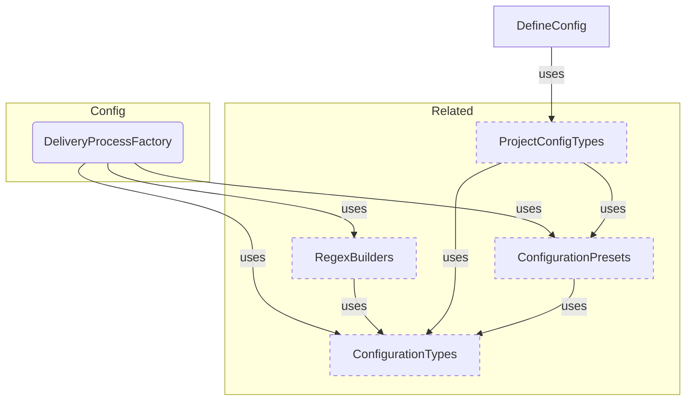
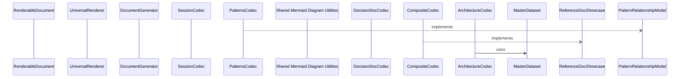

# Reference Generation Sample

**Purpose:** Reference document: Reference Generation Sample
**Detail Level:** Full reference

---

## Design Principles

**Context:** The package follows specific architectural principles.

    **Key Design Principles:**

    **What This Means for Implementation:**

| Principle | Description |
| --- | --- |
| Single Source of Truth | Code and .feature files are authoritative; docs are generated projections |
| Single-Pass Transformation | All derived views computed in O(n) time, not redundant O(n) per section |
| Codec-Based Rendering | Zod 4 codecs transform MasterDataset to RenderableDocument to Markdown |
| Schema-First Validation | Zod schemas define types; runtime validation at all boundaries |
| Result Monad | Explicit error handling via Result(T,E) instead of exceptions |

| Aspect | Wrong Mental Model | Correct Mental Model |
| --- | --- | --- |
| Scope | Build feature for small output here | Build capability for hundreds of files |
| ROI | Over-engineered for this repo | Multi-day investment saves weeks of maintenance |
| Testing | Simple feature, basic tests | Mission-critical infra, comprehensive tests |
| Shortcuts | Good enough for this repo | Must work across many annotated sources |

---

## Four-Stage Pipeline

**Context:** The documentation generation pipeline consists of four stages.

    **Pipeline Overview:**

    **Stage Details:**

| Stage | Purpose | Key Files | Input | Output |
| --- | --- | --- | --- | --- |
| Scanner | File discovery and AST parsing | pattern-scanner.ts, gherkin-scanner.ts | Source files | ScannedFile[] |
| Extractor | Pattern extraction from AST | doc-extractor.ts, gherkin-extractor.ts | ScannedFile[] | ExtractedPattern[] |
| Transformer | Single-pass view computation | transform-dataset.ts | ExtractedPattern[] | MasterDataset |
| Codec | Document generation | codecs/*.ts, render.ts | MasterDataset | Markdown files |

| Stage | Scanner Variant | Purpose | File Discovery |
| --- | --- | --- | --- |
| Scanner | TypeScript | Parse .ts files with opt-in | glob patterns, hasFileOptIn check |
| Scanner | Gherkin | Parse .feature files | glob patterns, tag extraction |
| Extractor | TypeScript | JSDoc annotation extraction | AST parsing, directive extraction |
| Extractor | Gherkin | Tag and scenario extraction | Cucumber parser, tag mapping |

---

## Module Responsibilities

**Context:** The codebase is organized into modules with specific responsibilities.

    **Core Modules:**

    **Key Files by Function:**

| Module | Location | Purpose |
| --- | --- | --- |
| config | src/config/ | Configuration factory, presets (generic, libar-generic, ddd-es-cqrs) |
| taxonomy | src/taxonomy/ | Tag definitions - categories, status values, format types |
| scanner | src/scanner/ | TypeScript and Gherkin file scanning |
| extractor | src/extractor/ | Pattern extraction from AST/Gherkin |
| generators | src/generators/ | Document generators and orchestrator |
| renderable | src/renderable/ | Markdown codec system |
| validation | src/validation/ | FSM validation, DoD checks, anti-patterns |
| lint | src/lint/ | Pattern linting and process guard |
| api | src/api/ | Process State API for programmatic access |

| Function | File | Description |
| --- | --- | --- |
| Entry point | src/config/factory.ts | createDeliveryProcess() factory |
| TS scanning | src/scanner/pattern-scanner.ts | TypeScript file discovery and opt-in |
| Gherkin scanning | src/scanner/gherkin-scanner.ts | Feature file discovery |
| TS extraction | src/extractor/doc-extractor.ts | Pattern extraction from AST |
| Gherkin extraction | src/extractor/gherkin-extractor.ts | Pattern extraction from tags |
| Transformation | src/generators/pipeline/transform-dataset.ts | MasterDataset builder |
| Orchestration | src/generators/orchestrator.ts | Full pipeline coordination |
| Codecs | src/renderable/codecs/*.ts | Document type codecs |
| Rendering | src/renderable/renderer.ts | Block to markdown conversion |

---

## MasterDataset Schema

**Context:** MasterDataset is the central data structure with all pre-computed views.

    **Schema Structure:**

    **Pre-computed Views (O(1) Access):**

    See src/validation-schemas/master-dataset.ts for the complete Zod schema.

| Field | Type | Description |
| --- | --- | --- |
| patterns | ExtractedPattern[] | All patterns from both sources |
| tagRegistry | TagRegistry | Category and tag definitions |
| byStatus | StatusGroups | Grouped by completed, active, planned |
| byPhase | PhaseGroup[] | Grouped by phase with counts |
| byQuarter | Record(string, ExtractedPattern[]) | Grouped by quarter (e.g., "Q4-2024") |
| byCategory | Record(string, ExtractedPattern[]) | Grouped by category |
| bySource | SourceViews | Grouped by typescript, gherkin, roadmap, prd |
| counts | StatusCounts | Aggregate status counts |
| relationshipIndex | Record(string, RelationshipEntry) | Dependency graph (uses, usedBy, dependsOn, enables) |
| archIndex | ArchIndex | Optional architecture index for diagrams |

| View | Access Pattern | Use Case |
| --- | --- | --- |
| byStatus.completed | dataset.byStatus.completed | List completed patterns |
| byStatus.active | dataset.byStatus.active | List active patterns |
| byStatus.planned | dataset.byStatus.planned | List planned patterns |
| byPhase | dataset.byPhase[0].patterns | Get phase patterns with counts |
| byCategory | dataset.byCategory['core'] | Get patterns by category |
| bySource.typescript | dataset.bySource.typescript | Get TypeScript-origin patterns |
| bySource.gherkin | dataset.bySource.gherkin | Get Gherkin-origin patterns |

---

## RenderableDocument Schema

**Context:** RenderableDocument is the universal intermediate format.

    **Document Structure:**

    See src/renderable/schema.ts for block builders and type definitions.

| Field | Type | Description |
| --- | --- | --- |
| title | string | Document title (becomes H1) |
| purpose | string (optional) | Description (rendered as blockquote) |
| detailLevel | string (optional) | Detail level indicator |
| sections | SectionBlock[] | Array of content blocks |
| additionalFiles | Record(string, RenderableDocument) | Progressive disclosure detail files |

---

## Block Vocabulary

**Context:** RenderableDocument uses a fixed vocabulary of 9 section block types.

    **Block Categories:**

    **Block Type Reference:**

    **Block Builder Functions:**

| Category | Block Types | Markdown Output |
| --- | --- | --- |
| Structural | heading, paragraph, separator | Headings, text, horizontal rules |
| Content | table, list, code, mermaid | tables, lists, fenced code |
| Progressive | collapsible, link-out | details/summary, links to files |

| Block | Key Properties | Usage | Markdown Output |
| --- | --- | --- | --- |
| heading | level (1-6), text | Section headers | Heading with level |
| paragraph | text | Body text | Plain text |
| separator | (none) | Horizontal rules | --- |
| table | columns, rows, alignment | Data tables | Pipe tables |
| list | ordered, items | Bullet or numbered lists | - item or 1. item |
| code | language, content | Code snippets | Fenced code blocks |
| mermaid | content | Mermaid diagrams | mermaid code block |
| collapsible | summary, content | Expandable sections | details/summary HTML |
| link-out | text, path | Links to detail files | Markdown link |

| Function | Signature | Example |
| --- | --- | --- |
| heading | heading(level, text) | heading(2, 'Summary') |
| paragraph | paragraph(text) | paragraph('Some text') |
| table | table(columns, rows, alignment) | table(['Col'], [['Val']]) |
| list | list(items, ordered) | list(['Item 1', 'Item 2']) |
| code | code(language, content) | code('typescript', 'const x = 1') |
| mermaid | mermaid(content) | mermaid('graph LR; A-->B') |
| collapsible | collapsible(summary, content) | collapsible('Details', [...]) |
| linkOut | linkOut(text, path) | linkOut('See more', './detail.md') |

---

## Codec Factory Pattern

**Context:** Every codec provides both a default instance and a factory function.

    **Two-Export Pattern:**

    

    **Common Codec Options:**

    **Codec Implementation Pattern:**

| Option | Type | Default | Description |
| --- | --- | --- | --- |
| generateDetailFiles | boolean | true | Create progressive disclosure files |
| detailLevel | summary/standard/detailed | standard | Output verbosity |
| limits.recentItems | number | 10 | Max recent items in summaries |
| limits.collapseThreshold | number | 5 | Items before collapsing |

| Step | Description | Code Location |
| --- | --- | --- |
| Define options | TypeScript interface for codec options | codecs/types.ts |
| Create factory | Function returning configured codec | codecs/*-codec.ts |
| Implement decode | Transform MasterDataset to RenderableDocument | codecs/*-codec.ts |
| Export defaults | Pre-configured default codec instance | codecs/index.ts |

```typescript
// Default codec with standard options
    import { PatternsDocumentCodec } from './codecs';
    const doc = PatternsDocumentCodec.decode(dataset);

    // Factory for custom options
    import { createPatternsCodec } from './codecs';
    const codec = createPatternsCodec({ generateDetailFiles: false });
    const doc = codec.decode(dataset);
```

---

## Available Codecs

**Context:** The package provides multiple specialized codecs for different documentation needs.

    **Codec Categories:**

    **Codec to Output File Mapping:**

    See src/renderable/generate.ts for the complete DOCUMENT_TYPES registry.

| Category | Codecs | Purpose |
| --- | --- | --- |
| Pattern-Focused | patterns, requirements, adrs | Pattern registries, requirements, decisions |
| Timeline-Focused | roadmap, milestones, current, changelog, overview | Roadmaps, history, active work, releases, project overview |
| Session-Focused | session, remaining, pr-changes, traceability | Session context, remaining work, PR changes |
| Planning | planning-checklist, session-plan, session-findings | Planning checklists, session plans, findings |

| Codec | Primary Output | Detail Files |
| --- | --- | --- |
| PatternsDocumentCodec | PATTERNS.md | patterns/category.md |
| RoadmapDocumentCodec | ROADMAP.md | phases/phase-N-name.md |
| CompletedMilestonesCodec | COMPLETED-MILESTONES.md | milestones/quarter.md |
| CurrentWorkCodec | CURRENT-WORK.md | current/phase-N-name.md |
| RequirementsDocumentCodec | PRODUCT-REQUIREMENTS.md | requirements/area-slug.md |
| SessionContextCodec | SESSION-CONTEXT.md | sessions/phase-N-name.md |
| RemainingWorkCodec | REMAINING-WORK.md | remaining/phase-N-name.md |
| AdrDocumentCodec | DECISIONS.md | decisions/category-slug.md |
| ChangelogCodec | CHANGELOG.md | (none) |
| PrChangesCodec | working/PR-CHANGES.md | (none) |
| TraceabilityCodec | TRACEABILITY.md | (none) |
| OverviewCodec | OVERVIEW.md | (none) |
| PlanningChecklistCodec | PLANNING-CHECKLIST.md | (none) |
| SessionPlanCodec | SESSION-PLAN.md | (none) |
| SessionFindingsCodec | SESSION-FINDINGS.md | (none) |

---

## Progressive Disclosure

**Context:** Large documents are split into main index plus detail files.

    **Split Logic by Codec:**

    **Detail Level Options:**

| Codec | Split By | Detail Path Pattern |
| --- | --- | --- |
| patterns | Category | patterns/category.md |
| roadmap | Phase | phases/phase-N-name.md |
| milestones | Quarter | milestones/quarter.md |
| current | Active Phase | current/phase-N-name.md |
| requirements | Product Area | requirements/area-slug.md |
| session | Incomplete Phase | sessions/phase-N-name.md |
| remaining | Incomplete Phase | remaining/phase-N-name.md |
| adrs | Category (at threshold) | decisions/category-slug.md |
| pr-changes | None | Single file only |

| Value | Behavior | Use Case |
| --- | --- | --- |
| summary | Minimal output, key metrics only | AI context, quick reference |
| standard | Default with all sections | Regular documentation |
| detailed | Maximum detail, all optional sections | Deep reference |

---

## Status Normalization

**Context:** Source annotations use various status values that must be normalized.

    **Status Mapping:**

    See src/taxonomy/normalized-status.ts for STATUS_NORMALIZATION_MAP and normalizeStatus.

| Input Status | Normalized To | Display Category |
| --- | --- | --- |
| completed | completed | Done |
| active | active | In Progress |
| roadmap | planned | Future Work |
| deferred | planned | Future Work |
| undefined | planned | Future Work |

---

## Codec to Generator Mapping

**Context:** Each codec is exposed via a CLI generator flag.

    **Generator CLI Flags:**

    See src/renderable/generate.ts for DOCUMENT_TYPES, CODEC_MAP, and CODEC_FACTORY_MAP.

| Generator Name | Codec | CLI Flag | Output |
| --- | --- | --- | --- |
| patterns | PatternsDocumentCodec | -g patterns | PATTERNS.md |
| roadmap | RoadmapDocumentCodec | -g roadmap | ROADMAP.md |
| milestones | CompletedMilestonesCodec | -g milestones | COMPLETED-MILESTONES.md |
| current | CurrentWorkCodec | -g current | CURRENT-WORK.md |
| requirements | RequirementsDocumentCodec | -g requirements | PRODUCT-REQUIREMENTS.md |
| session | SessionContextCodec | -g session | SESSION-CONTEXT.md |
| remaining | RemainingWorkCodec | -g remaining | REMAINING-WORK.md |
| adrs | AdrDocumentCodec | -g adrs | DECISIONS.md |
| changelog | ChangelogCodec | -g changelog | CHANGELOG.md |
| traceability | TraceabilityCodec | -g traceability | TRACEABILITY.md |
| overview-rdm | OverviewCodec | -g overview-rdm | OVERVIEW.md |
| pr-changes | PrChangesCodec | -g pr-changes | working/PR-CHANGES.md |
| planning-checklist | PlanningChecklistCodec | -g planning-checklist | PLANNING-CHECKLIST.md |
| session-plan | SessionPlanCodec | -g session-plan | SESSION-PLAN.md |
| session-findings | SessionFindingsCodec | -g session-findings | SESSION-FINDINGS.md |

---

## Result Monad Pattern

**Context:** The package uses explicit error handling instead of exceptions.

    **Result Type Definition:**

    

    **Benefits:**

| Benefit | Description |
| --- | --- |
| No exception swallowing | Errors must be explicitly handled |
| Partial success | Can return partial results with warnings |
| Type-safe | Compiler enforces error handling at boundaries |
| Composable | Results can be chained and transformed |

```typescript
type Result<T, E> = { ok: true; value: T } | { ok: false; error: E };
```

---

## Orchestrator Pipeline

**Context:** The orchestrator coordinates the complete documentation generation pipeline.

    **Orchestrator Steps:**

    **Error Handling in Pipeline:**

| Step | Operation | Key Function | Description |
| --- | --- | --- | --- |
| 1 | Load configuration | loadConfig() | Find and load config file |
| 2 | Scan TypeScript | scanPatterns() | Discover .ts files with opt-in |
| 3 | Extract TypeScript | extractPatterns() | Parse JSDoc annotations |
| 4 | Scan Gherkin | scanGherkinFiles() | Discover .feature files |
| 5 | Extract Gherkin | extractPatternsFromGherkin() | Parse tags and scenarios |
| 6 | Merge patterns | mergePatterns() | Combine with conflict detection |
| 7 | Compute hierarchy | computeHierarchyChildren() | Build parent-child relationships |
| 8 | Transform | transformToMasterDataset() | Build pre-computed views |
| 9 | Run codecs | Codec.decode() | Generate RenderableDocuments |
| 10 | Write files | fs.writeFile() | Output markdown files |

| Stage | Error Type | Recovery |
| --- | --- | --- |
| Config load | ConfigLoadError | Use default preset |
| Scan | ScanError | Return empty patterns |
| Extract | ExtractError | Skip malformed patterns |
| Merge | ConflictError | Return error to caller |
| Transform | (none) | Pure function, no errors |
| Codec | (none) | Pure function, no errors |
| Write | WriteError | Return error to caller |

---

## Text commands return string from router

**Invariant:** Commands returning structured text must bypass JSON.stringify.

**Rationale:** Context bundles use === section markers designed for AI parsing. JSON wrapping provides no benefit and inflates token count by ~30%.

---

## SubcommandContext replaces narrow router parameters

**Invariant:** All subcommands receive context via SubcommandContext, not individual parameters.

**Rationale:** Coverage and unannotated commands need input globs and registry for file discovery and opt-in detection. Threading multiple parameters through the router creates fragile signatures.

---

## QueryResult envelope is a CLI presentation concern

---

## ProcessStateAPI returns remain unchanged

---

## ADR002ProgressiveDisclosureArchitecture

**Context:**
  Single-file PRD documentation became unwieldy at scale.
  - PRODUCT-REQUIREMENTS.md grew to 2143 lines
  - Stakeholders overwhelmed by inline acceptance criteria
  - Navigation difficult without table of contents
  - Large product areas dominated the document
  - Hard to find specific features in massive single file

  **Decision:**
  Implement progressive disclosure pattern for generated documentation:
  - Executive summary with product area navigation in main file
  - Detail files per product area (always created when enabled)
  - Binary toggle: enabled creates all detail files, disabled inlines all
  - No thresholds - consistent behavior regardless of item count
  - Multi-file output via context.additionalFiles API

  **Update 2026-01-18:** Removed threshold-based splitting. Original design used
  splitThreshold to inline small categories, but this created inconsistent behavior.
  Patterns and Requirements codecs used binary generateDetailFiles, while ADR codec
  had threshold logic. Unified to binary pattern for consistency.

  **Consequences:**
  - (+) Main PRD becomes scannable executive summary
  - (+) Stakeholders can navigate to specific areas
  - (+) Consistent behavior: enabled = all files, disabled = all inline
  - (+) Progressive detail: summary → full specs
  - (+) Pattern reusable for other generators (ADRs, etc.)
  - (+) Simpler API - no threshold configuration needed
  - (-) Multiple files to maintain
  - (-) Small categories also get their own files (acceptable trade-off)
  - (-) Requires INDEX.md to explain file organization

---

## Configuration Components

Scoped architecture diagram showing component relationships:



---

## Renderer Pipeline

Scoped architecture diagram showing component relationships:



---

## API Types

### RISK_LEVELS (const)

/**
 * @libar-docs
 * @libar-docs-pattern RiskLevels
 * @libar-docs-status completed
 * @libar-docs-core
 * @libar-docs-extract-shapes RISK_LEVELS, RiskLevel
 *
 * ## Risk Levels for Planning and Assessment
 *
 * Three-tier risk classification for roadmap planning.
 */

```typescript
RISK_LEVELS = ['low', 'medium', 'high'] as const
```

### RiskLevel (type)

/**
 * @libar-docs
 * @libar-docs-pattern RiskLevels
 * @libar-docs-status completed
 * @libar-docs-core
 * @libar-docs-extract-shapes RISK_LEVELS, RiskLevel
 *
 * ## Risk Levels for Planning and Assessment
 *
 * Three-tier risk classification for roadmap planning.
 */

```typescript
type RiskLevel = (typeof RISK_LEVELS)[number];
```

### RenderableDocument (type)

```typescript
type RenderableDocument = {
  title: string;
  purpose?: string;
  detailLevel?: string;
  sections: SectionBlock[];
  additionalFiles?: Record<string, RenderableDocument>;
};
```

### SectionBlock (type)

```typescript
type SectionBlock =
  | HeadingBlock
  | ParagraphBlock
  | SeparatorBlock
  | TableBlock
  | ListBlock
  | CodeBlock
  | MermaidBlock
  | CollapsibleBlock
  | LinkOutBlock;
```

### HeadingBlock (type)

```typescript
type HeadingBlock = z.infer<typeof HeadingBlockSchema>;
```

### TableBlock (type)

```typescript
type TableBlock = z.infer<typeof TableBlockSchema>;
```

### ListBlock (type)

```typescript
type ListBlock = z.infer<typeof ListBlockSchema>;
```

### CodeBlock (type)

```typescript
type CodeBlock = z.infer<typeof CodeBlockSchema>;
```

### MermaidBlock (type)

```typescript
type MermaidBlock = z.infer<typeof MermaidBlockSchema>;
```

### CollapsibleBlock (type)

```typescript
type CollapsibleBlock = {
  type: 'collapsible';
  summary: string;
  content: SectionBlock[];
};
```

---

## Behavior Specifications

### PipelineModule

[View PipelineModule source](src/generators/pipeline/index.ts)

## Pipeline Module - Unified Transformation Infrastructure

Barrel export for the unified transformation pipeline components.
This module provides single-pass pattern transformation.

### When to Use

- When transforming extracted patterns into a MasterDataset
- When building custom generation pipelines
- When accessing pre-computed indexes and views from the dataset

NOTE: Report codecs have been replaced by RDM codecs in src/renderable/codecs/

---
