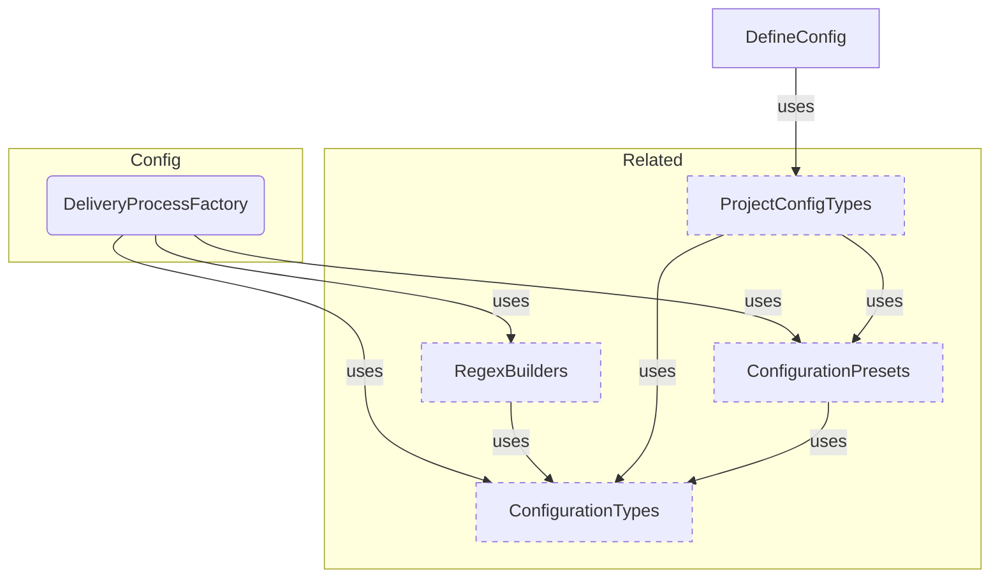
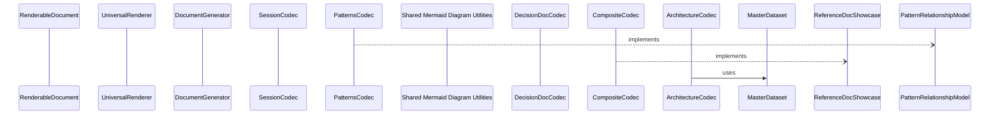

# Reference Generation Sample

**Purpose:** Reference document: Reference Generation Sample
**Detail Level:** Full reference

---

## Configuration Components

Scoped architecture diagram showing component relationships:



---

## Renderer Pipeline

Scoped architecture diagram showing component relationships:



---

## API Types

### normalizeStatus (function)

/**
 * Normalize any status string to a display bucket
 *
 * Maps status values to three canonical display states:
 * - "completed": completed
 * - "active": active
 * - "planned": roadmap, deferred, planned, or any unknown value
 *
 * Per PDR-005: deferred items are treated as planned (not actively worked on)
 *
 * @libar-docs-shape reference-sample
 * @param status - Raw status from pattern (case-insensitive)
 * @returns "completed" | "active" | "planned"
 *
 * @example
 * ```typescript
 * normalizeStatus("completed")   // → "completed"
 * normalizeStatus("active")      // → "active"
 * normalizeStatus("roadmap")     // → "planned"
 * normalizeStatus("deferred")    // → "planned"
 * normalizeStatus(undefined)     // → "planned"
 * ```
 */

```typescript
function normalizeStatus(status: string | undefined): NormalizedStatus;
```

| Parameter | Type | Description |
| --- | --- | --- |
| status |  | Raw status from pattern (case-insensitive) |

**Returns:** "completed" | "active" | "planned"

### DELIVERABLE_STATUS_VALUES (const)

/**
 * Canonical deliverable status values
 *
 * These are the ONLY accepted values for the Status column in
 * Gherkin Background deliverable tables. Values are lowercased
 * at extraction time before schema validation.
 *
 * - complete: Work is done
 * - in-progress: Work is ongoing
 * - pending: Work hasn't started
 * - deferred: Work postponed
 * - superseded: Replaced by another deliverable
 * - n/a: Not applicable
 *
 * @libar-docs-shape reference-sample
 */

```typescript
DELIVERABLE_STATUS_VALUES = [
  'complete',
  'in-progress',
  'pending',
  'deferred',
  'superseded',
  'n/a',
] as const
```

### CategoryDefinition (interface)

/** @libar-docs-shape reference-sample */

```typescript
interface CategoryDefinition {
  /** Category tag name without prefix (e.g., "core", "api", "ddd", "saga") */
  readonly tag: string;
  /** Human-readable domain name for display (e.g., "Strategic DDD", "Event Sourcing") */
  readonly domain: string;
  /** Display order priority - lower values appear first in sorted output */
  readonly priority: number;
  /** Brief description of the category's purpose and typical patterns */
  readonly description: string;
  /** Alternative tag names that map to this category (e.g., "es" for "event-sourcing") */
  readonly aliases: readonly string[];
}
```

| Property | Description |
| --- | --- |
| tag | Category tag name without prefix (e.g., "core", "api", "ddd", "saga") |
| domain | Human-readable domain name for display (e.g., "Strategic DDD", "Event Sourcing") |
| priority | Display order priority - lower values appear first in sorted output |
| description | Brief description of the category's purpose and typical patterns |
| aliases | Alternative tag names that map to this category (e.g., "es" for "event-sourcing") |

### SectionBlock (type)

/** @libar-docs-shape reference-sample */

```typescript
type SectionBlock =
  | HeadingBlock
  | ParagraphBlock
  | SeparatorBlock
  | TableBlock
  | ListBlock
  | CodeBlock
  | MermaidBlock
  | CollapsibleBlock
  | LinkOutBlock;
```

---

## Behavior Specifications

### PipelineModule

[View PipelineModule source](src/generators/pipeline/index.ts)

## Pipeline Module - Unified Transformation Infrastructure

Barrel export for the unified transformation pipeline components.
This module provides single-pass pattern transformation.

### When to Use

- When transforming extracted patterns into a MasterDataset
- When building custom generation pipelines
- When accessing pre-computed indexes and views from the dataset

NOTE: Report codecs have been replaced by RDM codecs in src/renderable/codecs/

---
