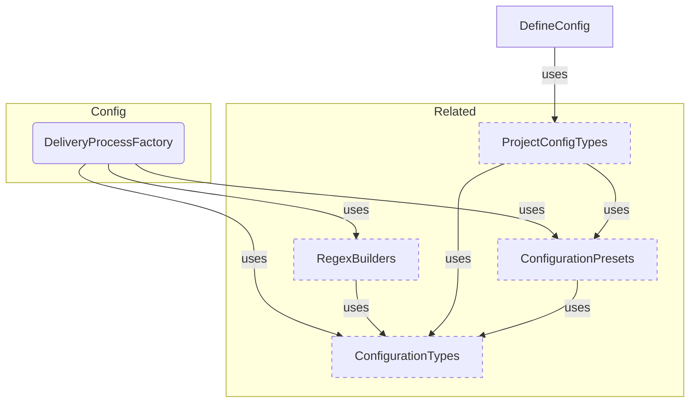

# Reference Generation Sample

**Purpose:** Reference document: Reference Generation Sample
**Detail Level:** Full reference

---

## Configuration Components

Scoped architecture diagram showing component relationships:



---

## API Types

### RISK_LEVELS (const)

/**
 * @libar-docs
 * @libar-docs-pattern RiskLevels
 * @libar-docs-status completed
 * @libar-docs-core
 * @libar-docs-extract-shapes RISK_LEVELS, RiskLevel
 *
 * ## Risk Levels for Planning and Assessment
 *
 * Three-tier risk classification for roadmap planning.
 */

```typescript
RISK_LEVELS = ['low', 'medium', 'high'] as const
```

### RiskLevel (type)

/**
 * @libar-docs
 * @libar-docs-pattern RiskLevels
 * @libar-docs-status completed
 * @libar-docs-core
 * @libar-docs-extract-shapes RISK_LEVELS, RiskLevel
 *
 * ## Risk Levels for Planning and Assessment
 *
 * Three-tier risk classification for roadmap planning.
 */

```typescript
type RiskLevel = (typeof RISK_LEVELS)[number];
```

---

## Behavior Specifications

### PipelineModule

## Pipeline Module - Unified Transformation Infrastructure

Barrel export for the unified transformation pipeline components.
This module provides single-pass pattern transformation.

### When to Use

- When transforming extracted patterns into a MasterDataset
- When building custom generation pipelines
- When accessing pre-computed indexes and views from the dataset

NOTE: Report codecs have been replaced by RDM codecs in src/renderable/codecs/

---
