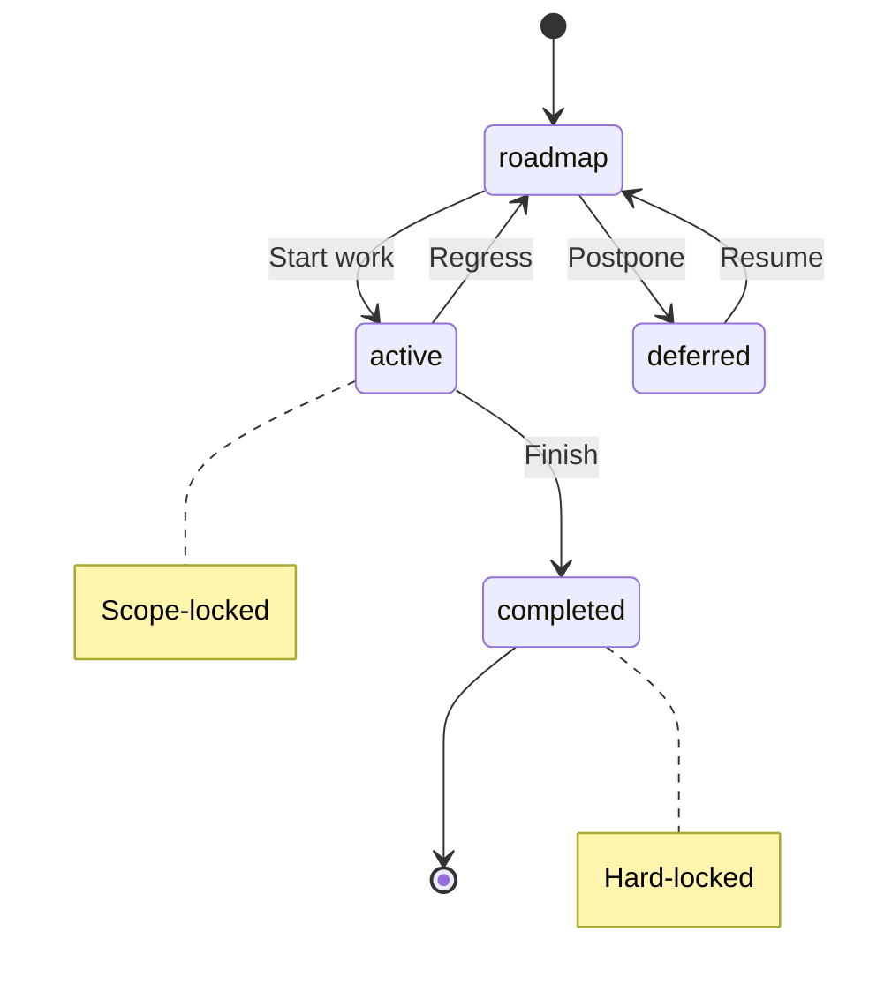

# TaxonomyReference

**Purpose:** Full documentation generated from decision document
**Detail Level:** detailed

---

**Problem:**
  The taxonomy defines the vocabulary for pattern annotations: what tags exist,
  their valid values, and how they are parsed. Developers need quick access to
  format types, categories, status values, and presets. Maintaining this
  documentation manually leads to drift from actual implementation.

  **Solution:**
  Auto-generate the Taxonomy reference documentation from annotated source code.
  The TypeScript source files in src/taxonomy/ define all taxonomy components.
  Documentation becomes a projection of the implementation, always in sync.

  **Target Documents:**

| Output | Purpose | Detail Level |
| docs-generated/docs/TAXONOMYREFERENCE.md | Detailed human reference | detailed |
| docs-generated/_claude-md/taxonomy/taxonomyreference.md | Compact AI context | summary |

  **Source Mapping:**

| Section | Source File | Extraction Method |
| --- | --- | --- |
| Concept | THIS DECISION (Rule: Concept) | Rule block content |
| Format Types | src/taxonomy/format-types.ts | extract-shapes tag |
| Categories | src/taxonomy/categories.ts | extract-shapes tag |
| Status Values | src/taxonomy/status-values.ts | extract-shapes tag |
| Status Values | THIS DECISION (Rule: Status Values) | Rule block + Mermaid diagram |
| Normalized Status | src/taxonomy/normalized-status.ts | extract-shapes tag |
| Normalized Status | THIS DECISION (Rule: Normalized Status) | Rule block content |
| Hierarchy Levels | src/taxonomy/hierarchy-levels.ts | extract-shapes tag |
| Risk Levels | src/taxonomy/risk-levels.ts | extract-shapes tag |
| Layer Types | src/taxonomy/layer-types.ts | extract-shapes tag |
| TagRegistry | src/taxonomy/registry-builder.ts | extract-shapes tag |
| Presets | THIS DECISION (Rule: Presets) | Rule block table |
| Architecture | THIS DECISION (Rule: Architecture) | Fenced code block |
| Tag Generation | THIS DECISION (Rule: Tag Generation) | Rule block content |

---

## Implementation Details

### Concept

**Context:** A taxonomy is a classification system for organizing knowledge.

    **Definition:** In delivery-process, the taxonomy defines the vocabulary for
    pattern annotations. It determines what tags exist, their valid values, and
    how they are parsed from source code.

    **Components:**

| Component | Purpose | Source File |
| --- | --- | --- |
| Categories | Domain classifications (e.g., core, api, ddd) | categories.ts |
| Status Values | FSM states (roadmap, active, completed, deferred) | status-values.ts |
| Format Types | How tag values are parsed (flag, csv, enum) | format-types.ts |
| Hierarchy Levels | Work item levels (epic, phase, task) | hierarchy-levels.ts |
| Risk Levels | Risk assessment (low, medium, high) | risk-levels.ts |
| Layer Types | Feature layer (timeline, domain, integration) | layer-types.ts |

    **Key Principle:** The taxonomy is NOT a fixed schema. Presets select
    different subsets, and you can define custom categories.

### Format Types

```typescript
/**
 * @libar-docs
 * @libar-docs-pattern FormatTypes
 * @libar-docs-status completed
 * @libar-docs-core
 * @libar-docs-extract-shapes FORMAT_TYPES, FormatType
 *
 * ## Tag Value Format Types
 *
 * Defines how tag values are parsed and validated.
 * Each format type determines the parsing strategy for tag values.
 */
FORMAT_TYPES = [
  'value', // Simple string value
  'enum', // Constrained to predefined values
  'quoted-value', // String in quotes (preserves spaces)
  'csv', // Comma-separated values
  'number', // Numeric value
  'flag', // Boolean presence (no value needed)
] as const
```

```typescript
type FormatType = (typeof FORMAT_TYPES)[number];
```

### Categories

```typescript
/**
 * @libar-docs
 * @libar-docs-pattern CategoryDefinitions
 * @libar-docs-status completed
 * @libar-docs-core
 * @libar-docs-arch-role read-model
 * @libar-docs-arch-context taxonomy
 * @libar-docs-arch-layer domain
 * @libar-docs-extract-shapes CategoryDefinition, CATEGORIES, CategoryTag, CATEGORY_TAGS
 *
 * ## Category Definitions
 *
 * Categories are used to classify patterns and organize documentation.
 * Priority determines display order (lower = higher priority).
 * The ddd-es-cqrs preset includes all 21 categories; simpler presets use subsets.
 */
interface CategoryDefinition {
  /** Category tag name without prefix (e.g., "core", "api", "ddd", "saga") */
  readonly tag: string;
  /** Human-readable domain name for display (e.g., "Strategic DDD", "Event Sourcing") */
  readonly domain: string;
  /** Display order priority - lower values appear first in sorted output */
  readonly priority: number;
  /** Brief description of the category's purpose and typical patterns */
  readonly description: string;
  /** Alternative tag names that map to this category (e.g., "es" for "event-sourcing") */
  readonly aliases: readonly string[];
}
```

| Property | Description |
| --- | --- |
| `tag` | Category tag name without prefix (e.g., "core", "api", "ddd", "saga") |
| `domain` | Human-readable domain name for display (e.g., "Strategic DDD", "Event Sourcing") |
| `priority` | Display order priority - lower values appear first in sorted output |
| `description` | Brief description of the category's purpose and typical patterns |
| `aliases` | Alternative tag names that map to this category (e.g., "es" for "event-sourcing") |

```typescript
/**
 * All category definitions for the monorepo
 */
const CATEGORIES: readonly CategoryDefinition[];
```

```typescript
/**
 * Category tags as a union type
 */
type CategoryTag = (typeof CATEGORIES)[number]['tag'];
```

```typescript
/**
 * Extract all category tags as an array
 */
CATEGORY_TAGS = CATEGORIES.map((c) => c.tag) as readonly CategoryTag[]
```

### Status Values (from status-values)

```typescript
/**
 * @libar-docs
 * @libar-docs-pattern StatusValues
 * @libar-docs-status completed
 * @libar-docs-core
 * @libar-docs-extract-shapes PROCESS_STATUS_VALUES, ProcessStatusValue, ACCEPTED_STATUS_VALUES, AcceptedStatusValue, DEFAULT_STATUS, VALID_PROCESS_STATUS_SET
 *
 * ## Process Workflow Status Values
 *
 * THE single source of truth for FSM state values in the monorepo (per PDR-005 FSM).
 *
 * FSM transitions:
 * - roadmap to active (start work)
 * - roadmap to deferred (pause before start)
 * - deferred to roadmap (resume planning)
 * - active to completed (finish work)
 * - active to deferred (pause work)
 * - deferred to active (resume work)
 * - active cannot regress to roadmap
 */
PROCESS_STATUS_VALUES = [
  'roadmap', // Planned work, fully editable
  'active', // In progress, scope-locked
  'completed', // Done, hard-locked
  'deferred', // On hold, fully editable
] as const
```

```typescript
type ProcessStatusValue = (typeof PROCESS_STATUS_VALUES)[number];
```

```typescript
/**
 * Extended status values accepted for extraction and validation
 *
 * FSM states that can be used in annotations.
 * Use only these canonical values: roadmap, active, completed, deferred.
 */
ACCEPTED_STATUS_VALUES = [...PROCESS_STATUS_VALUES] as const
```

```typescript
/**
 * Extended status values accepted for extraction and validation
 *
 * FSM states that can be used in annotations.
 * Use only these canonical values: roadmap, active, completed, deferred.
 */
type AcceptedStatusValue = (typeof ACCEPTED_STATUS_VALUES)[number];
```

```typescript
/**
 * Default status for new items
 */
const DEFAULT_STATUS: ProcessStatusValue;
```

```typescript
/**
 * Pre-built set of valid process statuses for O(1) membership checks.
 */
const VALID_PROCESS_STATUS_SET: ReadonlySet<string>;
```

### Status Values (from this decision (rule: status values))

**Context:** Status values control the FSM workflow for pattern lifecycle.

    **Decision:** Four canonical status values are defined (per PDR-005).
    See `src/taxonomy/status-values.ts` for the `PROCESS_STATUS_VALUES` array
    with inline documentation on FSM transitions and protection levels.

    **Status Values Reference:**

| Status | Protection Level | Description | Editable |
| --- | --- | --- | --- |
| roadmap | None | Planned work, not yet started | Full editing |
| active | Scope-locked | Work in progress | Edit existing only |
| completed | Hard-locked | Work finished | Requires unlock tag |
| deferred | None | On hold, may resume later | Full editing |

    **Valid FSM Transitions:**

| From | To | Trigger |
| --- | --- | --- |
| roadmap | active | Start work |
| roadmap | deferred | Postpone before start |
| active | completed | Finish work |
| active | roadmap | Regress (blocked) |
| deferred | roadmap | Resume planning |

    **FSM Diagram:**



### Normalized Status (from normalized-status)

```typescript
/**
 * Normalized status values for display
 *
 * Maps raw FSM states to three presentation buckets:
 * - completed: Work is done
 * - active: Work in progress
 * - planned: Future work (includes roadmap and deferred)
 */
NORMALIZED_STATUS_VALUES = ['completed', 'active', 'planned'] as const
```

```typescript
/**
 * Normalized status values for display
 *
 * Maps raw FSM states to three presentation buckets:
 * - completed: Work is done
 * - active: Work in progress
 * - planned: Future work (includes roadmap and deferred)
 */
type NormalizedStatus = (typeof NORMALIZED_STATUS_VALUES)[number];
```

```typescript
/**
 * Maps raw status values → normalized display status
 *
 * Includes both:
 * Canonical taxonomy values (per PDR-005 FSM)
 */
const STATUS_NORMALIZATION_MAP: Readonly<Record<string, NormalizedStatus>>;
```

```typescript
/**
 * Normalize any status string to a display bucket
 *
 * Maps status values to three canonical display states:
 * - "completed": completed
 * - "active": active
 * - "planned": roadmap, deferred, planned, or any unknown value
 *
 * Per PDR-005: deferred items are treated as planned (not actively worked on)
 *
 * @param status - Raw status from pattern (case-insensitive)
 * @returns "completed" | "active" | "planned"
 *
 * @example
 * ```typescript
 * normalizeStatus("completed")   // → "completed"
 * normalizeStatus("active")      // → "active"
 * normalizeStatus("roadmap")     // → "planned"
 * normalizeStatus("deferred")    // → "planned"
 * normalizeStatus(undefined)     // → "planned"
 * ```
 */
function normalizeStatus(status: string | undefined): NormalizedStatus;
```

### Normalized Status (from this decision (rule: normalized status))

**Context:** Display requires mapping 4 FSM states to 3 presentation buckets.

    **Decision:** Raw status values normalize to display status.
    See `src/taxonomy/normalized-status.ts` for the `STATUS_NORMALIZATION_MAP`
    and `normalizeStatus()` function with complete mapping logic.

    **Rationale:** This separation follows DDD principles - the domain model
    (raw FSM states) is distinct from the view model (normalized display).

### Hierarchy Levels

```typescript
/**
 * @libar-docs
 * @libar-docs-pattern HierarchyLevels
 * @libar-docs-status completed
 * @libar-docs-core
 * @libar-docs-extract-shapes HIERARCHY_LEVELS, HierarchyLevel, DEFAULT_HIERARCHY_LEVEL
 *
 * ## Hierarchy Levels for Work Item Breakdown
 *
 * Three-level hierarchy for organizing work:
 * - epic: Multi-quarter strategic initiatives
 * - phase: Standard work units (2-5 days)
 * - task: Fine-grained session-level work (1-4 hours)
 */
HIERARCHY_LEVELS = ['epic', 'phase', 'task'] as const
```

```typescript
/**
 * @libar-docs
 * @libar-docs-pattern HierarchyLevels
 * @libar-docs-status completed
 * @libar-docs-core
 * @libar-docs-extract-shapes HIERARCHY_LEVELS, HierarchyLevel, DEFAULT_HIERARCHY_LEVEL
 *
 * ## Hierarchy Levels for Work Item Breakdown
 *
 * Three-level hierarchy for organizing work:
 * - epic: Multi-quarter strategic initiatives
 * - phase: Standard work units (2-5 days)
 * - task: Fine-grained session-level work (1-4 hours)
 */
type HierarchyLevel = (typeof HIERARCHY_LEVELS)[number];
```

```typescript
/**
 * Default hierarchy level (for backward compatibility)
 */
const DEFAULT_HIERARCHY_LEVEL: HierarchyLevel;
```

### Risk Levels

```typescript
/**
 * @libar-docs
 * @libar-docs-pattern RiskLevels
 * @libar-docs-status completed
 * @libar-docs-core
 * @libar-docs-extract-shapes RISK_LEVELS, RiskLevel
 *
 * ## Risk Levels for Planning and Assessment
 *
 * Three-tier risk classification for roadmap planning.
 */
RISK_LEVELS = ['low', 'medium', 'high'] as const
```

```typescript
/**
 * @libar-docs
 * @libar-docs-pattern RiskLevels
 * @libar-docs-status completed
 * @libar-docs-core
 * @libar-docs-extract-shapes RISK_LEVELS, RiskLevel
 *
 * ## Risk Levels for Planning and Assessment
 *
 * Three-tier risk classification for roadmap planning.
 */
type RiskLevel = (typeof RISK_LEVELS)[number];
```

### Layer Types

```typescript
/**
 * @libar-docs
 * @libar-docs-pattern LayerTypes
 * @libar-docs-status completed
 * @libar-docs-core
 * @libar-docs-extract-shapes LAYER_TYPES, LayerType
 *
 * ## Feature Layer Types for Test Organization
 *
 * Inferred from feature file directory paths:
 * - timeline: Process/workflow features (delivery-process)
 * - domain: Business domain features
 * - integration: Cross-system integration tests
 * - e2e: End-to-end user journey tests
 * - component: Unit/component level tests
 * - unknown: Cannot determine layer from path
 */
LAYER_TYPES = [
  'timeline',
  'domain',
  'integration',
  'e2e',
  'component',
  'unknown',
] as const
```

```typescript
type LayerType = (typeof LAYER_TYPES)[number];
```

### TagRegistry

```typescript
/**
 * TagRegistry interface (matches schema from validation-schemas/tag-registry.ts)
 */
interface TagRegistry {
  /** Schema version for forward/backward compatibility checking */
  version: string;
  /** Category definitions for classifying patterns by domain (e.g., core, api, ddd) */
  categories: readonly CategoryDefinitionForRegistry[];
  /** Metadata tag definitions with format, purpose, and validation rules */
  metadataTags: readonly MetadataTagDefinitionForRegistry[];
  /** Aggregation tag definitions for document-level grouping */
  aggregationTags: readonly AggregationTagDefinitionForRegistry[];
  /** Available format options for documentation output */
  formatOptions: readonly string[];
  /** Prefix for all tags (e.g., "@libar-docs-") */
  tagPrefix: string;
  /** File-level opt-in marker tag (e.g., "@libar-docs") */
  fileOptInTag: string;
}
```

| Property | Description |
| --- | --- |
| `version` | Schema version for forward/backward compatibility checking |
| `categories` | Category definitions for classifying patterns by domain (e.g., core, api, ddd) |
| `metadataTags` | Metadata tag definitions with format, purpose, and validation rules |
| `aggregationTags` | Aggregation tag definitions for document-level grouping |
| `formatOptions` | Available format options for documentation output |
| `tagPrefix` | Prefix for all tags (e.g., "@libar-docs-") |
| `fileOptInTag` | File-level opt-in marker tag (e.g., "@libar-docs") |

```typescript
interface MetadataTagDefinitionForRegistry {
  /** Tag name without prefix (e.g., "pattern", "status", "phase") */
  tag: string;
  /** Value format type determining parsing rules (flag, value, enum, csv, number, quoted-value) */
  format: FormatType;
  /** Human-readable description of the tag's purpose and usage */
  purpose: string;
  /** Whether this tag must be present for valid patterns */
  required?: boolean;
  /** Whether this tag can appear multiple times on a single pattern */
  repeatable?: boolean;
  /** Valid values for enum-type tags (undefined for non-enum formats) */
  values?: readonly string[];
  /** Default value applied when tag is not specified */
  default?: string;
  /** Example usage showing tag syntax (e.g., "@libar-docs-pattern MyPattern") */
  example?: string;
}
```

| Property | Description |
| --- | --- |
| `tag` | Tag name without prefix (e.g., "pattern", "status", "phase") |
| `format` | Value format type determining parsing rules (flag, value, enum, csv, number, quoted-value) |
| `purpose` | Human-readable description of the tag's purpose and usage |
| `required` | Whether this tag must be present for valid patterns |
| `repeatable` | Whether this tag can appear multiple times on a single pattern |
| `values` | Valid values for enum-type tags (undefined for non-enum formats) |
| `default` | Default value applied when tag is not specified |
| `example` | Example usage showing tag syntax (e.g., "@libar-docs-pattern MyPattern") |

```typescript
type TagDefinition = MetadataTagDefinitionForRegistry;
```

```typescript
/**
 * Build the complete tag registry from TypeScript constants
 *
 * This is THE single source of truth for the taxonomy.
 * All consumers should use this function instead of loading JSON.
 */
function buildRegistry(): TagRegistry;
```

```typescript
/**
 * Metadata tags organized by functional group.
 * Used for documentation generation to create organized sections.
 *
 * Groups:
 * - core: Essential pattern identification (pattern, status, core, usecase, brief)
 * - relationship: Pattern dependencies and connections
 * - process: Timeline and assignment tracking
 * - prd: Product requirements documentation
 * - adr: Architecture decision records
 * - hierarchy: Epic/phase/task breakdown
 * - traceability: Two-tier spec architecture links
 * - architecture: Diagram generation tags
 * - extraction: Documentation extraction control
 * - stub: Design session stub metadata
 */
METADATA_TAGS_BY_GROUP = {
  core: ['pattern', 'status', 'core', 'usecase', 'brief'] as const,
  relationship: [
    'uses',
    'used-by',
    'implements',
    'extends',
    'depends-on',
    'enables',
    'see-also',
    'api-ref',
  ] as const,
  process: [
    'phase',
    'release',
    'quarter',
    'completed',
    'effort',
    'effort-actual',
    'team',
    'workflow',
    'risk',
    'priority',
  ] as const,
  prd: ['product-area', 'user-role', 'business-value', 'constraint'] as const,
  adr: [
    'adr',
    'adr-status',
    'adr-category',
    'adr-supersedes',
    'adr-superseded-by',
    'adr-theme',
    'adr-layer',
  ] as const,
  hierarchy: ['level', 'parent'] as const,
  traceability: ['executable-specs', 'roadmap-spec'] as const,
  architecture: ['arch-role', 'arch-context', 'arch-layer'] as const,
  extraction: ['extract-shapes'] as const,
  stub: ['target', 'since'] as const,
} as const
```

### Presets

**Context:** Different projects need different taxonomy subsets.

    **Decision:** Three presets are available:

| Preset | Categories | Tag Prefix | Use Case |
| --- | --- | --- | --- |
| libar-generic (default) | 3 | @libar-docs- | Simple projects (this package) |
| ddd-es-cqrs | 21 | @libar-docs- | DDD/Event Sourcing architectures |
| generic | 3 | @docs- | Simple projects with @docs- prefix |

    **Behavior:** The preset determines which categories are available.
    All presets share the same status values and format types.

### Architecture

**Context:** The taxonomy module structure supports the type-safe annotation system.

    **File Structure:**

```text
src/taxonomy/
      registry-builder.ts   -- buildRegistry() - creates TagRegistry
      categories.ts         -- Category definitions
      status-values.ts      -- FSM state values (PDR-005)
      normalized-status.ts  -- Display normalization (3 buckets)
      format-types.ts       -- Tag value parsing rules
      hierarchy-levels.ts   -- epic/phase/task
      risk-levels.ts        -- low/medium/high
      layer-types.ts        -- timeline/domain/integration/e2e
```

**TagRegistry:** The buildRegistry() function creates a TagRegistry
    containing all taxonomy definitions. It is THE single source of truth.

    **Usage Example:**

```typescript
import { buildRegistry } from '@libar-dev/delivery-process/taxonomy';

    const registry = buildRegistry();
    // registry.tagPrefix       -> "@libar-docs-"
    // registry.fileOptInTag    -> "@libar-docs"
    // registry.categories      -> CategoryDefinition[]
    // registry.metadataTags    -> MetadataTagDefinitionForRegistry[]
```

### Tag Generation

**Context:** Developers need a reference of all available tags.

    **Decision:** The generate-tag-taxonomy CLI creates a markdown reference:

```bash
npx generate-tag-taxonomy -o TAG_TAXONOMY.md -f
```

**Output:** A markdown file documenting all tags with their formats,
    valid values, and examples - generated from the TagRegistry.

## Complete Category Reference

**Context:** The ddd-es-cqrs preset includes all 21 categories. Simpler
    presets use subsets (core, api, generator for libar-generic).

    **All Categories:**

| Tag | Domain | Priority | Description | Aliases |
| --- | --- | --- | --- | --- |
| domain | Strategic DDD | 1 | Bounded contexts, aggregates, strategic design | - |
| ddd | Domain-Driven Design | 2 | DDD tactical patterns | - |
| bounded-context | Bounded Context | 3 | BC contracts and definitions | - |
| event-sourcing | Event Sourcing | 4 | Event store, aggregates, replay | es |
| decider | Decider | 5 | Decider pattern | - |
| fsm | FSM | 5 | Finite state machine patterns | - |
| cqrs | CQRS | 5 | Command/query separation | - |
| projection | Projection | 6 | Read models, checkpoints | - |
| saga | Saga | 7 | Cross-context coordination, process managers | process-manager |
| command | Command | 8 | Command handlers, orchestration | - |
| arch | Architecture | 9 | Architecture patterns, decisions | - |
| infra | Infrastructure | 10 | Infrastructure, composition root | infrastructure |
| validation | Validation | 11 | Input validation, schemas | - |
| testing | Testing | 12 | Test patterns, BDD | - |
| performance | Performance | 13 | Optimization, caching | - |
| security | Security | 14 | Auth, authorization | - |
| core | Core | 15 | Core utilities | - |
| api | API | 16 | Public APIs | - |
| generator | Generator | 17 | Code generators | - |
| middleware | Middleware | 18 | Middleware patterns | - |
| correlation | Correlation | 19 | Correlation tracking | - |

    **Category Selection Guide:**

| Project Type | Recommended Preset | Categories Available |
| --- | --- | --- |
| Simple utility packages | libar-generic | core, api, generator |
| DDD/Event Sourcing systems | ddd-es-cqrs | All 21 categories |
| Generic projects | generic | core, api, generator |

    **Usage:** Add category tags to patterns using the tag prefix:

```typescript
// For libar-generic preset
    // @libar-docs-core      - marks as core utility
    // @libar-docs-api       - marks as public API
    // @libar-docs-generator - marks as code generator
```
