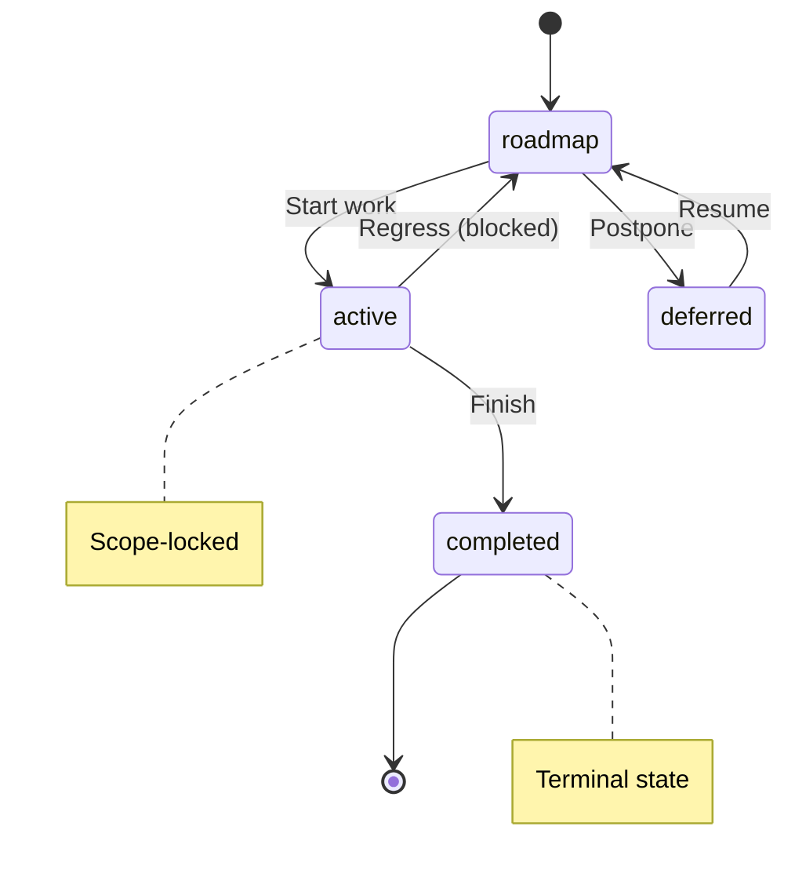
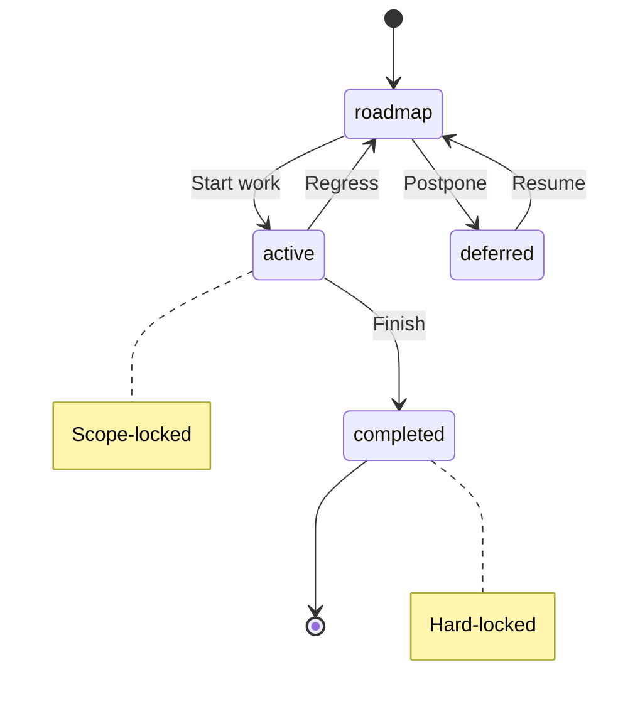

# Taxonomy Reference

**Purpose:** Reference document: Taxonomy Reference
**Detail Level:** Full reference

---

## Context - Package needs its own delivery process configuration

The `@libar-dev/delivery-process` package generates documentation for other
    projects but also needs to document its own development. Without a defined
    process, the package's roadmap and releases would be undocumented.

---

## Decision - Dog-food the delivery process for self-documentation

The package uses its own tooling for documentation:

    **Key Commands:**
    - `pnpm docs:all` - Generate all documentation
    - `pnpm validate:all` - Validate patterns, DoD, and anti-patterns
    - `pnpm docs:tag-taxonomy` - Generate TAG_TAXONOMY.md

| Artifact | Location | Generator |
| --- | --- | --- |
| Roadmap specs | `delivery-process/specs/` | roadmap |
| Releases | `delivery-process/releases/` | changelog |
| Decisions | `delivery-process/decisions/` | doc-from-decision |
| Reference docs | convention-tagged decisions | reference codec |
| Generated docs | `docs-generated/` | all |

---

## Decision - Relationship tags in use (libar-generic preset)

The following relationship tags from PatternRelationshipModel are effective in this repo:

    **Currently Used:**

    **Available but not yet used:**

    **Note:** Full relationship taxonomy documented in `delivery-process/specs/pattern-relationship-model.feature`

| Tag | Purpose | Example |
| --- | --- | --- |
| `implements` | Behavior test → Tier 1 spec traceability | `@libar-docs-implements:ProcessGuardLinter` |
| `uses` | Technical dependency (code→code) | `@libar-docs-uses:ConfigLoader,TagRegistry` |
| `used-by` | Reverse dependency annotation | `@libar-docs-used-by:CLI` |
| `executable-specs` | Tier 1 → behavior test location | `@libar-docs-executable-specs:tests/features/validation` |
| `release` | Version association | `@libar-docs-release:v1.0.0` |
| `arch-role` | Component type for architecture diagrams | `@libar-docs-arch-role:infrastructure` |
| `arch-context` | Bounded context grouping | `@libar-docs-arch-context:scanner` |
| `arch-layer` | Layer for layered diagrams | `@libar-docs-arch-layer:application` |

| Tag | Future Use Case |
| --- | --- |
| `extends` | Pattern inheritance (e.g., specialized codecs) |
| `depends-on` | Roadmap sequencing between tier 1 specs |
| `enables` | Inverse of depends-on |
| `roadmap-spec` | Back-link from behavior to tier 1 spec |
| `parent`/`level` | Epic→phase→task breakdown |

---

## Decision - Relationship requirements by workflow

Different workflows require different relationship annotations:

    **Planning Session:** Create roadmap spec with `status:roadmap`, `phase` number. Add `depends-on`
    to declare sequencing constraints. Optional `priority`, `effort`, `quarter` for timeline planning.

    **Design Session:** Source code stubs use `uses` for runtime dependencies. Architecture tags
    (`arch-role`, `arch-context`, `arch-layer`) recommended for files appearing in architecture diagrams.
    Use `extends` for pattern inheritance hierarchies.

    **Implementation Session:** Behavior tests MUST have `@libar-docs-implements:PatternName` linking
    to the tier 1 spec they validate. Source code should have `uses`/`used-by` for dependency graphs.

| Workflow | Required | Recommended | Optional |
| --- | --- | --- | --- |
| **Planning** | `status`, `phase` | `depends-on`, `enables` | `priority`, `effort`, `quarter` |
| **Design** | `status`, `uses` | `arch-*` tags, `extends` | `see-also` |
| **Implementation** | `implements` (behavior tests) | `uses`, `used-by` | `api-ref` |

---

## Decision - Executable specs linkage patterns

Behavior tests in `tests/features/` follow two valid patterns:

    **Linked tests** trace to tier 1 specs for:
    - Completeness tracking (DoD validation)
    - Traceability matrix generation
    - Impact analysis

    **Standalone tests** are appropriate when:
    - Testing pure utility functions (no business logic)
    - Testing infrastructure plumbing
    - POC/exploration tests
    - Tests for code patterns without explicit tier 1 specs

    **Note:** Tests that define their OWN `@libar-docs-pattern` tag ARE tier 1 specs themselves
    and should NOT also have `implements` (they are the specification, not an implementation).

| Pattern | When to Use | Tag Required | Example |
| --- | --- | --- | --- |
| **Linked** | Tests validate a tier 1 spec | `@libar-docs-implements:PatternName` | `fsm-validator.feature` → `PhaseStateMachineValidation` |
| **Standalone** | Utility/infrastructure tests | None | `result-monad.feature`, `string-utils.feature` |

---

## Decision - Architecture tags for diagram generation

Architecture diagram generation uses three tags to create Mermaid component diagrams:

    **When to add arch tags:**
    - Core patterns that should appear in architecture overview
    - Entry points and orchestration components
    - Key infrastructure like scanners, extractors, generators

    **When NOT needed:**
    - Internal utility functions
    - Type definition files
    - Test support code

    **Command:** `pnpm docs:architecture` generates `docs-generated/ARCHITECTURE.md`

| Tag | Purpose | Values | Example |
| --- | --- | --- | --- |
| `arch-role` | Component type | `infrastructure`, `service`, `repository`, `handler` | `@libar-docs-arch-role infrastructure` |
| `arch-context` | Bounded context grouping | Free text | `@libar-docs-arch-context scanner` |
| `arch-layer` | Layer for layered diagrams | `domain`, `application`, `infrastructure` | `@libar-docs-arch-layer application` |

---

## Consequences - Benefits and trade-offs

**Benefits:**
    - (+) Validates the tooling works by using it
    - (+) Provides real-world examples for consumers
    - (+) Keeps package roadmap visible and tracked

    **Trade-offs:**
    - (-) Requires maintaining process discipline for a tooling package
    - (-) Generated docs add to package size

---

## Core Thesis

**Context:** Traditional documentation fails because it exists outside the code.
    Developers update code, forget to update docs, and the gap widens until docs become fiction.

    **Decision:** The USDP (Unified Software Delivery Process) inverts this:

    **Principle:** Git is the event store. Documentation artifacts are projections.
    Annotated code is the single source of truth.

| Traditional Approach | USDP Approach |
| --- | --- |
| Docs are written | Docs are generated |
| Status is tracked manually | Status is FSM-enforced |
| Requirements live in Jira | Requirements are Gherkin scenarios |
| AI agents parse stale Markdown | AI agents query typed APIs |

---

## Why Generated Documentation

**Context:** Generated documentation addresses fundamental problems with manual docs.

    **Manual Documentation Problems:**

    **Generated Documentation Benefits:**

    **Cost-Benefit:**

    **When to Use Generated Docs:**

| Problem | Impact |
| --- | --- |
| Docs exist outside code | Developers forget to update them |
| No validation | Stale docs become fiction |
| Duplicate information | Conflicts between sources |
| Status is opinion | No way to verify claims |
| Tribal knowledge | Information locked in heads |

| Benefit | How Achieved |
| --- | --- |
| Always current | Regenerated from source on every build |
| Single source of truth | Annotations in code ARE the docs |
| Machine-verifiable status | FSM enforces valid transitions |
| Typed queries | ProcessStateAPI provides structured access |
| No drift | Impossible for docs to diverge from code |

| Investment | Return |
| --- | --- |
| Initial annotation setup | Elimination of all manual doc maintenance |
| Learning annotation syntax | Consistent documentation across team |
| Running generators | Always-accurate project state |
| FSM compliance | Prevented scope creep and invalid states |

| Use Generated | Keep Manual |
| --- | --- |
| Pattern registry | Conceptual architecture guides |
| Roadmap status | Marketing materials |
| Business rules | Tutorials for external users |
| API reference | High-level overviews |
| Traceability | Changelog summaries |

---

## Event Sourcing Insight

**Context:** Event sourcing teaches us to derive state, not store it.
    Apply this to documentation.

    **Decision:** Documentation follows the event sourcing pattern:

    When you run generate-docs, you are rebuilding read models from the event stream.
    The source annotations are always authoritative.

| Event Sourcing Concept | Documentation Equivalent |
| --- | --- |
| Events | Git commits (changes to annotated code) |
| Projections | Generated docs (PATTERNS.md, ROADMAP.md) |
| Read Model | ProcessStateAPI (typed queries) |

---

## Dogfooding

**Context:** Every pattern in this package uses its own annotation system.

    **Decision:** Real examples from this codebase:

    **ProcessGuardDecider** (pure validation logic):

    

    **PatternScanner** (file discovery):

    

    Run pnpm docs:patterns and these annotations become a searchable pattern registry
    with dependency graphs.

```typescript
/**
     * at-libar-docs
     * at-libar-docs-pattern ProcessGuardDecider
     * at-libar-docs-status completed
     * at-libar-docs-uses FSMTransitions, FSMStates
     * at-libar-docs-used-by LintModule
     */
    export function validateChanges(input: ValidationInput): ValidationOutput { ... }
```

```typescript
/**
     * at-libar-docs
     * at-libar-docs-pattern PatternScanner
     * at-libar-docs-status completed
     * at-libar-docs-uses GherkinASTParser, TypeScriptASTParser
     * at-libar-docs-used-by Orchestrator, DualSourceExtractor
     */
    export async function scanPatterns(config: ScanConfig): Promise<ScannedFile[]> { ... }
```

---

## Four-Stage Workflow

**Context:** The delivery process follows four stages with clear inputs and outputs.

    **Decision:** The four stages are:

| Stage | Input | Output | FSM State |
| --- | --- | --- | --- |
| Ideation | Pattern brief | Roadmap spec (.feature) | roadmap |
| Design | Complex requirement | Decision specs + code stubs | roadmap |
| Planning | Roadmap spec | Implementation plan | roadmap |
| Coding | Implementation plan | Code + tests | roadmap to active to completed |

---

## Skip Conditions

**Invariant:** Stages may only be skipped when conditions below are met.

**Context:** Not all stages are required for every task.

    **Decision:** When to skip stages:

**Rationale:** Prevents accidental omissions while allowing efficiency for simple tasks.

| Skip | When |
| --- | --- |
| Design | Single valid approach, straightforward implementation |
| Planning | Single-session work, clear scope |
| Neither | Multi-session work, architectural decisions |

**Verified by:** @acceptance-criteria Scenario: Package can generate its own documentation

---

## Annotation Ownership

**Context:** Feature files and code stubs serve different purposes.
    Split-Ownership Principle: Feature files own _what_ and _when_ (planning).
    Code stubs own _how_ and _with what_ (implementation). Neither duplicates the other.

    **Decision:** Feature files own planning metadata:

    Code stubs own implementation metadata:

| Tag | Purpose |
| --- | --- |
| at-prefix-status | FSM state (roadmap, active, completed, deferred) |
| at-prefix-phase | Milestone sequencing |
| at-prefix-depends-on | Pattern-level roadmap dependencies |
| at-prefix-enables | What this unblocks |
| at-prefix-release | Version targeting |

| Tag | Purpose |
| --- | --- |
| at-prefix-uses | Technical dependencies (what this calls) |
| at-prefix-used-by | Technical consumers (what calls this) |
| at-prefix-usecase | When/how to use |
| Category flags | Domain classification (core, api, infra, etc.) |

---

## Example Annotation Split

**Context:** Demonstrates the split between feature files and code stubs.

    **Decision:** Feature file (specs/my-pattern.feature):

    

    Code stub (src/event-store/durability.ts):

    

    Note: Code stubs must NOT use at-prefix-pattern. The feature file is the canonical pattern definition.

```gherkin
at-libar-docs
    at-libar-docs-pattern:EventStoreDurability
    at-libar-docs-status:roadmap
    at-libar-docs-phase:18
    at-libar-docs-depends-on:EventStoreFoundation
    at-libar-docs-enables:SagaEngine
    Feature: Event Store Durability
```

```typescript
/**
     * at-libar-docs
     * at-libar-docs-status roadmap
     * at-libar-docs-event-sourcing
     * at-libar-docs-uses EventStoreFoundation, Workpool
     * at-libar-docs-used-by SagaEngine, CommandOrchestrator
     */
```

---

## Two-Tier Spec Architecture

**Context:** Specifications are organized in two tiers for different purposes.

    **Decision:** The two tiers are:

    **Traceability:**
    - Roadmap spec: at-prefix-executable-specs:package/tests/features/behavior/feature
    - Package spec: at-prefix-implements:PatternName

    This separation keeps test output clean (no roadmap noise) while maintaining
    bidirectional traceability.

| Tier | Location | Purpose | Executable |
| --- | --- | --- | --- |
| Roadmap | specs/area/ | Planning, deliverables, acceptance criteria | No |
| Package | pkg/tests/features/ | Implementation proof, regression testing | Yes |

---

## Code Stub Levels

**Context:** Code is the source of truth. Feature files reference code, not duplicate it.

    **Decision:** Code stubs come in three levels:

    **Minimal Stub Example:**

| Level | Contains | When |
| --- | --- | --- |
| Minimal | JSDoc annotations only | Quick exploration |
| Interface | Types + stub functions | API contracts |
| Partial | Working code + some stubs | Progressive implementation |

```typescript
/**
     * at-libar-docs
     * at-libar-docs-status roadmap
     *
     * Reservation Pattern - TTL-Based Pre-Creation Uniqueness
     */
    export function reserve(ctx: MutationCtx, args: ReserveArgs): Promise<ReservationResult> {
      throw new Error('Not yet implemented - roadmap pattern');
    }
```

---

## Planning Stubs Architecture

**Context:** Step definitions created during Planning sessions need a separate location
    excluded from test execution.

    **Decision:** Directory structure:

    

    Phase progression:

    This avoids .skip() (forbidden by test safety policy) while preserving planning artifacts.

| Phase | Location | Status |
| --- | --- | --- |
| Planning | planning-stubs/ | throw new Error("Not implemented") |
| Implementation | Move to steps/ | Replace with real logic |
| Completed | steps/ | Fully executable |

```text
tests/
      steps/              Planning executable (included in test runner)
      planning-stubs/     Not yet implemented (excluded)
      features/           Feature files
```

---

## Pattern Extraction Workflow

**Context:** Understanding how patterns flow from source to docs.

    **Extraction Pipeline:**

    **What Gets Extracted:**

    **Annotation Syntax:**

    **MasterDataset Structure:**

    The MasterDataset is the central data structure with pre-computed views:
    - byName: O(1) pattern lookup by name
    - byCategory: Patterns grouped by category
    - byStatus: Patterns grouped by FSM status
    - bySource: Patterns grouped by file type (typescript, gherkin)
    - dependencies: Computed dependency graph
    - metrics: Aggregate statistics

| Stage | Input | Output | Module |
| --- | --- | --- | --- |
| 1. Scan | File patterns | File list | src/scanner/ |
| 2. Parse | Files | AST nodes | TypeScript/Gherkin parsers |
| 3. Extract | AST nodes | Pattern objects | src/extractor/ |
| 4. Transform | Patterns | MasterDataset | src/generators/pipeline/ |
| 5. Render | MasterDataset | RenderableDocument | src/renderable/ |
| 6. Output | RenderableDocument | Markdown files | Codec system |

| Source | Extracted Data |
| --- | --- |
| TypeScript JSDoc | Pattern name, status, uses, used-by, category flags |
| Feature file tags | Pattern name, status, phase, depends-on, enables |
| Feature description | Problem/Solution content, tables, lists |
| Rule blocks | Business constraints, invariants, rationale |
| Background tables | Deliverables with status |
| Scenarios | Acceptance criteria, test coverage |

| Annotation Type | TypeScript Syntax | Gherkin Syntax |
| --- | --- | --- |
| Opt-in marker | at-libar-docs (JSDoc) | at-libar-docs (feature tag) |
| Pattern name | at-libar-docs-pattern Name | at-libar-docs-pattern:Name |
| Status | at-libar-docs-status active | at-libar-docs-status:active |
| Dependencies | at-libar-docs-uses A, B | at-libar-docs-depends-on:A |
| Category | at-libar-docs-core | at-libar-docs-core |

---

## Related Documentation - Methodology

**Context:** This methodology document connects to other documentation.

    **Decision:** Related documents:

| Document | Purpose |
| --- | --- |
| README.md | Quick start, FSM diagram, ProcessStateAPI usage |
| PROCESS-GUARD.md | FSM validation rules, protection levels, CLI |
| CONFIGURATION.md | Tag prefixes, presets, customization |
| GHERKIN-PATTERNS.md | Writing effective specs |
| INSTRUCTIONS.md | Complete tag reference |
| ARCHITECTURE-REFERENCE.md | Four-stage pipeline details |

---

## Package Metadata

**Context:** Essential package information for orientation.

| Field | Value |
| --- | --- |
| Package | @libar-dev/delivery-process |
| Version | 0.1.0-pre.0 |
| Purpose | Turn TypeScript annotations and Gherkin specs into living docs, architecture graphs, and AI-queryable delivery state |
| Node.js | >=18.0.0 |
| License | MIT |

---

## Quick Start Paths

**Context:** Common tasks with recommended documentation paths.

| Task | Start Here | Then Read |
| --- | --- | --- |
| Set up pre-commit hooks | PROCESS-GUARD.md | CONFIGURATION.md |
| Add annotations to TypeScript | INSTRUCTIONS.md | GHERKIN-PATTERNS.md |
| Run AI-assisted implementation | SESSION-GUIDES.md | PROCESS-GUARD.md |
| Generate documentation | CONFIGURATION.md | ARCHITECTURE.md |
| Validate before PR | VALIDATION.md | PROCESS-GUARD.md |
| Understand the system | METHODOLOGY.md | ARCHITECTURE.md |

---

## Quick Navigation

**Context:** Direct links to documentation by task.

| If you want to... | Read this |
| --- | --- |
| Get started quickly | README.md |
| Configure presets and tags | CONFIGURATION.md |
| Understand the why | METHODOLOGY.md |
| Learn the architecture | ARCHITECTURE.md |
| Run AI coding sessions | SESSION-GUIDES.md |
| Write Gherkin specs | GHERKIN-PATTERNS.md |
| Enforce delivery process rules | PROCESS-GUARD.md |
| Validate annotation quality | VALIDATION.md |
| Look up tag definitions | INSTRUCTIONS.md |
| Understand the taxonomy | TAXONOMY.md |
| Publish to npm | PUBLISHING.md |

---

## Reading Order for New Users

**Context:** Recommended path for developers new to the package.

| Order | Document | Focus |
| --- | --- | --- |
| 1 | README.md | Installation, quick start, ProcessStateAPI overview |
| 2 | CONFIGURATION.md | Presets, tag prefixes, config files |
| 3 | METHODOLOGY.md | Core thesis, dual-source architecture |

---

## Reading Order for Developers

**Context:** Recommended path for developers implementing features.

| Order | Document | Focus |
| --- | --- | --- |
| 4 | ARCHITECTURE.md | Four-stage pipeline, codecs, MasterDataset |
| 5 | SESSION-GUIDES.md | Planning/Design/Implementation workflows |
| 6 | GHERKIN-PATTERNS.md | Writing effective Gherkin specs |
| 7 | INSTRUCTIONS.md | Complete tag and CLI reference |

---

## Reading Order for Team Leads

**Context:** Recommended path for team leads and CI/CD setup.

| Order | Document | Focus |
| --- | --- | --- |
| 8 | PROCESS-GUARD.md | FSM enforcement, pre-commit hooks |
| 9 | VALIDATION.md | Lint rules, DoD checks, anti-patterns |

---

## Document Contents Summary

**Context:** Quick reference to key sections within each document.

    **README.md Key Sections:**

    **ARCHITECTURE.md Key Sections:**

    **SESSION-GUIDES.md Key Sections:**

    **PROCESS-GUARD.md Key Sections:**

| Section Heading | Topics |
| --- | --- |
| The Problem / The Solution | Documentation drift, code as source of truth |
| Built for AI-Assisted Development | ProcessStateAPI typed queries |
| How It Works | Annotation examples, dual-source |
| Quick Start | Install, annotate, generate, lint |
| CLI Commands | Command summary table |
| FSM-Enforced Workflow | State diagram, protection levels |

| Section Heading | Topics |
| --- | --- |
| Executive Summary | What it does, key principles, overview |
| Four-Stage Pipeline | Scanner, Extractor, Transformer, Codec |
| Unified Transformation Architecture | MasterDataset schema, single-pass |
| Codec Architecture | Concepts, block vocabulary, factory |
| Available Codecs | All 16 codecs with options tables |
| Data Flow Diagrams | Pipeline flow, MasterDataset views |

| Section Heading | Topics |
| --- | --- |
| Session Decision Tree | Which session type to use |
| Planning Session | Create roadmap spec, checklist |
| Design Session | When required, checklist, code stubs |
| Implementation Session | Pre-flight, execution, FSM transitions |
| Handoff Documentation | Template, discovery tags |

| Section Heading | Topics |
| --- | --- |
| Quick Reference | Protection levels, transitions, escapes |
| Error Messages and Fixes | Fix with unlock reason, follow FSM path |
| CLI Usage | Modes, options, exit codes |
| Pre-commit Setup | Husky, package.json scripts |

---

## Dual-Source Architecture

**Context:** TypeScript and Gherkin files have distinct ownership domains.

    **Split Ownership Table:**

**Rationale:** Gherkin owns timeline/planning metadata (when/priority). TypeScript owns runtime metadata (dependencies/categories).

| Source | Owns | Example Tags |
| --- | --- | --- |
| Feature files | Planning: status, phase, quarter, effort | status, phase, depends-on |
| TypeScript | Implementation: uses, used-by, category | uses, used-by, core |

---

## Delivery Workflow FSM

**Context:** Status transitions follow a finite state machine for process integrity.

    **FSM Diagram:**

    

    **Key Transitions:**

| From | To | When |
| --- | --- | --- |
| roadmap | active | Starting implementation work |
| active | completed | All deliverables done |
| active | roadmap | Blocked or regressed |
| deferred | roadmap | Ready to resume |



---

## ProcessStateAPI

**Context:** Typed queries for AI agents and tooling integration.

    **Usage Example:**

    

    **Key Methods:**

| Method | Returns |
| --- | --- |
| getCurrentWork() | Patterns with active status |
| getRoadmapItems() | Patterns with roadmap status |
| isValidTransition(from, to) | Boolean for FSM validation |
| getPattern(id) | Single pattern by ID |
| getPatternsByCategory(cat) | Patterns in a category |

```typescript
import { createProcessStateAPI } from '@libar-dev/delivery-process';

    const api = createProcessStateAPI(dataset);

    // Query current work
    api.getCurrentWork();          // What is active now

    // Query planning
    api.getRoadmapItems();         // What can be started

    // Validate transitions
    api.isValidTransition('roadmap', 'active');

    // Pattern lookup
    api.getPattern('TransformDataset');
```

---

## Document Roles

**Context:** Each document serves a specific audience and focus area.

| Document | Audience | Focus |
| --- | --- | --- |
| README.md | Everyone | Quick start, value proposition |
| METHODOLOGY.md | Everyone | Why - core thesis, principles |
| CONFIGURATION.md | Users | Setup - presets, tags, config |
| ARCHITECTURE.md | Developers | How - pipeline, codecs, schemas |
| SESSION-GUIDES.md | AI/Devs | Workflow - day-to-day usage |
| GHERKIN-PATTERNS.md | Writers | Specs - writing effective Gherkin |
| PROCESS-GUARD.md | Team Leads | Governance - enforcement rules |
| VALIDATION.md | CI/CD | Quality - automated checks |
| INSTRUCTIONS.md | Reference | Lookup - tag and CLI reference |
| TAXONOMY.md | Reference | Lookup - tag format definitions |
| PUBLISHING.md | Maintainers | Release - npm publishing |

---

## Quick Tag Reference

**Context:** Most commonly used tags for quick lookup.

    **Essential Tags (required for most patterns):**

    **Relationship Tags:**

    **Process Tags:**

| Tag | Format | Purpose | Example Value |
| --- | --- | --- | --- |
| pattern | value | Pattern identifier | MyPattern |
| status | enum | FSM state | roadmap, active, completed |
| phase | number | Roadmap phase | 15 |
| core | flag | Mark as essential | (no value) |

| Tag | Format | Source | Purpose |
| --- | --- | --- | --- |
| uses | csv | TypeScript | Runtime dependencies |
| used-by | csv | TypeScript | Reverse dependencies |
| depends-on | csv | Gherkin | Planning dependencies |
| enables | csv | Either | What this unlocks |

| Tag | Format | Purpose | Example Value |
| --- | --- | --- | --- |
| quarter | value | Timeline | Q1-2026 |
| effort | value | Estimate | 2d, 4h, 1w |
| team | value | Assignment | platform-team |
| priority | enum | Urgency | critical, high, medium, low |

---

## File-Level Opt-In

**Context:** Files must explicitly opt-in to be scanned for annotations.

    **Decision:** Add the opt-in marker as the first annotation in a JSDoc comment.

    **Important:** Only files with the opt-in marker are scanned. Files without
    the marker are ignored by the scanner even if they contain other annotations.

| Preset | Opt-In Marker | Example |
| --- | --- | --- |
| libar-generic | at-libar-docs | JSDoc comment with at-libar-docs |
| generic | at-docs | JSDoc comment with at-docs |
| ddd-es-cqrs | at-libar-docs | JSDoc comment with at-libar-docs |

---

## Category Tags

**Context:** Category tags classify patterns by domain area.

    The full category list (ddd-es-cqrs preset) is extracted from
    `src/taxonomy/categories.ts`. Each category has: tag, domain, priority, description.

    **Simple Presets (generic, libar-generic):** Only core, api, infra categories.

    **Usage:** Add category tag as a flag (no value needed).

---

## Metadata Tags

**Context:** Metadata tags are extracted from `src/taxonomy/registry-builder.ts`.
    The `METADATA_TAGS_BY_GROUP` constant organizes all tags into functional groups:
    core, relationship, process, prd, adr, hierarchy, traceability, architecture, extraction.

    Each tag definition includes: tag name, format, purpose, and example.

    **Status Values:** roadmap, active, completed, deferred

---

## Format Types

**Context:** Format types define how tag values are parsed.

| Format | Parsing | Example |
| --- | --- | --- |
| flag | Boolean presence (no value) | at-libar-docs-core |
| value | Simple string | at-libar-docs-pattern MyPattern |
| enum | Constrained to predefined list | at-libar-docs-status completed |
| csv | Comma-separated values | at-libar-docs-uses A, B, C |
| number | Numeric value | at-libar-docs-phase 15 |
| quoted-value | Preserves spaces | at-libar-docs-brief:'Multi word' |

---

## Source Ownership

**Context:** Relationship tags have specific ownership rules.

    Relationship tag definitions are extracted from `src/taxonomy/registry-builder.ts`.
    This table defines WHERE each tag type should be used (architectural guidance):

    TypeScript files own runtime dependencies (`uses`).
    Feature files own planning dependencies (`depends-on`).

| Tag | Correct Location | Wrong Location |
| --- | --- | --- |
| uses | TypeScript | Feature files |
| depends-on | Feature files | TypeScript |

---

## Hierarchy Duration

**Context:** Hierarchy tags organize work into epic, phase, task structure.
    Tag definitions (level, parent) are extracted from `src/taxonomy/registry-builder.ts`.
    This table provides planning guidance for duration estimates:

| Level | Duration | Description |
| --- | --- | --- |
| epic | Multi-quarter | Strategic initiatives |
| phase | 2-5 days | Standard work units |
| task | 1-4 hours | Session-level work |

---

## Two-Tier Spec Architecture

**Context:** Traceability tags link roadmap specs to executable specs (PDR-007).
    Tag definitions (executable-specs, roadmap-spec) are in `src/taxonomy/registry-builder.ts`.
    This table explains the two-tier architecture:

| Tier | Location | Purpose |
| --- | --- | --- |
| Tier 1 | delivery-process/specs/ | Roadmap and planning specifications |
| Tier 2 | package/tests/features/ | Executable test specifications |

---

## CLAUDE.md Generation

**Context:** The package generates CLAUDE.md files for AI assistant context.

    **Output Locations:**

    **Section Routing Tag:** Use `claude-md-section` to route patterns to specific
    _claude-md subdirectories. This organizes AI context by domain.

    **Available Sections:**

| Format | Location | Purpose |
| --- | --- | --- |
| Compact | _claude-md/ subdirectories | Minimal AI context (low token cost) |
| Detailed | docs/ directory | Full human-readable documentation |

| Section Value | Output Directory | Content Type |
| --- | --- | --- |
| index | _claude-md/index/ | Navigation and overview |
| reference | _claude-md/reference/ | Tag and CLI reference |
| validation | _claude-md/validation/ | Validation rules and process guard |
| sessions | _claude-md/sessions/ | Session workflow guides |
| architecture | _claude-md/architecture/ | System architecture |
| methodology | _claude-md/methodology/ | Core principles |
| gherkin | _claude-md/gherkin/ | Gherkin writing patterns |
| config | _claude-md/config/ | Configuration reference |
| taxonomy | _claude-md/taxonomy/ | Tag taxonomy |
| publishing | _claude-md/publishing/ | Publishing guides |

---

## AI Context Optimization

**Context:** Guidelines for writing content that works well in AI assistant context.

    **Compact vs Detailed Format:**

    **Content Optimization Guidelines:**

| Aspect | Compact (AI) | Detailed (Human) |
| --- | --- | --- |
| Token budget | Minimize (cost-sensitive) | No limit |
| Examples | 1-2 essential | Many with variations |
| Tables | Dense, reference-style | Expanded with context |
| Prose | Bullet points preferred | Full sentences OK |
| Code | Minimal snippets | Full implementations |

| Guideline | Rationale |
| --- | --- |
| Use tables for reference data | Scannable, low tokens |
| Prefer bullet lists over paragraphs | AI parses structure well |
| Include concrete examples | Reduces ambiguity |
| State constraints explicitly | AI follows rules better |
| Avoid redundant explanations | Every token costs money |

---

## Gherkin Integration

**Context:** Gherkin feature files serve as both executable specs and documentation source.

    **File-Level Tags (at top of .feature file):**

    **Background Deliverables Table:**

    Use a Background section with a DataTable to define deliverables. The table
    must have columns: Deliverable, Status, Location.

    **Rule Block Structure (for executable spec feature files):**

    **Scenario Tags:**

    **Feature Description Patterns:**

| Tag | Purpose | Example |
| --- | --- | --- |
| at-libar-docs | Opt-in marker | First line in tag block |
| at-libar-docs-pattern:Name | Pattern identifier | at-libar-docs-pattern:ProcessGuardLinter |
| at-libar-docs-status:value | FSM status | at-libar-docs-status:roadmap |
| at-libar-docs-phase:N | Phase number | at-libar-docs-phase:99 |

| Component | Purpose |
| --- | --- |
| Rule: Name | Groups related scenarios |
| Invariant header | States the business rule |
| Rationale header | Explains why the rule exists |
| Verified by header | References scenarios that verify the rule |

| Tag | Purpose |
| --- | --- |
| at-happy-path | Primary success scenario |
| at-edge-case | Boundary conditions |
| at-error-handling | Error recovery |
| at-validation | Input validation |
| at-acceptance-criteria | Required for DoD validation |
| at-integration | Cross-component behavior |

| Structure | Headers | Best For |
| --- | --- | --- |
| Problem/Solution | Problem and Solution | Pain point to fix |
| Value-First | Business Value and How It Works | TDD-style specs |
| Context/Approach | Context and Approach | Technical patterns |

---

## Preset Quick Reference

**Context:** Three presets are available with different tag prefixes and category counts.
    Preset definitions are extracted from `src/config/presets.ts` via extract-shapes.

    **Preset Comparison:**

    **Note:** The tag prefix begins with the at-symbol followed by the shown prefix.

| Preset | Tag Prefix | File Opt-In | Categories | Use Case |
| --- | --- | --- | --- | --- |
| libar-generic (default) | libar-docs- | libar-docs | 3 | Simple projects (this package) |
| generic | docs- | docs | 3 | Simple projects with shorter prefix |
| ddd-es-cqrs | libar-docs- | libar-docs | 21 | DDD/Event Sourcing architectures |

---

## Preset Category Behavior

**Context:** Presets define complete category sets that replace base taxonomy.
    Category definitions are extracted from `src/config/presets.ts` via extract-shapes.

    **Design Decision:** Preset categories REPLACE base taxonomy (not merged).
    If you need DDD categories (ddd, event-sourcing, cqrs, saga, projection, decider, etc.),
    use the ddd-es-cqrs preset explicitly.

    **Category Counts by Preset:**

| Preset | Category Count | Example Categories |
| --- | --- | --- |
| libar-generic | 3 | core, api, infra |
| generic | 3 | core, api, infra |
| ddd-es-cqrs | 21 | domain, ddd, bounded-context, event-sourcing, decider, cqrs, saga, projection |

---

## Default Preset Selection

**Context:** All entry points use consistent defaults.
    Default behavior is documented in `createDeliveryProcess` (factory.ts) and `loadConfig` (config-loader.ts).

    **Default Selection by Entry Point:**

**Rationale:** Simple defaults for most users. Use preset ddd-es-cqrs explicitly if you need the full 21-category DDD taxonomy.

| Entry Point | Default Preset | Categories | Context |
| --- | --- | --- | --- |
| createDeliveryProcess() | libar-generic | 3 | Programmatic API |
| loadConfig() fallback | libar-generic | 3 | CLI tools (no config file) |
| This package config file | libar-generic | 3 | Standalone package usage |

---

## Libar Generic Preset

**Context:** Default preset with libar-docs- prefix and 3 categories.
    Full definition extracted from `LIBAR_GENERIC_PRESET` in `src/config/presets.ts`.

    **Preset Properties:**

    **Example Annotation:**

    

    Note: Tag lines above should each be prefixed with the at-symbol.

| Property | Value |
| --- | --- |
| Tag Prefix | libar-docs- |
| File Opt-In | libar-docs |
| Categories | 3 (core, api, infra) |

```typescript
/**
     * libar-docs
     * libar-docs-pattern PatternScanner
     * libar-docs-status completed
     * libar-docs-core
     * libar-docs-uses FileDiscovery, ASTParser
     */
    export function scanPatterns(config: ScanConfig): Promise<ScanResult> {}
```

---

## Generic Preset

**Context:** Same 3 categories as libar-generic but with shorter docs- prefix.
    Full definition extracted from `GENERIC_PRESET` in `src/config/presets.ts`.

    **Preset Properties:**

    **Example Annotation:**

    

    Note: Tag lines above should each be prefixed with the at-symbol.

| Property | Value |
| --- | --- |
| Tag Prefix | docs- |
| File Opt-In | docs |
| Categories | 3 (core, api, infra) |

```typescript
/**
     * docs
     * docs-pattern PatternScanner
     * docs-status completed
     * docs-core
     */
    export function scanPatterns(config: ScanConfig): Promise<ScanResult> {}
```

---

## DDD ES CQRS Preset

**Context:** Full taxonomy for domain-driven architectures with 21 categories.
    Full definition extracted from `DDD_ES_CQRS_PRESET` in `src/config/presets.ts`.

    **Preset Properties:**

    **DDD Categories:** See "Complete Category Reference" below for the full 21-category
    list with priorities, descriptions, and aliases.

| Property | Value |
| --- | --- |
| Tag Prefix | libar-docs- |
| File Opt-In | libar-docs |
| Categories | 21 |

---

## Hierarchical Configuration

**Context:** CLI tools discover config files automatically via directory traversal.
    Discovery logic extracted from `findConfigFile` and `loadConfig` in `src/config/config-loader.ts`.

    **Discovery Order:**

    **Monorepo Strategy:**

    CLI tools use the nearest config file to the working directory.

| Step | Location | Action |
| --- | --- | --- |
| 1 | Current directory | Look for delivery-process.config.ts |
| 2 | Parent directories | Walk up to repo root (find .git folder) |
| 3 | Fallback | Use libar-generic preset (3 categories) |

| Location | Config File | Typical Preset | Use Case |
| --- | --- | --- | --- |
| Repo root | delivery-process.config.ts | ddd-es-cqrs | Full DDD taxonomy for platform |
| packages/my-package/ | delivery-process.config.ts | generic | Simpler taxonomy for individual package |
| packages/simple/ | (none) | libar-generic (fallback) | Uses root or default |

---

## Config File Format

**Context:** Config files export a DeliveryProcessInstance.

    **Basic Config File:**

    

    CLI tools use the nearest config file to the working directory.

```typescript
// delivery-process.config.ts
    import { createDeliveryProcess } from 'delivery-process-pkg';

    // Default preset
    export default createDeliveryProcess();

    // Or explicit preset
    export default createDeliveryProcess({ preset: 'ddd-es-cqrs' });
```

---

## Custom Configuration

**Context:** Customize tag prefix while keeping preset taxonomy.

    **Custom Configuration Options:**

    **Custom Tag Prefix Example:**

    

    **Custom Categories Example:**

| Option | Type | Description |
| --- | --- | --- |
| preset | string | Base preset to use (libar-generic, generic, ddd-es-cqrs) |
| tagPrefix | string | Custom tag prefix (replaces preset default) |
| fileOptInTag | string | Custom file opt-in marker |
| categories | array | Custom category definitions (replaces preset categories) |

```typescript
const dp = createDeliveryProcess({
      preset: 'libar-generic',
      tagPrefix: 'team-',
      fileOptInTag: 'team',
    });
```

```typescript
const dp = createDeliveryProcess({
      tagPrefix: 'docs-',
      fileOptInTag: 'docs',
      categories: [
        { tag: 'scanner', domain: 'Scanner', priority: 1, description: 'File scanning', aliases: [] },
        { tag: 'extractor', domain: 'Extractor', priority: 2, description: 'Pattern extraction', aliases: [] },
        { tag: 'generator', domain: 'Generator', priority: 3, description: 'Doc generation', aliases: [] },
      ],
    });
```

---

## RegexBuilders API

**Context:** DeliveryProcessInstance includes utilities for tag detection.
    API methods extracted from `createRegexBuilders` in `src/config/regex-builders.ts`.

    **RegexBuilders Methods:**

    **Usage Example:**

| Method | Return Type | Description |
| --- | --- | --- |
| hasFileOptIn(content) | boolean | Check if file contains opt-in marker |
| hasDocDirectives(content) | boolean | Check for any documentation directives |
| normalizeTag(tag) | string | Normalize tag for lookup (strip prefix) |
| directivePattern | RegExp | Pattern to match documentation directives |

```typescript
const dp = createDeliveryProcess();

    // Check if file should be scanned
    dp.regexBuilders.hasFileOptIn(fileContent);

    // Check for any documentation directives
    dp.regexBuilders.hasDocDirectives(fileContent);

    // Normalize tag for lookup
    dp.regexBuilders.normalizeTag('libar-docs-pattern');
```

---

## Programmatic Config Loading

**Context:** Tools that need to load configuration files dynamically.

    **loadConfig Return Value:**

    **Usage Example:**

| Field | Type | Description |
| --- | --- | --- |
| instance | DeliveryProcessInstance | The loaded configuration instance |
| isDefault | boolean | True if no config file was found |
| path | string or undefined | Path to config file (if found) |

```typescript
import { loadConfig, formatConfigError } from 'delivery-process-pkg/config';

    const result = await loadConfig(process.cwd());

    if (!result.ok) {
      console.error(formatConfigError(result.error));
      process.exit(1);
    }

    const { instance, isDefault, path } = result.value;
```

---

## Common Configuration Patterns

**Context:** Frequently used configuration patterns.

    **Pattern Selection Guide:**

    **Tag Registry Access:**

| Scenario | Recommended Config | Reason |
| --- | --- | --- |
| Simple library | libar-generic (default) | Minimal categories sufficient |
| DDD microservice | ddd-es-cqrs | Full domain modeling taxonomy |
| Multi-team monorepo | Root: ddd-es-cqrs, packages: vary | Shared taxonomy with package overrides |
| Custom domain vocabulary | Custom categories | Domain-specific terms |
| Shorter annotations | generic preset | Uses docs- prefix vs libar-docs- |

| Access Pattern | Description |
| --- | --- |
| instance.registry.categories | Array of category definitions |
| instance.registry.statusValues | Valid status values (roadmap, active, completed, deferred) |
| instance.registry.metadataTags | Metadata tag definitions |

---

## Related Documentation - Configuration

**Context:** Related documentation for deeper understanding.

| Document | Relationship | Focus |
| --- | --- | --- |
| ARCHITECTURE-REFERENCE.md | Reference | Pipeline and codec architecture |
| TAXONOMY-REFERENCE.md | Reference | Tag definitions, categories, status values |
| INSTRUCTIONS-REFERENCE.md | Reference | Complete annotation guide |
| PROCESS-GUARD-REFERENCE.md | Reference | FSM workflow validation |

---

## Concept

**Context:** A taxonomy is a classification system for organizing knowledge.

    **Definition:** In delivery-process, the taxonomy defines the vocabulary for
    pattern annotations. It determines what tags exist, their valid values, and
    how they are parsed from source code.

    **Components:**

    **Key Principle:** The taxonomy is NOT a fixed schema. Presets select
    different subsets, and you can define custom categories.

| Component | Purpose | Source File |
| --- | --- | --- |
| Categories | Domain classifications (e.g., core, api, ddd) | categories.ts |
| Status Values | FSM states (roadmap, active, completed, deferred) | status-values.ts |
| Format Types | How tag values are parsed (flag, csv, enum) | format-types.ts |
| Hierarchy Levels | Work item levels (epic, phase, task) | hierarchy-levels.ts |
| Risk Levels | Risk assessment (low, medium, high) | risk-levels.ts |
| Layer Types | Feature layer (timeline, domain, integration) | layer-types.ts |

---

## Complete Category Reference

**Context:** The ddd-es-cqrs preset includes all 21 categories. Simpler
    presets use subsets (core, api, infra for libar-generic).

    **All Categories:**

    **Category Selection Guide:**

    **Usage:** Add category tags to patterns using the tag prefix:

| Tag | Domain | Priority | Description | Aliases |
| --- | --- | --- | --- | --- |
| domain | Strategic DDD | 1 | Bounded contexts, aggregates, strategic design | - |
| ddd | Domain-Driven Design | 2 | DDD tactical patterns | - |
| bounded-context | Bounded Context | 3 | BC contracts and definitions | - |
| event-sourcing | Event Sourcing | 4 | Event store, aggregates, replay | es |
| decider | Decider | 5 | Decider pattern | - |
| fsm | FSM | 5 | Finite state machine patterns | - |
| cqrs | CQRS | 5 | Command/query separation | - |
| projection | Projection | 6 | Read models, checkpoints | - |
| saga | Saga | 7 | Cross-context coordination, process managers | process-manager |
| command | Command | 8 | Command handlers, orchestration | - |
| arch | Architecture | 9 | Architecture patterns, decisions | - |
| infra | Infrastructure | 10 | Infrastructure, composition root | infrastructure |
| validation | Validation | 11 | Input validation, schemas | - |
| testing | Testing | 12 | Test patterns, BDD | - |
| performance | Performance | 13 | Optimization, caching | - |
| security | Security | 14 | Auth, authorization | - |
| core | Core | 15 | Core utilities | - |
| api | API | 16 | Public APIs | - |
| generator | Generator | 17 | Code generators | - |
| middleware | Middleware | 18 | Middleware patterns | - |
| correlation | Correlation | 19 | Correlation tracking | - |

| Project Type | Recommended Preset | Categories Available |
| --- | --- | --- |
| Simple utility packages | libar-generic | core, api, infra |
| DDD/Event Sourcing systems | ddd-es-cqrs | All 21 categories |
| Generic projects | generic | core, api, infra |

```typescript
// For libar-generic preset
    // @libar-docs-core      - marks as core utility
    // @libar-docs-api       - marks as public API
    // @libar-docs-infra     - marks as infrastructure
```

---

## Format Types

**Context:** Tags have different value formats that determine parsing.

    **Decision:** Six format types are supported. See `src/taxonomy/format-types.ts`
    for the canonical `FORMAT_TYPES` array with inline documentation.

    **Format Types Reference:**

    **Implementation:** The format type is specified in the tag definition
    within the TagRegistry. The extractor uses the format to parse values.

| Format | Example Tag | Example Value | Parsing Behavior |
| --- | --- | --- | --- |
| flag | @libar-docs-core | (none) | Boolean presence, no value needed |
| value | @libar-docs-pattern | MyPattern | Simple string value |
| enum | @libar-docs-status | completed | Constrained to predefined list |
| csv | @libar-docs-uses | A, B, C | Comma-separated values |
| number | @libar-docs-phase | 15 | Numeric value |
| quoted-value | @libar-docs-brief | 'Multi-word-text' | Preserves quoted values (use hyphens in .feature tags) |

---

## Status Values

**Context:** Status values control the FSM workflow for pattern lifecycle.

    **Decision:** Four canonical status values are defined (per PDR-005).
    See `src/taxonomy/status-values.ts` for the `PROCESS_STATUS_VALUES` array
    with inline documentation on FSM transitions and protection levels.

    **Status Values Reference:**

    **Valid FSM Transitions:**

    **FSM Diagram:**

| Status | Protection Level | Description | Editable |
| --- | --- | --- | --- |
| roadmap | None | Planned work, not yet started | Full editing |
| active | Scope-locked | Work in progress | Edit existing only |
| completed | Hard-locked | Work finished | Requires unlock tag |
| deferred | None | On hold, may resume later | Full editing |

| From | To | Trigger |
| --- | --- | --- |
| roadmap | active | Start work |
| roadmap | deferred | Postpone before start |
| active | completed | Finish work |
| active | roadmap | Regress (blocked) |
| deferred | roadmap | Resume planning |



---

## Normalized Status

**Context:** Display requires mapping 4 FSM states to 3 presentation buckets.

    **Decision:** Raw status values normalize to display status.
    See `src/taxonomy/normalized-status.ts` for the `STATUS_NORMALIZATION_MAP`
    and `normalizeStatus()` function with complete mapping logic.

**Rationale:** This separation follows DDD principles - the domain model (raw FSM states) is distinct from the view model (normalized display).

---

## Presets

**Context:** Different projects need different taxonomy subsets.

    **Decision:** Three presets are available:

    **Behavior:** The preset determines which categories are available.
    All presets share the same status values and format types.

| Preset | Categories | Tag Prefix | Use Case |
| --- | --- | --- | --- |
| libar-generic (default) | 3 | libar-docs- | Simple projects (this package) |
| ddd-es-cqrs | 21 | libar-docs- | DDD/Event Sourcing architectures |
| generic | 3 | docs- | Simple projects with docs- prefix |

---

## Hierarchy Levels

**Context:** Work items need hierarchical breakdown for planning.

    **Decision:** Three hierarchy levels are defined (epic, phase, task).
    See `src/taxonomy/hierarchy-levels.ts` for the `HIERARCHY_LEVELS` array
    with JSDoc documentation on duration guidelines and usage.

    **Usage:** The level tag organizes work for roadmap generation.
    Phases can have a parent epic; tasks can have a parent phase.

---

## Architecture

**Context:** The taxonomy module structure supports the type-safe annotation system.

    **File Structure:**

    

    **TagRegistry:** The buildRegistry() function creates a TagRegistry
    containing all taxonomy definitions. It is THE single source of truth.

    **Usage Example:**

```text
src/taxonomy/
      registry-builder.ts   -- buildRegistry() - creates TagRegistry
      categories.ts         -- Category definitions
      status-values.ts      -- FSM state values (PDR-005)
      normalized-status.ts  -- Display normalization (3 buckets)
      format-types.ts       -- Tag value parsing rules
      hierarchy-levels.ts   -- epic/phase/task
      risk-levels.ts        -- low/medium/high
      layer-types.ts        -- timeline/domain/integration/e2e
```

```typescript
import { buildRegistry } from '@libar-dev/delivery-process/taxonomy';

    const registry = buildRegistry();
    // registry.tagPrefix       -> "@libar-docs-"
    // registry.fileOptInTag    -> "@libar-docs"
    // registry.categories      -> CategoryDefinition[]
    // registry.metadataTags    -> MetadataTagDefinitionForRegistry[]
```

---

## Tag Generation

**Context:** Developers need a reference of all available tags.

    **Decision:** The generate-tag-taxonomy CLI creates a markdown reference:

    

    **Output:** A markdown file documenting all tags with their formats,
    valid values, and examples - generated from the TagRegistry.

```bash
npx generate-tag-taxonomy -o TAG_TAXONOMY.md -f
```

---

## Related Documentation - Taxonomy

**Context:** Related documentation for deeper understanding.

| Document | Relationship | Focus |
| --- | --- | --- |
| CONFIGURATION-REFERENCE.md | Reference | Preset configuration and factory API |
| ARCHITECTURE-REFERENCE.md | Reference | Pipeline and codec architecture |
| INSTRUCTIONS-REFERENCE.md | Reference | Complete annotation guide |
| PROCESS-GUARD-REFERENCE.md | Reference | FSM workflow validation |

---

## API Types

### PROCESS_STATUS_VALUES (const)

/**
 * @libar-docs
 * @libar-docs-pattern StatusValues
 * @libar-docs-status completed
 * @libar-docs-core
 * @libar-docs-extract-shapes PROCESS_STATUS_VALUES, ProcessStatusValue, ACCEPTED_STATUS_VALUES, AcceptedStatusValue, DEFAULT_STATUS, VALID_PROCESS_STATUS_SET
 *
 * ## Process Workflow Status Values
 *
 * THE single source of truth for FSM state values in the monorepo (per PDR-005 FSM).
 *
 * FSM transitions:
 * - roadmap to active (start work)
 * - roadmap to deferred (pause before start)
 * - deferred to roadmap (resume planning)
 * - active to completed (finish work)
 * - active to deferred (pause work)
 * - deferred to active (resume work)
 * - active cannot regress to roadmap
 */

```typescript
PROCESS_STATUS_VALUES = [
  'roadmap', // Planned work, fully editable
  'active', // In progress, scope-locked
  'completed', // Done, hard-locked
  'deferred', // On hold, fully editable
] as const
```

### ProcessStatusValue (type)

```typescript
type ProcessStatusValue = (typeof PROCESS_STATUS_VALUES)[number];
```

### ACCEPTED_STATUS_VALUES (const)

/**
 * Extended status values accepted for extraction and validation
 *
 * FSM states that can be used in annotations.
 * Use only these canonical values: roadmap, active, completed, deferred.
 */

```typescript
ACCEPTED_STATUS_VALUES = [...PROCESS_STATUS_VALUES] as const
```

### AcceptedStatusValue (type)

/**
 * Extended status values accepted for extraction and validation
 *
 * FSM states that can be used in annotations.
 * Use only these canonical values: roadmap, active, completed, deferred.
 */

```typescript
type AcceptedStatusValue = (typeof ACCEPTED_STATUS_VALUES)[number];
```

### DEFAULT_STATUS (const)

/**
 * Default status for new items
 */

```typescript
const DEFAULT_STATUS: ProcessStatusValue;
```

### VALID_PROCESS_STATUS_SET (const)

/**
 * Pre-built set of valid process statuses for O(1) membership checks.
 */

```typescript
const VALID_PROCESS_STATUS_SET: ReadonlySet<string>;
```

### RISK_LEVELS (const)

/**
 * @libar-docs
 * @libar-docs-pattern RiskLevels
 * @libar-docs-status completed
 * @libar-docs-core
 * @libar-docs-extract-shapes RISK_LEVELS, RiskLevel
 *
 * ## Risk Levels for Planning and Assessment
 *
 * Three-tier risk classification for roadmap planning.
 */

```typescript
RISK_LEVELS = ['low', 'medium', 'high'] as const
```

### RiskLevel (type)

/**
 * @libar-docs
 * @libar-docs-pattern RiskLevels
 * @libar-docs-status completed
 * @libar-docs-core
 * @libar-docs-extract-shapes RISK_LEVELS, RiskLevel
 *
 * ## Risk Levels for Planning and Assessment
 *
 * Three-tier risk classification for roadmap planning.
 */

```typescript
type RiskLevel = (typeof RISK_LEVELS)[number];
```

### TagRegistry (interface)

/**
 * TagRegistry interface (matches schema from validation-schemas/tag-registry.ts)
 */

```typescript
interface TagRegistry {
  /** Schema version for forward/backward compatibility checking */
  version: string;
  /** Category definitions for classifying patterns by domain (e.g., core, api, ddd) */
  categories: readonly CategoryDefinitionForRegistry[];
  /** Metadata tag definitions with format, purpose, and validation rules */
  metadataTags: readonly MetadataTagDefinitionForRegistry[];
  /** Aggregation tag definitions for document-level grouping */
  aggregationTags: readonly AggregationTagDefinitionForRegistry[];
  /** Available format options for documentation output */
  formatOptions: readonly string[];
  /** Prefix for all tags (e.g., "@libar-docs-") */
  tagPrefix: string;
  /** File-level opt-in marker tag (e.g., "@libar-docs") */
  fileOptInTag: string;
}
```

| Property | Description |
| --- | --- |
| version | Schema version for forward/backward compatibility checking |
| categories | Category definitions for classifying patterns by domain (e.g., core, api, ddd) |
| metadataTags | Metadata tag definitions with format, purpose, and validation rules |
| aggregationTags | Aggregation tag definitions for document-level grouping |
| formatOptions | Available format options for documentation output |
| tagPrefix | Prefix for all tags (e.g., "@libar-docs-") |
| fileOptInTag | File-level opt-in marker tag (e.g., "@libar-docs") |

### MetadataTagDefinitionForRegistry (interface)

```typescript
interface MetadataTagDefinitionForRegistry {
  /** Tag name without prefix (e.g., "pattern", "status", "phase") */
  tag: string;
  /** Value format type determining parsing rules (flag, value, enum, csv, number, quoted-value) */
  format: FormatType;
  /** Human-readable description of the tag's purpose and usage */
  purpose: string;
  /** Whether this tag must be present for valid patterns */
  required?: boolean;
  /** Whether this tag can appear multiple times on a single pattern */
  repeatable?: boolean;
  /** Valid values for enum-type tags (undefined for non-enum formats) */
  values?: readonly string[];
  /** Default value applied when tag is not specified */
  default?: string;
  /** Example usage showing tag syntax (e.g., "@libar-docs-pattern MyPattern") */
  example?: string;
}
```

| Property | Description |
| --- | --- |
| tag | Tag name without prefix (e.g., "pattern", "status", "phase") |
| format | Value format type determining parsing rules (flag, value, enum, csv, number, quoted-value) |
| purpose | Human-readable description of the tag's purpose and usage |
| required | Whether this tag must be present for valid patterns |
| repeatable | Whether this tag can appear multiple times on a single pattern |
| values | Valid values for enum-type tags (undefined for non-enum formats) |
| default | Default value applied when tag is not specified |
| example | Example usage showing tag syntax (e.g., "@libar-docs-pattern MyPattern") |

### TagDefinition (type)

```typescript
type TagDefinition = MetadataTagDefinitionForRegistry;
```

### buildRegistry (function)

/**
 * Build the complete tag registry from TypeScript constants
 *
 * This is THE single source of truth for the taxonomy.
 * All consumers should use this function instead of loading JSON.
 */

```typescript
function buildRegistry(): TagRegistry;
```

### METADATA_TAGS_BY_GROUP (const)

/**
 * Metadata tags organized by functional group.
 * Used for documentation generation to create organized sections.
 *
 * Groups:
 * - core: Essential pattern identification (pattern, status, core, usecase, brief)
 * - relationship: Pattern dependencies and connections
 * - process: Timeline and assignment tracking
 * - prd: Product requirements documentation
 * - adr: Architecture decision records
 * - hierarchy: Epic/phase/task breakdown
 * - traceability: Two-tier spec architecture links
 * - architecture: Diagram generation tags
 * - extraction: Documentation extraction control
 * - stub: Design session stub metadata
 */

```typescript
METADATA_TAGS_BY_GROUP = {
  core: ['pattern', 'status', 'core', 'usecase', 'brief'] as const,
  relationship: [
    'uses',
    'used-by',
    'implements',
    'extends',
    'depends-on',
    'enables',
    'see-also',
    'api-ref',
  ] as const,
  process: [
    'phase',
    'release',
    'quarter',
    'completed',
    'effort',
    'effort-actual',
    'team',
    'workflow',
    'risk',
    'priority',
  ] as const,
  prd: ['product-area', 'user-role', 'business-value', 'constraint'] as const,
  adr: [
    'adr',
    'adr-status',
    'adr-category',
    'adr-supersedes',
    'adr-superseded-by',
    'adr-theme',
    'adr-layer',
  ] as const,
  hierarchy: ['level', 'parent'] as const,
  traceability: ['executable-specs', 'roadmap-spec'] as const,
  architecture: ['arch-role', 'arch-context', 'arch-layer', 'arch-view'] as const,
  extraction: ['extract-shapes'] as const,
  stub: ['target', 'since'] as const,
  convention: ['convention'] as const,
} as const
```

### NORMALIZED_STATUS_VALUES (const)

/**
 * Normalized status values for display
 *
 * Maps raw FSM states to three presentation buckets:
 * - completed: Work is done
 * - active: Work in progress
 * - planned: Future work (includes roadmap and deferred)
 */

```typescript
NORMALIZED_STATUS_VALUES = ['completed', 'active', 'planned'] as const
```

### NormalizedStatus (type)

/**
 * Normalized status values for display
 *
 * Maps raw FSM states to three presentation buckets:
 * - completed: Work is done
 * - active: Work in progress
 * - planned: Future work (includes roadmap and deferred)
 */

```typescript
type NormalizedStatus = (typeof NORMALIZED_STATUS_VALUES)[number];
```

### STATUS_NORMALIZATION_MAP (const)

/**
 * Maps raw status values → normalized display status
 *
 * Includes both:
 * Canonical taxonomy values (per PDR-005 FSM)
 */

```typescript
const STATUS_NORMALIZATION_MAP: Readonly<Record<string, NormalizedStatus>>;
```

### normalizeStatus (function)

/**
 * Normalize any status string to a display bucket
 *
 * Maps status values to three canonical display states:
 * - "completed": completed
 * - "active": active
 * - "planned": roadmap, deferred, planned, or any unknown value
 *
 * Per PDR-005: deferred items are treated as planned (not actively worked on)
 *
 * @param status - Raw status from pattern (case-insensitive)
 * @returns "completed" | "active" | "planned"
 *
 * @example
 * ```typescript
 * normalizeStatus("completed")   // → "completed"
 * normalizeStatus("active")      // → "active"
 * normalizeStatus("roadmap")     // → "planned"
 * normalizeStatus("deferred")    // → "planned"
 * normalizeStatus(undefined)     // → "planned"
 * ```
 */

```typescript
function normalizeStatus(status: string | undefined): NormalizedStatus;
```

### LAYER_TYPES (const)

/**
 * @libar-docs
 * @libar-docs-pattern LayerTypes
 * @libar-docs-status completed
 * @libar-docs-core
 * @libar-docs-extract-shapes LAYER_TYPES, LayerType
 *
 * ## Feature Layer Types for Test Organization
 *
 * Inferred from feature file directory paths:
 * - timeline: Process/workflow features (delivery-process)
 * - domain: Business domain features
 * - integration: Cross-system integration tests
 * - e2e: End-to-end user journey tests
 * - component: Unit/component level tests
 * - unknown: Cannot determine layer from path
 */

```typescript
LAYER_TYPES = [
  'timeline',
  'domain',
  'integration',
  'e2e',
  'component',
  'unknown',
] as const
```

### LayerType (type)

```typescript
type LayerType = (typeof LAYER_TYPES)[number];
```

### HIERARCHY_LEVELS (const)

/**
 * @libar-docs
 * @libar-docs-pattern HierarchyLevels
 * @libar-docs-status completed
 * @libar-docs-core
 * @libar-docs-extract-shapes HIERARCHY_LEVELS, HierarchyLevel, DEFAULT_HIERARCHY_LEVEL
 *
 * ## Hierarchy Levels for Work Item Breakdown
 *
 * Three-level hierarchy for organizing work:
 * - epic: Multi-quarter strategic initiatives
 * - phase: Standard work units (2-5 days)
 * - task: Fine-grained session-level work (1-4 hours)
 */

```typescript
HIERARCHY_LEVELS = ['epic', 'phase', 'task'] as const
```

### HierarchyLevel (type)

/**
 * @libar-docs
 * @libar-docs-pattern HierarchyLevels
 * @libar-docs-status completed
 * @libar-docs-core
 * @libar-docs-extract-shapes HIERARCHY_LEVELS, HierarchyLevel, DEFAULT_HIERARCHY_LEVEL
 *
 * ## Hierarchy Levels for Work Item Breakdown
 *
 * Three-level hierarchy for organizing work:
 * - epic: Multi-quarter strategic initiatives
 * - phase: Standard work units (2-5 days)
 * - task: Fine-grained session-level work (1-4 hours)
 */

```typescript
type HierarchyLevel = (typeof HIERARCHY_LEVELS)[number];
```

### DEFAULT_HIERARCHY_LEVEL (const)

/**
 * Default hierarchy level (for backward compatibility)
 */

```typescript
const DEFAULT_HIERARCHY_LEVEL: HierarchyLevel;
```

### FORMAT_TYPES (const)

/**
 * @libar-docs
 * @libar-docs-pattern FormatTypes
 * @libar-docs-status completed
 * @libar-docs-core
 * @libar-docs-extract-shapes FORMAT_TYPES, FormatType
 *
 * ## Tag Value Format Types
 *
 * Defines how tag values are parsed and validated.
 * Each format type determines the parsing strategy for tag values.
 */

```typescript
FORMAT_TYPES = [
  'value', // Simple string value
  'enum', // Constrained to predefined values
  'quoted-value', // String in quotes (preserves spaces)
  'csv', // Comma-separated values
  'number', // Numeric value
  'flag', // Boolean presence (no value needed)
] as const
```

### FormatType (type)

```typescript
type FormatType = (typeof FORMAT_TYPES)[number];
```

### DELIVERABLE_STATUS_VALUES (const)

/**
 * Canonical deliverable status values
 *
 * These are the ONLY accepted values for the Status column in
 * Gherkin Background deliverable tables. Values are lowercased
 * at extraction time before schema validation.
 *
 * - complete: Work is done
 * - in-progress: Work is ongoing
 * - pending: Work hasn't started
 * - deferred: Work postponed
 * - superseded: Replaced by another deliverable
 * - n/a: Not applicable
 */

```typescript
DELIVERABLE_STATUS_VALUES = [
  'complete',
  'in-progress',
  'pending',
  'deferred',
  'superseded',
  'n/a',
] as const
```

### DeliverableStatus (type)

```typescript
type DeliverableStatus = (typeof DELIVERABLE_STATUS_VALUES)[number];
```

### VALID_DELIVERABLE_STATUS_SET (const)

/**
 * Pre-built set of valid deliverable statuses for O(1) membership checks.
 */

```typescript
const VALID_DELIVERABLE_STATUS_SET: ReadonlySet<string>;
```

### DEFAULT_DELIVERABLE_STATUS (const)

/**
 * Default status for new deliverables
 */

```typescript
const DEFAULT_DELIVERABLE_STATUS: DeliverableStatus;
```

### isDeliverableStatusComplete (function)

/**
 * Check if a deliverable status indicates completion.
 *
 * Use this for **deliverable-level** status checks (6 canonical values).
 * For **pattern-level** FSM status checks, use `isPatternComplete()`
 * from `normalized-status.ts` instead.
 */

```typescript
function isDeliverableStatusComplete(status: DeliverableStatus): boolean;
```

### isDeliverableStatusInProgress (function)

/**
 * Check if a deliverable status indicates work in progress.
 *
 * Use this for **deliverable-level** status checks.
 * For **pattern-level** FSM status checks, use `isPatternActive()`
 * from `normalized-status.ts` instead.
 */

```typescript
function isDeliverableStatusInProgress(status: DeliverableStatus): boolean;
```

### isDeliverableStatusPending (function)

/**
 * Check if a deliverable status indicates pending/not-started.
 *
 * Use this for **deliverable-level** status checks.
 * For **pattern-level** FSM status checks, use `isPatternPlanned()`
 * from `normalized-status.ts` instead.
 */

```typescript
function isDeliverableStatusPending(status: DeliverableStatus): boolean;
```

### getDeliverableStatusEmoji (function)

/**
 * Get the appropriate emoji for a deliverable status.
 *
 * Maps the 6 canonical deliverable statuses to display emojis.
 *
 * Note: This is for deliverable statuses (6 canonical values),
 * NOT for FSM pattern statuses (roadmap/active/completed/deferred) —
 * use `getStatusEmoji()` from `renderable/utils.ts` for those.
 */

```typescript
function getDeliverableStatusEmoji(status: DeliverableStatus): string;
```

### CategoryDefinition (interface)

/**
 * @libar-docs
 * @libar-docs-pattern CategoryDefinitions
 * @libar-docs-status completed
 * @libar-docs-core
 * @libar-docs-arch-role read-model
 * @libar-docs-arch-context taxonomy
 * @libar-docs-arch-layer domain
 * @libar-docs-extract-shapes CategoryDefinition, CATEGORIES, CategoryTag, CATEGORY_TAGS
 *
 * ## Category Definitions
 *
 * Categories are used to classify patterns and organize documentation.
 * Priority determines display order (lower = higher priority).
 * The ddd-es-cqrs preset includes all 21 categories; simpler presets use subsets.
 */

```typescript
interface CategoryDefinition {
  /** Category tag name without prefix (e.g., "core", "api", "ddd", "saga") */
  readonly tag: string;
  /** Human-readable domain name for display (e.g., "Strategic DDD", "Event Sourcing") */
  readonly domain: string;
  /** Display order priority - lower values appear first in sorted output */
  readonly priority: number;
  /** Brief description of the category's purpose and typical patterns */
  readonly description: string;
  /** Alternative tag names that map to this category (e.g., "es" for "event-sourcing") */
  readonly aliases: readonly string[];
}
```

| Property | Description |
| --- | --- |
| tag | Category tag name without prefix (e.g., "core", "api", "ddd", "saga") |
| domain | Human-readable domain name for display (e.g., "Strategic DDD", "Event Sourcing") |
| priority | Display order priority - lower values appear first in sorted output |
| description | Brief description of the category's purpose and typical patterns |
| aliases | Alternative tag names that map to this category (e.g., "es" for "event-sourcing") |

### CATEGORIES (const)

/**
 * All category definitions for the monorepo
 */

```typescript
const CATEGORIES: readonly CategoryDefinition[];
```

### CategoryTag (type)

/**
 * Category tags as a union type
 */

```typescript
type CategoryTag = (typeof CATEGORIES)[number]['tag'];
```

### CATEGORY_TAGS (const)

/**
 * Extract all category tags as an array
 */

```typescript
CATEGORY_TAGS = CATEGORIES.map((c) => c.tag) as readonly CategoryTag[]
```

---
