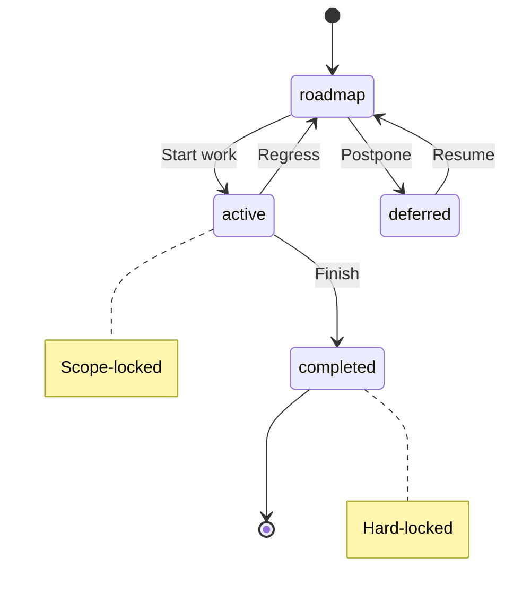

# TaxonomyReference

**Purpose:** Full documentation generated from decision document
**Detail Level:** detailed

---

**Problem:**
  The taxonomy defines the vocabulary for pattern annotations: what tags exist,
  their valid values, and how they are parsed. Developers need quick access to
  format types, categories, status values, and presets. Maintaining this
  documentation manually leads to drift from actual implementation.

  **Solution:**
  Auto-generate the Taxonomy reference documentation from annotated source code.
  The TypeScript source files in src/taxonomy/ define all taxonomy components.
  Documentation becomes a projection of the implementation, always in sync.

  **Target Documents:**

| Output | Purpose | Detail Level |
| docs-generated/docs/TAXONOMYREFERENCE.md | Detailed human reference | detailed |
| docs-generated/_claude-md/taxonomy/taxonomyreference.md | Compact AI context | summary |

  **Source Mapping:**

| Section | Source File | Extraction Method |
| --- | --- | --- |
| Concept | THIS DECISION (Rule: Concept) | Rule block content |
| Format Types | src/taxonomy/format-types.ts | @extract-shapes tag |
| Format Types Table | THIS DECISION (Rule: Format Types) | Rule block table |
| Categories | src/taxonomy/categories.ts | @extract-shapes tag |
| Status Values | src/taxonomy/status-values.ts | @extract-shapes tag |
| Status FSM | THIS DECISION (Rule: Status Values) | Rule block table |
| Normalized Status | src/taxonomy/normalized-status.ts | @extract-shapes tag |
| Hierarchy Levels | src/taxonomy/hierarchy-levels.ts | @extract-shapes tag |
| Risk Levels | src/taxonomy/risk-levels.ts | @extract-shapes tag |
| Layer Types | src/taxonomy/layer-types.ts | @extract-shapes tag |
| TagRegistry | src/taxonomy/registry-builder.ts | @extract-shapes tag |
| Presets | THIS DECISION (Rule: Presets) | Rule block table |
| Architecture | THIS DECISION (Rule: Architecture DocString) | Fenced code block |

---

## Implementation Details

### Concept

**Context:** A taxonomy is a classification system for organizing knowledge.

    **Definition:** In delivery-process, the taxonomy defines the vocabulary for
    pattern annotations. It determines what tags exist, their valid values, and
    how they are parsed from source code.

    **Components:**

| Component | Purpose | Source File |
| --- | --- | --- |
| Categories | Domain classifications (e.g., core, api, ddd) | categories.ts |
| Status Values | FSM states (roadmap, active, completed, deferred) | status-values.ts |
| Format Types | How tag values are parsed (flag, csv, enum) | format-types.ts |
| Hierarchy Levels | Work item levels (epic, phase, task) | hierarchy-levels.ts |
| Risk Levels | Risk assessment (low, medium, high) | risk-levels.ts |
| Layer Types | Feature layer (timeline, domain, integration) | layer-types.ts |

    **Key Principle:** The taxonomy is NOT a fixed schema. Presets select
    different subsets, and you can define custom categories.

### Format Types

```typescript
/**
 * @libar-docs
 * @libar-docs-pattern FormatTypes
 * @libar-docs-status completed
 * @libar-docs-core
 * @libar-docs-extract-shapes FORMAT_TYPES, FormatType
 *
 * ## Tag Value Format Types
 *
 * Defines how tag values are parsed and validated.
 * Each format type determines the parsing strategy for tag values.
 */
FORMAT_TYPES = [
  'value', // Simple string value
  'enum', // Constrained to predefined values
  'quoted-value', // String in quotes (preserves spaces)
  'csv', // Comma-separated values
  'number', // Numeric value
  'flag', // Boolean presence (no value needed)
] as const
```

```typescript
type FormatType = (typeof FORMAT_TYPES)[number];
```

### Format Types Table

**Context:** Tags have different value formats that determine parsing.

    **Decision:** Six format types are supported:

| Format | Example | Parsing |
| --- | --- | --- |
| flag | @docs-core | Boolean presence (no value) |
| value | @docs-pattern MyPattern | Simple string |
| enum | @docs-status completed | Constrained to predefined list |
| csv | @docs-uses A, B, C | Comma-separated values |
| number | @docs-phase 15 | Numeric value |
| quoted-value | @docs-brief:'Multi word' | Preserves spaces |

    **Implementation:** The format type is specified in the tag definition
    within the TagRegistry. The extractor uses the format to parse values.

### Categories

```typescript
/**
 * @libar-docs
 * @libar-docs-pattern CategoryDefinitions
 * @libar-docs-status completed
 * @libar-docs-core
 * @libar-docs-extract-shapes CategoryDefinition, CATEGORIES, CategoryTag, CATEGORY_TAGS
 *
 * ## Category Definitions
 *
 * Categories are used to classify patterns and organize documentation.
 * Priority determines display order (lower = higher priority).
 * The ddd-es-cqrs preset includes all 21 categories; simpler presets use subsets.
 */
interface CategoryDefinition {
  readonly tag: string;
  readonly domain: string;
  readonly priority: number;
  readonly description: string;
  readonly aliases: readonly string[];
}
```

```typescript
/**
 * All category definitions for the monorepo
 */
const CATEGORIES: readonly CategoryDefinition[];
```

```typescript
/**
 * Category tags as a union type
 */
type CategoryTag = (typeof CATEGORIES)[number]['tag'];
```

```typescript
/**
 * Extract all category tags as an array
 */
CATEGORY_TAGS = CATEGORIES.map((c) => c.tag) as readonly CategoryTag[]
```

### Status Values

```typescript
/**
 * @libar-docs
 * @libar-docs-pattern StatusValues
 * @libar-docs-status completed
 * @libar-docs-core
 * @libar-docs-extract-shapes PROCESS_STATUS_VALUES, ProcessStatusValue, ACCEPTED_STATUS_VALUES, AcceptedStatusValue, DEFAULT_STATUS
 *
 * ## Process Workflow Status Values
 *
 * THE single source of truth for FSM state values in the monorepo (per PDR-005 FSM).
 *
 * FSM transitions:
 * - roadmap to active (start work)
 * - active to completed (finish work)
 * - active to deferred (pause work)
 * - deferred to active (resume work)
 */
PROCESS_STATUS_VALUES = [
  'roadmap', // Planned work, fully editable
  'active', // In progress, scope-locked
  'completed', // Done, hard-locked
  'deferred', // On hold, fully editable
] as const
```

```typescript
type ProcessStatusValue = (typeof PROCESS_STATUS_VALUES)[number];
```

```typescript
/**
 * Extended status values accepted for extraction and validation
 *
 * FSM states that can be used in annotations.
 * Use only these canonical values: roadmap, active, completed, deferred.
 */
ACCEPTED_STATUS_VALUES = [...PROCESS_STATUS_VALUES] as const
```

```typescript
/**
 * Extended status values accepted for extraction and validation
 *
 * FSM states that can be used in annotations.
 * Use only these canonical values: roadmap, active, completed, deferred.
 */
type AcceptedStatusValue = (typeof ACCEPTED_STATUS_VALUES)[number];
```

```typescript
/**
 * Default status for new items
 */
const DEFAULT_STATUS: ProcessStatusValue;
```

### Normalized Status

```typescript
/**
 * Normalized status values for display
 *
 * Maps raw FSM states to three presentation buckets:
 * - completed: Work is done
 * - active: Work in progress
 * - planned: Future work (includes roadmap and deferred)
 */
NORMALIZED_STATUS_VALUES = ['completed', 'active', 'planned'] as const
```

```typescript
/**
 * Normalized status values for display
 *
 * Maps raw FSM states to three presentation buckets:
 * - completed: Work is done
 * - active: Work in progress
 * - planned: Future work (includes roadmap and deferred)
 */
type NormalizedStatus = (typeof NORMALIZED_STATUS_VALUES)[number];
```

```typescript
/**
 * Maps raw status values → normalized display status
 *
 * Includes both:
 * Canonical taxonomy values (per PDR-005 FSM)
 */
const STATUS_NORMALIZATION_MAP: Readonly<Record<string, NormalizedStatus>>;
```

```typescript
/**
 * Normalize any status string to a display bucket
 *
 * Maps status values to three canonical display states:
 * - "completed": completed
 * - "active": active
 * - "planned": roadmap, deferred, planned, or any unknown value
 *
 * Per PDR-005: deferred items are treated as planned (not actively worked on)
 *
 * @param status - Raw status from pattern (case-insensitive)
 * @returns "completed" | "active" | "planned"
 *
 * @example
 * ```typescript
 * normalizeStatus("completed")   // → "completed"
 * normalizeStatus("active")      // → "active"
 * normalizeStatus("roadmap")     // → "planned"
 * normalizeStatus("deferred")    // → "planned"
 * normalizeStatus(undefined)     // → "planned"
 * ```
 */
function normalizeStatus(status: string | undefined): NormalizedStatus;
```

### Hierarchy Levels

```typescript
/**
 * @libar-docs
 * @libar-docs-pattern HierarchyLevels
 * @libar-docs-status completed
 * @libar-docs-core
 * @libar-docs-extract-shapes HIERARCHY_LEVELS, HierarchyLevel, DEFAULT_HIERARCHY_LEVEL
 *
 * ## Hierarchy Levels for Work Item Breakdown
 *
 * Three-level hierarchy for organizing work:
 * - epic: Multi-quarter strategic initiatives
 * - phase: Standard work units (2-5 days)
 * - task: Fine-grained session-level work (1-4 hours)
 */
HIERARCHY_LEVELS = ['epic', 'phase', 'task'] as const
```

```typescript
/**
 * @libar-docs
 * @libar-docs-pattern HierarchyLevels
 * @libar-docs-status completed
 * @libar-docs-core
 * @libar-docs-extract-shapes HIERARCHY_LEVELS, HierarchyLevel, DEFAULT_HIERARCHY_LEVEL
 *
 * ## Hierarchy Levels for Work Item Breakdown
 *
 * Three-level hierarchy for organizing work:
 * - epic: Multi-quarter strategic initiatives
 * - phase: Standard work units (2-5 days)
 * - task: Fine-grained session-level work (1-4 hours)
 */
type HierarchyLevel = (typeof HIERARCHY_LEVELS)[number];
```

```typescript
/**
 * Default hierarchy level (for backward compatibility)
 */
const DEFAULT_HIERARCHY_LEVEL: HierarchyLevel;
```

### Risk Levels

```typescript
/**
 * @libar-docs
 * @libar-docs-pattern RiskLevels
 * @libar-docs-status completed
 * @libar-docs-core
 * @libar-docs-extract-shapes RISK_LEVELS, RiskLevel
 *
 * ## Risk Levels for Planning and Assessment
 *
 * Three-tier risk classification for roadmap planning.
 */
RISK_LEVELS = ['low', 'medium', 'high'] as const
```

```typescript
/**
 * @libar-docs
 * @libar-docs-pattern RiskLevels
 * @libar-docs-status completed
 * @libar-docs-core
 * @libar-docs-extract-shapes RISK_LEVELS, RiskLevel
 *
 * ## Risk Levels for Planning and Assessment
 *
 * Three-tier risk classification for roadmap planning.
 */
type RiskLevel = (typeof RISK_LEVELS)[number];
```

### Layer Types

```typescript
/**
 * @libar-docs
 * @libar-docs-pattern LayerTypes
 * @libar-docs-status completed
 * @libar-docs-core
 * @libar-docs-extract-shapes LAYER_TYPES, LayerType
 *
 * ## Feature Layer Types for Test Organization
 *
 * Inferred from feature file directory paths:
 * - timeline: Process/workflow features (delivery-process)
 * - domain: Business domain features
 * - integration: Cross-system integration tests
 * - e2e: End-to-end user journey tests
 * - component: Unit/component level tests
 * - unknown: Cannot determine layer from path
 */
LAYER_TYPES = [
  'timeline',
  'domain',
  'integration',
  'e2e',
  'component',
  'unknown',
] as const
```

```typescript
type LayerType = (typeof LAYER_TYPES)[number];
```

### TagRegistry

```typescript
/**
 * TagRegistry interface (matches schema from validation-schemas/tag-registry.ts)
 */
interface TagRegistry {
  version: string;
  categories: readonly CategoryDefinitionForRegistry[];
  metadataTags: readonly MetadataTagDefinitionForRegistry[];
  aggregationTags: readonly AggregationTagDefinitionForRegistry[];
  formatOptions: readonly string[];
  tagPrefix: string;
  fileOptInTag: string;
}
```

```typescript
interface MetadataTagDefinitionForRegistry {
  tag: string;
  format: FormatType;
  purpose: string;
  required?: boolean;
  repeatable?: boolean;
  values?: readonly string[];
  default?: string;
  example?: string;
}
```

```typescript
type TagDefinition = MetadataTagDefinitionForRegistry;
```

```typescript
/**
 * Build the complete tag registry from TypeScript constants
 *
 * This is THE single source of truth for the taxonomy.
 * All consumers should use this function instead of loading JSON.
 */
function buildRegistry(): TagRegistry;
```

### Presets

**Context:** Different projects need different taxonomy subsets.

    **Decision:** Three presets are available:

| Preset | Categories | Tag Prefix | Use Case |
| --- | --- | --- | --- |
| libar-generic (default) | 3 | @libar-docs- | Simple projects (this package) |
| ddd-es-cqrs | 21 | @libar-docs- | DDD/Event Sourcing architectures |
| generic | 3 | @docs- | Simple projects with @docs- prefix |

    **Behavior:** The preset determines which categories are available.
    All presets share the same status values and format types.

## Concept

**Context:** A taxonomy is a classification system for organizing knowledge.

    **Definition:** In delivery-process, the taxonomy defines the vocabulary for
    pattern annotations. It determines what tags exist, their valid values, and
    how they are parsed from source code.

    **Components:**

| Component | Purpose | Source File |
| --- | --- | --- |
| Categories | Domain classifications (e.g., core, api, ddd) | categories.ts |
| Status Values | FSM states (roadmap, active, completed, deferred) | status-values.ts |
| Format Types | How tag values are parsed (flag, csv, enum) | format-types.ts |
| Hierarchy Levels | Work item levels (epic, phase, task) | hierarchy-levels.ts |
| Risk Levels | Risk assessment (low, medium, high) | risk-levels.ts |
| Layer Types | Feature layer (timeline, domain, integration) | layer-types.ts |

    **Key Principle:** The taxonomy is NOT a fixed schema. Presets select
    different subsets, and you can define custom categories.

## Format Types

**Context:** Tags have different value formats that determine parsing.

    **Decision:** Six format types are supported:

| Format | Example | Parsing |
| --- | --- | --- |
| flag | @docs-core | Boolean presence (no value) |
| value | @docs-pattern MyPattern | Simple string |
| enum | @docs-status completed | Constrained to predefined list |
| csv | @docs-uses A, B, C | Comma-separated values |
| number | @docs-phase 15 | Numeric value |
| quoted-value | @docs-brief:'Multi word' | Preserves spaces |

    **Implementation:** The format type is specified in the tag definition
    within the TagRegistry. The extractor uses the format to parse values.

## Status Values

**Context:** Status values control the FSM workflow for pattern lifecycle.

    **Decision:** Four canonical status values are defined (per PDR-005):

| Status | Protection | Description |
| --- | --- | --- |
| roadmap | none | Planned work, fully editable |
| active | scope-locked | In progress, cannot add deliverables |
| completed | hard-locked | Done, requires unlock-reason to modify |
| deferred | none | On hold, fully editable |

    **Transitions:**

| From | To | Action |
| --- | --- | --- |
| roadmap | active | Start work |
| roadmap | deferred | Postpone |
| active | completed | Finish work |
| active | roadmap | Regress (blocked) |
| deferred | roadmap | Resume planning |

    **FSM Diagram:**



## Normalized Status

**Context:** Display requires mapping 4 FSM states to 3 presentation buckets.

    **Decision:** Raw status values normalize to display status:

| Raw Status | Normalized | Bucket |
| --- | --- | --- |
| completed | completed | Work is done |
| active | active | Work in progress |
| roadmap | planned | Future work |
| deferred | planned | Future work (paused) |

    **Rationale:** This separation follows DDD principles - the domain model
    (raw FSM states) is distinct from the view model (normalized display).

## Presets

**Context:** Different projects need different taxonomy subsets.

    **Decision:** Three presets are available:

| Preset | Categories | Tag Prefix | Use Case |
| --- | --- | --- | --- |
| libar-generic (default) | 3 | @libar-docs- | Simple projects (this package) |
| ddd-es-cqrs | 21 | @libar-docs- | DDD/Event Sourcing architectures |
| generic | 3 | @docs- | Simple projects with @docs- prefix |

    **Behavior:** The preset determines which categories are available.
    All presets share the same status values and format types.

## Hierarchy Levels

**Context:** Work items need hierarchical breakdown for planning.

    **Decision:** Three hierarchy levels are defined:

| Level | Duration | Description |
| --- | --- | --- |
| epic | Multi-quarter | Strategic initiatives |
| phase | 2-5 days | Standard work units |
| task | 1-4 hours | Session-level work |

    **Usage:** The level tag organizes work for roadmap generation.
    Phases can have a parent epic; tasks can have a parent phase.

## Architecture

**Context:** The taxonomy module structure supports the type-safe annotation system.

    **File Structure:**

```text
src/taxonomy/
      registry-builder.ts   -- buildRegistry() - creates TagRegistry
      categories.ts         -- Category definitions
      status-values.ts      -- FSM state values (PDR-005)
      normalized-status.ts  -- Display normalization (3 buckets)
      format-types.ts       -- Tag value parsing rules
      hierarchy-levels.ts   -- epic/phase/task
      risk-levels.ts        -- low/medium/high
      layer-types.ts        -- timeline/domain/integration/e2e
```

**TagRegistry:** The buildRegistry() function creates a TagRegistry
    containing all taxonomy definitions. It is THE single source of truth.

    **Usage Example:**

```typescript
import { buildRegistry } from '@libar-dev/delivery-process/taxonomy';

    const registry = buildRegistry();
    // registry.tagPrefix       -> "@libar-docs-"
    // registry.fileOptInTag    -> "@libar-docs"
    // registry.categories      -> CategoryDefinition[]
    // registry.metadataTags    -> MetadataTagDefinitionForRegistry[]
```

## Tag Generation

**Context:** Developers need a reference of all available tags.

    **Decision:** The generate-tag-taxonomy CLI creates a markdown reference:

```bash
npx generate-tag-taxonomy -o TAG_TAXONOMY.md -f
```

**Output:** A markdown file documenting all tags with their formats,
    valid values, and examples - generated from the TagRegistry.
