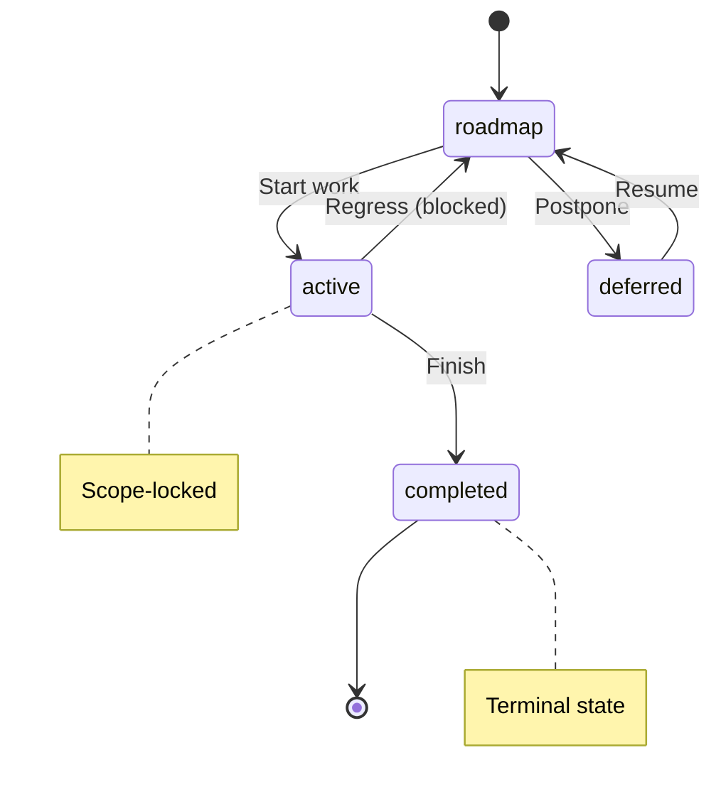
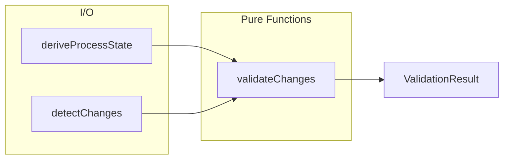

# Validation Reference

**Purpose:** Reference document: Validation Reference
**Detail Level:** Full reference

---

## Context - Why Process Guard Exists

The delivery workflow defines states for specifications:
    - **roadmap:** Planning phase, fully editable
    - **active:** Implementation in progress, scope-locked
    - **completed:** Work finished, hard-locked
    - **deferred:** Parked work, fully editable

    Without enforcement, these states are advisory only. Process Guard
    makes them enforceable through pre-commit validation.

---

## Decision - How Process Guard Works

Process Guard implements 7 validation rules:

    The linter runs as a pre-commit hook via Husky.
    See `.husky/pre-commit` for the hook configuration.

    Pre-commit: `npx lint-process --staged`
    CI pipeline: `npx lint-process --all --strict`

---

## Consequences - Trade-offs of This Approach

**Benefits:**
    - Catches workflow errors before they enter git history
    - Prevents accidental scope creep during active development
    - Protects completed work from unintended modifications
    - Clear escape hatch via unlock-reason annotation

    **Costs:**
    - Requires understanding of FSM states and transitions
    - Initial friction when modifying completed specs
    - Pre-commit hook adds a few seconds to commit time

---

## FSM Diagram

The FSM enforces valid state transitions. Protection levels and transitions
    are defined in TypeScript (extracted via @extract-shapes).



---

## Escape Hatches

**Context:** Sometimes process rules need to be bypassed for legitimate reasons.

    **Decision:** These escape hatches are available:

| Situation | Solution | Example |
| --- | --- | --- |
| Fix bug in completed spec | Add unlock-reason tag | @libar-docs-unlock-reason:'Fix-typo' |
| Modify outside session scope | Use --ignore-session flag | lint-process --staged --ignore-session |
| CI warnings blocking pipeline | Omit --strict flag | lint-process --all (warnings won't fail) |

---

## Rule Descriptions

Process Guard validates 7 rules (types extracted from TypeScript):

| Rule | Severity | Human Description |
| --- | --- | --- |
| completed-protection | error | Cannot modify completed specs without unlock-reason |
| invalid-status-transition | error | Status transition must follow FSM |
| scope-creep | error | Cannot add deliverables to active specs |
| session-excluded | error | Cannot modify files excluded from session |
| missing-relationship-target | warning | Relationship target must exist |
| session-scope | warning | File not in active session scope |
| deliverable-removed | warning | Deliverable was removed (informational) |

---

## Error Messages and Fixes

**Context:** Each validation rule produces a specific error message with actionable fix guidance.

    **Error Message Reference:**

    **Common Invalid Transitions:**

    **Fix Patterns:**

    1. **completed-protection**: Add `unlock-reason` tag with hyphenated reason
    2. **invalid-status-transition**: Follow FSM path (roadmap to active to completed)
    3. **scope-creep**: Remove new deliverable OR revert status to `roadmap` temporarily
    4. **session-scope**: Add file to session scope OR use `--ignore-session` flag
    5. **session-excluded**: Remove from exclusion list OR use `--ignore-session` flag
    6. **missing-relationship-target**: Add target pattern OR remove the relationship

    For detailed fix examples with code snippets, see [PROCESS-GUARD.md](/docs/PROCESS-GUARD.md).

| Rule | Severity | Example Error | Fix |
| --- | --- | --- | --- |
| completed-protection | error | Cannot modify completed spec without unlock reason | Add unlock-reason tag |
| invalid-status-transition | error | Invalid status transition: roadmap to completed | Follow FSM path |
| scope-creep | error | Cannot add deliverables to active spec | Remove deliverable or revert to roadmap |
| missing-relationship-target | warning | Missing relationship target: "PatternX" referenced by "PatternY" | Add target pattern or remove relationship |
| session-scope | warning | File not in active session scope | Add to scope or use --ignore-session |
| session-excluded | error | File is explicitly excluded from session | Remove from exclusion or use --ignore-session |
| deliverable-removed | warning | Deliverable removed: "Unit tests" | Informational only |

| Attempted | Why Invalid | Valid Path |
| --- | --- | --- |
| roadmap to completed | Must go through active | roadmap to active to completed |
| deferred to active | Must return to roadmap first | deferred to roadmap to active |
| deferred to completed | Cannot skip two states | deferred to roadmap to active to completed |
| completed to any | Terminal state | Use unlock-reason tag to modify |

---

## CLI Usage

Process Guard is invoked via the lint-process CLI command.
    Configuration interface (`ProcessGuardCLIConfig`) is extracted from `src/cli/lint-process.ts`.

    **CLI Commands:**

    **CLI Options:**

    **Integration:** See `.husky/pre-commit` for pre-commit hook setup and `package.json` scripts section for npm script configuration.

| Command | Purpose |
| --- | --- |
| `lint-process --staged` | Pre-commit validation (default mode) |
| `lint-process --all --strict` | CI pipeline with strict mode |
| `lint-process --file specs/my-feature.feature` | Validate specific file |
| `lint-process --staged --show-state` | Debug: show derived process state |
| `lint-process --staged --ignore-session` | Override session scope checking |

| Option | Description |
| --- | --- |
| `--staged` | Validate staged files only (pre-commit) |
| `--all` | Validate all tracked files (CI) |
| `--strict` | Treat warnings as errors (exit 1) |
| `--ignore-session` | Skip session scope validation |
| `--show-state` | Debug: show derived process state |
| `--format json` | Machine-readable JSON output |
| `--file <path>` | Validate a specific file |

---

## Programmatic API

Process Guard can be used programmatically for custom integrations.

    **Usage Example:**

    

    **API Functions:**

| Category | Function | Description |
| --- | --- | --- |
| State | deriveProcessState(cfg) | Build state from file annotations |
| Changes | detectStagedChanges(dir) | Parse staged git diff |
| Changes | detectBranchChanges(dir) | Parse all changes vs main |
| Changes | detectFileChanges(dir, f) | Parse specific files |
| Validate | validateChanges(input) | Run all validation rules |
| Results | hasErrors(result) | Check for blocking errors |
| Results | hasWarnings(result) | Check for warnings |
| Results | summarizeResult(result) | Human-readable summary |

```typescript
import {
      deriveProcessState,
      detectStagedChanges,
      validateChanges,
      hasErrors,
      summarizeResult,
    } from '@libar-dev/delivery-process/lint';

    const state = (await deriveProcessState({ baseDir: '.' })).value;
    const changes = detectStagedChanges('.').value;
    const { result } = validateChanges({
      state,
      changes,
      options: { strict: false, ignoreSession: false },
    });

    if (hasErrors(result)) {
      console.log(summarizeResult(result));
      for (const v of result.violations) {
        console.log(`[${v.rule}] ${v.file}: ${v.message}`);
      }
      process.exit(1);
    }
```

---

## Architecture

Process Guard uses the Decider pattern for testable validation.

    **Data Flow Diagram:**

    

    **Principle:** State is derived from file annotations - there is no separate state file to maintain.



---

## Related Documentation

**Context:** Related documentation for deeper understanding.

| Document | Relationship | Focus |
| --- | --- | --- |
| VALIDATION-REFERENCE.md | Sibling | DoD validation, anti-pattern detection |
| SESSION-GUIDES-REFERENCE.md | Prerequisite | Planning/Implementation workflows that Process Guard enforces |
| CONFIGURATION-REFERENCE.md | Reference | Presets and tag configuration |
| METHODOLOGY-REFERENCE.md | Background | Code-first documentation philosophy |

---

## Roadmap Spec Structure

**Context:** Roadmap specs define planned work with Problem/Solution descriptions
    and a Background deliverables table. They use the FSM status roadmap.

    **Key Elements:**

    **Structure Overview:**

    1. Tags at top: pattern name, status (roadmap), phase number
    2. Feature line with descriptive name
    3. **Problem:** section listing pain points as bullet list
    4. **Solution:** section listing approach as numbered list
    5. Background with deliverables DataTable (Deliverable, Status, Location columns)

    **Example Reference:** See specs/process-guard-linter.feature for a complete example.

| Element | Purpose | Example |
| --- | --- | --- |
| at-libar-docs-pattern:Name | Unique identifier (required) | at-libar-docs-pattern:ProcessGuard |
| at-libar-docs-status:roadmap | FSM state | at-libar-docs-status:roadmap |
| at-libar-docs-phase:N | Phase number for timeline | at-libar-docs-phase:99 |
| Problem/Solution headers | Extracted by generators | **Problem:** / **Solution:** |
| Background deliverables | Tracks implementation progress | DataTable with Status column |

---

## Rule Blocks for Business Constraints

**Invariant:** | Business constraint (what must be true) | Business Rules generator | |

**Context:** Use the Rule keyword to group related scenarios under a business constraint.
    Rules provide semantic grouping - generators extract them for business rules documentation.

    **Structure Overview:**

    1. Rule: line with business constraint name
    2. Optional structured annotations (Invariant, Rationale, Verified by)
    3. Related scenarios grouped under the Rule

    **Structured Rule Annotations:**

| **Usage Notes:**

    - Group scenarios that verify the same business constraint
    - Use Scenario Outline with Examples table for variations
    - Tag scenarios within Rules (at-happy-path, at-edge-case, etc.)
    - Rule blocks are optional - use when defining business invariants

**Rationale:** | Business justification (why it exists) | Business Rules generator | |

| Element | Purpose | Extracted By |
| --- | --- | --- |
| **Invariant:** | Business constraint (what must be true) | Business Rules generator |
| **Rationale:** | Business justification (why it exists) | Business Rules generator |
| **Verified by:** | Comma-separated scenario names | Traceability generator |

**Verified by:** | Comma-separated scenario names | Traceability generator |

---

## Scenario Outline for Variations

**Context:** Use Scenario Outline with Examples table when the same pattern applies
    with different inputs. This avoids duplicating nearly-identical scenarios.

    **Structure Overview:**

    1. Scenario Outline: line with descriptive name
    2. Steps using angle-bracket placeholders: <column_name>
    3. Examples: keyword followed by DataTable
    4. Each row in Examples table runs the scenario once

    **Best Practice:**

    **Example Reference:** See tests/features/validation/fsm-transitions.feature

| Condition | Recommendation |
| --- | --- |
| 3+ variations of same pattern | Use Scenario Outline |
| 1-2 variations | Separate Scenarios may be clearer |
| Different behaviors | Use separate Scenarios |
| Same behavior, different data | Use Scenario Outline |

---

## Executable Test Feature

**Context:** Test features focus on behavior verification. They use section
    dividers for organization in large feature files.

    **Structure Overview:**

    1. Tags: at-behavior, at-pattern-name, at-libar-docs-pattern:Name
    2. Feature with Problem/Solution description
    3. Background with test context setup
    4. Section comments (lines of === characters) to organize
    5. Scenarios grouped by section (Basic, Error Handling, etc.)

    **Section Comments:**

    Use comment lines with equals signs to divide large feature files into sections.
    These improve readability but are ignored by generators.

    Example section divider: a line of 70+ equals signs as a Gherkin comment.

    **Example Reference:** See tests/features/behavior/scanner-core.feature

---

## DataTable and DocString Usage

**Context:** DataTables and DocStrings serve different purposes. Choose
    the right one based on your data structure.

    **Decision Table:**

    **Background DataTable:**

    Use for data that applies to all scenarios - deliverables, definitions, configuration.
    First row is headers, subsequent rows are data.

    **Scenario DataTable:**

    Use for scenario-specific test inputs with tabular structure.
    Access in step definitions as array of objects keyed by header names.

    **DocString:**

    Use triple quotes (three double-quote characters) for multi-line content.
    Add language hint after opening quotes: typescript, bash, json, etc.
    Essential when content contains pipe characters that would break DataTables.

| Data Type | Use | Format |
| --- | --- | --- |
| Reference data (all scenarios) | Background DataTable | Pipe-delimited rows with header |
| Test inputs (single scenario) | Scenario DataTable | Pipe-delimited rows with header |
| Code examples | DocString | Triple quotes with lang hint |
| Content with pipes | DocString | Avoids parsing issues |
| Multi-line text | DocString | Preserves formatting |

---

## Tag Conventions

**Context:** Tags organize scenarios for filtering and categorization.
    Use consistent tags across the codebase.

    **Scenario Tags:**

    **Feature-Level Tags:**

    **Combining Tags:**

    Multiple tags on same line are space-separated.
    Feature-level tags apply to all scenarios in the feature.

| Tag | Purpose | When to Use |
| --- | --- | --- |
| at-happy-path | Primary success scenario | Default behavior works |
| at-edge-case | Boundary conditions | Unusual inputs, limits |
| at-error-handling | Error recovery | Graceful degradation |
| at-validation | Input validation | Constraint checks |
| at-integration | Cross-component behavior | System boundaries |
| at-poc | Proof of concept | Experimental features |
| at-acceptance-criteria | Required for DoD | Must-pass scenarios |

| Tag | Purpose | Example |
| --- | --- | --- |
| at-behavior | Marks test feature file | Test feature identification |
| at-libar-docs | Opt-in for processing | Required for all processed features |
| at-libar-docs-pattern:Name | Unique pattern identifier | Pattern registry key |
| at-libar-docs-status:state | FSM state | roadmap, active, completed, deferred |
| at-libar-docs-phase:N | Timeline phase | Phase number for roadmap |

---

## Feature Description Patterns

**Context:** Feature descriptions appear in generated documentation.
    Choose headers that fit your pattern type.

    **Decision:** Three description structures are supported:

    **Notes:**

    - The **Problem/Solution** pattern is the dominant style in this codebase
    - Problem section: use bullet list for pain points
    - Solution section: use numbered list for approach steps
    - Both headers must include trailing colon and be bold

| Structure | Headers | Best For |
| --- | --- | --- |
| Problem/Solution | **Problem:** and **Solution:** | Pain point to fix |
| Value-First | **Business Value:** and **How It Works:** | TDD-style, Gherkin spirit |
| Context/Approach | **Context:** and **Approach:** | Technical patterns |

---

## Valid Rich Content

**Context:** Feature files support various content types. Some appear in
    generated docs, others are ignored.

    **Decision:** Content rendering by type:

    **Code-First Principle:**

    Prefer code stubs over DocStrings for complex examples. Feature files
    should reference code, not duplicate it.

    **Instead of large DocStrings, reference code files directly in Rule descriptions.**

| Content Type | Syntax | Appears in Docs |
| --- | --- | --- |
| Plain text | Regular paragraphs | Yes |
| Bold/emphasis | **bold** and *italic* | Yes |
| Tables | Markdown pipe tables | Yes |
| Lists | Dash item or number-dot item | Yes |
| DocStrings | Triple quotes with lang | Yes (code block) |
| Comments | Lines starting with hash | No (ignored) |

| Approach | When to Use |
| --- | --- |
| DocStrings | Brief examples (5-10 lines), current/target state |
| Code stub reference | Complex APIs, interfaces, full implementations |

---

## Syntax Notes

**Context:** Gherkin has specific syntax constraints that differ from Markdown.

    **DocStrings vs Code Fences:**

    Prefer DocStrings (triple double-quotes) over Markdown code fences for portability.
    Markdown fences (triple backticks) may not render consistently in all contexts.
    DocStrings support language hints for syntax highlighting.

    **Tag Value Constraints:**

    Tag values cannot contain spaces. Use hyphens instead:

    **Quoted Values:**

    For values that need spaces, use the quoted-value format where supported.

| Invalid | Valid |
| --- | --- |
| at-unlock-reason:Fix for issue | at-unlock-reason:Fix-for-issue |
| at-libar-docs-pattern:My Pattern | at-libar-docs-pattern:MyPattern |

---

## Forbidden Content in Feature Descriptions

**Context:** Some content types cause Gherkin parser issues or rendering problems.
    Avoid these patterns in feature descriptions.

    **Forbidden Content:**

    **DocString Limitations:**

    - DocStrings cannot contain the closing triple-quote sequence
    - Avoid shell scripts with complex quoting in DocStrings
    - Keep DocStrings under 50 lines (reference code files for longer examples)
    - Do not use Gherkin keywords (Feature:, Scenario:) in DocString content

    **Workaround for Complex Examples:**

    Instead of embedding complex code in DocStrings, reference the actual file:
    "See src/example/module.ts for complete implementation."

| Forbidden | Why | Alternative |
| --- | --- | --- |
| Code fences (triple backticks) | Not Gherkin syntax | Use DocStrings with lang hint |
| at-prefix in free text | Interpreted as Gherkin tag | Remove at-symbol or escape |
| Nested DocStrings | Gherkin parser error | Reference code stub file |
| Lines starting with dot | Parser issues in some contexts | Reword sentence |
| Feature: in DocStrings | Triggers Gherkin keyword parsing | Use different example text |
| at-tags with space values | Tag parsing fails | Use hyphens instead |

---

## Authoring Checklist

**Context:** Quick checklist when authoring new Gherkin specs.

    **Before Writing:**

    **While Writing:**

    **After Writing:**

| Check | Why |
| --- | --- |
| Determine spec type (roadmap vs test) | Different tag requirements |
| Choose description pattern | Problem/Solution, Value-First, or Context/Approach |
| Identify deliverables | For Background DataTable |
| List business constraints | Each becomes a Rule block |

| Check | Action |
| --- | --- |
| Tags at feature level | at-libar-docs, at-libar-docs-pattern, at-libar-docs-status |
| Feature description | Use bold headers (**Problem:** etc.) |
| Background DataTable | Deliverable, Status, Location columns |
| Rule blocks | One per business constraint |
| Scenarios per Rule | Minimum 1 happy-path + 1 validation |
| Scenario tags | at-happy-path, at-edge-case, at-acceptance-criteria |

| Check | Command |
| --- | --- |
| Lint passes | pnpm lint |
| Pattern lint passes | pnpm lint-patterns |
| Docs generate | pnpm docs:technical |
| Content appears in output | Check docs-generated/ directory |

---

## Quick Reference

**Context:** Quick lookup table for Gherkin elements and their use cases.

    **Decision:** Element usage guide:

| Element | Use For | Example Location |
| --- | --- | --- |
| Background DataTable | Deliverables, shared reference | specs/process-guard-linter.feature |
| Rule block | Group scenarios by constraint | tests/features/validation/*.feature |
| Scenario Outline | Same pattern with variations | tests/features/behavior/fsm-*.feature |
| DocString | Code examples, pipes content | tests/features/behavior/scanner-*.feature |
| Section comments | Organize large features | Most test features |
| at-happy-path | Primary success scenario | Every feature with scenarios |
| at-edge-case | Boundary conditions | Validation features |
| at-acceptance-criteria | Required for DoD | Roadmap specs |

---

## Related Documentation - Gherkin

**Context:** Gherkin patterns connect to other documentation.

    **Decision:** Related docs by topic:

| Document | Content |
| --- | --- |
| INSTRUCTIONS.md | Complete tag reference and CLI |
| CONFIGURATION.md | Preset and tag prefix configuration |
| SESSION-GUIDES.md | Session workflows using these patterns |
| METHODOLOGY.md | Core thesis and two-tier architecture |

---

## Command Decision Tree

**Context:** Developers need to quickly determine which validation command to run.

    **Decision Tree:**

| Question | Answer | Command |
| --- | --- | --- |
| Need annotation quality check? | Yes | lint-patterns |
| Need FSM workflow validation? | Yes | lint-process |
| Need cross-source or DoD validation? | Yes | validate-patterns |
| Running pre-commit hook? | Default | lint-process --staged |

---

## Command Summary

**Context:** Three validation commands serve different purposes.

    **Commands:**

| Command | Purpose | When to Use |
| --- | --- | --- |
| lint-patterns | Annotation quality | Ensure patterns have required tags |
| lint-process | FSM workflow enforcement | Pre-commit hooks, CI pipelines |
| validate-patterns | Cross-source + DoD + anti-pattern | Release validation, comprehensive |

---

## lint-patterns Rules

**Context:** lint-patterns validates annotation quality in TypeScript files.

    **CLI Commands:**

    **Validation Rules:**

    Validation rules are extracted from `src/lint/rules.ts` via `@extract-shapes`.

    **Rule Error Examples:**

| Command | Purpose |
| --- | --- |
| `npx lint-patterns -i "src/**/*.ts"` | Basic usage |
| `npx lint-patterns -i "src/**/*.ts" --strict` | Strict mode (CI) |

| Rule | Severity | What It Checks |
| --- | --- | --- |
| missing-pattern-name | error | Must have explicit pattern name tag |
| invalid-status | error | Status must be valid FSM value |
| tautological-description | error | Description cannot just repeat name |
| pattern-conflict-in-implements | error | Pattern cannot implement itself (circular reference) |
| missing-relationship-target | warning | Relationship targets must reference existing patterns |
| missing-status | warning | Should have status tag |
| missing-when-to-use | warning | Should have "When to Use" section |
| missing-relationships | info | Consider adding uses/used-by tags |

| Rule | Example Error | Fix |
| --- | --- | --- |
| missing-pattern-name | Pattern missing explicit name | Add @libar-docs-pattern YourName |
| invalid-status | Invalid status 'draft' | Use: roadmap, active, completed, deferred |
| tautological-description | Description repeats pattern name | Provide meaningful context |
| missing-status | No @libar-docs-status found | Add: @libar-docs-status completed |
| missing-when-to-use | No "When to Use" section found | Add ### When to Use in description |

---

## Anti-Pattern Detection

**Context:** Enforces dual-source architecture ownership between TypeScript and Gherkin files.

    Anti-pattern definitions are extracted from `src/validation/anti-patterns.ts` via `@extract-shapes`.

    **Anti-Patterns Detected:**

    **Tag Location Constraints:**

    **Default Thresholds:**

| ID | Severity | Description | Fix |
| --- | --- | --- | --- |
| tag-duplication | error | Dependencies in features (should be code-only) | Move uses tags to TypeScript code |
| process-in-code | error | Process metadata in code (should be features-only) | Move quarter/team tags to feature files |
| magic-comments | warning | Generator hints in features (e.g., # GENERATOR:) | Use standard Gherkin tags instead |
| scenario-bloat | warning | Too many scenarios per feature (threshold: 20) | Split into multiple feature files |
| mega-feature | warning | Feature file too large (threshold: 500 lines) | Split by component or domain |

| Tag | Correct Location | Wrong Location | Reason |
| --- | --- | --- | --- |
| @libar-docs-uses | TypeScript code | Feature files | TS owns runtime dependencies |
| @libar-docs-depends-on | Feature files | TypeScript code | Gherkin owns planning dependencies |
| @libar-docs-quarter | Feature files | TypeScript code | Gherkin owns timeline metadata |
| @libar-docs-team | Feature files | TypeScript code | Gherkin owns ownership metadata |

| Threshold | Default Value | Description |
| --- | --- | --- |
| scenarioBloatThreshold | 20 | Max scenarios per feature file |
| megaFeatureLineThreshold | 500 | Max lines per feature file |
| magicCommentThreshold | 5 | Max magic comments before warning |

---

## DoD Validation

**Invariant:** Completed patterns must satisfy all DoD criteria defined below.

**Context:** Definition of Done validation ensures completed patterns meet quality criteria.

    DoD criteria and completion patterns are extracted from `src/validation/dod-validator.ts`
    and `src/validation/types.ts` via `@extract-shapes`.

    **DoD Criteria (for completed status):**

    **Recognized Completion Patterns:**

    **Recognized Pending Patterns:**

    **DoD Validation Output Example:**

**Rationale:** Ensures completed status reflects verified readiness for production.

| Criterion | Requirement | Failure Message |
| --- | --- | --- |
| Deliverables Complete | All deliverables must be marked done | X/Y deliverables incomplete |
| Acceptance Criteria | At least one @acceptance-criteria scenario | No @acceptance-criteria scenarios found |

| Type | Patterns |
| --- | --- |
| Text (case-insensitive) | complete, completed, done, finished, yes |
| Symbols | checkmark, heavy checkmark, check box with check, white check |

| Type | Patterns |
| --- | --- |
| Text (case-insensitive) | pending, todo, planned, not started, no |

| Phase | Pattern | Deliverables | AC Scenarios | Result |
| --- | --- | --- | --- | --- |
| Phase 14 | MyPattern | 5/5 complete | 3 found | PASS |
| Phase 15 | OtherPattern | 2/4 complete | 0 found | FAIL |

**Verified by:** @acceptance-criteria Scenario: Reference generates Validation documentation

---

## validate-patterns Flags

**Context:** validate-patterns combines multiple validation checks.

    CLI configuration interface (`ValidateCLIConfig`) with all flags and options
    is extracted from `src/cli/validate-patterns.ts` via `@extract-shapes`.

    **CLI Options:**

    **Example Commands:**

| Flag | Description |
| --- | --- |
| `-i, --include` | TypeScript file glob patterns |
| `-F, --features` | Feature file glob patterns |
| `--dod` | Enable DoD validation for completed patterns |
| `--anti-patterns` | Enable anti-pattern detection |
| `--cross-source` | Enable cross-source consistency validation |

| Command | Purpose |
| --- | --- |
| `npx validate-patterns -i "src/**/*.ts" -F "specs/**/*.feature" --dod` | DoD only |
| `npx validate-patterns -i "src/**/*.ts" -F "specs/**/*.feature" --anti-patterns` | Anti-patterns only |
| `npx validate-patterns -i "src/**/*.ts" -F "specs/**/*.feature" --dod --anti-patterns` | Full validation |

---

## CI/CD Integration

**Context:** Validation commands integrate into CI/CD pipelines.

    **Recommended npm Scripts:**

    **Pre-commit Hook Setup:**

    Add to `.husky/pre-commit`: `npx lint-process --staged`

    **GitHub Actions Integration:**

| Script Name | Command | Purpose |
| --- | --- | --- |
| lint:patterns | lint-patterns -i 'src/**/*.ts' | Annotation quality |
| lint:process | lint-process --staged | Pre-commit validation |
| lint:process:ci | lint-process --all --strict | CI pipeline |
| validate:all | validate-patterns -i 'src/**/*.ts' -F 'specs/**/*.feature' --dod --anti-patterns | Full validation |

| Step Name | Command |
| --- | --- |
| Lint annotations | npx lint-patterns -i "src/**/*.ts" --strict |
| Validate patterns | npx validate-patterns -i "src/**/*.ts" -F "specs/**/*.feature" --dod --anti-patterns |

---

## Exit Codes

**Context:** All validation commands use consistent exit codes.

| Code | Meaning |
| --- | --- |
| 0 | No errors (warnings allowed unless --strict) |
| 1 | Errors found (or warnings with --strict) |

---

## Programmatic API

**Context:** All validation tools expose programmatic APIs for custom integrations.

    **API Functions:**

    **Import Paths:**

    

    **Anti-Pattern Detection Example:**

    

    **DoD Validation Example:**

| Category | Function | Description |
| --- | --- | --- |
| Linting | lintFiles(files, rules) | Run lint rules on files |
| Linting | hasFailures(result) | Check for lint failures |
| Anti-Patterns | detectAntiPatterns(ts, features) | Run all anti-pattern detectors |
| Anti-Patterns | detectProcessInCode(files) | Find process tags in TypeScript |
| Anti-Patterns | detectScenarioBloat(features) | Find feature files with too many scenarios |
| Anti-Patterns | detectMegaFeature(features) | Find feature files that are too large |
| Anti-Patterns | formatAntiPatternReport(violations) | Format violations for console output |
| DoD | validateDoD(features) | Validate DoD for all completed phases |
| DoD | validateDoDForPhase(name, phase, feature) | Validate DoD for single phase |
| DoD | isDeliverableComplete(deliverable) | Check if deliverable is done |
| DoD | hasAcceptanceCriteria(feature) | Check for @acceptance-criteria scenarios |
| DoD | formatDoDSummary(summary) | Format DoD results for console output |

```typescript
// Pattern linting
    import { lintFiles, hasFailures } from '@libar-dev/delivery-process/lint';

    // Anti-patterns and DoD
    import { detectAntiPatterns, validateDoD } from '@libar-dev/delivery-process/validation';
```

```typescript
import { detectAntiPatterns } from '@libar-dev/delivery-process/validation';

    const violations = detectAntiPatterns(tsFiles, features, {
      thresholds: { scenarioBloatThreshold: 15 },
    });
```

```typescript
import { validateDoD, formatDoDSummary } from '@libar-dev/delivery-process/validation';

    const summary = validateDoD(features);
    console.log(formatDoDSummary(summary));
```

---

## Related Documentation - Validation

**Context:** Related documentation for deeper understanding.

| Document | Relationship | Focus |
| --- | --- | --- |
| PROCESS-GUARD-REFERENCE.md | Sibling | FSM workflow enforcement, pre-commit hooks |
| CONFIGURATION-REFERENCE.md | Reference | Tag prefixes, presets |
| TAXONOMY-REFERENCE.md | Reference | Valid status values, tag formats |
| INSTRUCTIONS-REFERENCE.md | Reference | Complete annotation reference |

---

## API Types

### AntiPatternId (type)

/**
 * Anti-pattern rule identifiers
 *
 * Each ID corresponds to a specific violation of the dual-source
 * documentation architecture or process hygiene.
 */

```typescript
type AntiPatternId =
  | 'tag-duplication' // Dependencies in features (should be code-only)
  | 'process-in-code' // Process metadata in code (should be features-only)
  | 'magic-comments' // Generator hints in features
  | 'scenario-bloat' // Too many scenarios per feature
  | 'mega-feature';
```

### AntiPatternViolation (interface)

/**
 * Anti-pattern detection result
 *
 * Reports a specific anti-pattern violation with context
 * for remediation.
 */

```typescript
interface AntiPatternViolation {
  /** Anti-pattern identifier */
  readonly id: AntiPatternId;
  /** Human-readable description */
  readonly message: string;
  /** File where violation was found */
  readonly file: string;
  /** Line number (if applicable) */
  readonly line?: number;
  /** Severity (error = architectural violation, warning = hygiene issue) */
  readonly severity: 'error' | 'warning';
  /** Fix guidance */
  readonly fix?: string;
}
```

| Property | Description |
| --- | --- |
| id | Anti-pattern identifier |
| message | Human-readable description |
| file | File where violation was found |
| line | Line number (if applicable) |
| severity | Severity (error = architectural violation, warning = hygiene issue) |
| fix | Fix guidance |

### AntiPatternThresholds (type)

```typescript
type AntiPatternThresholds = z.infer<typeof AntiPatternThresholdsSchema>;
```

### AntiPatternThresholdsSchema (const)

/**
 * Zod schema for anti-pattern thresholds
 *
 * Configurable limits for detecting anti-patterns.
 */

```typescript
AntiPatternThresholdsSchema = z.object({
  /** Maximum scenarios per feature file before warning */
  scenarioBloatThreshold: z.number().int().positive().default(20),
  /** Maximum lines per feature file before warning */
  megaFeatureLineThreshold: z.number().int().positive().default(500),
  /** Maximum magic comments before warning */
  magicCommentThreshold: z.number().int().positive().default(5),
})
```

### DEFAULT_THRESHOLDS (const)

/**
 * Default thresholds for anti-pattern detection
 */

```typescript
const DEFAULT_THRESHOLDS: AntiPatternThresholds;
```

### DoDValidationResult (interface)

/**
 * DoD validation result for a single phase/pattern
 *
 * Reports whether a completed phase meets Definition of Done criteria:
 * 1. All deliverables must have "complete" status
 * 2. At least one @acceptance-criteria scenario must exist
 */

```typescript
interface DoDValidationResult {
  /** Pattern name being validated */
  readonly patternName: string;
  /** Phase number being validated */
  readonly phase: number;
  /** True if all DoD criteria are met */
  readonly isDoDMet: boolean;
  /** All deliverables from Background table */
  readonly deliverables: readonly Deliverable[];
  /** Deliverables that are not yet complete */
  readonly incompleteDeliverables: readonly Deliverable[];
  /** True if no @acceptance-criteria scenarios found */
  readonly missingAcceptanceCriteria: boolean;
  /** Human-readable validation messages */
  readonly messages: readonly string[];
}
```

| Property | Description |
| --- | --- |
| patternName | Pattern name being validated |
| phase | Phase number being validated |
| isDoDMet | True if all DoD criteria are met |
| deliverables | All deliverables from Background table |
| incompleteDeliverables | Deliverables that are not yet complete |
| missingAcceptanceCriteria | True if no @acceptance-criteria scenarios found |
| messages | Human-readable validation messages |

### DoDValidationSummary (interface)

/**
 * Aggregate DoD validation summary
 *
 * Summarizes validation across multiple phases for CLI output.
 */

```typescript
interface DoDValidationSummary {
  /** Per-phase validation results */
  readonly results: readonly DoDValidationResult[];
  /** Total phases validated */
  readonly totalPhases: number;
  /** Phases that passed DoD */
  readonly passedPhases: number;
  /** Phases that failed DoD */
  readonly failedPhases: number;
}
```

| Property | Description |
| --- | --- |
| results | Per-phase validation results |
| totalPhases | Total phases validated |
| passedPhases | Phases that passed DoD |
| failedPhases | Phases that failed DoD |

### getPhaseStatusEmoji (function)

/**
 * Get status emoji for phase-level aggregates.
 *
 * @param allComplete - Whether all patterns in the phase are complete
 * @param anyActive - Whether any patterns in the phase are active/in-progress
 * @returns Status emoji: ✅ if all complete, 🚧 if any active, 📋 otherwise
 */

```typescript
function getPhaseStatusEmoji(allComplete: boolean, anyActive: boolean): string;
```

### WithTagRegistry (interface)

/**
 * Base interface for options that accept a TagRegistry for prefix-aware behavior.
 *
 * Many validation functions need to be aware of the configured tag prefix
 * (e.g., "@libar-docs-" vs "@docs-"). This interface provides a consistent
 * way to pass that configuration.
 *
 * ### When to Use
 *
 * Extend this interface when creating options for functions that:
 * - Generate error messages referencing tag names
 * - Detect tags in source code
 * - Validate tag formats
 *
 * @example
 * ```typescript
 * export interface MyValidationOptions extends WithTagRegistry {
 *   readonly strict?: boolean;
 * }
 * ```
 */

```typescript
interface WithTagRegistry {
  /** Tag registry for prefix-aware behavior (defaults to @libar-docs- if not provided) */
  readonly registry?: TagRegistry;
}
```

| Property | Description |
| --- | --- |
| registry | Tag registry for prefix-aware behavior (defaults to @libar-docs- if not provided) |

### isDeliverableComplete (function)

/**
 * Check if a deliverable status indicates completion
 *
 * Uses canonical deliverable status taxonomy. Status must be 'complete'.
 *
 * @param deliverable - The deliverable to check
 * @returns True if the deliverable is complete
 */

```typescript
function isDeliverableComplete(deliverable: Deliverable): boolean;
```

### hasAcceptanceCriteria (function)

/**
 * Check if a feature has @acceptance-criteria scenarios
 *
 * Scans scenarios for the @acceptance-criteria tag, which indicates
 * BDD-driven acceptance tests.
 *
 * @param feature - The scanned feature file to check
 * @returns True if at least one @acceptance-criteria scenario exists
 */

```typescript
function hasAcceptanceCriteria(feature: ScannedGherkinFile): boolean;
```

### extractAcceptanceCriteriaScenarios (function)

/**
 * Extract acceptance criteria scenario names from a feature
 *
 * @param feature - The scanned feature file
 * @returns Array of scenario names with @acceptance-criteria tag
 */

```typescript
function extractAcceptanceCriteriaScenarios(feature: ScannedGherkinFile): readonly string[];
```

### validateDoDForPhase (function)

/**
 * Validate DoD for a single phase/pattern
 *
 * Checks:
 * 1. All deliverables have "complete" status
 * 2. At least one @acceptance-criteria scenario exists
 *
 * @param patternName - Name of the pattern being validated
 * @param phase - Phase number being validated
 * @param feature - The scanned feature file with deliverables and scenarios
 * @returns DoD validation result
 */

```typescript
function validateDoDForPhase(
  patternName: string,
  phase: number,
  feature: ScannedGherkinFile
): DoDValidationResult;
```

### validateDoD (function)

/**
 * Validate DoD across multiple phases
 *
 * Filters to completed phases and validates each against DoD criteria.
 * Optionally filter to specific phases using phaseFilter.
 *
 * @param features - Array of scanned feature files
 * @param phaseFilter - Optional array of phase numbers to validate (validates all if empty)
 * @returns Aggregate DoD validation summary
 *
 * @example
 * ```typescript
 * // Validate all completed phases
 * const summary = validateDoD(features);
 *
 * // Validate specific phase
 * const summary = validateDoD(features, [14]);
 * ```
 */

```typescript
function validateDoD(
  features: readonly ScannedGherkinFile[],
  phaseFilter: readonly number[] = []
): DoDValidationSummary;
```

### formatDoDSummary (function)

/**
 * Format DoD validation summary for console output
 *
 * @param summary - DoD validation summary to format
 * @returns Multi-line string for pretty printing
 */

```typescript
function formatDoDSummary(summary: DoDValidationSummary): string;
```

### AntiPatternDetectionOptions (interface)

/**
 * Configuration options for anti-pattern detection
 */

```typescript
interface AntiPatternDetectionOptions extends WithTagRegistry {
  /** Thresholds for warning triggers */
  readonly thresholds?: Partial<AntiPatternThresholds>;
}
```

| Property | Description |
| --- | --- |
| thresholds | Thresholds for warning triggers |

### detectAntiPatterns (function)

/**
 * Detect all anti-patterns
 *
 * Runs all anti-pattern detectors and returns combined violations.
 *
 * @param scannedFiles - Array of scanned TypeScript files
 * @param features - Array of scanned feature files
 * @param options - Optional configuration (registry for prefix, thresholds)
 * @returns Array of all detected anti-pattern violations
 *
 * @example
 * ```typescript
 * // With default prefix (@libar-docs-)
 * const violations = detectAntiPatterns(tsFiles, featureFiles);
 *
 * // With custom prefix
 * const registry = createDefaultTagRegistry();
 * registry.tagPrefix = "@docs-";
 * const customViolations = detectAntiPatterns(tsFiles, featureFiles, { registry });
 *
 * for (const v of violations) {
 *   console.log(`[${v.severity.toUpperCase()}] ${v.id}: ${v.message}`);
 * }
 * ```
 */

```typescript
function detectAntiPatterns(
  scannedFiles: readonly ScannedFile[],
  features: readonly ScannedGherkinFile[],
  options: AntiPatternDetectionOptions =;
```

### detectProcessInCode (function)

/**
 * Detect process metadata in code anti-pattern
 *
 * Finds process tracking annotations (e.g., @docs-quarter, @docs-team, etc.)
 * in TypeScript files. Process metadata belongs in feature files.
 *
 * @param scannedFiles - Array of scanned TypeScript files
 * @param registry - Optional tag registry for prefix-aware detection (defaults to @libar-docs-)
 * @returns Array of anti-pattern violations
 */

```typescript
function detectProcessInCode(
  scannedFiles: readonly ScannedFile[],
  registry?: TagRegistry
): AntiPatternViolation[];
```

### detectMagicComments (function)

/**
 * Detect magic comments anti-pattern
 *
 * Finds generator hints like "# GENERATOR:", "# PARSER:" in feature files.
 * These create tight coupling between features and generators.
 *
 * @param features - Array of scanned feature files
 * @param threshold - Maximum magic comments before warning (default: 5)
 * @returns Array of anti-pattern violations
 */

```typescript
function detectMagicComments(
  features: readonly ScannedGherkinFile[],
  threshold: number = DEFAULT_THRESHOLDS.magicCommentThreshold
): AntiPatternViolation[];
```

### detectScenarioBloat (function)

/**
 * Detect scenario bloat anti-pattern
 *
 * Finds feature files with too many scenarios, which indicates poor
 * organization and slows test suites.
 *
 * @param features - Array of scanned feature files
 * @param threshold - Maximum scenarios before warning (default: 20)
 * @returns Array of anti-pattern violations
 */

```typescript
function detectScenarioBloat(
  features: readonly ScannedGherkinFile[],
  threshold: number = DEFAULT_THRESHOLDS.scenarioBloatThreshold
): AntiPatternViolation[];
```

### detectMegaFeature (function)

/**
 * Detect mega-feature anti-pattern
 *
 * Finds feature files that are too large, which makes them hard to
 * maintain and review.
 *
 * @param features - Array of scanned feature files
 * @param threshold - Maximum lines before warning (default: 500)
 * @returns Array of anti-pattern violations
 */

```typescript
function detectMegaFeature(
  features: readonly ScannedGherkinFile[],
  threshold: number = DEFAULT_THRESHOLDS.megaFeatureLineThreshold
): AntiPatternViolation[];
```

### formatAntiPatternReport (function)

/**
 * Format anti-pattern violations for console output
 *
 * @param violations - Array of violations to format
 * @returns Multi-line string for pretty printing
 */

```typescript
function formatAntiPatternReport(violations: AntiPatternViolation[]): string;
```

### toValidationIssues (function)

/**
 * Convert anti-pattern violations to ValidationIssue format
 *
 * For integration with the existing validate-patterns CLI.
 */

```typescript
function toValidationIssues(violations: readonly AntiPatternViolation[]): Array<;
```

---

## Behavior Specifications

### WorkflowConfigSchema

## WorkflowConfigSchema - Workflow Configuration Validation

Zod schemas for validating workflow configuration files that define
status models, phase definitions, and artifact mappings.

### When to Use

- When loading workflow configs from catalogue/workflows/
- When validating custom workflow configurations
- When creating new workflow definitions

### ExtractedPatternSchema

## ExtractedPatternSchema - Complete Pattern Validation

Zod schema for validating complete extracted patterns with code,
metadata, relationships, and source information.

### When to Use

- Use when validating extracted patterns from the extractor
- Use when serializing/deserializing pattern data

### DualSourceSchemas

## DualSourceSchemas - Dual-Source Extraction Type Validation

Zod schemas for dual-source extraction types.

Following the project's schema-first pattern, all dual-source types
are defined as Zod schemas with TypeScript types inferred from them.

### When to Use

- When validating process metadata from Gherkin feature tags
- When validating deliverables from Background tables
- When performing cross-validation between code and feature files

### DocDirectiveSchema

## DocDirectiveSchema - Parsed JSDoc Directive Validation

Zod schemas for validating parsed @libar-docs-* directives from JSDoc comments.
Enforces tag format, position validity, and metadata extraction.

### When to Use

- Use when parsing JSDoc comments for @libar-docs-* tags
- Use when validating directive structure at boundaries

### DoDValidationTypes

## DoDValidationTypes - Type Definitions for DoD Validation

Types and schemas for Definition of Done (DoD) validation and anti-pattern detection.
Follows the project's schema-first pattern with Zod for runtime validation.

### When to Use

- When implementing DoD validation logic
- When extending anti-pattern detection rules
- When consuming validation results in CLI or reports

### ValidationModule

## ValidationModule - DoD Validation and Anti-Pattern Detection

Barrel export for validation module providing:
- Definition of Done (DoD) validation for completed phases
- Anti-pattern detection for documentation architecture violations

### When to Use

- Import validation functions for CLI integration
- Import types for extending validation rules

### DoDValidator

## DoDValidator - Definition of Done Validation

Validates that completed phases meet Definition of Done criteria:
1. All deliverables must have "complete" status
2. At least one @acceptance-criteria scenario must exist

### When to Use

- Pre-release validation to ensure phases are truly complete
- CI pipeline checks to prevent premature "done" declarations
- Manual DoD checks during code review

### AntiPatternDetector

## AntiPatternDetector - Documentation Anti-Pattern Detection

Detects violations of the dual-source documentation architecture and
process hygiene issues that lead to documentation drift.

### Anti-Patterns Detected

| ID | Severity | Description |
|----|----------|-------------|
| tag-duplication | error | Dependencies in features (should be code-only) |
| process-in-code | error | Process metadata in code (should be features-only) |
| magic-comments | warning | Generator hints in features |
| scenario-bloat | warning | Too many scenarios per feature |
| mega-feature | warning | Feature file too large |

### When to Use

- Pre-commit validation to catch architecture violations early
- CI pipeline to enforce documentation standards
- Code review checklists for documentation quality

### FSMValidator

:PDR005MvpWorkflow


## FSM Validator - Pure Validation Functions

Pure validation functions following the Decider pattern:
- No I/O, no side effects
- Return structured results, never throw
- Composable and testable

### When to Use

- Use `validateStatus()` to validate status values before processing
- Use `validateTransition()` to check proposed status changes
- Use `validateCompletionMetadata()` to enforce completed state requirements

### FSMTransitions

:PDR005MvpWorkflow


## FSM Transitions - Valid State Transition Matrix

Defines valid transitions between FSM states per PDR-005:

```
roadmap ──→ active ──→ completed
   │          │
   │          ↓
   │       roadmap (blocked/regressed)
   │
   ↓
deferred ──→ roadmap
```

### When to Use

- Use `isValidTransition()` to validate proposed status changes
- Use `getValidTransitionsFrom()` to show available options

### FSMModule

:PDR005MvpWorkflow


## FSM Module - Phase State Machine Implementation

Central export for the 4-state FSM defined in PDR-005:

```
roadmap ──→ active ──→ completed
   │          │
   │          ↓
   │       roadmap (blocked/regressed)
   │
   ↓
deferred ──→ roadmap
```

### When to Use

- When validating status transitions in pre-commit hooks
- When checking protection levels for completed patterns
- When implementing workflow enforcement in CI/CD

### Module Contents

- **states.ts** - Status states and protection levels
- **transitions.ts** - Valid transition matrix
- **validator.ts** - Pure validation functions (Decider pattern)

### Usage Example

```typescript
import {
  validateStatus,
  validateTransition,
  getProtectionLevel,
  isValidTransition
} from "@libar-dev/delivery-process/validation/fsm";

// Validate a status value
const result = validateStatus("roadmap");
if (result.valid) {
  console.log("Valid status");
}

// Check transition validity
if (isValidTransition("roadmap", "active")) {
  console.log("Can start work");
}
```

---
