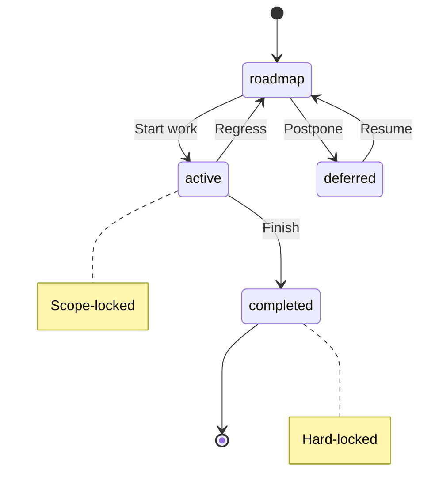

# ✅ ADR 005 Configurable Tag Prefix

**Purpose:** Detailed documentation for the ADR 005 Configurable Tag Prefix pattern

---

## Overview

| Property | Value |
| --- | --- |
| Status | completed |
| Category | DDD |
| Phase | 44 |

## Description

**Context:**
  The delivery process uses `@libar-docs-*` as the default tag prefix for all metadata annotations.
  - Consumers may want to use their own prefix (e.g., `@myorg-docs-*`)
  - Hardcoding the prefix limits package reusability
  - Different projects have different naming conventions
  - The opt-in marker `@libar-docs` may conflict with existing tags

  **Decision:**
  Make the tag prefix configurable through the preset system:
  - Default prefix remains `@libar-docs-` for backward compatibility
  - Consumers can override via `createDeliveryProcess({ tagPrefix: '@myorg-' })`
  - File opt-in tag follows the prefix pattern (`@myorg-docs` if prefix is `@myorg-`)
  - All scanners, extractors, and validators respect the configured prefix
  - Presets define sensible defaults for common use cases

  **Consequences:**
  - (+) Package can be used by any organization without tag conflicts
  - (+) Backward compatible - existing consumers continue to work
  - (+) Presets provide quick configuration for common patterns
  - (-) Slightly more complex configuration API
  - (-) Documentation must clarify which prefix is active

## Acceptance Criteria

**Custom tag prefix is respected by scanner**

- Given a delivery process configured with tagPrefix "@myorg-"
- When scanning a file with @myorg-docs-pattern:MyPattern
- Then the pattern is extracted with name "MyPattern"

**Default prefix remains libar-docs for backward compatibility**

- Given a delivery process created with default options
- When scanning a file with @libar-docs-pattern:MyPattern
- Then the pattern is extracted with name "MyPattern"

## Business Rules

**Preset Quick Reference**

**Context:** Three presets are available with different tag prefixes and category counts.
    Preset definitions are extracted from `src/config/presets.ts` via extract-shapes.

    **Preset Comparison:**

| Preset | Tag Prefix | File Opt-In | Categories | Use Case |
| --- | --- | --- | --- | --- |
| libar-generic (default) | libar-docs- | libar-docs | 3 | Simple projects (this package) |
| generic | docs- | docs | 3 | Simple projects with shorter prefix |
| ddd-es-cqrs | libar-docs- | libar-docs | 21 | DDD/Event Sourcing architectures |

    **Note:** The tag prefix begins with the at-symbol followed by the shown prefix.

**Preset Category Behavior**

**Context:** Presets define complete category sets that replace base taxonomy.
    Category definitions are extracted from `src/config/presets.ts` via extract-shapes.

    **Design Decision:** Preset categories REPLACE base taxonomy (not merged).
    If you need DDD categories (ddd, event-sourcing, cqrs, saga, projection, decider, etc.),
    use the ddd-es-cqrs preset explicitly.

    **Category Counts by Preset:**

| Preset | Category Count | Example Categories |
| --- | --- | --- |
| libar-generic | 3 | core, api, infra |
| generic | 3 | core, api, infra |
| ddd-es-cqrs | 21 | domain, ddd, bounded-context, event-sourcing, decider, cqrs, saga, projection |

**Default Preset Selection**

**Context:** All entry points use consistent defaults.
    Default behavior is documented in `createDeliveryProcess` (factory.ts) and `loadConfig` (config-loader.ts).

    **Default Selection by Entry Point:**

| Entry Point | Default Preset | Categories | Context |
| --- | --- | --- | --- |
| createDeliveryProcess() | libar-generic | 3 | Programmatic API |
| loadConfig() fallback | libar-generic | 3 | CLI tools (no config file) |
| This package config file | libar-generic | 3 | Standalone package usage |

    **Rationale:** Simple defaults for most users.
    Use preset ddd-es-cqrs explicitly if you need the full 21-category DDD taxonomy.

**Libar Generic Preset**

**Context:** Default preset with libar-docs- prefix and 3 categories.
    Full definition extracted from `LIBAR_GENERIC_PRESET` in `src/config/presets.ts`.

    **Preset Properties:**

| Property | Value |
| --- | --- |
| Tag Prefix | libar-docs- |
| File Opt-In | libar-docs |
| Categories | 3 (core, api, infra) |

    **Example Annotation:**

```typescript
/**
     * libar-docs
     * libar-docs-pattern PatternScanner
     * libar-docs-status completed
     * libar-docs-core
     * libar-docs-uses FileDiscovery, ASTParser
     */
    export function scanPatterns(config: ScanConfig): Promise<ScanResult> {}
```

Note: Tag lines above should each be prefixed with the at-symbol.

**Generic Preset**

**Context:** Same 3 categories as libar-generic but with shorter docs- prefix.
    Full definition extracted from `GENERIC_PRESET` in `src/config/presets.ts`.

    **Preset Properties:**

| Property | Value |
| --- | --- |
| Tag Prefix | docs- |
| File Opt-In | docs |
| Categories | 3 (core, api, infra) |

    **Example Annotation:**

```typescript
/**
     * docs
     * docs-pattern PatternScanner
     * docs-status completed
     * docs-core
     */
    export function scanPatterns(config: ScanConfig): Promise<ScanResult> {}
```

Note: Tag lines above should each be prefixed with the at-symbol.

**DDD ES CQRS Preset**

**Context:** Full taxonomy for domain-driven architectures with 21 categories.
    Full definition extracted from `DDD_ES_CQRS_PRESET` in `src/config/presets.ts`.

    **Preset Properties:**

| Property | Value |
| --- | --- |
| Tag Prefix | libar-docs- |
| File Opt-In | libar-docs |
| Categories | 21 |

    **DDD Categories:** See "Complete Category Reference" below for the full 21-category
    list with priorities, descriptions, and aliases.

**Hierarchical Configuration**

**Context:** CLI tools discover config files automatically via directory traversal.
    Discovery logic extracted from `findConfigFile` and `loadConfig` in `src/config/config-loader.ts`.

    **Discovery Order:**

| Step | Location | Action |
| --- | --- | --- |
| 1 | Current directory | Look for delivery-process.config.ts |
| 2 | Parent directories | Walk up to repo root (find .git folder) |
| 3 | Fallback | Use libar-generic preset (3 categories) |

    **Monorepo Strategy:**

| Location | Config File | Typical Preset | Use Case |
| --- | --- | --- | --- |
| Repo root | delivery-process.config.ts | ddd-es-cqrs | Full DDD taxonomy for platform |
| packages/my-package/ | delivery-process.config.ts | generic | Simpler taxonomy for individual package |
| packages/simple/ | (none) | libar-generic (fallback) | Uses root or default |

    CLI tools use the nearest config file to the working directory.

**Config File Format**

**Context:** Config files export a DeliveryProcessInstance.

    **Basic Config File:**

```typescript
// delivery-process.config.ts
    import { createDeliveryProcess } from 'delivery-process-pkg';

    // Default preset
    export default createDeliveryProcess();

    // Or explicit preset
    export default createDeliveryProcess({ preset: 'ddd-es-cqrs' });
```

CLI tools use the nearest config file to the working directory.

**Custom Configuration**

**Context:** Customize tag prefix while keeping preset taxonomy.

    **Custom Configuration Options:**

| Option | Type | Description |
| --- | --- | --- |
| preset | string | Base preset to use (libar-generic, generic, ddd-es-cqrs) |
| tagPrefix | string | Custom tag prefix (replaces preset default) |
| fileOptInTag | string | Custom file opt-in marker |
| categories | array | Custom category definitions (replaces preset categories) |

    **Custom Tag Prefix Example:**

```typescript
const dp = createDeliveryProcess({
      preset: 'libar-generic',
      tagPrefix: 'team-',
      fileOptInTag: 'team',
    });
```

**Custom Categories Example:**

```typescript
const dp = createDeliveryProcess({
      tagPrefix: 'docs-',
      fileOptInTag: 'docs',
      categories: [
        { tag: 'scanner', domain: 'Scanner', priority: 1, description: 'File scanning', aliases: [] },
        { tag: 'extractor', domain: 'Extractor', priority: 2, description: 'Pattern extraction', aliases: [] },
        { tag: 'generator', domain: 'Generator', priority: 3, description: 'Doc generation', aliases: [] },
      ],
    });
```

**RegexBuilders API**

**Context:** DeliveryProcessInstance includes utilities for tag detection.
    API methods extracted from `createRegexBuilders` in `src/config/regex-builders.ts`.

    **RegexBuilders Methods:**

| Method | Return Type | Description |
| --- | --- | --- |
| hasFileOptIn(content) | boolean | Check if file contains opt-in marker |
| hasDocDirectives(content) | boolean | Check for any documentation directives |
| normalizeTag(tag) | string | Normalize tag for lookup (strip prefix) |
| directivePattern | RegExp | Pattern to match documentation directives |

    **Usage Example:**

```typescript
const dp = createDeliveryProcess();

    // Check if file should be scanned
    dp.regexBuilders.hasFileOptIn(fileContent);

    // Check for any documentation directives
    dp.regexBuilders.hasDocDirectives(fileContent);

    // Normalize tag for lookup
    dp.regexBuilders.normalizeTag('libar-docs-pattern');
```

**Programmatic Config Loading**

**Context:** Tools that need to load configuration files dynamically.

    **loadConfig Return Value:**

| Field | Type | Description |
| --- | --- | --- |
| instance | DeliveryProcessInstance | The loaded configuration instance |
| isDefault | boolean | True if no config file was found |
| path | string or undefined | Path to config file (if found) |

    **Usage Example:**

```typescript
import { loadConfig, formatConfigError } from 'delivery-process-pkg/config';

    const result = await loadConfig(process.cwd());

    if (!result.ok) {
      console.error(formatConfigError(result.error));
      process.exit(1);
    }

    const { instance, isDefault, path } = result.value;
```

**Common Configuration Patterns**

**Context:** Frequently used configuration patterns.

    **Pattern Selection Guide:**

| Scenario | Recommended Config | Reason |
| --- | --- | --- |
| Simple library | libar-generic (default) | Minimal categories sufficient |
| DDD microservice | ddd-es-cqrs | Full domain modeling taxonomy |
| Multi-team monorepo | Root: ddd-es-cqrs, packages: vary | Shared taxonomy with package overrides |
| Custom domain vocabulary | Custom categories | Domain-specific terms |
| Shorter annotations | generic preset | Uses docs- prefix vs libar-docs- |

    **Tag Registry Access:**

| Access Pattern | Description |
| --- | --- |
| instance.registry.categories | Array of category definitions |
| instance.registry.statusValues | Valid status values (roadmap, active, completed, deferred) |
| instance.registry.metadataTags | Metadata tag definitions |

**Related Documentation - Configuration**

**Context:** Related documentation for deeper understanding.

| Document | Relationship | Focus |
| --- | --- | --- |
| ARCHITECTURE-REFERENCE.md | Reference | Pipeline and codec architecture |
| TAXONOMY-REFERENCE.md | Reference | Tag definitions, categories, status values |
| INSTRUCTIONS-REFERENCE.md | Reference | Complete annotation guide |
| PROCESS-GUARD-REFERENCE.md | Reference | FSM workflow validation |

**Concept**

**Context:** A taxonomy is a classification system for organizing knowledge.

    **Definition:** In delivery-process, the taxonomy defines the vocabulary for
    pattern annotations. It determines what tags exist, their valid values, and
    how they are parsed from source code.

    **Components:**

| Component | Purpose | Source File |
| --- | --- | --- |
| Categories | Domain classifications (e.g., core, api, ddd) | categories.ts |
| Status Values | FSM states (roadmap, active, completed, deferred) | status-values.ts |
| Format Types | How tag values are parsed (flag, csv, enum) | format-types.ts |
| Hierarchy Levels | Work item levels (epic, phase, task) | hierarchy-levels.ts |
| Risk Levels | Risk assessment (low, medium, high) | risk-levels.ts |
| Layer Types | Feature layer (timeline, domain, integration) | layer-types.ts |

    **Key Principle:** The taxonomy is NOT a fixed schema. Presets select
    different subsets, and you can define custom categories.

**Complete Category Reference**

**Context:** The ddd-es-cqrs preset includes all 21 categories. Simpler
    presets use subsets (core, api, infra for libar-generic).

    **All Categories:**

| Tag | Domain | Priority | Description | Aliases |
| --- | --- | --- | --- | --- |
| domain | Strategic DDD | 1 | Bounded contexts, aggregates, strategic design | - |
| ddd | Domain-Driven Design | 2 | DDD tactical patterns | - |
| bounded-context | Bounded Context | 3 | BC contracts and definitions | - |
| event-sourcing | Event Sourcing | 4 | Event store, aggregates, replay | es |
| decider | Decider | 5 | Decider pattern | - |
| fsm | FSM | 5 | Finite state machine patterns | - |
| cqrs | CQRS | 5 | Command/query separation | - |
| projection | Projection | 6 | Read models, checkpoints | - |
| saga | Saga | 7 | Cross-context coordination, process managers | process-manager |
| command | Command | 8 | Command handlers, orchestration | - |
| arch | Architecture | 9 | Architecture patterns, decisions | - |
| infra | Infrastructure | 10 | Infrastructure, composition root | infrastructure |
| validation | Validation | 11 | Input validation, schemas | - |
| testing | Testing | 12 | Test patterns, BDD | - |
| performance | Performance | 13 | Optimization, caching | - |
| security | Security | 14 | Auth, authorization | - |
| core | Core | 15 | Core utilities | - |
| api | API | 16 | Public APIs | - |
| generator | Generator | 17 | Code generators | - |
| middleware | Middleware | 18 | Middleware patterns | - |
| correlation | Correlation | 19 | Correlation tracking | - |

    **Category Selection Guide:**

| Project Type | Recommended Preset | Categories Available |
| --- | --- | --- |
| Simple utility packages | libar-generic | core, api, infra |
| DDD/Event Sourcing systems | ddd-es-cqrs | All 21 categories |
| Generic projects | generic | core, api, infra |

    **Usage:** Add category tags to patterns using the tag prefix:

```typescript
// For libar-generic preset
    // @libar-docs-core      - marks as core utility
    // @libar-docs-api       - marks as public API
    // @libar-docs-infra     - marks as infrastructure
```

**Format Types**

**Context:** Tags have different value formats that determine parsing.

    **Decision:** Six format types are supported. See `src/taxonomy/format-types.ts`
    for the canonical `FORMAT_TYPES` array with inline documentation.

    **Format Types Reference:**

| Format | Example Tag | Example Value | Parsing Behavior |
| --- | --- | --- | --- |
| flag | @libar-docs-core | (none) | Boolean presence, no value needed |
| value | @libar-docs-pattern | MyPattern | Simple string value |
| enum | @libar-docs-status | completed | Constrained to predefined list |
| csv | @libar-docs-uses | A, B, C | Comma-separated values |
| number | @libar-docs-phase | 15 | Numeric value |
| quoted-value | @libar-docs-brief | 'Multi-word-text' | Preserves quoted values (use hyphens in .feature tags) |

    **Implementation:** The format type is specified in the tag definition
    within the TagRegistry. The extractor uses the format to parse values.

**Status Values**

**Context:** Status values control the FSM workflow for pattern lifecycle.

    **Decision:** Four canonical status values are defined (per PDR-005).
    See `src/taxonomy/status-values.ts` for the `PROCESS_STATUS_VALUES` array
    with inline documentation on FSM transitions and protection levels.

    **Status Values Reference:**

| Status | Protection Level | Description | Editable |
| --- | --- | --- | --- |
| roadmap | None | Planned work, not yet started | Full editing |
| active | Scope-locked | Work in progress | Edit existing only |
| completed | Hard-locked | Work finished | Requires unlock tag |
| deferred | None | On hold, may resume later | Full editing |

    **Valid FSM Transitions:**

| From | To | Trigger |
| --- | --- | --- |
| roadmap | active | Start work |
| roadmap | deferred | Postpone before start |
| active | completed | Finish work |
| active | roadmap | Regress (blocked) |
| deferred | roadmap | Resume planning |

    **FSM Diagram:**



**Normalized Status**

**Context:** Display requires mapping 4 FSM states to 3 presentation buckets.

    **Decision:** Raw status values normalize to display status.
    See `src/taxonomy/normalized-status.ts` for the `STATUS_NORMALIZATION_MAP`
    and `normalizeStatus()` function with complete mapping logic.

    **Rationale:** This separation follows DDD principles - the domain model
    (raw FSM states) is distinct from the view model (normalized display).

**Presets**

**Context:** Different projects need different taxonomy subsets.

    **Decision:** Three presets are available:

| Preset | Categories | Tag Prefix | Use Case |
| --- | --- | --- | --- |
| libar-generic (default) | 3 | libar-docs- | Simple projects (this package) |
| ddd-es-cqrs | 21 | libar-docs- | DDD/Event Sourcing architectures |
| generic | 3 | docs- | Simple projects with docs- prefix |

    **Behavior:** The preset determines which categories are available.
    All presets share the same status values and format types.

**Hierarchy Levels**

**Context:** Work items need hierarchical breakdown for planning.

    **Decision:** Three hierarchy levels are defined (epic, phase, task).
    See `src/taxonomy/hierarchy-levels.ts` for the `HIERARCHY_LEVELS` array
    with JSDoc documentation on duration guidelines and usage.

    **Usage:** The level tag organizes work for roadmap generation.
    Phases can have a parent epic; tasks can have a parent phase.

**Architecture**

**Context:** The taxonomy module structure supports the type-safe annotation system.

    **File Structure:**

```text
src/taxonomy/
      registry-builder.ts   -- buildRegistry() - creates TagRegistry
      categories.ts         -- Category definitions
      status-values.ts      -- FSM state values (PDR-005)
      normalized-status.ts  -- Display normalization (3 buckets)
      format-types.ts       -- Tag value parsing rules
      hierarchy-levels.ts   -- epic/phase/task
      risk-levels.ts        -- low/medium/high
      layer-types.ts        -- timeline/domain/integration/e2e
```

**TagRegistry:** The buildRegistry() function creates a TagRegistry
    containing all taxonomy definitions. It is THE single source of truth.

    **Usage Example:**

```typescript
import { buildRegistry } from '@libar-dev/delivery-process/taxonomy';

    const registry = buildRegistry();
    // registry.tagPrefix       -> "@libar-docs-"
    // registry.fileOptInTag    -> "@libar-docs"
    // registry.categories      -> CategoryDefinition[]
    // registry.metadataTags    -> MetadataTagDefinitionForRegistry[]
```

**Tag Generation**

**Context:** Developers need a reference of all available tags.

    **Decision:** The generate-tag-taxonomy CLI creates a markdown reference:

```bash
npx generate-tag-taxonomy -o TAG_TAXONOMY.md -f
```

**Output:** A markdown file documenting all tags with their formats,
    valid values, and examples - generated from the TagRegistry.

**Related Documentation - Taxonomy**

**Context:** Related documentation for deeper understanding.

| Document | Relationship | Focus |
| --- | --- | --- |
| CONFIGURATION-REFERENCE.md | Reference | Preset configuration and factory API |
| ARCHITECTURE-REFERENCE.md | Reference | Pipeline and codec architecture |
| INSTRUCTIONS-REFERENCE.md | Reference | Complete annotation guide |
| PROCESS-GUARD-REFERENCE.md | Reference | FSM workflow validation |

_Verified by: Custom tag prefix is respected by scanner, Default prefix remains libar-docs for backward compatibility_

---

[← Back to Pattern Registry](../PATTERNS.md)
