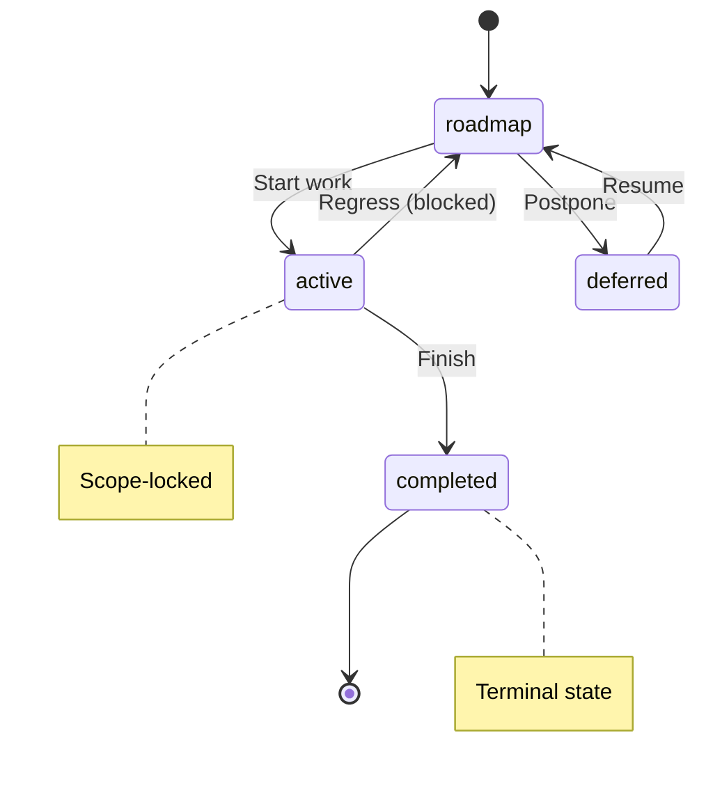
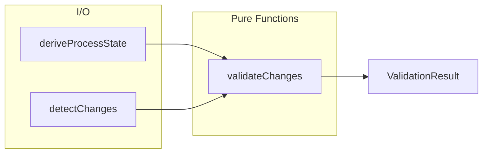

# ADR011PublishingStrategy

**Purpose:** Detailed patterns for ADR011PublishingStrategy

---

## Summary

**Progress:** [████████░░░░░░░░░░░░] 5/12 (42%)

| Status | Count |
| --- | --- |
| ✅ Completed | 5 |
| 🚧 Active | 1 |
| 📋 Planned | 6 |
| **Total** | 12 |

---

## 🚧 Active Patterns

### 🚧 ADR 010 Pattern Naming Conventions

| Property | Value |
| --- | --- |
| Status | active |

**Context:**
  The annotation system uses a tag-based approach where TypeScript JSDoc and Gherkin
  tags drive documentation generation. Without consistent conventions:
  - Tag names vary across files (inconsistent format types)
  - Relationship tags appear in wrong source files (TypeScript vs Gherkin ownership)
  - Hierarchy levels lack defined duration expectations
  - File-level opt-in requirements are unclear to new contributors

  **Decision:**
  Establish standard naming and annotation conventions:
  - File-level opt-in via bare `@libar-docs` marker is mandatory for scanning
  - Tags use defined format types: flag, value, enum, csv, number, quoted-value
  - Relationship tags have source ownership rules (uses in TS, depends-on in Gherkin)
  - Hierarchy levels define duration expectations (epic=multi-quarter, phase=2-5 days)
  - Two-tier spec architecture separates planning from executable specs

  **Consequences:**
  - (+) Consistent annotation patterns across all source files
  - (+) Clear ownership rules prevent cross-source confusion
  - (+) Format types enable precise parsing and validation
  - (+) Anti-pattern detection catches misplaced tags
  - (-) More rules for contributors to learn
  - (-) Existing files may need migration to comply

#### Acceptance Criteria

**ADR generates Instructions Reference documentation**

- Given this decision document with convention tags
- When the reference codec processes pattern-naming convention
- Then the output contains tag reference tables and format types
- And source ownership rules and hierarchy levels are present

#### Business Rules

**Quick Tag Reference**

**Context:** Most commonly used tags for quick lookup.

    **Essential Tags (required for most patterns):**

    | Tag | Format | Purpose | Example Value |
    | --- | --- | --- | --- |
    | pattern | value | Pattern identifier | MyPattern |
    | status | enum | FSM state | roadmap, active, completed |
    | phase | number | Roadmap phase | 15 |
    | core | flag | Mark as essential | (no value) |

    **Relationship Tags:**

    | Tag | Format | Source | Purpose |
    | --- | --- | --- | --- |
    | uses | csv | TypeScript | Runtime dependencies |
    | used-by | csv | TypeScript | Reverse dependencies |
    | depends-on | csv | Gherkin | Planning dependencies |
    | enables | csv | Either | What this unlocks |

    **Process Tags:**

    | Tag | Format | Purpose | Example Value |
    | --- | --- | --- | --- |
    | quarter | value | Timeline | Q1-2026 |
    | effort | value | Estimate | 2d, 4h, 1w |
    | team | value | Assignment | platform-team |
    | priority | enum | Urgency | critical, high, medium, low |

**File-Level Opt-In**

**Context:** Files must explicitly opt-in to be scanned for annotations.

    **Decision:** Add the opt-in marker as the first annotation in a JSDoc comment.

    | Preset | Opt-In Marker | Example |
    | --- | --- | --- |
    | libar-generic | at-libar-docs | JSDoc comment with at-libar-docs |
    | generic | at-docs | JSDoc comment with at-docs |
    | ddd-es-cqrs | at-libar-docs | JSDoc comment with at-libar-docs |

    **Important:** Only files with the opt-in marker are scanned. Files without
    the marker are ignored by the scanner even if they contain other annotations.

**Category Tags**

**Context:** Category tags classify patterns by domain area.

    The full category list (ddd-es-cqrs preset) is extracted from
    `src/taxonomy/categories.ts`. Each category has: tag, domain, priority, description.

    **Simple Presets (generic, libar-generic):** Only core, api, infra categories.

    **Usage:** Add category tag as a flag (no value needed).

**Metadata Tags**

**Context:** Metadata tags are extracted from `src/taxonomy/registry-builder.ts`.
    The `METADATA_TAGS_BY_GROUP` constant organizes all tags into functional groups:
    core, relationship, process, prd, adr, hierarchy, traceability, architecture, extraction.

    Each tag definition includes: tag name, format, purpose, and example.

    **Status Values:** roadmap, active, completed, deferred

**Format Types**

**Context:** Format types define how tag values are parsed.

    | Format | Parsing | Example |
    | --- | --- | --- |
    | flag | Boolean presence (no value) | at-libar-docs-core |
    | value | Simple string | at-libar-docs-pattern MyPattern |
    | enum | Constrained to predefined list | at-libar-docs-status completed |
    | csv | Comma-separated values | at-libar-docs-uses A, B, C |
    | number | Numeric value | at-libar-docs-phase 15 |
    | quoted-value | Preserves spaces | at-libar-docs-brief:'Multi word' |

**Source Ownership**

**Context:** Relationship tags have specific ownership rules.

    Relationship tag definitions are extracted from `src/taxonomy/registry-builder.ts`.
    This table defines WHERE each tag type should be used (architectural guidance):

    | Tag | Correct Location | Wrong Location |
    | --- | --- | --- |
    | uses | TypeScript | Feature files |
    | depends-on | Feature files | TypeScript |

    TypeScript files own runtime dependencies (`uses`).
    Feature files own planning dependencies (`depends-on`).

**Hierarchy Duration**

**Context:** Hierarchy tags organize work into epic, phase, task structure.
    Tag definitions (level, parent) are extracted from `src/taxonomy/registry-builder.ts`.
    This table provides planning guidance for duration estimates:

    | Level | Duration | Description |
    | --- | --- | --- |
    | epic | Multi-quarter | Strategic initiatives |
    | phase | 2-5 days | Standard work units |
    | task | 1-4 hours | Session-level work |

**Two-Tier Spec Architecture**

**Context:** Traceability tags link roadmap specs to executable specs (PDR-007).
    Tag definitions (executable-specs, roadmap-spec) are in `src/taxonomy/registry-builder.ts`.
    This table explains the two-tier architecture:

    | Tier | Location | Purpose |
    | --- | --- | --- |
    | Tier 1 | delivery-process/specs/ | Roadmap and planning specifications |
    | Tier 2 | package/tests/features/ | Executable test specifications |

**CLAUDE.md Generation**

**Context:** The package generates CLAUDE.md files for AI assistant context.

    **Output Locations:**

    | Format | Location | Purpose |
    | --- | --- | --- |
    | Compact | _claude-md/ subdirectories | Minimal AI context (low token cost) |
    | Detailed | docs/ directory | Full human-readable documentation |

    **Section Routing Tag:** Use `claude-md-section` to route patterns to specific
    _claude-md subdirectories. This organizes AI context by domain.

    **Available Sections:**

    | Section Value | Output Directory | Content Type |
    | --- | --- | --- |
    | index | _claude-md/index/ | Navigation and overview |
    | reference | _claude-md/reference/ | Tag and CLI reference |
    | validation | _claude-md/validation/ | Validation rules and process guard |
    | sessions | _claude-md/sessions/ | Session workflow guides |
    | architecture | _claude-md/architecture/ | System architecture |
    | methodology | _claude-md/methodology/ | Core principles |
    | gherkin | _claude-md/gherkin/ | Gherkin writing patterns |
    | config | _claude-md/config/ | Configuration reference |
    | taxonomy | _claude-md/taxonomy/ | Tag taxonomy |
    | publishing | _claude-md/publishing/ | Publishing guides |

**AI Context Optimization**

**Context:** Guidelines for writing content that works well in AI assistant context.

    **Compact vs Detailed Format:**

    | Aspect | Compact (AI) | Detailed (Human) |
    | --- | --- | --- |
    | Token budget | Minimize (cost-sensitive) | No limit |
    | Examples | 1-2 essential | Many with variations |
    | Tables | Dense, reference-style | Expanded with context |
    | Prose | Bullet points preferred | Full sentences OK |
    | Code | Minimal snippets | Full implementations |

    **Content Optimization Guidelines:**

    | Guideline | Rationale |
    | --- | --- |
    | Use tables for reference data | Scannable, low tokens |
    | Prefer bullet lists over paragraphs | AI parses structure well |
    | Include concrete examples | Reduces ambiguity |
    | State constraints explicitly | AI follows rules better |
    | Avoid redundant explanations | Every token costs money |

**Gherkin Integration**

**Context:** Gherkin feature files serve as both executable specs and documentation source.

    **File-Level Tags (at top of .feature file):**

    | Tag | Purpose | Example |
    | --- | --- | --- |
    | at-libar-docs | Opt-in marker | First line in tag block |
    | at-libar-docs-pattern:Name | Pattern identifier | at-libar-docs-pattern:ProcessGuardLinter |
    | at-libar-docs-status:value | FSM status | at-libar-docs-status:roadmap |
    | at-libar-docs-phase:N | Phase number | at-libar-docs-phase:99 |

    **Background Deliverables Table:**

    Use a Background section with a DataTable to define deliverables. The table
    must have columns: Deliverable, Status, Location.

    **Rule Block Structure (for executable spec feature files):**

    | Component | Purpose |
    | --- | --- |
    | Rule: Name | Groups related scenarios |
    | Invariant header | States the business rule |
    | Rationale header | Explains why the rule exists |
    | Verified by header | References scenarios that verify the rule |

    **Scenario Tags:**

    | Tag | Purpose |
    | --- | --- |
    | at-happy-path | Primary success scenario |
    | at-edge-case | Boundary conditions |
    | at-error-handling | Error recovery |
    | at-validation | Input validation |
    | at-acceptance-criteria | Required for DoD validation |
    | at-integration | Cross-component behavior |

    **Feature Description Patterns:**

    | Structure | Headers | Best For |
    | --- | --- | --- |
    | Problem/Solution | Problem and Solution | Pain point to fix |
    | Value-First | Business Value and How It Works | TDD-style specs |
    | Context/Approach | Context and Approach | Technical patterns |

_Verified by: ADR generates Instructions Reference documentation_

---

## 📋 Planned Patterns

### 📋 ADR 009 Pipeline Architecture

| Property | Value |
| --- | --- |
| Status | planned |

**Context:**
  The documentation generation system needs a clear, maintainable architecture that
  transforms annotated source code into multiple output formats:
  - TypeScript and Gherkin files contain annotations as the single source of truth
  - Multiple document types (patterns, roadmap, decisions, etc.) are generated
  - Pre-computed views avoid redundant O(n) passes per section
  - A universal intermediate representation decouples data from rendering

  **Decision:**
  Implement a four-stage pipeline architecture:
  - **Scanner:** File discovery with AST parsing and opt-in detection
  - **Extractor:** Pattern extraction from TypeScript JSDoc and Gherkin tags
  - **Transformer:** Single-pass MasterDataset builder with pre-computed views
  - **Codec:** Zod 4 codecs transform MasterDataset to RenderableDocument to Markdown
  Each stage has clear input/output contracts. Pure functions enable easy testing.

  **Consequences:**
  - (+) Single-pass transformation computes all views in O(n) time
  - (+) Codec system allows multiple output formats from same data
  - (+) RenderableDocument decouples structure from rendering
  - (+) Clear stage boundaries enable independent testing
  - (-) Additional abstraction layers increase initial complexity
  - (-) MasterDataset schema must be kept in sync with all codecs

#### Acceptance Criteria

**ADR generates Architecture Reference documentation**

- Given this decision document with convention tags
- When the reference codec processes pipeline-architecture convention
- Then the output contains pipeline stages and module responsibilities
- And block vocabulary and codec mapping tables are present

#### Business Rules

**Design Principles**

**Context:** The package follows specific architectural principles.

    **Key Design Principles:**

    | Principle | Description |
    | --- | --- |
    | Single Source of Truth | Code and .feature files are authoritative; docs are generated projections |
    | Single-Pass Transformation | All derived views computed in O(n) time, not redundant O(n) per section |
    | Codec-Based Rendering | Zod 4 codecs transform MasterDataset to RenderableDocument to Markdown |
    | Schema-First Validation | Zod schemas define types; runtime validation at all boundaries |
    | Result Monad | Explicit error handling via Result(T,E) instead of exceptions |

    **What This Means for Implementation:**

    | Aspect | Wrong Mental Model | Correct Mental Model |
    | --- | --- | --- |
    | Scope | Build feature for small output here | Build capability for hundreds of files |
    | ROI | Over-engineered for this repo | Multi-day investment saves weeks of maintenance |
    | Testing | Simple feature, basic tests | Mission-critical infra, comprehensive tests |
    | Shortcuts | Good enough for this repo | Must work across many annotated sources |

**Four-Stage Pipeline**

**Context:** The documentation generation pipeline consists of four stages.

    **Pipeline Overview:**

    | Stage | Purpose | Key Files | Input | Output |
    | --- | --- | --- | --- | --- |
    | Scanner | File discovery and AST parsing | pattern-scanner.ts, gherkin-scanner.ts | Source files | ScannedFile[] |
    | Extractor | Pattern extraction from AST | doc-extractor.ts, gherkin-extractor.ts | ScannedFile[] | ExtractedPattern[] |
    | Transformer | Single-pass view computation | transform-dataset.ts | ExtractedPattern[] | MasterDataset |
    | Codec | Document generation | codecs/*.ts, render.ts | MasterDataset | Markdown files |

    **Stage Details:**

    | Stage | Scanner Variant | Purpose | File Discovery |
    | --- | --- | --- | --- |
    | Scanner | TypeScript | Parse .ts files with opt-in | glob patterns, hasFileOptIn check |
    | Scanner | Gherkin | Parse .feature files | glob patterns, tag extraction |
    | Extractor | TypeScript | JSDoc annotation extraction | AST parsing, directive extraction |
    | Extractor | Gherkin | Tag and scenario extraction | Cucumber parser, tag mapping |

**Module Responsibilities**

**Context:** The codebase is organized into modules with specific responsibilities.

    **Core Modules:**

    | Module | Location | Purpose |
    | --- | --- | --- |
    | config | src/config/ | Configuration factory, presets (generic, libar-generic, ddd-es-cqrs) |
    | taxonomy | src/taxonomy/ | Tag definitions - categories, status values, format types |
    | scanner | src/scanner/ | TypeScript and Gherkin file scanning |
    | extractor | src/extractor/ | Pattern extraction from AST/Gherkin |
    | generators | src/generators/ | Document generators and orchestrator |
    | renderable | src/renderable/ | Markdown codec system |
    | validation | src/validation/ | FSM validation, DoD checks, anti-patterns |
    | lint | src/lint/ | Pattern linting and process guard |
    | api | src/api/ | Process State API for programmatic access |

    **Key Files by Function:**

    | Function | File | Description |
    | --- | --- | --- |
    | Entry point | src/config/factory.ts | createDeliveryProcess() factory |
    | TS scanning | src/scanner/pattern-scanner.ts | TypeScript file discovery and opt-in |
    | Gherkin scanning | src/scanner/gherkin-scanner.ts | Feature file discovery |
    | TS extraction | src/extractor/doc-extractor.ts | Pattern extraction from AST |
    | Gherkin extraction | src/extractor/gherkin-extractor.ts | Pattern extraction from tags |
    | Transformation | src/generators/pipeline/transform-dataset.ts | MasterDataset builder |
    | Orchestration | src/generators/orchestrator.ts | Full pipeline coordination |
    | Codecs | src/renderable/codecs/*.ts | Document type codecs |
    | Rendering | src/renderable/renderer.ts | Block to markdown conversion |

**MasterDataset Schema**

**Context:** MasterDataset is the central data structure with all pre-computed views.

    **Schema Structure:**

    | Field | Type | Description |
    | --- | --- | --- |
    | patterns | ExtractedPattern[] | All patterns from both sources |
    | tagRegistry | TagRegistry | Category and tag definitions |
    | byStatus | StatusGroups | Grouped by completed, active, planned |
    | byPhase | PhaseGroup[] | Grouped by phase with counts |
    | byQuarter | Record(string, ExtractedPattern[]) | Grouped by quarter (e.g., "Q4-2024") |
    | byCategory | Record(string, ExtractedPattern[]) | Grouped by category |
    | bySource | SourceViews | Grouped by typescript, gherkin, roadmap, prd |
    | counts | StatusCounts | Aggregate status counts |
    | relationshipIndex | Record(string, RelationshipEntry) | Dependency graph (uses, usedBy, dependsOn, enables) |
    | archIndex | ArchIndex | Optional architecture index for diagrams |

    **Pre-computed Views (O(1) Access):**

    | View | Access Pattern | Use Case |
    | --- | --- | --- |
    | byStatus.completed | dataset.byStatus.completed | List completed patterns |
    | byStatus.active | dataset.byStatus.active | List active patterns |
    | byStatus.planned | dataset.byStatus.planned | List planned patterns |
    | byPhase | dataset.byPhase[0].patterns | Get phase patterns with counts |
    | byCategory | dataset.byCategory['core'] | Get patterns by category |
    | bySource.typescript | dataset.bySource.typescript | Get TypeScript-origin patterns |
    | bySource.gherkin | dataset.bySource.gherkin | Get Gherkin-origin patterns |

    See src/validation-schemas/master-dataset.ts for the complete Zod schema.

**RenderableDocument Schema**

**Context:** RenderableDocument is the universal intermediate format.

    **Document Structure:**

    | Field | Type | Description |
    | --- | --- | --- |
    | title | string | Document title (becomes H1) |
    | purpose | string (optional) | Description (rendered as blockquote) |
    | detailLevel | string (optional) | Detail level indicator |
    | sections | SectionBlock[] | Array of content blocks |
    | additionalFiles | Record(string, RenderableDocument) | Progressive disclosure detail files |

    See src/renderable/schema.ts for block builders and type definitions.

**Block Vocabulary**

**Context:** RenderableDocument uses a fixed vocabulary of 9 section block types.

    **Block Categories:**

    | Category | Block Types | Markdown Output |
    | --- | --- | --- |
    | Structural | heading, paragraph, separator | Headings, text, horizontal rules |
    | Content | table, list, code, mermaid | tables, lists, fenced code |
    | Progressive | collapsible, link-out | details/summary, links to files |

    **Block Type Reference:**

    | Block | Key Properties | Usage | Markdown Output |
    | --- | --- | --- | --- |
    | heading | level (1-6), text | Section headers | Heading with level |
    | paragraph | text | Body text | Plain text |
    | separator | (none) | Horizontal rules | --- |
    | table | columns, rows, alignment | Data tables | Pipe tables |
    | list | ordered, items | Bullet or numbered lists | - item or 1. item |
    | code | language, content | Code snippets | Fenced code blocks |
    | mermaid | content | Mermaid diagrams | mermaid code block |
    | collapsible | summary, content | Expandable sections | details/summary HTML |
    | link-out | text, path | Links to detail files | Markdown link |

    **Block Builder Functions:**

    | Function | Signature | Example |
    | --- | --- | --- |
    | heading | heading(level, text) | heading(2, 'Summary') |
    | paragraph | paragraph(text) | paragraph('Some text') |
    | table | table(columns, rows, alignment) | table(['Col'], [['Val']]) |
    | list | list(items, ordered) | list(['Item 1', 'Item 2']) |
    | code | code(language, content) | code('typescript', 'const x = 1') |
    | mermaid | mermaid(content) | mermaid('graph LR; A-->B') |
    | collapsible | collapsible(summary, content) | collapsible('Details', [...]) |
    | linkOut | linkOut(text, path) | linkOut('See more', './detail.md') |

**Codec Factory Pattern**

**Context:** Every codec provides both a default instance and a factory function.

    **Two-Export Pattern:**

```typescript
// Default codec with standard options
    import { PatternsDocumentCodec } from './codecs';
    const doc = PatternsDocumentCodec.decode(dataset);

    // Factory for custom options
    import { createPatternsCodec } from './codecs';
    const codec = createPatternsCodec({ generateDetailFiles: false });
    const doc = codec.decode(dataset);
```

**Common Codec Options:**

    | Option | Type | Default | Description |
    | --- | --- | --- | --- |
    | generateDetailFiles | boolean | true | Create progressive disclosure files |
    | detailLevel | summary/standard/detailed | standard | Output verbosity |
    | limits.recentItems | number | 10 | Max recent items in summaries |
    | limits.collapseThreshold | number | 5 | Items before collapsing |

    **Codec Implementation Pattern:**

    | Step | Description | Code Location |
    | --- | --- | --- |
    | Define options | TypeScript interface for codec options | codecs/types.ts |
    | Create factory | Function returning configured codec | codecs/*-codec.ts |
    | Implement decode | Transform MasterDataset to RenderableDocument | codecs/*-codec.ts |
    | Export defaults | Pre-configured default codec instance | codecs/index.ts |

**Available Codecs**

**Context:** The package provides multiple specialized codecs for different documentation needs.

    **Codec Categories:**

    | Category | Codecs | Purpose |
    | --- | --- | --- |
    | Pattern-Focused | patterns, requirements, adrs | Pattern registries, requirements, decisions |
    | Timeline-Focused | roadmap, milestones, current, changelog, overview | Roadmaps, history, active work, releases, project overview |
    | Session-Focused | session, remaining, pr-changes, traceability | Session context, remaining work, PR changes |
    | Planning | planning-checklist, session-plan, session-findings | Planning checklists, session plans, findings |

    **Codec to Output File Mapping:**

    | Codec | Primary Output | Detail Files |
    | --- | --- | --- |
    | PatternsDocumentCodec | PATTERNS.md | patterns/category.md |
    | RoadmapDocumentCodec | ROADMAP.md | phases/phase-N-name.md |
    | CompletedMilestonesCodec | COMPLETED-MILESTONES.md | milestones/quarter.md |
    | CurrentWorkCodec | CURRENT-WORK.md | current/phase-N-name.md |
    | RequirementsDocumentCodec | PRODUCT-REQUIREMENTS.md | requirements/area-slug.md |
    | SessionContextCodec | SESSION-CONTEXT.md | sessions/phase-N-name.md |
    | RemainingWorkCodec | REMAINING-WORK.md | remaining/phase-N-name.md |
    | AdrDocumentCodec | DECISIONS.md | decisions/category-slug.md |
    | ChangelogCodec | CHANGELOG.md | (none) |
    | PrChangesCodec | working/PR-CHANGES.md | (none) |
    | TraceabilityCodec | TRACEABILITY.md | (none) |
    | OverviewCodec | OVERVIEW.md | (none) |
    | PlanningChecklistCodec | PLANNING-CHECKLIST.md | (none) |
    | SessionPlanCodec | SESSION-PLAN.md | (none) |
    | SessionFindingsCodec | SESSION-FINDINGS.md | (none) |

    See src/renderable/generate.ts for the complete DOCUMENT_TYPES registry.

**Progressive Disclosure**

**Context:** Large documents are split into main index plus detail files.

    **Split Logic by Codec:**

    | Codec | Split By | Detail Path Pattern |
    | --- | --- | --- |
    | patterns | Category | patterns/category.md |
    | roadmap | Phase | phases/phase-N-name.md |
    | milestones | Quarter | milestones/quarter.md |
    | current | Active Phase | current/phase-N-name.md |
    | requirements | Product Area | requirements/area-slug.md |
    | session | Incomplete Phase | sessions/phase-N-name.md |
    | remaining | Incomplete Phase | remaining/phase-N-name.md |
    | adrs | Category (at threshold) | decisions/category-slug.md |
    | pr-changes | None | Single file only |

    **Detail Level Options:**

    | Value | Behavior | Use Case |
    | --- | --- | --- |
    | summary | Minimal output, key metrics only | AI context, quick reference |
    | standard | Default with all sections | Regular documentation |
    | detailed | Maximum detail, all optional sections | Deep reference |

**Status Normalization**

**Context:** Source annotations use various status values that must be normalized.

    **Status Mapping:**

    | Input Status | Normalized To | Display Category |
    | --- | --- | --- |
    | completed | completed | Done |
    | active | active | In Progress |
    | roadmap | planned | Future Work |
    | deferred | planned | Future Work |
    | undefined | planned | Future Work |

    See src/taxonomy/normalized-status.ts for STATUS_NORMALIZATION_MAP and normalizeStatus.

**Codec to Generator Mapping**

**Context:** Each codec is exposed via a CLI generator flag.

    **Generator CLI Flags:**

    | Generator Name | Codec | CLI Flag | Output |
    | --- | --- | --- | --- |
    | patterns | PatternsDocumentCodec | -g patterns | PATTERNS.md |
    | roadmap | RoadmapDocumentCodec | -g roadmap | ROADMAP.md |
    | milestones | CompletedMilestonesCodec | -g milestones | COMPLETED-MILESTONES.md |
    | current | CurrentWorkCodec | -g current | CURRENT-WORK.md |
    | requirements | RequirementsDocumentCodec | -g requirements | PRODUCT-REQUIREMENTS.md |
    | session | SessionContextCodec | -g session | SESSION-CONTEXT.md |
    | remaining | RemainingWorkCodec | -g remaining | REMAINING-WORK.md |
    | adrs | AdrDocumentCodec | -g adrs | DECISIONS.md |
    | changelog | ChangelogCodec | -g changelog | CHANGELOG.md |
    | traceability | TraceabilityCodec | -g traceability | TRACEABILITY.md |
    | overview-rdm | OverviewCodec | -g overview-rdm | OVERVIEW.md |
    | pr-changes | PrChangesCodec | -g pr-changes | working/PR-CHANGES.md |
    | planning-checklist | PlanningChecklistCodec | -g planning-checklist | PLANNING-CHECKLIST.md |
    | session-plan | SessionPlanCodec | -g session-plan | SESSION-PLAN.md |
    | session-findings | SessionFindingsCodec | -g session-findings | SESSION-FINDINGS.md |

    See src/renderable/generate.ts for DOCUMENT_TYPES, CODEC_MAP, and CODEC_FACTORY_MAP.

**Result Monad Pattern**

**Context:** The package uses explicit error handling instead of exceptions.

    **Result Type Definition:**

```typescript
type Result<T, E> = { ok: true; value: T } | { ok: false; error: E };
```

**Benefits:**

    | Benefit | Description |
    | --- | --- |
    | No exception swallowing | Errors must be explicitly handled |
    | Partial success | Can return partial results with warnings |
    | Type-safe | Compiler enforces error handling at boundaries |
    | Composable | Results can be chained and transformed |

**Orchestrator Pipeline**

**Context:** The orchestrator coordinates the complete documentation generation pipeline.

    **Orchestrator Steps:**

    | Step | Operation | Key Function | Description |
    | --- | --- | --- | --- |
    | 1 | Load configuration | loadConfig() | Find and load config file |
    | 2 | Scan TypeScript | scanPatterns() | Discover .ts files with opt-in |
    | 3 | Extract TypeScript | extractPatterns() | Parse JSDoc annotations |
    | 4 | Scan Gherkin | scanGherkinFiles() | Discover .feature files |
    | 5 | Extract Gherkin | extractPatternsFromGherkin() | Parse tags and scenarios |
    | 6 | Merge patterns | mergePatterns() | Combine with conflict detection |
    | 7 | Compute hierarchy | computeHierarchyChildren() | Build parent-child relationships |
    | 8 | Transform | transformToMasterDataset() | Build pre-computed views |
    | 9 | Run codecs | Codec.decode() | Generate RenderableDocuments |
    | 10 | Write files | fs.writeFile() | Output markdown files |

    **Error Handling in Pipeline:**

    | Stage | Error Type | Recovery |
    | --- | --- | --- |
    | Config load | ConfigLoadError | Use default preset |
    | Scan | ScanError | Return empty patterns |
    | Extract | ExtractError | Skip malformed patterns |
    | Merge | ConflictError | Return error to caller |
    | Transform | (none) | Pure function, no errors |
    | Codec | (none) | Pure function, no errors |
    | Write | WriteError | Return error to caller |

_Verified by: ADR generates Architecture Reference documentation_

---

### 📋 ADR 011 Publishing Strategy

| Property | Value |
| --- | --- |
| Status | planned |

**Context:**
  Publishing the package to npm requires following specific versioning strategies,
  workflow steps, and troubleshooting procedures:
  - Pre-release and stable release workflows differ significantly
  - Git hooks enforce quality gates before commit and push
  - Dry runs are essential to prevent publishing mistakes
  - Post-publish verification ensures package availability

  **Decision:**
  Standardize publishing with two distribution tags and automated scripts:
  - **pre** tag for pre-releases (testing, 1.0.0-pre.N format)
  - **latest** tag for stable releases (production-ready)
  - Release scripts handle version bump, build, commit, tag, and push
  - Pre-commit and pre-push hooks enforce quality gates
  - Dry run workflow before every actual publish

  **Consequences:**
  - (+) Consistent publishing workflow reduces human error
  - (+) Git hooks catch issues before they reach npm
  - (+) Two-tag strategy allows safe testing before stable release
  - (+) Automated scripts eliminate manual version management
  - (-) Additional tooling to maintain (Husky, release scripts)
  - (-) Hook failures can be frustrating during rapid development

#### Acceptance Criteria

**ADR generates Publishing Reference documentation**

- Given this decision document with convention tags
- When the reference codec processes publishing convention
- Then the output contains version strategy and release workflow tables
- And pre-publish checklist and troubleshooting tables are present

#### Business Rules

**Prerequisites**

**Context:** Before publishing, developers must meet these prerequisites.

    **Requirements:**

    1. npm account with access to at-libar-dev organization

    2. Logged in to npm (run: npm login)

    3. All tests passing (run: pnpm test)

    4. Build completes successfully (run: pnpm build)

    5. Typecheck passes (run: pnpm typecheck)

**Pre-Publish Checklist**

**Context:** Complete this checklist before every publish to avoid common issues.

    **Checklist:**

    | Step | Command | Expected Result |
    | --- | --- | --- |
    | 1. Verify npm login | npm whoami | Shows your username |
    | 2. Run tests | pnpm test | All tests pass |
    | 3. Run typecheck | pnpm typecheck | No type errors |
    | 4. Build package | pnpm build | Clean compilation |
    | 5. Verify dist/ is current | git status | No uncommitted changes |
    | 6. Run dry-run | npm publish --dry-run --access public | Preview looks correct |
    | 7. Check version | grep version package.json | Version is correct |

    **Common Pre-Publish Mistakes:**

    | Mistake | Prevention |
    | --- | --- |
    | Stale dist/ directory | Always run pnpm build before commit |
    | Wrong version number | Use release scripts, not manual edits |
    | Missing npm login | Run npm whoami before publish |
    | Uncommitted changes | Run git status before publish |

**Package Configuration**

**Context:** The package.json configuration controls what gets published.

    **Key Configuration Fields:**

    | Field | Value | Purpose |
    | --- | --- | --- |
    | name | @libar-dev/delivery-process | Scoped package name |
    | version | X.Y.Z or X.Y.Z-pre.N | Current version |
    | main | dist/index.js | CommonJS entry point |
    | module | dist/index.mjs | ES module entry point |
    | types | dist/index.d.ts | TypeScript declarations |
    | files | ["dist", "bin"] | Files included in package |
    | publishConfig.access | public | Required for scoped packages |

    **Files Array:** The files array controls what gets published. Only dist/
    and bin/ directories are included. Source code (src/) is excluded.

**Version Strategy**

**Context:** The package uses semantic versioning with pre-release tags.

    **Decision:** Two distribution tags are used:

    | Tag | Purpose | Install Command |
    | --- | --- | --- |
    | latest | Stable releases (production-ready) | npm i @libar-dev/delivery-process |
    | pre | Pre-releases (testing, 1.0.0-pre.N) | npm i @libar-dev/delivery-process at-pre |

    **Version Format:**

    | Version Type | Format | Example |
    | --- | --- | --- |
    | Pre-release | X.Y.Z-pre.N | 1.0.0-pre.0, 1.0.0-pre.1 |
    | Patch | X.Y.Z | 1.0.1 |
    | Minor | X.Y.0 | 1.1.0 |
    | Major | X.0.0 | 2.0.0 |

**Pre-releases**

**Context:** Pre-releases allow testing before marking as stable.

    **First Pre-release Workflow:**

```bash
npm version 1.0.0-pre.0 --no-git-tag-version
    pnpm build
    git add -A
    git commit -m "chore: prepare 1.0.0-pre.0"
    git tag v1.0.0-pre.0
    git push && git push --tags

    npm publish --tag pre --access public
```

**What This Does:**

    | Step | Command | Effect |
    | --- | --- | --- |
    | 1 | npm version | Sets version in package.json |
    | 2 | pnpm build | Compiles TypeScript to dist/ |
    | 3 | git add/commit | Stages and commits version bump |
    | 4 | git tag | Creates version tag |
    | 5 | git push | Pushes code and tag to remote |
    | 6 | npm publish | Publishes to npm with pre tag |

**Subsequent Pre-releases**

**Context:** After the first pre-release, subsequent ones use the release:pre script.

    **Subsequent Pre-release Workflow:**

```bash
pnpm release:pre
    npm publish --tag pre --access public
```

**What Happens:**

    - Version bumps from 1.0.0-pre.0 to 1.0.0-pre.1

    - Changes are committed and tagged automatically

    - Push to remote includes tags

**Stable Releases**

**Context:** Stable releases are marked as latest and are production-ready.

    **Patch Release (X.Y.Z to X.Y.Z+1):**

```bash
pnpm release:patch
    npm publish --access public
```

**Minor Release (X.Y.Z to X.Y+1.0):**

```bash
pnpm release:minor
    npm publish --access public
```

**Major Release (X.Y.Z to X+1.0.0):**

```bash
pnpm release:major
    npm publish --access public
```

**When to Use Each:**

    | Release Type | When to Use |
    | --- | --- |
    | Patch | Bug fixes, documentation updates, no new features |
    | Minor | New features, backward-compatible changes |
    | Major | Breaking changes, API incompatibilities |

**Release Scripts**

**Context:** The package provides pnpm scripts for consistent releases.

    **Available Release Scripts:**

    | Script | Command | What It Does |
    | --- | --- | --- |
    | release:pre | pnpm release:pre | Bumps pre-release version, commits, tags, pushes |
    | release:patch | pnpm release:patch | Bumps patch version, commits, tags, pushes |
    | release:minor | pnpm release:minor | Bumps minor version, commits, tags, pushes |
    | release:major | pnpm release:major | Bumps major version, commits, tags, pushes |

    **Script Workflow:** Each release script performs these steps automatically:

    1. Bumps version in package.json

    2. Runs pnpm build

    3. Creates git commit with version message

    4. Creates git tag (e.g., v1.0.1)

    5. Pushes commit and tag to remote

    **After Running Script:** You must still run npm publish manually.

**Automated Publishing**

**Context:** GitHub Actions can automate publishing when creating releases.

    **GitHub Release Workflow:**

    1. Go to GitHub repository

    2. Navigate to Releases

    3. Click Create a new release

    4. Create a tag (e.g., v1.0.0-pre.0)

    5. Check Set as a pre-release for pre-releases

    6. Click Publish release

    **What the Workflow Does:**

    | Step | Action |
    | --- | --- |
    | 1 | Runs test suite |
    | 2 | Builds the package |
    | 3 | Publishes to npm with appropriate tag |

    **Tag Selection:**

    | Release Type | npm Tag |
    | --- | --- |
    | Pre-release | pre |
    | Stable | latest |

    **Required Secret:** NPM_TOKEN - npm automation token with publish permissions.

**Git Hooks**

**Context:** The repository uses Husky for git hooks to prevent common issues.

    **Pre-commit Hook:**

    | Check | Command | Purpose |
    | --- | --- | --- |
    | Lint staged files | lint-staged | ESLint + Prettier on changed files |
    | Type check | pnpm typecheck | Catch type errors before commit |

    **Pre-push Hook:**

    | Check | Command | Purpose |
    | --- | --- | --- |
    | Full test suite | pnpm test | Ensure all tests pass |
    | Build | pnpm build | Verify compilation succeeds |
    | dist/ sync | git diff | Ensures dist/ matches source |

    **Why dist/ Sync Matters:**

    The pre-push hook verifies that committed dist/ files match the current build.
    This ensures the published package always reflects the latest source code.
    If dist/ is stale, the push will fail with an error.

**Dry Run**

**Context:** Always test publishing with --dry-run before actual publish.

    **Dry Run Command:**

```bash
npm publish --dry-run --tag pre --access public
```

**What It Shows:**

    - Package name and version

    - Files that would be included

    - Total package size

    - Any publishing errors (without actually publishing)

**Verification**

**Context:** After publishing, verify the package is correctly available.

    **Check npm Registry:**

```bash
npm view @libar-dev/delivery-process
```

**Verification Checklist:**

    | Check | Expected Result |
    | --- | --- |
    | npm view shows version | Correct version number |
    | Installation succeeds | No dependency errors |
    | Package size reasonable | Similar to previous releases |

**Troubleshooting**

**Context:** Common publishing issues and their solutions.

    **Common Issues:**

    | Issue | Cause | Solution |
    | --- | --- | --- |
    | dist/ is out of sync error | dist/ differs from committed version | pnpm build, git add dist/, git commit --amend --no-edit, git push |
    | Authentication error | Not logged in to npm | npm login, npm whoami |
    | Package not found after publish | npm propagation delay | Wait a few minutes, then npm cache clean --force |
    | Permission denied | No access to at-libar-dev org | Request access from organization admin |
    | Version already exists | Version was previously published | Bump version number and retry |

_Verified by: ADR generates Publishing Reference documentation_

---

### 📋 Prd Implementation Section

| Property | Value |
| --- | --- |
| Status | planned |
| Effort | 3d |

**Problem:** Implementation files with `@libar-docs-implements:PatternName` contain rich
  relationship metadata (`@libar-docs-uses`, `@libar-docs-used-by`, `@libar-docs-usecase`)
  that is not rendered in generated PRD documentation. This metadata provides valuable API
  guidance and dependency information.

  **Solution:** Extend the PRD generator to collect all files with `@libar-docs-implements:X`
  and render their metadata in a dedicated "## Implementations" section. This leverages the
  relationship model from PatternRelationshipModel without requiring specs to list file paths.

  **Business Value:**
  | Benefit | How |
  | PRDs include implementation context | `implements` files auto-discovered and rendered |
  | Dependency visibility | `uses`/`used-by` from implementations shown in PRD |
  | Usage guidance in docs | `usecase` annotations rendered as "When to Use" |
  | Zero manual sync | Code declares relationship, PRD reflects it |

#### Acceptance Criteria

**Implementations discovered from relationship index**

- Given a roadmap spec with `@libar-docs-pattern:EventStoreDurability`
- And three TypeScript files with `@libar-docs-implements:EventStoreDurability`
- When the PRD generator processes the pattern
- Then all three implementation files are discovered
- And no directory path is needed in the spec

**Multiple implementations aggregated**

- Given pattern "EventStoreDurability" with implementations:
- When the PRD generator runs
- Then the "## Implementations" section lists both files
- And each file's metadata is rendered separately

| File | Uses | Usecase |
| --- | --- | --- |
| outbox.ts | Workpool, ActionRetrier | "Capture external results" |
| idempotentAppend.ts | EventStore | "Prevent duplicate events" |

**Implementations section generated in PRD**

- Given a pattern with implementation files
- When the PRD generator runs
- Then the output includes "## Implementations"
- And each file is listed with its relative path

**Dependencies rendered per implementation**

- Given implementation file with `@libar-docs-uses EventStore, Workpool`
- When rendered in PRD
- Then output includes "**Dependencies:** EventStore, Workpool"

**Usecases rendered as guidance**

- Given implementation file with `@libar-docs-usecase "When event append must survive failures"`
- When rendered in PRD
- Then output includes "**When to Use:** When event append must survive failures"

**Used-by rendered for visibility**

- Given implementation file with `@libar-docs-used-by CommandOrchestrator, SagaEngine`
- When rendered in PRD
- Then output includes "**Used By:** CommandOrchestrator, SagaEngine"

**Section omitted when no implementations exist**

- Given a pattern "FuturePattern" with status "roadmap"
- And no files have `@libar-docs-implements:FuturePattern`
- When the PRD generator runs
- Then the output does not include "## Implementations"

#### Business Rules

**PRD generator discovers implementations from relationship index**

**Invariant:** When generating PRD for pattern X, the generator queries the
    relationship index for all files where `implements === X`. No explicit listing
    in the spec file is required.

    **Rationale:** The `@libar-docs-implements` tag creates a backward link from
    code to spec. The relationship index aggregates these. PRD generation simply
    queries the index rather than scanning directories.

    **Verified by:** Implementations discovered, Multiple files aggregated

_Verified by: Implementations discovered from relationship index, Multiple implementations aggregated_

**Implementation metadata appears in dedicated PRD section**

**Invariant:** The PRD output includes a "## Implementations" section listing
    all files that implement the pattern. Each file shows its `uses`, `usedBy`,
    and `usecase` metadata in a consistent format.

    **Rationale:** Developers reading PRDs benefit from seeing the implementation
    landscape alongside requirements, without cross-referencing code files.

    **Verified by:** Section generated, Dependencies rendered, Usecases rendered

_Verified by: Implementations section generated in PRD, Dependencies rendered per implementation, Usecases rendered as guidance, Used-by rendered for visibility_

**Patterns without implementations render cleanly**

**Invariant:** If no files have `@libar-docs-implements:X` for pattern X,
    the "## Implementations" section is omitted (not rendered as empty).

    **Rationale:** Planned patterns may not have implementations yet. Empty
    sections add noise without value.

    **Verified by:** Section omitted when empty

_Verified by: Section omitted when no implementations exist_

---

### 📋 Status Aware Eslint Suppression

| Property | Value |
| --- | --- |
| Status | planned |
| Effort | 2d |

**Problem:**
  Design artifacts (code stubs with `@libar-docs-status roadmap`) intentionally have unused
  exports that define API shapes before implementation. Current workaround uses directory-based
  ESLint exclusions which:
  - Don't account for status transitions (roadmap -> active -> completed)
  - Create tech debt when implementations land (exclusions persist)
  - Require manual maintenance as files move between statuses

  **Solution:**
  Extend the Process Guard Linter infrastructure with an ESLint integration that:
  1. Reads `@libar-docs-status` from file-level JSDoc comments
  2. Maps status to protection level using existing `deriveProcessState()`
  3. Generates dynamic ESLint configuration or filters messages at runtime
  4. Removes the need for directory-based exclusions entirely

  **Why It Matters:**
  | Benefit | How |
  | Automatic lifecycle handling | Files graduating from roadmap to completed automatically get strict linting |
  | Zero maintenance | No manual exclusion updates when files change status |
  | Consistency with Process Guard | Same status extraction logic, same protection level mapping |
  | Tech debt elimination | Removes ~20 lines of directory-based exclusions from eslint.config.js |

#### Acceptance Criteria

**Roadmap file has relaxed unused-vars rules**

- Given a TypeScript file with JSDoc containing:
- When ESLint processes the file with the status-aware processor
- Then unused exports "ReservationResult" and "reserve" are NOT reported as errors
- And if reported, severity is "warn" not "error"

```typescript
/**
 * @libar-docs
 * @libar-docs-pattern ReservationPattern
 * @libar-docs-status roadmap
 */
export interface ReservationResult {
  reservationId: string;
}

export function reserve(): void {
  throw new Error("Not implemented");
}
```

**Completed file has strict unused-vars rules**

- Given a TypeScript file with JSDoc containing:
- When ESLint processes the file with the status-aware processor
- Then unused exports "CMSState" ARE reported as errors
- And severity is "error"

```typescript
/**
 * @libar-docs
 * @libar-docs-pattern CMSDualWrite
 * @libar-docs-status completed
 */
export interface CMSState {
  id: string;
}
```

**File without status tag has strict rules**

- Given a TypeScript file without any @libar-docs-status tag
- When ESLint processes the file with the status-aware processor
- Then unused exports ARE reported as errors
- And the default strict configuration applies

**Protection level matches Process Guard derivation**

- Given a file with @libar-docs-status:roadmap
- When Process Guard derives protection level
- And ESLint processor derives protection level
- Then both return "none"

**Status-to-protection mapping is consistent**

- Given the following status values:
- When ESLint processor maps each status
- Then all mappings match Process Guard behavior

| Status | Expected Protection |
| --- | --- |
| roadmap | none |
| deferred | none |
| active | scope |
| complete | hard |

**Processor filters messages in postprocess**

- Given ESLint reports these messages for a roadmap file:
- When the status-aware processor runs postprocess
- Then messages are filtered out (removed) or downgraded to severity 1 (warn)

| ruleId | severity | message |
| --- | --- | --- |
| @typescript-eslint/no-unused-vars | 2 | 'ReservationResult' is defined but never used |
| @typescript-eslint/no-unused-vars | 2 | 'reserve' is defined but never used |

**No source code modification occurs**

- Given a TypeScript file with @libar-docs-status:roadmap
- When the processor runs
- Then file content on disk is unchanged
- And no eslint-disable comments are present in the file

**Non-relaxed rules pass through unchanged**

- Given a roadmap file with a non-unused-vars error:
- When the status-aware processor runs postprocess
- Then the no-explicit-any error is preserved unchanged

| ruleId | severity | message |
| --- | --- | --- |
| @typescript-eslint/no-explicit-any | 2 | Unexpected any |

**CLI generates ESLint ignore file list**

- Given the codebase contains files with statuses:
- When running "pnpm lint:process --eslint-ignores"
- Then output includes "src/dcb/execute.ts"
- And output includes "src/dcb/types.ts"
- And output does NOT include "src/cms/dual-write.ts"
- And output format is glob patterns suitable for eslint.config.js

| File | Status |
| --- | --- |
| src/dcb/execute.ts | roadmap |
| src/dcb/types.ts | roadmap |
| src/cms/dual-write.ts | complete |

**JSON output mode for programmatic consumption**

- When running "pnpm lint:process --eslint-ignores --json"
- Then output is valid JSON
- And JSON contains array of file paths with protection level "none"

**Directory exclusions are removed after migration**

- Given the status-aware processor is integrated
- When reviewing eslint.config.js
- Then lines 30-57 (directory-based exclusions) are removed
- And the processor handles all status-based suppression

**Existing roadmap files still pass lint**

- Given roadmap files that previously relied on directory exclusions:
- When running "pnpm lint" after migration
- Then files pass lint (no unused-vars errors)
- And files have @libar-docs-status:roadmap annotations

| File |
| --- |
| delivery-process/stubs/reservation-pattern/reservation-pattern.ts |
| delivery-process/stubs/durability-types/durability-types.ts |

**Default configuration relaxes no-unused-vars**

- Given the processor is used with default configuration
- When processing a roadmap file
- Then @typescript-eslint/no-unused-vars is relaxed
- And all other rules are strict

**Custom rules can be configured for relaxation**

- Given processor configuration:
- When processing a roadmap file with empty interfaces
- Then both rules are relaxed for the file

```javascript
statusAwareProcessor({
  relaxedRules: [
    "@typescript-eslint/no-unused-vars",
    "@typescript-eslint/no-empty-interface",
  ],
})
```

#### Business Rules

**File status determines unused-vars enforcement**

**Invariant:** Files with `@libar-docs-status roadmap` or `deferred` have relaxed
    unused-vars rules. Files with `active`, `completed`, or no status have strict enforcement.

    **Rationale:** Design artifacts (roadmap stubs) define API shapes that are intentionally
    unused until implementation. Relaxing rules for these files prevents false positives
    while ensuring implemented code (active/completed) remains strictly checked.

    | Status | Protection Level | unused-vars Behavior |
    | roadmap | none | Relaxed (warn, ignore args) |
    | deferred | none | Relaxed (warn, ignore args) |
    | active | scope | Strict (error) |
    | complete | hard | Strict (error) |
    | (no status) | N/A | Strict (error) |

    **Verified by:** Roadmap file has relaxed rules, Completed file has strict rules, No status file has strict rules

_Verified by: Roadmap file has relaxed unused-vars rules, Completed file has strict unused-vars rules, File without status tag has strict rules_

**Reuses deriveProcessState for status extraction**

**Invariant:** Status extraction logic must be shared with Process Guard Linter.
    No duplicate parsing or status-to-protection mapping.

    **Rationale:** DRY principle - the Process Guard already has battle-tested status
    extraction from JSDoc comments. Duplicating this logic creates maintenance burden
    and potential inconsistencies between tools.

    **Current State:**

```typescript
// Process Guard already has this:
    import { deriveProcessState } from "../lint/process-guard/index.js";

    const state = await deriveProcessState(ctx, files);
    // state.files.get(path).protection -> "none" | "scope" | "hard"
```

**Target State:**

```typescript
// ESLint integration reuses the same logic:
    import { getFileProtectionLevel } from "../lint/process-guard/index.js";

    const protection = getFileProtectionLevel(filePath);
    // protection === "none" -> relax unused-vars
    // protection === "scope" | "hard" -> strict unused-vars
```

**Verified by:** Protection level from Process Guard, Consistent status mapping

_Verified by: Protection level matches Process Guard derivation, Status-to-protection mapping is consistent_

**ESLint Processor filters messages based on status**

**Invariant:** The processor uses ESLint's postprocess hook to filter or downgrade
    messages. Source code is never modified. No eslint-disable comments are injected.

    **Rationale:** ESLint processors can inspect and filter linting messages after rules
    run. This approach:
    - Requires no source code modification
    - Works with any ESLint rule (not just no-unused-vars)
    - Can be extended to other status-based behaviors

    **Verified by:** Processor filters in postprocess, No source modification

_Verified by: Processor filters messages in postprocess, No source code modification occurs, Non-relaxed rules pass through unchanged_

**CLI can generate static ESLint ignore list**

**Invariant:** Running `pnpm lint:process --eslint-ignores` outputs a list of files
    that should have relaxed linting, suitable for inclusion in eslint.config.js.

    **Rationale:** For CI environments or users preferring static configuration, a
    generated list provides an alternative to runtime processing. The list can be
    regenerated whenever status annotations change.

    **Verified by:** CLI generates file list, List includes only relaxed files

_Verified by: CLI generates ESLint ignore file list, JSON output mode for programmatic consumption_

**Replaces directory-based ESLint exclusions**

**Invariant:** After implementation, the directory-based exclusions in eslint.config.js
    (lines 30-57) are removed. All suppression is driven by @libar-docs-status annotations.

    **Rationale:** Directory-based exclusions are tech debt:
    - They don't account for file lifecycle (roadmap -> completed)
    - They require manual updates when new roadmap directories are added
    - They persist even after files are implemented

    **Current State (to be removed):**

```javascript
// eslint.config.js - directory-based exclusions pattern
    {
      files: [
        "**/delivery-process/stubs/**",
        // ... patterns for roadmap/deferred files
      ],
      rules: {
        "@typescript-eslint/no-unused-vars": ["warn", { args: "none" }],
      },
    }
```

**Target State:**

```javascript
// eslint.config.js
    import { statusAwareProcessor } from "@libar-dev/delivery-process/eslint";

    {
      files: ["**/*.ts", "**/*.tsx"],
      processor: statusAwareProcessor,
      // OR use generated ignore list:
      // files: [...generatedRoadmapFiles],
    }
```

**Verified by:** Directory exclusions removed, Processor integration added

_Verified by: Directory exclusions are removed after migration, Existing roadmap files still pass lint_

**Rule relaxation is configurable**

**Invariant:** The set of rules relaxed for roadmap/deferred files is configurable,
    defaulting to `@typescript-eslint/no-unused-vars`.

    **Rationale:** Different projects may want to relax different rules for design
    artifacts. The default covers the common case (unused exports in API stubs).

    **Verified by:** Default rules are relaxed, Custom rules can be configured

_Verified by: Default configuration relaxes no-unused-vars, Custom rules can be configured for relaxation_

---

### 📋 Streaming Git Diff

| Property | Value |
| --- | --- |
| Status | planned |
| Effort | 2d |
| Business Value | enable process guard on large repositories |

**Problem:**
  The process guard (`lint-process --all`) fails with `ENOBUFS` error on large
  repositories. The current implementation uses `execSync` which buffers the
  entire `git diff` output in memory. When comparing against `main` in repos
  with hundreds of changed files, the diff output can exceed Node.js buffer
  limits (~1MB default), causing the pipe to overflow.

  This prevents using `--all` mode in CI/CD pipelines for production repositories.

  **Solution:**
  Replace synchronous buffered git execution with streaming approach:

  1. Use `spawn` instead of `execSync` for git diff commands
  2. Process diff output line-by-line as it streams
  3. Extract status transitions and deliverable changes incrementally
  4. Never hold full diff content in memory

  **Design Principles:**
  - Constant memory usage regardless of diff size
  - Same validation results as current implementation
  - Backward compatible - no CLI changes required
  - Async/await API for streaming operations

  **Scope:**
  Only `detect-changes.ts` requires modification. The `deriveProcessState`
  and validation logic remain unchanged - they receive the same data structures.

#### Dependencies

- Depends on: ProcessGuardLinter

#### Acceptance Criteria

**Large diff does not cause memory overflow**

- Given a repository with 500+ changed files since main
- And total diff size exceeds 10MB
- When running "lint-process --all"
- Then command completes without ENOBUFS error
- And memory usage stays below 50MB

**Streaming produces same results as buffered**

- Given a repository with known status transitions
- When comparing streaming vs buffered implementation
- Then detected status transitions are identical
- And detected deliverable changes are identical

**Status transitions detected incrementally**

- Given a streaming diff with status changes in multiple files
- When processing the stream line-by-line
- Then status transitions are detected as each file section completes
- And results accumulate into final ChangeDetection structure

**Deliverable changes detected incrementally**

- Given a streaming diff with DataTable modifications
- When processing the stream line-by-line
- Then deliverable additions and removals are tracked per file
- And correlation (modification detection) happens at end of file section

**Git command failure returns Result error**

- Given git command exits with non-zero code
- When stream processing completes
- Then Result.err is returned with error message
- And partial results are discarded

**Malformed diff lines are skipped**

- Given a diff stream with unexpected line format
- When parsing encounters malformed line
- Then line is skipped without throwing
- And processing continues with next line

#### Business Rules

**Git commands stream output instead of buffering**

_Verified by: Large diff does not cause memory overflow, Streaming produces same results as buffered_

**Diff content is parsed as it streams**

_Verified by: Status transitions detected incrementally, Deliverable changes detected incrementally_

**Streaming errors are handled gracefully**

_Verified by: Git command failure returns Result error, Malformed diff lines are skipped_

---

### 📋 Test Content Blocks

| Property | Value |
| --- | --- |
| Status | planned |
| Business Value | test what generators capture |

This feature demonstrates what content blocks are captured and rendered
  by the PRD generator. Use this as a reference for writing rich specs.

  **Overview**

  The delivery process supports **rich Markdown** in descriptions:
  - Bullet points work
  - *Italics* and **bold** work
  - `inline code` works

  **Custom Section**

  You can create any section you want using bold headers.
  This content will appear in the PRD Description section.

#### Acceptance Criteria

**Scenario with DocString for rich content**

- Given a system in initial state
- When the user provides the following configuration:
- Then the system accepts the configuration

```markdown
**Configuration Details**

This DocString contains **rich Markdown content** that will be
rendered in the Acceptance Criteria section.

- Option A: enabled
- Option B: disabled

Use DocStrings when you need multi-line content blocks.
```

**Scenario with DataTable for structured data**

- Given the following user permissions:
- When the user attempts an action
- Then access is granted based on permissions

| Permission | Level | Description |
| --- | --- | --- |
| read | basic | Can view resources |
| write | elevated | Can modify resources |
| admin | full | Can manage all settings |

**Simple scenario under second rule**

- Given a precondition
- When an action occurs
- Then the expected outcome happens

**Scenario with examples table**

- Given a value of <input>
- When processed
- Then the result is <output>

#### Business Rules

**Business rules appear as a separate section**

Rule descriptions provide context for why this business rule exists.
    You can include multiple paragraphs here.

    This is a second paragraph explaining edge cases or exceptions.

_Verified by: Scenario with DocString for rich content, Scenario with DataTable for structured data_

**Multiple rules create multiple Business Rule entries**

Each Rule keyword creates a separate entry in the Business Rules section.
    This helps organize complex features into logical business domains.

_Verified by: Simple scenario under second rule, Scenario with examples table_

---

## ✅ Completed Patterns

### ✅ Mvp Workflow Implementation

| Property | Value |
| --- | --- |
| Status | completed |
| Effort | 8h |
| Business Value | align package with pdr005 fsm |

**Problem:**
  PDR-005 defines a 4-state workflow FSM (`roadmap, active, completed, deferred`)
  but the delivery-process package validation schemas and generators may still
  reference legacy status values. Need to ensure alignment.

  **Solution:**
  Implement PDR-005 status values via taxonomy module refactor:
  1. Create taxonomy module as single source of truth (src/taxonomy/status-values.ts)
  2. Update validation schemas to import from taxonomy module
  3. Update generators to use normalizeStatus() for display bucket mapping

#### Acceptance Criteria

**Scanner extracts new status values**

- Given a feature file with @libar-docs-status:roadmap
- When the scanner processes the file
- Then the status field is "roadmap"

**All four status values are valid**

- Given a feature file with @libar-docs-status:<status>
- When validating the pattern
- Then validation passes

**Roadmap and deferred appear in ROADMAP.md**

- Given patterns with status "roadmap" or "deferred"
- When generating ROADMAP.md
- Then they appear as planned work

**Active appears in CURRENT-WORK.md**

- Given patterns with status "active"
- When generating CURRENT-WORK.md
- Then they appear as active work

**Completed appears in CHANGELOG**

- Given patterns with status "completed"
- When generating CHANGELOG-GENERATED.md
- Then they appear in the changelog

#### Business Rules

**PDR-005 status values are recognized**

_Verified by: Scanner extracts new status values, All four status values are valid_

**Generators map statuses to documents**

_Verified by: Roadmap and deferred appear in ROADMAP.md, Active appears in CURRENT-WORK.md, Completed appears in CHANGELOG_

---

### ✅ Pattern Relationship Model

| Property | Value |
| --- | --- |
| Status | completed |
| Effort | 2w |

**Problem:** The delivery process lacks a comprehensive relationship model between artifacts.
  Code files, roadmap specs, executable specs, and patterns exist but their relationships
  are implicit or limited to basic dependency tracking (`uses`, `depends-on`).

  **Solution:** Implement a relationship taxonomy inspired by UML/TML modeling practices:
  - **Realization** (`implements`) - Code realizes a pattern specification
  - **Generalization** (`extends`) - Pattern extends another pattern's capabilities
  - **Dependency** (`uses`, `used-by`) - Technical dependencies between patterns
  - **Composition** (`parent`, `level`) - Hierarchical pattern organization
  - **Traceability** (`roadmap-spec`, `executable-specs`) - Cross-tier linking

  **Business Value:**
  | Benefit | How |
  | Complete dependency graphs | All relationships rendered in Mermaid with distinct arrow styles |
  | Implementation tracking | `implements` links code stubs to roadmap specs |
  | Code-sourced documentation | Generated docs pull from both .feature files AND code stubs |
  | Impact analysis | Know what code breaks when pattern spec changes |
  | Agentic workflows | Claude can navigate from pattern to implementations and back |
  | UML-grade modeling | Professional relationship semantics enable rich tooling |

#### Acceptance Criteria

**Implements tag parsed from TypeScript**

- Given a TypeScript file with annotations:
- When the scanner processes the file
- Then the file is linked to pattern "EventStoreDurability"
- And the relationship type is "implements"
- And the file's `uses` metadata is preserved

```typescript
/**
 * @libar-docs
 * @libar-docs-implements EventStoreDurability
 * @libar-docs-status roadmap
 * @libar-docs-uses idempotentAppend, Workpool
 */
```

**Multiple patterns implemented by one file**

- Given a TypeScript file with annotations:
- When the scanner processes the file
- Then the file is linked to both "EventStoreDurability" and "IdempotentAppend"
- And both patterns list this file as an implementation

```typescript
/**
 * @libar-docs
 * @libar-docs-implements EventStoreDurability, IdempotentAppend
 */
```

**No conflict with pattern definition**

- Given a roadmap spec with `@libar-docs-pattern:EventStoreDurability`
- And a TypeScript file with `@libar-docs-implements:EventStoreDurability`
- When the generator processes both
- Then no conflict error is raised
- And the implementation file is associated with the pattern

**Multiple files implement same pattern**

- Given three TypeScript files each with `@libar-docs-implements:EventStoreDurability`
- When the generator processes all files
- Then all three are listed as implementations of "EventStoreDurability"
- And each file's metadata is preserved separately

**Extends tag parsed from feature file**

- Given a roadmap spec with:
- When the scanner processes the file
- Then the pattern "ReactiveProjections" is linked to base "ProjectionCategories"
- And the relationship type is "extends"

```gherkin
@libar-docs
@libar-docs-pattern:ReactiveProjections
@libar-docs-extends:ProjectionCategories
```

**Extended-by reverse lookup computed**

- Given pattern A with `@libar-docs-extends:B`
- When the relationship index is built
- Then pattern B's `extendedBy` includes "A"

**Circular inheritance detected**

- Given pattern A with `@libar-docs-extends:B`
- And pattern B with `@libar-docs-extends:A`
- When the linter runs
- Then an error is emitted about circular inheritance

**Uses rendered as solid arrows in graph**

- Given a pattern with `@libar-docs-uses:CommandBus,EventStore`
- When the Mermaid graph is generated
- Then solid arrows point from pattern to "CommandBus" and "EventStore"

**Used-by aggregated in pattern detail**

- Given pattern A with `@libar-docs-used-by:B,C`
- When the pattern detail page is generated
- Then the "Used By" section lists "B" and "C"

**Depends-on rendered as dashed arrows**

- When the Mermaid graph is generated
- Then a dashed arrow points from pattern to "EventStoreFoundation"

**Enables is inverse of depends-on**

- When the relationship index is built
- Then pattern B's `enables` includes "A"

**Bidirectional links established**

- Given a roadmap spec with `@libar-docs-executable-specs:platform-core/tests/features/durability`
- And a package spec with `@libar-docs-roadmap-spec:EventStoreDurability`
- When the traceability index is built
- Then the roadmap spec links forward to the package location
- And the package spec links back to the pattern

**Orphan executable spec detected**

- Given a package spec with `@libar-docs-roadmap-spec:NonExistentPattern`
- When the linter runs
- Then a warning is emitted about orphan executable spec

**Parent link validated**

- Given a phase spec with `@libar-docs-parent:ProcessEnhancements`
- And an epic spec with `@libar-docs-pattern:ProcessEnhancements`
- When the hierarchy is validated
- Then the parent link is confirmed valid

**Invalid parent detected**

- Given a task spec with `@libar-docs-parent:NonExistentEpic`
- When the linter runs
- Then an error is emitted about invalid parent reference

**Graph uses distinct arrow styles**

- Given patterns with `uses`, `depends-on`, `implements`, and `extends` relationships
- When the Mermaid graph is generated
- Then `uses` renders as solid arrows (`-->`)
- And `depends-on` renders as dashed arrows (`-.->`)
- And `implements` renders as dotted arrows (`..->`)
- And `extends` renders as solid open arrows (`-->>`)

**Pattern detail page shows all relationships**

- Given a pattern with implementations, dependencies, and tests
- When the pattern detail page is generated
- Then sections appear for "Implementations", "Dependencies", "Used By", "Tests"

**Missing relationship target detected**

- Given a file with `@libar-docs-uses:NonExistentPattern`
- When the linter runs with strict mode
- Then a warning is emitted about unresolved relationship target

**Pattern tag in implements file causes error**

- Given a file with both `@libar-docs-implements:X` and `@libar-docs-pattern:X`
- When the linter runs
- Then an error is emitted about conflicting tags
- And the message explains that implements files must not define patterns

**Asymmetric traceability detected**

- Given a roadmap spec with `@libar-docs-executable-specs:path/to/tests`
- And no package spec at that path with `@libar-docs-roadmap-spec` back-link
- When the linter runs with strict mode
- Then a warning is emitted about missing back-link

#### Business Rules

**Code files declare pattern realization via implements tag**

**Invariant:** Files with `@libar-docs-implements:PatternName,OtherPattern` are linked
    to the specified patterns without causing conflicts. Pattern definitions remain in
    roadmap specs; implementation files provide supplementary metadata. Multiple files can
    implement the same pattern, and one file can implement multiple patterns.

    **Rationale:** This mirrors UML's "realization" relationship where a class implements
    an interface. Code realizes the specification. Direction is code→spec (backward link).
    CSV format allows a single implementation file to realize multiple patterns when
    implementing a pattern family (e.g., durability primitives).

    **API:** See `src/taxonomy/registry-builder.ts`

    **Verified by:** Implements tag parsed, Multiple patterns supported, No conflict with pattern definition, Multiple implementations of same pattern

_Verified by: Implements tag parsed from TypeScript, Multiple patterns implemented by one file, No conflict with pattern definition, Multiple files implement same pattern_

**Pattern inheritance uses extends relationship tag**

**Invariant:** Files with `@libar-docs-extends:BasePattern` declare that they extend
    another pattern's capabilities. This is a generalization relationship where the
    extending pattern is a specialization of the base pattern.

    **Rationale:** Pattern families exist where specialized patterns build on base patterns.
    For example, `ReactiveProjections` extends `ProjectionCategories`. The extends
    relationship enables inheritance-based documentation and validates pattern hierarchy.

    **API:** See `src/taxonomy/registry-builder.ts`

    **Verified by:** Extends tag parsed, Extended-by computed, Inheritance chain validated

_Verified by: Extends tag parsed from feature file, Extended-by reverse lookup computed, Circular inheritance detected_

**Technical dependencies use directed relationship tags**

**Invariant:** `@libar-docs-uses` declares outbound dependencies (what this
    pattern depends on). `@libar-docs-used-by` declares inbound dependencies
    (what depends on this pattern). Both are CSV format.

    **Rationale:** These represent technical coupling between patterns. The
    distinction matters for impact analysis: changing a pattern affects its
    `used-by` consumers but not its `uses` dependencies.

    **Verified by:** Uses rendered as solid arrows, Used-by aggregated correctly

_Verified by: Uses rendered as solid arrows in graph, Used-by aggregated in pattern detail_

**Roadmap sequencing uses ordering relationship tags**

**Invariant:** `@libar-docs-depends-on` declares what must be completed first
    (roadmap sequencing). `@libar-docs-enables` declares what this unlocks when
    completed. These are planning relationships, not technical dependencies.

    **Rationale:** Sequencing is about order of work, not runtime coupling.
    A pattern may depend on another being complete without using its code.

    **Verified by:** Depends-on rendered as dashed arrows, Enables is inverse

_Verified by: Depends-on rendered as dashed arrows, Enables is inverse of depends-on_

**Cross-tier linking uses traceability tags (PDR-007)**

**Invariant:** `@libar-docs-executable-specs` on roadmap specs points to test
    locations. `@libar-docs-roadmap-spec` on package specs points back to the
    pattern. These create bidirectional traceability.

    **Rationale:** Two-tier architecture (PDR-007) separates planning specs from
    executable tests. Traceability tags maintain the connection for navigation
    and completeness checking.

    **Verified by:** Bidirectional links established, Orphan detection

_Verified by: Bidirectional links established, Orphan executable spec detected_

**Epic/Phase/Task hierarchy uses parent-child relationships**

**Invariant:** `@libar-docs-level` declares the hierarchy tier (epic, phase, task).
    `@libar-docs-parent` links to the containing pattern. This enables rollup
    progress tracking.

    **Rationale:** Large initiatives decompose into phases and tasks. The hierarchy
    allows progress aggregation (e.g., "Epic 80% complete based on child phases").

    **Verified by:** Parent link validated, Progress rollup calculated

_Verified by: Parent link validated, Invalid parent detected_

**All relationships appear in generated documentation**

**Invariant:** The PATTERNS.md dependency graph renders all relationship types
    with distinct visual styles. Pattern detail pages list all related artifacts
    grouped by relationship type.

    **Rationale:** Visualization makes the relationship model accessible. Different
    arrow styles distinguish relationship semantics at a glance.

    | Relationship | Arrow Style | Direction | Description |
    | uses | --> (solid) | OUT | Technical dependency |
    | depends-on | -.-> (dashed) | OUT | Roadmap sequencing |
    | implements | ..-> (dotted) | CODE→SPEC | Realization |
    | extends | -->> (solid open) | CHILD→PARENT | Generalization |

    **Verified by:** Graph uses distinct styles, Detail page sections

_Verified by: Graph uses distinct arrow styles, Pattern detail page shows all relationships_

**Linter detects relationship violations**

**Invariant:** The pattern linter validates that all relationship targets exist,
    implements files don't have pattern tags, and bidirectional links are consistent.

    **Rationale:** Broken relationships cause confusion and incorrect generated docs.
    Early detection during linting prevents propagation of errors.

    **Verified by:** Missing target detected, Pattern conflict detected, Asymmetric link detected

_Verified by: Missing relationship target detected, Pattern tag in implements file causes error, Asymmetric traceability detected_

---

### ✅ Process Guard

| Property | Value |
| --- | --- |
| Status | completed |

**Context:**
  The delivery workflow needs protection against accidental modifications:
  - Completed specs get modified without explicit unlock reason
  - Status transitions bypass FSM rules (e.g., roadmap -> completed)
  - Active specs expand scope unexpectedly with new deliverables
  - Changes occur outside session boundaries without warning

  Without validation, the delivery process relies on human discipline alone.
  Mistakes ripple through documentation generation and workflow tracking.

  **Decision:**
  Implement a Decider-based linter that validates git changes at commit time:
  - **Pure functions:** No I/O in validation logic, easy to test
  - **Derived state:** State computed from file annotations, not stored separately
  - **Protection levels:** Files inherit protection from `@libar-docs-status` tag
  - **FSM enforcement:** Transitions validated against PDR-005 state machine
  - **Session scoping:** Warnings for out-of-scope files, errors for excluded files
  - **Escape hatch:** `@libar-docs-unlock-reason` allows modifying completed specs

  **Consequences:**
  - (+) Invalid workflow transitions caught before commit
  - (+) Scope creep prevented on active specs
  - (+) Completed work protected from accidental modification
  - (+) Session boundaries enforce focus
  - (-) Learning curve for unlock-reason workflow
  - (-) Requires pre-commit hook setup

  **Target Documents:**

  | Output | Purpose | Detail Level |
  | docs/PROCESS-GUARD.md | Detailed human reference | detailed |
  | _claude-md/validation/process-guard.md | Compact AI context | summary |

  **Source Mapping:**

  | Section | Source File | Extraction Method |
  | Context | THIS DECISION (Rule: Context - Why Process Guard Exists) | Decision rule description |
  | How It Works | THIS DECISION (Rule: Decision - How Process Guard Works) | Decision rule description |
  | Trade-offs | THIS DECISION (Rule: Consequences - Trade-offs of This Approach) | Decision rule description |
  | Validation Rules | tests/features/validation/process-guard.feature | Rule blocks |
  | Protection Levels | delivery-process/specs/process-guard-linter.feature | Scenario Outline Examples |
  | Valid Transitions | delivery-process/specs/process-guard-linter.feature | Scenario Outline Examples |
  | API Types | src/lint/process-guard/types.ts | @extract-shapes tag |
  | Decider API | src/lint/process-guard/decider.ts | @extract-shapes tag |
  | CLI Options | src/cli/lint-process.ts | JSDoc section |
  | Error Messages | src/lint/process-guard/decider.ts | createViolation() patterns |

#### Acceptance Criteria

**ADR generates Process Guard documentation**

- Given this decision document with source mapping table
- When running doc-from-decision generator
- Then "docs/PROCESS-GUARD.md" is generated with detailed content
- And "_claude-md/validation/process-guard.md" is generated with compact content
- And content is extracted from the mapped source files

#### Business Rules

**Context - Why Process Guard Exists**

The delivery workflow defines states for specifications:
    - **roadmap:** Planning phase, fully editable
    - **active:** Implementation in progress, scope-locked
    - **completed:** Work finished, hard-locked
    - **deferred:** Parked work, fully editable

    Without enforcement, these states are advisory only. Process Guard
    makes them enforceable through pre-commit validation.

**Decision - How Process Guard Works**

Process Guard implements 7 validation rules:

    | Rule ID | Severity | What It Checks |
    | completed-protection | error | Completed specs require unlock reason |
    | invalid-status-transition | error | Transitions must follow FSM |
    | scope-creep | error | Active specs cannot add deliverables |
    | session-excluded | error | Cannot modify excluded files |
    | missing-relationship-target | warning | Relationship target must exist |
    | session-scope | warning | File outside session scope |
    | deliverable-removed | warning | Deliverable was removed |

    The linter runs as a pre-commit hook via Husky.
    See `.husky/pre-commit` for the hook configuration.

    Pre-commit: `npx lint-process --staged`
    CI pipeline: `npx lint-process --all --strict`

**Consequences - Trade-offs of This Approach**

**Benefits:**
    - Catches workflow errors before they enter git history
    - Prevents accidental scope creep during active development
    - Protects completed work from unintended modifications
    - Clear escape hatch via unlock-reason annotation

    **Costs:**
    - Requires understanding of FSM states and transitions
    - Initial friction when modifying completed specs
    - Pre-commit hook adds a few seconds to commit time

**FSM Diagram**

The FSM enforces valid state transitions. Protection levels and transitions
    are defined in TypeScript (extracted via @extract-shapes).



**Escape Hatches**

**Context:** Sometimes process rules need to be bypassed for legitimate reasons.

    **Decision:** These escape hatches are available:

| Situation | Solution | Example |
| --- | --- | --- |
| Fix bug in completed spec | Add unlock-reason tag | @libar-docs-unlock-reason:'Fix-typo' |
| Modify outside session scope | Use --ignore-session flag | lint-process --staged --ignore-session |
| CI warnings blocking pipeline | Omit --strict flag | lint-process --all (warnings won't fail) |

**Rule Descriptions**

Process Guard validates 7 rules (types extracted from TypeScript):

| Rule | Severity | Human Description |
| --- | --- | --- |
| completed-protection | error | Cannot modify completed specs without unlock-reason |
| invalid-status-transition | error | Status transition must follow FSM |
| scope-creep | error | Cannot add deliverables to active specs |
| session-excluded | error | Cannot modify files excluded from session |
| missing-relationship-target | warning | Relationship target must exist |
| session-scope | warning | File not in active session scope |
| deliverable-removed | warning | Deliverable was removed (informational) |

**Error Messages and Fixes**

**Context:** Each validation rule produces a specific error message with actionable fix guidance.

    **Error Message Reference:**

| Rule | Severity | Example Error | Fix |
| --- | --- | --- | --- |
| completed-protection | error | Cannot modify completed spec without unlock reason | Add unlock-reason tag |
| invalid-status-transition | error | Invalid status transition: roadmap to completed | Follow FSM path |
| scope-creep | error | Cannot add deliverables to active spec | Remove deliverable or revert to roadmap |
| missing-relationship-target | warning | Missing relationship target: "PatternX" referenced by "PatternY" | Add target pattern or remove relationship |
| session-scope | warning | File not in active session scope | Add to scope or use --ignore-session |
| session-excluded | error | File is explicitly excluded from session | Remove from exclusion or use --ignore-session |
| deliverable-removed | warning | Deliverable removed: "Unit tests" | Informational only |

    **Common Invalid Transitions:**

| Attempted | Why Invalid | Valid Path |
| --- | --- | --- |
| roadmap to completed | Must go through active | roadmap to active to completed |
| deferred to active | Must return to roadmap first | deferred to roadmap to active |
| deferred to completed | Cannot skip two states | deferred to roadmap to active to completed |
| completed to any | Terminal state | Use unlock-reason tag to modify |

    **Fix Patterns:**

    1. **completed-protection**: Add `unlock-reason` tag with hyphenated reason
    2. **invalid-status-transition**: Follow FSM path (roadmap to active to completed)
    3. **scope-creep**: Remove new deliverable OR revert status to `roadmap` temporarily
    4. **session-scope**: Add file to session scope OR use `--ignore-session` flag
    5. **session-excluded**: Remove from exclusion list OR use `--ignore-session` flag
    6. **missing-relationship-target**: Add target pattern OR remove the relationship

    For detailed fix examples with code snippets, see [PROCESS-GUARD.md](/docs/PROCESS-GUARD.md).

**CLI Usage**

Process Guard is invoked via the lint-process CLI command.
    Configuration interface (`ProcessGuardCLIConfig`) is extracted from `src/cli/lint-process.ts`.

    **CLI Commands:**

| Command | Purpose |
| --- | --- |
| `lint-process --staged` | Pre-commit validation (default mode) |
| `lint-process --all --strict` | CI pipeline with strict mode |
| `lint-process --file specs/my-feature.feature` | Validate specific file |
| `lint-process --staged --show-state` | Debug: show derived process state |
| `lint-process --staged --ignore-session` | Override session scope checking |

    **CLI Options:**

| Option | Description |
| --- | --- |
| `--staged` | Validate staged files only (pre-commit) |
| `--all` | Validate all tracked files (CI) |
| `--strict` | Treat warnings as errors (exit 1) |
| `--ignore-session` | Skip session scope validation |
| `--show-state` | Debug: show derived process state |
| `--format json` | Machine-readable JSON output |
| `--file <path>` | Validate a specific file |

    **Integration:** See `.husky/pre-commit` for pre-commit hook setup and `package.json` scripts section for npm script configuration.

**Programmatic API**

Process Guard can be used programmatically for custom integrations.

    **Usage Example:**

```typescript
import {
      deriveProcessState,
      detectStagedChanges,
      validateChanges,
      hasErrors,
      summarizeResult,
    } from '@libar-dev/delivery-process/lint';

    const state = (await deriveProcessState({ baseDir: '.' })).value;
    const changes = detectStagedChanges('.').value;
    const { result } = validateChanges({
      state,
      changes,
      options: { strict: false, ignoreSession: false },
    });

    if (hasErrors(result)) {
      console.log(summarizeResult(result));
      for (const v of result.violations) {
        console.log(`[${v.rule}] ${v.file}: ${v.message}`);
      }
      process.exit(1);
    }
```

**API Functions:**

| Category | Function | Description |
| --- | --- | --- |
| State | deriveProcessState(cfg) | Build state from file annotations |
| Changes | detectStagedChanges(dir) | Parse staged git diff |
| Changes | detectBranchChanges(dir) | Parse all changes vs main |
| Changes | detectFileChanges(dir, f) | Parse specific files |
| Validate | validateChanges(input) | Run all validation rules |
| Results | hasErrors(result) | Check for blocking errors |
| Results | hasWarnings(result) | Check for warnings |
| Results | summarizeResult(result) | Human-readable summary |

**Architecture**

Process Guard uses the Decider pattern for testable validation.

    **Data Flow Diagram:**



**Principle:** State is derived from file annotations - there is no separate state file to maintain.

**Related Documentation**

**Context:** Related documentation for deeper understanding.

| Document | Relationship | Focus |
| --- | --- | --- |
| VALIDATION-REFERENCE.md | Sibling | DoD validation, anti-pattern detection |
| SESSION-GUIDES-REFERENCE.md | Prerequisite | Planning/Implementation workflows that Process Guard enforces |
| CONFIGURATION-REFERENCE.md | Reference | Presets and tag configuration |
| METHODOLOGY-REFERENCE.md | Background | Code-first documentation philosophy |

_Verified by: ADR generates Process Guard documentation_

---

### ✅ Process Guard Linter

| Property | Value |
| --- | --- |
| Status | completed |
| Effort | 1d |
| Business Value | prevent accidental scope creep and locked file modifications |

**Problem:**
  During planning and implementation sessions, accidental modifications occur:
  - Specs outside the intended scope get modified in bulk
  - Completed/approved work gets inadvertently changed
  - No enforcement boundary between "planning what to do" and "doing it"

  The delivery process has implicit states (planning, implementing) but no
  programmatic guard preventing invalid state transitions or out-of-scope changes.

  **Solution:**
  Implement a Decider-based linter that:
  1. Derives process state from existing file annotations (no separate state file)
  2. Validates proposed changes (git diff) against derived state
  3. Enforces file protection levels per PDR-005 state machine
  4. Supports explicit session scoping via session definition files
  5. Protects taxonomy from changes that would break protected specs

  **Design Principles:**
  - State is derived from annotations, not maintained separately
  - Decider logic is pure (no I/O), enabling unit testing
  - Integrates with existing lint infrastructure (`lint-process.ts`)
  - Warnings for soft rules, errors for hard rules
  - Escape hatch via `@libar-docs-unlock-reason` annotation

  **Relationship to PDR-005:**
  Uses the phase-state-machine FSM as protection levels:
  - `roadmap`: Fully editable, no restrictions (planning phase)
  - `active`: Scope-locked, errors on new deliverables (work in progress)
  - `completed`: Hard-locked, requires explicit unlock to modify
  - `deferred`: Fully editable, no restrictions (parked work)

#### Acceptance Criteria

**Protection level from status**

- Given a feature file with @libar-docs-status:<status>
- When deriving protection level
- Then protection level is "<protection>"
- And modification restriction is "<restriction>"

**Completed file modification without unlock fails**

- Given a feature file with @libar-docs-status:completed
- When modifying the file without @libar-docs-unlock-reason
- Then linting fails with "completed-protection" violation
- And message is "Cannot modify completed spec without unlock reason"

**Completed file modification with unlock passes**

- Given a feature file with @libar-docs-status:completed
- Then linting passes
- And warning indicates "Modifying completed spec: Critical bug fix"

**Active file modification is allowed but scope-locked**

- Given a feature file with @libar-docs-status:active
- When modifying existing content
- Then linting passes
- But adding new deliverables triggers scope-creep violation

**Session file defines modification scope**

- Given a session file with @libar-docs-session-id:S-2026-01-09
- And session status is "active"
- And in-scope specs are:
- When deriving process state
- Then session "S-2026-01-09" is active
- And "mvp-workflow-implementation" is modifiable
- And "short-form-tag-migration" is review-only

| spec | intent |
| --- | --- |
| mvp-workflow-implementation | modify |
| short-form-tag-migration | review |

**Modifying spec outside active session scope warns**

- Given session "S-2026-01-09" is active with scoped specs:
- When modifying "phase-state-machine.feature"
- Then linting warns with "session-scope"
- And message contains "not in session scope"
- And suggestion is "Add to session scope or use --ignore-session flag"

| spec |
| --- |
| mvp-workflow-implementation |

**Modifying explicitly excluded spec fails**

- Given session "S-2026-01-09" explicitly excludes "cross-source-validation"
- When modifying "cross-source-validation.feature"
- Then linting fails with "session-excluded" violation
- And message is "Spec explicitly excluded from session S-2026-01-09"

**No active session allows all modifications**

- Given no session file exists with status "active"
- When modifying any spec file
- Then session scope rules do not apply
- And only protection level rules are checked

**Valid status transitions**

- Given a spec with current @libar-docs-status:<from>
- When changing status to <to>
- Then transition validation passes

**Invalid status transitions**

- Given a spec with current @libar-docs-status:<from>
- When changing status to <to>
- Then linting fails with "invalid-status-transition" violation
- And message indicates valid transitions from "<from>"

**Adding deliverable to active spec fails**

- Given a spec with @libar-docs-status:active
- And existing deliverables:
- When adding new deliverable "Task C"
- Then linting fails with "scope-creep" violation
- And message is "Cannot add deliverables to active spec"
- And suggestion is "Create new spec or revert to roadmap status"

| Deliverable | Status |
| --- | --- |
| Task A | complete |
| Task B | pending |

**Updating deliverable status in active spec passes**

- Given a spec with @libar-docs-status:active
- And existing deliverables:
- When changing Task A status to "Done"
- Then linting passes

| Deliverable | Status |
| --- | --- |
| Task A | pending |

**Removing deliverable from active spec warns**

- Given a spec with @libar-docs-status:active
- When removing a deliverable row
- Then linting warns with "deliverable-removed"
- And message is "Deliverable removed from active spec - was it completed or descoped?"

**Validate staged changes (pre-commit default)**

- When running "pnpm lint:process --staged"
- Then only git-staged files are validated
- And exit code is 1 if violations exist

**Validate all tracked files**

- When running "pnpm lint:process --all"
- Then all delivery-process files are validated
- And summary shows total violations and warnings

**Show derived state for debugging**

- When running "pnpm lint:process --show-state"
- Then output includes:

| Section | Content |
| --- | --- |
| Active Session | Session ID and status, or "none" |
| Scoped Specs | List of specs in scope |
| Protected Specs | Specs with active/completed status |

**Strict mode treats warnings as errors**

- When running "pnpm lint:process --staged --strict"
- Then warnings are promoted to errors
- And exit code is 1 if any warnings exist

**Ignore session flag bypasses session rules**

- Given an active session with limited scope
- When running "pnpm lint:process --staged --ignore-session"
- Then session scope rules are skipped
- And only protection level rules apply

**Output format matches lint-patterns**

- When lint-process reports violations
- Then output format is consistent with lint-patterns output
- And includes file path, rule name, message, and suggestion

**Can run alongside lint-patterns**

- When running "pnpm lint:all"
- Then both lint:patterns and lint:process execute
- And combined exit code reflects both results

**Session-related tags are recognized**

- Given the taxonomy includes session tags
- Then the following tags are valid:

| Tag | Format | Purpose |
| --- | --- | --- |
| session-id | value | Unique session identifier |
| session-status | enum | Session lifecycle: draft, active, closed |
| session-scope | flag | Marks file as session definition |

**Protection-related tags are recognized**

- Given the taxonomy includes protection tags
- Then the following tags are valid:

| Tag | Format | Purpose |
| --- | --- | --- |
| unlock-reason | quoted-value | Required to modify protected files |
| locked-by | value | Session ID that locked the file |

#### Business Rules

**Protection levels determine modification restrictions**

Files inherit protection from their `@libar-docs-status` tag. Higher
    protection levels require explicit unlock to modify.

_Verified by: Protection level from status, Completed file modification without unlock fails, Completed file modification with unlock passes, Active file modification is allowed but scope-locked_

**Session definition files scope what can be modified**

Optional session files (`delivery-process/sessions/*.feature`) explicitly
    declare which specs are in-scope for modification during a work session.
    When active, modifications outside scope trigger warnings or errors.

_Verified by: Session file defines modification scope, Modifying spec outside active session scope warns, Modifying explicitly excluded spec fails, No active session allows all modifications_

**Status transitions follow PDR-005 FSM**

When a file's status changes, the transition must be valid per PDR-005.
    This extends phase-state-machine.feature to the linter context.

_Verified by: Valid status transitions, Invalid status transitions_

**Active specs cannot add new deliverables**

Once a spec transitions to `active`, its deliverables table is
    considered scope-locked. Adding new rows indicates scope creep.

_Verified by: Adding deliverable to active spec fails, Updating deliverable status in active spec passes, Removing deliverable from active spec warns_

**CLI provides flexible validation modes**

_Verified by: Validate staged changes (pre-commit default), Validate all tracked files, Show derived state for debugging, Strict mode treats warnings as errors, Ignore session flag bypasses session rules_

**Integrates with existing lint infrastructure**

_Verified by: Output format matches lint-patterns, Can run alongside lint-patterns_

**New tags support process guard functionality**

The following tags are defined in the TypeScript taxonomy to support process guard:

_Verified by: Session-related tags are recognized, Protection-related tags are recognized_

---

### ✅ TypeScript Taxonomy Implementation

| Property | Value |
| --- | --- |
| Status | completed |
| Effort | 4h |
| Business Value | compile time taxonomy protection |

As a delivery-process developer
  I want taxonomy defined in TypeScript with Zod integration
  So that I get compile-time safety and runtime validation

  **Note (D12):** Implementation uses TypeScript as the single source of truth,
  with consumers importing directly rather than generating intermediate JSON files.

#### Acceptance Criteria

**Define status values as TypeScript constant**

- Given a file "src/taxonomy/status-values.ts"
- When I define the status values
- Then it exports PROCESS_STATUS_VALUES as const array
- And it exports ProcessStatusValue type inferred from the array
- And Zod schemas use z.enum() with the constant

**Invalid status value caught at compile time**

- Given code that uses ProcessStatusValue type
- When I assign an invalid value like "draft"
- Then TypeScript compilation fails
- And the error message shows valid options

**Status values match registry purpose**

- Given the package-level taxonomy
- Then PROCESS_STATUS_VALUES contains ["roadmap", "active", "completed", "deferred"]
- And the repo-level taxonomy follows PDR-005 FSM

**Define format types as TypeScript constant**

- Given a file "src/taxonomy/format-types.ts"
- When I define the format types
- Then it exports FORMAT_TYPES as const array
- And it exports FormatType type

```markdown
["value", "enum", "quoted-value", "csv", "number", "flag"]
```

**Define categories as typed array**

- Given a file "src/taxonomy/categories.ts"
- When I define the default categories
- Then each category has tag, domain, priority, description, aliases
- And categories are typed as CategoryDefinition[]
- And category tags can be extracted as a union type (CategoryTag)

**Category satisfies CategoryDefinitionSchema**

- Given a category definition in TypeScript
- When validated against CategoryDefinitionSchema
- Then it passes runtime validation
- And the TypeScript type matches the Zod inference

**Define metadata tags with typed format**

- Given the registry-builder.ts file
- When I define a metadata tag with format "enum"
- Then the values property is provided
- And the values reference TypeScript constants
- And TypeScript enforces type consistency

**Metadata tag with invalid format rejected**

- Given a metadata tag definition
- When format is "enum" but values is missing
- Then Zod runtime validation fails
- And TypeScript provides partial compile-time checking

**Build registry from TypeScript constants**

- Given all taxonomy constants are defined
- When buildRegistry() is called
- Then it returns a valid TagRegistry
- And it uses imported constants for all values
- And the result passes TagRegistrySchema validation

**Registry builder is the single source**

- Given the registry builder function
- When createDefaultTagRegistry() is called
- Then it delegates to buildRegistry()
- And no hardcoded values exist outside taxonomy/

**MetadataTagDefinitionSchema uses FORMAT_TYPES**

- Given the updated validation schema
- When defining the format field
- Then it uses z.enum(FORMAT_TYPES) not hardcoded strings
- And changes to FORMAT_TYPES propagate automatically

**Status field validation uses constant**

- Given a pattern with status field
- When validated against schema
- Then the schema references PROCESS_STATUS_VALUES
- And invalid status values are rejected

**IDE autocomplete for status values**

- Given code that accepts ProcessStatusValue parameter
- When typing the argument
- Then IDE shows autocomplete with all valid values
- And TypeScript inference provides the options

**Refactoring propagates changes**

- Given a status value "roadmap" in constants
- When I rename it to "planned" using IDE refactor
- Then all TypeScript usages are updated automatically

**buildRegistry returns expected structure**

- Given the taxonomy module
- When buildRegistry() is called
- Then it returns the expected TagRegistry structure
- And all existing generators work without modification

---

[← Back to Roadmap](../ROADMAP.md)
