# Architecture

**Purpose:** Auto-generated architecture diagrams from source annotations
**Detail Level:** Context map plus per-group component diagrams

---

## Overview

This view captures 237 patterns across 29 diagrams in the Component architecture view.

## Diagrams

### Context Map

Each node is a group; arrows are cross-group relationships. See the per-group diagrams below for detail.

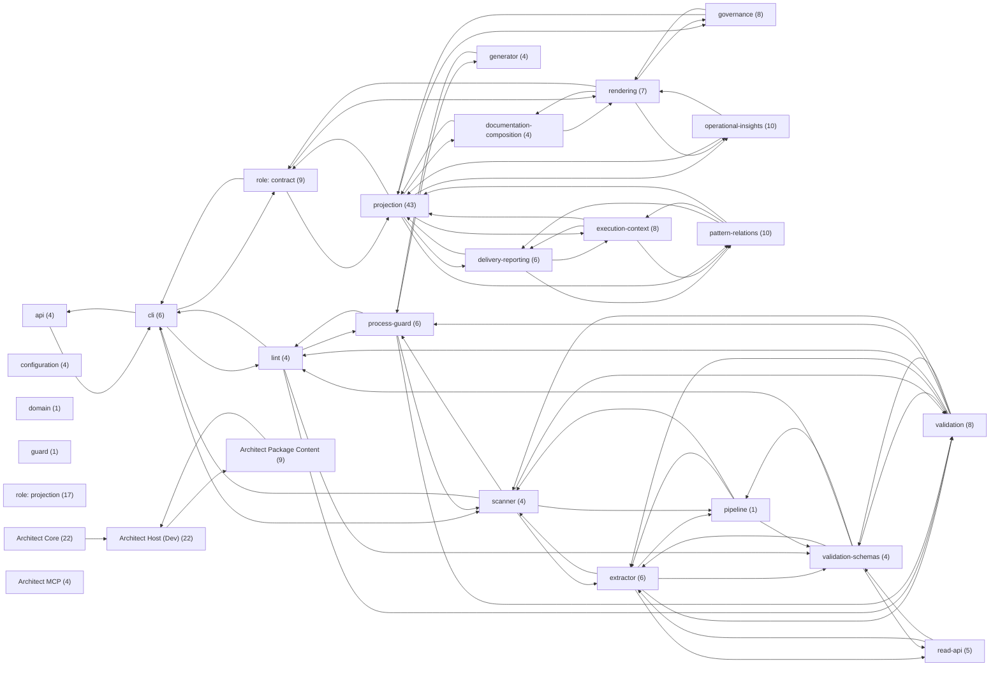

### Bounded context: api \(4 patterns\)

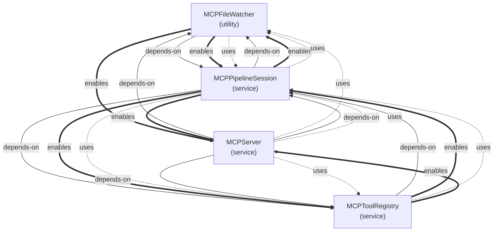

### Bounded context: cli \(6 patterns\)

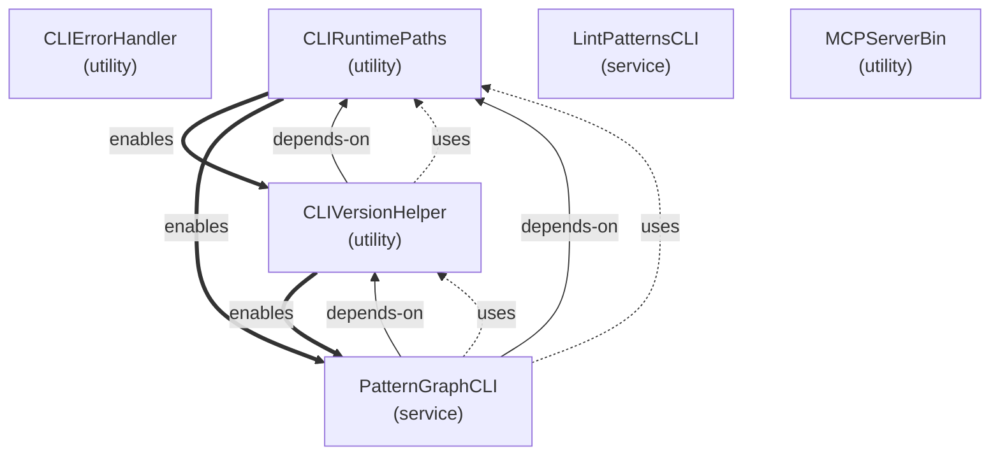

### Bounded context: configuration \(4 patterns\)

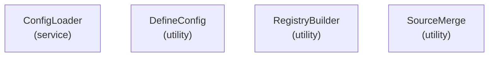

### Bounded context: delivery-reporting \(6 patterns\)

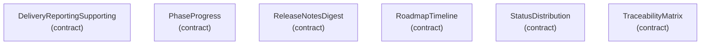

### Bounded context: documentation-composition \(4 patterns\)

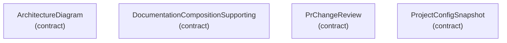

### Bounded context: domain \(1 pattern\)

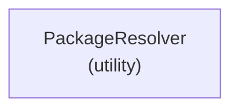

### Bounded context: execution-context \(8 patterns\)

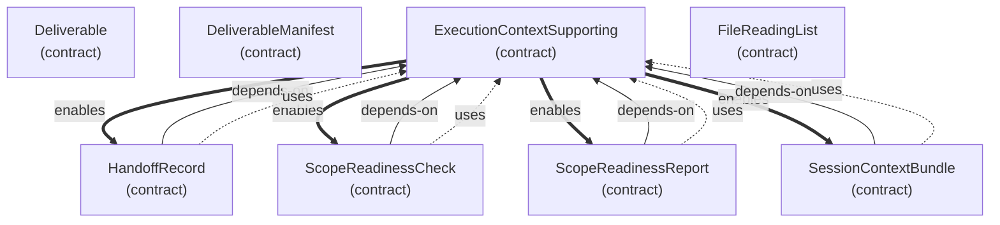

### Bounded context: extractor \(6 patterns\)

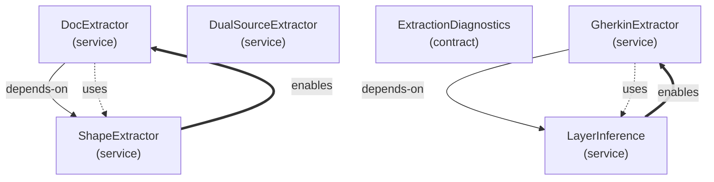

### Bounded context: generator \(4 patterns\)

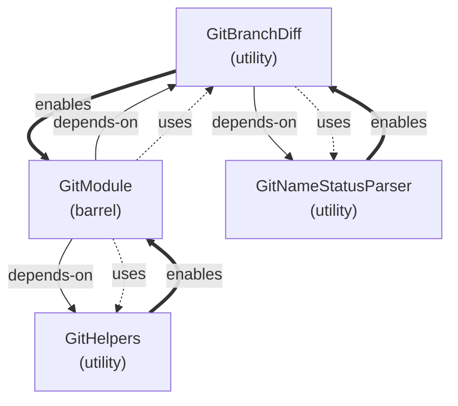

### Bounded context: governance \(8 patterns\)


### Bounded context: guard \(1 pattern\)


### Bounded context: lint \(4 patterns\)

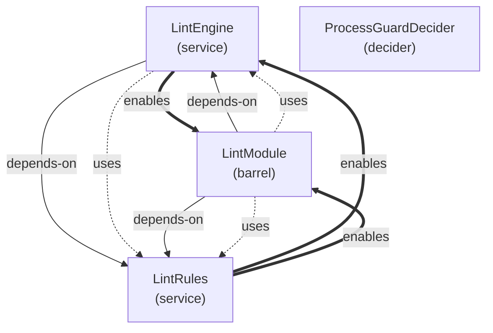

### Bounded context: operational-insights \(10 patterns\)

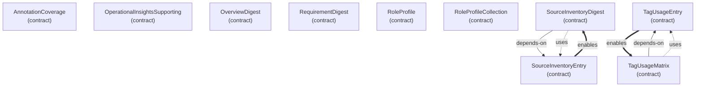

### Bounded context: pattern-relations \(10 patterns\)


### Bounded context: pipeline \(1 pattern\)

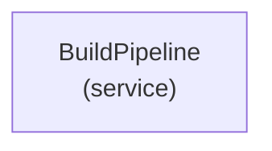

### Bounded context: process-guard \(6 patterns\)

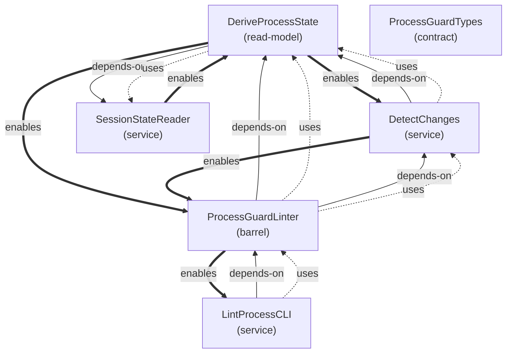

### Bounded context: projection \(43 patterns\)

```mermaid
graph TD
  annotationcoverageprojection["AnnotationCoverageProjection<br/>(projection)"]
  architecturecomparisonprojection["ArchitectureComparisonProjection<br/>(projection)"]
  architecturediagramprojection["ArchitectureDiagramProjection<br/>(projection)"]
  architectureneighborhoodprojection["ArchitectureNeighborhoodProjection<br/>(projection)"]
  boundedcontextprojection["BoundedContextProjection<br/>(projection)"]
  businessrulesprojection["BusinessRulesProjection<br/>(projection)"]
  decisioncatalogprojection["DecisionCatalogProjection<br/>(projection)"]
  deliverableprojection["DeliverableProjection<br/>(projection)"]
  deliveryreportingprojectionsupport["DeliveryReportingProjectionSupport<br/>(utility)"]
  dependencyedgeprojection["DependencyEdgeProjection<br/>(projection)"]
  dependencytreeprojection["DependencyTreeProjection<br/>(projection)"]
  documentationbundle["DocumentationBundle<br/>(projection)"]
  documentationcompositionprojectionsupport["DocumentationCompositionProjectionSupport<br/>(utility)"]
  executioncontextprojectionsupport["ExecutionContextProjectionSupport<br/>(utility)"]
  filereadinglistprojection["FileReadingListProjection<br/>(projection)"]
  governanceprojectionsupport["GovernanceProjectionSupport<br/>(utility)"]
  handoffprojection["HandoffProjection<br/>(projection)"]
  openquestionlistprojection["OpenQuestionListProjection<br/>(projection)"]
  operationalinsightsprojectionsupport["OperationalInsightsProjectionSupport<br/>(utility)"]
  orphanpatternlistprojection["OrphanPatternListProjection<br/>(projection)"]
  overviewprojection["OverviewProjection<br/>(projection)"]
  patternbundleprojection["PatternBundleProjection<br/>(projection)"]
  patterncatalogprojection["PatternCatalogProjection<br/>(projection)"]
  patterndetailprojection["PatternDetailProjection<br/>(projection)"]
  patternrelationsprojectionsupport["PatternRelationsProjectionSupport<br/>(utility)"]
  patternsummaryprojection["PatternSummaryProjection<br/>(projection)"]
  phaseprogressprojection["PhaseProgressProjection<br/>(projection)"]
  prchangereviewprojection["PrChangeReviewProjection<br/>(projection)"]
  projectconfigprojection["ProjectConfigProjection<br/>(projection)"]
  releasenotesprojection["ReleaseNotesProjection<br/>(projection)"]
  requirementdigestprojection["RequirementDigestProjection<br/>(projection)"]
  requirementexecutabledigestprojection["RequirementExecutableDigestProjection<br/>(projection)"]
  requirementspecsdigestprojection["RequirementSpecsDigestProjection<br/>(projection)"]
  roadmaptimelineprojection["RoadmapTimelineProjection<br/>(projection)"]
  roleprofileprojection["RoleProfileProjection<br/>(projection)"]
  scopereadinessprojection["ScopeReadinessProjection<br/>(projection)"]
  sessioncontextprojection["SessionContextProjection<br/>(projection)"]
  sourceinventoryprojection["SourceInventoryProjection<br/>(projection)"]
  statusdistributionprojection["StatusDistributionProjection<br/>(projection)"]
  tagusageprojection["TagUsageProjection<br/>(projection)"]
  taxonomydigestprojection["TaxonomyDigestProjection<br/>(projection)"]
  traceabilitymatrixprojection["TraceabilityMatrixProjection<br/>(projection)"]
  validationruledigestprojection["ValidationRuleDigestProjection<br/>(projection)"]
  annotationcoverageprojection -->|depends-on| operationalinsightsprojectionsupport
  annotationcoverageprojection -.->|uses| operationalinsightsprojectionsupport
  architecturecomparisonprojection -->|depends-on| patternrelationsprojectionsupport
  architecturecomparisonprojection -.->|uses| patternrelationsprojectionsupport
  architecturediagramprojection -->|depends-on| documentationcompositionprojectionsupport
  architecturediagramprojection -.->|uses| documentationcompositionprojectionsupport
  architectureneighborhoodprojection -->|depends-on| patternrelationsprojectionsupport
  architectureneighborhoodprojection -.->|uses| patternrelationsprojectionsupport
  boundedcontextprojection -->|depends-on| patternrelationsprojectionsupport
  boundedcontextprojection -.->|uses| patternrelationsprojectionsupport
  businessrulesprojection -->|depends-on| governanceprojectionsupport
  businessrulesprojection -.->|uses| governanceprojectionsupport
  decisioncatalogprojection -->|depends-on| governanceprojectionsupport
  decisioncatalogprojection -.->|uses| governanceprojectionsupport
  deliverableprojection -->|depends-on| executioncontextprojectionsupport
  deliverableprojection -.->|uses| executioncontextprojectionsupport
  deliveryreportingprojectionsupport ==>|enables| phaseprogressprojection
  deliveryreportingprojectionsupport ==>|enables| releasenotesprojection
  deliveryreportingprojectionsupport ==>|enables| roadmaptimelineprojection
  deliveryreportingprojectionsupport ==>|enables| statusdistributionprojection
  deliveryreportingprojectionsupport ==>|enables| traceabilitymatrixprojection
  dependencyedgeprojection -->|depends-on| patternrelationsprojectionsupport
  dependencyedgeprojection -.->|uses| patternrelationsprojectionsupport
  dependencytreeprojection -->|depends-on| patternrelationsprojectionsupport
  dependencytreeprojection -.->|uses| patternrelationsprojectionsupport
  documentationbundle -->|depends-on| documentationcompositionprojectionsupport
  documentationbundle -.->|uses| documentationcompositionprojectionsupport
  documentationcompositionprojectionsupport ==>|enables| architecturediagramprojection
  documentationcompositionprojectionsupport ==>|enables| documentationbundle
  documentationcompositionprojectionsupport ==>|enables| prchangereviewprojection
  documentationcompositionprojectionsupport ==>|enables| projectconfigprojection
  executioncontextprojectionsupport ==>|enables| deliverableprojection
  executioncontextprojectionsupport ==>|enables| filereadinglistprojection
  executioncontextprojectionsupport ==>|enables| handoffprojection
  executioncontextprojectionsupport ==>|enables| scopereadinessprojection
  executioncontextprojectionsupport ==>|enables| sessioncontextprojection
  filereadinglistprojection -->|depends-on| executioncontextprojectionsupport
  filereadinglistprojection -.->|uses| executioncontextprojectionsupport
  governanceprojectionsupport ==>|enables| businessrulesprojection
  governanceprojectionsupport ==>|enables| decisioncatalogprojection
  governanceprojectionsupport ==>|enables| taxonomydigestprojection
  governanceprojectionsupport ==>|enables| validationruledigestprojection
  handoffprojection -->|depends-on| executioncontextprojectionsupport
  handoffprojection -.->|uses| executioncontextprojectionsupport
  openquestionlistprojection -->|depends-on| patternrelationsprojectionsupport
  openquestionlistprojection -.->|uses| patternrelationsprojectionsupport
  operationalinsightsprojectionsupport ==>|enables| annotationcoverageprojection
  operationalinsightsprojectionsupport ==>|enables| overviewprojection
  operationalinsightsprojectionsupport ==>|enables| requirementdigestprojection
  operationalinsightsprojectionsupport ==>|enables| requirementexecutabledigestprojection
  operationalinsightsprojectionsupport ==>|enables| requirementspecsdigestprojection
  operationalinsightsprojectionsupport ==>|enables| roleprofileprojection
  operationalinsightsprojectionsupport ==>|enables| sourceinventoryprojection
  operationalinsightsprojectionsupport ==>|enables| tagusageprojection
  orphanpatternlistprojection -->|depends-on| patternrelationsprojectionsupport
  orphanpatternlistprojection -.->|uses| patternrelationsprojectionsupport
  overviewprojection -->|depends-on| operationalinsightsprojectionsupport
  overviewprojection -.->|uses| operationalinsightsprojectionsupport
  patternbundleprojection -->|depends-on| patternrelationsprojectionsupport
  patternbundleprojection -.->|uses| patternrelationsprojectionsupport
  patterncatalogprojection -->|depends-on| patternrelationsprojectionsupport
  patterncatalogprojection -.->|uses| patternrelationsprojectionsupport
  patterndetailprojection -->|depends-on| patternrelationsprojectionsupport
  patterndetailprojection -.->|uses| patternrelationsprojectionsupport
  patternrelationsprojectionsupport ==>|enables| architecturecomparisonprojection
  patternrelationsprojectionsupport ==>|enables| architectureneighborhoodprojection
  patternrelationsprojectionsupport ==>|enables| boundedcontextprojection
  patternrelationsprojectionsupport ==>|enables| dependencyedgeprojection
  patternrelationsprojectionsupport ==>|enables| dependencytreeprojection
  patternrelationsprojectionsupport ==>|enables| openquestionlistprojection
  patternrelationsprojectionsupport ==>|enables| orphanpatternlistprojection
  patternrelationsprojectionsupport ==>|enables| patternbundleprojection
  patternrelationsprojectionsupport ==>|enables| patterncatalogprojection
  patternrelationsprojectionsupport ==>|enables| patterndetailprojection
  patternrelationsprojectionsupport ==>|enables| patternsummaryprojection
  patternsummaryprojection -->|depends-on| patternrelationsprojectionsupport
  patternsummaryprojection -.->|uses| patternrelationsprojectionsupport
  phaseprogressprojection -->|depends-on| deliveryreportingprojectionsupport
  phaseprogressprojection -.->|uses| deliveryreportingprojectionsupport
  prchangereviewprojection -->|depends-on| documentationcompositionprojectionsupport
  prchangereviewprojection -.->|uses| documentationcompositionprojectionsupport
  projectconfigprojection -->|depends-on| documentationcompositionprojectionsupport
  projectconfigprojection -.->|uses| documentationcompositionprojectionsupport
  releasenotesprojection -->|depends-on| deliveryreportingprojectionsupport
  releasenotesprojection -.->|uses| deliveryreportingprojectionsupport
  requirementdigestprojection -->|depends-on| operationalinsightsprojectionsupport
  requirementdigestprojection -.->|uses| operationalinsightsprojectionsupport
  requirementexecutabledigestprojection -->|depends-on| operationalinsightsprojectionsupport
  requirementexecutabledigestprojection -.->|uses| operationalinsightsprojectionsupport
  requirementspecsdigestprojection -->|depends-on| operationalinsightsprojectionsupport
  requirementspecsdigestprojection -.->|uses| operationalinsightsprojectionsupport
  roadmaptimelineprojection -->|depends-on| deliveryreportingprojectionsupport
  roadmaptimelineprojection -.->|uses| deliveryreportingprojectionsupport
  roleprofileprojection -->|depends-on| operationalinsightsprojectionsupport
  roleprofileprojection -.->|uses| operationalinsightsprojectionsupport
  scopereadinessprojection -->|depends-on| executioncontextprojectionsupport
  scopereadinessprojection -.->|uses| executioncontextprojectionsupport
  sessioncontextprojection -->|depends-on| executioncontextprojectionsupport
  sessioncontextprojection -.->|uses| executioncontextprojectionsupport
  sourceinventoryprojection -->|depends-on| operationalinsightsprojectionsupport
  sourceinventoryprojection -.->|uses| operationalinsightsprojectionsupport
  statusdistributionprojection -->|depends-on| deliveryreportingprojectionsupport
  statusdistributionprojection -.->|uses| deliveryreportingprojectionsupport
  tagusageprojection -->|depends-on| operationalinsightsprojectionsupport
  tagusageprojection -.->|uses| operationalinsightsprojectionsupport
  taxonomydigestprojection -->|depends-on| governanceprojectionsupport
  taxonomydigestprojection -.->|uses| governanceprojectionsupport
  traceabilitymatrixprojection -->|depends-on| deliveryreportingprojectionsupport
  traceabilitymatrixprojection -.->|uses| deliveryreportingprojectionsupport
  validationruledigestprojection -->|depends-on| governanceprojectionsupport
  validationruledigestprojection -.->|uses| governanceprojectionsupport
```

### Bounded context: read-api \(5 patterns\)

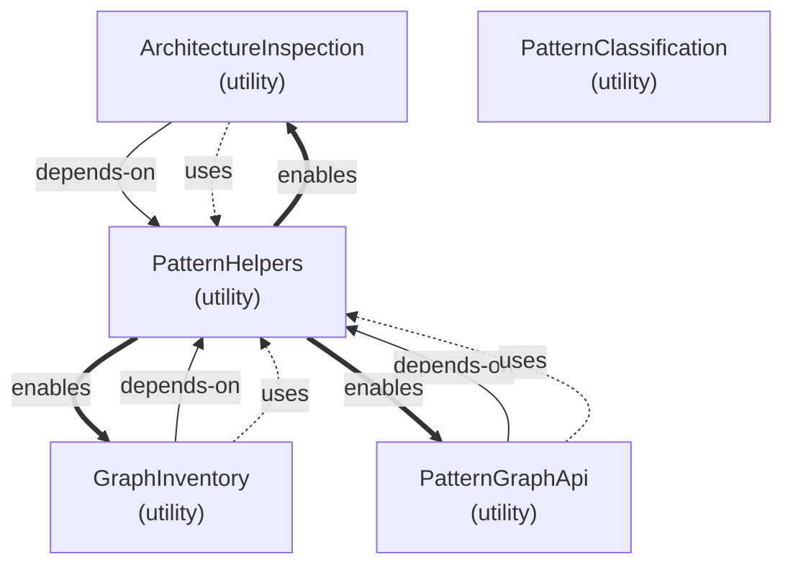

### Bounded context: rendering \(7 patterns\)

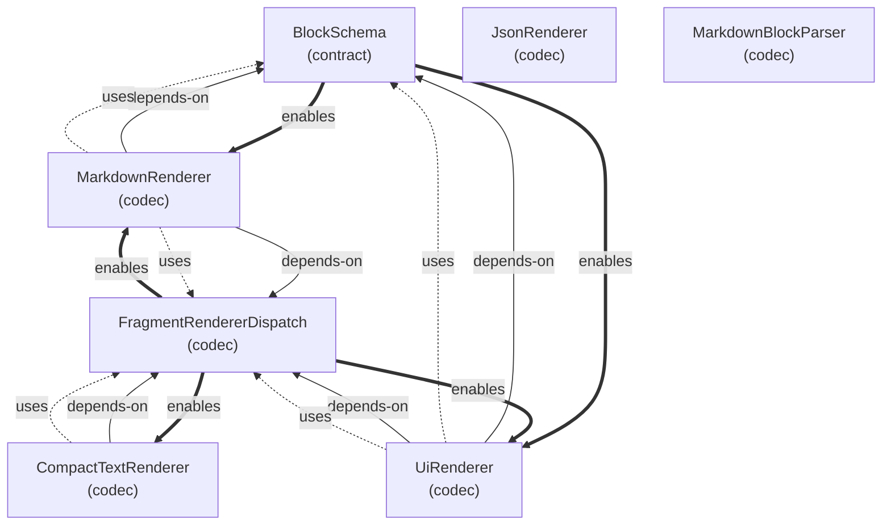

### Bounded context: scanner \(4 patterns\)

```mermaid
graph TD
  astparser["AstParser<br/>(service)"]
  gherkinastparser["GherkinAstParser<br/>(service)"]
  gherkinscanner["GherkinScanner<br/>(service)"]
  patternscanner["PatternScanner<br/>(service)"]
```

### Bounded context: validation \(8 patterns\)

```mermaid
graph TD
  antipatterndetector["AntiPatternDetector<br/>(service)"]
  dodvalidationtypes["DoDValidationTypes<br/>(contract)"]
  dodvalidator["DoDValidator<br/>(service)"]
  fsmstates["FSMStates<br/>(read-model)"]
  fsmtransitions["FSMTransitions<br/>(read-model)"]
  fsmvalidator["FSMValidator<br/>(decider)"]
  validatepatternscli["ValidatePatternsCLI<br/>(service)"]
  validationmodule["ValidationModule<br/>(barrel)"]
  antipatterndetector -->|depends-on| dodvalidationtypes
  antipatterndetector -.->|uses| dodvalidationtypes
  antipatterndetector ==>|enables| validationmodule
  dodvalidationtypes ==>|enables| antipatterndetector
  dodvalidationtypes ==>|enables| dodvalidator
  dodvalidationtypes ==>|enables| validationmodule
  dodvalidator -->|depends-on| dodvalidationtypes
  dodvalidator -.->|uses| dodvalidationtypes
  dodvalidator ==>|enables| validationmodule
  fsmstates ==>|enables| fsmvalidator
  fsmtransitions ==>|enables| fsmvalidator
  fsmvalidator -->|depends-on| fsmstates
  fsmvalidator -.->|uses| fsmstates
  fsmvalidator -->|depends-on| fsmtransitions
  fsmvalidator -.->|uses| fsmtransitions
  validationmodule -->|depends-on| antipatterndetector
  validationmodule -.->|uses| antipatterndetector
  validationmodule -->|depends-on| dodvalidationtypes
  validationmodule -.->|uses| dodvalidationtypes
  validationmodule -->|depends-on| dodvalidator
  validationmodule -.->|uses| dodvalidator
```

### Bounded context: validation-schemas \(4 patterns\)

```mermaid
graph TD
  codecutils["CodecUtils<br/>(codec)"]
  extractedpattern["ExtractedPattern<br/>(contract)"]
  patterngraph["PatternGraph<br/>(contract)"]
  tagregistryschemas["TagRegistrySchemas<br/>(contract)"]
  extractedpattern ==>|enables| patterngraph
  patterngraph -->|depends-on| extractedpattern
  patterngraph -.->|uses| extractedpattern
```

### Uncontextualized · role: contract \(9 patterns\)

```mermaid
graph TD
  boundedcontextfragmentcontract["BoundedContextFragmentContract<br/>(contract)"]
  deliveryreportingfragmentcontracts["DeliveryReportingFragmentContracts<br/>(contract)"]
  errorfactories["ErrorFactories<br/>(contract)"]
  errorfactorytypes["ErrorFactoryTypes<br/>(contract)"]
  patternrelationsfragmentcontracts["PatternRelationsFragmentContracts<br/>(contract)"]
  projectionfragmentcontracts["ProjectionFragmentContracts<br/>(contract)"]
  projectionfragmentschema["ProjectionFragmentSchema<br/>(contract)"]
  resultmonad["ResultMonad<br/>(contract)"]
  resultmonadtypes["ResultMonadTypes<br/>(contract)"]
```

### Uncontextualized · role: projection \(17 patterns\)

```mermaid
graph TD
  architecturenavigationprojectionexecutabletests["ArchitectureNavigationProjectionExecutableTests<br/>(projection)"]
  businessrulesprojectionexecutabletests["BusinessRulesProjectionExecutableTests<br/>(projection)"]
  decisioncatalogprojectionexecutabletests["DecisionCatalogProjectionExecutableTests<br/>(projection)"]
  deliveryprogressprojectionexecutabletests["DeliveryProgressProjectionExecutableTests<br/>(projection)"]
  deliveryreportingprojectionsupportexecutabletests["DeliveryReportingProjectionSupportExecutableTests<br/>(projection)"]
  dependencyedgeprojectionexecutabletests["DependencyEdgeProjectionExecutableTests<br/>(projection)"]
  dependencytreeprojectionexecutabletests["DependencyTreeProjectionExecutableTests<br/>(projection)"]
  documentationcompositionprojectionexecutabletests["DocumentationCompositionProjectionExecutableTests<br/>(projection)"]
  executioncontextprojectionexecutabletests["ExecutionContextProjectionExecutableTests<br/>(projection)"]
  governancevalidationtaxonomyprojectionexecutabletests["GovernanceValidationTaxonomyProjectionExecutableTests<br/>(projection)"]
  openquestionlistprojectionexecutabletests["OpenQuestionListProjectionExecutableTests<br/>(projection)"]
  operationalinsightsprojectionexecutabletests["OperationalInsightsProjectionExecutableTests<br/>(projection)"]
  patternbundleprojectionexecutabletests["PatternBundleProjectionExecutableTests<br/>(projection)"]
  patterndetailprojectionexecutabletests["PatternDetailProjectionExecutableTests<br/>(projection)"]
  patternsummarycatalogprojectionexecutabletests["PatternSummaryCatalogProjectionExecutableTests<br/>(projection)"]
  releasenotesprojectionexecutabletests["ReleaseNotesProjectionExecutableTests<br/>(projection)"]
  traceabilitymatrixprojectionexecutabletests["TraceabilityMatrixProjectionExecutableTests<br/>(projection)"]
```

### Unclassified · Architect Core \(22 patterns\)

```mermaid
graph TD
  codecutilsvalidation["CodecUtilsValidation"]
  configbasedworkflowdefinition["ConfigBasedWorkflowDefinition"]
  configresolution["ConfigResolution"]
  configurationapi["ConfigurationAPI"]
  crosspackageedgeclassification["CrossPackageEdgeClassification"]
  defineconfigexecutabletests["DefineConfigExecutableTests"]
  docstringmediatype["DocStringMediaType"]
  dualsourcemergeintegration["DualSourceMergeIntegration"]
  filediscovery["FileDiscovery"]
  gherkinexternalrelationshiptagpropagation["GherkinExternalRelationshipTagPropagation"]
  gherkinrulessupport["GherkinRulesSupport"]
  packageresolverexecutabletests["PackageResolverExecutableTests"]
  patterngraphapireverselookup["PatternGraphApiReverseLookup"]
  patternreferencevalidation["PatternReferenceValidation"]
  projectconfigloader["ProjectConfigLoader"]
  scannercore["ScannerCore"]
  shapeextraction["ShapeExtraction"]
  sourcemerging["SourceMerging"]
  tagregistryschemasvalidation["TagRegistrySchemasValidation"]
  typescripttaxonomyimplementation["TypeScriptTaxonomyImplementation"]
  valueformatcanonicalvaluesdispatch["ValueFormatCanonicalValuesDispatch"]
  workflowconfigschemasvalidation["WorkflowConfigSchemasValidation"]
  gherkinexternalrelationshiptagpropagation -. see-also .- gherkinrulessupport
```

### Unclassified · Architect Host \(Dev\) \(22 patterns\)

```mermaid
graph TD
  architectpubliccontract["ArchitectPublicContract"]
  canonicalvaluessync["CanonicalValuesSync"]
  compacttextrenderertests["CompactTextRendererTests"]
  dataapicliergonomics["DataAPICLIErgonomics"]
  dataapioutputshaping["DataAPIOutputShaping"]
  documentationcommandparityboundarytests["DocumentationCommandParityBoundaryTests"]
  generatedocscli["GenerateDocsCli"]
  lintpatternsclibehavior["LintPatternsCliBehavior"]
  lintprocessclibehavior["LintProcessCliBehavior"]
  loadpreambleparser["LoadPreambleParser"]
  mcptoolregistryboundarytests["MCPToolRegistryBoundaryTests"]
  patterngraphapicli["PatternGraphAPICLI"]
  patterngraphcliarchhealth["PatternGraphCliArchHealth"]
  patterngraphclicache["PatternGraphCliCache"]
  patterngraphclidryrun["PatternGraphCliDryRun"]
  patterngraphclimetadata["PatternGraphCliMetadata"]
  patterngraphclioutputmodifiers["PatternGraphCliOutputModifiers"]
  patterngraphclirepl["PatternGraphCliRepl"]
  patterngraphclirulessubcommand["PatternGraphCliRulesSubcommand"]
  patterngraphclisubcommands["PatternGraphCliSubcommands"]
  stubtaxonomytagtests["StubTaxonomyTagTests"]
  validatorreadmodelconsolidation["ValidatorReadModelConsolidation"]
```

### Unclassified · Architect MCP \(4 patterns\)

```mermaid
graph TD
  mcpruntimehardeningexecutabletests["MCPRuntimeHardeningExecutableTests"]
  mcpserverlifecycleexecutabletests["MCPServerLifecycleExecutableTests"]
  mcptoolinputvalidationexecutabletests["MCPToolInputValidationExecutableTests"]
  mcptoolregistryintegrationtests["MCPToolRegistryIntegrationTests"]
```

### Unclassified · Architect Package Content \(9 patterns\)

```mermaid
graph TD
  adr001taxonomycanonicalvalues["ADR001TaxonomyCanonicalValues"]
  adr002gherkinonlytesting["ADR002GherkinOnlyTesting"]
  adr003sourcefirstpatternarchitecture["ADR003SourceFirstPatternArchitecture"]
  adr005codecbasedmarkdownrendering["ADR005CodecBasedMarkdownRendering"]
  adr006singlereadmodelarchitecture["ADR006SingleReadModelArchitecture"]
  adr007coordinatedtaxonomyredesign["ADR007CoordinatedTaxonomyRedesign"]
  adr008stepdefinitionstubsconvention["ADR008StepDefinitionStubsConvention"]
  adr009projectiontrustboundary["ADR009ProjectionTrustBoundary"]
  pdr005processguardfsm["PDR005ProcessGuardFSM"]
  adr001taxonomycanonicalvalues ==>|enables| adr003sourcefirstpatternarchitecture
  adr001taxonomycanonicalvalues ==>|enables| adr007coordinatedtaxonomyredesign
  adr001taxonomycanonicalvalues -. see-also .- adr007coordinatedtaxonomyredesign
  adr001taxonomycanonicalvalues ==>|enables| pdr005processguardfsm
  adr002gherkinonlytesting ==>|enables| adr008stepdefinitionstubsconvention
  adr003sourcefirstpatternarchitecture -->|depends-on| adr001taxonomycanonicalvalues
  adr003sourcefirstpatternarchitecture -.->|uses| adr001taxonomycanonicalvalues
  adr003sourcefirstpatternarchitecture ==>|enables| adr008stepdefinitionstubsconvention
  adr005codecbasedmarkdownrendering ==>|enables| adr006singlereadmodelarchitecture
  adr006singlereadmodelarchitecture -->|depends-on| adr005codecbasedmarkdownrendering
  adr006singlereadmodelarchitecture -.->|uses| adr005codecbasedmarkdownrendering
  adr007coordinatedtaxonomyredesign -->|depends-on| adr001taxonomycanonicalvalues
  adr007coordinatedtaxonomyredesign -.->|uses| adr001taxonomycanonicalvalues
  adr007coordinatedtaxonomyredesign -->|depends-on| pdr005processguardfsm
  adr007coordinatedtaxonomyredesign -.->|uses| pdr005processguardfsm
  adr008stepdefinitionstubsconvention -->|depends-on| adr002gherkinonlytesting
  adr008stepdefinitionstubsconvention -.->|uses| adr002gherkinonlytesting
  adr008stepdefinitionstubsconvention -->|depends-on| adr003sourcefirstpatternarchitecture
  adr008stepdefinitionstubsconvention -.->|uses| adr003sourcefirstpatternarchitecture
  adr009projectiontrustboundary -. see-also .- adr005codecbasedmarkdownrendering
  adr009projectiontrustboundary -. see-also .- adr006singlereadmodelarchitecture
  pdr005processguardfsm -->|depends-on| adr001taxonomycanonicalvalues
  pdr005processguardfsm -.->|uses| adr001taxonomycanonicalvalues
  pdr005processguardfsm ==>|enables| adr007coordinatedtaxonomyredesign
```

## Legend

### Legend

- Solid arrow = dependency
- Dashed arrow = usage
- Bold arrow = enablement
- Dotted line = reference

## Patterns

- ADR001TaxonomyCanonicalValues
- ADR002GherkinOnlyTesting
- ADR003SourceFirstPatternArchitecture
- ADR005CodecBasedMarkdownRendering
- ADR006SingleReadModelArchitecture
- ADR007CoordinatedTaxonomyRedesign
- ADR008StepDefinitionStubsConvention
- ADR009ProjectionTrustBoundary
- AnnotationCoverage
- AnnotationCoverageProjection
- AntiPatternDetector
- ArchitectPublicContract
- ArchitectureComparison
- ArchitectureComparisonProjection
- ArchitectureDiagram
- ArchitectureDiagramProjection
- ArchitectureInspection
- ArchitectureNavigationProjectionExecutableTests
- ArchitectureNeighborhood
- ArchitectureNeighborhoodProjection
- AstParser
- BlockSchema
- BoundedContextFragmentContract
- BoundedContextProjection
- BuildPipeline
- BusinessRule
- BusinessRuleReference
- BusinessRuleSet
- BusinessRulesProjection
- BusinessRulesProjectionExecutableTests
- CanonicalValuesSync
- CLIErrorHandler
- CLIRuntimePaths
- CLIVersionHelper
- CodecUtils
- CodecUtilsValidation
- CompactTextRenderer
- CompactTextRendererTests
- ConfigBasedWorkflowDefinition
- ConfigLoader
- ConfigResolution
- ConfigurationAPI
- CrossPackageEdgeClassification
- DataAPICLIErgonomics
- DataAPIOutputShaping
- DecisionCatalog
- DecisionCatalogProjection
- DecisionCatalogProjectionExecutableTests
- DecisionRecord
- DefineConfig
- DefineConfigExecutableTests
- Deliverable
- DeliverableManifest
- DeliverableProjection
- DeliveryProgressProjectionExecutableTests
- DeliveryReportingFragmentContracts
- DeliveryReportingProjectionSupport
- DeliveryReportingProjectionSupportExecutableTests
- DeliveryReportingSupporting
- DependencyEdge
- DependencyEdgeProjection
- DependencyEdgeProjectionExecutableTests
- DependencyEdgeSet
- DependencyTree
- DependencyTreeProjection
- DependencyTreeProjectionExecutableTests
- DeriveProcessState
- DetectChanges
- DocExtractor
- DocStringMediaType
- DocumentationBundle
- DocumentationCommandParityBoundaryTests
- DocumentationCompositionProjectionExecutableTests
- DocumentationCompositionProjectionSupport
- DocumentationCompositionSupporting
- DoDValidationTypes
- DoDValidator
- DualSourceExtractor
- DualSourceMergeIntegration
- ErrorFactories
- ErrorFactoryTypes
- ExecutionContextProjectionExecutableTests
- ExecutionContextProjectionSupport
- ExecutionContextSupporting
- ExtractedPattern
- ExtractionDiagnostics
- FileDiscovery
- FileReadingList
- FileReadingListProjection
- FragmentRendererDispatch
- FSMStates
- FSMTransitions
- FSMValidator
- GenerateDocsCli
- GherkinAstParser
- GherkinExternalRelationshipTagPropagation
- GherkinExtractor
- GherkinRulesSupport
- GherkinScanner
- GitBranchDiff
- GitHelpers
- GitModule
- GitNameStatusParser
- GovernanceProjectionSupport
- GovernanceSupporting
- GovernanceValidationTaxonomyProjectionExecutableTests
- GraphInventory
- HandoffProjection
- HandoffRecord
- JsonRenderer
- LayerInference
- LintEngine
- LintModule
- LintPatternsCLI
- LintPatternsCliBehavior
- LintProcessCLI
- LintProcessCliBehavior
- LintRules
- LoadPreambleParser
- MarkdownBlockParser
- MarkdownRenderer
- MCPFileWatcher
- MCPPipelineSession
- MCPRuntimeHardeningExecutableTests
- MCPServer
- MCPServerBin
- MCPServerLifecycleExecutableTests
- MCPToolInputValidationExecutableTests
- MCPToolRegistry
- MCPToolRegistryBoundaryTests
- MCPToolRegistryIntegrationTests
- OpenQuestionListProjection
- OpenQuestionListProjectionExecutableTests
- OperationalInsightsProjectionExecutableTests
- OperationalInsightsProjectionSupport
- OperationalInsightsSupporting
- OrphanPatternList
- OrphanPatternListProjection
- OverviewDigest
- OverviewProjection
- PackageResolver
- PackageResolverExecutableTests
- PatternBundleProjection
- PatternBundleProjectionExecutableTests
- PatternCatalog
- PatternCatalogProjection
- PatternClassification
- PatternDetail
- PatternDetailProjection
- PatternDetailProjectionExecutableTests
- PatternGraph
- PatternGraphApi
- PatternGraphAPICLI
- PatternGraphApiReverseLookup
- PatternGraphCLI
- PatternGraphCliArchHealth
- PatternGraphCliCache
- PatternGraphCliDryRun
- PatternGraphCliMetadata
- PatternGraphCliOutputModifiers
- PatternGraphCliRepl
- PatternGraphCliRulesSubcommand
- PatternGraphCliSubcommands
- PatternHelpers
- PatternReferenceValidation
- PatternRelationsFragmentContracts
- PatternRelationsProjectionSupport
- PatternRelationsSupporting
- PatternScanner
- PatternSummary
- PatternSummaryCatalogProjectionExecutableTests
- PatternSummaryProjection
- PDR005ProcessGuardFSM
- PhaseProgress
- PhaseProgressProjection
- PrChangeReview
- PrChangeReviewProjection
- ProcessGuardDecider
- ProcessGuardLinter
- ProcessGuardRulesExecutableTests
- ProcessGuardTypes
- ProjectConfigLoader
- ProjectConfigProjection
- ProjectConfigSnapshot
- ProjectionFragmentContracts
- ProjectionFragmentSchema
- RegistryBuilder
- ReleaseNotesDigest
- ReleaseNotesProjection
- ReleaseNotesProjectionExecutableTests
- RequirementDigest
- RequirementDigestProjection
- RequirementExecutableDigestProjection
- RequirementSpecsDigestProjection
- ResultMonad
- ResultMonadTypes
- RoadmapTimeline
- RoadmapTimelineProjection
- RoleProfile
- RoleProfileCollection
- RoleProfileProjection
- ScannerCore
- ScopeReadinessCheck
- ScopeReadinessProjection
- ScopeReadinessReport
- SessionContextBundle
- SessionContextProjection
- SessionStateReader
- ShapeExtraction
- ShapeExtractor
- SourceInventoryDigest
- SourceInventoryEntry
- SourceInventoryProjection
- SourceMerge
- SourceMerging
- StatusDistribution
- StatusDistributionProjection
- StubTaxonomyTagTests
- TagRegistrySchemas
- TagRegistrySchemasValidation
- TagUsageEntry
- TagUsageMatrix
- TagUsageProjection
- TaxonomyDigest
- TaxonomyDigestProjection
- TraceabilityMatrix
- TraceabilityMatrixProjection
- TraceabilityMatrixProjectionExecutableTests
- TypeScriptTaxonomyImplementation
- UiRenderer
- ValidatePatternsCLI
- ValidationModule
- ValidationRuleDigest
- ValidationRuleDigestProjection
- ValidatorReadModelConsolidation
- ValueFormatCanonicalValuesDispatch
- WorkflowConfigSchemasValidation
