# Architecture

**Purpose:** Auto-generated architecture diagrams from source annotations
**Detail Level:** Context map plus per-group component diagrams

---

## Overview

This view captures 166 patterns across 23 diagrams in the Component architecture view.

## Related views

- [Layered](architecture/layered.md)
- [Package Seam](architecture/package-seam.md)

## Diagrams

### Context Map

Each node is a group; each arrow is a cross-group dependency (`depends-on` / `uses`, pointing from dependant to dependency). The per-group diagrams below detail each group’s internal dependencies and any see-also references.

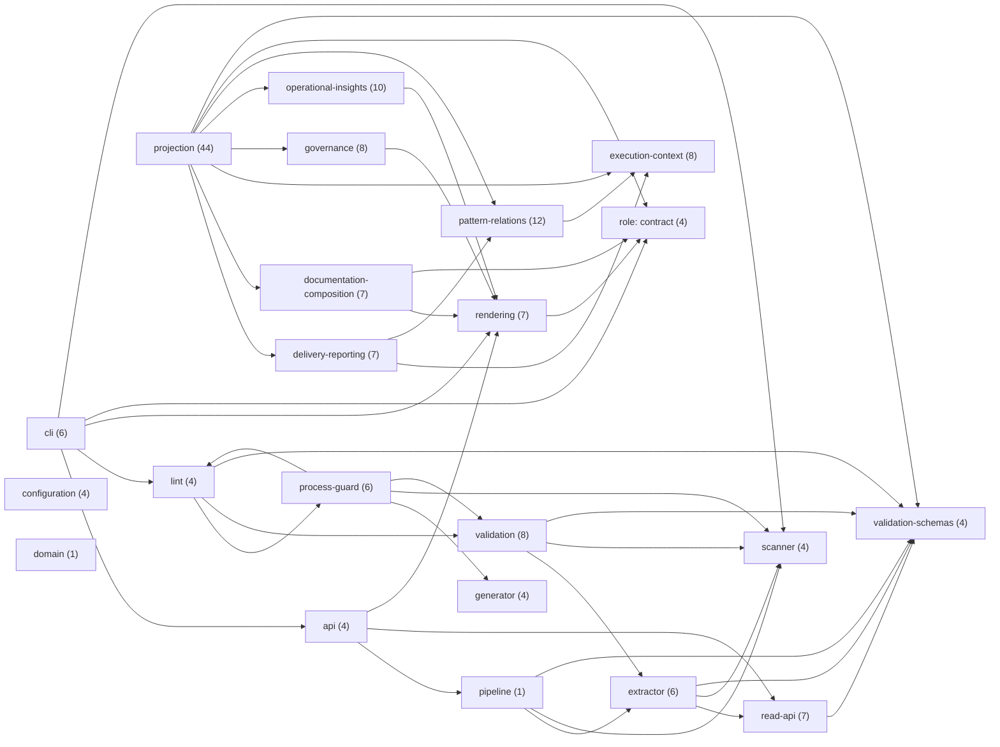

### Bounded context: api (4 patterns)

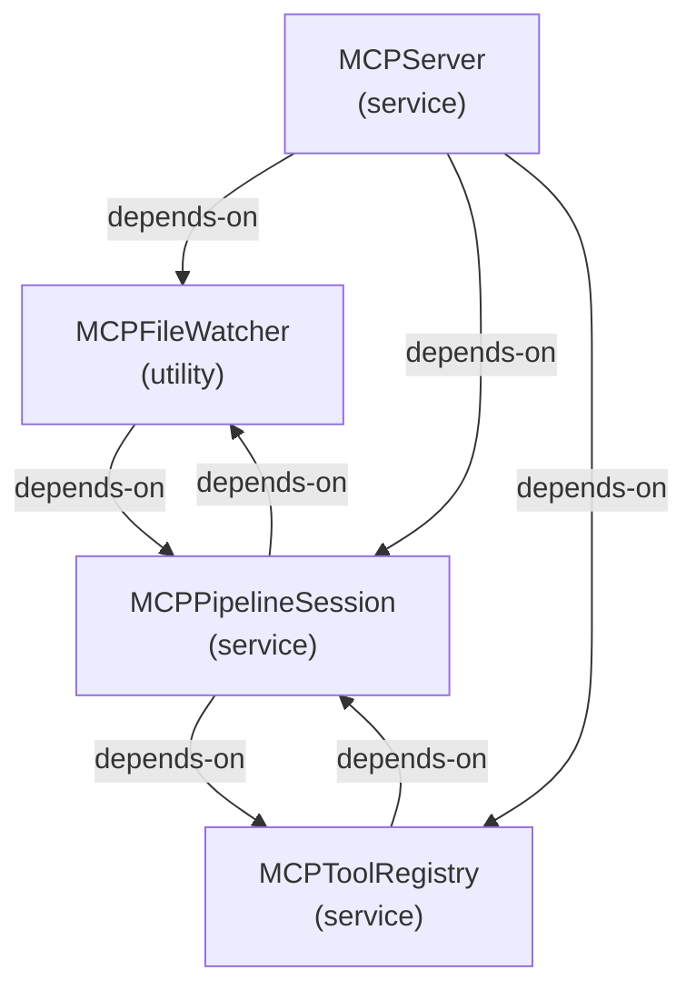

### Bounded context: cli (6 patterns)

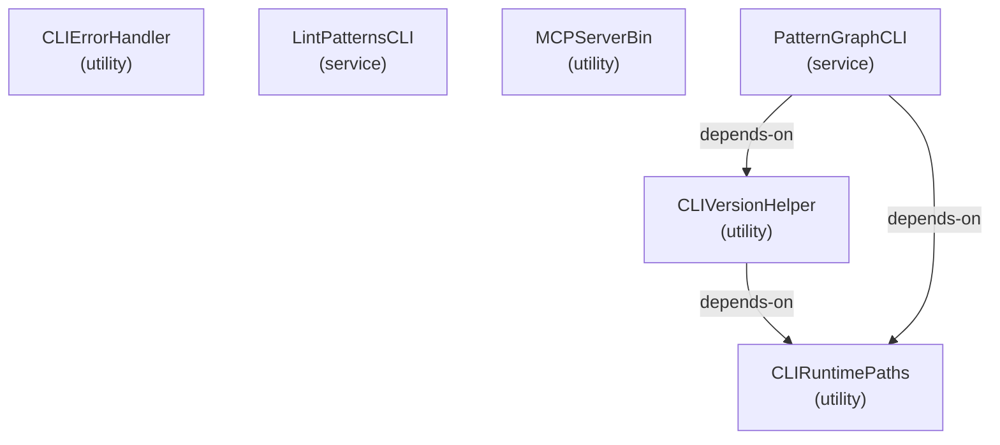

### Bounded context: configuration (4 patterns)

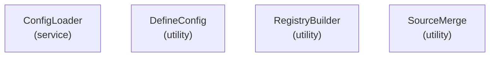

### Bounded context: delivery-reporting (7 patterns)

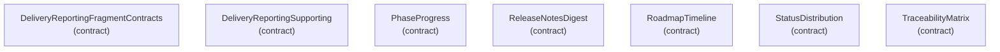

### Bounded context: documentation-composition (7 patterns)

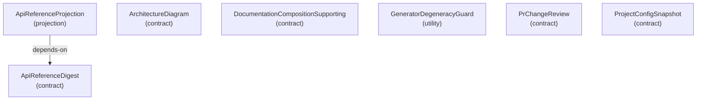

### Bounded context: domain (1 pattern)

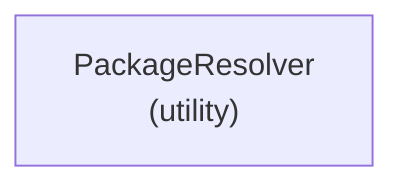

### Bounded context: execution-context (8 patterns)

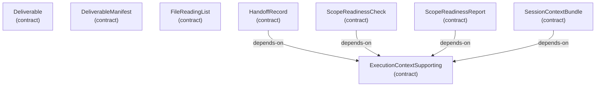

### Bounded context: extractor (6 patterns)

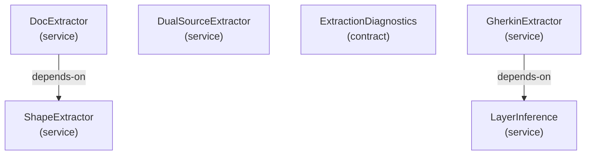

### Bounded context: generator (4 patterns)

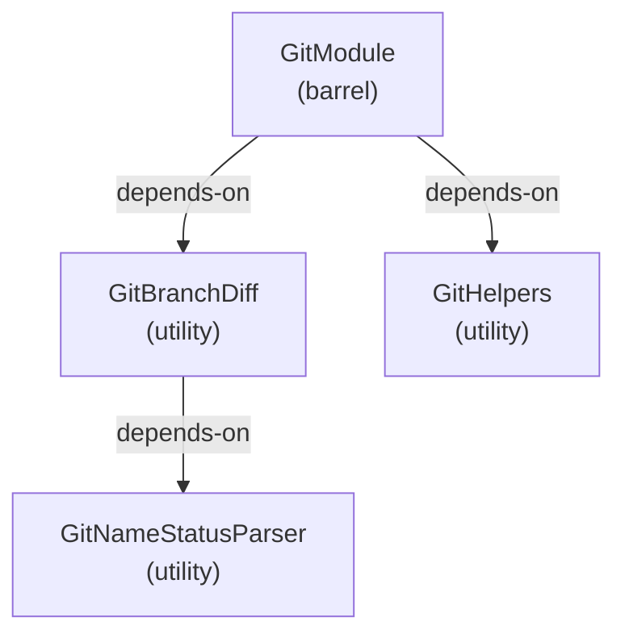

### Bounded context: governance (8 patterns)

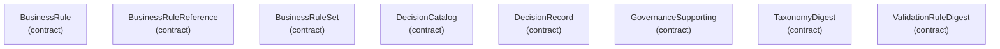

### Bounded context: lint (4 patterns)

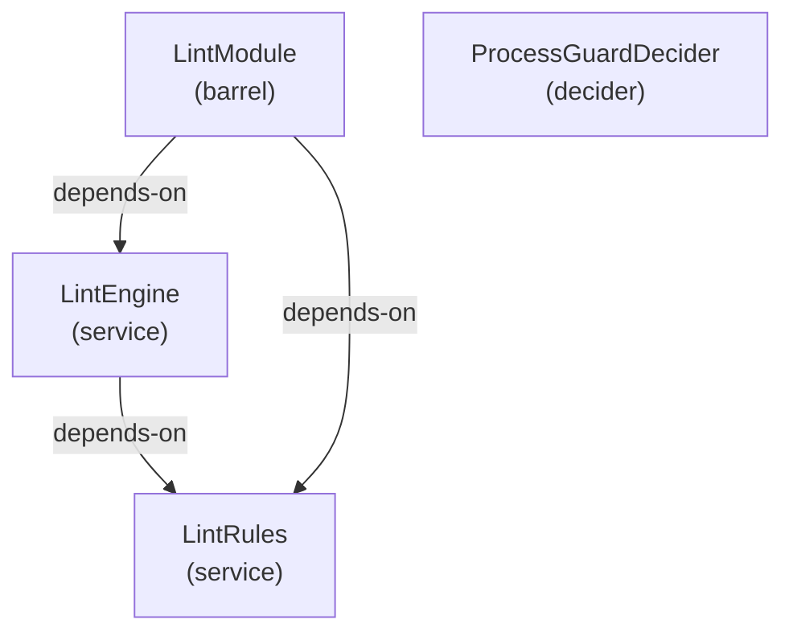

### Bounded context: operational-insights (10 patterns)

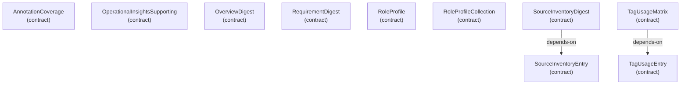

### Bounded context: pattern-relations (12 patterns)


### Bounded context: pipeline (1 pattern)

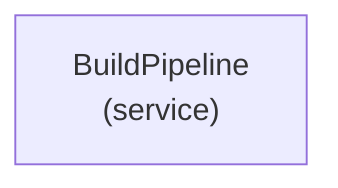

### Bounded context: process-guard (6 patterns)

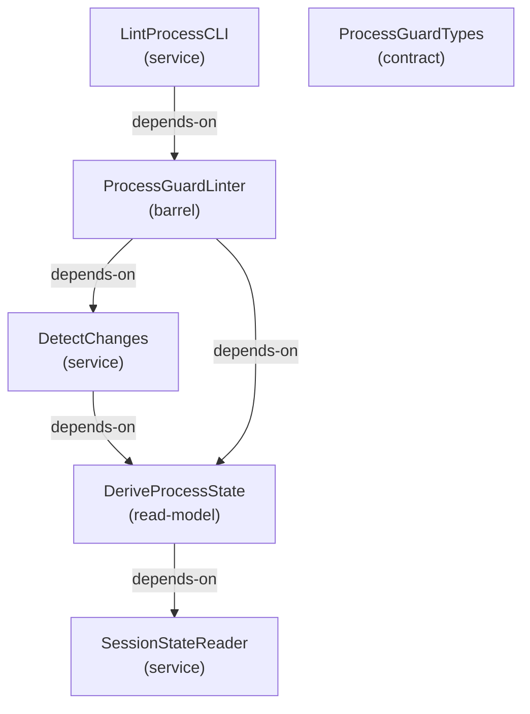

### Bounded context: projection (44 patterns)

```mermaid
graph TD
  annotationcoverageprojection["AnnotationCoverageProjection<br/>(projection)"]
  architecturecomparisonprojection["ArchitectureComparisonProjection<br/>(projection)"]
  architecturediagramprojection["ArchitectureDiagramProjection<br/>(projection)"]
  architecturegraphprojection["ArchitectureGraphProjection<br/>(projection)"]
  architectureneighborhoodprojection["ArchitectureNeighborhoodProjection<br/>(projection)"]
  boundedcontextprojection["BoundedContextProjection<br/>(projection)"]
  businessrulesprojection["BusinessRulesProjection<br/>(projection)"]
  decisioncatalogprojection["DecisionCatalogProjection<br/>(projection)"]
  deliverableprojection["DeliverableProjection<br/>(projection)"]
  deliveryreportingprojectionsupport["DeliveryReportingProjectionSupport<br/>(utility)"]
  dependencycontextprojection["DependencyContextProjection<br/>(projection)"]
  dependencyedgeprojection["DependencyEdgeProjection<br/>(projection)"]
  documentationbundle["DocumentationBundle<br/>(projection)"]
  documentationcompositionprojectionsupport["DocumentationCompositionProjectionSupport<br/>(utility)"]
  executioncontextprojectionsupport["ExecutionContextProjectionSupport<br/>(utility)"]
  filereadinglistprojection["FileReadingListProjection<br/>(projection)"]
  governanceprojectionsupport["GovernanceProjectionSupport<br/>(utility)"]
  handoffprojection["HandoffProjection<br/>(projection)"]
  openquestionlistprojection["OpenQuestionListProjection<br/>(projection)"]
  operationalinsightsprojectionsupport["OperationalInsightsProjectionSupport<br/>(utility)"]
  orphanpatternlistprojection["OrphanPatternListProjection<br/>(projection)"]
  overviewprojection["OverviewProjection<br/>(projection)"]
  patternbundleprojection["PatternBundleProjection<br/>(projection)"]
  patterncatalogprojection["PatternCatalogProjection<br/>(projection)"]
  patterndetailprojection["PatternDetailProjection<br/>(projection)"]
  patternrelationsprojectionsupport["PatternRelationsProjectionSupport<br/>(utility)"]
  patternsummaryprojection["PatternSummaryProjection<br/>(projection)"]
  phaseprogressprojection["PhaseProgressProjection<br/>(projection)"]
  prchangereviewprojection["PrChangeReviewProjection<br/>(projection)"]
  projectconfigprojection["ProjectConfigProjection<br/>(projection)"]
  releasenotesprojection["ReleaseNotesProjection<br/>(projection)"]
  requirementdigestprojection["RequirementDigestProjection<br/>(projection)"]
  requirementexecutabledigestprojection["RequirementExecutableDigestProjection<br/>(projection)"]
  requirementspecsdigestprojection["RequirementSpecsDigestProjection<br/>(projection)"]
  roadmaptimelineprojection["RoadmapTimelineProjection<br/>(projection)"]
  roleprofileprojection["RoleProfileProjection<br/>(projection)"]
  scopereadinessprojection["ScopeReadinessProjection<br/>(projection)"]
  sessioncontextprojection["SessionContextProjection<br/>(projection)"]
  sourceinventoryprojection["SourceInventoryProjection<br/>(projection)"]
  statusdistributionprojection["StatusDistributionProjection<br/>(projection)"]
  tagusageprojection["TagUsageProjection<br/>(projection)"]
  taxonomydigestprojection["TaxonomyDigestProjection<br/>(projection)"]
  traceabilitymatrixprojection["TraceabilityMatrixProjection<br/>(projection)"]
  validationruledigestprojection["ValidationRuleDigestProjection<br/>(projection)"]
  annotationcoverageprojection -->|depends-on| operationalinsightsprojectionsupport
  architecturecomparisonprojection -->|depends-on| patternrelationsprojectionsupport
  architecturediagramprojection -->|depends-on| documentationcompositionprojectionsupport
  architectureneighborhoodprojection -->|depends-on| patternrelationsprojectionsupport
  boundedcontextprojection -->|depends-on| patternrelationsprojectionsupport
  businessrulesprojection -->|depends-on| governanceprojectionsupport
  decisioncatalogprojection -->|depends-on| governanceprojectionsupport
  deliverableprojection -->|depends-on| executioncontextprojectionsupport
  dependencycontextprojection -->|depends-on| patternrelationsprojectionsupport
  dependencyedgeprojection -->|depends-on| patternrelationsprojectionsupport
  documentationbundle -->|depends-on| documentationcompositionprojectionsupport
  filereadinglistprojection -->|depends-on| executioncontextprojectionsupport
  handoffprojection -->|depends-on| executioncontextprojectionsupport
  openquestionlistprojection -->|depends-on| patternrelationsprojectionsupport
  orphanpatternlistprojection -->|depends-on| patternrelationsprojectionsupport
  overviewprojection -->|depends-on| operationalinsightsprojectionsupport
  patternbundleprojection -->|depends-on| patternrelationsprojectionsupport
  patterncatalogprojection -->|depends-on| patternrelationsprojectionsupport
  patterndetailprojection -->|depends-on| patternrelationsprojectionsupport
  patternsummaryprojection -->|depends-on| patternrelationsprojectionsupport
  phaseprogressprojection -->|depends-on| deliveryreportingprojectionsupport
  prchangereviewprojection -->|depends-on| documentationcompositionprojectionsupport
  projectconfigprojection -->|depends-on| documentationcompositionprojectionsupport
  releasenotesprojection -->|depends-on| deliveryreportingprojectionsupport
  requirementdigestprojection -->|depends-on| operationalinsightsprojectionsupport
  requirementexecutabledigestprojection -->|depends-on| operationalinsightsprojectionsupport
  requirementspecsdigestprojection -->|depends-on| operationalinsightsprojectionsupport
  roadmaptimelineprojection -->|depends-on| deliveryreportingprojectionsupport
  roleprofileprojection -->|depends-on| operationalinsightsprojectionsupport
  scopereadinessprojection -->|depends-on| executioncontextprojectionsupport
  sessioncontextprojection -->|depends-on| executioncontextprojectionsupport
  sourceinventoryprojection -->|depends-on| operationalinsightsprojectionsupport
  statusdistributionprojection -->|depends-on| deliveryreportingprojectionsupport
  tagusageprojection -->|depends-on| operationalinsightsprojectionsupport
  taxonomydigestprojection -->|depends-on| governanceprojectionsupport
  traceabilitymatrixprojection -->|depends-on| deliveryreportingprojectionsupport
  validationruledigestprojection -->|depends-on| governanceprojectionsupport
```

### Bounded context: read-api (7 patterns)

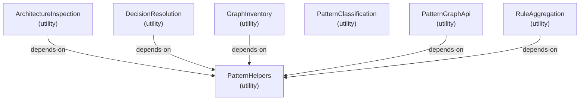

### Bounded context: rendering (7 patterns)

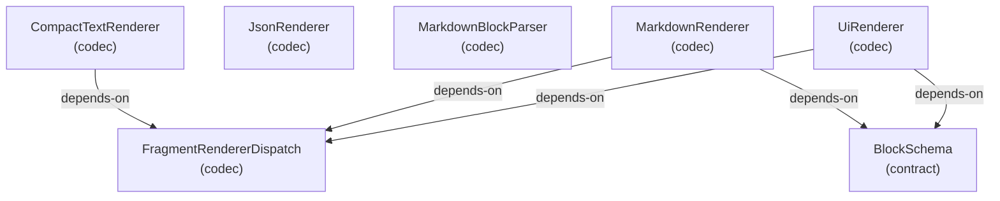

### Bounded context: scanner (4 patterns)

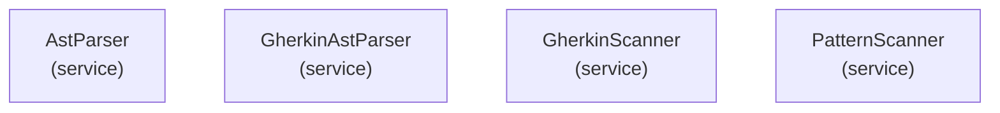

### Bounded context: validation (8 patterns)

```mermaid
graph TD
  antipatterndetector["AntiPatternDetector<br/>(service)"]
  dodvalidationtypes["DoDValidationTypes<br/>(contract)"]
  dodvalidator["DoDValidator<br/>(service)"]
  fsmstates["FSMStates<br/>(read-model)"]
  fsmtransitions["FSMTransitions<br/>(read-model)"]
  fsmvalidator["FSMValidator<br/>(decider)"]
  validatepatternscli["ValidatePatternsCLI<br/>(service)"]
  validationmodule["ValidationModule<br/>(barrel)"]
  antipatterndetector -->|depends-on| dodvalidationtypes
  dodvalidator -->|depends-on| dodvalidationtypes
  fsmvalidator -->|depends-on| fsmstates
  fsmvalidator -->|depends-on| fsmtransitions
  validationmodule -->|depends-on| antipatterndetector
  validationmodule -->|depends-on| dodvalidationtypes
  validationmodule -->|depends-on| dodvalidator
```

### Bounded context: validation-schemas (4 patterns)

```mermaid
graph TD
  codecutils["CodecUtils<br/>(codec)"]
  extractedpattern["ExtractedPattern<br/>(contract)"]
  patterngraph["PatternGraph<br/>(contract)"]
  tagregistryschemas["TagRegistrySchemas<br/>(contract)"]
  patterngraph -->|depends-on| extractedpattern
```

### Uncontextualized · role: contract (4 patterns)

```mermaid
graph TD
  errorfactorytypes["ErrorFactoryTypes<br/>(contract)"]
  projectionfragmentcontracts["ProjectionFragmentContracts<br/>(contract)"]
  projectionfragmentschema["ProjectionFragmentSchema<br/>(contract)"]
  resultmonadtypes["ResultMonadTypes<br/>(contract)"]
```

## Fan-in

Most-depended-on patterns in this view, ranked by in-view dependant count.

| Pattern                              | Dependants | Top dependants                                                                                                                                          |
| ------------------------------------ | ---------- | ------------------------------------------------------------------------------------------------------------------------------------------------------- |
| ProjectionFragmentContracts          | 17         | ArchitectureDiagramProjection, BusinessRulesProjection, DecisionCatalogProjection, DeliverableProjection, DocumentationBundle                           |
| ExtractedPattern                     | 14         | ArchitectureInspection, DecisionResolution, DeliveryReportingProjectionSupport, DualSourceExtractor, ExecutionContextProjectionSupport                  |
| PatternGraph                         | 11         | ArchitectureInspection, BuildPipeline, DecisionResolution, DoDValidator, GraphInventory                                                                 |
| PatternRelationsFragmentContracts    | 11         | ArchitectureComparisonProjection, ArchitectureNeighborhoodProjection, DependencyContextProjection, DependencyEdgeProjection, OpenQuestionListProjection |
| PatternRelationsProjectionSupport    | 11         | ArchitectureComparisonProjection, ArchitectureNeighborhoodProjection, BoundedContextProjection, DependencyContextProjection, DependencyEdgeProjection   |
| OperationalInsightsProjectionSupport | 8          | AnnotationCoverageProjection, OverviewProjection, RequirementDigestProjection, RequirementExecutableDigestProjection, RequirementSpecsDigestProjection  |
| BlockSchema                          | 7          | ArchitectureDiagram, DecisionRecord, DocumentationCompositionSupporting, MarkdownRenderer, OperationalInsightsSupporting                                |
| PatternHelpers                       | 6          | ArchitectureInspection, DecisionResolution, DualSourceExtractor, GraphInventory, PatternGraphApi                                                        |
| ProjectionFragmentSchema             | 6          | ApiReferenceProjection, CompactTextRenderer, FragmentRendererDispatch, JsonRenderer, MarkdownRenderer                                                   |
| DeliveryReportingProjectionSupport   | 5          | PhaseProgressProjection, ReleaseNotesProjection, RoadmapTimelineProjection, StatusDistributionProjection, TraceabilityMatrixProjection                  |

## Cross-package bounded contexts

Bounded contexts whose patterns span more than one workspace package.

| Bounded context | Packages                                      | Patterns |
| --------------- | --------------------------------------------- | -------- |
| cli             | Architect CLI, Architect Guard, Architect MCP | 6        |
| rendering       | Architect Core, Architect Projection          | 7        |
| validation      | Architect Core, Architect Guard               | 8        |

## Legend

### Legend

- Solid arrow = dependency (depends-on / uses)
- Dotted line = reference (see-also)

## Patterns

- AnnotationCoverage
- AnnotationCoverageProjection
- AntiPatternDetector
- ApiReferenceDigest
- ApiReferenceProjection
- ArchitectureComparison
- ArchitectureComparisonProjection
- ArchitectureDiagram
- ArchitectureDiagramProjection
- ArchitectureGraphProjection
- ArchitectureInspection
- ArchitectureNeighborhood
- ArchitectureNeighborhoodProjection
- AstParser
- BlockSchema
- BoundedContextFragmentContract
- BoundedContextProjection
- BuildPipeline
- BusinessRule
- BusinessRuleReference
- BusinessRuleSet
- BusinessRulesProjection
- CLIErrorHandler
- CLIRuntimePaths
- CLIVersionHelper
- CodecUtils
- CompactTextRenderer
- ConfigLoader
- DecisionCatalog
- DecisionCatalogProjection
- DecisionRecord
- DecisionResolution
- DefineConfig
- Deliverable
- DeliverableManifest
- DeliverableProjection
- DeliveryReportingFragmentContracts
- DeliveryReportingProjectionSupport
- DeliveryReportingSupporting
- DependencyContext
- DependencyContextProjection
- DependencyEdge
- DependencyEdgeProjection
- DependencyEdgeSet
- DeriveProcessState
- DetectChanges
- DocExtractor
- DocumentationBundle
- DocumentationCompositionProjectionSupport
- DocumentationCompositionSupporting
- DoDValidationTypes
- DoDValidator
- DualSourceExtractor
- ErrorFactoryTypes
- ExecutionContextProjectionSupport
- ExecutionContextSupporting
- ExtractedPattern
- ExtractionDiagnostics
- FileReadingList
- FileReadingListProjection
- FragmentRendererDispatch
- FSMStates
- FSMTransitions
- FSMValidator
- GeneratorDegeneracyGuard
- GherkinAstParser
- GherkinExtractor
- GherkinScanner
- GitBranchDiff
- GitHelpers
- GitModule
- GitNameStatusParser
- GovernanceProjectionSupport
- GovernanceSupporting
- GraphInventory
- HandoffProjection
- HandoffRecord
- JsonRenderer
- LayerInference
- LintEngine
- LintModule
- LintPatternsCLI
- LintProcessCLI
- LintRules
- MarkdownBlockParser
- MarkdownRenderer
- MCPFileWatcher
- MCPPipelineSession
- MCPServer
- MCPServerBin
- MCPToolRegistry
- OpenQuestionListProjection
- OperationalInsightsProjectionSupport
- OperationalInsightsSupporting
- OrphanPatternList
- OrphanPatternListProjection
- OverviewDigest
- OverviewProjection
- PackageResolver
- PatternBundleProjection
- PatternCatalog
- PatternCatalogProjection
- PatternClassification
- PatternDetail
- PatternDetailProjection
- PatternGraph
- PatternGraphApi
- PatternGraphCLI
- PatternHelpers
- PatternRelationsFragmentContracts
- PatternRelationsProjectionSupport
- PatternRelationsSupporting
- PatternScanner
- PatternSummary
- PatternSummaryProjection
- PhaseProgress
- PhaseProgressProjection
- PrChangeReview
- PrChangeReviewProjection
- ProcessGuardDecider
- ProcessGuardLinter
- ProcessGuardTypes
- ProjectConfigProjection
- ProjectConfigSnapshot
- ProjectionFragmentContracts
- ProjectionFragmentSchema
- RegistryBuilder
- ReleaseNotesDigest
- ReleaseNotesProjection
- RequirementDigest
- RequirementDigestProjection
- RequirementExecutableDigestProjection
- RequirementSpecsDigestProjection
- ResultMonadTypes
- RoadmapTimeline
- RoadmapTimelineProjection
- RoleProfile
- RoleProfileCollection
- RoleProfileProjection
- RuleAggregation
- ScopeReadinessCheck
- ScopeReadinessProjection
- ScopeReadinessReport
- SessionContextBundle
- SessionContextProjection
- SessionStateReader
- ShapeExtractor
- SourceInventoryDigest
- SourceInventoryEntry
- SourceInventoryProjection
- SourceMerge
- StatusDistribution
- StatusDistributionProjection
- TagRegistrySchemas
- TagUsageEntry
- TagUsageMatrix
- TagUsageProjection
- TaxonomyDigest
- TaxonomyDigestProjection
- TraceabilityMatrix
- TraceabilityMatrixProjection
- UiRenderer
- ValidatePatternsCLI
- ValidationModule
- ValidationRuleDigest
- ValidationRuleDigestProjection
