# Design Review

**Purpose:** Component diagrams over the live pattern graph — including not-yet-implemented specs — so a planned pattern's shape is reviewable before implementation.
**Detail Level:** Working-state-inclusive context map plus per-lens component diagrams

---

## Overview

This view captures 268 patterns across 25 diagrams in the Component view.

## Related views

- [By Layer](design-review/by-layer.md)
- [By Package](design-review/by-package.md)
- [By Theme](design-review/by-theme.md)

## Diagrams

### Context Map

Each node is a group; each arrow is a cross-group dependency (`depends-on` / `uses`, pointing from dependant to dependency). The per-group diagrams below detail each group’s internal dependencies and any see-also references.

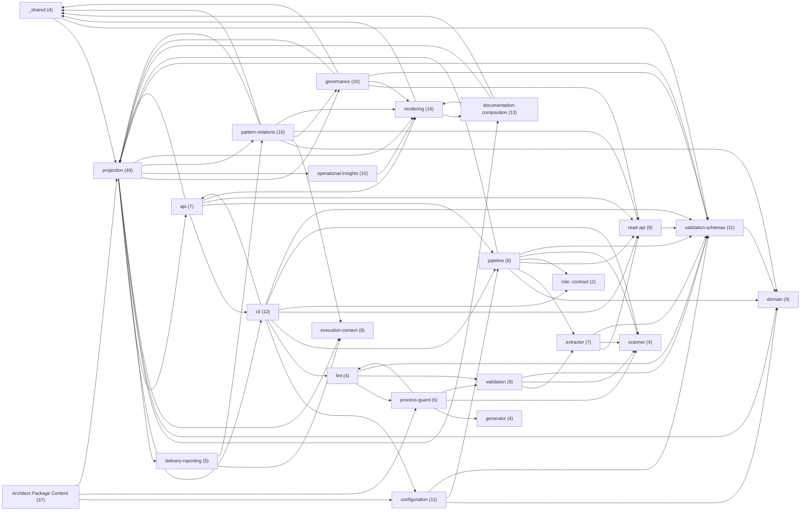

### Bounded context: \_shared (4 patterns)

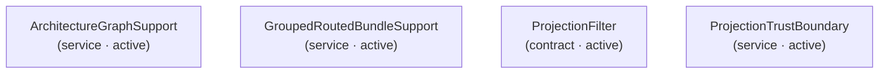

### Bounded context: api (7 patterns)

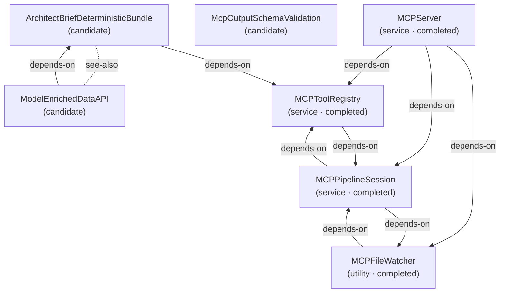

### Bounded context: cli (12 patterns)

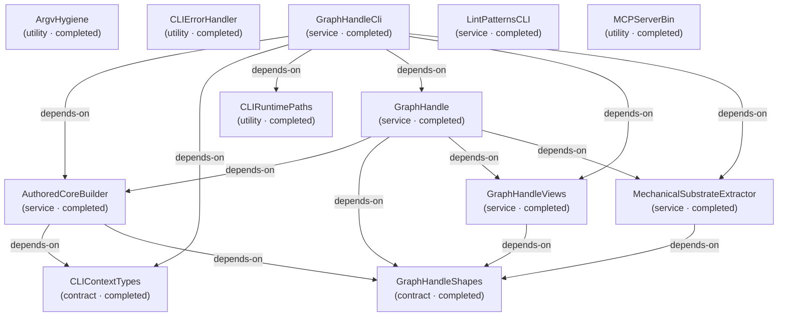

### Bounded context: configuration (11 patterns)

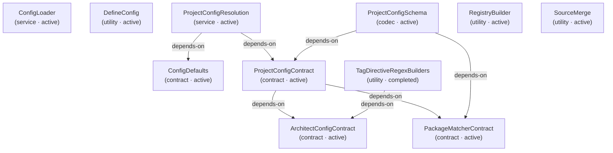

### Bounded context: delivery-reporting (5 patterns)

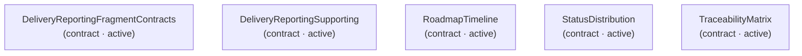

### Bounded context: documentation-composition (13 patterns)

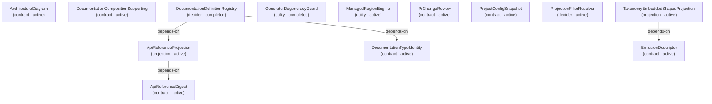

### Bounded context: domain (9 patterns)

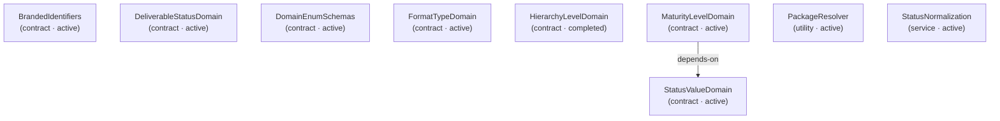

### Bounded context: execution-context (8 patterns)

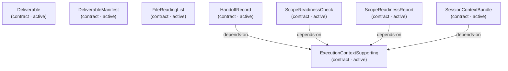

### Bounded context: extractor (7 patterns)

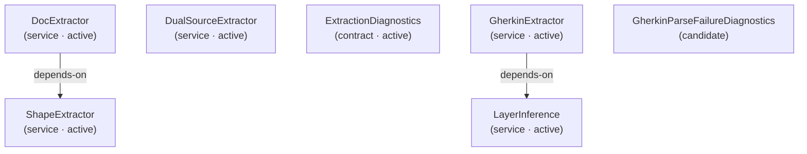

### Bounded context: generator (4 patterns)

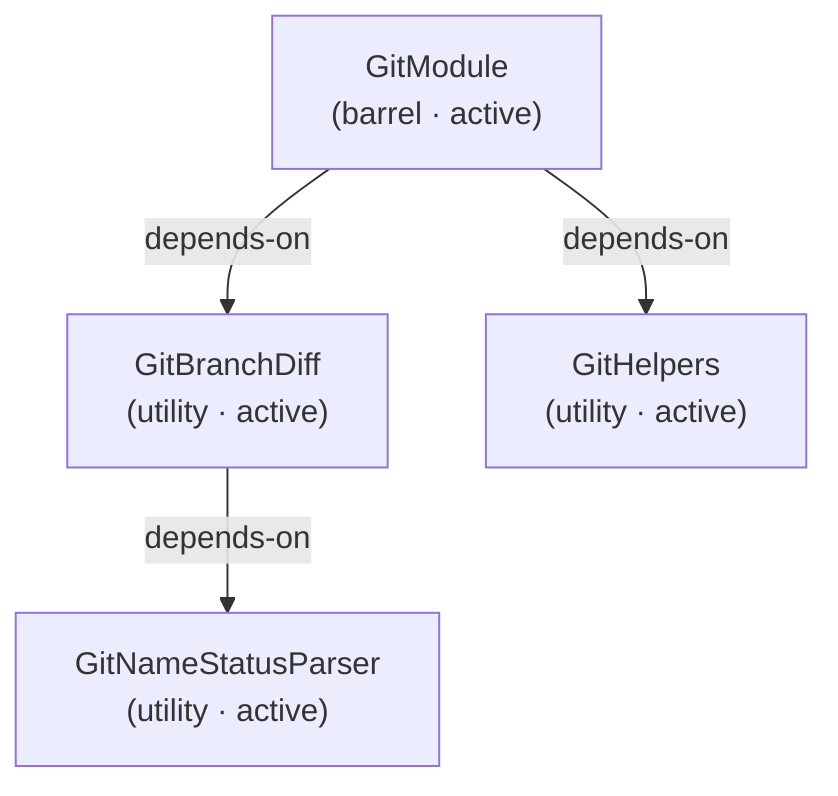

### Bounded context: governance (10 patterns)

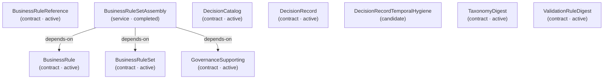

### Bounded context: lint (4 patterns)

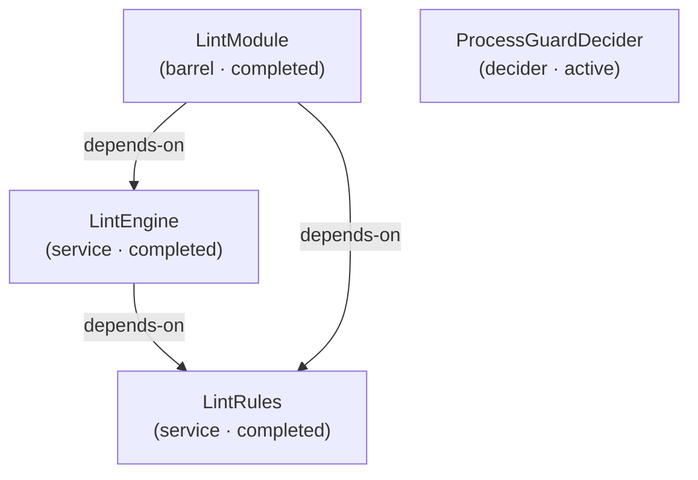

### Bounded context: operational-insights (10 patterns)

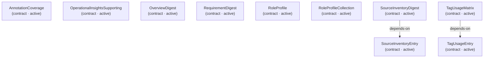

### Bounded context: pattern-relations (16 patterns)

```mermaid
graph TD
  architecturecomparison["ArchitectureComparison<br/>(contract · active)"]
  architectureneighborhood["ArchitectureNeighborhood<br/>(contract · active)"]
  boundedcontextfragmentcontract["BoundedContextFragmentContract<br/>(contract · active)"]
  dependencycontext["DependencyContext<br/>(contract · active)"]
  dependencyedge["DependencyEdge<br/>(contract · active)"]
  dependencyedgeset["DependencyEdgeSet<br/>(contract · active)"]
  openquestionlist["OpenQuestionList<br/>(contract · completed)"]
  orphanpatternlist["OrphanPatternList<br/>(contract · active)"]
  patternbundleassembly["PatternBundleAssembly<br/>(service · completed)"]
  patternbundleentry["PatternBundleEntry<br/>(contract · completed)"]
  patterncatalog["PatternCatalog<br/>(contract · active)"]
  patterncatalogassembly["PatternCatalogAssembly<br/>(service · completed)"]
  patterndetail["PatternDetail<br/>(contract · active)"]
  patternrelationsfragmentcontracts["PatternRelationsFragmentContracts<br/>(contract · active)"]
  patternrelationssupporting["PatternRelationsSupporting<br/>(contract · active)"]
  patternsummary["PatternSummary<br/>(contract · active)"]
  patternbundleassembly -->|depends-on| patterncatalogassembly
  patternbundleentry -->|depends-on| patternrelationssupporting
  patternbundleentry -->|depends-on| patternsummary
  patterncatalogassembly -->|depends-on| patterncatalog
```

### Bounded context: pipeline (6 patterns)

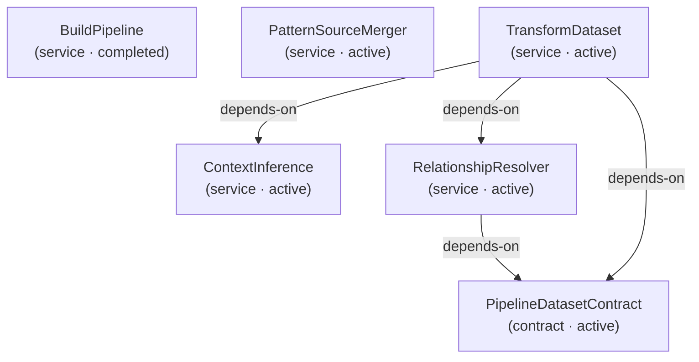

### Bounded context: process-guard (6 patterns)

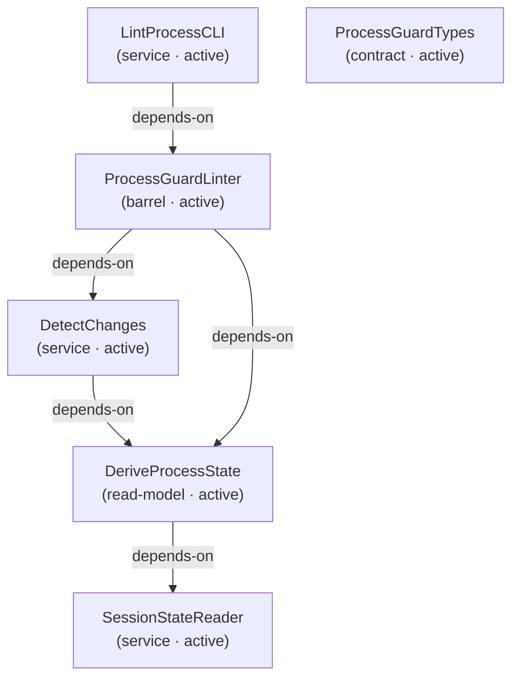

### Bounded context: projection (49 patterns)

```mermaid
graph TD
  annotationcoverageprojection["AnnotationCoverageProjection<br/>(projection · completed)"]
  architecturecomparisonprojection["ArchitectureComparisonProjection<br/>(projection · completed)"]
  architecturediagramprojection["ArchitectureDiagramProjection<br/>(projection · completed)"]
  architecturegraphprojection["ArchitectureGraphProjection<br/>(projection · active)"]
  architectureneighborhoodprojection["ArchitectureNeighborhoodProjection<br/>(projection · completed)"]
  boundedcontextprojection["BoundedContextProjection<br/>(projection · completed)"]
  businessrulesprojection["BusinessRulesProjection<br/>(projection · completed)"]
  changelogprojection["ChangelogProjection<br/>(projection · completed)"]
  decisioncatalogprojection["DecisionCatalogProjection<br/>(projection · completed)"]
  deliverableprojection["DeliverableProjection<br/>(projection · completed)"]
  deliveryreportingprojectionsupport["DeliveryReportingProjectionSupport<br/>(utility · completed)"]
  dependencycontextprojection["DependencyContextProjection<br/>(projection · completed)"]
  dependencyedgeprojection["DependencyEdgeProjection<br/>(projection · completed)"]
  designreviewprojection["DesignReviewProjection<br/>(projection · active)"]
  documentationbundle["DocumentationBundle<br/>(projection · completed)"]
  documentationcompositionprojectionsupport["DocumentationCompositionProjectionSupport<br/>(utility · completed)"]
  documentationtyperegistry["DocumentationTypeRegistry<br/>(contract · active)"]
  executioncontextprojectionsupport["ExecutionContextProjectionSupport<br/>(utility · completed)"]
  filereadinglistprojection["FileReadingListProjection<br/>(projection · completed)"]
  governanceprojectionsupport["GovernanceProjectionSupport<br/>(utility · completed)"]
  handoffprojection["HandoffProjection<br/>(projection · completed)"]
  openquestionlistprojection["OpenQuestionListProjection<br/>(projection · active)"]
  operationalinsightsprojectionsupport["OperationalInsightsProjectionSupport<br/>(utility · completed)"]
  orphanpatternlistprojection["OrphanPatternListProjection<br/>(projection · completed)"]
  overviewprojection["OverviewProjection<br/>(projection · completed)"]
  patternbundleprojection["PatternBundleProjection<br/>(projection · active)"]
  patterncatalogprojection["PatternCatalogProjection<br/>(projection · completed)"]
  patterndetailprojection["PatternDetailProjection<br/>(projection · completed)"]
  patternrelationsprojectionsupport["PatternRelationsProjectionSupport<br/>(utility · completed)"]
  patternsummaryprojection["PatternSummaryProjection<br/>(projection · completed)"]
  prchangereviewprojection["PrChangeReviewProjection<br/>(projection · completed)"]
  projectconfigprojection["ProjectConfigProjection<br/>(projection · completed)"]
  projectionbundle["ProjectionBundle<br/>(contract · active)"]
  projectioncontext["ProjectionContext<br/>(contract · active)"]
  projectionerror["ProjectionError<br/>(contract · active)"]
  requirementdigestprojection["RequirementDigestProjection<br/>(projection · completed)"]
  requirementexecutabledigestprojection["RequirementExecutableDigestProjection<br/>(projection · completed)"]
  requirementspecsdigestprojection["RequirementSpecsDigestProjection<br/>(projection · completed)"]
  roadmaptimelineprojection["RoadmapTimelineProjection<br/>(projection · completed)"]
  roleprofileprojection["RoleProfileProjection<br/>(projection · completed)"]
  scopereadinessprojection["ScopeReadinessProjection<br/>(projection · completed)"]
  sessioncontextprojection["SessionContextProjection<br/>(projection · completed)"]
  sourceinventoryprojection["SourceInventoryProjection<br/>(projection · completed)"]
  statusdistributionprojection["StatusDistributionProjection<br/>(projection · completed)"]
  tagusageprojection["TagUsageProjection<br/>(projection · completed)"]
  taxonomydigestprojection["TaxonomyDigestProjection<br/>(projection · completed)"]
  traceabilitymatrixprojection["TraceabilityMatrixProjection<br/>(projection · completed)"]
  validationruledigestprojection["ValidationRuleDigestProjection<br/>(projection · completed)"]
  valuetransferstate["ValueTransferState<br/>(candidate)"]
  annotationcoverageprojection -->|depends-on| operationalinsightsprojectionsupport
  architecturecomparisonprojection -->|depends-on| patternrelationsprojectionsupport
  architecturediagramprojection -->|depends-on| documentationcompositionprojectionsupport
  architectureneighborhoodprojection -->|depends-on| patternrelationsprojectionsupport
  boundedcontextprojection -->|depends-on| patternrelationsprojectionsupport
  businessrulesprojection -->|depends-on| governanceprojectionsupport
  changelogprojection -->|depends-on| deliveryreportingprojectionsupport
  decisioncatalogprojection -->|depends-on| governanceprojectionsupport
  deliverableprojection -->|depends-on| executioncontextprojectionsupport
  dependencycontextprojection -->|depends-on| patternrelationsprojectionsupport
  dependencyedgeprojection -->|depends-on| patternrelationsprojectionsupport
  designreviewprojection -->|depends-on| architecturediagramprojection
  documentationbundle -->|depends-on| documentationcompositionprojectionsupport
  filereadinglistprojection -->|depends-on| executioncontextprojectionsupport
  handoffprojection -->|depends-on| executioncontextprojectionsupport
  openquestionlistprojection -->|depends-on| patternrelationsprojectionsupport
  orphanpatternlistprojection -->|depends-on| patternrelationsprojectionsupport
  overviewprojection -->|depends-on| operationalinsightsprojectionsupport
  patternbundleprojection -->|depends-on| patternrelationsprojectionsupport
  patterncatalogprojection -->|depends-on| patternrelationsprojectionsupport
  patterndetailprojection -->|depends-on| patternrelationsprojectionsupport
  patternsummaryprojection -->|depends-on| patternrelationsprojectionsupport
  prchangereviewprojection -->|depends-on| documentationcompositionprojectionsupport
  projectconfigprojection -->|depends-on| documentationcompositionprojectionsupport
  requirementdigestprojection -->|depends-on| operationalinsightsprojectionsupport
  requirementexecutabledigestprojection -->|depends-on| operationalinsightsprojectionsupport
  requirementspecsdigestprojection -->|depends-on| operationalinsightsprojectionsupport
  roadmaptimelineprojection -->|depends-on| deliveryreportingprojectionsupport
  roleprofileprojection -->|depends-on| operationalinsightsprojectionsupport
  scopereadinessprojection -->|depends-on| executioncontextprojectionsupport
  sessioncontextprojection -->|depends-on| executioncontextprojectionsupport
  sourceinventoryprojection -->|depends-on| operationalinsightsprojectionsupport
  statusdistributionprojection -->|depends-on| deliveryreportingprojectionsupport
  tagusageprojection -->|depends-on| operationalinsightsprojectionsupport
  taxonomydigestprojection -->|depends-on| governanceprojectionsupport
  traceabilitymatrixprojection -->|depends-on| deliveryreportingprojectionsupport
  validationruledigestprojection -->|depends-on| governanceprojectionsupport
```

### Bounded context: read-api (8 patterns)

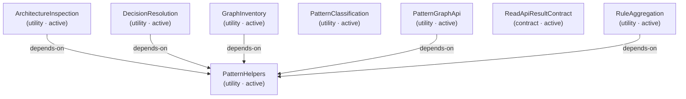

### Bounded context: rendering (16 patterns)

```mermaid
graph TD
  blockschema["BlockSchema<br/>(contract · active)"]
  compacttextrenderer["CompactTextRenderer<br/>(codec · completed)"]
  deterministicformatutils["DeterministicFormatUtils<br/>(utility · completed)"]
  disclosurespec["DisclosureSpec<br/>(contract · active)"]
  fragmentrendererdispatch["FragmentRendererDispatch<br/>(codec · completed)"]
  jsonrenderer["JsonRenderer<br/>(codec · completed)"]
  logicalrouteid["LogicalRouteId<br/>(contract · active)"]
  markdownblockparser["MarkdownBlockParser<br/>(codec · active)"]
  markdownrenderer["MarkdownRenderer<br/>(codec · completed)"]
  markdownrouteprofile["MarkdownRouteProfile<br/>(service · active)"]
  progressivedisclosurelevel["ProgressiveDisclosureLevel<br/>(contract · active)"]
  projectionfragmentcontracts["ProjectionFragmentContracts<br/>(contract · active)"]
  projectionfragmentschema["ProjectionFragmentSchema<br/>(contract · active)"]
  rendereroptions["RendererOptions<br/>(contract · active)"]
  slugcanonicalization["SlugCanonicalization<br/>(utility · completed)"]
  uirenderer["UiRenderer<br/>(codec · completed)"]
  compacttextrenderer -->|depends-on| fragmentrendererdispatch
  compacttextrenderer -->|depends-on| projectionfragmentschema
  fragmentrendererdispatch -->|depends-on| projectionfragmentschema
  jsonrenderer -->|depends-on| projectionfragmentschema
  markdownrenderer -->|depends-on| blockschema
  markdownrenderer -->|depends-on| fragmentrendererdispatch
  markdownrenderer -->|depends-on| projectionfragmentschema
  markdownrouteprofile -->|depends-on| logicalrouteid
  rendereroptions -->|depends-on| disclosurespec
  uirenderer -->|depends-on| blockschema
  uirenderer -->|depends-on| fragmentrendererdispatch
  uirenderer -->|depends-on| projectionfragmentschema
```

### Bounded context: scanner (4 patterns)

```mermaid
graph TD
  astparser["AstParser<br/>(service · active)"]
  gherkinastparser["GherkinAstParser<br/>(service · active)"]
  gherkinscanner["GherkinScanner<br/>(service · active)"]
  patternscanner["PatternScanner<br/>(service · active)"]
```

### Bounded context: validation (9 patterns)

```mermaid
graph TD
  antipatterndetector["AntiPatternDetector<br/>(service · completed)"]
  antipatternvalidationtypes["AntiPatternValidationTypes<br/>(contract · completed)"]
  fsmstates["FSMStates<br/>(read-model · active)"]
  fsmtransitions["FSMTransitions<br/>(read-model · active)"]
  fsmvalidator["FSMValidator<br/>(decider · active)"]
  trustboundaryparser["TrustBoundaryParser<br/>(service · active)"]
  validatepatternscli["ValidatePatternsCLI<br/>(service · completed)"]
  validationmodule["ValidationModule<br/>(barrel · completed)"]
  zoderrorboundary["ZodErrorBoundary<br/>(utility · active)"]
  antipatterndetector -->|depends-on| antipatternvalidationtypes
  fsmvalidator -->|depends-on| fsmstates
  fsmvalidator -->|depends-on| fsmtransitions
  validationmodule -->|depends-on| antipatterndetector
  validationmodule -->|depends-on| antipatternvalidationtypes
  zoderrorboundary -->|depends-on| trustboundaryparser
```

### Bounded context: validation-schemas (11 patterns)

```mermaid
graph TD
  codecutils["CodecUtils<br/>(codec · active)"]
  configvalidationschemas["ConfigValidationSchemas<br/>(contract · completed)"]
  docdirectivecontract["DocDirectiveContract<br/>(contract · active)"]
  dualsourceschemas["DualSourceSchemas<br/>(contract · active)"]
  exportinfocontract["ExportInfoContract<br/>(contract · active)"]
  extractedpattern["ExtractedPattern<br/>(contract · active)"]
  gherkinscanresultcontract["GherkinScanResultContract<br/>(contract · active)"]
  lintviolationcontract["LintViolationContract<br/>(contract · active)"]
  patterngraph["PatternGraph<br/>(contract · active)"]
  patternreferencecontract["PatternReferenceContract<br/>(contract · active)"]
  tagregistryschemas["TagRegistrySchemas<br/>(contract · active)"]
  docdirectivecontract -->|depends-on| tagregistryschemas
  patterngraph -->|depends-on| extractedpattern
```

### Uncontextualized · role: contract (2 patterns)

```mermaid
graph TD
  errorfactorytypes["ErrorFactoryTypes<br/>(contract · completed)"]
  resultmonadtypes["ResultMonadTypes<br/>(contract · completed)"]
```

### Unclassified · Architect Package Content (37 patterns)

```mermaid
graph TD
  adr001taxonomycanonicalvalues["ADR001TaxonomyCanonicalValues<br/>(completed)"]
  adr002gherkinonlytesting["ADR002GherkinOnlyTesting<br/>(completed)"]
  adr003sourcefirstpatternarchitecture["ADR003SourceFirstPatternArchitecture<br/>(completed)"]
  adr005codecbasedmarkdownrendering["ADR005CodecBasedMarkdownRendering<br/>(completed)"]
  adr006singlereadmodelarchitecture["ADR006SingleReadModelArchitecture<br/>(completed)"]
  adr007coordinatedtaxonomyredesign["ADR007CoordinatedTaxonomyRedesign<br/>(completed)"]
  adr008stepdefinitionstubsconvention["ADR008StepDefinitionStubsConvention<br/>(completed)"]
  adr009projectiontrustboundary["ADR009ProjectionTrustBoundary<br/>(completed)"]
  adr010documentationcompositionhelpers["ADR010DocumentationCompositionHelpers<br/>(completed)"]
  adr012deliverynavigation["ADR012DeliveryNavigation<br/>(completed)"]
  adr013taxonomyretirement["ADR013TaxonomyRetirement<br/>(completed)"]
  adr014agentreadsurface["ADR014AgentReadSurface<br/>(completed)"]
  apireferenceshapecoverage["ApiReferenceShapeCoverage<br/>(candidate)"]
  architecturedelta["ArchitectureDelta<br/>(roadmap)"]
  assistivecodeintelligence["AssistiveCodeIntelligence<br/>(epic · candidate)"]
  codecbehaviorexecutabletests["CodecBehaviorExecutableTests<br/>(roadmap)"]
  documentationprojection["DocumentationProjection<br/>(epic · candidate)"]
  generatorinfrastructureexecutabletests["GeneratorInfrastructureExecutableTests<br/>(roadmap)"]
  goalorientednavigation["GoalOrientedNavigation<br/>(roadmap)"]
  monoreposupport["MonorepoSupport<br/>(roadmap)"]
  multisourcecomposition["MultiSourceComposition<br/>(candidate)"]
  onesourcemultipleaudiences["OneSourceMultipleAudiences<br/>(candidate)"]
  pdr001sessionworkflowcommands["PDR001SessionWorkflowCommands<br/>(completed)"]
  pdr005processguardfsm["PDR005ProcessGuardFSM<br/>(completed)"]
  pdr006advisoryprocessguardprotection["PDR006AdvisoryProcessGuardProtection<br/>(completed)"]
  prdimplementationsection["PrdImplementationSection<br/>(roadmap)"]
  progressivegovernance["ProgressiveGovernance<br/>(roadmap)"]
  readmodelreflexivity["ReadModelReflexivity<br/>(candidate)"]
  sessionfilecleanup["SessionFileCleanup<br/>(roadmap)"]
  setupcommand["SetupCommand<br/>(roadmap)"]
  sourcecanonical["SourceCanonical<br/>(candidate)"]
  statusawareeslintsuppression["StatusAwareEslintSuppression<br/>(roadmap)"]
  stepdefinitioncompletion["StepDefinitionCompletion<br/>(roadmap)"]
  streaminggitdiff["StreamingGitDiff<br/>(roadmap)"]
  taxonomydocumentationcluster["TaxonomyDocumentationCluster<br/>(completed)"]
  traceabilityenhancements["TraceabilityEnhancements<br/>(roadmap)"]
  traceabilitygenerator["TraceabilityGenerator<br/>(roadmap)"]
  adr001taxonomycanonicalvalues -. see-also .- adr007coordinatedtaxonomyredesign
  adr001taxonomycanonicalvalues -. see-also .- adr012deliverynavigation
  adr001taxonomycanonicalvalues -. see-also .- adr013taxonomyretirement
  adr003sourcefirstpatternarchitecture -->|depends-on| adr001taxonomycanonicalvalues
  adr006singlereadmodelarchitecture -->|depends-on| adr005codecbasedmarkdownrendering
  adr007coordinatedtaxonomyredesign -->|depends-on| adr001taxonomycanonicalvalues
  adr007coordinatedtaxonomyredesign -->|depends-on| pdr005processguardfsm
  adr008stepdefinitionstubsconvention -->|depends-on| adr002gherkinonlytesting
  adr008stepdefinitionstubsconvention -->|depends-on| adr003sourcefirstpatternarchitecture
  adr009projectiontrustboundary -. see-also .- adr005codecbasedmarkdownrendering
  adr009projectiontrustboundary -. see-also .- adr006singlereadmodelarchitecture
  adr010documentationcompositionhelpers -. see-also .- adr005codecbasedmarkdownrendering
  adr010documentationcompositionhelpers -. see-also .- adr006singlereadmodelarchitecture
  adr010documentationcompositionhelpers -. see-also .- adr009projectiontrustboundary
  adr012deliverynavigation -->|depends-on| adr001taxonomycanonicalvalues
  adr012deliverynavigation -->|depends-on| adr003sourcefirstpatternarchitecture
  adr012deliverynavigation -. see-also .- adr013taxonomyretirement
  adr013taxonomyretirement -->|depends-on| adr001taxonomycanonicalvalues
  adr013taxonomyretirement -->|depends-on| adr007coordinatedtaxonomyredesign
  adr014agentreadsurface -->|depends-on| adr006singlereadmodelarchitecture
  adr014agentreadsurface -->|depends-on| adr010documentationcompositionhelpers
  documentationprojection -->|depends-on| adr010documentationcompositionhelpers
  goalorientednavigation -. see-also .- adr006singlereadmodelarchitecture
  goalorientednavigation -. see-also .- adr009projectiontrustboundary
  goalorientednavigation -. see-also .- adr010documentationcompositionhelpers
  goalorientednavigation -. see-also .- taxonomydocumentationcluster
  pdr005processguardfsm -->|depends-on| adr001taxonomycanonicalvalues
  pdr006advisoryprocessguardprotection -->|depends-on| adr001taxonomycanonicalvalues
  pdr006advisoryprocessguardprotection -->|depends-on| pdr005processguardfsm
  stepdefinitioncompletion -->|depends-on| adr002gherkinonlytesting
  taxonomydocumentationcluster -. see-also .- adr010documentationcompositionhelpers
  taxonomydocumentationcluster -. see-also .- multisourcecomposition
  taxonomydocumentationcluster -. see-also .- onesourcemultipleaudiences
  traceabilityenhancements -->|depends-on| traceabilitygenerator
```

## Fan-in

Most-depended-on patterns in this view, ranked by in-view dependant count.

| Pattern                              | Dependants | Top dependants                                                                                                                                          |
| ------------------------------------ | ---------- | ------------------------------------------------------------------------------------------------------------------------------------------------------- |
| ExtractedPattern                     | 21         | ArchitectureGraphSupport, ArchitectureInspection, BusinessRuleSetAssembly, DecisionResolution, DeliveryReportingProjectionSupport                       |
| ProjectionFragmentContracts          | 17         | ArchitectureDiagramProjection, BusinessRulesProjection, DecisionCatalogProjection, DeliverableProjection, DocumentationBundle                           |
| PatternGraph                         | 15         | ArchitectureInspection, BuildPipeline, DecisionResolution, GraphInventory, PatternClassification                                                        |
| PatternRelationsProjectionSupport    | 13         | ArchitectureComparisonProjection, ArchitectureNeighborhoodProjection, BoundedContextProjection, DependencyContextProjection, DependencyEdgeProjection   |
| PatternHelpers                       | 11         | ArchitectureInspection, BusinessRuleSetAssembly, DecisionResolution, DualSourceExtractor, GraphInventory                                                |
| PatternRelationsFragmentContracts    | 11         | ArchitectureComparisonProjection, ArchitectureNeighborhoodProjection, DependencyContextProjection, DependencyEdgeProjection, OpenQuestionListProjection |
| OperationalInsightsProjectionSupport | 8          | AnnotationCoverageProjection, OverviewProjection, RequirementDigestProjection, RequirementExecutableDigestProjection, RequirementSpecsDigestProjection  |
| BlockSchema                          | 7          | ArchitectureDiagram, DecisionRecord, DocumentationCompositionSupporting, MarkdownRenderer, OperationalInsightsSupporting                                |
| ProjectionFragmentSchema             | 7          | ApiReferenceProjection, CompactTextRenderer, FragmentRendererDispatch, JsonRenderer, MarkdownRenderer                                                   |
| ADR001TaxonomyCanonicalValues        | 6          | ADR003SourceFirstPatternArchitecture, ADR007CoordinatedTaxonomyRedesign, ADR012DeliveryNavigation, ADR013TaxonomyRetirement, PDR005ProcessGuardFSM      |

## Cross-package bounded contexts

Bounded contexts whose patterns span more than one workspace package.

| Bounded context | Packages                                                      | Patterns |
| --------------- | ------------------------------------------------------------- | -------- |
| cli             | Architect CLI, Architect Core, Architect Guard, Architect MCP | 12       |
| api             | Architect MCP, Architect Package Content                      | 7        |
| extractor       | Architect Core, Architect Package Content                     | 7        |
| governance      | Architect Package Content, Architect Projection               | 10       |
| projection      | Architect Package Content, Architect Projection               | 49       |
| rendering       | Architect Core, Architect Projection                          | 16       |
| validation      | Architect Core, Architect Guard                               | 9        |

## Legend

### Legend

- Solid arrow = dependency (depends-on / uses)
- Dotted line = reference (see-also)

## Patterns

- ADR001TaxonomyCanonicalValues
- ADR002GherkinOnlyTesting
- ADR003SourceFirstPatternArchitecture
- ADR005CodecBasedMarkdownRendering
- ADR006SingleReadModelArchitecture
- ADR007CoordinatedTaxonomyRedesign
- ADR008StepDefinitionStubsConvention
- ADR009ProjectionTrustBoundary
- ADR010DocumentationCompositionHelpers
- ADR012DeliveryNavigation
- ADR013TaxonomyRetirement
- ADR014AgentReadSurface
- AnnotationCoverage
- AnnotationCoverageProjection
- AntiPatternDetector
- AntiPatternValidationTypes
- ApiReferenceDigest
- ApiReferenceProjection
- ApiReferenceShapeCoverage
- ArchitectBriefDeterministicBundle
- ArchitectConfigContract
- ArchitectureComparison
- ArchitectureComparisonProjection
- ArchitectureDelta
- ArchitectureDiagram
- ArchitectureDiagramProjection
- ArchitectureGraphProjection
- ArchitectureGraphSupport
- ArchitectureInspection
- ArchitectureNeighborhood
- ArchitectureNeighborhoodProjection
- ArgvHygiene
- AssistiveCodeIntelligence
- AstParser
- AuthoredCoreBuilder
- BlockSchema
- BoundedContextFragmentContract
- BoundedContextProjection
- BrandedIdentifiers
- BuildPipeline
- BusinessRule
- BusinessRuleReference
- BusinessRuleSet
- BusinessRuleSetAssembly
- BusinessRulesProjection
- ChangelogProjection
- CLIContextTypes
- CLIErrorHandler
- CLIRuntimePaths
- CodecBehaviorExecutableTests
- CodecUtils
- CompactTextRenderer
- ConfigDefaults
- ConfigLoader
- ConfigValidationSchemas
- ContextInference
- DecisionCatalog
- DecisionCatalogProjection
- DecisionRecord
- DecisionRecordTemporalHygiene
- DecisionResolution
- DefineConfig
- Deliverable
- DeliverableManifest
- DeliverableProjection
- DeliverableStatusDomain
- DeliveryReportingFragmentContracts
- DeliveryReportingProjectionSupport
- DeliveryReportingSupporting
- DependencyContext
- DependencyContextProjection
- DependencyEdge
- DependencyEdgeProjection
- DependencyEdgeSet
- DeriveProcessState
- DesignReviewProjection
- DetectChanges
- DeterministicFormatUtils
- DisclosureSpec
- DocDirectiveContract
- DocExtractor
- DocumentationBundle
- DocumentationCompositionProjectionSupport
- DocumentationCompositionSupporting
- DocumentationDefinitionRegistry
- DocumentationProjection
- DocumentationTypeIdentity
- DocumentationTypeRegistry
- DomainEnumSchemas
- DualSourceExtractor
- DualSourceSchemas
- EmissionDescriptor
- ErrorFactoryTypes
- ExecutionContextProjectionSupport
- ExecutionContextSupporting
- ExportInfoContract
- ExtractedPattern
- ExtractionDiagnostics
- FileReadingList
- FileReadingListProjection
- FormatTypeDomain
- FragmentRendererDispatch
- FSMStates
- FSMTransitions
- FSMValidator
- GeneratorDegeneracyGuard
- GeneratorInfrastructureExecutableTests
- GherkinAstParser
- GherkinExtractor
- GherkinParseFailureDiagnostics
- GherkinScanner
- GherkinScanResultContract
- GitBranchDiff
- GitHelpers
- GitModule
- GitNameStatusParser
- GoalOrientedNavigation
- GovernanceProjectionSupport
- GovernanceSupporting
- GraphHandle
- GraphHandleCli
- GraphHandleShapes
- GraphHandleViews
- GraphInventory
- GroupedRoutedBundleSupport
- HandoffProjection
- HandoffRecord
- HierarchyLevelDomain
- JsonRenderer
- LayerInference
- LintEngine
- LintModule
- LintPatternsCLI
- LintProcessCLI
- LintRules
- LintViolationContract
- LogicalRouteId
- ManagedRegionEngine
- MarkdownBlockParser
- MarkdownRenderer
- MarkdownRouteProfile
- MaturityLevelDomain
- MCPFileWatcher
- McpOutputSchemaValidation
- MCPPipelineSession
- MCPServer
- MCPServerBin
- MCPToolRegistry
- MechanicalSubstrateExtractor
- ModelEnrichedDataAPI
- MonorepoSupport
- MultiSourceComposition
- OneSourceMultipleAudiences
- OpenQuestionList
- OpenQuestionListProjection
- OperationalInsightsProjectionSupport
- OperationalInsightsSupporting
- OrphanPatternList
- OrphanPatternListProjection
- OverviewDigest
- OverviewProjection
- PackageMatcherContract
- PackageResolver
- PatternBundleAssembly
- PatternBundleEntry
- PatternBundleProjection
- PatternCatalog
- PatternCatalogAssembly
- PatternCatalogProjection
- PatternClassification
- PatternDetail
- PatternDetailProjection
- PatternGraph
- PatternGraphApi
- PatternHelpers
- PatternReferenceContract
- PatternRelationsFragmentContracts
- PatternRelationsProjectionSupport
- PatternRelationsSupporting
- PatternScanner
- PatternSourceMerger
- PatternSummary
- PatternSummaryProjection
- PDR001SessionWorkflowCommands
- PDR005ProcessGuardFSM
- PDR006AdvisoryProcessGuardProtection
- PipelineDatasetContract
- PrChangeReview
- PrChangeReviewProjection
- PrdImplementationSection
- ProcessGuardDecider
- ProcessGuardLinter
- ProcessGuardTypes
- ProgressiveDisclosureLevel
- ProgressiveGovernance
- ProjectConfigContract
- ProjectConfigProjection
- ProjectConfigResolution
- ProjectConfigSchema
- ProjectConfigSnapshot
- ProjectionBundle
- ProjectionContext
- ProjectionError
- ProjectionFilter
- ProjectionFilterResolver
- ProjectionFragmentContracts
- ProjectionFragmentSchema
- ProjectionTrustBoundary
- ReadApiResultContract
- ReadModelReflexivity
- RegistryBuilder
- RelationshipResolver
- RendererOptions
- RequirementDigest
- RequirementDigestProjection
- RequirementExecutableDigestProjection
- RequirementSpecsDigestProjection
- ResultMonadTypes
- RoadmapTimeline
- RoadmapTimelineProjection
- RoleProfile
- RoleProfileCollection
- RoleProfileProjection
- RuleAggregation
- ScopeReadinessCheck
- ScopeReadinessProjection
- ScopeReadinessReport
- SessionContextBundle
- SessionContextProjection
- SessionFileCleanup
- SessionStateReader
- SetupCommand
- ShapeExtractor
- SlugCanonicalization
- SourceCanonical
- SourceInventoryDigest
- SourceInventoryEntry
- SourceInventoryProjection
- SourceMerge
- StatusAwareEslintSuppression
- StatusDistribution
- StatusDistributionProjection
- StatusNormalization
- StatusValueDomain
- StepDefinitionCompletion
- StreamingGitDiff
- TagDirectiveRegexBuilders
- TagRegistrySchemas
- TagUsageEntry
- TagUsageMatrix
- TagUsageProjection
- TaxonomyDigest
- TaxonomyDigestProjection
- TaxonomyDocumentationCluster
- TaxonomyEmbeddedShapesProjection
- TraceabilityEnhancements
- TraceabilityGenerator
- TraceabilityMatrix
- TraceabilityMatrixProjection
- TransformDataset
- TrustBoundaryParser
- UiRenderer
- ValidatePatternsCLI
- ValidationModule
- ValidationRuleDigest
- ValidationRuleDigestProjection
- ValueTransferState
- ZodErrorBoundary
