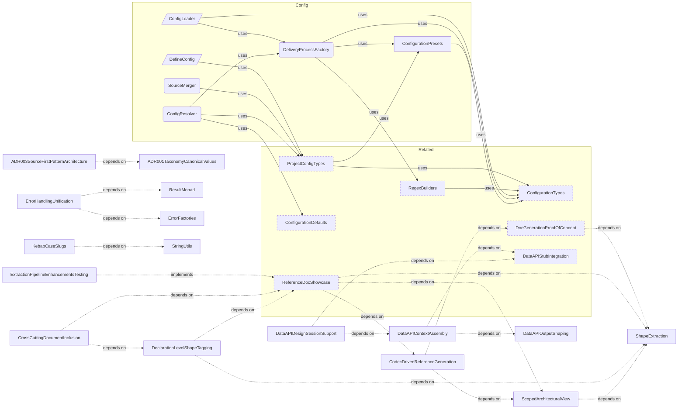

```mermaid
C4Context
    title System Architecture
    Boundary(config, "Config") {
        System(ConfigResolver, "ConfigResolver")
        System(ConfigurationPresets, "ConfigurationPresets")
        System(SourceMerger, "SourceMerger")
        System(DeliveryProcessFactory, "DeliveryProcessFactory")
        System(DefineConfig, "DefineConfig")
        System(ConfigLoader, "ConfigLoader")
    }
    System(ShapeExtraction, "ShapeExtraction")
    System(ScopedArchitecturalView, "ScopedArchitecturalView")
    System(DeclarationLevelShapeTagging, "DeclarationLevelShapeTagging")
    System(DataAPIDesignSessionSupport, "DataAPIDesignSessionSupport")
    System(DataAPIOutputShaping, "DataAPIOutputShaping")
    System(DataAPIContextAssembly, "DataAPIContextAssembly")
    System(CrossCuttingDocumentInclusion, "CrossCuttingDocumentInclusion")
    System(CodecDrivenReferenceGeneration, "CodecDrivenReferenceGeneration")
    System(ADR003SourceFirstPatternArchitecture, "ADR003SourceFirstPatternArchitecture")
    System(ADR001TaxonomyCanonicalValues, "ADR001TaxonomyCanonicalValues")
    System(ResultMonad, "ResultMonad")
    System(ErrorFactories, "ErrorFactories")
    System(StringUtils, "StringUtils")
    System(ExtractionPipelineEnhancementsTesting, "ExtractionPipelineEnhancementsTesting")
    System(KebabCaseSlugs, "KebabCaseSlugs")
    System(ErrorHandlingUnification, "ErrorHandlingUnification")
    System_Ext(ConfigurationTypes, "ConfigurationTypes")
    System_Ext(RegexBuilders, "RegexBuilders")
    System_Ext(ProjectConfigTypes, "ProjectConfigTypes")
    System_Ext(ConfigurationDefaults, "ConfigurationDefaults")
    System_Ext(ReferenceDocShowcase, "ReferenceDocShowcase")
    System_Ext(DocGenerationProofOfConcept, "DocGenerationProofOfConcept")
    System_Ext(DataAPIStubIntegration, "DataAPIStubIntegration")
    Rel(ConfigResolver, ProjectConfigTypes, "uses")
    Rel(ConfigResolver, DeliveryProcessFactory, "uses")
    Rel(ConfigResolver, ConfigurationDefaults, "uses")
    Rel(ConfigurationPresets, ConfigurationTypes, "uses")
    Rel(SourceMerger, ProjectConfigTypes, "uses")
    Rel(DeliveryProcessFactory, ConfigurationTypes, "uses")
    Rel(DeliveryProcessFactory, ConfigurationPresets, "uses")
    Rel(DeliveryProcessFactory, RegexBuilders, "uses")
    Rel(DefineConfig, ProjectConfigTypes, "uses")
    Rel(ConfigLoader, DeliveryProcessFactory, "uses")
    Rel(ConfigLoader, ConfigurationTypes, "uses")
    Rel(ScopedArchitecturalView, ShapeExtraction, "depends on")
    Rel(DeclarationLevelShapeTagging, ShapeExtraction, "depends on")
    Rel(DeclarationLevelShapeTagging, ReferenceDocShowcase, "depends on")
    Rel(DataAPIDesignSessionSupport, DataAPIContextAssembly, "depends on")
    Rel(DataAPIDesignSessionSupport, DataAPIStubIntegration, "depends on")
    Rel(DataAPIContextAssembly, DataAPIOutputShaping, "depends on")
    Rel(DataAPIContextAssembly, DataAPIStubIntegration, "depends on")
    Rel(CrossCuttingDocumentInclusion, DeclarationLevelShapeTagging, "depends on")
    Rel(CrossCuttingDocumentInclusion, ReferenceDocShowcase, "depends on")
    Rel(CodecDrivenReferenceGeneration, DocGenerationProofOfConcept, "depends on")
    Rel(CodecDrivenReferenceGeneration, ScopedArchitecturalView, "depends on")
    Rel(ADR003SourceFirstPatternArchitecture, ADR001TaxonomyCanonicalValues, "depends on")
    Rel(ExtractionPipelineEnhancementsTesting, ReferenceDocShowcase, "implements")
    Rel(KebabCaseSlugs, StringUtils, "depends on")
    Rel(ErrorHandlingUnification, ResultMonad, "depends on")
    Rel(ErrorHandlingUnification, ErrorFactories, "depends on")
    Rel(RegexBuilders, ConfigurationTypes, "uses")
    Rel(ProjectConfigTypes, ConfigurationTypes, "uses")
    Rel(ProjectConfigTypes, ConfigurationPresets, "uses")
    Rel(ReferenceDocShowcase, CodecDrivenReferenceGeneration, "depends on")
    Rel(ReferenceDocShowcase, ScopedArchitecturalView, "depends on")
    Rel(ReferenceDocShowcase, ShapeExtraction, "depends on")
    Rel(DocGenerationProofOfConcept, ShapeExtraction, "depends on")
```

# Product Areas

**Purpose:** Product area overview index
**Detail Level:** Full reference

---

## [Annotation](product-areas/ANNOTATION.md)

> **How do I annotate code?**

The annotation system is the ingestion boundary — it transforms annotated TypeScript and Gherkin files into `ExtractedPattern[]` objects that feed the entire downstream pipeline. Two parallel scanning paths (TypeScript AST + Gherkin parser) converge through dual-source merging. The system is fully data-driven: the `TagRegistry` defines all tags, formats, and categories — adding a new annotation requires only a registry entry, zero parser changes.

**26 patterns** — 23 completed, 2 active, 1 planned

**Key patterns:** PatternRelationshipModel, ShapeExtraction, DualSourceExtraction, GherkinRulesSupport, DeclarationLevelShapeTagging, CrossSourceValidation, ExtractionPipelineEnhancementsTesting

## [Configuration](product-areas/CONFIGURATION.md)

> **How do I configure the tool?**

Configuration is the entry boundary — it transforms a user-authored `delivery-process.config.ts` file into a fully resolved `DeliveryProcessInstance` that powers the entire pipeline. The flow is: `defineConfig()` provides type-safe authoring (Vite convention, zero validation), `ConfigLoader` discovers and loads the file, `ProjectConfigSchema` validates via Zod, `ConfigResolver` applies defaults and merges stubs into sources, and `DeliveryProcessFactory` builds the final instance with `TagRegistry` and `RegexBuilders`. Three presets define escalating taxonomy complexity — from 3 categories (`generic`, `libar-generic`) to 21 (`ddd-es-cqrs`). `SourceMerger` computes per-generator source overrides, enabling generators like changelog to pull from different feature sets than the base config.

**9 patterns** — 8 completed, 0 active, 1 planned

**Key patterns:** DeliveryProcessFactory, ConfigLoader, ConfigResolver, DefineConfig, ConfigurationPresets, SourceMerger

## [Generation](product-areas/GENERATION.md)

> **How does code become docs?**

The generation pipeline transforms annotated source code into markdown documents. It follows a four-stage architecture: Scanner → Extractor → Transformer → Codec. Codecs are pure functions — given a MasterDataset, they produce a RenderableDocument without side effects. CompositeCodec composes multiple codecs into a single document.

**75 patterns** — 62 completed, 1 active, 12 planned

**Key patterns:** ADR005CodecBasedMarkdownRendering, CodecDrivenReferenceGeneration, CrossCuttingDocumentInclusion, ArchitectureDiagramGeneration, ScopedArchitecturalView

## [Validation](product-areas/VALIDATION.md)

> **How is the workflow enforced?**

Validation is the enforcement boundary — it ensures that every change to annotated source files respects the delivery lifecycle rules defined by the FSM, protection levels, and scope constraints. The system operates in three layers: the FSM validator checks status transitions against a 4-state directed graph, the Process Guard orchestrates commit-time validation using a Decider pattern (state derived from annotations, not stored separately), and the lint engine provides pluggable rule execution with pretty and JSON output. Anti-pattern detection enforces dual-source ownership boundaries — `@libar-docs-uses` belongs on TypeScript, `@libar-docs-depends-on` belongs on Gherkin — preventing cross-domain tag confusion that causes documentation drift. Definition of Done validation ensures completed patterns have all deliverables marked done and at least one acceptance-criteria scenario.

**22 patterns** — 14 completed, 1 active, 7 planned

**Key patterns:** ProcessGuardLinter, PhaseStateMachineValidation, DoDValidation, StepLintVitestCucumber, ProgressiveGovernance

## [DataAPI](product-areas/DATA-API.md)

> **How do I query process state?**

The Data API provides direct terminal access to delivery process state. It replaces reading generated markdown or launching explore agents — targeted queries use 5-10x less context. The `context` command assembles curated bundles tailored to session type (planning, design, implement).

**34 patterns** — 20 completed, 10 active, 4 planned

**Key patterns:** DataAPIContextAssembly, ProcessStateAPICLI, DataAPIDesignSessionSupport, DataAPIRelationshipGraph, DataAPIOutputShaping

## [CoreTypes](product-areas/CORE-TYPES.md)

> **What foundational types exist?**

CoreTypes provides the foundational type system used across all other areas. Three pillars enforce discipline at compile time: the Result monad replaces try/catch with explicit error handling — functions return `Result.ok(value)` or `Result.err(error)` instead of throwing. The DocError discriminated union provides structured error context with type, file, line, and reason fields, enabling exhaustive pattern matching in error handlers. Branded types create nominal typing from structural TypeScript — `PatternId`, `CategoryName`, and `SourceFilePath` are compile-time distinct despite all being strings. String utilities handle slugification and case conversion with acronym-aware title casing.

**7 patterns** — 6 completed, 0 active, 1 planned

**Key patterns:** ResultMonad, ErrorHandlingUnification, ErrorFactories, StringUtils, KebabCaseSlugs

## [Process](product-areas/PROCESS.md)

> **How does the session workflow work?**

Process defines the USDP-inspired session workflow that governs how work moves through the delivery lifecycle. Three session types (planning, design, implementation) have fixed input/output contracts: planning creates roadmap specs from pattern briefs, design produces code stubs and decision records, and implementation writes code against scope-locked specs. Git is the event store — documentation artifacts are projections of annotated source code, not hand-maintained files. The FSM enforces state transitions (roadmap → active → completed) with escalating protection levels, while handoff templates preserve context across LLM session boundaries. ADR-003 established that TypeScript source owns pattern identity; tier 1 specs are ephemeral planning documents that lose value after completion.

**11 patterns** — 4 completed, 0 active, 7 planned

**Key patterns:** ADR001TaxonomyCanonicalValues, ADR003SourceFirstPatternArchitecture, MvpWorkflowImplementation, SessionHandoffs

---

## Progress Overview

| Area                                            | Patterns | Completed | Active | Planned |
| ----------------------------------------------- | -------- | --------- | ------ | ------- |
| [Annotation](product-areas/ANNOTATION.md)       | 26       | 23        | 2      | 1       |
| [Configuration](product-areas/CONFIGURATION.md) | 9        | 8         | 0      | 1       |
| [Generation](product-areas/GENERATION.md)       | 75       | 62        | 1      | 12      |
| [Validation](product-areas/VALIDATION.md)       | 22       | 14        | 1      | 7       |
| [DataAPI](product-areas/DATA-API.md)            | 34       | 20        | 10     | 4       |
| [CoreTypes](product-areas/CORE-TYPES.md)        | 7        | 6         | 0      | 1       |
| [Process](product-areas/PROCESS.md)             | 11       | 4         | 0      | 7       |
| **Total**                                       | **184**  | **137**   | **14** | **33**  |

---

## System Architecture

Scoped architecture diagram showing component relationships:

---

## Cross-Area Pattern Relationships

Scoped architecture diagram showing component relationships:

---
