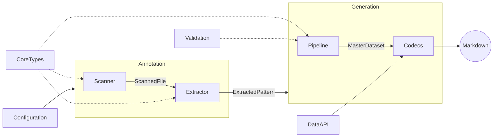
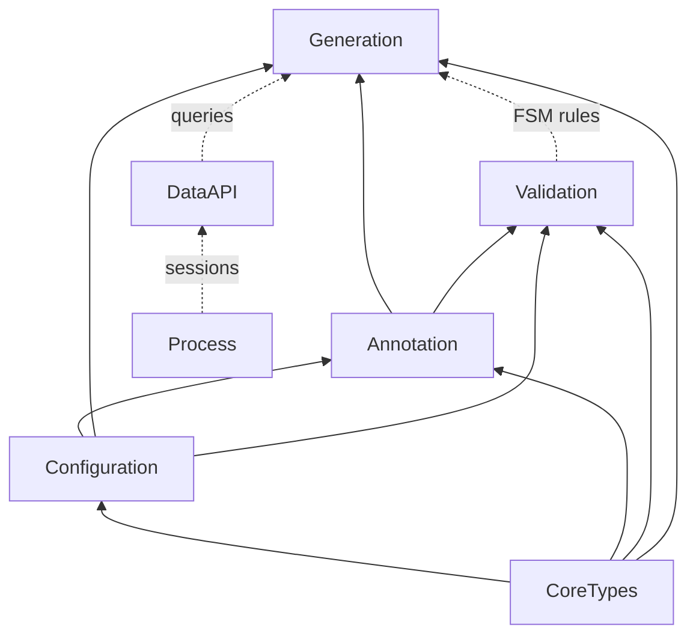

# Product Areas

**Purpose:** Product area overview index

---

## [Annotation](product-areas/ANNOTATION.md)

> **How do I annotate code?**

The annotation system is the ingestion boundary — it transforms annotated TypeScript and Gherkin files into `ExtractedPattern[]` objects that feed the entire downstream pipeline. Two parallel scanning paths (TypeScript AST + Gherkin parser) converge through dual-source merging. The system is fully data-driven: the `TagRegistry` defines all tags, formats, and categories — adding a new annotation requires only a registry entry, zero parser changes.

## [Configuration](product-areas/CONFIGURATION.md)

> **How do I configure the tool?**

Configuration is the entry boundary — it transforms a user-authored `delivery-process.config.ts` file into a fully resolved `DeliveryProcessInstance` that powers the entire pipeline. The flow is: `defineConfig()` provides type-safe authoring (Vite convention, zero validation), `ConfigLoader` discovers and loads the file, `ProjectConfigSchema` validates via Zod, `ConfigResolver` applies defaults and merges stubs into sources, and `DeliveryProcessFactory` builds the final instance with `TagRegistry` and `RegexBuilders`. Three presets define escalating taxonomy complexity — from 3 categories (`generic`, `libar-generic`) to 21 (`ddd-es-cqrs`). `SourceMerger` computes per-generator source overrides, enabling generators like changelog to pull from different feature sets than the base config.

## [Generation](product-areas/GENERATION.md)

> **How does code become docs?**

The generation pipeline transforms annotated source code into markdown documents. It follows a four-stage architecture: Scanner → Extractor → Transformer → Codec. Codecs are pure functions — given a MasterDataset, they produce a RenderableDocument without side effects. CompositeCodec composes multiple codecs into a single document.

## [Validation](product-areas/VALIDATION.md)

> **How is the workflow enforced?**

Validation enforces delivery workflow rules at commit time using a Decider pattern. Process Guard derives state from annotations (no separate state store), validates proposed changes against FSM rules, and blocks invalid transitions. Protection levels escalate with status: roadmap allows free editing, active locks scope, completed requires explicit unlock.

## [DataAPI](product-areas/DATA-API.md)

> **How do I query process state?**

The Data API provides direct terminal access to delivery process state. It replaces reading generated markdown or launching explore agents — targeted queries use 5-10x less context. The `context` command assembles curated bundles tailored to session type (planning, design, implement).

## [CoreTypes](product-areas/CORE-TYPES.md)

> **What foundational types exist?**

CoreTypes provides the foundational type system used across all other areas. Three pillars enforce discipline at compile time: the Result monad replaces try/catch with explicit error handling — functions return `Result.ok(value)` or `Result.err(error)` instead of throwing. The DocError discriminated union provides structured error context with type, file, line, and reason fields, enabling exhaustive pattern matching in error handlers. Branded types create nominal typing from structural TypeScript — `PatternId`, `CategoryName`, and `SourceFilePath` are compile-time distinct despite all being strings. String utilities handle slugification and case conversion with acronym-aware title casing.

## [Process](product-areas/PROCESS.md)

> **How does the session workflow work?**

Process defines the session workflow and canonical taxonomy. Git is the event store; documentation artifacts are projections; feature files are the single source of truth. TypeScript source owns pattern identity (ADR-003), while Tier 1 specs are ephemeral planning documents that lose value after completion.

---

## Pipeline Data Flow

Shows the 4-stage transformation pipeline and which product areas participate at each stage:

## Product Area Dependency Layers

Shows the layered architecture — arrows mean "depends on" (bottom-up):

