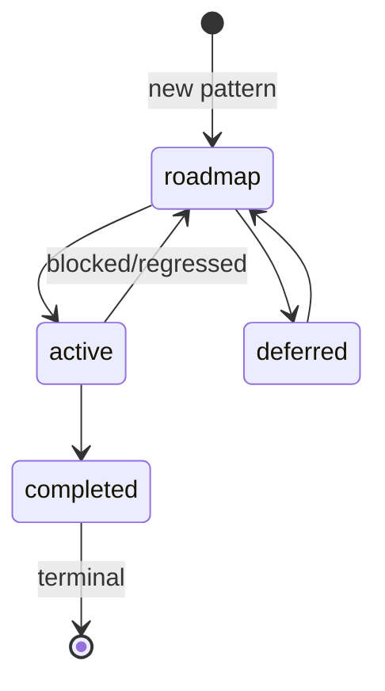

# Validation Rules

**Purpose:** Process Guard validation rules and FSM reference
**Detail Level:** Overview with links to details

---

## Overview

Process Guard validates delivery workflow changes at commit time using a Decider pattern. It enforces the 4-state FSM defined in PDR-005 and prevents common workflow violations.

**6 validation rules** | **4 FSM states** | **3 protection levels**

---

## Validation Rules

Rules are checked in order. Errors block commit; warnings are informational.

| Rule ID                     | Severity | Description                                         |
| --------------------------- | -------- | --------------------------------------------------- |
| `completed-protection`      | error    | Completed specs require unlock-reason tag to modify |
| `invalid-status-transition` | error    | Status transitions must follow FSM path             |
| `scope-creep`               | error    | Active specs cannot add new deliverables            |
| `session-scope`             | warning  | File outside session scope                          |
| `session-excluded`          | error    | File explicitly excluded from session               |
| `deliverable-removed`       | warning  | Deliverable was removed from spec                   |

[Full error catalog with fix instructions](validation/error-catalog.md)

---

## FSM State Diagram

Valid transitions per PDR-005 MVP Workflow:



**Valid Transitions:**

- `roadmap` -> `active` -> `completed` (normal flow)
- `active` -> `roadmap` (blocked/regressed)
- `roadmap` <-> `deferred` (parking)

[Detailed transition matrix](validation/fsm-transitions.md)

---

## Protection Levels

Protection levels determine what modifications are allowed per status.

| Status      | Protection | Can Add Deliverables | Needs Unlock |
| ----------- | ---------- | -------------------- | ------------ |
| `roadmap`   | none       | Yes                  | No           |
| `active`    | scope      | No                   | No           |
| `completed` | hard       | No                   | Yes          |
| `deferred`  | none       | Yes                  | No           |

[Protection level details](validation/protection-levels.md)

---

## CLI Usage

```bash
# Pre-commit (default mode)
lint-process --staged

# CI pipeline with strict mode
lint-process --all --strict

# Override session scope checking
lint-process --staged --ignore-session

# Debug: show derived process state
lint-process --staged --show-state
```

### Options

| Flag               | Description                             |
| ------------------ | --------------------------------------- |
| `--staged`         | Validate staged files only (pre-commit) |
| `--all`            | Validate all tracked files (CI)         |
| `--strict`         | Treat warnings as errors (exit 1)       |
| `--ignore-session` | Skip session scope validation           |
| `--show-state`     | Debug: show derived process state       |
| `--format json`    | Machine-readable JSON output            |

### Exit Codes

| Code | Meaning                                        |
| ---- | ---------------------------------------------- |
| `0`  | No errors (warnings allowed unless `--strict`) |
| `1`  | Errors found or warnings with `--strict`       |

---

## Escape Hatches

Override mechanisms for exceptional situations.

| Situation                    | Solution              | Example                                  |
| ---------------------------- | --------------------- | ---------------------------------------- |
| Fix bug in completed spec    | Add unlock reason tag | `@libar-docs-unlock-reason:'Fix-typo'`   |
| Modify outside session scope | Use ignore flag       | `lint-process --staged --ignore-session` |
| CI treats warnings as errors | Use strict flag       | `lint-process --all --strict`            |

---
