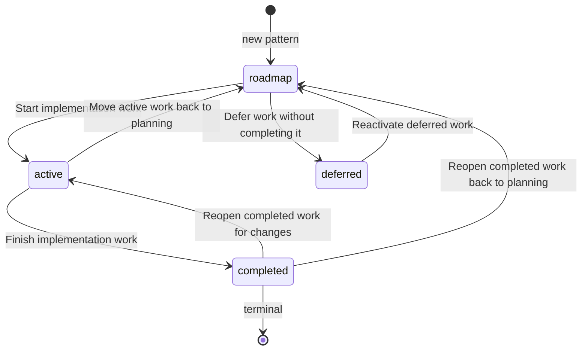

# Validation Rules

**Purpose:** Process Guard validation rules and FSM reference
**Detail Level:** Overview with links to details

---

## Overview

Process Guard validates delivery workflow changes at commit time using a Decider pattern. It enforces the 4-state FSM and prevents common workflow violations.

**6 validation rules** | **4 FSM states** | **3 protection levels**

## Validation Rules

| Rule ID                     | Severity | Description                                                                   | Applies To Roles |
| --------------------------- | -------- | ----------------------------------------------------------------------------- | ---------------- |
| `completed-protection`      | warning  | Modifying a completed spec warns; unlock-reason is optional and suppresses it |                  |
| `invalid-status-transition` | error    | Status transitions must follow FSM path                                       |                  |
| `scope-creep`               | warning  | Adding pending scope to an active spec warns; unlock-reason suppresses it     |                  |
| `session-scope`             | warning  | File outside session scope                                                    |                  |
| `session-excluded`          | error    | File explicitly excluded from session                                         |                  |
| `deliverable-removed`       | warning  | Deliverable was removed from spec                                             |                  |

## FSM State Diagram

Valid transitions for the delivery workflow FSM:

```mermaid
stateDiagram-v2
    [*] --> roadmap: new pattern
    roadmap --> active: Start implementation work
    roadmap --> deferred: Defer work without completing it
    active --> completed: Finish implementation work
    active --> roadmap: Move active work back to planning
    completed --> active: Reopen completed work for changes
    completed --> roadmap: Reopen completed work back to planning
    deferred --> roadmap: Reactivate deferred work
    completed --> [*]: terminal
```

## Protection Levels

| Status    | Protection | Can Add Deliverables | Unlock Suppresses Warning | Meaning                                                                                          |
| --------- | ---------- | -------------------- | ------------------------- | ------------------------------------------------------------------------------------------------ |
| roadmap   | none       | Yes                  | No                        | Planning statuses remain editable.                                                               |
| deferred  | none       | Yes                  | No                        | Planning statuses remain editable.                                                               |
| active    | scope      | No                   | Yes                       | Active work is scope-locked; adding pending deliverables warns (advisory).                       |
| completed | hard       | No                   | Yes                       | Completed work is hard-locked; editing or reopening warns, unlock reason is optional (advisory). |
