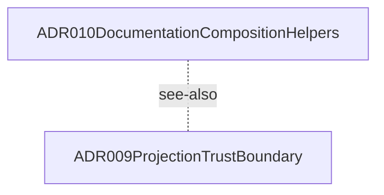

# Architecture

**Purpose:** Auto-generated architecture diagrams from source annotations
**Detail Level:** Context map plus per-group component diagrams

---

## Overview

This view captures 2 patterns across 1 diagram in the Layered architecture view.

## Diagrams

### Layer: refinement (2 patterns)

## Legend

### Legend

- Solid arrow = dependency (depends-on / uses)
- Dotted line = reference (see-also)

## Patterns

- ADR009ProjectionTrustBoundary
- ADR010DocumentationCompositionHelpers

---

[← Back to Architecture](../ARCHITECTURE.md)
