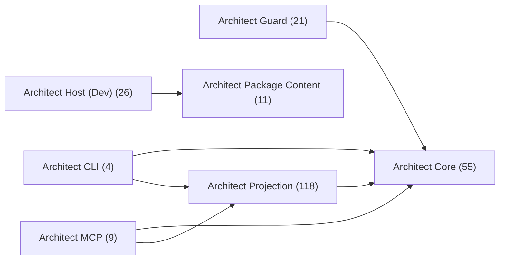
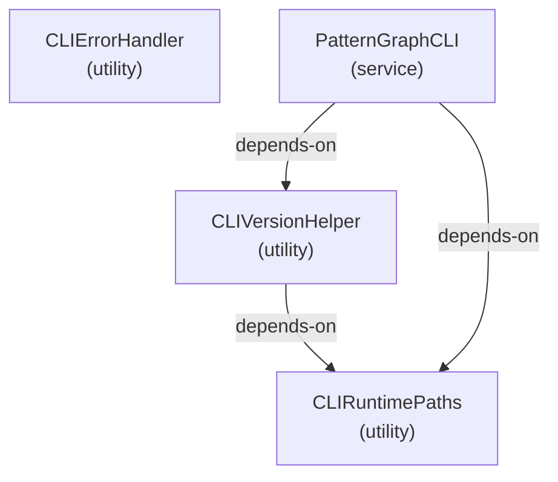
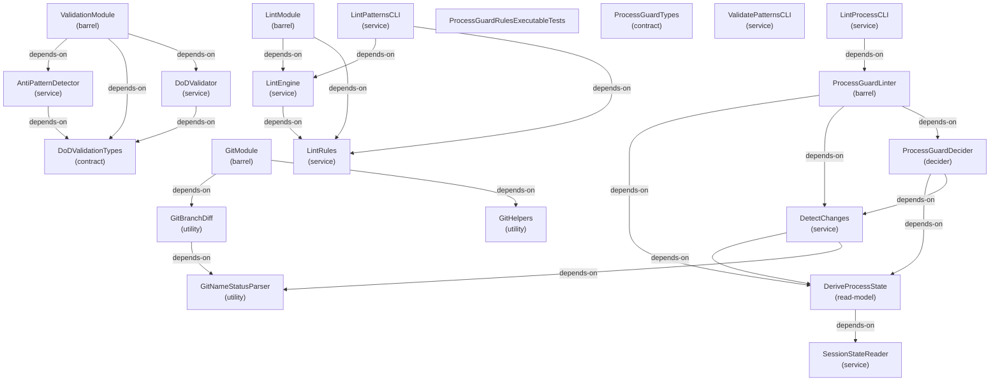
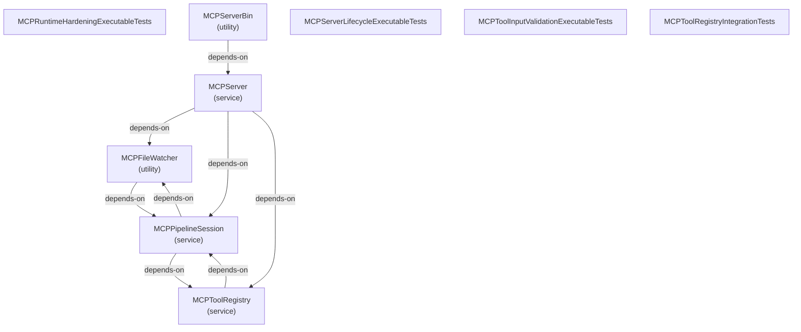
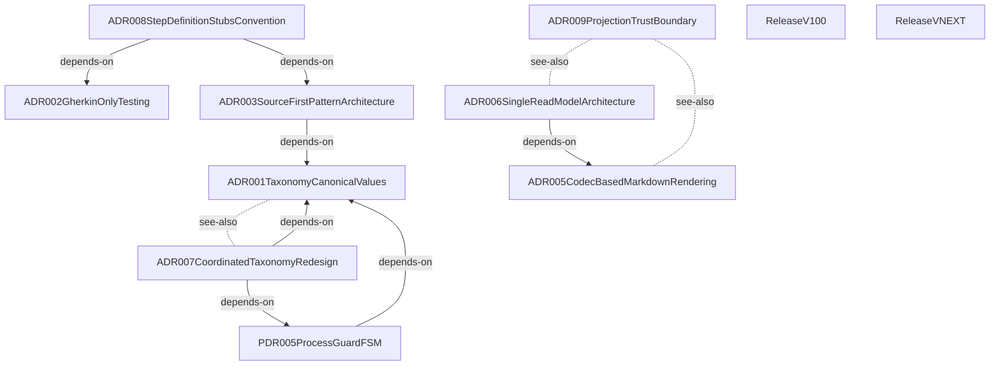

# Architecture

**Purpose:** Auto-generated architecture diagrams from source annotations
**Detail Level:** Context map plus per-group component diagrams

---

## Overview

This view captures 244 patterns across 8 diagrams in the Package architecture view.

## Related views

- [Layered](architecture/layered.md)
- [Package Seam](architecture/package-seam.md)

## Diagrams

### Package Map

Each node is a group; each arrow is a cross-group dependency (`depends-on` / `uses`, pointing from dependant to dependency). The per-group diagrams below detail each group’s internal dependencies and any see-also references.



### Package: Architect CLI (4 patterns)



### Package: Architect Core (55 patterns)

```mermaid
graph TD
  architectureinspection["ArchitectureInspection<br/>(utility)"]
  astparser["AstParser<br/>(service)"]
  buildpipeline["BuildPipeline<br/>(service)"]
  codecutils["CodecUtils<br/>(codec)"]
  codecutilsvalidation["CodecUtilsValidation"]
  configbasedworkflowdefinition["ConfigBasedWorkflowDefinition"]
  configloader["ConfigLoader<br/>(service)"]
  configresolution["ConfigResolution"]
  configurationapi["ConfigurationAPI"]
  crosspackageedgeclassification["CrossPackageEdgeClassification"]
  defineconfig["DefineConfig<br/>(utility)"]
  defineconfigexecutabletests["DefineConfigExecutableTests"]
  docextractor["DocExtractor<br/>(service)"]
  docstringmediatype["DocStringMediaType"]
  dualsourceextractor["DualSourceExtractor<br/>(service)"]
  dualsourcemergeintegration["DualSourceMergeIntegration"]
  errorfactories["ErrorFactories<br/>(contract)"]
  errorfactorytypes["ErrorFactoryTypes<br/>(contract)"]
  extractedpattern["ExtractedPattern<br/>(contract)"]
  extractiondiagnostics["ExtractionDiagnostics<br/>(contract)"]
  filediscovery["FileDiscovery"]
  fsmstates["FSMStates<br/>(read-model)"]
  fsmtransitions["FSMTransitions<br/>(read-model)"]
  fsmvalidator["FSMValidator<br/>(decider)"]
  gherkinastparser["GherkinAstParser<br/>(service)"]
  gherkinexternalrelationshiptagpropagation["GherkinExternalRelationshipTagPropagation"]
  gherkinextractor["GherkinExtractor<br/>(service)"]
  gherkinrulessupport["GherkinRulesSupport"]
  gherkinscanner["GherkinScanner<br/>(service)"]
  graphinventory["GraphInventory<br/>(utility)"]
  layerinference["LayerInference<br/>(service)"]
  markdownblockparser["MarkdownBlockParser<br/>(codec)"]
  packageresolver["PackageResolver<br/>(utility)"]
  packageresolverexecutabletests["PackageResolverExecutableTests"]
  patternclassification["PatternClassification<br/>(utility)"]
  patterngraph["PatternGraph<br/>(contract)"]
  patterngraphapi["PatternGraphApi<br/>(utility)"]
  patterngraphapireverselookup["PatternGraphApiReverseLookup"]
  patternhelpers["PatternHelpers<br/>(utility)"]
  patternreferencevalidation["PatternReferenceValidation"]
  patternscanner["PatternScanner<br/>(service)"]
  projectconfigloader["ProjectConfigLoader"]
  registrybuilder["RegistryBuilder<br/>(utility)"]
  resultmonad["ResultMonad<br/>(contract)"]
  resultmonadtypes["ResultMonadTypes<br/>(contract)"]
  scannercore["ScannerCore"]
  shapeextraction["ShapeExtraction"]
  shapeextractor["ShapeExtractor<br/>(service)"]
  sourcemerge["SourceMerge<br/>(utility)"]
  sourcemerging["SourceMerging"]
  tagregistryschemas["TagRegistrySchemas<br/>(contract)"]
  tagregistryschemasvalidation["TagRegistrySchemasValidation"]
  typescripttaxonomyimplementation["TypeScriptTaxonomyImplementation"]
  valueformatcanonicalvaluesdispatch["ValueFormatCanonicalValuesDispatch"]
  workflowconfigschemasvalidation["WorkflowConfigSchemasValidation"]
  architectureinspection -->|depends-on| extractedpattern
  architectureinspection -->|depends-on| patterngraph
  architectureinspection -->|depends-on| patternhelpers
  buildpipeline -->|depends-on| astparser
  buildpipeline -->|depends-on| docextractor
  buildpipeline -->|depends-on| extractiondiagnostics
  buildpipeline -->|depends-on| gherkinextractor
  buildpipeline -->|depends-on| gherkinscanner
  buildpipeline -->|depends-on| patterngraph
  buildpipeline -->|depends-on| patternscanner
  docextractor -->|depends-on| shapeextractor
  dualsourceextractor -->|depends-on| extractedpattern
  dualsourceextractor -->|depends-on| patternhelpers
  fsmvalidator -->|depends-on| fsmstates
  fsmvalidator -->|depends-on| fsmtransitions
  gherkinexternalrelationshiptagpropagation -. see-also .- gherkinrulessupport
  gherkinextractor -->|depends-on| gherkinastparser
  gherkinextractor -->|depends-on| layerinference
  graphinventory -->|depends-on| extractedpattern
  graphinventory -->|depends-on| patterngraph
  graphinventory -->|depends-on| patternhelpers
  patternclassification -->|depends-on| extractedpattern
  patternclassification -->|depends-on| patterngraph
  patterngraph -->|depends-on| extractedpattern
  patterngraphapi -->|depends-on| extractedpattern
  patterngraphapi -->|depends-on| patterngraph
  patterngraphapi -->|depends-on| patternhelpers
  patternhelpers -->|depends-on| extractedpattern
  patternhelpers -->|depends-on| patterngraph
```



### Package: Architect Guard (21 patterns)



### Package: Architect Host \(Dev\) (26 patterns)


### Package: Architect MCP (9 patterns)



### Package: Architect Package Content (11 patterns)



### Package: Architect Projection (118 patterns)

```mermaid
graph TD
  annotationcoverage["AnnotationCoverage<br/>(contract)"]
  annotationcoverageprojection["AnnotationCoverageProjection<br/>(projection)"]
  architecturecomparison["ArchitectureComparison<br/>(contract)"]
  architecturecomparisonprojection["ArchitectureComparisonProjection<br/>(projection)"]
  architecturediagram["ArchitectureDiagram<br/>(contract)"]
  architecturediagramprojection["ArchitectureDiagramProjection<br/>(projection)"]
  architecturegraphprojection["ArchitectureGraphProjection<br/>(projection)"]
  architecturenavigationprojectionexecutabletests["ArchitectureNavigationProjectionExecutableTests<br/>(projection)"]
  architectureneighborhood["ArchitectureNeighborhood<br/>(contract)"]
  architectureneighborhoodprojection["ArchitectureNeighborhoodProjection<br/>(projection)"]
  blockschema["BlockSchema<br/>(contract)"]
  boundedcontextfragmentcontract["BoundedContextFragmentContract<br/>(contract)"]
  boundedcontextprojection["BoundedContextProjection<br/>(projection)"]
  businessrule["BusinessRule<br/>(contract)"]
  businessrulereference["BusinessRuleReference<br/>(contract)"]
  businessruleset["BusinessRuleSet<br/>(contract)"]
  businessrulesprojection["BusinessRulesProjection<br/>(projection)"]
  businessrulesprojectionexecutabletests["BusinessRulesProjectionExecutableTests<br/>(projection)"]
  compacttextrenderer["CompactTextRenderer<br/>(codec)"]
  decisioncatalog["DecisionCatalog<br/>(contract)"]
  decisioncatalogprojection["DecisionCatalogProjection<br/>(projection)"]
  decisioncatalogprojectionexecutabletests["DecisionCatalogProjectionExecutableTests<br/>(projection)"]
  decisionrecord["DecisionRecord<br/>(contract)"]
  deliverable["Deliverable<br/>(contract)"]
  deliverablemanifest["DeliverableManifest<br/>(contract)"]
  deliverableprojection["DeliverableProjection<br/>(projection)"]
  deliveryprogressprojectionexecutabletests["DeliveryProgressProjectionExecutableTests<br/>(projection)"]
  deliveryreportingfragmentcontracts["DeliveryReportingFragmentContracts<br/>(contract)"]
  deliveryreportingprojectionsupport["DeliveryReportingProjectionSupport<br/>(utility)"]
  deliveryreportingprojectionsupportexecutabletests["DeliveryReportingProjectionSupportExecutableTests<br/>(projection)"]
  deliveryreportingsupporting["DeliveryReportingSupporting<br/>(contract)"]
  dependencyedge["DependencyEdge<br/>(contract)"]
  dependencyedgeprojection["DependencyEdgeProjection<br/>(projection)"]
  dependencyedgeprojectionexecutabletests["DependencyEdgeProjectionExecutableTests<br/>(projection)"]
  dependencyedgeset["DependencyEdgeSet<br/>(contract)"]
  dependencytree["DependencyTree<br/>(contract)"]
  dependencytreeprojection["DependencyTreeProjection<br/>(projection)"]
  dependencytreeprojectionexecutabletests["DependencyTreeProjectionExecutableTests<br/>(projection)"]
  documentationbundle["DocumentationBundle<br/>(projection)"]
  documentationcompositionprojectionexecutabletests["DocumentationCompositionProjectionExecutableTests<br/>(projection)"]
  documentationcompositionprojectionsupport["DocumentationCompositionProjectionSupport<br/>(utility)"]
  documentationcompositionsupporting["DocumentationCompositionSupporting<br/>(contract)"]
  executioncontextprojectionexecutabletests["ExecutionContextProjectionExecutableTests<br/>(projection)"]
  executioncontextprojectionsupport["ExecutionContextProjectionSupport<br/>(utility)"]
  executioncontextsupporting["ExecutionContextSupporting<br/>(contract)"]
  filereadinglist["FileReadingList<br/>(contract)"]
  filereadinglistprojection["FileReadingListProjection<br/>(projection)"]
  fragmentrendererdispatch["FragmentRendererDispatch<br/>(codec)"]
  governanceprojectionsupport["GovernanceProjectionSupport<br/>(utility)"]
  governancesupporting["GovernanceSupporting<br/>(contract)"]
  governancevalidationtaxonomyprojectionexecutabletests["GovernanceValidationTaxonomyProjectionExecutableTests<br/>(projection)"]
  handoffprojection["HandoffProjection<br/>(projection)"]
  handoffrecord["HandoffRecord<br/>(contract)"]
  jsonrenderer["JsonRenderer<br/>(codec)"]
  markdownrenderer["MarkdownRenderer<br/>(codec)"]
  openquestionlistprojection["OpenQuestionListProjection<br/>(projection)"]
  openquestionlistprojectionexecutabletests["OpenQuestionListProjectionExecutableTests<br/>(projection)"]
  operationalinsightsprojectionexecutabletests["OperationalInsightsProjectionExecutableTests<br/>(projection)"]
  operationalinsightsprojectionsupport["OperationalInsightsProjectionSupport<br/>(utility)"]
  operationalinsightssupporting["OperationalInsightsSupporting<br/>(contract)"]
  orphanpatternlist["OrphanPatternList<br/>(contract)"]
  orphanpatternlistprojection["OrphanPatternListProjection<br/>(projection)"]
  overviewdigest["OverviewDigest<br/>(contract)"]
  overviewprojection["OverviewProjection<br/>(projection)"]
  patternbundleprojection["PatternBundleProjection<br/>(projection)"]
  patternbundleprojectionexecutabletests["PatternBundleProjectionExecutableTests<br/>(projection)"]
  patterncatalog["PatternCatalog<br/>(contract)"]
  patterncatalogprojection["PatternCatalogProjection<br/>(projection)"]
  patterndetail["PatternDetail<br/>(contract)"]
  patterndetailprojection["PatternDetailProjection<br/>(projection)"]
  patterndetailprojectionexecutabletests["PatternDetailProjectionExecutableTests<br/>(projection)"]
  patternrelationsfragmentcontracts["PatternRelationsFragmentContracts<br/>(contract)"]
  patternrelationsprojectionsupport["PatternRelationsProjectionSupport<br/>(utility)"]
  patternrelationssupporting["PatternRelationsSupporting<br/>(contract)"]
  patternsummary["PatternSummary<br/>(contract)"]
  patternsummarycatalogprojectionexecutabletests["PatternSummaryCatalogProjectionExecutableTests<br/>(projection)"]
  patternsummaryprojection["PatternSummaryProjection<br/>(projection)"]
  phaseprogress["PhaseProgress<br/>(contract)"]
  phaseprogressprojection["PhaseProgressProjection<br/>(projection)"]
  prchangereview["PrChangeReview<br/>(contract)"]
  prchangereviewprojection["PrChangeReviewProjection<br/>(projection)"]
  projectconfigprojection["ProjectConfigProjection<br/>(projection)"]
  projectconfigsnapshot["ProjectConfigSnapshot<br/>(contract)"]
  projectionfragmentcontracts["ProjectionFragmentContracts<br/>(contract)"]
  projectionfragmentschema["ProjectionFragmentSchema<br/>(contract)"]
  releasenotesdigest["ReleaseNotesDigest<br/>(contract)"]
  releasenotesprojection["ReleaseNotesProjection<br/>(projection)"]
  releasenotesprojectionexecutabletests["ReleaseNotesProjectionExecutableTests<br/>(projection)"]
  requirementdigest["RequirementDigest<br/>(contract)"]
  requirementdigestprojection["RequirementDigestProjection<br/>(projection)"]
  requirementexecutabledigestprojection["RequirementExecutableDigestProjection<br/>(projection)"]
  requirementspecsdigestprojection["RequirementSpecsDigestProjection<br/>(projection)"]
  roadmaptimeline["RoadmapTimeline<br/>(contract)"]
  roadmaptimelineprojection["RoadmapTimelineProjection<br/>(projection)"]
  roleprofile["RoleProfile<br/>(contract)"]
  roleprofilecollection["RoleProfileCollection<br/>(contract)"]
  roleprofileprojection["RoleProfileProjection<br/>(projection)"]
  scopereadinesscheck["ScopeReadinessCheck<br/>(contract)"]
  scopereadinessprojection["ScopeReadinessProjection<br/>(projection)"]
  scopereadinessreport["ScopeReadinessReport<br/>(contract)"]
  sessioncontextbundle["SessionContextBundle<br/>(contract)"]
  sessioncontextprojection["SessionContextProjection<br/>(projection)"]
  sourceinventorydigest["SourceInventoryDigest<br/>(contract)"]
  sourceinventoryentry["SourceInventoryEntry<br/>(contract)"]
  sourceinventoryprojection["SourceInventoryProjection<br/>(projection)"]
  statusdistribution["StatusDistribution<br/>(contract)"]
  statusdistributionprojection["StatusDistributionProjection<br/>(projection)"]
  tagusageentry["TagUsageEntry<br/>(contract)"]
  tagusagematrix["TagUsageMatrix<br/>(contract)"]
  tagusageprojection["TagUsageProjection<br/>(projection)"]
  taxonomydigest["TaxonomyDigest<br/>(contract)"]
  taxonomydigestprojection["TaxonomyDigestProjection<br/>(projection)"]
  traceabilitymatrix["TraceabilityMatrix<br/>(contract)"]
  traceabilitymatrixprojection["TraceabilityMatrixProjection<br/>(projection)"]
  traceabilitymatrixprojectionexecutabletests["TraceabilityMatrixProjectionExecutableTests<br/>(projection)"]
  uirenderer["UiRenderer<br/>(codec)"]
  validationruledigest["ValidationRuleDigest<br/>(contract)"]
  validationruledigestprojection["ValidationRuleDigestProjection<br/>(projection)"]
  annotationcoverageprojection -->|depends-on| annotationcoverage
  annotationcoverageprojection -->|depends-on| operationalinsightsprojectionsupport
  architecturecomparisonprojection -->|depends-on| architecturecomparison
  architecturecomparisonprojection -->|depends-on| patternrelationsfragmentcontracts
  architecturecomparisonprojection -->|depends-on| patternrelationsprojectionsupport
  architecturediagram -->|depends-on| blockschema
  architecturediagramprojection -->|depends-on| documentationcompositionprojectionsupport
  architecturediagramprojection -->|depends-on| projectionfragmentcontracts
  architectureneighborhoodprojection -->|depends-on| architectureneighborhood
  architectureneighborhoodprojection -->|depends-on| patternrelationsfragmentcontracts
  architectureneighborhoodprojection -->|depends-on| patternrelationsprojectionsupport
  boundedcontextprojection -->|depends-on| boundedcontextfragmentcontract
  boundedcontextprojection -->|depends-on| patternrelationsprojectionsupport
  businessrulesprojection -->|depends-on| businessrule
  businessrulesprojection -->|depends-on| businessruleset
  businessrulesprojection -->|depends-on| governanceprojectionsupport
  businessrulesprojection -->|depends-on| governancesupporting
  businessrulesprojection -->|depends-on| projectionfragmentcontracts
  compacttextrenderer -->|depends-on| fragmentrendererdispatch
  compacttextrenderer -->|depends-on| projectionfragmentschema
  decisioncatalogprojection -->|depends-on| decisioncatalog
  decisioncatalogprojection -->|depends-on| decisionrecord
  decisioncatalogprojection -->|depends-on| governanceprojectionsupport
  decisioncatalogprojection -->|depends-on| projectionfragmentcontracts
  decisionrecord -->|depends-on| blockschema
  deliverableprojection -->|depends-on| deliverable
  deliverableprojection -->|depends-on| deliverablemanifest
  deliverableprojection -->|depends-on| executioncontextprojectionsupport
  deliverableprojection -->|depends-on| projectionfragmentcontracts
  deliveryreportingprojectionsupport -->|depends-on| deliveryreportingfragmentcontracts
  deliveryreportingsupporting -->|depends-on| deliverable
  deliveryreportingsupporting -->|depends-on| patternsummary
  dependencyedgeprojection -->|depends-on| dependencyedge
  dependencyedgeprojection -->|depends-on| dependencyedgeset
  dependencyedgeprojection -->|depends-on| patternrelationsfragmentcontracts
  dependencyedgeprojection -->|depends-on| patternrelationsprojectionsupport
  dependencytreeprojection -->|depends-on| dependencytree
  dependencytreeprojection -->|depends-on| patternrelationsfragmentcontracts
  dependencytreeprojection -->|depends-on| patternrelationsprojectionsupport
  documentationbundle -->|depends-on| documentationcompositionprojectionsupport
  documentationbundle -->|depends-on| projectionfragmentcontracts
  documentationcompositionprojectionsupport -->|depends-on| architecturediagram
  documentationcompositionprojectionsupport -->|depends-on| prchangereview
  documentationcompositionprojectionsupport -->|depends-on| projectconfigsnapshot
  documentationcompositionsupporting -->|depends-on| blockschema
  executioncontextprojectionsupport -->|depends-on| projectionfragmentcontracts
  filereadinglistprojection -->|depends-on| executioncontextprojectionsupport
  filereadinglistprojection -->|depends-on| filereadinglist
  filereadinglistprojection -->|depends-on| projectionfragmentcontracts
  fragmentrendererdispatch -->|depends-on| projectionfragmentschema
  governanceprojectionsupport -->|depends-on| projectionfragmentcontracts
  handoffprojection -->|depends-on| executioncontextprojectionsupport
  handoffprojection -->|depends-on| handoffrecord
  handoffprojection -->|depends-on| projectionfragmentcontracts
  handoffrecord -->|depends-on| executioncontextsupporting
  jsonrenderer -->|depends-on| projectionfragmentschema
  markdownrenderer -->|depends-on| blockschema
  markdownrenderer -->|depends-on| fragmentrendererdispatch
  markdownrenderer -->|depends-on| projectionfragmentschema
  openquestionlistprojection -->|depends-on| patternrelationsfragmentcontracts
  openquestionlistprojection -->|depends-on| patternrelationsprojectionsupport
  operationalinsightsprojectionsupport -->|depends-on| businessrulereference
  operationalinsightsprojectionsupport -->|depends-on| projectionfragmentcontracts
  operationalinsightssupporting -->|depends-on| blockschema
  orphanpatternlistprojection -->|depends-on| orphanpatternlist
  orphanpatternlistprojection -->|depends-on| patternrelationsfragmentcontracts
  orphanpatternlistprojection -->|depends-on| patternrelationsprojectionsupport
  overviewprojection -->|depends-on| architecturediagram
  overviewprojection -->|depends-on| operationalinsightsprojectionsupport
  overviewprojection -->|depends-on| overviewdigest
  patternbundleprojection -->|depends-on| patternrelationsfragmentcontracts
  patternbundleprojection -->|depends-on| patternrelationsprojectionsupport
  patterncatalogprojection -->|depends-on| patterncatalog
  patterncatalogprojection -->|depends-on| patternrelationsfragmentcontracts
  patterncatalogprojection -->|depends-on| patternrelationsprojectionsupport
  patterndetailprojection -->|depends-on| patterndetail
  patterndetailprojection -->|depends-on| patternrelationsfragmentcontracts
  patterndetailprojection -->|depends-on| patternrelationsprojectionsupport
  patternrelationsprojectionsupport -->|depends-on| patternrelationsfragmentcontracts
  patternrelationssupporting -->|depends-on| deliverable
  patternrelationssupporting -->|depends-on| deliverablemanifest
  patternsummaryprojection -->|depends-on| patternrelationsfragmentcontracts
  patternsummaryprojection -->|depends-on| patternrelationsprojectionsupport
  patternsummaryprojection -->|depends-on| patternsummary
  phaseprogressprojection -->|depends-on| deliveryreportingprojectionsupport
  phaseprogressprojection -->|depends-on| phaseprogress
  prchangereview -->|depends-on| blockschema
  prchangereviewprojection -->|depends-on| documentationcompositionprojectionsupport
  prchangereviewprojection -->|depends-on| projectionfragmentcontracts
  projectconfigprojection -->|depends-on| documentationcompositionprojectionsupport
  projectconfigprojection -->|depends-on| projectionfragmentcontracts
  releasenotesprojection -->|depends-on| deliveryreportingprojectionsupport
  releasenotesprojection -->|depends-on| releasenotesdigest
  requirementdigestprojection -->|depends-on| operationalinsightsprojectionsupport
  requirementdigestprojection -->|depends-on| requirementdigest
  requirementexecutabledigestprojection -->|depends-on| operationalinsightsprojectionsupport
  requirementexecutabledigestprojection -->|depends-on| requirementdigest
  requirementspecsdigestprojection -->|depends-on| operationalinsightsprojectionsupport
  requirementspecsdigestprojection -->|depends-on| requirementdigest
  roadmaptimelineprojection -->|depends-on| deliveryreportingprojectionsupport
  roadmaptimelineprojection -->|depends-on| roadmaptimeline
  roleprofileprojection -->|depends-on| operationalinsightsprojectionsupport
  roleprofileprojection -->|depends-on| roleprofile
  roleprofileprojection -->|depends-on| roleprofilecollection
  scopereadinesscheck -->|depends-on| executioncontextsupporting
  scopereadinessprojection -->|depends-on| executioncontextprojectionsupport
  scopereadinessprojection -->|depends-on| projectionfragmentcontracts
  scopereadinessprojection -->|depends-on| scopereadinesscheck
  scopereadinessprojection -->|depends-on| scopereadinessreport
  scopereadinessreport -->|depends-on| executioncontextsupporting
  sessioncontextbundle -->|depends-on| executioncontextsupporting
  sessioncontextprojection -->|depends-on| executioncontextprojectionsupport
  sessioncontextprojection -->|depends-on| projectionfragmentcontracts
  sessioncontextprojection -->|depends-on| sessioncontextbundle
  sourceinventorydigest -->|depends-on| sourceinventoryentry
  sourceinventoryprojection -->|depends-on| operationalinsightsprojectionsupport
  sourceinventoryprojection -->|depends-on| sourceinventorydigest
  statusdistributionprojection -->|depends-on| deliveryreportingprojectionsupport
  statusdistributionprojection -->|depends-on| statusdistribution
  tagusagematrix -->|depends-on| tagusageentry
  tagusageprojection -->|depends-on| operationalinsightsprojectionsupport
  tagusageprojection -->|depends-on| tagusagematrix
  taxonomydigestprojection -->|depends-on| governanceprojectionsupport
  taxonomydigestprojection -->|depends-on| governancesupporting
  taxonomydigestprojection -->|depends-on| projectionfragmentcontracts
  taxonomydigestprojection -->|depends-on| taxonomydigest
  traceabilitymatrixprojection -->|depends-on| deliveryreportingprojectionsupport
  traceabilitymatrixprojection -->|depends-on| traceabilitymatrix
  uirenderer -->|depends-on| blockschema
  uirenderer -->|depends-on| fragmentrendererdispatch
  uirenderer -->|depends-on| projectionfragmentschema
  validationruledigestprojection -->|depends-on| governanceprojectionsupport
  validationruledigestprojection -->|depends-on| projectionfragmentcontracts
  validationruledigestprojection -->|depends-on| validationruledigest
```

## Fan-in

Most-depended-on patterns in this view, ranked by in-view dependant count.

| Pattern                              | Dependants | Top dependants                                                                                                                                         |
| ------------------------------------ | ---------- | ------------------------------------------------------------------------------------------------------------------------------------------------------ |
| ProjectionFragmentContracts          | 16         | ArchitectureDiagramProjection, BusinessRulesProjection, DecisionCatalogProjection, DeliverableProjection, DocumentationBundle                          |
| ExtractedPattern                     | 12         | ArchitectureInspection, DeliveryReportingProjectionSupport, DualSourceExtractor, ExecutionContextProjectionSupport, GovernanceProjectionSupport        |
| PatternRelationsFragmentContracts    | 11         | ArchitectureComparisonProjection, ArchitectureNeighborhoodProjection, DependencyEdgeProjection, DependencyTreeProjection, OpenQuestionListProjection   |
| PatternRelationsProjectionSupport    | 11         | ArchitectureComparisonProjection, ArchitectureNeighborhoodProjection, BoundedContextProjection, DependencyEdgeProjection, DependencyTreeProjection     |
| PatternGraph                         | 9          | ArchitectureInspection, BuildPipeline, DoDValidator, GraphInventory, PatternClassification                                                             |
| OperationalInsightsProjectionSupport | 8          | AnnotationCoverageProjection, OverviewProjection, RequirementDigestProjection, RequirementExecutableDigestProjection, RequirementSpecsDigestProjection |
| BlockSchema                          | 7          | ArchitectureDiagram, DecisionRecord, DocumentationCompositionSupporting, MarkdownRenderer, OperationalInsightsSupporting                               |
| DeliveryReportingProjectionSupport   | 5          | PhaseProgressProjection, ReleaseNotesProjection, RoadmapTimelineProjection, StatusDistributionProjection, TraceabilityMatrixProjection                 |
| ExecutionContextProjectionSupport    | 5          | DeliverableProjection, FileReadingListProjection, HandoffProjection, ScopeReadinessProjection, SessionContextProjection                                |
| ProjectionFragmentSchema             | 5          | CompactTextRenderer, FragmentRendererDispatch, JsonRenderer, MarkdownRenderer, UiRenderer                                                              |

## Cross-package bounded contexts

Bounded contexts whose patterns span more than one workspace package.

| Bounded context | Packages                                      | Patterns |
| --------------- | --------------------------------------------- | -------- |
| cli             | Architect CLI, Architect Guard, Architect MCP | 6        |
| rendering       | Architect Core, Architect Projection          | 7        |
| validation      | Architect Core, Architect Guard               | 8        |

## Legend

### Legend

- Solid arrow = dependency (depends-on / uses)
- Dotted line = reference (see-also)

## Patterns

- ADR001TaxonomyCanonicalValues
- ADR002GherkinOnlyTesting
- ADR003SourceFirstPatternArchitecture
- ADR005CodecBasedMarkdownRendering
- ADR006SingleReadModelArchitecture
- ADR007CoordinatedTaxonomyRedesign
- ADR008StepDefinitionStubsConvention
- ADR009ProjectionTrustBoundary
- AnnotationCoverage
- AnnotationCoverageProjection
- AntiPatternDetector
- ArchitectPublicContract
- ArchitectureComparison
- ArchitectureComparisonProjection
- ArchitectureDiagram
- ArchitectureDiagramProjection
- ArchitectureGraphProjection
- ArchitectureInspection
- ArchitectureNavigationProjectionExecutableTests
- ArchitectureNeighborhood
- ArchitectureNeighborhoodProjection
- AstParser
- BlockSchema
- BoundedContextFragmentContract
- BoundedContextProjection
- BuildPipeline
- BusinessRule
- BusinessRuleReference
- BusinessRuleSet
- BusinessRulesProjection
- BusinessRulesProjectionExecutableTests
- CanonicalValuesSync
- ChildAlpha
- ChildBeta
- CLIErrorHandler
- CLIRuntimePaths
- CLIVersionHelper
- CodecUtils
- CodecUtilsValidation
- CompactTextRenderer
- CompactTextRendererTests
- ConfigBasedWorkflowDefinition
- ConfigLoader
- ConfigResolution
- ConfigurationAPI
- CrossPackageEdgeClassification
- DataAPICLIErgonomics
- DataAPIOutputShaping
- DecisionCatalog
- DecisionCatalogProjection
- DecisionCatalogProjectionExecutableTests
- DecisionRecord
- DefineConfig
- DefineConfigExecutableTests
- Deliverable
- DeliverableManifest
- DeliverableProjection
- DeliveryProgressProjectionExecutableTests
- DeliveryReportingFragmentContracts
- DeliveryReportingProjectionSupport
- DeliveryReportingProjectionSupportExecutableTests
- DeliveryReportingSupporting
- DependencyEdge
- DependencyEdgeProjection
- DependencyEdgeProjectionExecutableTests
- DependencyEdgeSet
- DependencyTree
- DependencyTreeProjection
- DependencyTreeProjectionExecutableTests
- DeriveProcessState
- DetectChanges
- DocExtractor
- DocStringMediaType
- DocumentationBundle
- DocumentationCommandParityBoundaryTests
- DocumentationCompositionProjectionExecutableTests
- DocumentationCompositionProjectionSupport
- DocumentationCompositionSupporting
- DoDValidationTypes
- DoDValidator
- DualSourceExtractor
- DualSourceMergeIntegration
- EmptyEpic
- ErrorFactories
- ErrorFactoryTypes
- ExecutionContextProjectionExecutableTests
- ExecutionContextProjectionSupport
- ExecutionContextSupporting
- ExtractedPattern
- ExtractionDiagnostics
- FileDiscovery
- FileReadingList
- FileReadingListProjection
- FragmentRendererDispatch
- FSMStates
- FSMTransitions
- FSMValidator
- GenerateDocsCli
- GherkinAstParser
- GherkinExternalRelationshipTagPropagation
- GherkinExtractor
- GherkinRulesSupport
- GherkinScanner
- GitBranchDiff
- GitHelpers
- GitModule
- GitNameStatusParser
- GovernanceProjectionSupport
- GovernanceSupporting
- GovernanceValidationTaxonomyProjectionExecutableTests
- GraphInventory
- HandoffProjection
- HandoffRecord
- JsonRenderer
- LayerInference
- LintEngine
- LintModule
- LintPatternsCLI
- LintPatternsCliBehavior
- LintProcessCLI
- LintProcessCliBehavior
- LintRules
- LoadPreambleParser
- MarkdownBlockParser
- MarkdownRenderer
- MCPFileWatcher
- MCPPipelineSession
- MCPRuntimeHardeningExecutableTests
- MCPServer
- MCPServerBin
- MCPServerLifecycleExecutableTests
- MCPToolInputValidationExecutableTests
- MCPToolRegistry
- MCPToolRegistryBoundaryTests
- MCPToolRegistryIntegrationTests
- OpenQuestionListProjection
- OpenQuestionListProjectionExecutableTests
- OperationalInsightsProjectionExecutableTests
- OperationalInsightsProjectionSupport
- OperationalInsightsSupporting
- OrphanPatternList
- OrphanPatternListProjection
- OverviewDigest
- OverviewProjection
- PackageResolver
- PackageResolverExecutableTests
- ParentEpic
- PatternBundleProjection
- PatternBundleProjectionExecutableTests
- PatternCatalog
- PatternCatalogProjection
- PatternClassification
- PatternDetail
- PatternDetailProjection
- PatternDetailProjectionExecutableTests
- PatternGraph
- PatternGraphApi
- PatternGraphAPICLI
- PatternGraphApiReverseLookup
- PatternGraphCLI
- PatternGraphCliArchHealth
- PatternGraphCliCache
- PatternGraphCliDryRun
- PatternGraphCliMetadata
- PatternGraphCliOutputModifiers
- PatternGraphCliRepl
- PatternGraphCliRulesSubcommand
- PatternGraphCliSubcommands
- PatternHelpers
- PatternReferenceValidation
- PatternRelationsFragmentContracts
- PatternRelationsProjectionSupport
- PatternRelationsSupporting
- PatternScanner
- PatternSummary
- PatternSummaryCatalogProjectionExecutableTests
- PatternSummaryProjection
- PDR005ProcessGuardFSM
- PhaseProgress
- PhaseProgressProjection
- PrChangeReview
- PrChangeReviewProjection
- ProcessGuardDecider
- ProcessGuardLinter
- ProcessGuardRulesExecutableTests
- ProcessGuardTypes
- ProjectConfigLoader
- ProjectConfigProjection
- ProjectConfigSnapshot
- ProjectionFragmentContracts
- ProjectionFragmentSchema
- RegistryBuilder
- ReleaseNotesDigest
- ReleaseNotesProjection
- ReleaseNotesProjectionExecutableTests
- ReleaseV100
- ReleaseVNEXT
- RequirementDigest
- RequirementDigestProjection
- RequirementExecutableDigestProjection
- RequirementSpecsDigestProjection
- ResultMonad
- ResultMonadTypes
- RoadmapTimeline
- RoadmapTimelineProjection
- RoleProfile
- RoleProfileCollection
- RoleProfileProjection
- ScannerCore
- ScopeReadinessCheck
- ScopeReadinessProjection
- ScopeReadinessReport
- SessionContextBundle
- SessionContextProjection
- SessionStateReader
- ShapeExtraction
- ShapeExtractor
- SourceInventoryDigest
- SourceInventoryEntry
- SourceInventoryProjection
- SourceMerge
- SourceMerging
- StatusDistribution
- StatusDistributionProjection
- StubTaxonomyTagTests
- TagRegistrySchemas
- TagRegistrySchemasValidation
- TagUsageEntry
- TagUsageMatrix
- TagUsageProjection
- TaxonomyDigest
- TaxonomyDigestProjection
- TraceabilityMatrix
- TraceabilityMatrixProjection
- TraceabilityMatrixProjectionExecutableTests
- TypeScriptTaxonomyImplementation
- UiRenderer
- ValidatePatternsCLI
- ValidationModule
- ValidationRuleDigest
- ValidationRuleDigestProjection
- ValidatorReadModelConsolidation
- ValueFormatCanonicalValuesDispatch
- WorkflowConfigSchemasValidation

---

[← Back to Architecture](../ARCHITECTURE.md)
