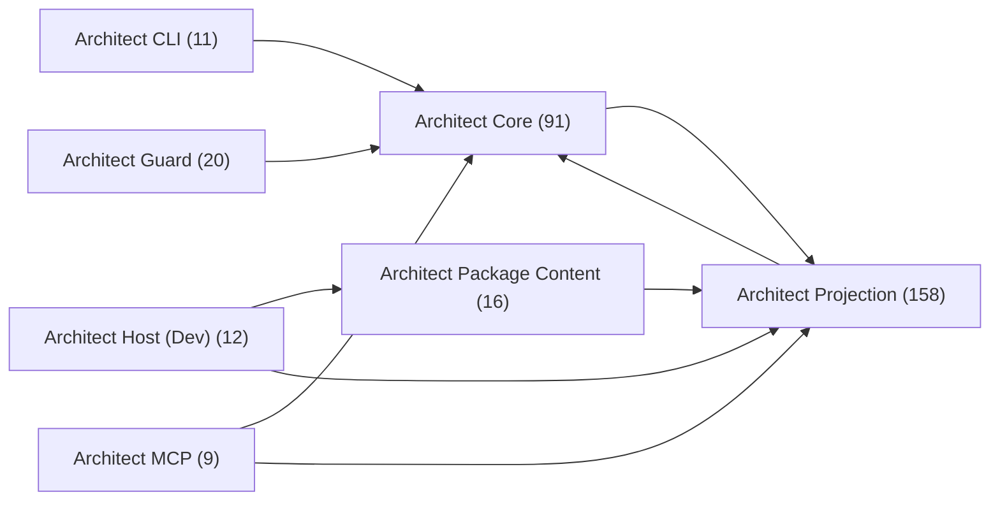
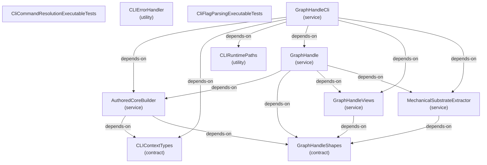
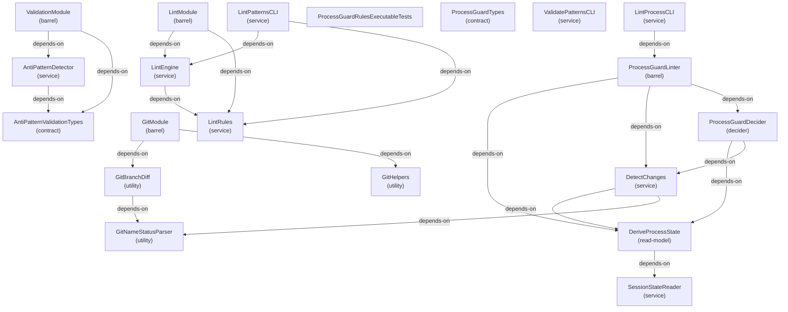
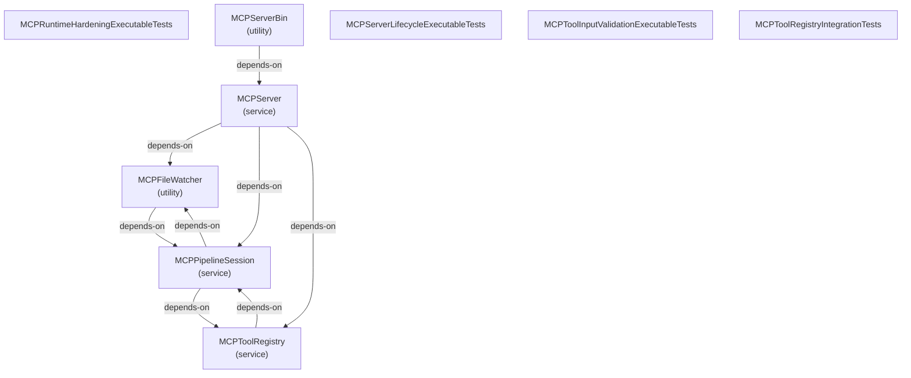

# Architecture

**Purpose:** Auto-generated architecture diagrams from source annotations
**Detail Level:** Context map plus per-group component diagrams

---

## Overview

This view captures 317 patterns across 8 diagrams in the Package architecture view.

## Diagrams

### Package Map

Each node is a group; each arrow is a cross-group dependency (`depends-on` / `uses`, pointing from dependant to dependency). The per-group diagrams below detail each group’s internal dependencies and any see-also references.



### Package: Architect CLI (11 patterns)



### Package: Architect Core (91 patterns)

```mermaid
graph TD
  architectconfigcontract["ArchitectConfigContract<br/>(contract)"]
  architectureinspection["ArchitectureInspection<br/>(utility)"]
  argvhygiene["ArgvHygiene<br/>(utility)"]
  astparser["AstParser<br/>(service)"]
  blockschema["BlockSchema<br/>(contract)"]
  brandedidentifiers["BrandedIdentifiers<br/>(contract)"]
  buildpipeline["BuildPipeline<br/>(service)"]
  codecutils["CodecUtils<br/>(codec)"]
  codecutilsvalidation["CodecUtilsValidation"]
  configbasedworkflowdefinition["ConfigBasedWorkflowDefinition"]
  configdefaults["ConfigDefaults<br/>(contract)"]
  configloader["ConfigLoader<br/>(service)"]
  configresolution["ConfigResolution"]
  configurationapi["ConfigurationAPI"]
  configvalidationschemas["ConfigValidationSchemas<br/>(contract)"]
  contextinference["ContextInference<br/>(service)"]
  crosspackageedgeclassification["CrossPackageEdgeClassification"]
  decisionresolution["DecisionResolution<br/>(utility)"]
  defineconfig["DefineConfig<br/>(utility)"]
  defineconfigexecutabletests["DefineConfigExecutableTests"]
  deliverablestatusdomain["DeliverableStatusDomain<br/>(contract)"]
  docdirectivecontract["DocDirectiveContract<br/>(contract)"]
  docextractor["DocExtractor<br/>(service)"]
  docstringmediatype["DocStringMediaType"]
  domainenumschemas["DomainEnumSchemas<br/>(contract)"]
  dualsourceextractor["DualSourceExtractor<br/>(service)"]
  dualsourcemergeintegration["DualSourceMergeIntegration"]
  dualsourceschemas["DualSourceSchemas<br/>(contract)"]
  errorfactorytypes["ErrorFactoryTypes<br/>(contract)"]
  errorfactorytypesexecutabletests["ErrorFactoryTypesExecutableTests<br/>(contract)"]
  exportinfocontract["ExportInfoContract<br/>(contract)"]
  extractedpattern["ExtractedPattern<br/>(contract)"]
  extractiondiagnostics["ExtractionDiagnostics<br/>(contract)"]
  filediscovery["FileDiscovery"]
  formattypedomain["FormatTypeDomain<br/>(contract)"]
  fsmstates["FSMStates<br/>(read-model)"]
  fsmtransitions["FSMTransitions<br/>(read-model)"]
  fsmtransitionsexecutabletests["FSMTransitionsExecutableTests"]
  fsmvalidator["FSMValidator<br/>(decider)"]
  gherkinastparser["GherkinAstParser<br/>(service)"]
  gherkinexternalrelationshiptagpropagation["GherkinExternalRelationshipTagPropagation"]
  gherkinextractor["GherkinExtractor<br/>(service)"]
  gherkinrulessupport["GherkinRulesSupport"]
  gherkinscanner["GherkinScanner<br/>(service)"]
  gherkinscanresultcontract["GherkinScanResultContract<br/>(contract)"]
  graphinventory["GraphInventory<br/>(utility)"]
  hierarchyleveldomain["HierarchyLevelDomain<br/>(contract)"]
  layerinference["LayerInference<br/>(service)"]
  lintviolationcontract["LintViolationContract<br/>(contract)"]
  markdownblockparser["MarkdownBlockParser<br/>(codec)"]
  maturityleveldomain["MaturityLevelDomain<br/>(contract)"]
  packagematchercontract["PackageMatcherContract<br/>(contract)"]
  packageresolver["PackageResolver<br/>(utility)"]
  packageresolverexecutabletests["PackageResolverExecutableTests"]
  patternclassification["PatternClassification<br/>(utility)"]
  patterngraph["PatternGraph<br/>(contract)"]
  patterngraphapi["PatternGraphApi<br/>(utility)"]
  patterngraphapiconsistencyexecutabletests["PatternGraphApiConsistencyExecutableTests<br/>(utility)"]
  patterngraphapireverselookup["PatternGraphApiReverseLookup"]
  patternhelpers["PatternHelpers<br/>(utility)"]
  patternreferencecontract["PatternReferenceContract<br/>(contract)"]
  patternreferencevalidation["PatternReferenceValidation"]
  patternscanner["PatternScanner<br/>(service)"]
  patternsourcemerger["PatternSourceMerger<br/>(service)"]
  pipelinedatasetcontract["PipelineDatasetContract<br/>(contract)"]
  projectconfigcontract["ProjectConfigContract<br/>(contract)"]
  projectconfigloader["ProjectConfigLoader"]
  projectconfigresolution["ProjectConfigResolution<br/>(service)"]
  projectconfigschema["ProjectConfigSchema<br/>(codec)"]
  readapiresultcontract["ReadApiResultContract<br/>(contract)"]
  registrybuilder["RegistryBuilder<br/>(utility)"]
  relationshipresolver["RelationshipResolver<br/>(service)"]
  resultmonadtypes["ResultMonadTypes<br/>(contract)"]
  resultmonadtypesexecutabletests["ResultMonadTypesExecutableTests<br/>(contract)"]
  ruleaggregation["RuleAggregation<br/>(utility)"]
  scannercore["ScannerCore"]
  shapeextraction["ShapeExtraction"]
  shapeextractor["ShapeExtractor<br/>(service)"]
  sourcemerge["SourceMerge<br/>(utility)"]
  sourcemerging["SourceMerging"]
  statusnormalization["StatusNormalization<br/>(service)"]
  statusvaluedomain["StatusValueDomain<br/>(contract)"]
  tagdirectiveregexbuilders["TagDirectiveRegexBuilders<br/>(utility)"]
  tagregistryschemas["TagRegistrySchemas<br/>(contract)"]
  tagregistryschemasvalidation["TagRegistrySchemasValidation"]
  transformdataset["TransformDataset<br/>(service)"]
  trustboundaryparser["TrustBoundaryParser<br/>(service)"]
  typescripttaxonomyimplementation["TypeScriptTaxonomyImplementation"]
  valueformatcanonicalvaluesdispatch["ValueFormatCanonicalValuesDispatch"]
  workflowconfigschemasvalidation["WorkflowConfigSchemasValidation"]
  zoderrorboundary["ZodErrorBoundary<br/>(utility)"]
  architectconfigcontract -->|depends-on| tagregistryschemas
  architectureinspection -->|depends-on| extractedpattern
  architectureinspection -->|depends-on| patterngraph
  architectureinspection -->|depends-on| patternhelpers
  buildpipeline -->|depends-on| astparser
  buildpipeline -->|depends-on| docextractor
  buildpipeline -->|depends-on| extractiondiagnostics
  buildpipeline -->|depends-on| gherkinextractor
  buildpipeline -->|depends-on| gherkinscanner
  buildpipeline -->|depends-on| patterngraph
  buildpipeline -->|depends-on| patternscanner
  configvalidationschemas -->|depends-on| brandedidentifiers
  decisionresolution -->|depends-on| extractedpattern
  decisionresolution -->|depends-on| patterngraph
  decisionresolution -->|depends-on| patternhelpers
  docdirectivecontract -->|depends-on| tagregistryschemas
  docextractor -->|depends-on| shapeextractor
  dualsourceextractor -->|depends-on| extractedpattern
  dualsourceextractor -->|depends-on| patternhelpers
  dualsourceschemas -->|depends-on| deliverablestatusdomain
  dualsourceschemas -->|depends-on| domainenumschemas
  dualsourceschemas -->|depends-on| statusvaluedomain
  fsmvalidator -->|depends-on| fsmstates
  fsmvalidator -->|depends-on| fsmtransitions
  gherkinexternalrelationshiptagpropagation -. see-also .- gherkinrulessupport
  gherkinextractor -->|depends-on| gherkinastparser
  gherkinextractor -->|depends-on| layerinference
  graphinventory -->|depends-on| extractedpattern
  graphinventory -->|depends-on| patterngraph
  graphinventory -->|depends-on| patternhelpers
  maturityleveldomain -->|depends-on| statusvaluedomain
  patternclassification -->|depends-on| extractedpattern
  patternclassification -->|depends-on| patterngraph
  patterngraph -->|depends-on| extractedpattern
  patterngraphapi -->|depends-on| extractedpattern
  patterngraphapi -->|depends-on| patterngraph
  patterngraphapi -->|depends-on| patternhelpers
  patternhelpers -->|depends-on| extractedpattern
  patternhelpers -->|depends-on| patterngraph
  patternsourcemerger -->|depends-on| extractedpattern
  patternsourcemerger -->|depends-on| patternhelpers
  patternsourcemerger -->|depends-on| resultmonadtypes
  pipelinedatasetcontract -->|depends-on| extractedpattern
  pipelinedatasetcontract -->|depends-on| patterngraph
  pipelinedatasetcontract -->|depends-on| tagregistryschemas
  projectconfigcontract -->|depends-on| architectconfigcontract
  projectconfigcontract -->|depends-on| contextinference
  projectconfigcontract -->|depends-on| formattypedomain
  projectconfigcontract -->|depends-on| packagematchercontract
  projectconfigcontract -->|depends-on| tagregistryschemas
  projectconfigresolution -->|depends-on| configdefaults
  projectconfigresolution -->|depends-on| contextinference
  projectconfigresolution -->|depends-on| projectconfigcontract
  projectconfigschema -->|depends-on| formattypedomain
  projectconfigschema -->|depends-on| packagematchercontract
  projectconfigschema -->|depends-on| projectconfigcontract
  readapiresultcontract -->|depends-on| patterngraph
  relationshipresolver -->|depends-on| decisionresolution
  relationshipresolver -->|depends-on| extractedpattern
  relationshipresolver -->|depends-on| patterngraph
  relationshipresolver -->|depends-on| patternreferencecontract
  relationshipresolver -->|depends-on| pipelinedatasetcontract
  ruleaggregation -->|depends-on| extractedpattern
  ruleaggregation -->|depends-on| patterngraph
  ruleaggregation -->|depends-on| patternhelpers
  tagdirectiveregexbuilders -->|depends-on| architectconfigcontract
  transformdataset -->|depends-on| contextinference
  transformdataset -->|depends-on| extractedpattern
  transformdataset -->|depends-on| maturityleveldomain
  transformdataset -->|depends-on| packageresolver
  transformdataset -->|depends-on| patterngraph
  transformdataset -->|depends-on| patternhelpers
  transformdataset -->|depends-on| pipelinedatasetcontract
  transformdataset -->|depends-on| relationshipresolver
  transformdataset -->|depends-on| statusnormalization
  transformdataset -->|depends-on| statusvaluedomain
  zoderrorboundary -->|depends-on| trustboundaryparser
```



### Package: Architect Guard (20 patterns)



### Package: Architect Host (Dev) (12 patterns)


### Package: Architect MCP (9 patterns)



### Package: Architect Package Content (16 patterns)

```mermaid
graph TD
  adr001taxonomycanonicalvalues["ADR001TaxonomyCanonicalValues"]
  adr002gherkinonlytesting["ADR002GherkinOnlyTesting"]
  adr003sourcefirstpatternarchitecture["ADR003SourceFirstPatternArchitecture"]
  adr005codecbasedmarkdownrendering["ADR005CodecBasedMarkdownRendering"]
  adr006singlereadmodelarchitecture["ADR006SingleReadModelArchitecture"]
  adr007coordinatedtaxonomyredesign["ADR007CoordinatedTaxonomyRedesign"]
  adr008stepdefinitionstubsconvention["ADR008StepDefinitionStubsConvention"]
  adr009projectiontrustboundary["ADR009ProjectionTrustBoundary"]
  adr010documentationcompositionhelpers["ADR010DocumentationCompositionHelpers"]
  adr012deliverynavigation["ADR012DeliveryNavigation"]
  adr013taxonomyretirement["ADR013TaxonomyRetirement"]
  adr014agentreadsurface["ADR014AgentReadSurface"]
  pdr001sessionworkflowcommands["PDR001SessionWorkflowCommands"]
  pdr005processguardfsm["PDR005ProcessGuardFSM"]
  pdr006advisoryprocessguardprotection["PDR006AdvisoryProcessGuardProtection"]
  taxonomydocumentationcluster["TaxonomyDocumentationCluster"]
  adr001taxonomycanonicalvalues -. see-also .- adr007coordinatedtaxonomyredesign
  adr001taxonomycanonicalvalues -. see-also .- adr012deliverynavigation
  adr001taxonomycanonicalvalues -. see-also .- adr013taxonomyretirement
  adr003sourcefirstpatternarchitecture -->|depends-on| adr001taxonomycanonicalvalues
  adr006singlereadmodelarchitecture -->|depends-on| adr005codecbasedmarkdownrendering
  adr007coordinatedtaxonomyredesign -->|depends-on| adr001taxonomycanonicalvalues
  adr007coordinatedtaxonomyredesign -->|depends-on| pdr005processguardfsm
  adr008stepdefinitionstubsconvention -->|depends-on| adr002gherkinonlytesting
  adr008stepdefinitionstubsconvention -->|depends-on| adr003sourcefirstpatternarchitecture
  adr009projectiontrustboundary -. see-also .- adr005codecbasedmarkdownrendering
  adr009projectiontrustboundary -. see-also .- adr006singlereadmodelarchitecture
  adr010documentationcompositionhelpers -. see-also .- adr005codecbasedmarkdownrendering
  adr010documentationcompositionhelpers -. see-also .- adr006singlereadmodelarchitecture
  adr010documentationcompositionhelpers -. see-also .- adr009projectiontrustboundary
  adr012deliverynavigation -->|depends-on| adr001taxonomycanonicalvalues
  adr012deliverynavigation -->|depends-on| adr003sourcefirstpatternarchitecture
  adr012deliverynavigation -. see-also .- adr013taxonomyretirement
  adr013taxonomyretirement -->|depends-on| adr001taxonomycanonicalvalues
  adr013taxonomyretirement -->|depends-on| adr007coordinatedtaxonomyredesign
  adr014agentreadsurface -->|depends-on| adr006singlereadmodelarchitecture
  adr014agentreadsurface -->|depends-on| adr010documentationcompositionhelpers
  pdr005processguardfsm -->|depends-on| adr001taxonomycanonicalvalues
  pdr006advisoryprocessguardprotection -->|depends-on| adr001taxonomycanonicalvalues
  pdr006advisoryprocessguardprotection -->|depends-on| pdr005processguardfsm
  taxonomydocumentationcluster -. see-also .- adr010documentationcompositionhelpers
```



### Package: Architect Projection (158 patterns)

```mermaid
graph TD
  annotationcoverage["AnnotationCoverage<br/>(contract)"]
  annotationcoverageprojection["AnnotationCoverageProjection<br/>(projection)"]
  apireferencedigest["ApiReferenceDigest<br/>(contract)"]
  apireferenceprojection["ApiReferenceProjection<br/>(projection)"]
  apireferenceprojectionexecutabletests["ApiReferenceProjectionExecutableTests<br/>(projection)"]
  architecturecomparison["ArchitectureComparison<br/>(contract)"]
  architecturecomparisonprojection["ArchitectureComparisonProjection<br/>(projection)"]
  architecturediagram["ArchitectureDiagram<br/>(contract)"]
  architecturediagramprojection["ArchitectureDiagramProjection<br/>(projection)"]
  architecturegraphprojection["ArchitectureGraphProjection<br/>(projection)"]
  architecturegraphsupport["ArchitectureGraphSupport<br/>(service)"]
  architecturenavigationprojectionexecutabletests["ArchitectureNavigationProjectionExecutableTests<br/>(projection)"]
  architectureneighborhood["ArchitectureNeighborhood<br/>(contract)"]
  architectureneighborhoodprojection["ArchitectureNeighborhoodProjection<br/>(projection)"]
  boundedcontextfragmentcontract["BoundedContextFragmentContract<br/>(contract)"]
  boundedcontextprojection["BoundedContextProjection<br/>(projection)"]
  businessrule["BusinessRule<br/>(contract)"]
  businessrulereference["BusinessRuleReference<br/>(contract)"]
  businessruleset["BusinessRuleSet<br/>(contract)"]
  businessrulesetassembly["BusinessRuleSetAssembly<br/>(service)"]
  businessrulesetpackagescopeexecutabletests["BusinessRuleSetPackageScopeExecutableTests"]
  businessrulesprojection["BusinessRulesProjection<br/>(projection)"]
  businessrulesprojectionexecutabletests["BusinessRulesProjectionExecutableTests<br/>(projection)"]
  changelogprojection["ChangelogProjection<br/>(projection)"]
  changelogprojectionexecutabletests["ChangelogProjectionExecutableTests<br/>(projection)"]
  compacttextrenderer["CompactTextRenderer<br/>(codec)"]
  decisioncatalog["DecisionCatalog<br/>(contract)"]
  decisioncatalogprojection["DecisionCatalogProjection<br/>(projection)"]
  decisioncatalogprojectionexecutabletests["DecisionCatalogProjectionExecutableTests<br/>(projection)"]
  decisionrecord["DecisionRecord<br/>(contract)"]
  deliverable["Deliverable<br/>(contract)"]
  deliverablemanifest["DeliverableManifest<br/>(contract)"]
  deliverableprojection["DeliverableProjection<br/>(projection)"]
  deliveryprogressprojectionexecutabletests["DeliveryProgressProjectionExecutableTests<br/>(projection)"]
  deliveryreportingfragmentcontracts["DeliveryReportingFragmentContracts<br/>(contract)"]
  deliveryreportingprojectionsupport["DeliveryReportingProjectionSupport<br/>(utility)"]
  deliveryreportingprojectionsupportexecutabletests["DeliveryReportingProjectionSupportExecutableTests<br/>(projection)"]
  deliveryreportingsupporting["DeliveryReportingSupporting<br/>(contract)"]
  dependencycontext["DependencyContext<br/>(contract)"]
  dependencycontextprojection["DependencyContextProjection<br/>(projection)"]
  dependencycontextprojectionexecutabletests["DependencyContextProjectionExecutableTests<br/>(projection)"]
  dependencyedge["DependencyEdge<br/>(contract)"]
  dependencyedgeprojection["DependencyEdgeProjection<br/>(projection)"]
  dependencyedgeprojectionexecutabletests["DependencyEdgeProjectionExecutableTests<br/>(projection)"]
  dependencyedgeset["DependencyEdgeSet<br/>(contract)"]
  designreviewprojection["DesignReviewProjection<br/>(projection)"]
  designreviewprojectionexecutabletests["DesignReviewProjectionExecutableTests<br/>(projection)"]
  deterministicformatutils["DeterministicFormatUtils<br/>(utility)"]
  disclosurespec["DisclosureSpec<br/>(contract)"]
  documentationbundle["DocumentationBundle<br/>(projection)"]
  documentationcompositionprojectionexecutabletests["DocumentationCompositionProjectionExecutableTests<br/>(projection)"]
  documentationcompositionprojectionsupport["DocumentationCompositionProjectionSupport<br/>(utility)"]
  documentationcompositionsupporting["DocumentationCompositionSupporting<br/>(contract)"]
  documentationdefinitionregistry["DocumentationDefinitionRegistry<br/>(decider)"]
  documentationtypeidentity["DocumentationTypeIdentity<br/>(contract)"]
  documentationtyperegistry["DocumentationTypeRegistry<br/>(contract)"]
  documentationtyperegistryexecutabletests["DocumentationTypeRegistryExecutableTests<br/>(contract)"]
  emissiondescriptor["EmissionDescriptor<br/>(contract)"]
  emissiondescriptortesting["EmissionDescriptorTesting<br/>(contract)"]
  executioncontextprojectionexecutabletests["ExecutionContextProjectionExecutableTests<br/>(projection)"]
  executioncontextprojectionsupport["ExecutionContextProjectionSupport<br/>(utility)"]
  executioncontextsupporting["ExecutionContextSupporting<br/>(contract)"]
  filereadinglist["FileReadingList<br/>(contract)"]
  filereadinglistprojection["FileReadingListProjection<br/>(projection)"]
  fragmentrendererdispatch["FragmentRendererDispatch<br/>(codec)"]
  fragmentschemamirrorexecutabletests["FragmentSchemaMirrorExecutableTests"]
  generatordegeneracyguard["GeneratorDegeneracyGuard<br/>(utility)"]
  generatordegeneracyguardexecutabletests["GeneratorDegeneracyGuardExecutableTests<br/>(projection)"]
  governanceprojectionsupport["GovernanceProjectionSupport<br/>(utility)"]
  governancesupporting["GovernanceSupporting<br/>(contract)"]
  governancevalidationtaxonomyprojectionexecutabletests["GovernanceValidationTaxonomyProjectionExecutableTests<br/>(projection)"]
  groupedroutedbundlesupport["GroupedRoutedBundleSupport<br/>(service)"]
  handoffprojection["HandoffProjection<br/>(projection)"]
  handoffrecord["HandoffRecord<br/>(contract)"]
  jsonrenderer["JsonRenderer<br/>(codec)"]
  jsonrendererexecutabletests["JsonRendererExecutableTests<br/>(projection)"]
  logicalrouteid["LogicalRouteId<br/>(contract)"]
  managedregionengine["ManagedRegionEngine<br/>(utility)"]
  markdownrenderer["MarkdownRenderer<br/>(codec)"]
  markdownrendererexecutabletests["MarkdownRendererExecutableTests<br/>(projection)"]
  markdownrouteprofile["MarkdownRouteProfile<br/>(service)"]
  openquestionlist["OpenQuestionList<br/>(contract)"]
  openquestionlistprojection["OpenQuestionListProjection<br/>(projection)"]
  openquestionlistprojectionexecutabletests["OpenQuestionListProjectionExecutableTests<br/>(projection)"]
  operationalinsightsprojectionexecutabletests["OperationalInsightsProjectionExecutableTests<br/>(projection)"]
  operationalinsightsprojectionsupport["OperationalInsightsProjectionSupport<br/>(utility)"]
  operationalinsightssupporting["OperationalInsightsSupporting<br/>(contract)"]
  orphanpatternlist["OrphanPatternList<br/>(contract)"]
  orphanpatternlistprojection["OrphanPatternListProjection<br/>(projection)"]
  overviewdigest["OverviewDigest<br/>(contract)"]
  overviewprojection["OverviewProjection<br/>(projection)"]
  patternbundleassembly["PatternBundleAssembly<br/>(service)"]
  patternbundleentry["PatternBundleEntry<br/>(contract)"]
  patternbundleprojection["PatternBundleProjection<br/>(projection)"]
  patternbundleprojectionexecutabletests["PatternBundleProjectionExecutableTests<br/>(projection)"]
  patterncatalog["PatternCatalog<br/>(contract)"]
  patterncatalogassembly["PatternCatalogAssembly<br/>(service)"]
  patterncatalogprojection["PatternCatalogProjection<br/>(projection)"]
  patterncatalogstatusfilterexecutabletests["PatternCatalogStatusFilterExecutableTests<br/>(projection)"]
  patterndetail["PatternDetail<br/>(contract)"]
  patterndetailprojection["PatternDetailProjection<br/>(projection)"]
  patterndetailprojectionexecutabletests["PatternDetailProjectionExecutableTests<br/>(projection)"]
  patternrelationsfragmentcontracts["PatternRelationsFragmentContracts<br/>(contract)"]
  patternrelationsprojectionsupport["PatternRelationsProjectionSupport<br/>(utility)"]
  patternrelationssupporting["PatternRelationsSupporting<br/>(contract)"]
  patternsummary["PatternSummary<br/>(contract)"]
  patternsummarycatalogprojectionexecutabletests["PatternSummaryCatalogProjectionExecutableTests<br/>(projection)"]
  patternsummaryprojection["PatternSummaryProjection<br/>(projection)"]
  prchangereview["PrChangeReview<br/>(contract)"]
  prchangereviewprojection["PrChangeReviewProjection<br/>(projection)"]
  progressivedisclosurelevel["ProgressiveDisclosureLevel<br/>(contract)"]
  projectconfigprojection["ProjectConfigProjection<br/>(projection)"]
  projectconfigsnapshot["ProjectConfigSnapshot<br/>(contract)"]
  projectionbundle["ProjectionBundle<br/>(contract)"]
  projectioncontext["ProjectionContext<br/>(contract)"]
  projectionerror["ProjectionError<br/>(contract)"]
  projectionfilter["ProjectionFilter<br/>(contract)"]
  projectionfilterresolver["ProjectionFilterResolver<br/>(decider)"]
  projectionfragmentcontracts["ProjectionFragmentContracts<br/>(contract)"]
  projectionfragmentschema["ProjectionFragmentSchema<br/>(contract)"]
  projectionkernelrelationshipcontractexecutabletests["ProjectionKernelRelationshipContractExecutableTests<br/>(projection)"]
  projectiontrustboundary["ProjectionTrustBoundary<br/>(service)"]
  rendererdispatchsmokeexecutabletests["RendererDispatchSmokeExecutableTests<br/>(projection)"]
  rendereroptions["RendererOptions<br/>(contract)"]
  requirementdigest["RequirementDigest<br/>(contract)"]
  requirementdigestprojection["RequirementDigestProjection<br/>(projection)"]
  requirementexecutabledigestprojection["RequirementExecutableDigestProjection<br/>(projection)"]
  requirementspecsdigestprojection["RequirementSpecsDigestProjection<br/>(projection)"]
  roadmaptimeline["RoadmapTimeline<br/>(contract)"]
  roadmaptimelineprojection["RoadmapTimelineProjection<br/>(projection)"]
  roleprofile["RoleProfile<br/>(contract)"]
  roleprofilecollection["RoleProfileCollection<br/>(contract)"]
  roleprofileprojection["RoleProfileProjection<br/>(projection)"]
  scopereadinesscheck["ScopeReadinessCheck<br/>(contract)"]
  scopereadinessprojection["ScopeReadinessProjection<br/>(projection)"]
  scopereadinessreport["ScopeReadinessReport<br/>(contract)"]
  sessioncontextbundle["SessionContextBundle<br/>(contract)"]
  sessioncontextprojection["SessionContextProjection<br/>(projection)"]
  slugcanonicalization["SlugCanonicalization<br/>(utility)"]
  sourceinventorydigest["SourceInventoryDigest<br/>(contract)"]
  sourceinventoryentry["SourceInventoryEntry<br/>(contract)"]
  sourceinventoryprojection["SourceInventoryProjection<br/>(projection)"]
  statusdistribution["StatusDistribution<br/>(contract)"]
  statusdistributionprojection["StatusDistributionProjection<br/>(projection)"]
  tagusageentry["TagUsageEntry<br/>(contract)"]
  tagusagematrix["TagUsageMatrix<br/>(contract)"]
  tagusageprojection["TagUsageProjection<br/>(projection)"]
  taxonomydigest["TaxonomyDigest<br/>(contract)"]
  taxonomydigestprojection["TaxonomyDigestProjection<br/>(projection)"]
  taxonomydocumentationclustertesting["TaxonomyDocumentationClusterTesting<br/>(projection)"]
  taxonomyembeddedshapesprojection["TaxonomyEmbeddedShapesProjection<br/>(projection)"]
  traceabilitymatrix["TraceabilityMatrix<br/>(contract)"]
  traceabilitymatrixprojection["TraceabilityMatrixProjection<br/>(projection)"]
  traceabilitymatrixprojectionexecutabletests["TraceabilityMatrixProjectionExecutableTests<br/>(projection)"]
  uirenderer["UiRenderer<br/>(codec)"]
  uirendererexecutabletests["UiRendererExecutableTests<br/>(projection)"]
  validationruledigest["ValidationRuleDigest<br/>(contract)"]
  validationruledigestprojection["ValidationRuleDigestProjection<br/>(projection)"]
  annotationcoverageprojection -->|depends-on| annotationcoverage
  annotationcoverageprojection -->|depends-on| operationalinsightsprojectionsupport
  apireferenceprojection -->|depends-on| apireferencedigest
  apireferenceprojection -->|depends-on| projectionfragmentschema
  architecturecomparisonprojection -->|depends-on| architecturecomparison
  architecturecomparisonprojection -->|depends-on| patternrelationsfragmentcontracts
  architecturecomparisonprojection -->|depends-on| patternrelationsprojectionsupport
  architecturediagramprojection -->|depends-on| documentationcompositionprojectionsupport
  architecturediagramprojection -->|depends-on| projectionfragmentcontracts
  architectureneighborhoodprojection -->|depends-on| architectureneighborhood
  architectureneighborhoodprojection -->|depends-on| patternrelationsfragmentcontracts
  architectureneighborhoodprojection -->|depends-on| patternrelationsprojectionsupport
  boundedcontextprojection -->|depends-on| boundedcontextfragmentcontract
  boundedcontextprojection -->|depends-on| patternrelationsprojectionsupport
  businessrulesetassembly -->|depends-on| businessrule
  businessrulesetassembly -->|depends-on| businessruleset
  businessrulesetassembly -->|depends-on| governanceprojectionsupport
  businessrulesetassembly -->|depends-on| governancesupporting
  businessrulesetassembly -->|depends-on| groupedroutedbundlesupport
  businessrulesetassembly -->|depends-on| logicalrouteid
  businessrulesetassembly -->|depends-on| projectionbundle
  businessrulesetassembly -->|depends-on| projectioncontext
  businessrulesetassembly -->|depends-on| projectionerror
  businessrulesetassembly -->|depends-on| projectionfilter
  businessrulesprojection -->|depends-on| businessrule
  businessrulesprojection -->|depends-on| businessruleset
  businessrulesprojection -->|depends-on| governanceprojectionsupport
  businessrulesprojection -->|depends-on| governancesupporting
  businessrulesprojection -->|depends-on| projectionfragmentcontracts
  changelogprojection -->|depends-on| deliveryreportingprojectionsupport
  changelogprojection -->|depends-on| roadmaptimeline
  compacttextrenderer -->|depends-on| fragmentrendererdispatch
  compacttextrenderer -->|depends-on| projectionfragmentschema
  decisioncatalogprojection -->|depends-on| decisioncatalog
  decisioncatalogprojection -->|depends-on| decisionrecord
  decisioncatalogprojection -->|depends-on| governanceprojectionsupport
  decisioncatalogprojection -->|depends-on| projectionfragmentcontracts
  deliverableprojection -->|depends-on| deliverable
  deliverableprojection -->|depends-on| deliverablemanifest
  deliverableprojection -->|depends-on| executioncontextprojectionsupport
  deliverableprojection -->|depends-on| projectionfragmentcontracts
  deliveryreportingprojectionsupport -->|depends-on| deliveryreportingfragmentcontracts
  deliveryreportingsupporting -->|depends-on| deliverable
  deliveryreportingsupporting -->|depends-on| patternsummary
  dependencycontextprojection -->|depends-on| dependencycontext
  dependencycontextprojection -->|depends-on| patternrelationsfragmentcontracts
  dependencycontextprojection -->|depends-on| patternrelationsprojectionsupport
  dependencyedgeprojection -->|depends-on| dependencyedge
  dependencyedgeprojection -->|depends-on| dependencyedgeset
  dependencyedgeprojection -->|depends-on| patternrelationsfragmentcontracts
  dependencyedgeprojection -->|depends-on| patternrelationsprojectionsupport
  designreviewprojection -->|depends-on| architecturediagram
  designreviewprojection -->|depends-on| architecturediagramprojection
  disclosurespec -->|depends-on| projectionfilter
  documentationbundle -->|depends-on| documentationcompositionprojectionsupport
  documentationbundle -->|depends-on| projectionfragmentcontracts
  documentationcompositionprojectionsupport -->|depends-on| architecturediagram
  documentationcompositionprojectionsupport -->|depends-on| prchangereview
  documentationcompositionprojectionsupport -->|depends-on| projectconfigsnapshot
  documentationdefinitionregistry -->|depends-on| apireferenceprojection
  documentationdefinitionregistry -->|depends-on| architecturediagramprojection
  documentationdefinitionregistry -->|depends-on| businessrulesprojection
  documentationdefinitionregistry -->|depends-on| decisioncatalogprojection
  documentationdefinitionregistry -->|depends-on| designreviewprojection
  documentationdefinitionregistry -->|depends-on| documentationtypeidentity
  documentationdefinitionregistry -->|depends-on| projectionbundle
  documentationdefinitionregistry -->|depends-on| projectioncontext
  documentationdefinitionregistry -->|depends-on| taxonomydigestprojection
  documentationdefinitionregistry -->|depends-on| traceabilitymatrixprojection
  documentationdefinitionregistry -->|depends-on| validationruledigestprojection
  documentationtypeidentity -->|depends-on| logicalrouteid
  executioncontextprojectionsupport -->|depends-on| projectionfragmentcontracts
  filereadinglistprojection -->|depends-on| executioncontextprojectionsupport
  filereadinglistprojection -->|depends-on| filereadinglist
  filereadinglistprojection -->|depends-on| projectionfragmentcontracts
  fragmentrendererdispatch -->|depends-on| projectionfragmentschema
  generatordegeneracyguard -->|depends-on| projectionfragmentcontracts
  governanceprojectionsupport -->|depends-on| projectionfragmentcontracts
  groupedroutedbundlesupport -->|depends-on| projectionbundle
  handoffprojection -->|depends-on| executioncontextprojectionsupport
  handoffprojection -->|depends-on| handoffrecord
  handoffprojection -->|depends-on| projectionfragmentcontracts
  handoffrecord -->|depends-on| executioncontextsupporting
  jsonrenderer -->|depends-on| projectionfragmentschema
  markdownrenderer -->|depends-on| fragmentrendererdispatch
  markdownrenderer -->|depends-on| projectionfragmentschema
  markdownrouteprofile -->|depends-on| emissiondescriptor
  markdownrouteprofile -->|depends-on| logicalrouteid
  openquestionlistprojection -->|depends-on| patternrelationsfragmentcontracts
  openquestionlistprojection -->|depends-on| patternrelationsprojectionsupport
  operationalinsightsprojectionsupport -->|depends-on| businessrulereference
  operationalinsightsprojectionsupport -->|depends-on| projectionfragmentcontracts
  orphanpatternlistprojection -->|depends-on| orphanpatternlist
  orphanpatternlistprojection -->|depends-on| patternrelationsfragmentcontracts
  orphanpatternlistprojection -->|depends-on| patternrelationsprojectionsupport
  overviewprojection -->|depends-on| architecturediagram
  overviewprojection -->|depends-on| operationalinsightsprojectionsupport
  overviewprojection -->|depends-on| overviewdigest
  patternbundleassembly -->|depends-on| businessrule
  patternbundleassembly -->|depends-on| businessrulesprojection
  patternbundleassembly -->|depends-on| logicalrouteid
  patternbundleassembly -->|depends-on| patterncatalogassembly
  patternbundleassembly -->|depends-on| patterndetailprojection
  patternbundleassembly -->|depends-on| patternrelationsprojectionsupport
  patternbundleassembly -->|depends-on| patternsummaryprojection
  patternbundleassembly -->|depends-on| projectionbundle
  patternbundleassembly -->|depends-on| projectioncontext
  patternbundleentry -->|depends-on| businessrule
  patternbundleentry -->|depends-on| patternrelationssupporting
  patternbundleentry -->|depends-on| patternsummary
  patternbundleprojection -->|depends-on| patternrelationsfragmentcontracts
  patternbundleprojection -->|depends-on| patternrelationsprojectionsupport
  patterncatalogassembly -->|depends-on| patterncatalog
  patterncatalogassembly -->|depends-on| patternrelationsprojectionsupport
  patterncatalogassembly -->|depends-on| projectioncontext
  patterncatalogassembly -->|depends-on| projectionfilter
  patterncatalogprojection -->|depends-on| patterncatalog
  patterncatalogprojection -->|depends-on| patternrelationsfragmentcontracts
  patterncatalogprojection -->|depends-on| patternrelationsprojectionsupport
  patterndetailprojection -->|depends-on| patterndetail
  patterndetailprojection -->|depends-on| patternrelationsfragmentcontracts
  patterndetailprojection -->|depends-on| patternrelationsprojectionsupport
  patternrelationsprojectionsupport -->|depends-on| patternrelationsfragmentcontracts
  patternrelationssupporting -->|depends-on| deliverable
  patternrelationssupporting -->|depends-on| deliverablemanifest
  patternsummaryprojection -->|depends-on| patternrelationsfragmentcontracts
  patternsummaryprojection -->|depends-on| patternrelationsprojectionsupport
  patternsummaryprojection -->|depends-on| patternsummary
  prchangereviewprojection -->|depends-on| documentationcompositionprojectionsupport
  prchangereviewprojection -->|depends-on| projectionfragmentcontracts
  projectconfigprojection -->|depends-on| documentationcompositionprojectionsupport
  projectconfigprojection -->|depends-on| projectionfragmentcontracts
  projectionbundle -->|depends-on| emissiondescriptor
  projectionbundle -->|depends-on| projectionfragmentschema
  projectionfilterresolver -->|depends-on| documentationtyperegistry
  projectionfilterresolver -->|depends-on| progressivedisclosurelevel
  projectionfilterresolver -->|depends-on| projectionfilter
  projectiontrustboundary -->|depends-on| projectioncontext
  rendereroptions -->|depends-on| disclosurespec
  requirementdigestprojection -->|depends-on| operationalinsightsprojectionsupport
  requirementdigestprojection -->|depends-on| requirementdigest
  requirementexecutabledigestprojection -->|depends-on| operationalinsightsprojectionsupport
  requirementexecutabledigestprojection -->|depends-on| requirementdigest
  requirementspecsdigestprojection -->|depends-on| operationalinsightsprojectionsupport
  requirementspecsdigestprojection -->|depends-on| requirementdigest
  roadmaptimelineprojection -->|depends-on| deliveryreportingprojectionsupport
  roadmaptimelineprojection -->|depends-on| roadmaptimeline
  roleprofileprojection -->|depends-on| operationalinsightsprojectionsupport
  roleprofileprojection -->|depends-on| roleprofile
  roleprofileprojection -->|depends-on| roleprofilecollection
  scopereadinesscheck -->|depends-on| executioncontextsupporting
  scopereadinessprojection -->|depends-on| executioncontextprojectionsupport
  scopereadinessprojection -->|depends-on| projectionfragmentcontracts
  scopereadinessprojection -->|depends-on| scopereadinesscheck
  scopereadinessprojection -->|depends-on| scopereadinessreport
  scopereadinessreport -->|depends-on| executioncontextsupporting
  sessioncontextbundle -->|depends-on| executioncontextsupporting
  sessioncontextprojection -->|depends-on| executioncontextprojectionsupport
  sessioncontextprojection -->|depends-on| projectionfragmentcontracts
  sessioncontextprojection -->|depends-on| sessioncontextbundle
  sourceinventorydigest -->|depends-on| sourceinventoryentry
  sourceinventoryprojection -->|depends-on| operationalinsightsprojectionsupport
  sourceinventoryprojection -->|depends-on| sourceinventorydigest
  statusdistributionprojection -->|depends-on| deliveryreportingprojectionsupport
  statusdistributionprojection -->|depends-on| statusdistribution
  tagusagematrix -->|depends-on| tagusageentry
  tagusageprojection -->|depends-on| operationalinsightsprojectionsupport
  tagusageprojection -->|depends-on| tagusagematrix
  taxonomydigestprojection -->|depends-on| governanceprojectionsupport
  taxonomydigestprojection -->|depends-on| governancesupporting
  taxonomydigestprojection -->|depends-on| projectionfragmentcontracts
  taxonomydigestprojection -->|depends-on| taxonomydigest
  taxonomyembeddedshapesprojection -->|depends-on| emissiondescriptor
  taxonomyembeddedshapesprojection -->|depends-on| taxonomydigestprojection
  traceabilitymatrixprojection -->|depends-on| deliveryreportingprojectionsupport
  traceabilitymatrixprojection -->|depends-on| traceabilitymatrix
  uirenderer -->|depends-on| fragmentrendererdispatch
  uirenderer -->|depends-on| projectionfragmentschema
  validationruledigestprojection -->|depends-on| governanceprojectionsupport
  validationruledigestprojection -->|depends-on| projectionfragmentcontracts
  validationruledigestprojection -->|depends-on| validationruledigest
```

## Fan-in

Most-depended-on patterns in this view, ranked by in-view dependant count.

| Pattern                              | Dependants | Top dependants                                                                                                                                          |
| ------------------------------------ | ---------- | ------------------------------------------------------------------------------------------------------------------------------------------------------- |
| ExtractedPattern                     | 21         | ArchitectureGraphSupport, ArchitectureInspection, BusinessRuleSetAssembly, DecisionResolution, DeliveryReportingProjectionSupport                       |
| ProjectionFragmentContracts          | 17         | ArchitectureDiagramProjection, BusinessRulesProjection, DecisionCatalogProjection, DeliverableProjection, DocumentationBundle                           |
| PatternGraph                         | 15         | ArchitectureInspection, BuildPipeline, DecisionResolution, GraphInventory, PatternClassification                                                        |
| PatternRelationsProjectionSupport    | 13         | ArchitectureComparisonProjection, ArchitectureNeighborhoodProjection, BoundedContextProjection, DependencyContextProjection, DependencyEdgeProjection   |
| PatternHelpers                       | 11         | ArchitectureInspection, BusinessRuleSetAssembly, DecisionResolution, DualSourceExtractor, GraphInventory                                                |
| PatternRelationsFragmentContracts    | 11         | ArchitectureComparisonProjection, ArchitectureNeighborhoodProjection, DependencyContextProjection, DependencyEdgeProjection, OpenQuestionListProjection |
| OperationalInsightsProjectionSupport | 8          | AnnotationCoverageProjection, OverviewProjection, RequirementDigestProjection, RequirementExecutableDigestProjection, RequirementSpecsDigestProjection  |
| BlockSchema                          | 7          | ArchitectureDiagram, DecisionRecord, DocumentationCompositionSupporting, MarkdownRenderer, OperationalInsightsSupporting                                |
| ProjectionFragmentSchema             | 7          | ApiReferenceProjection, CompactTextRenderer, FragmentRendererDispatch, JsonRenderer, MarkdownRenderer                                                   |
| ADR001TaxonomyCanonicalValues        | 6          | ADR003SourceFirstPatternArchitecture, ADR007CoordinatedTaxonomyRedesign, ADR012DeliveryNavigation, ADR013TaxonomyRetirement, PDR005ProcessGuardFSM      |

## Cross-package bounded contexts

Bounded contexts whose patterns span more than one workspace package.

| Bounded context | Packages                                                                            | Patterns |
| --------------- | ----------------------------------------------------------------------------------- | -------- |
| cli             | Architect CLI, Architect Core, Architect Guard, Architect Host (Dev), Architect MCP | 15       |
| rendering       | Architect Core, Architect Projection                                                | 16       |
| validation      | Architect Core, Architect Guard                                                     | 9        |

## Legend

### Legend

- Solid arrow = dependency (depends-on / uses)
- Dotted line = reference (see-also)

## Patterns

- ADR001TaxonomyCanonicalValues
- ADR002GherkinOnlyTesting
- ADR003SourceFirstPatternArchitecture
- ADR005CodecBasedMarkdownRendering
- ADR006SingleReadModelArchitecture
- ADR007CoordinatedTaxonomyRedesign
- ADR008StepDefinitionStubsConvention
- ADR009ProjectionTrustBoundary
- ADR010DocumentationCompositionHelpers
- ADR012DeliveryNavigation
- ADR013TaxonomyRetirement
- ADR014AgentReadSurface
- AnnotationCoverage
- AnnotationCoverageProjection
- AntiPatternDetector
- AntiPatternValidationTypes
- ApiReferenceDigest
- ApiReferenceProjection
- ApiReferenceProjectionExecutableTests
- ArchitectConfigContract
- ArchitectPublicContract
- ArchitectureComparison
- ArchitectureComparisonProjection
- ArchitectureDiagram
- ArchitectureDiagramProjection
- ArchitectureGraphProjection
- ArchitectureGraphSupport
- ArchitectureInspection
- ArchitectureNavigationProjectionExecutableTests
- ArchitectureNeighborhood
- ArchitectureNeighborhoodProjection
- ArgvHygiene
- AstParser
- AuthoredCoreBuilder
- BlockSchema
- BoundedContextFragmentContract
- BoundedContextProjection
- BrandedIdentifiers
- BuildPipeline
- BusinessRule
- BusinessRuleReference
- BusinessRuleSet
- BusinessRuleSetAssembly
- BusinessRuleSetPackageScopeExecutableTests
- BusinessRulesProjection
- BusinessRulesProjectionExecutableTests
- CanonicalValuesSync
- ChangelogProjection
- ChangelogProjectionExecutableTests
- CliCommandResolutionExecutableTests
- CLIContextTypes
- CLIErrorHandler
- CliFlagParsingExecutableTests
- CLIRuntimePaths
- CodecUtils
- CodecUtilsValidation
- CompactTextRenderer
- CompactTextRendererTests
- ConfigBasedWorkflowDefinition
- ConfigDefaults
- ConfigLoader
- ConfigResolution
- ConfigurationAPI
- ConfigValidationSchemas
- ContextInference
- CrossPackageEdgeClassification
- DataAPIOutputShaping
- DecisionCatalog
- DecisionCatalogProjection
- DecisionCatalogProjectionExecutableTests
- DecisionRecord
- DecisionResolution
- DefineConfig
- DefineConfigExecutableTests
- Deliverable
- DeliverableManifest
- DeliverableProjection
- DeliverableStatusDomain
- DeliveryProgressProjectionExecutableTests
- DeliveryReportingFragmentContracts
- DeliveryReportingProjectionSupport
- DeliveryReportingProjectionSupportExecutableTests
- DeliveryReportingSupporting
- DependencyContext
- DependencyContextProjection
- DependencyContextProjectionExecutableTests
- DependencyEdge
- DependencyEdgeProjection
- DependencyEdgeProjectionExecutableTests
- DependencyEdgeSet
- DeriveProcessState
- DesignReviewProjection
- DesignReviewProjectionExecutableTests
- DetectChanges
- DeterministicFormatUtils
- DisclosureSpec
- DocDirectiveContract
- DocExtractor
- DocStringMediaType
- DocumentationBundle
- DocumentationCompositionProjectionExecutableTests
- DocumentationCompositionProjectionSupport
- DocumentationCompositionSupporting
- DocumentationDefinitionRegistry
- DocumentationTypeIdentity
- DocumentationTypeRegistry
- DocumentationTypeRegistryExecutableTests
- DomainEnumSchemas
- DualSourceExtractor
- DualSourceMergeIntegration
- DualSourceSchemas
- EmissionDescriptor
- EmissionDescriptorTesting
- ErrorFactoryTypes
- ErrorFactoryTypesExecutableTests
- ExecutionContextProjectionExecutableTests
- ExecutionContextProjectionSupport
- ExecutionContextSupporting
- ExportInfoContract
- ExtractedPattern
- ExtractionDiagnostics
- FileDiscovery
- FileReadingList
- FileReadingListProjection
- FormatTypeDomain
- FragmentRendererDispatch
- FragmentSchemaMirrorExecutableTests
- FSMStates
- FSMTransitions
- FSMTransitionsExecutableTests
- FSMValidator
- GenerateDocsCli
- GeneratorDegeneracyGuard
- GeneratorDegeneracyGuardExecutableTests
- GherkinAstParser
- GherkinExternalRelationshipTagPropagation
- GherkinExtractor
- GherkinRulesSupport
- GherkinScanner
- GherkinScanResultContract
- GitBranchDiff
- GitHelpers
- GitModule
- GitNameStatusParser
- GovernanceProjectionSupport
- GovernanceSupporting
- GovernanceValidationTaxonomyProjectionExecutableTests
- GraphHandle
- GraphHandleCli
- GraphHandleCliExecutableTests
- GraphHandleShapes
- GraphHandleViews
- GraphInventory
- GroupedRoutedBundleSupport
- HandoffProjection
- HandoffRecord
- HierarchyLevelDomain
- JsonRenderer
- JsonRendererExecutableTests
- LayerInference
- LintEngine
- LintModule
- LintPatternsCLI
- LintPatternsCliBehavior
- LintProcessCLI
- LintProcessCliBehavior
- LintRules
- LintViolationContract
- LoadPreambleParser
- LogicalRouteId
- ManagedRegionEngine
- MarkdownBlockParser
- MarkdownRenderer
- MarkdownRendererExecutableTests
- MarkdownRouteProfile
- MaturityLevelDomain
- MCPFileWatcher
- MCPPipelineSession
- MCPRuntimeHardeningExecutableTests
- MCPServer
- MCPServerBin
- MCPServerLifecycleExecutableTests
- MCPToolInputValidationExecutableTests
- MCPToolRegistry
- MCPToolRegistryBoundaryTests
- MCPToolRegistryIntegrationTests
- MechanicalSubstrateExtractor
- OpenQuestionList
- OpenQuestionListProjection
- OpenQuestionListProjectionExecutableTests
- OperationalInsightsProjectionExecutableTests
- OperationalInsightsProjectionSupport
- OperationalInsightsSupporting
- OrphanPatternList
- OrphanPatternListProjection
- OverviewDigest
- OverviewProjection
- PackageMatcherContract
- PackageResolver
- PackageResolverExecutableTests
- PatternBundleAssembly
- PatternBundleEntry
- PatternBundleProjection
- PatternBundleProjectionExecutableTests
- PatternCatalog
- PatternCatalogAssembly
- PatternCatalogProjection
- PatternCatalogStatusFilterExecutableTests
- PatternClassification
- PatternDetail
- PatternDetailProjection
- PatternDetailProjectionExecutableTests
- PatternGraph
- PatternGraphApi
- PatternGraphApiConsistencyExecutableTests
- PatternGraphApiReverseLookup
- PatternHelpers
- PatternReferenceContract
- PatternReferenceValidation
- PatternRelationsFragmentContracts
- PatternRelationsProjectionSupport
- PatternRelationsSupporting
- PatternScanner
- PatternSourceMerger
- PatternSummary
- PatternSummaryCatalogProjectionExecutableTests
- PatternSummaryProjection
- PDR001SessionWorkflowCommands
- PDR005ProcessGuardFSM
- PDR006AdvisoryProcessGuardProtection
- PipelineDatasetContract
- PrChangeReview
- PrChangeReviewProjection
- ProcessGuardDecider
- ProcessGuardLinter
- ProcessGuardRulesExecutableTests
- ProcessGuardTypes
- ProgressiveDisclosureLevel
- ProjectConfigContract
- ProjectConfigLoader
- ProjectConfigProjection
- ProjectConfigResolution
- ProjectConfigSchema
- ProjectConfigSnapshot
- ProjectionBundle
- ProjectionContext
- ProjectionError
- ProjectionFilter
- ProjectionFilterResolver
- ProjectionFragmentContracts
- ProjectionFragmentSchema
- ProjectionKernelRelationshipContractExecutableTests
- ProjectionTrustBoundary
- ReadApiResultContract
- RegistryBuilder
- RelationshipResolver
- RendererDispatchSmokeExecutableTests
- RendererOptions
- RequirementDigest
- RequirementDigestProjection
- RequirementExecutableDigestProjection
- RequirementSpecsDigestProjection
- ResultMonadTypes
- ResultMonadTypesExecutableTests
- RoadmapTimeline
- RoadmapTimelineProjection
- RoleProfile
- RoleProfileCollection
- RoleProfileProjection
- RuleAggregation
- ScannerCore
- ScopeReadinessCheck
- ScopeReadinessProjection
- ScopeReadinessReport
- SessionContextBundle
- SessionContextProjection
- SessionStateReader
- ShapeExtraction
- ShapeExtractor
- SlugCanonicalization
- SourceInventoryDigest
- SourceInventoryEntry
- SourceInventoryProjection
- SourceMerge
- SourceMerging
- StatusDistribution
- StatusDistributionProjection
- StatusNormalization
- StatusValueDomain
- StubTaxonomyTagTests
- TagDirectiveRegexBuilders
- TagRegistrySchemas
- TagRegistrySchemasValidation
- TagUsageEntry
- TagUsageMatrix
- TagUsageProjection
- TaxonomyDigest
- TaxonomyDigestProjection
- TaxonomyDocumentationCluster
- TaxonomyDocumentationClusterTesting
- TaxonomyEmbeddedShapesProjection
- TraceabilityMatrix
- TraceabilityMatrixProjection
- TraceabilityMatrixProjectionExecutableTests
- TransformDataset
- TrustBoundaryParser
- TypeScriptTaxonomyImplementation
- UiRenderer
- UiRendererExecutableTests
- ValidatePatternsCLI
- ValidationModule
- ValidationRuleDigest
- ValidationRuleDigestProjection
- ValidatorReadModelConsolidation
- ValueFormatCanonicalValuesDispatch
- WorkflowConfigSchemasValidation
- ZodErrorBoundary

---

[← Back to Architecture](../ARCHITECTURE.md)
