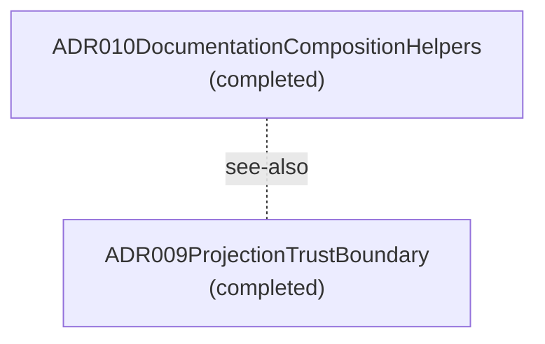

# Design Review — Layered Lens

**Purpose:** Design-review components grouped by architecture layer, including not-yet-implemented specs.
**Detail Level:** Working-state-inclusive context map plus per-lens component diagrams

---

## Overview

This view captures 2 patterns across 1 diagram in the Layered view.

## Diagrams

### Layer: refinement (2 patterns)

## Legend

### Legend

- Solid arrow = dependency (depends-on / uses)
- Dotted line = reference (see-also)

## Patterns

- ADR009ProjectionTrustBoundary
- ADR010DocumentationCompositionHelpers

---

[← Back to Design Review](../DESIGN-REVIEW.md)
