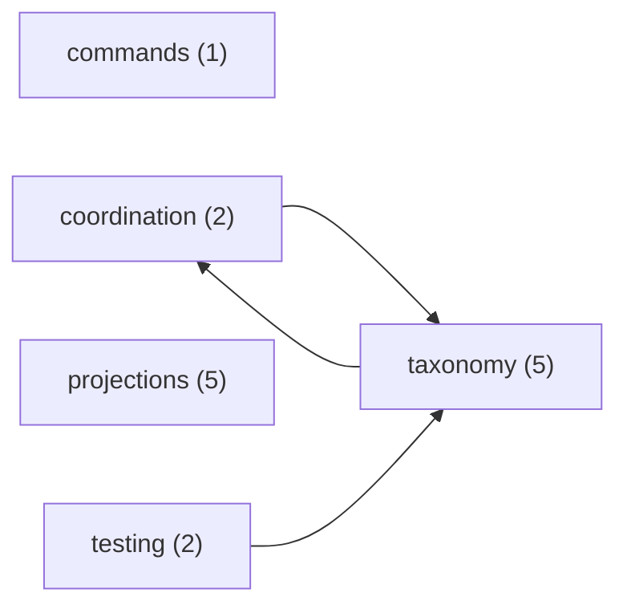
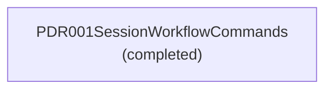
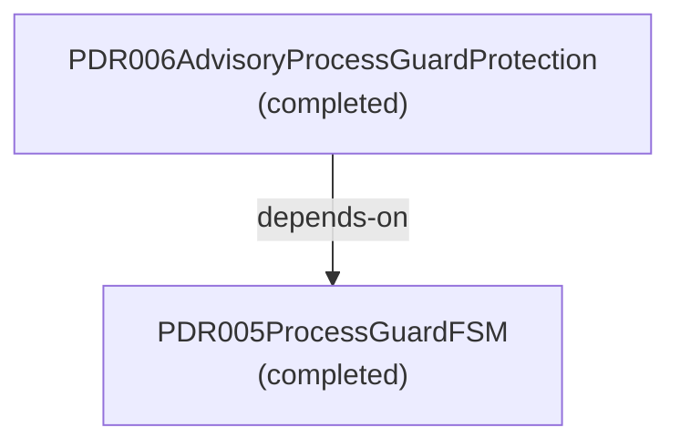
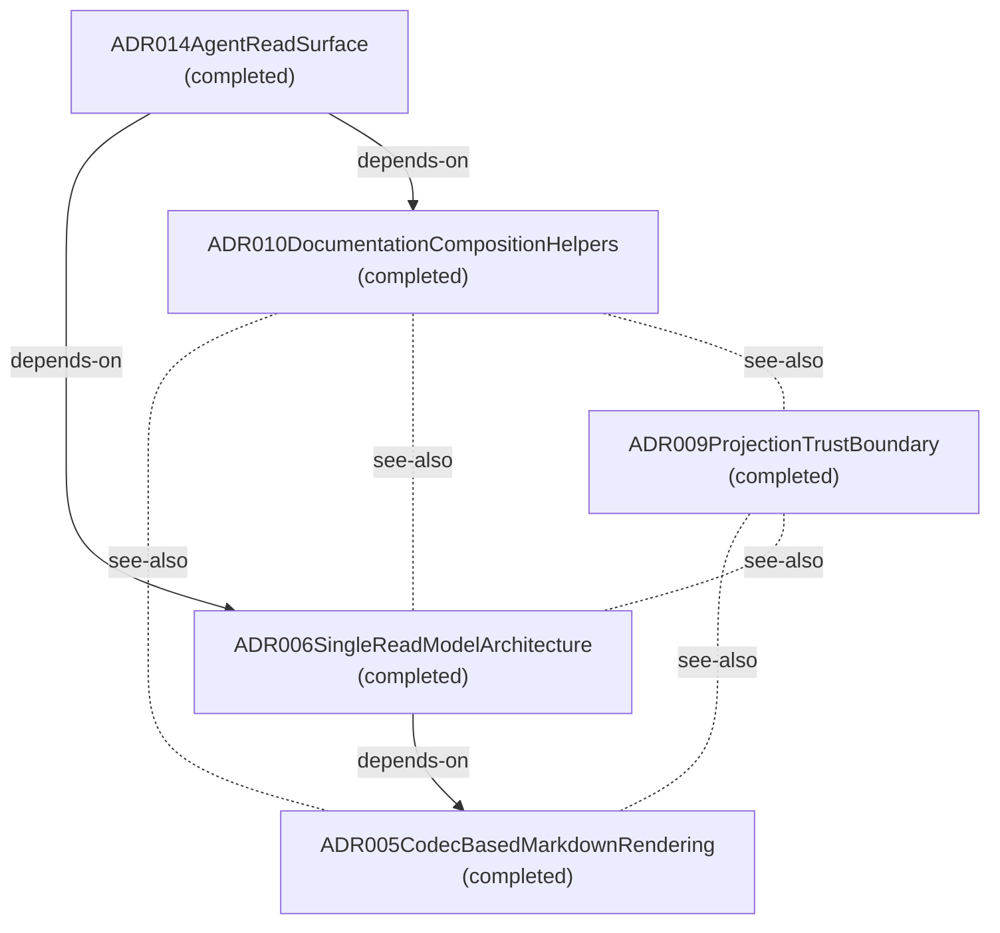
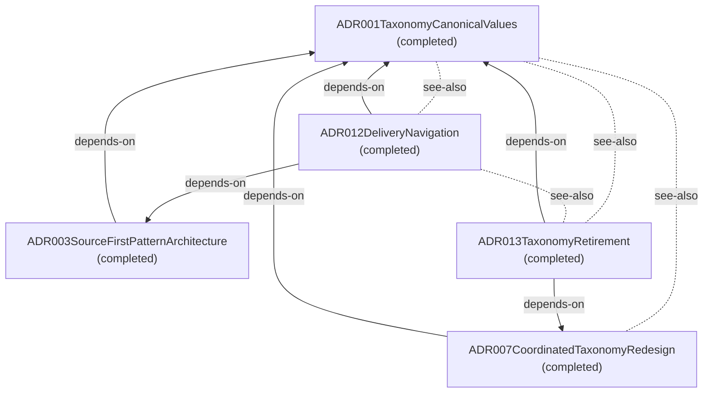
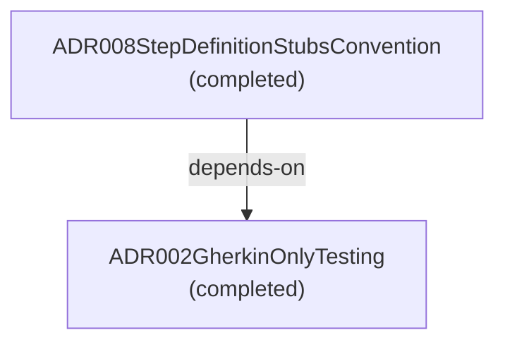

# Design Review — Themed Lens

**Purpose:** Design-review components grouped by decision theme, including not-yet-implemented specs.
**Detail Level:** Working-state-inclusive context map plus per-lens component diagrams

---

## Overview

This view captures 15 patterns across 6 diagrams in the Theme view.

## Diagrams

### Theme Map

Each node is a group; each arrow is a cross-group dependency (`depends-on` / `uses`, pointing from dependant to dependency). The per-group diagrams below detail each group’s internal dependencies and any see-also references.

### Theme: commands (1 pattern)

### Theme: coordination (2 patterns)

### Theme: projections (5 patterns)

### Theme: taxonomy (5 patterns)

### Theme: testing (2 patterns)

## Fan-in

Most-depended-on patterns in this view, ranked by in-view dependant count.

| Pattern                               | Dependants | Top dependants                                                                                                                                     |
| ------------------------------------- | ---------- | -------------------------------------------------------------------------------------------------------------------------------------------------- |
| ADR001TaxonomyCanonicalValues         | 6          | ADR003SourceFirstPatternArchitecture, ADR007CoordinatedTaxonomyRedesign, ADR012DeliveryNavigation, ADR013TaxonomyRetirement, PDR005ProcessGuardFSM |
| ADR003SourceFirstPatternArchitecture  | 2          | ADR008StepDefinitionStubsConvention, ADR012DeliveryNavigation                                                                                      |
| PDR005ProcessGuardFSM                 | 2          | ADR007CoordinatedTaxonomyRedesign, PDR006AdvisoryProcessGuardProtection                                                                            |
| ADR002GherkinOnlyTesting              | 1          | ADR008StepDefinitionStubsConvention                                                                                                                |
| ADR005CodecBasedMarkdownRendering     | 1          | ADR006SingleReadModelArchitecture                                                                                                                  |
| ADR006SingleReadModelArchitecture     | 1          | ADR014AgentReadSurface                                                                                                                             |
| ADR007CoordinatedTaxonomyRedesign     | 1          | ADR013TaxonomyRetirement                                                                                                                           |
| ADR010DocumentationCompositionHelpers | 1          | ADR014AgentReadSurface                                                                                                                             |

## Legend

### Legend

- Solid arrow = dependency (depends-on / uses)
- Dotted line = reference (see-also)

## Patterns

- ADR001TaxonomyCanonicalValues
- ADR002GherkinOnlyTesting
- ADR003SourceFirstPatternArchitecture
- ADR005CodecBasedMarkdownRendering
- ADR006SingleReadModelArchitecture
- ADR007CoordinatedTaxonomyRedesign
- ADR008StepDefinitionStubsConvention
- ADR009ProjectionTrustBoundary
- ADR010DocumentationCompositionHelpers
- ADR012DeliveryNavigation
- ADR013TaxonomyRetirement
- ADR014AgentReadSurface
- PDR001SessionWorkflowCommands
- PDR005ProcessGuardFSM
- PDR006AdvisoryProcessGuardProtection

---

[← Back to Design Review](../DESIGN-REVIEW.md)
