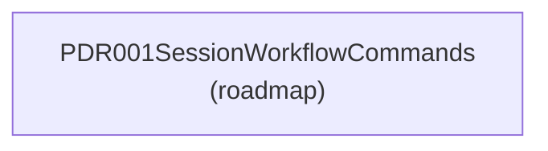
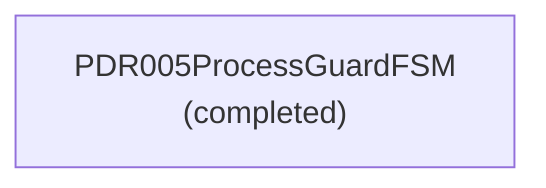
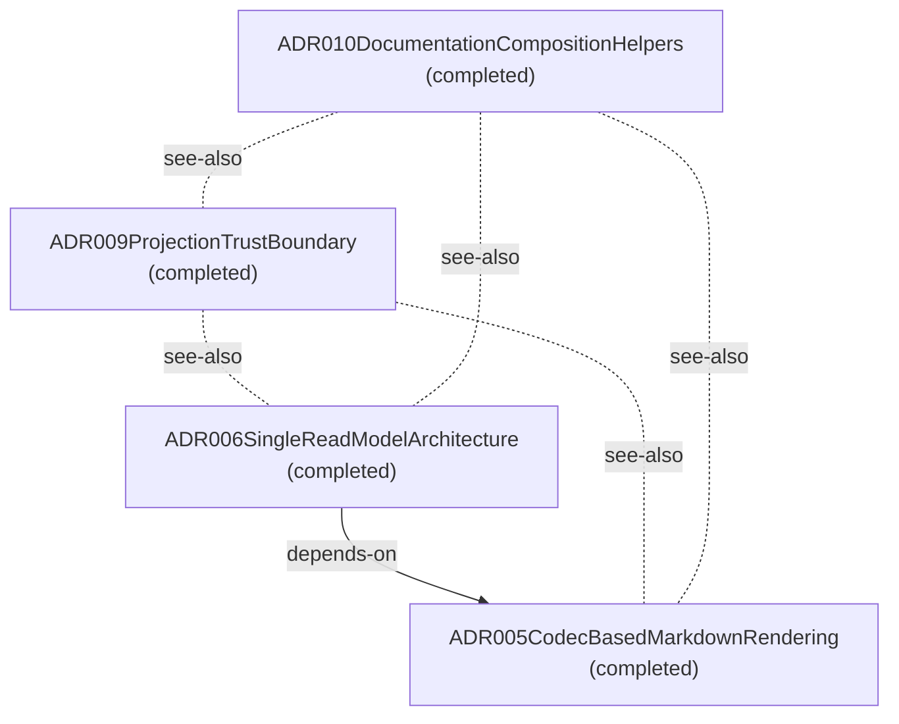
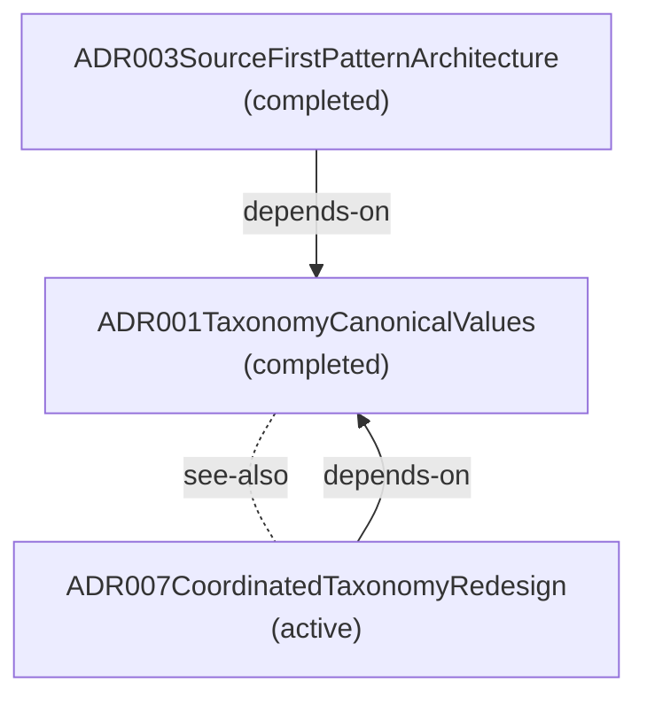
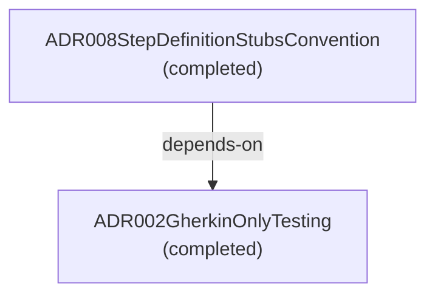

# Design Review — Themed Lens

**Purpose:** Design-review components grouped by decision theme, including not-yet-implemented specs.
**Detail Level:** Working-state-inclusive context map plus per-lens component diagrams

---

## Overview

This view captures 11 patterns across 6 diagrams in the Theme view.

## Diagrams

### Theme Map

Each node is a group; each arrow is a cross-group dependency (`depends-on` / `uses`, pointing from dependant to dependency). The per-group diagrams below detail each group’s internal dependencies and any see-also references.

### Theme: commands (1 pattern)

### Theme: coordination (1 pattern)

### Theme: projections (4 patterns)

### Theme: taxonomy (3 patterns)

### Theme: testing (2 patterns)

## Fan-in

Most-depended-on patterns in this view, ranked by in-view dependant count.

| Pattern                              | Dependants | Top dependants                                                                                 |
| ------------------------------------ | ---------- | ---------------------------------------------------------------------------------------------- |
| ADR001TaxonomyCanonicalValues        | 3          | ADR003SourceFirstPatternArchitecture, ADR007CoordinatedTaxonomyRedesign, PDR005ProcessGuardFSM |
| ADR002GherkinOnlyTesting             | 1          | ADR008StepDefinitionStubsConvention                                                            |
| ADR003SourceFirstPatternArchitecture | 1          | ADR008StepDefinitionStubsConvention                                                            |
| ADR005CodecBasedMarkdownRendering    | 1          | ADR006SingleReadModelArchitecture                                                              |
| PDR005ProcessGuardFSM                | 1          | ADR007CoordinatedTaxonomyRedesign                                                              |

## Legend

### Legend

- Solid arrow = dependency (depends-on / uses)
- Dotted line = reference (see-also)

## Patterns

- ADR001TaxonomyCanonicalValues
- ADR002GherkinOnlyTesting
- ADR003SourceFirstPatternArchitecture
- ADR005CodecBasedMarkdownRendering
- ADR006SingleReadModelArchitecture
- ADR007CoordinatedTaxonomyRedesign
- ADR008StepDefinitionStubsConvention
- ADR009ProjectionTrustBoundary
- ADR010DocumentationCompositionHelpers
- PDR001SessionWorkflowCommands
- PDR005ProcessGuardFSM

---

[← Back to Design Review](../DESIGN-REVIEW.md)
