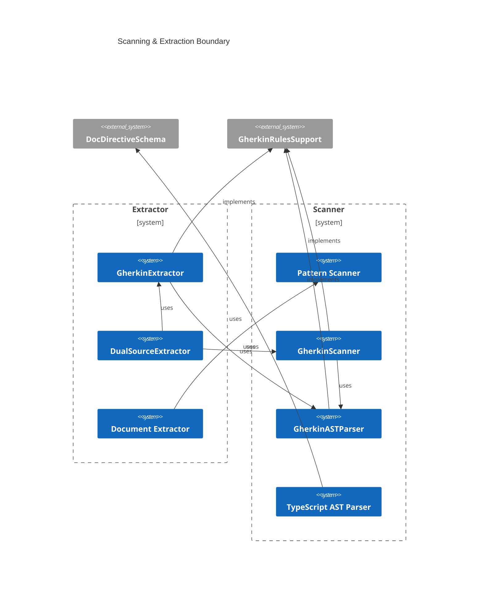
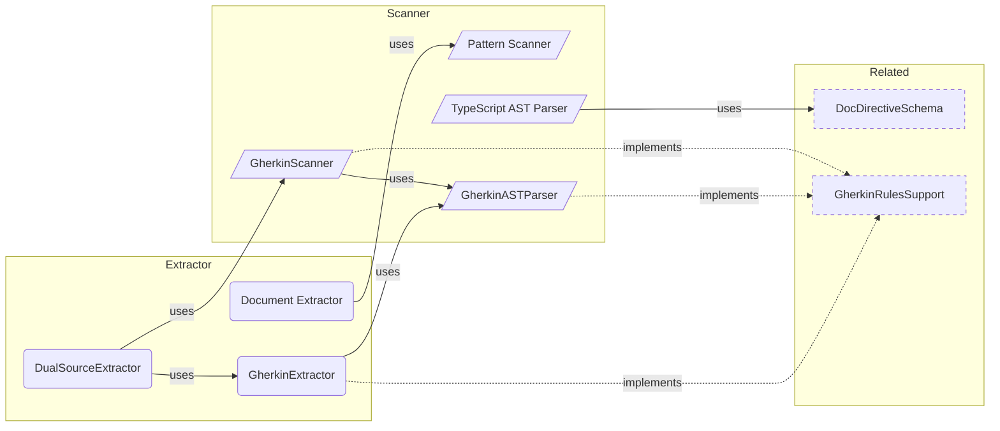

# Annotation Overview

**Purpose:** Annotation product area overview
**Detail Level:** Full reference

---

**How do I annotate code?** The annotation system is the ingestion boundary — it transforms annotated TypeScript and Gherkin files into `ExtractedPattern[]` objects that feed the entire downstream pipeline. Two parallel scanning paths (TypeScript AST + Gherkin parser) converge through dual-source merging. The system is fully data-driven: the `TagRegistry` defines all tags, formats, and categories — adding a new annotation requires only a registry entry, zero parser changes.

## Key Invariants

- Source ownership enforced: `uses`/`used-by`/`category` belong in TypeScript only; `depends-on`/`quarter`/`team`/`phase` belong in Gherkin only. Anti-pattern detector validates at lint time
- Data-driven tag dispatch: Both AST parser and Gherkin parser use `TagRegistry.metadataTags` to determine extraction. 6 format types (`value`/`enum`/`csv`/`number`/`flag`/`quoted-value`) cover all tag shapes — zero parser changes for new tags
- Pipeline data preservation: Gherkin `Rule:` blocks, deliverables, scenarios, and all metadata flow through scanner → extractor → `ExtractedPattern` → generators without data loss
- Dual-source merge with conflict detection: Same pattern name in both TypeScript and Gherkin produces a merge conflict error. Phase mismatches between sources produce validation errors

---

## Contents

- [Key Invariants](#key-invariants)
- [Scanning & Extraction Boundary](#scanning-extraction-boundary)
- [Annotation Pipeline](#annotation-pipeline)
- [API Types](#api-types)
- [Business Rules](#business-rules)

---

## Scanning & Extraction Boundary

Scoped architecture diagram showing component relationships:



---

## Annotation Pipeline

Scoped architecture diagram showing component relationships:



---

## API Types

### TagRegistry (interface)

```typescript
/**
 * TagRegistry interface (matches schema from validation-schemas/tag-registry.ts)
 */
```

```typescript
interface TagRegistry {
  /** Schema version for forward/backward compatibility checking */
  version: string;
  /** Category definitions for classifying patterns by domain (e.g., core, api, ddd) */
  categories: readonly CategoryDefinitionForRegistry[];
  /** Metadata tag definitions with format, purpose, and validation rules */
  metadataTags: readonly MetadataTagDefinitionForRegistry[];
  /** Aggregation tag definitions for document-level grouping */
  aggregationTags: readonly AggregationTagDefinitionForRegistry[];
  /** Available format options for documentation output */
  formatOptions: readonly string[];
  /** Prefix for all tags (e.g., "@libar-docs-") */
  tagPrefix: string;
  /** File-level opt-in marker tag (e.g., "@libar-docs") */
  fileOptInTag: string;
}
```

| Property        | Description                                                                    |
| --------------- | ------------------------------------------------------------------------------ |
| version         | Schema version for forward/backward compatibility checking                     |
| categories      | Category definitions for classifying patterns by domain (e.g., core, api, ddd) |
| metadataTags    | Metadata tag definitions with format, purpose, and validation rules            |
| aggregationTags | Aggregation tag definitions for document-level grouping                        |
| formatOptions   | Available format options for documentation output                              |
| tagPrefix       | Prefix for all tags (e.g., "@libar-docs-")                                     |
| fileOptInTag    | File-level opt-in marker tag (e.g., "@libar-docs")                             |

### MetadataTagDefinitionForRegistry (interface)

```typescript
interface MetadataTagDefinitionForRegistry {
  /** Tag name without prefix (e.g., "pattern", "status", "phase") */
  tag: string;
  /** Value format type determining parsing rules (flag, value, enum, csv, number, quoted-value) */
  format: FormatType;
  /** Human-readable description of the tag's purpose and usage */
  purpose: string;
  /** Whether this tag must be present for valid patterns */
  required?: boolean;
  /** Whether this tag can appear multiple times on a single pattern */
  repeatable?: boolean;
  /** Valid values for enum-type tags (undefined for non-enum formats) */
  values?: readonly string[];
  /** Default value applied when tag is not specified */
  default?: string;
  /** Example usage showing tag syntax (e.g., "@libar-docs-pattern MyPattern") */
  example?: string;
  /** Maps tag name to metadata object property name (defaults to kebab-to-camelCase) */
  metadataKey?: string;
  /** Post-parse value transformer applied after format-based parsing */
  transform?: (value: string) => string;
}
```

| Property    | Description                                                                                |
| ----------- | ------------------------------------------------------------------------------------------ |
| tag         | Tag name without prefix (e.g., "pattern", "status", "phase")                               |
| format      | Value format type determining parsing rules (flag, value, enum, csv, number, quoted-value) |
| purpose     | Human-readable description of the tag's purpose and usage                                  |
| required    | Whether this tag must be present for valid patterns                                        |
| repeatable  | Whether this tag can appear multiple times on a single pattern                             |
| values      | Valid values for enum-type tags (undefined for non-enum formats)                           |
| default     | Default value applied when tag is not specified                                            |
| example     | Example usage showing tag syntax (e.g., "@libar-docs-pattern MyPattern")                   |
| metadataKey | Maps tag name to metadata object property name (defaults to kebab-to-camelCase)            |
| transform   | Post-parse value transformer applied after format-based parsing                            |

### CategoryDefinition (interface)

```typescript
interface CategoryDefinition {
  /** Category tag name without prefix (e.g., "core", "api", "ddd", "saga") */
  readonly tag: string;
  /** Human-readable domain name for display (e.g., "Strategic DDD", "Event Sourcing") */
  readonly domain: string;
  /** Display order priority - lower values appear first in sorted output */
  readonly priority: number;
  /** Brief description of the category's purpose and typical patterns */
  readonly description: string;
  /** Alternative tag names that map to this category (e.g., "es" for "event-sourcing") */
  readonly aliases: readonly string[];
}
```

| Property    | Description                                                                       |
| ----------- | --------------------------------------------------------------------------------- |
| tag         | Category tag name without prefix (e.g., "core", "api", "ddd", "saga")             |
| domain      | Human-readable domain name for display (e.g., "Strategic DDD", "Event Sourcing")  |
| priority    | Display order priority - lower values appear first in sorted output               |
| description | Brief description of the category's purpose and typical patterns                  |
| aliases     | Alternative tag names that map to this category (e.g., "es" for "event-sourcing") |

### TagDefinition (type)

```typescript
type TagDefinition = MetadataTagDefinitionForRegistry;
```

### CategoryTag (type)

```typescript
/**
 * Category tags as a union type
 */
```

```typescript
type CategoryTag = (typeof CATEGORIES)[number]['tag'];
```

### buildRegistry (function)

```typescript
/**
 * Build the complete tag registry from TypeScript constants
 *
 * This is THE single source of truth for the taxonomy.
 * All consumers should use this function instead of loading JSON.
 */
```

```typescript
function buildRegistry(): TagRegistry;
```

### METADATA_TAGS_BY_GROUP (const)

```typescript
/**
 * Metadata tags organized by functional group.
 * Used for documentation generation to create organized sections.
 *
 * Groups:
 * - core: Essential pattern identification (pattern, status, core, usecase, brief)
 * - relationship: Pattern dependencies and connections
 * - process: Timeline and assignment tracking
 * - prd: Product requirements documentation
 * - adr: Architecture decision records
 * - hierarchy: Epic/phase/task breakdown
 * - traceability: Two-tier spec architecture links
 * - discovery: Session discovery findings (retrospective tags)
 * - architecture: Diagram generation tags
 * - extraction: Documentation extraction control
 * - stub: Design session stub metadata
 */
```

```typescript
METADATA_TAGS_BY_GROUP = {
  core: ['pattern', 'status', 'core', 'usecase', 'brief'] as const,
  relationship: [
    'uses',
    'used-by',
    'implements',
    'extends',
    'depends-on',
    'enables',
    'see-also',
    'api-ref',
  ] as const,
  process: [
    'phase',
    'release',
    'quarter',
    'completed',
    'effort',
    'effort-actual',
    'team',
    'workflow',
    'risk',
    'priority',
  ] as const,
  prd: ['product-area', 'user-role', 'business-value', 'constraint'] as const,
  adr: [
    'adr',
    'adr-status',
    'adr-category',
    'adr-supersedes',
    'adr-superseded-by',
    'adr-theme',
    'adr-layer',
  ] as const,
  hierarchy: ['level', 'parent', 'title'] as const,
  traceability: ['executable-specs', 'roadmap-spec', 'behavior-file'] as const,
  discovery: [
    'discovered-gap',
    'discovered-improvement',
    'discovered-risk',
    'discovered-learning',
  ] as const,
  architecture: ['arch-role', 'arch-context', 'arch-layer', 'include'] as const,
  extraction: ['extract-shapes', 'shape'] as const,
  stub: ['target', 'since'] as const,
  convention: ['convention'] as const,
  claude: ['claude-module', 'claude-section', 'claude-tags'] as const,
  sequence: [
    'sequence-orchestrator',
    'sequence-step',
    'sequence-module',
    'sequence-error',
  ] as const,
} as const;
```

### CATEGORIES (const)

```typescript
/**
 * All category definitions for the monorepo
 */
```

```typescript
const CATEGORIES: readonly CategoryDefinition[];
```

### CATEGORY_TAGS (const)

```typescript
/**
 * Extract all category tags as an array
 */
```

```typescript
CATEGORY_TAGS = CATEGORIES.map((c) => c.tag) as readonly CategoryTag[];
```

---

## Business Rules

25 patterns, 116 rules with invariants (116 total)

### Ast Parser Exports

| Rule                                                               | Invariant                                                                                                                                                                                                        | Rationale                                                                                                                                                                       |
| ------------------------------------------------------------------ | ---------------------------------------------------------------------------------------------------------------------------------------------------------------------------------------------------------------- | ------------------------------------------------------------------------------------------------------------------------------------------------------------------------------- |
| Export types are correctly identified from TypeScript declarations | Every exported TypeScript declaration type (function, type, interface, const, class, enum, abstract class, arrow function, async function, generic function, default export, re-export) is correctly classified. | Export type classification drives how codecs render API documentation — misclassifying a function as a const (or vice versa) produces incorrect signatures and misleading docs. |

### Ast Parser Metadata

| Rule                                                                                 | Invariant                                                                                                                                                                            | Rationale                                                                                                                                                                     |
| ------------------------------------------------------------------------------------ | ------------------------------------------------------------------------------------------------------------------------------------------------------------------------------------ | ----------------------------------------------------------------------------------------------------------------------------------------------------------------------------- |
| Metadata is correctly extracted from JSDoc comments                                  | Examples, multi-line descriptions, line numbers, function signatures, and standard JSDoc tags are all correctly parsed and separated.                                                | Downstream codecs render each metadata field independently — incorrect parsing causes examples to leak into descriptions or signatures to be lost in generated documentation. |
| Tags are extracted only from the directive section, not from description or examples | Only tags appearing in the directive section (before the description) are extracted. Tags mentioned in description prose or example code blocks are ignored.                         | Tags control taxonomy classification and pattern routing — extracting them from prose or examples would create phantom patterns and corrupt the registry.                     |
| When to Use sections are extracted in all supported formats                          | When to Use content is extracted from heading format with bullet points, inline bold format, and asterisk bullet format. When no When to Use section exists, the field is undefined. | Generated pattern documentation includes a When to Use section — failing to recognize any supported format means valid guidance silently disappears from output.              |

### Ast Parser Relationships Edges

| Rule                                                   | Invariant                                                                                                                                                           | Rationale                                                                                                                                       |
| ------------------------------------------------------ | ------------------------------------------------------------------------------------------------------------------------------------------------------------------- | ----------------------------------------------------------------------------------------------------------------------------------------------- |
| Relationship tags extract uses and usedBy dependencies | The uses and usedBy relationship arrays are populated from directive tags, not from description content. When no relationship tags exist, the fields are undefined. | Relationship data drives dependency diagrams and impact analysis — extracting from prose would produce false edges from incidental mentions.    |
| Edge cases and malformed input are handled gracefully  | The parser never crashes on invalid input. Files without directives return empty results. Malformed TypeScript returns a structured error with the file path.       | The scanner processes hundreds of files in bulk — a single malformed file must not abort the entire pipeline or produce an undiagnosable crash. |

### Context Inference

| Rule                                               | Invariant                                                                                                                                 | Rationale                                                                                                                                       |
| -------------------------------------------------- | ----------------------------------------------------------------------------------------------------------------------------------------- | ----------------------------------------------------------------------------------------------------------------------------------------------- |
| matchPattern supports recursive wildcard \*\*      | The `**` wildcard matches files at any nesting depth below the specified directory prefix.                                                | Directory hierarchies vary in depth; recursive matching ensures all nested files inherit context.                                               |
| matchPattern supports single-level wildcard /\*    | The `/*` wildcard matches only direct children of the specified directory, not deeper nested files.                                       | Some contexts apply only to a specific directory level, not its entire subtree.                                                                 |
| matchPattern supports prefix matching              | A trailing slash pattern matches any file whose path starts with that directory prefix.                                                   | Without prefix matching, users would need separate wildcard patterns for each nesting depth, making rule configuration verbose and error-prone. |
| inferContext returns undefined when no rules match | When no inference rule matches a file path, the pattern receives no inferred context and is excluded from the byContext index.            | Unmatched files must not receive a spurious context assignment; absence of context is a valid state.                                            |
| inferContext applies first matching rule           | When multiple rules could match a file path, only the first matching rule determines the inferred context.                                | Deterministic ordering prevents ambiguous context assignment when rules overlap.                                                                |
| Explicit archContext is not overridden             | A pattern with an explicitly annotated archContext retains that value regardless of matching inference rules.                             | Explicit annotations represent intentional developer decisions that must not be silently overwritten by automation.                             |
| Inference works independently of archLayer         | Context inference operates on file path alone; the presence or absence of archLayer does not affect context assignment.                   | Coupling context inference to archLayer would prevent context-based queries from finding patterns that lack explicit layer annotations.         |
| Default rules map standard directories             | Each standard source directory (validation, scanner, extractor, etc.) maps to a well-known bounded context name via the default rule set. | Convention-based mapping eliminates the need for explicit context annotations on every file in standard directories.                            |

### Cross Source Validation

| Rule                                            | Invariant                                                                                             | Rationale                                                                                                                                                                             |
| ----------------------------------------------- | ----------------------------------------------------------------------------------------------------- | ------------------------------------------------------------------------------------------------------------------------------------------------------------------------------------- |
| Pattern names must be consistent across sources | A pattern name referenced in one source must resolve to the same canonical name in all other sources. | Typos or inconsistencies between TypeScript and Gherkin pattern names cause silent data loss — the pattern appears as two unrelated entries instead of a unified cross-source record. |
| Circular dependencies are detected              | The dependency graph must be a directed acyclic graph (DAG) with no cycles.                           | Circular dependencies create unresolvable ordering — no pattern in the cycle can be completed first, blocking the entire chain from progressing.                                      |
| Dependency references must resolve              | Every `@depends-on` reference must resolve to an existing pattern in the registry.                    | Dangling dependency references produce incomplete ordering and missing relationship edges in generated documentation, hiding actual inter-pattern constraints.                        |

### Declaration Level Shape Tagging

| Rule                                                              | Invariant                                                                                                                                                                                                                                                                                                                                                                                                                          | Rationale                                                                                                                                                                                                                                                                                                                                         |
| ----------------------------------------------------------------- | ---------------------------------------------------------------------------------------------------------------------------------------------------------------------------------------------------------------------------------------------------------------------------------------------------------------------------------------------------------------------------------------------------------------------------------- | ------------------------------------------------------------------------------------------------------------------------------------------------------------------------------------------------------------------------------------------------------------------------------------------------------------------------------------------------- |
| Declarations opt in via libar-docs-shape tag                      | Only declarations with the libar-docs-shape tag in their immediately preceding JSDoc are collected as tagged shapes. Declarations without the tag are ignored even if they are exported. The tag value is optional -- bare libar-docs-shape opts in without a group, while libar-docs-shape group-name assigns the declaration to a named group. Tagged non-exported declarations are included (DD-7).                             | Explicit opt-in prevents over-extraction of internal helpers. Unlike auto-discovery mode (extract-shapes \*) which grabs all exports, declaration-level tagging gives precise control. This matches how TypeDoc uses public/internal tags -- the annotation lives next to the code it describes, surviving refactors without breaking extraction. |
| Reference doc configs select shapes via shapeSelectors            | shapeSelectors provides three selection modes: by source path + specific names (DD-6 source+names variant), by group tag (DD-6 group variant), or by source path alone (DD-6 source-only variant). shapeSources remains for backward compatibility. When both are present, shapeSources provides the coarse file-level filter and shapeSelectors adds fine-grained name/group filtering on top.                                    | The reference doc system composes focused documents from cherry-picked content. Every other content axis (conventions, behaviors, diagrams) has content-level filtering. shapeSources was the only axis limited to file-level granularity. shapeSelectors closes this gap with the same explicitness as conventionTags.                           |
| Discovery uses existing estree parser with JSDoc comment scanning | The discoverTaggedShapes function uses the existing typescript-estree parse() and extractPrecedingJsDoc() approach. It does not require the TypeScript compiler API, ts-morph, or parseAndGenerateServices. Tag detection is a regex match on the JSDoc comment text already extracted by the existing infrastructure. The tag regex pattern is: /libar-docs-shape(?:\s+(\S+))?/ where capture group 1 is the optional group name. | The shape extractor already traverses declarations and extracts their JSDoc. Adding libar-docs-shape detection is a string search on content that is already available -- approximately 15 lines of new logic. Switching parsers would introduce churn with no benefit for the v1 use case of tag detection on top-level declarations.            |

### Declaration Level Shape Tagging Testing

| Rule                                                              | Invariant                                                                                                            | Rationale                                                                                                                                                                    |
| ----------------------------------------------------------------- | -------------------------------------------------------------------------------------------------------------------- | ---------------------------------------------------------------------------------------------------------------------------------------------------------------------------- |
| Declarations opt in via libar-docs-shape tag                      | Only declarations with the libar-docs-shape tag in their immediately preceding JSDoc are collected as tagged shapes. | Extracting shapes without an explicit opt-in tag would surface internal implementation details in generated API documentation, violating information hiding.                 |
| Discovery uses existing estree parser with JSDoc comment scanning | The discoverTaggedShapes function uses the existing typescript-estree parse() and extractPrecedingJsDoc() approach.  | Introducing a second parser would create divergent AST behavior — reusing the established parser ensures consistent JSDoc handling and avoids subtle extraction differences. |

### Depends On Tag Testing

| Rule                                                   | Invariant                                                                                                  | Rationale                                                                                                                                |
| ------------------------------------------------------ | ---------------------------------------------------------------------------------------------------------- | ---------------------------------------------------------------------------------------------------------------------------------------- |
| Depends-on tag is defined in taxonomy registry         | The depends-on and enables tags must exist in the taxonomy registry with CSV format.                       | Without registry definitions, the data-driven AST parser cannot discover or extract these planning dependency tags from source files.    |
| Depends-on tag is extracted from Gherkin files         | The Gherkin parser must extract depends-on values from feature file tags, including CSV multi-value lists. | Missing dependency extraction causes the dependency tree and blocking-pattern queries to return incomplete results.                      |
| Depends-on in TypeScript triggers anti-pattern warning | The depends-on tag must only appear in Gherkin files; its presence in TypeScript is an anti-pattern.       | Depends-on represents planning dependencies owned by Gherkin specs, not runtime dependencies owned by TypeScript.                        |
| Enables tag is extracted from Gherkin files            | The Gherkin parser must extract enables values from feature file tags, including CSV multi-value lists.    | Missing enables extraction breaks forward-looking dependency queries, hiding which patterns are unblocked when a prerequisite completes. |
| Planning dependencies are stored in relationship index | The relationship index must store dependsOn and enables relationships extracted from pattern metadata.     | Omitting planning dependencies from the index causes blocking-pattern and critical-path queries to return incomplete results.            |

### Directive Detection

| Rule                                                       | Invariant                                                                                                                                                                                                       | Rationale                                                                                                                                                                                           |
| ---------------------------------------------------------- | --------------------------------------------------------------------------------------------------------------------------------------------------------------------------------------------------------------- | --------------------------------------------------------------------------------------------------------------------------------------------------------------------------------------------------- |
| hasDocDirectives detects @libar-docs-\* section directives | hasDocDirectives must return true if and only if the source contains at least one @libar-docs-{suffix} directive (case-sensitive, @ required, suffix required).                                                 | This is the first-pass filter in the scanner pipeline; false negatives cause patterns to be silently missed, while false positives only waste AST parsing time.                                     |
| hasFileOptIn detects file-level @libar-docs marker         | hasFileOptIn must return true if and only if the source contains a bare @libar-docs tag (not followed by a hyphen) inside a JSDoc block comment; line comments and @libar-docs-\* suffixed tags must not match. | File-level opt-in is the gate for including a file in the scanner pipeline; confusing @libar-docs-core (a section tag) with @libar-docs (file opt-in) would either miss files or over-include them. |

### Doc String Media Type

| Rule                                                   | Invariant                                                                                                                                                                | Rationale                                                                                                                                                                   |
| ------------------------------------------------------ | ------------------------------------------------------------------------------------------------------------------------------------------------------------------------ | --------------------------------------------------------------------------------------------------------------------------------------------------------------------------- |
| Parser preserves DocString mediaType during extraction | The Gherkin parser must retain the mediaType annotation from DocString delimiters through to the parsed AST; DocStrings without a mediaType have undefined mediaType.    | Losing the mediaType causes downstream renderers to apply incorrect escaping or default language hints, corrupting code block output.                                       |
| MediaType is used when rendering code blocks           | The rendered code block language must match the DocString mediaType; when mediaType is absent, the renderer falls back to a caller-specified default language.           | Using the wrong language hint causes syntax highlighters to misrender code blocks, and losing mediaType entirely can trigger incorrect escaping (e.g., asterisks in JSDoc). |
| renderDocString handles both string and object formats | renderDocString accepts both plain string and object DocString formats; when an object has a mediaType, it takes precedence over the caller-supplied language parameter. | Legacy callers pass raw strings while newer code passes structured objects — the renderer must handle both without breaking existing usage.                                 |

### Dual Source Extractor Testing

| Rule                                                             | Invariant                                                                                                                                                                            | Rationale                                                                                                                                                         |
| ---------------------------------------------------------------- | ------------------------------------------------------------------------------------------------------------------------------------------------------------------------------------ | ----------------------------------------------------------------------------------------------------------------------------------------------------------------- |
| Process metadata is extracted from feature tags                  | A feature file must have both @pattern and @phase tags to produce valid process metadata; missing either yields null.                                                                | Pattern name and phase are the minimum identifiers for placing a pattern in the roadmap — without both, the pattern cannot be tracked.                            |
| Deliverables are extracted from Background tables                | Deliverables are sourced exclusively from Background tables; features without a Background produce an empty deliverable list.                                                        | The Background table is the single source of truth for deliverable tracking — extracting from other locations would create ambiguity.                             |
| Code and feature patterns are combined into dual-source patterns | A combined pattern is produced only when both a code stub and a feature file exist for the same pattern name; unmatched sources are tracked separately as code-only or feature-only. | Dual-source combination ensures documentation reflects both implementation intent (code) and specification (Gherkin) — mismatches signal inconsistency.           |
| Dual-source results are validated for consistency                | Cross-source validation reports errors for metadata mismatches and warnings for orphaned patterns that are still in roadmap status.                                                  | Inconsistencies between code stubs and feature files indicate drift — errors catch conflicts while warnings surface missing counterparts that may be intentional. |
| Include tags are extracted from Gherkin feature tags             | Include tags are parsed as comma-separated values; absence of the tag means the pattern has no includes.                                                                             | Include tags control which patterns appear in scoped diagrams — incorrect parsing drops patterns from diagrams or includes unrelated ones.                        |

### Extends Tag Testing

| Rule                                         | Invariant                                                                                                | Rationale                                                                                                                                  |
| -------------------------------------------- | -------------------------------------------------------------------------------------------------------- | ------------------------------------------------------------------------------------------------------------------------------------------ |
| Extends tag is defined in taxonomy registry  | The extends tag must exist in the taxonomy registry with single-value format.                            | Without a registry definition, the data-driven AST parser cannot discover or extract the extends tag from source files.                    |
| Patterns can extend exactly one base pattern | A pattern may extend at most one base pattern, enforced by single-value tag format.                      | Single inheritance avoids diamond-problem ambiguity in pattern generalization hierarchies.                                                 |
| Transform builds extendedBy reverse lookup   | The transform must compute an extendedBy reverse index so base patterns know which patterns extend them. | Without the reverse index, base patterns cannot discover their extensions, breaking generalization hierarchy navigation in generated docs. |
| Linter detects circular inheritance chains   | Circular inheritance chains (direct or transitive) must be detected and reported as errors.              | Circular extends relationships create infinite resolution loops and undefined behavior.                                                    |

### Extraction Pipeline Enhancements Testing

| Rule                                                            | Invariant                                                                                                               | Rationale                                                                                                                                                                 |
| --------------------------------------------------------------- | ----------------------------------------------------------------------------------------------------------------------- | ------------------------------------------------------------------------------------------------------------------------------------------------------------------------- |
| Function signatures surface full parameter types in ExportInfo  | ExportInfo.signature shows full parameter types and return type instead of the placeholder value.                       | Reference documentation renders signatures verbatim — placeholder values instead of real types make the API docs unusable for consumers.                                  |
| Property-level JSDoc preserves full multi-line content          | Property-level JSDoc preserves full multi-line content without first-line truncation.                                   | Truncated property descriptions lose important behavioral details (defaults, units, constraints) that consumers rely on when integrating with the API.                    |
| Param returns and throws tags are extracted from function JSDoc | JSDoc param, returns, and throws tags are extracted and stored on ExtractedShape for function-kind shapes.              | Function reference docs require parameter, return, and exception documentation — missing extraction means consumers must read source code instead of generated docs.      |
| Auto-shape discovery extracts all exported types via wildcard   | When extract-shapes tag value is the wildcard character, all exported declarations are extracted without listing names. | Requiring explicit names for every export creates maintenance burden and stale annotations — wildcard discovery keeps shape docs in sync as exports are added or removed. |

### File Discovery

| Rule                                            | Invariant                                                                                                           | Rationale                                                                                                                                                         |
| ----------------------------------------------- | ------------------------------------------------------------------------------------------------------------------- | ----------------------------------------------------------------------------------------------------------------------------------------------------------------- |
| Glob patterns match TypeScript source files     | findFilesToScan must return absolute paths for all files matching the configured glob patterns.                     | Downstream pipeline stages (AST parser, extractor) require absolute paths to read file contents; relative paths would break when baseDir differs from cwd.        |
| Default exclusions filter non-source files      | node_modules, dist, .test.ts, .spec.ts, and .d.ts files must be excluded by default without explicit configuration. | Scanning generated output (dist), third-party code (node_modules), or test files would produce false positives in the pattern registry and waste processing time. |
| Custom configuration extends discovery behavior | User-provided exclude patterns must be applied in addition to (not replacing) the default exclusions.               | Replacing defaults with custom patterns would silently re-include node_modules and dist, causing false positives in the pattern registry.                         |

### Gherkin Ast Parser

| Rule                                                       | Invariant                                                                                                                            | Rationale                                                                                                                                                          |
| ---------------------------------------------------------- | ------------------------------------------------------------------------------------------------------------------------------------ | ------------------------------------------------------------------------------------------------------------------------------------------------------------------ |
| Successful feature file parsing extracts complete metadata | A valid feature file must produce a ParsedFeature with name, description, language, tags, and all nested scenarios with their steps. | Downstream generators (timeline, business rules) depend on complete AST extraction; missing fields cause silent gaps in generated documentation.                   |
| Invalid Gherkin produces structured errors                 | Malformed or incomplete Gherkin input must return a Result.err with the source file path and a descriptive error message.            | The scanner processes many feature files in batch; structured errors allow graceful degradation and per-file error reporting rather than aborting the entire scan. |

### Gherkin Rules Support

| Rule                                                     | Invariant                                                                                                                                  | Rationale                                                                                                                                                                                                                                                                                                                                                                |
| -------------------------------------------------------- | ------------------------------------------------------------------------------------------------------------------------------------------ | ------------------------------------------------------------------------------------------------------------------------------------------------------------------------------------------------------------------------------------------------------------------------------------------------------------------------------------------------------------------------ |
| Rules flow through the entire pipeline without data loss | Rule data (name, description, tags, scenarios) must be preserved through every pipeline stage from parser to ExtractedPattern.             | Any data loss at an intermediate stage makes rule content invisible to all downstream generators, silently producing incomplete documentation. The @cucumber/gherkin parser extracts Rules natively. Our pipeline must preserve this data through scanner, extractor, and into ExtractedPattern so generators can access rule names, descriptions, and nested scenarios. |
| Generators can render rules as business documentation    | Rules must render as human-readable Business Rules sections, not as raw Given/When/Then syntax.                                            | Business stakeholders cannot interpret Gherkin step definitions; without rendering transformation, feature files remain developer-only artifacts. Business stakeholders see rule names and descriptions as "Business Rules" sections, not Given/When/Then syntax. This enables human-readable PRDs from the same files used for test execution.                          |
| Custom content blocks render in acceptance criteria      | DataTables and DocStrings attached to steps must appear in generated documentation as Markdown tables and fenced code blocks respectively. | Without rendering custom content blocks, acceptance criteria lose the structured data and code examples that make them self-contained and verifiable. DataTables and DocStrings in steps should appear in generated documentation, providing structured data and code examples alongside step descriptions.                                                              |
| vitest-cucumber executes scenarios inside Rules          | Scenarios nested inside Rule blocks must be executable by vitest-cucumber using the Rule() and RuleScenario() API.                         | If Rule-scoped scenarios cannot execute, adding Rule blocks to feature files would break the test suite, forcing a choice between documentation structure and test coverage. Test execution must work for scenarios inside Rule blocks. Use Rule() function with RuleScenario() instead of Scenario().                                                                   |

### Implements Tag Processing

| Rule                                                   | Invariant                                                                                                    | Rationale                                                                                                                      |
| ------------------------------------------------------ | ------------------------------------------------------------------------------------------------------------ | ------------------------------------------------------------------------------------------------------------------------------ |
| Implements tag is defined in taxonomy registry         | The implements tag must exist in the taxonomy registry with CSV format.                                      | Without a registry definition, the data-driven AST parser cannot discover or extract the implements tag from source files.     |
| Files can implement a single pattern                   | The AST parser must extract a single implements value and preserve it through the extraction pipeline.       | Lost implements values sever the link between implementation files and their roadmap specs, breaking traceability.             |
| Files can implement multiple patterns using CSV format | The AST parser must split CSV implements values into individual pattern references with whitespace trimming. | Unsplit or untrimmed CSV values produce invalid pattern references that fail relationship index lookups.                       |
| Transform builds implementedBy reverse lookup          | The transform must compute an implementedBy reverse index so spec patterns know which files implement them.  | Without the reverse index, roadmap specs cannot discover their implementation files, breaking traceability and DoD validation. |
| Schemas validate implements field correctly            | The Zod schemas must accept implements and implementedBy fields with correct array-of-string types.          | Schema rejection of valid implements/implementedBy values causes runtime parse failures that silently drop traceability links. |

### Layer Inference Testing

| Rule                                                                     | Invariant                                                                                                                                   | Rationale                                                                                                                                                                  |
| ------------------------------------------------------------------------ | ------------------------------------------------------------------------------------------------------------------------------------------- | -------------------------------------------------------------------------------------------------------------------------------------------------------------------------- |
| Timeline layer is detected from /timeline/ directory segments            | Any feature file path containing a /timeline/ directory segment is classified as timeline layer.                                            | Timeline features track phased delivery progress and must be grouped separately for roadmap generation and phase filtering.                                                |
| Domain layer is detected from business context directory segments        | Feature files in /deciders/, /orders/, or /inventory/ directories are classified as domain layer.                                           | Domain features define core business rules and must be distinguished from infrastructure tests for accurate coverage reporting.                                            |
| Integration layer is detected and takes priority over domain directories | Paths containing /integration-features/ or /integration/ are classified as integration, even when they also contain domain directory names. | Integration tests nested under domain directories (e.g., /integration/orders/) would be misclassified as domain without explicit priority, skewing layer coverage metrics. |
| E2E layer is detected from /e2e/ directory segments                      | Any feature file path containing an /e2e/ directory segment is classified as e2e layer.                                                     | E2E tests require separate execution infrastructure and longer timeouts; misclassification would mix them into faster test suites.                                         |
| Component layer is detected from tool-specific directory segments        | Feature files in /scanner/ or /lint/ directories are classified as component layer.                                                         | Tool-specific features test internal pipeline stages and must be isolated from business domain and integration layers in documentation grouping.                           |
| Unknown layer is the fallback for unclassified paths                     | Any feature file path that does not match a known layer pattern is classified as unknown.                                                   | Silently dropping unclassified features would create invisible gaps in test coverage; the unknown fallback ensures every feature is accounted for.                         |
| Path normalization handles cross-platform and case differences           | Layer inference produces correct results regardless of path separators, case, or absolute vs relative paths.                                | The consumer monorepo runs on multiple platforms; platform-dependent classification would produce inconsistent documentation across developer machines and CI.             |
| FEATURE_LAYERS constant provides validated layer enumeration             | FEATURE_LAYERS is a readonly array containing exactly all 6 valid layer values.                                                             | Consumers iterate over FEATURE_LAYERS for exhaustive layer handling; a mutable or incomplete array would cause missed layers at runtime.                                   |

### Pattern Relationship Model

| Rule                                                      | Invariant                                                                                                                                                                                                                                                                                                                   | Rationale                                                                                                                                                                                                                                                                                                   |
| --------------------------------------------------------- | --------------------------------------------------------------------------------------------------------------------------------------------------------------------------------------------------------------------------------------------------------------------------------------------------------------------------- | ----------------------------------------------------------------------------------------------------------------------------------------------------------------------------------------------------------------------------------------------------------------------------------------------------------- |
| Code files declare pattern realization via implements tag | Files with `@libar-docs-implements:PatternName,OtherPattern` are linked to the specified patterns without causing conflicts. Pattern definitions remain in roadmap specs; implementation files provide supplementary metadata. Multiple files can implement the same pattern, and one file can implement multiple patterns. | This mirrors UML's "realization" relationship where a class implements an interface. Code realizes the specification. Direction is code→spec (backward link). CSV format allows a single implementation file to realize multiple patterns when implementing a pattern family (e.g., durability primitives). |
| Pattern inheritance uses extends relationship tag         | Files with `@libar-docs-extends:BasePattern` declare that they extend another pattern's capabilities. This is a generalization relationship where the extending pattern is a specialization of the base pattern.                                                                                                            | Pattern families exist where specialized patterns build on base patterns. For example, `ReactiveProjections` extends `ProjectionCategories`. The extends relationship enables inheritance-based documentation and validates pattern hierarchy.                                                              |
| Technical dependencies use directed relationship tags     | `@libar-docs-uses` declares outbound dependencies (what this pattern depends on). `@libar-docs-used-by` declares inbound dependencies (what depends on this pattern). Both are CSV format.                                                                                                                                  | These represent technical coupling between patterns. The distinction matters for impact analysis: changing a pattern affects its `used-by` consumers but not its `uses` dependencies.                                                                                                                       |
| Roadmap sequencing uses ordering relationship tags        | `@libar-docs-depends-on` declares what must be completed first (roadmap sequencing). `@libar-docs-enables` declares what this unlocks when completed. These are planning relationships, not technical dependencies.                                                                                                         | Sequencing is about order of work, not runtime coupling. A pattern may depend on another being complete without using its code.                                                                                                                                                                             |
| Cross-tier linking uses traceability tags (PDR-007)       | `@libar-docs-executable-specs` on roadmap specs points to test locations. `@libar-docs-roadmap-spec` on package specs points back to the pattern. These create bidirectional traceability.                                                                                                                                  | Two-tier architecture (PDR-007) separates planning specs from executable tests. Traceability tags maintain the connection for navigation and completeness checking.                                                                                                                                         |
| Epic/Phase/Task hierarchy uses parent-child relationships | `@libar-docs-level` declares the hierarchy tier (epic, phase, task). `@libar-docs-parent` links to the containing pattern. This enables rollup progress tracking.                                                                                                                                                           | Large initiatives decompose into phases and tasks. The hierarchy allows progress aggregation (e.g., "Epic 80% complete based on child phases").                                                                                                                                                             |
| All relationships appear in generated documentation       | The PATTERNS.md dependency graph renders all relationship types with distinct visual styles. Pattern detail pages list all related artifacts grouped by relationship type.                                                                                                                                                  | Visualization makes the relationship model accessible. Different arrow styles distinguish relationship semantics at a glance.                                                                                                                                                                               |
| Linter detects relationship violations                    | The pattern linter validates that all relationship targets exist, implements files don't have pattern tags, and bidirectional links are consistent.                                                                                                                                                                         | Broken relationships cause confusion and incorrect generated docs. Early detection during linting prevents propagation of errors.                                                                                                                                                                           |

### Pattern Tag Extraction

| Rule                                                                        | Invariant                                                                                                                                  | Rationale                                                                                                                                                 |
| --------------------------------------------------------------------------- | ------------------------------------------------------------------------------------------------------------------------------------------ | --------------------------------------------------------------------------------------------------------------------------------------------------------- |
| Single value tags produce scalar metadata fields                            | Each single-value tag (pattern, phase, status, brief) maps to exactly one metadata field with the correct type.                            | Incorrect type coercion (e.g., phase as string instead of number) causes downstream pipeline failures in filtering and sorting.                           |
| Array value tags accumulate into list metadata fields                       | Tags for depends-on and enables split comma-separated values and accumulate across multiple tag occurrences.                               | Missing a dependency value silently breaks the dependency graph, causing incorrect build ordering and orphaned pattern references.                        |
| Category tags are colon-free tags filtered against known non-categories     | Tags without colons become categories, except known non-category tags (acceptance-criteria, happy-path) and the libar-docs opt-in marker.  | Including test-control tags (acceptance-criteria, happy-path) as categories pollutes the pattern taxonomy with non-semantic values.                       |
| Complex tag lists produce fully populated metadata                          | All tag types (scalar, array, category) are correctly extracted from a single mixed tag list.                                              | Real feature files combine many tag types; extraction must handle all types simultaneously without interference between parsers.                          |
| Edge cases produce safe defaults                                            | Empty or invalid inputs produce empty metadata or omit invalid fields rather than throwing errors.                                         | Throwing on malformed tags would abort extraction for the entire file, losing valid metadata from well-formed tags.                                       |
| Convention tags support CSV values with whitespace trimming                 | Convention tags split comma-separated values and trim whitespace from each value.                                                          | Untrimmed whitespace creates distinct values for the same convention, causing false negatives in convention-based filtering and validation.               |
| Registry-driven extraction handles enums, transforms, and value constraints | Tags defined in the registry use data-driven extraction with enum validation, CSV accumulation, value transforms, and constraint checking. | Hard-coded if/else branches for each tag type cannot scale; registry-driven extraction ensures new tags are supported by configuration, not code changes. |

### Scanner Core

| Rule                                                   | Invariant                                                                                                                                 | Rationale                                                                                                                                             |
| ------------------------------------------------------ | ----------------------------------------------------------------------------------------------------------------------------------------- | ----------------------------------------------------------------------------------------------------------------------------------------------------- |
| scanPatterns extracts directives from TypeScript files | Every file with a valid opt-in marker and JSDoc directives produces a complete ScannedFile with tags, description, examples, and exports. | Downstream generators depend on complete directive data; partial extraction causes silent documentation gaps across the monorepo.                     |
| scanPatterns collects errors without aborting          | A parse failure in one file never prevents other files from being scanned; the result is always Ok with errors collected separately.      | In a monorepo with hundreds of files, a single syntax error must not block the entire documentation pipeline.                                         |
| Pattern matching and exclusion filtering               | Glob patterns control file discovery and exclusion patterns remove matched files before scanning.                                         | Without exclusion filtering, internal directories and generated files would pollute the pattern registry with false positives and slow down scanning. |
| File opt-in requirement gates scanning                 | Only files containing a standalone @libar-docs marker (not @libar-docs-\*) are eligible for directive extraction.                         | Without opt-in gating, every TypeScript file in the monorepo would be parsed, wasting processing time on files that have no documentation directives. |

### Shape Extraction

| Rule                                             | Invariant                                                                                                                                                                                      | Rationale                                                                                                                                                                                  |
| ------------------------------------------------ | ---------------------------------------------------------------------------------------------------------------------------------------------------------------------------------------------- | ------------------------------------------------------------------------------------------------------------------------------------------------------------------------------------------ |
| extract-shapes tag is defined in registry        | The `extract-shapes` tag must exist with CSV format to list multiple type names for extraction.                                                                                                | Without a CSV-format tag, there is no mechanism to specify which type names to extract, and the extractor cannot discover shapes from source files.                                        |
| Interfaces are extracted from TypeScript AST     | When `@libar-docs-extract-shapes` lists an interface name, the extractor must find and extract the complete interface definition including JSDoc comments, generics, and extends clauses.      | Partial extraction (missing generics, JSDoc, or extends clauses) produces incomplete API documentation that misleads consumers about a type's actual contract.                             |
| Type aliases are extracted from TypeScript AST   | Type aliases (including union types, intersection types, and mapped types) are extracted when listed in extract-shapes.                                                                        | Type aliases define domain vocabulary (status enums, branded types, utility types) that consumers need to understand API signatures; omitting them leaves gaps in generated documentation. |
| Enums are extracted from TypeScript AST          | Both string and numeric enums are extracted with their complete member definitions.                                                                                                            | Enum members define the closed set of valid values for a type; extracting only the enum name without its members provides no useful information to documentation consumers.                |
| Function signatures are extracted (body omitted) | When a function name is listed in extract-shapes, only the signature (parameters, return type, generics) is extracted. The function body is replaced with ellipsis for documentation purposes. | Including implementation bodies in generated documentation exposes internal logic, bloats output size, and creates a maintenance burden when internals change without API changes.         |
| Multiple shapes are extracted in specified order | When multiple shapes are listed, they appear in the documentation in the order specified in the tag, not source order.                                                                         | Authors intentionally order shapes for progressive disclosure (e.g., output before input); using source order would break the author's intended documentation narrative.                   |
| Extracted shapes render as fenced code blocks    | Codecs render extracted shapes as TypeScript fenced code blocks, grouped under an "API Types" or similar section.                                                                              | Rendering shapes as plain text or without language hints prevents syntax highlighting and makes API types unreadable in generated markdown documentation.                                  |
| Shapes can reference types from imports          | Extracted shapes may reference types from imports. The extractor does NOT resolve imports - it extracts the shape as-is. Consumers understand that referenced types are defined elsewhere.     | Resolving imports would require full dependency graph traversal across the codebase, dramatically increasing complexity and coupling the extractor to the project's module structure.      |
| Overloaded function signatures are all extracted | When a function has multiple overload signatures, all signatures are extracted together as they represent the complete API.                                                                    | Extracting only one overload signature hides valid call patterns from consumers, leading to incorrect usage assumptions about the function's capabilities.                                 |
| Shape rendering supports grouping options        | Codecs can render shapes grouped in a single code block or as separate code blocks, depending on detail level.                                                                                 | Compact claude-md modules need grouped blocks to minimize token usage, while detailed human docs benefit from separate blocks with individual JSDoc annotations.                           |

### Shape Extraction Rendering Testing

| Rule                                                                             | Invariant                                                                                                                       | Rationale                                                                                                                                                                        |
| -------------------------------------------------------------------------------- | ------------------------------------------------------------------------------------------------------------------------------- | -------------------------------------------------------------------------------------------------------------------------------------------------------------------------------- |
| Multiple shapes are extracted in specified order                                 | Extracted shapes appear in the order specified by the tag list, not in source file declaration order.                           | Documentation consumers rely on tag-specified ordering for consistent, predictable layout regardless of how source files are organized.                                          |
| Extracted shapes render as fenced code blocks                                    | Every extracted shape renders as a fenced TypeScript code block in the markdown output.                                         | Fenced code blocks provide syntax highlighting and preserve type definition formatting, which is essential for readable API documentation.                                       |
| Imported and re-exported shapes are tracked separately                           | Shapes resolved via import or re-export statements are classified distinctly from locally declared shapes.                      | Silently extracting imported types as if they were local declarations would produce duplicate or misleading documentation, since the canonical definition lives in another file. |
| Invalid TypeScript produces error result                                         | Malformed TypeScript source returns an error Result instead of throwing or producing partial shapes.                            | Unhandled parse exceptions would crash the pipeline mid-run, preventing all subsequent files from being processed.                                                               |
| Shape rendering supports grouping options                                        | The `groupInSingleBlock` option controls whether shapes render in one combined code fence or in separate per-shape code fences. | Different documentation layouts require different grouping strategies; a single block provides compact overviews while separate blocks allow per-type commentary.                |
| Annotation tags are stripped from extracted JSDoc while preserving standard tags | Extracted shapes never contain @libar-docs-\* annotation lines in their jsDoc field.                                            | Shape JSDoc is rendered in documentation output. Annotation tags are metadata for the extraction pipeline, not user-visible documentation content.                               |
| Large source files are rejected to prevent memory exhaustion                     | Source files exceeding 5MB are rejected before parsing begins.                                                                  | Feeding unbounded input to the TypeScript parser risks out-of-memory crashes that would halt the entire extraction pipeline.                                                     |

### Shape Extraction Types Testing

| Rule                                                       | Invariant                                                                                                                                                           | Rationale                                                                                                                                                                                                                                                                                             |
| ---------------------------------------------------------- | ------------------------------------------------------------------------------------------------------------------------------------------------------------------- | ----------------------------------------------------------------------------------------------------------------------------------------------------------------------------------------------------------------------------------------------------------------------------------------------------- |
| extract-shapes tag exists in registry with CSV format      | The `extract-shapes` tag must be registered with CSV format so multiple shape names can be specified in a single annotation.                                        | Without CSV format registration, the tag parser cannot split comma-separated shape lists, causing only the first shape to be extracted.                                                                                                                                                               |
| Interfaces are extracted from TypeScript AST               | Every named interface declaration in a TypeScript source file must be extractable as a shape with kind `interface`, including generics, extends clauses, and JSDoc. | Interfaces are the primary API surface for TypeScript libraries; failing to extract them leaves the most important type contracts undocumented.                                                                                                                                                       |
| Property-level JSDoc is extracted for interface properties | Property-level JSDoc must be attributed only to the immediately adjacent property, never inherited from the parent interface declaration.                           | Misattributing interface-level JSDoc to the first property produces incorrect per-field documentation and misleads consumers about individual property semantics. The extractor uses strict adjacency (gap = 1 line) to prevent interface-level JSDoc from being misattributed to the first property. |
| Type aliases are extracted from TypeScript AST             | Union types, mapped types, and conditional types must all be extractable as shapes with kind `type`, preserving their full type expression.                         | Type aliases encode domain constraints (e.g., discriminated unions, mapped utilities) that are essential for API documentation; omitting them hides the type-level design.                                                                                                                            |
| Enums are extracted from TypeScript AST                    | Both regular and const enums must be extractable as shapes with kind `enum`, including their member values.                                                         | Enums define finite value sets used in validation and serialization; missing them from documentation forces consumers to read source code to discover valid values.                                                                                                                                   |
| Function signatures are extracted with body omitted        | Extracted function shapes must include the full signature (name, parameters, return type, async modifier) but never the implementation body.                        | Including function bodies in documentation exposes implementation details, inflates output size, and creates a maintenance burden when internals change without signature changes.                                                                                                                    |
| Const declarations are extracted from TypeScript AST       | Const declarations must be extractable as shapes with kind `const`, whether or not they carry an explicit type annotation.                                          | Constants define configuration defaults, version strings, and sentinel values that consumers depend on; excluding them creates documentation gaps for public API surface.                                                                                                                             |
| Non-exported shapes are extractable                        | Shape extraction must succeed for declarations regardless of export status, with the `exported` flag accurately reflecting visibility.                              | Internal types often define the core domain model; restricting extraction to exports only would omit types that are essential for understanding module internals.                                                                                                                                     |

### Uses Tag Testing

| Rule                                                | Invariant                                                                                                                 | Rationale                                                                                                                           |
| --------------------------------------------------- | ------------------------------------------------------------------------------------------------------------------------- | ----------------------------------------------------------------------------------------------------------------------------------- |
| Uses tag is defined in taxonomy registry            | The uses and used-by tags must be registered in the taxonomy with CSV format and dependency-related purpose descriptions. | Without registry definitions, the data-driven AST parser cannot discover or extract these tags from source files.                   |
| Uses tag is extracted from TypeScript files         | The AST parser must extract single and comma-separated uses values from TypeScript JSDoc annotations.                     | Missing or malformed uses extraction breaks runtime dependency tracking and produces incomplete relationship diagrams.              |
| Used-by tag is extracted from TypeScript files      | The AST parser must extract single and comma-separated used-by values from TypeScript JSDoc annotations.                  | Missing used-by extraction prevents reverse dependency lookups, leaving consumers unable to discover which patterns depend on them. |
| Uses relationships are stored in relationship index | All declared uses and usedBy relationships must be stored in the relationship index as explicitly declared entries.       | Omitting relationships from the index causes dependency diagrams and impact-analysis queries to silently miss connections.          |
| Schemas validate uses field correctly               | DocDirective and RelationshipEntry schemas must accept uses and usedBy fields as valid CSV string values.                 | Schema rejection of valid uses/usedBy values causes runtime parse failures that silently drop relationship data.                    |

---
