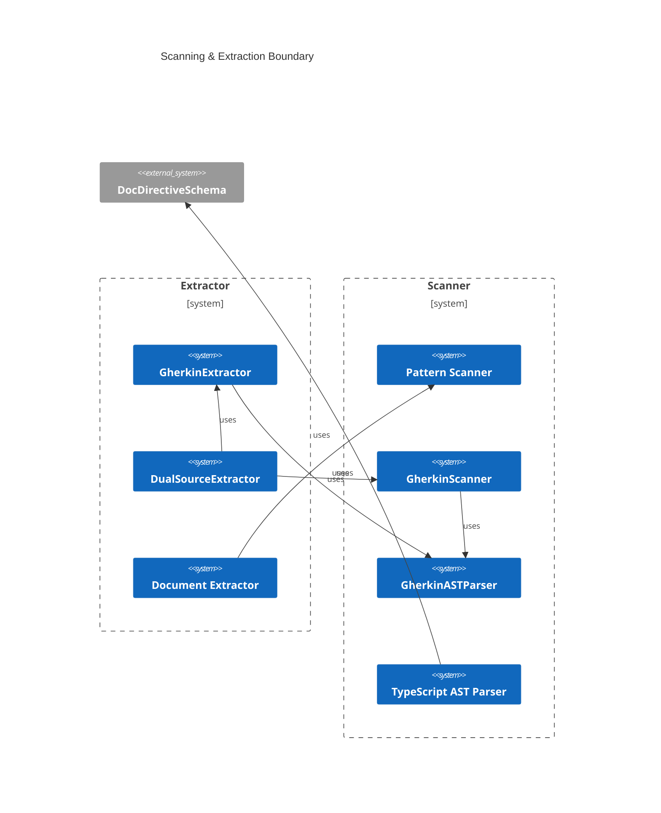
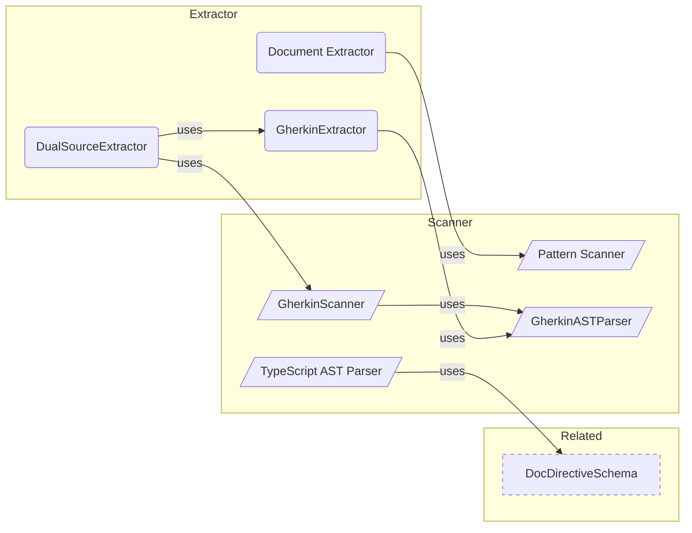

# Annotation Overview

**Purpose:** Annotation product area overview
**Detail Level:** Full reference

---

**How do I annotate code?** The annotation system is the ingestion boundary — it transforms annotated TypeScript and Gherkin files into `ExtractedPattern[]` objects that feed the entire downstream pipeline. Two parallel scanning paths (TypeScript AST + Gherkin parser) converge through dual-source merging. The system is fully data-driven: the `TagRegistry` defines all tags, formats, and categories — adding a new annotation requires only a registry entry, zero parser changes.

## Key Invariants

- Source ownership enforced: `uses`/`used-by`/`category` belong in TypeScript only; `depends-on`/`quarter`/`team`/`phase` belong in Gherkin only. Anti-pattern detector validates at lint time
- Data-driven tag dispatch: Both AST parser and Gherkin parser use `TagRegistry.metadataTags` to determine extraction. 6 format types (`value`/`enum`/`csv`/`number`/`flag`/`quoted-value`) cover all tag shapes — zero parser changes for new tags
- Pipeline data preservation: Gherkin `Rule:` blocks, deliverables, scenarios, and all metadata flow through scanner → extractor → `ExtractedPattern` → generators without data loss
- Dual-source merge with conflict detection: Same pattern name in both TypeScript and Gherkin produces a merge conflict error. Phase mismatches between sources produce validation errors

---

## Scanning & Extraction Boundary

Scoped architecture diagram showing component relationships:



---

## Annotation Pipeline

Scoped architecture diagram showing component relationships:



---

## API Types

### TagRegistry (interface)

```typescript
/**
 * TagRegistry interface (matches schema from validation-schemas/tag-registry.ts)
 */
```

```typescript
interface TagRegistry {
  /** Schema version for forward/backward compatibility checking */
  version: string;
  /** Category definitions for classifying patterns by domain (e.g., core, api, ddd) */
  categories: readonly CategoryDefinitionForRegistry[];
  /** Metadata tag definitions with format, purpose, and validation rules */
  metadataTags: readonly MetadataTagDefinitionForRegistry[];
  /** Aggregation tag definitions for document-level grouping */
  aggregationTags: readonly AggregationTagDefinitionForRegistry[];
  /** Available format options for documentation output */
  formatOptions: readonly string[];
  /** Prefix for all tags (e.g., "@libar-docs-") */
  tagPrefix: string;
  /** File-level opt-in marker tag (e.g., "@libar-docs") */
  fileOptInTag: string;
}
```

| Property        | Description                                                                    |
| --------------- | ------------------------------------------------------------------------------ |
| version         | Schema version for forward/backward compatibility checking                     |
| categories      | Category definitions for classifying patterns by domain (e.g., core, api, ddd) |
| metadataTags    | Metadata tag definitions with format, purpose, and validation rules            |
| aggregationTags | Aggregation tag definitions for document-level grouping                        |
| formatOptions   | Available format options for documentation output                              |
| tagPrefix       | Prefix for all tags (e.g., "@libar-docs-")                                     |
| fileOptInTag    | File-level opt-in marker tag (e.g., "@libar-docs")                             |

### MetadataTagDefinitionForRegistry (interface)

```typescript
interface MetadataTagDefinitionForRegistry {
  /** Tag name without prefix (e.g., "pattern", "status", "phase") */
  tag: string;
  /** Value format type determining parsing rules (flag, value, enum, csv, number, quoted-value) */
  format: FormatType;
  /** Human-readable description of the tag's purpose and usage */
  purpose: string;
  /** Whether this tag must be present for valid patterns */
  required?: boolean;
  /** Whether this tag can appear multiple times on a single pattern */
  repeatable?: boolean;
  /** Valid values for enum-type tags (undefined for non-enum formats) */
  values?: readonly string[];
  /** Default value applied when tag is not specified */
  default?: string;
  /** Example usage showing tag syntax (e.g., "@libar-docs-pattern MyPattern") */
  example?: string;
  /** Maps tag name to metadata object property name (defaults to kebab-to-camelCase) */
  metadataKey?: string;
  /** Post-parse value transformer applied after format-based parsing */
  transform?: (value: string) => string;
}
```

| Property    | Description                                                                                |
| ----------- | ------------------------------------------------------------------------------------------ |
| tag         | Tag name without prefix (e.g., "pattern", "status", "phase")                               |
| format      | Value format type determining parsing rules (flag, value, enum, csv, number, quoted-value) |
| purpose     | Human-readable description of the tag's purpose and usage                                  |
| required    | Whether this tag must be present for valid patterns                                        |
| repeatable  | Whether this tag can appear multiple times on a single pattern                             |
| values      | Valid values for enum-type tags (undefined for non-enum formats)                           |
| default     | Default value applied when tag is not specified                                            |
| example     | Example usage showing tag syntax (e.g., "@libar-docs-pattern MyPattern")                   |
| metadataKey | Maps tag name to metadata object property name (defaults to kebab-to-camelCase)            |
| transform   | Post-parse value transformer applied after format-based parsing                            |

### CategoryDefinition (interface)

```typescript
interface CategoryDefinition {
  /** Category tag name without prefix (e.g., "core", "api", "ddd", "saga") */
  readonly tag: string;
  /** Human-readable domain name for display (e.g., "Strategic DDD", "Event Sourcing") */
  readonly domain: string;
  /** Display order priority - lower values appear first in sorted output */
  readonly priority: number;
  /** Brief description of the category's purpose and typical patterns */
  readonly description: string;
  /** Alternative tag names that map to this category (e.g., "es" for "event-sourcing") */
  readonly aliases: readonly string[];
}
```

| Property    | Description                                                                       |
| ----------- | --------------------------------------------------------------------------------- |
| tag         | Category tag name without prefix (e.g., "core", "api", "ddd", "saga")             |
| domain      | Human-readable domain name for display (e.g., "Strategic DDD", "Event Sourcing")  |
| priority    | Display order priority - lower values appear first in sorted output               |
| description | Brief description of the category's purpose and typical patterns                  |
| aliases     | Alternative tag names that map to this category (e.g., "es" for "event-sourcing") |

### TagDefinition (type)

```typescript
type TagDefinition = MetadataTagDefinitionForRegistry;
```

### CategoryTag (type)

```typescript
/**
 * Category tags as a union type
 */
```

```typescript
type CategoryTag = (typeof CATEGORIES)[number]['tag'];
```

### buildRegistry (function)

```typescript
/**
 * Build the complete tag registry from TypeScript constants
 *
 * This is THE single source of truth for the taxonomy.
 * All consumers should use this function instead of loading JSON.
 */
```

```typescript
function buildRegistry(): TagRegistry;
```

### METADATA_TAGS_BY_GROUP (const)

```typescript
/**
 * Metadata tags organized by functional group.
 * Used for documentation generation to create organized sections.
 *
 * Groups:
 * - core: Essential pattern identification (pattern, status, core, usecase, brief)
 * - relationship: Pattern dependencies and connections
 * - process: Timeline and assignment tracking
 * - prd: Product requirements documentation
 * - adr: Architecture decision records
 * - hierarchy: Epic/phase/task breakdown
 * - traceability: Two-tier spec architecture links
 * - discovery: Session discovery findings (retrospective tags)
 * - architecture: Diagram generation tags
 * - extraction: Documentation extraction control
 * - stub: Design session stub metadata
 */
```

```typescript
METADATA_TAGS_BY_GROUP = {
  core: ['pattern', 'status', 'core', 'usecase', 'brief'] as const,
  relationship: [
    'uses',
    'used-by',
    'implements',
    'extends',
    'depends-on',
    'enables',
    'see-also',
    'api-ref',
  ] as const,
  process: [
    'phase',
    'release',
    'quarter',
    'completed',
    'effort',
    'effort-actual',
    'team',
    'workflow',
    'risk',
    'priority',
  ] as const,
  prd: ['product-area', 'user-role', 'business-value', 'constraint'] as const,
  adr: [
    'adr',
    'adr-status',
    'adr-category',
    'adr-supersedes',
    'adr-superseded-by',
    'adr-theme',
    'adr-layer',
  ] as const,
  hierarchy: ['level', 'parent', 'title'] as const,
  traceability: ['executable-specs', 'roadmap-spec', 'behavior-file'] as const,
  discovery: [
    'discovered-gap',
    'discovered-improvement',
    'discovered-risk',
    'discovered-learning',
  ] as const,
  architecture: ['arch-role', 'arch-context', 'arch-layer', 'include'] as const,
  extraction: ['extract-shapes', 'shape'] as const,
  stub: ['target', 'since'] as const,
  convention: ['convention'] as const,
} as const;
```

### CATEGORIES (const)

```typescript
/**
 * All category definitions for the monorepo
 */
```

```typescript
const CATEGORIES: readonly CategoryDefinition[];
```

### CATEGORY_TAGS (const)

```typescript
/**
 * Extract all category tags as an array
 */
```

```typescript
CATEGORY_TAGS = CATEGORIES.map((c) => c.tag) as readonly CategoryTag[];
```

---

## Behavior Specifications

### GherkinAstParser

[View GherkinAstParser source](tests/features/scanner/gherkin-parser.feature)

The Gherkin AST parser extracts feature metadata, scenarios, and steps
from .feature files for timeline generation and process documentation.

#### Successful feature file parsing extracts complete metadata

**Invariant:** A valid feature file must produce a ParsedFeature with name, description, language, tags, and all nested scenarios with their steps.

**Rationale:** Downstream generators (timeline, business rules) depend on complete AST extraction; missing fields cause silent gaps in generated documentation.

**Verified by:**

- Parse valid feature file with pattern metadata
- Parse multiple scenarios
- Handle feature without tags

#### Invalid Gherkin produces structured errors

**Invariant:** Malformed or incomplete Gherkin input must return a Result.err with the source file path and a descriptive error message.

**Rationale:** The scanner processes many feature files in batch; structured errors allow graceful degradation and per-file error reporting rather than aborting the entire scan.

**Verified by:**

- Return error for malformed Gherkin
- Return error for file without feature

### FileDiscovery

[View FileDiscovery source](tests/features/scanner/file-discovery.feature)

The file discovery system uses glob patterns to find TypeScript files
for documentation extraction. It applies sensible defaults to exclude
common non-source directories like node_modules, dist, and test files.

<details>
<summary>Glob patterns match TypeScript source files (3 scenarios)</summary>

#### Glob patterns match TypeScript source files

**Invariant:** findFilesToScan must return absolute paths for all files matching the configured glob patterns.

**Rationale:** Downstream pipeline stages (AST parser, extractor) require absolute paths to read file contents; relative paths would break when baseDir differs from cwd.

**Verified by:**

- Find TypeScript files matching glob patterns
- Return absolute paths
- Support multiple glob patterns

</details>

<details>
<summary>Default exclusions filter non-source files (4 scenarios)</summary>

#### Default exclusions filter non-source files

**Invariant:** node_modules, dist, .test.ts, .spec.ts, and .d.ts files must be excluded by default without explicit configuration.

**Rationale:** Scanning generated output (dist), third-party code (node_modules), or test files would produce false positives in the pattern registry and waste processing time.

**Verified by:**

- Exclude node_modules by default
- Exclude dist directory by default
- Exclude test files by default
- Exclude .d.ts declaration files

</details>

<details>
<summary>Custom configuration extends discovery behavior (3 scenarios)</summary>

#### Custom configuration extends discovery behavior

**Invariant:** User-provided exclude patterns must be applied in addition to (not replacing) the default exclusions.

**Verified by:**

- Respect custom exclude patterns
- Return empty array when no files match
- Handle nested directory structures

</details>

### DocStringMediaType

[View DocStringMediaType source](tests/features/scanner/docstring-mediatype.feature)

DocString language hints (mediaType) should be preserved through the parsing
pipeline from feature files to rendered output. This prevents code blocks
from being incorrectly escaped when the language hint is lost.

<details>
<summary>Parser preserves DocString mediaType during extraction (4 scenarios)</summary>

#### Parser preserves DocString mediaType during extraction

**Invariant:** The Gherkin parser must retain the mediaType annotation from DocString delimiters through to the parsed AST; DocStrings without a mediaType have undefined mediaType.

**Rationale:** Losing the mediaType causes downstream renderers to apply incorrect escaping or default language hints, corrupting code block output.

**Verified by:**

- Parse DocString with typescript mediaType
- Parse DocString with json mediaType
- Parse DocString with jsdoc mediaType
- DocString without mediaType has undefined mediaType

</details>

<details>
<summary>MediaType is used when rendering code blocks (3 scenarios)</summary>

#### MediaType is used when rendering code blocks

**Invariant:** The rendered code block language must match the DocString mediaType; when mediaType is absent, the renderer falls back to a caller-specified default language.

**Verified by:**

- TypeScript mediaType renders as typescript code block
- JSDoc mediaType prevents asterisk escaping
- Missing mediaType falls back to default language

</details>

<details>
<summary>renderDocString handles both string and object formats (2 scenarios)</summary>

#### renderDocString handles both string and object formats

**Invariant:** renderDocString accepts both plain string and object DocString formats; when an object has a mediaType, it takes precedence over the caller-supplied language parameter.

**Rationale:** Legacy callers pass raw strings while newer code passes structured objects — the renderer must handle both without breaking existing usage.

**Verified by:**

- String docString renders correctly (legacy format)
- Object docString with mediaType takes precedence

</details>

### AstParser

[View AstParser source](tests/features/scanner/ast-parser.feature)

The AST Parser extracts @libar-docs-\* directives from TypeScript source files
using the TypeScript compiler API. It identifies exports, extracts metadata,
and validates directive structure.

### ShapeExtractionTesting

[View ShapeExtractionTesting source](tests/features/extractor/shape-extraction.feature)

Validates the shape extraction system that extracts TypeScript type
definitions (interfaces, type aliases, enums, function signatures)
from source files for documentation generation.

<details>
<summary>extract-shapes tag exists in registry with CSV format (1 scenarios)</summary>

#### extract-shapes tag exists in registry with CSV format

**Verified by:**

- Tag registry contains extract-shapes with correct format

</details>

<details>
<summary>Interfaces are extracted from TypeScript AST (5 scenarios)</summary>

#### Interfaces are extracted from TypeScript AST

**Verified by:**

- Extract simple interface
- Extract interface with JSDoc
- Extract interface with generics
- Extract interface with extends
- Non-existent shape produces not-found entry

</details>

<details>
<summary>Property-level JSDoc is extracted for interface properties (3 scenarios)</summary>

#### Property-level JSDoc is extracted for interface properties

The extractor uses strict adjacency (gap = 1 line) to prevent
interface-level JSDoc from being misattributed to the first property.

**Verified by:**

- Extract properties with adjacent JSDoc
- Interface JSDoc not attributed to first property
- Mixed documented and undocumented properties

</details>

<details>
<summary>Type aliases are extracted from TypeScript AST (3 scenarios)</summary>

#### Type aliases are extracted from TypeScript AST

**Verified by:**

- Extract union type alias
- Extract mapped type
- Extract conditional type

</details>

<details>
<summary>Enums are extracted from TypeScript AST (2 scenarios)</summary>

#### Enums are extracted from TypeScript AST

**Verified by:**

- Extract string enum
- Extract const enum

</details>

<details>
<summary>Function signatures are extracted with body omitted (2 scenarios)</summary>

#### Function signatures are extracted with body omitted

**Verified by:**

- Extract function signature
- Extract async function signature

</details>

<details>
<summary>Multiple shapes are extracted in specified order (2 scenarios)</summary>

#### Multiple shapes are extracted in specified order

**Verified by:**

- Shapes appear in tag order not source order
- Mixed shape types in specified order

</details>

<details>
<summary>Extracted shapes render as fenced code blocks (1 scenarios)</summary>

#### Extracted shapes render as fenced code blocks

**Verified by:**

- Render shapes as markdown

</details>

<details>
<summary>Imported and re-exported shapes are tracked separately (2 scenarios)</summary>

#### Imported and re-exported shapes are tracked separately

**Verified by:**

- Imported shape produces warning
- Re-exported shape produces re-export entry

</details>

<details>
<summary>Const declarations are extracted from TypeScript AST (2 scenarios)</summary>

#### Const declarations are extracted from TypeScript AST

**Verified by:**

- Extract const with type annotation
- Extract const without type annotation

</details>

<details>
<summary>Invalid TypeScript produces error result (1 scenarios)</summary>

#### Invalid TypeScript produces error result

**Verified by:**

- Malformed TypeScript returns error

</details>

<details>
<summary>Non-exported shapes are extractable (2 scenarios)</summary>

#### Non-exported shapes are extractable

**Verified by:**

- Extract non-exported interface
- Re-export marks internal shape as exported

</details>

<details>
<summary>Shape rendering supports grouping options (2 scenarios)</summary>

#### Shape rendering supports grouping options

**Verified by:**

- Grouped rendering in single code block
- Separate rendering with multiple code blocks

</details>

<details>
<summary>Annotation tags are stripped from extracted JSDoc while preserving standard tags (4 scenarios)</summary>

#### Annotation tags are stripped from extracted JSDoc while preserving standard tags

**Invariant:** Extracted shapes never contain @libar-docs-\* annotation lines in their jsDoc field.

**Rationale:** Shape JSDoc is rendered in documentation output. Annotation tags are metadata for the extraction pipeline, not user-visible documentation content.

**Verified by:**

- JSDoc with only annotation tags produces no jsDoc
- Mixed JSDoc preserves standard tags and strips annotation tags
- Single-line annotation-only JSDoc produces no jsDoc
- Consecutive empty lines after tag removal are collapsed

</details>

<details>
<summary>Large source files are rejected to prevent memory exhaustion (1 scenarios)</summary>

#### Large source files are rejected to prevent memory exhaustion

**Verified by:**

- Source code exceeding 5MB limit returns error

</details>

### ExtractionPipelineEnhancementsTesting

[View ExtractionPipelineEnhancementsTesting source](tests/features/extractor/extraction-pipeline-enhancements.feature)

Validates extraction pipeline capabilities for ReferenceDocShowcase:
function signature surfacing, full property-level JSDoc,
param/returns/throws extraction, and auto-shape discovery mode.

<details>
<summary>Function signatures surface full parameter types in ExportInfo (4 scenarios)</summary>

#### Function signatures surface full parameter types in ExportInfo

**Invariant:** ExportInfo.signature shows full parameter types and return type instead of the placeholder value.

**Verified by:**

- Simple function signature is extracted with full types
- Async function keeps async prefix in signature
- Multi-parameter function has all types in signature
- Function with object parameter type preserves braces
- Simple function signature
- Async function keeps async prefix
- Multi-parameter function
- Function with object parameter type

</details>

<details>
<summary>Property-level JSDoc preserves full multi-line content (2 scenarios)</summary>

#### Property-level JSDoc preserves full multi-line content

**Invariant:** Property-level JSDoc preserves full multi-line content without first-line truncation.

**Verified by:**

- Multi-line property JSDoc is fully preserved
- Single-line property JSDoc still works
- Multi-line property JSDoc preserved
- Single-line property JSDoc unchanged

</details>

<details>
<summary>Param returns and throws tags are extracted from function JSDoc (4 scenarios)</summary>

#### Param returns and throws tags are extracted from function JSDoc

**Invariant:** JSDoc param, returns, and throws tags are extracted and stored on ExtractedShape for function-kind shapes.

**Verified by:**

- Param tags are extracted from function JSDoc
- Returns tag is extracted from function JSDoc
- Throws tags are extracted from function JSDoc
- JSDoc params with braces type syntax are parsed
- Param tags extracted
- Returns tag extracted
- Throws tags extracted
- TypeScript-style params without braces

</details>

<details>
<summary>Auto-shape discovery extracts all exported types via wildcard (3 scenarios)</summary>

#### Auto-shape discovery extracts all exported types via wildcard

**Invariant:** When extract-shapes tag value is the wildcard character, all exported declarations are extracted without listing names.

**Verified by:**

- Wildcard extracts all exported declarations
- Mixed wildcard and names produces warning
- Same-name type and const exports produce one shape
- Wildcard extracts all exports
- Non-exported declarations excluded
- Mixed wildcard and names rejected

</details>

### DualSourceExtractorTesting

[View DualSourceExtractorTesting source](tests/features/extractor/dual-source-extraction.feature)

Extracts and combines pattern metadata from both TypeScript code stubs
(@libar-docs-_) and Gherkin feature files (@libar-process-_), validates
consistency, and composes unified pattern data for documentation.

**Problem:**

- Pattern data split across code stubs and feature files
- Need to validate consistency between sources
- Deliverables defined in Background tables need extraction
- Pattern name collisions need handling

**Solution:**

- extractProcessMetadata() extracts tags from features
- extractDeliverables() parses Background tables
- combineSources() merges code + features into dual-source patterns
- validateDualSource() checks cross-source consistency

<details>
<summary>Process metadata is extracted from feature tags (4 scenarios)</summary>

#### Process metadata is extracted from feature tags

**Invariant:** A feature file must have both @pattern and @phase tags to produce valid process metadata; missing either yields null.

**Rationale:** Pattern name and phase are the minimum identifiers for placing a pattern in the roadmap — without both, the pattern cannot be tracked.

**Verified by:**

- Complete process metadata extraction
- Minimal required tags extraction
- Missing pattern tag returns null
- Missing phase tag returns null

</details>

<details>
<summary>Deliverables are extracted from Background tables (4 scenarios)</summary>

#### Deliverables are extracted from Background tables

**Invariant:** Deliverables are sourced exclusively from Background tables; features without a Background produce an empty deliverable list.

**Rationale:** The Background table is the single source of truth for deliverable tracking — extracting from other locations would create ambiguity.

**Verified by:**

- Standard deliverables table extraction
- Extended deliverables with Finding and Release
- Feature without background returns empty
- Tests column handles various formats

</details>

<details>
<summary>Code and feature patterns are combined into dual-source patterns (5 scenarios)</summary>

#### Code and feature patterns are combined into dual-source patterns

**Invariant:** A combined pattern is produced only when both a code stub and a feature file exist for the same pattern name; unmatched sources are tracked separately as code-only or feature-only.

**Rationale:** Dual-source combination ensures documentation reflects both implementation intent (code) and specification (Gherkin) — mismatches signal inconsistency.

**Verified by:**

- Matching code and feature are combined
- Code-only pattern has no matching feature
- Feature-only pattern has no matching code
- Phase mismatch creates validation error
- Pattern name collision merges sources

</details>

<details>
<summary>Dual-source results are validated for consistency (4 scenarios)</summary>

#### Dual-source results are validated for consistency

**Invariant:** Cross-source validation reports errors for metadata mismatches and warnings for orphaned patterns that are still in roadmap status.

**Rationale:** Inconsistencies between code stubs and feature files indicate drift — errors catch conflicts while warnings surface missing counterparts that may be intentional.

**Verified by:**

- Clean results have no errors
- Cross-validation errors are reported
- Orphaned roadmap code stubs produce warnings
- Feature-only roadmap patterns produce warnings

</details>

<details>
<summary>Include tags are extracted from Gherkin feature tags (3 scenarios)</summary>

#### Include tags are extracted from Gherkin feature tags

**Invariant:** Include tags are parsed as comma-separated values; absence of the tag means the pattern has no includes.

**Verified by:**

- Single include tag is extracted
- CSV include tag produces multiple values
- Feature without include tag has no include field

</details>

### DeclarationLevelShapeTaggingTesting

[View DeclarationLevelShapeTaggingTesting source](tests/features/extractor/declaration-level-shape-tagging.feature)

Tests the discoverTaggedShapes function that scans TypeScript source
code for declarations annotated with the libar-docs-shape JSDoc tag.

#### Declarations opt in via libar-docs-shape tag

**Invariant:** Only declarations with the libar-docs-shape tag in their immediately preceding JSDoc are collected as tagged shapes.

**Verified by:**

- Tagged declaration is extracted as shape
- Untagged exported declaration is not extracted
- Group name is captured from tag value
- Bare tag works without group name
- Non-exported tagged declaration is extracted
- Tagged type is found despite same-name const declaration
- Both same-name declarations tagged produces shapes for each
- Tagged declaration is extracted
- Untagged export is ignored
- Bare tag works without group

#### Discovery uses existing estree parser with JSDoc comment scanning

**Invariant:** The discoverTaggedShapes function uses the existing typescript-estree parse() and extractPrecedingJsDoc() approach.

**Verified by:**

- All five declaration kinds are discoverable
- JSDoc with gap larger than MAX_JSDOC_LINE_DISTANCE is not matched
- Tag as last line before closing JSDoc delimiter
- Hypothetical libar-docs-shape-extended tag is not matched
- Tag coexists with other JSDoc content
- Generic arrow function in non-JSX context parses correctly
- All 5 declaration kinds supported
- JSDoc gap enforcement
- Tag with other JSDoc content

### ScannerCore

[View ScannerCore source](tests/features/behavior/scanner-core.feature)

The scanPatterns function orchestrates file discovery, directive detection,
and AST parsing to extract documentation directives from TypeScript files.

**Problem:**

- Need to scan entire codebases for documentation directives efficiently
- Files without @libar-docs opt-in should be skipped to save processing time
- Parse errors in one file shouldn't prevent scanning of other files
- Must support exclusion patterns for node_modules, tests, and custom paths

**Solution:**

- scanPatterns uses glob patterns for flexible file discovery
- Two-phase filtering: quick regex check, then file opt-in validation
- Result monad pattern captures errors without failing entire scan
- Configurable exclude patterns with sensible defaults
- Extracts complete directive information (tags, description, examples, exports)

<details>
<summary>scanPatterns extracts directives from TypeScript files (3 scenarios)</summary>

#### scanPatterns extracts directives from TypeScript files

**Invariant:** Every file with a valid opt-in marker and JSDoc directives produces a complete ScannedFile with tags, description, examples, and exports.

**Rationale:** Downstream generators depend on complete directive data; partial extraction causes silent documentation gaps across the monorepo.

**Verified by:**

- Scan files and extract directives
- Skip files without directives
- Extract complete directive information

</details>

<details>
<summary>scanPatterns collects errors without aborting (2 scenarios)</summary>

#### scanPatterns collects errors without aborting

**Invariant:** A parse failure in one file never prevents other files from being scanned; the result is always Ok with errors collected separately.

**Rationale:** In a monorepo with hundreds of files, a single syntax error must not block the entire documentation pipeline.

**Verified by:**

- Collect errors for files that fail to parse
- Always return Ok result even with broken files

</details>

<details>
<summary>Pattern matching and exclusion filtering (3 scenarios)</summary>

#### Pattern matching and exclusion filtering

**Invariant:** Glob patterns control file discovery and exclusion patterns remove matched files before scanning.

**Verified by:**

- Return empty results when no patterns match
- Respect exclusion patterns
- Handle multiple files with multiple directives each

</details>

<details>
<summary>File opt-in requirement gates scanning (4 scenarios)</summary>

#### File opt-in requirement gates scanning

**Invariant:** Only files containing a standalone @libar-docs marker (not @libar-docs-\*) are eligible for directive extraction.

**Rationale:** Without opt-in gating, every TypeScript file in the monorepo would be parsed, wasting processing time on files that have no documentation directives.

**Verified by:**

- Handle files with quick directive check optimization
- Skip files without @libar-docs file-level opt-in
- Not confuse @libar-docs-\* with @libar-docs opt-in
- Detect @libar-docs opt-in combined with section tags

</details>

### PatternTagExtraction

[View PatternTagExtraction source](tests/features/behavior/pattern-tag-extraction.feature)

The extractPatternTags function parses Gherkin feature tags
into structured metadata objects for pattern processing.

**Problem:**

- Gherkin tags are flat strings needing semantic interpretation
- Multiple tag formats exist: @tag:value, @libar-process-tag:value
- Dependencies and enables can have comma-separated values
- Category tags have no colon and must be distinguished from other tags

**Solution:**

- extractPatternTags parses tag strings into structured metadata
- Normalizes both @tag:value and @libar-process-tag:value formats
- Splits comma-separated values for dependencies and enables
- Filters non-category tags (acceptance-criteria, happy-path, etc.)

### LayerInferenceTesting

[View LayerInferenceTesting source](tests/features/behavior/layer-inference.feature)

The layer inference module classifies feature files into testing layers
(timeline, domain, integration, e2e, component) based on directory path patterns.
This enables automatic filtering and documentation grouping without explicit annotations.

**Problem:**

- Manual layer annotation in every feature file is tedious and error-prone
- Inconsistent classification across projects makes filtering unreliable
- Cross-platform path differences (Windows backslashes) cause classification failures
- No fallback for unclassified features leads to missing test coverage

**Solution:**

- Directory-based inference using path pattern matching
- Priority-based pattern matching (integration checked before domain)
- Path normalization handles Windows, mixed separators, and case differences
- "unknown" fallback layer ensures all features are captured
- FEATURE_LAYERS constant provides validated layer enumeration

<details>
<summary>Timeline layer is detected from /timeline/ directory segments (3 scenarios)</summary>

#### Timeline layer is detected from /timeline/ directory segments

**Invariant:** Any feature file path containing a /timeline/ directory segment is classified as timeline layer.

**Verified by:**

- Detect timeline features from /timeline/ path
- Detect timeline features regardless of parent directories
- Detect timeline features in delivery-process package

</details>

<details>
<summary>Domain layer is detected from business context directory segments (3 scenarios)</summary>

#### Domain layer is detected from business context directory segments

**Invariant:** Feature files in /deciders/, /orders/, or /inventory/ directories are classified as domain layer.

**Verified by:**

- Detect decider features as domain
- Detect orders features as domain
- Detect inventory features as domain

</details>

<details>
<summary>Integration layer is detected and takes priority over domain directories (4 scenarios)</summary>

#### Integration layer is detected and takes priority over domain directories

**Invariant:** Paths containing /integration-features/ or /integration/ are classified as integration, even when they also contain domain directory names.

**Verified by:**

- Detect integration-features directory as integration
- Detect /integration/ directory as integration
- Integration takes priority over orders subdirectory
- Integration takes priority over inventory subdirectory

</details>

<details>
<summary>E2E layer is detected from /e2e/ directory segments (3 scenarios)</summary>

#### E2E layer is detected from /e2e/ directory segments

**Invariant:** Any feature file path containing an /e2e/ directory segment is classified as e2e layer.

**Verified by:**

- Detect e2e features from /e2e/ path
- Detect e2e features in frontend app
- Detect e2e-journeys as e2e

</details>

<details>
<summary>Component layer is detected from tool-specific directory segments (2 scenarios)</summary>

#### Component layer is detected from tool-specific directory segments

**Invariant:** Feature files in /scanner/ or /lint/ directories are classified as component layer.

**Verified by:**

- Detect scanner features as component
- Detect lint features as component

</details>

<details>
<summary>Unknown layer is the fallback for unclassified paths (3 scenarios)</summary>

#### Unknown layer is the fallback for unclassified paths

**Invariant:** Any feature file path that does not match a known layer pattern is classified as unknown.

**Verified by:**

- Return unknown for unclassified paths
- Return unknown for root-level features
- Return unknown for generic test paths

</details>

<details>
<summary>Path normalization handles cross-platform and case differences (7 scenarios)</summary>

#### Path normalization handles cross-platform and case differences

**Invariant:** Layer inference produces correct results regardless of path separators, case, or absolute vs relative paths.

**Verified by:**

- Handle Windows-style paths with backslashes
- Be case-insensitive
- Handle mixed path separators
- Handle absolute Unix paths
- Handle Windows absolute paths
- Timeline in filename only should not match
- Timeline detected even with deep nesting

</details>

<details>
<summary>FEATURE_LAYERS constant provides validated layer enumeration (3 scenarios)</summary>

#### FEATURE_LAYERS constant provides validated layer enumeration

**Invariant:** FEATURE_LAYERS is a readonly array containing exactly all 6 valid layer values.

**Verified by:**

- FEATURE_LAYERS contains all valid layer values
- FEATURE_LAYERS has exactly 6 layers
- FEATURE_LAYERS is a readonly array

</details>

### DirectiveDetection

[View DirectiveDetection source](tests/features/behavior/directive-detection.feature)

Pure functions that detect @libar-docs directives in TypeScript source code.
These functions enable quick file filtering before full AST parsing.

**Problem:**

- Full AST parsing of every TypeScript file is expensive and slow
- Files without documentation directives waste processing time
- Need to distinguish file-level opt-in (@libar-docs) from section tags (@libar-docs-\*)
- Similar patterns like @libar-doc-core could cause false positives

**Solution:**

- hasDocDirectives: Fast regex check for any @libar-docs-\* directive
- hasFileOptIn: Validates explicit @libar-docs opt-in (not @libar-docs-\*)
- Both use regex patterns optimized for quick filtering before AST parsing
- Negative lookahead ensures @libar-docs doesn't match @libar-docs-\*

#### hasDocDirectives detects @libar-docs-\* section directives

**Invariant:** hasDocDirectives must return true if and only if the source contains at least one @libar-docs-{suffix} directive (case-sensitive, @ required, suffix required).

**Rationale:** This is the first-pass filter in the scanner pipeline; false negatives cause patterns to be silently missed, while false positives only waste AST parsing time.

**Verified by:**

- Detect @libar-docs-core directive in JSDoc block
- Detect various @libar-docs-\* directives
- Detect directive anywhere in file content
- Detect multiple directives on same line
- Detect directive in inline comment
- Return false for content without directives
- Return false for empty content in hasDocDirectives
- Reject similar but non-matching patterns

#### hasFileOptIn detects file-level @libar-docs marker

**Invariant:** hasFileOptIn must return true if and only if the source contains a bare @libar-docs tag (not followed by a hyphen) inside a JSDoc block comment; line comments and @libar-docs-\* suffixed tags must not match.

**Rationale:** File-level opt-in is the gate for including a file in the scanner pipeline; confusing @libar-docs-core (a section tag) with @libar-docs (file opt-in) would either miss files or over-include them.

**Verified by:**

- Detect @libar-docs in JSDoc block comment
- Detect @libar-docs with description on same line
- Detect @libar-docs in multi-line JSDoc
- Detect @libar-docs anywhere in file
- Detect @libar-docs combined with section tags
- Return false when only section tags present
- Return false for multiple section tags without opt-in
- Return false for empty content in hasFileOptIn
- Return false for @libar-docs in line comment
- Not confuse @libar-docs-\* with @libar-docs opt-in

### ContextInference

[View ContextInference source](tests/features/behavior/context-inference.feature)

**Problem:**
Patterns in standard directories (src/validation/, src/scanner/) should
automatically receive architecture context without explicit annotation.

**Solution:**
Implement configurable inference rules that map file path patterns to
bounded contexts using wildcard matching.

<details>
<summary>matchPattern supports recursive wildcard ** (1 scenarios)</summary>

#### matchPattern supports recursive wildcard \*\*

**Invariant:** The `**` wildcard matches files at any nesting depth below the specified directory prefix.

**Rationale:** Directory hierarchies vary in depth; recursive matching ensures all nested files inherit context.

**Verified by:**

- Recursive wildcard matches nested paths

</details>

<details>
<summary>matchPattern supports single-level wildcard /* (1 scenarios)</summary>

#### matchPattern supports single-level wildcard /\*

**Invariant:** The `/*` wildcard matches only direct children of the specified directory, not deeper nested files.

**Rationale:** Some contexts apply only to a specific directory level, not its entire subtree.

**Verified by:**

- Single-level wildcard matches direct children only

</details>

<details>
<summary>matchPattern supports prefix matching (1 scenarios)</summary>

#### matchPattern supports prefix matching

**Invariant:** A trailing slash pattern matches any file whose path starts with that directory prefix.

**Verified by:**

- Prefix matching behavior

</details>

<details>
<summary>inferContext returns undefined when no rules match (2 scenarios)</summary>

#### inferContext returns undefined when no rules match

**Invariant:** When no inference rule matches a file path, the pattern receives no inferred context and is excluded from the byContext index.

**Rationale:** Unmatched files must not receive a spurious context assignment; absence of context is a valid state.

**Verified by:**

- Empty rules array returns undefined
- File path does not match any rule

</details>

<details>
<summary>inferContext applies first matching rule (2 scenarios)</summary>

#### inferContext applies first matching rule

**Invariant:** When multiple rules could match a file path, only the first matching rule determines the inferred context.

**Rationale:** Deterministic ordering prevents ambiguous context assignment when rules overlap.

**Verified by:**

- Single matching rule infers context
- First matching rule wins when multiple could match

</details>

<details>
<summary>Explicit archContext is not overridden (1 scenarios)</summary>

#### Explicit archContext is not overridden

**Invariant:** A pattern with an explicitly annotated archContext retains that value regardless of matching inference rules.

**Rationale:** Explicit annotations represent intentional developer decisions that must not be silently overwritten by automation.

**Verified by:**

- Explicit context takes precedence over inference

</details>

<details>
<summary>Inference works independently of archLayer (1 scenarios)</summary>

#### Inference works independently of archLayer

**Invariant:** Context inference operates on file path alone; the presence or absence of archLayer does not affect context assignment.

**Verified by:**

- Pattern without archLayer is still added to byContext if context is inferred

</details>

<details>
<summary>Default rules map standard directories (1 scenarios)</summary>

#### Default rules map standard directories

**Invariant:** Each standard source directory (validation, scanner, extractor, etc.) maps to a well-known bounded context name via the default rule set.

**Rationale:** Convention-based mapping eliminates the need for explicit context annotations on every file in standard directories.

**Verified by:**

- Default directory mappings

</details>

### UsesTagTesting

[View UsesTagTesting source](tests/features/behavior/pattern-relationships/uses-tag.feature)

Tests extraction and processing of @libar-docs-uses and @libar-docs-used-by
relationship tags from TypeScript files.

<details>
<summary>Uses tag is defined in taxonomy registry (2 scenarios)</summary>

#### Uses tag is defined in taxonomy registry

**Invariant:** The uses and used-by tags must be registered in the taxonomy with CSV format and dependency-related purpose descriptions.

**Verified by:**

- Uses tag exists in registry
- Used-by tag exists in registry

</details>

<details>
<summary>Uses tag is extracted from TypeScript files (2 scenarios)</summary>

#### Uses tag is extracted from TypeScript files

**Invariant:** The AST parser must extract single and comma-separated uses values from TypeScript JSDoc annotations.

**Verified by:**

- Single uses value extracted
- Multiple uses values extracted as CSV

</details>

<details>
<summary>Used-by tag is extracted from TypeScript files (2 scenarios)</summary>

#### Used-by tag is extracted from TypeScript files

**Invariant:** The AST parser must extract single and comma-separated used-by values from TypeScript JSDoc annotations.

**Verified by:**

- Single used-by value extracted
- Multiple used-by values extracted as CSV

</details>

<details>
<summary>Uses relationships are stored in relationship index (2 scenarios)</summary>

#### Uses relationships are stored in relationship index

**Invariant:** All declared uses and usedBy relationships must be stored in the relationship index as explicitly declared entries.

**Verified by:**

- Uses relationships stored in relationship index
- UsedBy relationships stored explicitly
- UsedBy relationships stored explicitly

  The relationship index stores uses and usedBy relationships directly
  from pattern metadata. Unlike implements

- these are explicit declarations.

</details>

<details>
<summary>Schemas validate uses field correctly (2 scenarios)</summary>

#### Schemas validate uses field correctly

**Invariant:** DocDirective and RelationshipEntry schemas must accept uses and usedBy fields as valid CSV string values.

**Verified by:**

- DocDirective schema accepts uses
- RelationshipEntry schema accepts usedBy

</details>

### ImplementsTagProcessing

[View ImplementsTagProcessing source](tests/features/behavior/pattern-relationships/implements-tag.feature)

Tests for the @libar-docs-implements tag which links implementation files
to their corresponding roadmap pattern specifications.

<details>
<summary>Implements tag is defined in taxonomy registry (1 scenarios)</summary>

#### Implements tag is defined in taxonomy registry

**Invariant:** The implements tag must exist in the taxonomy registry with CSV format.

**Verified by:**

- Implements tag exists in registry
- Implements tag exists in registry

  The tag registry defines `implements` with CSV format

- enabling the
  data-driven AST parser to automatically extract it.

</details>

<details>
<summary>Files can implement a single pattern (2 scenarios)</summary>

#### Files can implement a single pattern

**Invariant:** The AST parser must extract a single implements value and preserve it through the extraction pipeline.

**Verified by:**

- Parse implements with single pattern
- Implements preserved through extraction pipeline

</details>

<details>
<summary>Files can implement multiple patterns using CSV format (2 scenarios)</summary>

#### Files can implement multiple patterns using CSV format

**Invariant:** The AST parser must split CSV implements values into individual pattern references with whitespace trimming.

**Verified by:**

- Parse implements with multiple patterns
- CSV values are trimmed

</details>

<details>
<summary>Transform builds implementedBy reverse lookup (2 scenarios)</summary>

#### Transform builds implementedBy reverse lookup

**Invariant:** The transform must compute an implementedBy reverse index so spec patterns know which files implement them.

**Verified by:**

- Single implementation creates reverse lookup
- Multiple implementations aggregate

</details>

<details>
<summary>Schemas validate implements field correctly (2 scenarios)</summary>

#### Schemas validate implements field correctly

**Invariant:** The Zod schemas must accept implements and implementedBy fields with correct array-of-string types.

**Verified by:**

- DocDirective schema accepts implements
- RelationshipEntry schema accepts implementedBy

</details>

### ExtendsTagTesting

[View ExtendsTagTesting source](tests/features/behavior/pattern-relationships/extends-tag.feature)

Tests for the @libar-docs-extends tag which establishes generalization
relationships between patterns (pattern inheritance).

<details>
<summary>Extends tag is defined in taxonomy registry (1 scenarios)</summary>

#### Extends tag is defined in taxonomy registry

**Invariant:** The extends tag must exist in the taxonomy registry with single-value format.

**Verified by:**

- Extends tag exists in registry

</details>

<details>
<summary>Patterns can extend exactly one base pattern (2 scenarios)</summary>

#### Patterns can extend exactly one base pattern

**Invariant:** A pattern may extend at most one base pattern, enforced by single-value tag format.

**Rationale:** Single inheritance avoids diamond-problem ambiguity in pattern generalization hierarchies.

**Verified by:**

- Parse extends from feature file
- Extends preserved through extraction pipeline
- Extends preserved through extraction pipeline

  Extends uses single-value format because pattern inheritance should be
  single-inheritance to avoid diamond problems.

</details>

<details>
<summary>Transform builds extendedBy reverse lookup (1 scenarios)</summary>

#### Transform builds extendedBy reverse lookup

**Invariant:** The transform must compute an extendedBy reverse index so base patterns know which patterns extend them.

**Verified by:**

- Extended pattern knows its extensions

</details>

<details>
<summary>Linter detects circular inheritance chains (2 scenarios)</summary>

#### Linter detects circular inheritance chains

**Invariant:** Circular inheritance chains (direct or transitive) must be detected and reported as errors.

**Rationale:** Circular extends relationships create infinite resolution loops and undefined behavior.

**Verified by:**

- Direct circular inheritance detected
- Transitive circular inheritance detected

</details>

### DependsOnTagTesting

[View DependsOnTagTesting source](tests/features/behavior/pattern-relationships/depends-on-tag.feature)

Tests extraction of @libar-docs-depends-on and @libar-docs-enables
relationship tags from Gherkin files.

<details>
<summary>Depends-on tag is defined in taxonomy registry (2 scenarios)</summary>

#### Depends-on tag is defined in taxonomy registry

**Invariant:** The depends-on and enables tags must exist in the taxonomy registry with CSV format.

**Verified by:**

- Depends-on tag exists in registry
- Enables tag exists in registry

</details>

<details>
<summary>Depends-on tag is extracted from Gherkin files (2 scenarios)</summary>

#### Depends-on tag is extracted from Gherkin files

**Invariant:** The Gherkin parser must extract depends-on values from feature file tags, including CSV multi-value lists.

**Verified by:**

- Depends-on extracted from feature file
- Multiple depends-on values extracted as CSV

</details>

<details>
<summary>Depends-on in TypeScript triggers anti-pattern warning (1 scenarios)</summary>

#### Depends-on in TypeScript triggers anti-pattern warning

**Invariant:** The depends-on tag must only appear in Gherkin files; its presence in TypeScript is an anti-pattern.

**Rationale:** Depends-on represents planning dependencies owned by Gherkin specs, not runtime dependencies owned by TypeScript.

**Verified by:**

- Depends-on in TypeScript is detected by lint rule
- Depends-on in TypeScript is detected by lint rule

  The depends-on tag is for planning dependencies and belongs in feature
  files

- not TypeScript code. TypeScript files should use "uses" for
  runtime dependencies.

</details>

<details>
<summary>Enables tag is extracted from Gherkin files (2 scenarios)</summary>

#### Enables tag is extracted from Gherkin files

**Invariant:** The Gherkin parser must extract enables values from feature file tags, including CSV multi-value lists.

**Verified by:**

- Enables extracted from feature file
- Multiple enables values extracted as CSV

</details>

<details>
<summary>Planning dependencies are stored in relationship index (2 scenarios)</summary>

#### Planning dependencies are stored in relationship index

**Invariant:** The relationship index must store dependsOn and enables relationships extracted from pattern metadata.

**Verified by:**

- DependsOn relationships stored in relationship index
- Enables relationships stored explicitly
- Enables relationships stored explicitly

  The relationship index stores dependsOn and enables relationships
  directly from pattern metadata. These are explicit declarations.

</details>

---
