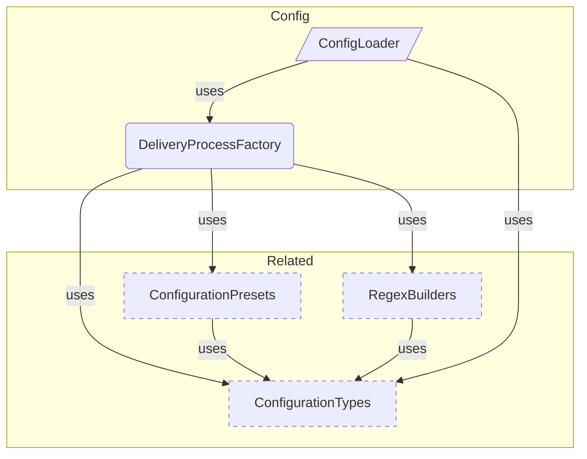

# Configuration Overview

**Purpose:** Configuration product area overview
**Detail Level:** Full reference

---

**How do I configure the tool?** Configuration controls what gets scanned, which tags are recognized, and how output is organized. Three presets define escalating taxonomy complexity — from 3 categories for simple projects to 21 for full DDD/ES/CQRS architectures. The `defineConfig()` function provides type-safe configuration following the Vite convention.

## Key Invariants

- Preset-based taxonomy: `generic` (3 categories, `@docs-`), `libar-generic` (3 categories, `@libar-docs-`), `ddd-es-cqrs` (21 categories, full DDD)
- Stubs merged at resolution time: Stub directory globs are appended to typescript sources, making stubs transparent to the downstream pipeline

---

## Configuration Components

Scoped architecture diagram showing component relationships:



---

## API Types

### CreateDeliveryProcessOptions (interface)

```typescript
/**
 * Options for creating a delivery process instance
 */
```

```typescript
interface CreateDeliveryProcessOptions {
  /** Use a preset configuration */
  preset?: PresetName;
  /** Custom tag prefix (overrides preset) */
  tagPrefix?: string;
  /** Custom file opt-in tag (overrides preset) */
  fileOptInTag?: string;
  /** Custom categories (replaces preset categories entirely) */
  categories?: DeliveryProcessConfig['categories'];
}
```

| Property     | Description                                             |
| ------------ | ------------------------------------------------------- |
| preset       | Use a preset configuration                              |
| tagPrefix    | Custom tag prefix (overrides preset)                    |
| fileOptInTag | Custom file opt-in tag (overrides preset)               |
| categories   | Custom categories (replaces preset categories entirely) |

### ConfigDiscoveryResult (interface)

```typescript
/**
 * Result of config file discovery
 */
```

```typescript
interface ConfigDiscoveryResult {
  /** Whether a config file was found */
  found: boolean;
  /** Absolute path to the config file (if found) */
  path?: string;
  /** The loaded configuration instance */
  instance: DeliveryProcessInstance;
  /** Whether the default configuration was used */
  isDefault: boolean;
}
```

| Property  | Description                                 |
| --------- | ------------------------------------------- |
| found     | Whether a config file was found             |
| path      | Absolute path to the config file (if found) |
| instance  | The loaded configuration instance           |
| isDefault | Whether the default configuration was used  |

### ConfigLoadError (interface)

```typescript
/**
 * Error during config loading
 */
```

```typescript
interface ConfigLoadError {
  /** Discriminant for error type identification */
  type: 'config-load-error';
  /** Absolute path to the config file that failed to load */
  path: string;
  /** Human-readable error description */
  message: string;
  /** The underlying error that caused the failure (if any) */
  cause?: Error | undefined;
}
```

| Property | Description                                           |
| -------- | ----------------------------------------------------- |
| type     | Discriminant for error type identification            |
| path     | Absolute path to the config file that failed to load  |
| message  | Human-readable error description                      |
| cause    | The underlying error that caused the failure (if any) |

### ConfigLoadResult (type)

```typescript
/**
 * Result type for config loading (discriminated union)
 */
```

```typescript
type ConfigLoadResult =
  | {
      /** Indicates successful config resolution */
      ok: true;
      /** The discovery result containing configuration instance */
      value: ConfigDiscoveryResult;
    }
  | {
      /** Indicates config loading failure */
      ok: false;
      /** Error details for the failed load */
      error: ConfigLoadError;
    };
```

### createDeliveryProcess (function)

````typescript
/**
 * Creates a configured delivery process instance.
 *
 * Configuration resolution order:
 * 1. Start with preset (or libar-generic default)
 * 2. Preset categories REPLACE base taxonomy categories (not merged)
 * 3. Apply explicit overrides (tagPrefix, fileOptInTag, categories)
 * 4. Create regex builders from final configuration
 *
 * Note: Presets define complete category sets. The libar-generic preset
 * has 3 categories (core, api, infra), while ddd-es-cqrs has 21.
 * Categories from the preset replace base categories entirely.
 *
 * @param options - Configuration options
 * @returns Configured delivery process instance
 *
 * @example
 * ```typescript
 * // Use generic preset
 * const dp = createDeliveryProcess({ preset: "generic" });
 * ```
 *
 * @example
 * ```typescript
 * // Custom prefix with DDD taxonomy
 * const dp = createDeliveryProcess({
 *   preset: "ddd-es-cqrs",
 *   tagPrefix: "@my-project-",
 *   fileOptInTag: "@my-project"
 * });
 * ```
 *
 * @example
 * ```typescript
 * // Default (libar-generic preset with 3 categories)
 * const dp = createDeliveryProcess();
 * ```
 */
````

```typescript
function createDeliveryProcess(options: CreateDeliveryProcessOptions = {}): DeliveryProcessInstance;
```

| Parameter | Type | Description           |
| --------- | ---- | --------------------- |
| options   |      | Configuration options |

**Returns:** Configured delivery process instance

### findConfigFile (function)

```typescript
/**
 * Find config file by walking up from startDir
 *
 * @param startDir - Directory to start searching from
 * @returns Path to config file or null if not found
 */
```

```typescript
async function findConfigFile(startDir: string): Promise<string | null>;
```

| Parameter | Type | Description                       |
| --------- | ---- | --------------------------------- |
| startDir  |      | Directory to start searching from |

**Returns:** Path to config file or null if not found

### loadConfig (function)

````typescript
/**
 * Load configuration from file or use defaults.
 *
 * Delegates to {@link loadProjectConfig} for file discovery and parsing,
 * then maps the result to the legacy {@link ConfigDiscoveryResult} shape.
 *
 * @param baseDir - Directory to start searching from (usually cwd or project root)
 * @returns Result with loaded configuration or error
 *
 * @example
 * ```typescript
 * // In CLI tool
 * const result = await loadConfig(process.cwd());
 * if (!result.ok) {
 *   console.error(result.error.message);
 *   process.exit(1);
 * }
 *
 * const { instance, isDefault, path } = result.value;
 * if (!isDefault) {
 *   console.log(`Using config from: ${path}`);
 * }
 *
 * // Use instance.registry for scanning/extracting
 * ```
 */
````

```typescript
async function loadConfig(baseDir: string): Promise<ConfigLoadResult>;
```

| Parameter | Type | Description                                                     |
| --------- | ---- | --------------------------------------------------------------- |
| baseDir   |      | Directory to start searching from (usually cwd or project root) |

**Returns:** Result with loaded configuration or error

### formatConfigError (function)

```typescript
/**
 * Format config load error for console display
 *
 * @param error - Config load error
 * @returns Formatted error message
 */
```

```typescript
function formatConfigError(error: ConfigLoadError): string;
```

| Parameter | Type | Description       |
| --------- | ---- | ----------------- |
| error     |      | Config load error |

**Returns:** Formatted error message

---

## Behavior Specifications

### SourceMerging

[View SourceMerging source](tests/features/config/source-merging.feature)

mergeSourcesForGenerator computes effective sources for a specific
generator by applying per-generator overrides to base resolved sources.

**Problem:**

- Different generators may need different feature or input sources
- Override semantics must be predictable and well-defined
- Base exclude patterns must always be inherited

**Solution:**

- replaceFeatures (non-empty) replaces base features entirely
- additionalFeatures appends to base features
- additionalInput appends to base typescript sources
- exclude is always inherited from base (no override mechanism)

<details>
<summary>No override returns base unchanged (1 scenarios)</summary>

#### No override returns base unchanged

**Verified by:**

- No override returns base sources

</details>

<details>
<summary>Feature overrides control feature source selection (3 scenarios)</summary>

#### Feature overrides control feature source selection

**Verified by:**

- additionalFeatures appended to base features
- replaceFeatures replaces base features entirely
- Empty replaceFeatures does NOT replace

</details>

<details>
<summary>TypeScript source overrides append additional input (1 scenarios)</summary>

#### TypeScript source overrides append additional input

**Verified by:**

- additionalInput appended to typescript sources

</details>

<details>
<summary>Combined overrides apply together (1 scenarios)</summary>

#### Combined overrides apply together

**Verified by:**

- additionalFeatures and additionalInput combined

</details>

<details>
<summary>Exclude is always inherited from base (1 scenarios)</summary>

#### Exclude is always inherited from base

**Verified by:**

- Exclude always inherited

</details>

### ProjectConfigLoader

[View ProjectConfigLoader source](tests/features/config/project-config-loader.feature)

loadProjectConfig loads and resolves configuration from file,
supporting both new-style defineConfig and legacy createDeliveryProcess formats.

**Problem:**

- Two config formats exist (new-style and legacy) that need unified loading
- Invalid configs must produce actionable error messages
- Missing config files should gracefully fall back to defaults

**Solution:**

- loadProjectConfig returns ResolvedConfig for both formats
- Zod validation errors are formatted with field paths
- No config file returns default resolved config with isDefault=true

<details>
<summary>Missing config returns defaults (1 scenarios)</summary>

#### Missing config returns defaults

**Verified by:**

- No config file returns default resolved config

</details>

<details>
<summary>New-style config is loaded and resolved (1 scenarios)</summary>

#### New-style config is loaded and resolved

**Verified by:**

- defineConfig export loads and resolves correctly

</details>

<details>
<summary>Legacy config is loaded with backward compatibility (1 scenarios)</summary>

#### Legacy config is loaded with backward compatibility

**Verified by:**

- Legacy createDeliveryProcess export loads correctly

</details>

<details>
<summary>Invalid configs produce clear errors (2 scenarios)</summary>

#### Invalid configs produce clear errors

**Verified by:**

- Config without default export returns error
- Config with invalid project config returns Zod error

</details>

### PresetSystem

[View PresetSystem source](tests/features/config/preset-system.feature)

Presets provide pre-configured taxonomies for different project types.

**Problem:**

- New users need sensible defaults for their project type
- DDD projects need full taxonomy
- Simple projects need minimal configuration

**Solution:**

- GENERIC_PRESET for non-DDD projects
- DDD_ES_CQRS_PRESET for full DDD/ES/CQRS taxonomy
- PRESETS lookup map for programmatic access

<details>
<summary>Generic preset provides minimal taxonomy (2 scenarios)</summary>

#### Generic preset provides minimal taxonomy

**Invariant:** The generic preset must provide exactly 3 categories (core, api, infra) with @docs- prefix.

**Rationale:** Simple projects need minimal configuration without DDD-specific categories cluttering the taxonomy.

**Verified by:**

- Generic preset has correct prefix configuration
- Generic preset has core categories only

</details>

<details>
<summary>Libar generic preset provides minimal taxonomy with libar prefix (2 scenarios)</summary>

#### Libar generic preset provides minimal taxonomy with libar prefix

**Invariant:** The libar-generic preset must provide exactly 3 categories with @libar-docs- prefix.

**Rationale:** This package uses @libar-docs- prefix to avoid collisions with consumer projects' annotations.

**Verified by:**

- Libar generic preset has correct prefix configuration
- Libar generic preset has core categories only

</details>

<details>
<summary>DDD-ES-CQRS preset provides full taxonomy (4 scenarios)</summary>

#### DDD-ES-CQRS preset provides full taxonomy

**Invariant:** The DDD preset must provide all 21 categories spanning DDD, ES, CQRS, and infrastructure domains.

**Rationale:** DDD architectures require fine-grained categorization to distinguish bounded contexts, aggregates, and projections.

**Verified by:**

- Full preset has correct prefix configuration
- Full preset has all DDD categories
- Full preset has infrastructure categories
- Full preset has all 21 categories

</details>

<details>
<summary>Presets can be accessed by name (3 scenarios)</summary>

#### Presets can be accessed by name

**Invariant:** All preset instances must be accessible via the PRESETS map using their canonical string key.

**Rationale:** Programmatic access enables config files to reference presets by name instead of importing instances.

**Verified by:**

- Generic preset accessible via PRESETS map
- DDD preset accessible via PRESETS map
- Libar generic preset accessible via PRESETS map

</details>

### DefineConfigTesting

[View DefineConfigTesting source](tests/features/config/define-config.feature)

The defineConfig identity function and DeliveryProcessProjectConfigSchema
provide type-safe configuration authoring with runtime validation.

**Problem:**

- Users need type-safe config authoring without runtime overhead
- Invalid configs must be caught at load time, not at usage time
- New-style vs legacy config must be distinguishable programmatically

**Solution:**

- defineConfig() is a zero-cost identity function for TypeScript autocompletion
- Zod schema validates at load time with precise error messages
- isProjectConfig() and isLegacyInstance() type guards disambiguate config formats

<details>
<summary>defineConfig is an identity function (1 scenarios)</summary>

#### defineConfig is an identity function

**Verified by:**

- defineConfig returns input unchanged

</details>

<details>
<summary>Schema validates correct configurations (2 scenarios)</summary>

#### Schema validates correct configurations

**Verified by:**

- Valid minimal config passes validation
- Valid full config passes validation

</details>

<details>
<summary>Schema rejects invalid configurations (5 scenarios)</summary>

#### Schema rejects invalid configurations

**Verified by:**

- Empty glob pattern rejected
- Parent directory traversal rejected in globs
- replaceFeatures and additionalFeatures mutually exclusive
- Invalid preset name rejected
- Unknown fields rejected in strict mode

</details>

<details>
<summary>Type guards distinguish config formats (4 scenarios)</summary>

#### Type guards distinguish config formats

**Verified by:**

- isProjectConfig returns true for new-style config
- isProjectConfig returns false for legacy instance
- isLegacyInstance returns true for legacy objects
- isLegacyInstance returns false for new-style config

</details>

### ConfigurationAPI

[View ConfigurationAPI source](tests/features/config/configuration-api.feature)

The createDeliveryProcess factory provides a type-safe way to configure
the delivery process with custom tag prefixes and presets.

**Problem:**

- Different projects need different tag prefixes
- Default taxonomy may not fit all use cases
- Configuration should be type-safe and validated

**Solution:**

- createDeliveryProcess() factory with preset support
- Custom tagPrefix and fileOptInTag overrides
- Type-safe configuration with generics

<details>
<summary>Factory creates configured instances with correct defaults (4 scenarios)</summary>

#### Factory creates configured instances with correct defaults

**Verified by:**

- Create with no arguments uses libar-generic preset
- Create with generic preset
- Create with libar-generic preset
- Create with ddd-es-cqrs preset explicitly

</details>

<details>
<summary>Custom prefix configuration works correctly (3 scenarios)</summary>

#### Custom prefix configuration works correctly

**Verified by:**

- Custom tag prefix overrides preset
- Custom file opt-in tag overrides preset
- Both prefix and opt-in tag can be customized together

</details>

<details>
<summary>Preset categories replace base categories entirely (2 scenarios)</summary>

#### Preset categories replace base categories entirely

**Verified by:**

- Generic preset excludes DDD categories
- Libar-generic preset excludes DDD categories

</details>

<details>
<summary>Regex builders use configured prefix (6 scenarios)</summary>

#### Regex builders use configured prefix

**Verified by:**

- hasFileOptIn detects configured opt-in tag
- hasFileOptIn rejects wrong opt-in tag
- hasDocDirectives detects configured prefix
- hasDocDirectives rejects wrong prefix
- normalizeTag removes configured prefix
- normalizeTag handles tag without prefix

</details>

### ConfigResolution

[View ConfigResolution source](tests/features/config/config-resolution.feature)

resolveProjectConfig transforms a raw DeliveryProcessProjectConfig into
a fully resolved ResolvedConfig with all defaults applied.

**Problem:**

- Raw user config is partial with many optional fields
- Stubs need to be merged into typescript sources transparently
- Defaults must be applied consistently across all consumers

**Solution:**

- resolveProjectConfig applies defaults in a predictable order
- createDefaultResolvedConfig provides a complete fallback
- Stubs are merged into typescript sources at resolution time

<details>
<summary>Default config provides sensible fallbacks (1 scenarios)</summary>

#### Default config provides sensible fallbacks

**Invariant:** A config created without user input must have isDefault=true and empty source collections.

**Rationale:** Downstream consumers need a safe starting point when no config file exists.

**Verified by:**

- Default config has empty sources and isDefault flag

</details>

<details>
<summary>Preset creates correct taxonomy instance (1 scenarios)</summary>

#### Preset creates correct taxonomy instance

**Invariant:** Each preset must produce a taxonomy with the correct number of categories and tag prefix.

**Rationale:** Presets are the primary user-facing configuration — wrong category counts break downstream scanning.

**Verified by:**

- libar-generic preset creates 3 categories

</details>

<details>
<summary>Stubs are merged into typescript sources (1 scenarios)</summary>

#### Stubs are merged into typescript sources

**Invariant:** Stub glob patterns must appear in resolved typescript sources alongside original globs.

**Rationale:** Stubs extend the scanner's source set without requiring users to manually list them.

**Verified by:**

- Stubs appended to typescript sources

</details>

<details>
<summary>Output defaults are applied (2 scenarios)</summary>

#### Output defaults are applied

**Invariant:** Missing output configuration must resolve to "docs/architecture" with overwrite=false.

**Rationale:** Consistent defaults prevent accidental overwrites and establish a predictable output location.

**Verified by:**

- Default output directory and overwrite
- Explicit output overrides defaults

</details>

<details>
<summary>Generator defaults are applied (1 scenarios)</summary>

#### Generator defaults are applied

**Invariant:** A config with no generators specified must default to the "patterns" generator.

**Rationale:** Patterns is the most commonly needed output — defaulting to it reduces boilerplate.

**Verified by:**

- Generators default to patterns

</details>

<details>
<summary>Context inference rules are prepended (1 scenarios)</summary>

#### Context inference rules are prepended

**Invariant:** User-defined inference rules must appear before built-in defaults in the resolved array.

**Rationale:** Prepending gives user rules priority during context matching without losing defaults.

**Verified by:**

- User rules prepended to defaults

</details>

<details>
<summary>Config path is carried from options (1 scenarios)</summary>

#### Config path is carried from options

**Invariant:** The configPath from resolution options must be preserved unchanged in resolved config.

**Rationale:** Downstream tools need the original config file location for error reporting and relative path resolution.

**Verified by:**

- configPath carried from resolution options

</details>

### ConfigLoaderTesting

[View ConfigLoaderTesting source](tests/features/config/config-loader.feature)

The config loader discovers and loads `delivery-process.config.ts` files
for hierarchical configuration, enabling package-level and repo-level
taxonomy customization.

**Problem:**

- Different directories need different taxonomies
- Package-level config should override repo-level
- CLI tools need automatic config discovery

**Solution:**

- Walk up directories looking for `delivery-process.config.ts`
- Stop at repo root (.git marker)
- Fall back to libar-generic preset (3 categories) if no config found

<details>
<summary>Config files are discovered by walking up directories (4 scenarios)</summary>

#### Config files are discovered by walking up directories

**Verified by:**

- Find config file in current directory
- Find config file in parent directory
- Prefer TypeScript config over JavaScript
- Return null when no config file exists

</details>

<details>
<summary>Config discovery stops at repo root (1 scenarios)</summary>

#### Config discovery stops at repo root

**Verified by:**

- Stop at .git directory marker

</details>

<details>
<summary>Config is loaded and validated (4 scenarios)</summary>

#### Config is loaded and validated

**Verified by:**

- Load valid config with default fallback
- Load valid config file
- Error on config without default export
- Error on config with wrong type

</details>

<details>
<summary>Config errors are formatted for display (1 scenarios)</summary>

#### Config errors are formatted for display

**Verified by:**

- Format error with path and message

</details>

---
