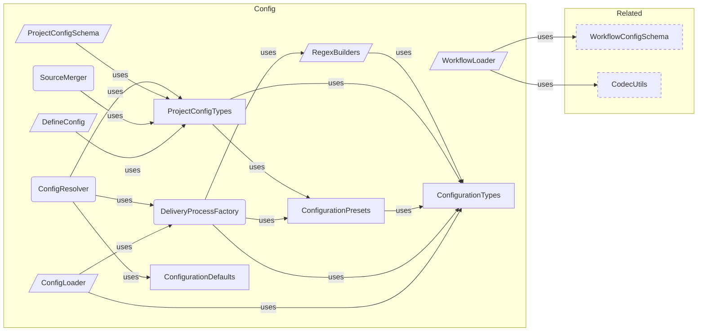

# Configuration Overview

**Purpose:** Configuration product area overview
**Detail Level:** Full reference

---

**How do I configure the tool?** Configuration is the entry boundary — it transforms a user-authored `delivery-process.config.ts` file into a fully resolved `DeliveryProcessInstance` that powers the entire pipeline. The flow is: `defineConfig()` provides type-safe authoring (Vite convention, zero validation), `ConfigLoader` discovers and loads the file, `ProjectConfigSchema` validates via Zod, `ConfigResolver` applies defaults and merges stubs into sources, and `DeliveryProcessFactory` builds the final instance with `TagRegistry` and `RegexBuilders`. Three presets define escalating taxonomy complexity — from 3 categories (`generic`, `libar-generic`) to 21 (`ddd-es-cqrs`). `SourceMerger` computes per-generator source overrides, enabling generators like changelog to pull from different feature sets than the base config.

## Key Invariants

- Preset-based taxonomy: `generic` (3 categories, `@docs-`), `libar-generic` (3 categories, `@libar-docs-`), `ddd-es-cqrs` (21 categories, full DDD). Presets replace base categories entirely — they define prefix, categories, and metadata tags as a unit
- Resolution pipeline: defineConfig() → ConfigLoader → ProjectConfigSchema (Zod) → ConfigResolver → DeliveryProcessFactory → DeliveryProcessInstance. Each stage has a single responsibility
- Stubs merged at resolution time: Stub directory globs are appended to typescript sources, making stubs transparent to the downstream pipeline
- Source override composition: SourceMerger applies per-generator overrides (`replaceFeatures`, `additionalFeatures`, `additionalInput`) to base sources. Exclude is always inherited from base

---

## Configuration Loading Boundary

Scoped architecture diagram showing component relationships:


---

## Configuration Resolution Pipeline

Scoped architecture diagram showing component relationships:



---

## API Types

### DeliveryProcessConfig (interface)

```typescript
/**
 * Configuration for creating a delivery process instance.
 * Uses generics to preserve literal types from presets.
 */
```

````typescript
interface DeliveryProcessConfig {
  /** Tag prefix for directives (e.g., "@docs-" or "@libar-docs-") */
  readonly tagPrefix: string;
  /** File-level opt-in tag (e.g., "@docs" or "@libar-docs") */
  readonly fileOptInTag: string;
  /** Category definitions for pattern classification */
  readonly categories: readonly CategoryDefinition[];
  /** Optional metadata tag definitions */
  readonly metadataTags?: readonly MetadataTagDefinitionForRegistry[];
  /**
   * Optional context inference rules for auto-inferring bounded context from file paths.
   *
   * When provided, these rules are merged with the default rules. User-provided rules
   * take precedence over defaults (applied first in the rule list).
   *
   * @example
   * ```typescript
   * contextInferenceRules: [
   *   { pattern: 'packages/orders/**', context: 'orders' },
   *   { pattern: 'packages/inventory/**', context: 'inventory' },
   * ]
   * ```
   */
  readonly contextInferenceRules?: readonly ContextInferenceRule[];
}
````

| Property              | Description                                                                                                                                                                                                                                                                                                                                                                                       |
| --------------------- | ------------------------------------------------------------------------------------------------------------------------------------------------------------------------------------------------------------------------------------------------------------------------------------------------------------------------------------------------------------------------------------------------- |
| tagPrefix             | Tag prefix for directives (e.g., "@docs-" or "@libar-docs-")                                                                                                                                                                                                                                                                                                                                      |
| fileOptInTag          | File-level opt-in tag (e.g., "@docs" or "@libar-docs")                                                                                                                                                                                                                                                                                                                                            |
| categories            | Category definitions for pattern classification                                                                                                                                                                                                                                                                                                                                                   |
| metadataTags          | Optional metadata tag definitions                                                                                                                                                                                                                                                                                                                                                                 |
| contextInferenceRules | Optional context inference rules for auto-inferring bounded context from file paths. When provided, these rules are merged with the default rules. User-provided rules take precedence over defaults (applied first in the rule list). `typescript contextInferenceRules: [ { pattern: 'packages/orders/**', context: 'orders' }, { pattern: 'packages/inventory/**', context: 'inventory' }, ] ` |

### DeliveryProcessInstance (interface)

```typescript
/**
 * Instance returned by createDeliveryProcess with configured registry
 */
```

```typescript
interface DeliveryProcessInstance {
  /** The fully configured tag registry */
  readonly registry: TagRegistry;
  /** Regex builders for tag detection */
  readonly regexBuilders: RegexBuilders;
}
```

| Property      | Description                       |
| ------------- | --------------------------------- |
| registry      | The fully configured tag registry |
| regexBuilders | Regex builders for tag detection  |

### RegexBuilders (interface)

```typescript
/**
 * Regex builders for tag detection
 *
 * Provides type-safe regex operations for detecting and normalizing tags
 * based on the configured tag prefix.
 */
```

```typescript
interface RegexBuilders {
  /** Pattern to match file-level opt-in (e.g., /** @docs *\/) */
  readonly fileOptInPattern: RegExp;
  /** Pattern to match directives (e.g., @docs-pattern, @docs-status) */
  readonly directivePattern: RegExp;
  /** Check if content has the file-level opt-in marker */
  hasFileOptIn(content: string): boolean;
  /** Check if content has any doc directives */
  hasDocDirectives(content: string): boolean;
  /** Normalize a tag by removing @ and prefix (e.g., "@docs-pattern" -> "pattern") */
  normalizeTag(tag: string): string;
}
```

| Property         | Description                                                     |
| ---------------- | --------------------------------------------------------------- |
| fileOptInPattern | Pattern to match file-level opt-in (e.g., /\*_ @docs _\/)       |
| directivePattern | Pattern to match directives (e.g., @docs-pattern, @docs-status) |

### DeliveryProcessProjectConfig (interface)

````typescript
/**
 * Unified project configuration for delivery-process.
 *
 * This is the shape users provide in `delivery-process.config.ts`.
 * `defineConfig()` is an identity function providing type safety.
 *
 * @example
 * ```typescript
 * import { defineConfig } from '@libar-dev/delivery-process/config';
 *
 * export default defineConfig({
 *   preset: 'ddd-es-cqrs',
 *   sources: {
 *     typescript: ['packages/* /src/** /*.ts'],
 *     features: ['delivery-process/specs/** /*.feature'],
 *     stubs: ['delivery-process/stubs/** /*.ts'],
 *   },
 *   output: { directory: 'docs-living', overwrite: true },
 * });
 * ```
 */
````

```typescript
interface DeliveryProcessProjectConfig {
  // --- Taxonomy ---

  /** Use a preset taxonomy configuration */
  readonly preset?: PresetName;

  /** Custom tag prefix (overrides preset, e.g., '@docs-') */
  readonly tagPrefix?: string;

  /** Custom file opt-in tag (overrides preset, e.g., '@docs') */
  readonly fileOptInTag?: string;

  /** Custom categories (replaces preset categories entirely) */
  readonly categories?: DeliveryProcessConfig['categories'];

  // --- Sources ---

  /** Source file glob configuration */
  readonly sources?: SourcesConfig;

  // --- Output ---

  /** Output configuration for generated docs */
  readonly output?: OutputConfig;

  // --- Generators ---

  /** Default generator names to run when CLI doesn't specify --generators */
  readonly generators?: readonly string[];

  /** Per-generator source and output overrides */
  readonly generatorOverrides?: Readonly<Record<string, GeneratorSourceOverride>>;

  // --- Advanced ---

  /** Rules for auto-inferring bounded context from file paths */
  readonly contextInferenceRules?: readonly ContextInferenceRule[];

  /** Path to custom workflow config JSON (relative to config file) */
  readonly workflowPath?: string;

  // --- Codec Options ---

  /**
   * Per-codec options for fine-tuning document generation.
   * Keys match codec names (e.g., 'business-rules', 'patterns').
   * Passed through to codec factories at generation time.
   */
  readonly codecOptions?: CodecOptions;

  // --- Reference Documents ---

  /**
   * Reference document configurations for convention-based doc generation.
   * Each config defines one reference document's content composition via
   * convention tags, shape sources, behavior categories, and diagram scopes.
   *
   * When not specified, no reference generators are registered.
   * Import `LIBAR_REFERENCE_CONFIGS` from the generators module
   * to use the built-in set.
   */
  readonly referenceDocConfigs?: readonly ReferenceDocConfig[];
}
```

| Property              | Description                                                                                                                                                                                                                                                                                                                                                           |
| --------------------- | --------------------------------------------------------------------------------------------------------------------------------------------------------------------------------------------------------------------------------------------------------------------------------------------------------------------------------------------------------------------- |
| preset                | Use a preset taxonomy configuration                                                                                                                                                                                                                                                                                                                                   |
| tagPrefix             | Custom tag prefix (overrides preset, e.g., '@docs-')                                                                                                                                                                                                                                                                                                                  |
| fileOptInTag          | Custom file opt-in tag (overrides preset, e.g., '@docs')                                                                                                                                                                                                                                                                                                              |
| categories            | Custom categories (replaces preset categories entirely)                                                                                                                                                                                                                                                                                                               |
| sources               | Source file glob configuration                                                                                                                                                                                                                                                                                                                                        |
| output                | Output configuration for generated docs                                                                                                                                                                                                                                                                                                                               |
| generators            | Default generator names to run when CLI doesn't specify --generators                                                                                                                                                                                                                                                                                                  |
| generatorOverrides    | Per-generator source and output overrides                                                                                                                                                                                                                                                                                                                             |
| contextInferenceRules | Rules for auto-inferring bounded context from file paths                                                                                                                                                                                                                                                                                                              |
| workflowPath          | Path to custom workflow config JSON (relative to config file)                                                                                                                                                                                                                                                                                                         |
| codecOptions          | Per-codec options for fine-tuning document generation. Keys match codec names (e.g., 'business-rules', 'patterns'). Passed through to codec factories at generation time.                                                                                                                                                                                             |
| referenceDocConfigs   | Reference document configurations for convention-based doc generation. Each config defines one reference document's content composition via convention tags, shape sources, behavior categories, and diagram scopes. When not specified, no reference generators are registered. Import `LIBAR_REFERENCE_CONFIGS` from the generators module to use the built-in set. |

### SourcesConfig (interface)

```typescript
/**
 * Source glob configuration for the project.
 * Centralizes what previously lived in CLI --input/--features flags.
 */
```

```typescript
interface SourcesConfig {
  /** Glob patterns for TypeScript source files (replaces --input) */
  readonly typescript: readonly string[];

  /**
   * Glob patterns for Gherkin feature files (replaces --features).
   * Includes both `.feature` and `.feature.md` files.
   */
  readonly features?: readonly string[];

  /**
   * Glob patterns for design stub files.
   * Stubs are TypeScript files that live outside `src/` (e.g., `delivery-process/stubs/`).
   * Merged into TypeScript sources at resolution time.
   */
  readonly stubs?: readonly string[];

  /** Glob patterns to exclude from all scanning */
  readonly exclude?: readonly string[];
}
```

| Property   | Description                                                                                                                                                                    |
| ---------- | ------------------------------------------------------------------------------------------------------------------------------------------------------------------------------ |
| typescript | Glob patterns for TypeScript source files (replaces --input)                                                                                                                   |
| features   | Glob patterns for Gherkin feature files (replaces --features). Includes both `.feature` and `.feature.md` files.                                                               |
| stubs      | Glob patterns for design stub files. Stubs are TypeScript files that live outside `src/` (e.g., `delivery-process/stubs/`). Merged into TypeScript sources at resolution time. |
| exclude    | Glob patterns to exclude from all scanning                                                                                                                                     |

### OutputConfig (interface)

```typescript
/**
 * Output configuration for generated documentation.
 */
```

```typescript
interface OutputConfig {
  /** Output directory for generated docs (default: 'docs/architecture') */
  readonly directory?: string;
  /** Overwrite existing files (default: false) */
  readonly overwrite?: boolean;
}
```

| Property  | Description                                                        |
| --------- | ------------------------------------------------------------------ |
| directory | Output directory for generated docs (default: 'docs/architecture') |
| overwrite | Overwrite existing files (default: false)                          |

### GeneratorSourceOverride (interface)

```typescript
/**
 * Generator-specific source overrides.
 *
 * Some generators need different sources than the base config.
 * For example, `changelog` needs `decisions/*.feature` and `releases/*.feature`
 * in addition to the base feature set.
 *
 * ### Override Semantics
 *
 * - `additionalFeatures` / `additionalInput`: Appended to base sources
 * - `replaceFeatures`: Used INSTEAD of base features (for generators needing a different set)
 * - `outputDirectory`: Override the base output directory for this generator
 *
 * ### Mutual Exclusivity
 *
 * `replaceFeatures` and `additionalFeatures` are mutually exclusive when both are
 * non-empty. This constraint is enforced at runtime by the Zod `.refine()` in
 * {@link GeneratorSourceOverrideSchema} (in `project-config-schema.ts`).
 *
 * The TypeScript type intentionally permits both fields to coexist because
 * `mergeSourcesForGenerator()` treats an empty `replaceFeatures: []` as "no replace",
 * falling through to `additionalFeatures`. Encoding this length-dependent semantics
 * via `never` would reject valid runtime states.
 */
```

```typescript
interface GeneratorSourceOverride {
  /** Additional feature file globs appended to base features */
  readonly additionalFeatures?: readonly string[];
  /** Additional TypeScript globs appended to base TypeScript sources */
  readonly additionalInput?: readonly string[];
  /**
   * Feature globs used INSTEAD of base features.
   * Mutually exclusive with non-empty `additionalFeatures`.
   * @see GeneratorSourceOverrideSchema for runtime validation
   */
  readonly replaceFeatures?: readonly string[];
  /** Override output directory for this generator */
  readonly outputDirectory?: string;
}
```

| Property           | Description                                                                                          |
| ------------------ | ---------------------------------------------------------------------------------------------------- |
| additionalFeatures | Additional feature file globs appended to base features                                              |
| additionalInput    | Additional TypeScript globs appended to base TypeScript sources                                      |
| replaceFeatures    | Feature globs used INSTEAD of base features. Mutually exclusive with non-empty `additionalFeatures`. |
| outputDirectory    | Override output directory for this generator                                                         |

### ResolvedProjectConfig (interface)

```typescript
/**
 * Fully resolved project configuration with all defaults applied.
 */
```

```typescript
interface ResolvedProjectConfig {
  /** Resolved source globs (stubs merged, defaults applied) */
  readonly sources: ResolvedSourcesConfig;
  /** Resolved output config with all defaults */
  readonly output: Readonly<Required<OutputConfig>>;
  /** Default generator names */
  readonly generators: readonly string[];
  /** Per-generator source overrides */
  readonly generatorOverrides: Readonly<Record<string, GeneratorSourceOverride>>;
  /** Context inference rules (user rules prepended to defaults) */
  readonly contextInferenceRules: readonly ContextInferenceRule[];
  /** Workflow config path (null if not specified) */
  readonly workflowPath: string | null;
  /** Per-codec options for document generation (empty if none) */
  readonly codecOptions?: CodecOptions;
  /** Reference document configurations (empty array if none) */
  readonly referenceDocConfigs: readonly ReferenceDocConfig[];
}
```

| Property              | Description                                                |
| --------------------- | ---------------------------------------------------------- |
| sources               | Resolved source globs (stubs merged, defaults applied)     |
| output                | Resolved output config with all defaults                   |
| generators            | Default generator names                                    |
| generatorOverrides    | Per-generator source overrides                             |
| contextInferenceRules | Context inference rules (user rules prepended to defaults) |
| workflowPath          | Workflow config path (null if not specified)               |
| codecOptions          | Per-codec options for document generation (empty if none)  |
| referenceDocConfigs   | Reference document configurations (empty array if none)    |

### ResolvedSourcesConfig (interface)

```typescript
/**
 * Resolved sources config where all optional fields have been applied with defaults.
 */
```

```typescript
interface ResolvedSourcesConfig {
  /** TypeScript source globs (includes merged stubs) */
  readonly typescript: readonly string[];
  /** Gherkin feature file globs */
  readonly features: readonly string[];
  /** Glob patterns to exclude from scanning */
  readonly exclude: readonly string[];
}
```

| Property   | Description                                     |
| ---------- | ----------------------------------------------- |
| typescript | TypeScript source globs (includes merged stubs) |
| features   | Gherkin feature file globs                      |
| exclude    | Glob patterns to exclude from scanning          |

### CreateDeliveryProcessOptions (interface)

```typescript
/**
 * Options for creating a delivery process instance
 */
```

```typescript
interface CreateDeliveryProcessOptions {
  /** Use a preset configuration */
  preset?: PresetName;
  /** Custom tag prefix (overrides preset) */
  tagPrefix?: string;
  /** Custom file opt-in tag (overrides preset) */
  fileOptInTag?: string;
  /** Custom categories (replaces preset categories entirely) */
  categories?: DeliveryProcessConfig['categories'];
}
```

| Property     | Description                                             |
| ------------ | ------------------------------------------------------- |
| preset       | Use a preset configuration                              |
| tagPrefix    | Custom tag prefix (overrides preset)                    |
| fileOptInTag | Custom file opt-in tag (overrides preset)               |
| categories   | Custom categories (replaces preset categories entirely) |

### ConfigDiscoveryResult (interface)

```typescript
/**
 * Result of config file discovery
 */
```

```typescript
interface ConfigDiscoveryResult {
  /** Whether a config file was found */
  found: boolean;
  /** Absolute path to the config file (if found) */
  path?: string;
  /** The loaded configuration instance */
  instance: DeliveryProcessInstance;
  /** Whether the default configuration was used */
  isDefault: boolean;
}
```

| Property  | Description                                 |
| --------- | ------------------------------------------- |
| found     | Whether a config file was found             |
| path      | Absolute path to the config file (if found) |
| instance  | The loaded configuration instance           |
| isDefault | Whether the default configuration was used  |

### ConfigLoadError (interface)

```typescript
/**
 * Error during config loading
 */
```

```typescript
interface ConfigLoadError {
  /** Discriminant for error type identification */
  type: 'config-load-error';
  /** Absolute path to the config file that failed to load */
  path: string;
  /** Human-readable error description */
  message: string;
  /** The underlying error that caused the failure (if any) */
  cause?: Error | undefined;
}
```

| Property | Description                                           |
| -------- | ----------------------------------------------------- |
| type     | Discriminant for error type identification            |
| path     | Absolute path to the config file that failed to load  |
| message  | Human-readable error description                      |
| cause    | The underlying error that caused the failure (if any) |

### ResolvedConfig (type)

```typescript
/**
 * Fully resolved configuration combining the taxonomy instance
 * and the project-level config.
 *
 * This is the primary type consumed by the orchestrator and CLIs.
 *
 * Discriminated union on `isDefault`:
 * - `isDefault: true` means no config file was found; `configPath` is `undefined`.
 * - `isDefault: false` means a config file was loaded; `configPath` is a `string`.
 */
```

```typescript
type ResolvedConfig =
  | {
      /** The taxonomy instance (registry + regexBuilders) */
      readonly instance: DeliveryProcessInstance;
      /** The resolved project config with defaults applied */
      readonly project: ResolvedProjectConfig;
      /** Config was generated from defaults (no config file found) */
      readonly isDefault: true;
      /** No config file path when using defaults */
      readonly configPath?: undefined;
    }
  | {
      /** The taxonomy instance (registry + regexBuilders) */
      readonly instance: DeliveryProcessInstance;
      /** The resolved project config with defaults applied */
      readonly project: ResolvedProjectConfig;
      /** Config was loaded from a file */
      readonly isDefault: false;
      /** Path to the config file that was loaded */
      readonly configPath: string;
    };
```

### PresetName (type)

```typescript
/**
 * Available preset names
 */
```

```typescript
type PresetName = 'generic' | 'libar-generic' | 'ddd-es-cqrs';
```

### ConfigLoadResult (type)

```typescript
/**
 * Result type for config loading (discriminated union)
 */
```

```typescript
type ConfigLoadResult =
  | {
      /** Indicates successful config resolution */
      ok: true;
      /** The discovery result containing configuration instance */
      value: ConfigDiscoveryResult;
    }
  | {
      /** Indicates config loading failure */
      ok: false;
      /** Error details for the failed load */
      error: ConfigLoadError;
    };
```

### createRegexBuilders (function)

````typescript
/**
 * Creates type-safe regex builders for a given tag prefix configuration.
 * These are used throughout the scanner and validation pipeline.
 *
 * @param tagPrefix - The tag prefix (e.g., "@docs-" or "@libar-docs-")
 * @param fileOptInTag - The file opt-in tag (e.g., "@docs" or "@libar-docs")
 * @returns RegexBuilders instance with pattern matching methods
 *
 * @example
 * ```typescript
 * const builders = createRegexBuilders("@docs-", "@docs");
 *
 * // Check for file opt-in
 * if (builders.hasFileOptIn(sourceCode)) {
 *   console.log("File has @docs marker");
 * }
 *
 * // Normalize a tag
 * const normalized = builders.normalizeTag("@docs-pattern");
 * // Returns: "pattern"
 * ```
 */
````

```typescript
function createRegexBuilders(tagPrefix: string, fileOptInTag: string): RegexBuilders;
```

| Parameter    | Type | Description                                          |
| ------------ | ---- | ---------------------------------------------------- |
| tagPrefix    |      | The tag prefix (e.g., "@docs-" or "@libar-docs-")    |
| fileOptInTag |      | The file opt-in tag (e.g., "@docs" or "@libar-docs") |

**Returns:** RegexBuilders instance with pattern matching methods

### createDeliveryProcess (function)

````typescript
/**
 * Creates a configured delivery process instance.
 *
 * Configuration resolution order:
 * 1. Start with preset (or libar-generic default)
 * 2. Preset categories REPLACE base taxonomy categories (not merged)
 * 3. Apply explicit overrides (tagPrefix, fileOptInTag, categories)
 * 4. Create regex builders from final configuration
 *
 * Note: Presets define complete category sets. The libar-generic preset
 * has 3 categories (core, api, infra), while ddd-es-cqrs has 21.
 * Categories from the preset replace base categories entirely.
 *
 * @param options - Configuration options
 * @returns Configured delivery process instance
 *
 * @example
 * ```typescript
 * // Use generic preset
 * const dp = createDeliveryProcess({ preset: "generic" });
 * ```
 *
 * @example
 * ```typescript
 * // Custom prefix with DDD taxonomy
 * const dp = createDeliveryProcess({
 *   preset: "ddd-es-cqrs",
 *   tagPrefix: "@my-project-",
 *   fileOptInTag: "@my-project"
 * });
 * ```
 *
 * @example
 * ```typescript
 * // Default (libar-generic preset with 3 categories)
 * const dp = createDeliveryProcess();
 * ```
 */
````

```typescript
function createDeliveryProcess(options: CreateDeliveryProcessOptions = {}): DeliveryProcessInstance;
```

| Parameter | Type | Description           |
| --------- | ---- | --------------------- |
| options   |      | Configuration options |

**Returns:** Configured delivery process instance

### findConfigFile (function)

```typescript
/**
 * Find config file by walking up from startDir
 *
 * @param startDir - Directory to start searching from
 * @returns Path to config file or null if not found
 */
```

```typescript
async function findConfigFile(startDir: string): Promise<string | null>;
```

| Parameter | Type | Description                       |
| --------- | ---- | --------------------------------- |
| startDir  |      | Directory to start searching from |

**Returns:** Path to config file or null if not found

### loadConfig (function)

````typescript
/**
 * Load configuration from file or use defaults.
 *
 * Delegates to {@link loadProjectConfig} for file discovery and parsing,
 * then maps the result to the legacy {@link ConfigDiscoveryResult} shape.
 *
 * @param baseDir - Directory to start searching from (usually cwd or project root)
 * @returns Result with loaded configuration or error
 *
 * @example
 * ```typescript
 * // In CLI tool
 * const result = await loadConfig(process.cwd());
 * if (!result.ok) {
 *   console.error(result.error.message);
 *   process.exit(1);
 * }
 *
 * const { instance, isDefault, path } = result.value;
 * if (!isDefault) {
 *   console.log(`Using config from: ${path}`);
 * }
 *
 * // Use instance.registry for scanning/extracting
 * ```
 */
````

```typescript
async function loadConfig(baseDir: string): Promise<ConfigLoadResult>;
```

| Parameter | Type | Description                                                     |
| --------- | ---- | --------------------------------------------------------------- |
| baseDir   |      | Directory to start searching from (usually cwd or project root) |

**Returns:** Result with loaded configuration or error

### formatConfigError (function)

```typescript
/**
 * Format config load error for console display
 *
 * @param error - Config load error
 * @returns Formatted error message
 */
```

```typescript
function formatConfigError(error: ConfigLoadError): string;
```

| Parameter | Type | Description       |
| --------- | ---- | ----------------- |
| error     |      | Config load error |

**Returns:** Formatted error message

### GENERIC_PRESET (const)

````typescript
/**
 * Generic preset for non-DDD projects.
 *
 * Minimal categories with @docs- prefix. Suitable for:
 * - Simple documentation needs
 * - Non-DDD architectures
 * - Projects that want basic pattern tracking
 *
 * @example
 * ```typescript
 * import { createDeliveryProcess, GENERIC_PRESET } from '@libar-dev/delivery-process';
 *
 * const dp = createDeliveryProcess({ preset: "generic" });
 * // Uses @docs-, @docs-pattern, @docs-status, etc.
 * ```
 */
````

```typescript
GENERIC_PRESET = {
  tagPrefix: '@docs-',
  fileOptInTag: '@docs',
  categories: [
    {
      tag: 'core',
      domain: 'Core',
      priority: 1,
      description: 'Core patterns',
      aliases: [],
    },
    {
      tag: 'api',
      domain: 'API',
      priority: 2,
      description: 'Public APIs',
      aliases: [],
    },
    {
      tag: 'infra',
      domain: 'Infrastructure',
      priority: 3,
      description: 'Infrastructure',
      aliases: ['infrastructure'],
    },
  ] as const satisfies readonly CategoryDefinition[],
} as const satisfies DeliveryProcessConfig;
```

### LIBAR_GENERIC_PRESET (const)

````typescript
/**
 * Generic preset with @libar-docs- prefix.
 *
 * Same minimal categories as GENERIC_PRESET but with @libar-docs- prefix.
 * This is the universal default preset for both `createDeliveryProcess()` and
 * `loadConfig()` fallback.
 *
 * Suitable for:
 * - Most projects (default choice)
 * - Projects already using @libar-docs- tags
 * - Package-level configuration (simplified categories, same prefix)
 * - Gradual adoption without tag migration
 *
 * @example
 * ```typescript
 * import { createDeliveryProcess } from '@libar-dev/delivery-process';
 *
 * // Default preset (libar-generic):
 * const dp = createDeliveryProcess();
 * // Uses @libar-docs-, @libar-docs-pattern, @libar-docs-status, etc.
 * // With 3 category tags: @libar-docs-core, @libar-docs-api, @libar-docs-infra
 * ```
 */
````

```typescript
LIBAR_GENERIC_PRESET = {
  tagPrefix: DEFAULT_TAG_PREFIX,
  fileOptInTag: DEFAULT_FILE_OPT_IN_TAG,
  categories: [
    {
      tag: 'core',
      domain: 'Core',
      priority: 1,
      description: 'Core patterns',
      aliases: [],
    },
    {
      tag: 'api',
      domain: 'API',
      priority: 2,
      description: 'Public APIs',
      aliases: [],
    },
    {
      tag: 'infra',
      domain: 'Infrastructure',
      priority: 3,
      description: 'Infrastructure',
      aliases: ['infrastructure'],
    },
  ] as const satisfies readonly CategoryDefinition[],
} as const satisfies DeliveryProcessConfig;
```

### DDD_ES_CQRS_PRESET (const)

````typescript
/**
 * Full DDD/ES/CQRS preset (current @libar-dev taxonomy).
 *
 * Complete 21-category taxonomy with @libar-docs- prefix. Suitable for:
 * - DDD architectures
 * - Event sourcing projects
 * - CQRS implementations
 * - Full roadmap/phase tracking
 *
 * @example
 * ```typescript
 * import { createDeliveryProcess, DDD_ES_CQRS_PRESET } from '@libar-dev/delivery-process';
 *
 * const dp = createDeliveryProcess({ preset: "ddd-es-cqrs" });
 * ```
 */
````

```typescript
DDD_ES_CQRS_PRESET = {
  tagPrefix: DEFAULT_TAG_PREFIX,
  fileOptInTag: DEFAULT_FILE_OPT_IN_TAG,
  categories: CATEGORIES,
  metadataTags: buildRegistry().metadataTags,
} as const satisfies DeliveryProcessConfig;
```

### PRESETS (const)

````typescript
/**
 * Preset lookup map
 *
 * @example
 * ```typescript
 * import { PRESETS, type PresetName } from '@libar-dev/delivery-process';
 *
 * function getPreset(name: PresetName) {
 *   return PRESETS[name];
 * }
 * ```
 */
````

```typescript
const PRESETS: Record<PresetName, DeliveryProcessConfig>;
```

---

## Behavior Specifications

### SourceMerging

[View SourceMerging source](tests/features/config/source-merging.feature)

mergeSourcesForGenerator computes effective sources for a specific
generator by applying per-generator overrides to base resolved sources.

**Problem:**

- Different generators may need different feature or input sources
- Override semantics must be predictable and well-defined
- Base exclude patterns must always be inherited

**Solution:**

- replaceFeatures (non-empty) replaces base features entirely
- additionalFeatures appends to base features
- additionalInput appends to base typescript sources
- exclude is always inherited from base (no override mechanism)

<details>
<summary>No override returns base unchanged (1 scenarios)</summary>

#### No override returns base unchanged

**Invariant:** When no source overrides are provided, the merged result must be identical to the base source configuration.

**Rationale:** The merge function must be safe to call unconditionally — returning modified results without overrides would corrupt default source paths.

**Verified by:**

- No override returns base sources

</details>

<details>
<summary>Feature overrides control feature source selection (3 scenarios)</summary>

#### Feature overrides control feature source selection

**Invariant:** additionalFeatures must append to base feature sources while replaceFeatures must completely replace them, and these two options are mutually exclusive.

**Rationale:** Projects need both additive and replacement strategies — additive for extending (monorepo packages), replacement for narrowing (focused generation runs).

**Verified by:**

- additionalFeatures appended to base features
- replaceFeatures replaces base features entirely
- Empty replaceFeatures does NOT replace

</details>

<details>
<summary>TypeScript source overrides append additional input (1 scenarios)</summary>

#### TypeScript source overrides append additional input

**Invariant:** additionalInput must append to (not replace) the base TypeScript source paths.

**Rationale:** TypeScript sources are always additive — the base sources contain core patterns that must always be included alongside project-specific additions.

**Verified by:**

- additionalInput appended to typescript sources

</details>

<details>
<summary>Combined overrides apply together (1 scenarios)</summary>

#### Combined overrides apply together

**Invariant:** Feature overrides and TypeScript overrides must compose independently when both are provided simultaneously.

**Rationale:** Real configs often specify both feature and TypeScript overrides — they must not interfere with each other or produce order-dependent results.

**Verified by:**

- additionalFeatures and additionalInput combined

</details>

<details>
<summary>Exclude is always inherited from base (1 scenarios)</summary>

#### Exclude is always inherited from base

**Invariant:** The exclude patterns must always come from the base configuration, never from overrides.

**Rationale:** Exclude patterns are a safety mechanism — allowing overrides to modify excludes could accidentally include sensitive or generated files in the scan.

**Verified by:**

- Exclude always inherited

</details>

### ProjectConfigLoader

[View ProjectConfigLoader source](tests/features/config/project-config-loader.feature)

loadProjectConfig loads and resolves configuration from file,
supporting both new-style defineConfig and legacy createDeliveryProcess formats.

**Problem:**

- Two config formats exist (new-style and legacy) that need unified loading
- Invalid configs must produce actionable error messages
- Missing config files should gracefully fall back to defaults

**Solution:**

- loadProjectConfig returns ResolvedConfig for both formats
- Zod validation errors are formatted with field paths
- No config file returns default resolved config with isDefault=true

<details>
<summary>Missing config returns defaults (1 scenarios)</summary>

#### Missing config returns defaults

**Invariant:** When no config file exists, loadProjectConfig must return a default resolved config with isDefault=true.

**Rationale:** Graceful fallback enables zero-config usage — new projects work without requiring config file creation.

**Verified by:**

- No config file returns default resolved config

</details>

<details>
<summary>New-style config is loaded and resolved (1 scenarios)</summary>

#### New-style config is loaded and resolved

**Invariant:** A file exporting defineConfig must be loaded, validated, and resolved with correct preset categories.

**Rationale:** defineConfig is the primary config format — correct loading is the critical path for all documentation generation.

**Verified by:**

- defineConfig export loads and resolves correctly

</details>

<details>
<summary>Legacy config is loaded with backward compatibility (1 scenarios)</summary>

#### Legacy config is loaded with backward compatibility

**Invariant:** A file exporting createDeliveryProcess must be loaded and produce a valid resolved config.

**Rationale:** Backward compatibility prevents breaking existing consumers during migration to the new config format.

**Verified by:**

- Legacy createDeliveryProcess export loads correctly

</details>

<details>
<summary>Invalid configs produce clear errors (2 scenarios)</summary>

#### Invalid configs produce clear errors

**Invariant:** Config files without a default export or with invalid data must produce descriptive error messages.

**Rationale:** Actionable error messages reduce debugging time — users need to know what to fix, not just that something failed.

**Verified by:**

- Config without default export returns error
- Config with invalid project config returns Zod error

</details>

### PresetSystem

[View PresetSystem source](tests/features/config/preset-system.feature)

Presets provide pre-configured taxonomies for different project types.

**Problem:**

- New users need sensible defaults for their project type
- DDD projects need full taxonomy
- Simple projects need minimal configuration

**Solution:**

- GENERIC_PRESET for non-DDD projects
- DDD_ES_CQRS_PRESET for full DDD/ES/CQRS taxonomy
- PRESETS lookup map for programmatic access

<details>
<summary>Generic preset provides minimal taxonomy (2 scenarios)</summary>

#### Generic preset provides minimal taxonomy

**Invariant:** The generic preset must provide exactly 3 categories (core, api, infra) with @docs- prefix.

**Rationale:** Simple projects need minimal configuration without DDD-specific categories cluttering the taxonomy.

**Verified by:**

- Generic preset has correct prefix configuration
- Generic preset has core categories only

</details>

<details>
<summary>Libar generic preset provides minimal taxonomy with libar prefix (2 scenarios)</summary>

#### Libar generic preset provides minimal taxonomy with libar prefix

**Invariant:** The libar-generic preset must provide exactly 3 categories with @libar-docs- prefix.

**Rationale:** This package uses @libar-docs- prefix to avoid collisions with consumer projects' annotations.

**Verified by:**

- Libar generic preset has correct prefix configuration
- Libar generic preset has core categories only

</details>

<details>
<summary>DDD-ES-CQRS preset provides full taxonomy (4 scenarios)</summary>

#### DDD-ES-CQRS preset provides full taxonomy

**Invariant:** The DDD preset must provide all 21 categories spanning DDD, ES, CQRS, and infrastructure domains.

**Rationale:** DDD architectures require fine-grained categorization to distinguish bounded contexts, aggregates, and projections.

**Verified by:**

- Full preset has correct prefix configuration
- Full preset has all DDD categories
- Full preset has infrastructure categories
- Full preset has all 21 categories

</details>

<details>
<summary>Presets can be accessed by name (3 scenarios)</summary>

#### Presets can be accessed by name

**Invariant:** All preset instances must be accessible via the PRESETS map using their canonical string key.

**Rationale:** Programmatic access enables config files to reference presets by name instead of importing instances.

**Verified by:**

- Generic preset accessible via PRESETS map
- DDD preset accessible via PRESETS map
- Libar generic preset accessible via PRESETS map

</details>

### DefineConfigTesting

[View DefineConfigTesting source](tests/features/config/define-config.feature)

The defineConfig identity function and DeliveryProcessProjectConfigSchema
provide type-safe configuration authoring with runtime validation.

**Problem:**

- Users need type-safe config authoring without runtime overhead
- Invalid configs must be caught at load time, not at usage time
- New-style vs legacy config must be distinguishable programmatically

**Solution:**

- defineConfig() is a zero-cost identity function for TypeScript autocompletion
- Zod schema validates at load time with precise error messages
- isProjectConfig() and isLegacyInstance() type guards disambiguate config formats

<details>
<summary>defineConfig is an identity function (1 scenarios)</summary>

#### defineConfig is an identity function

**Invariant:** The defineConfig helper must return its input unchanged, serving only as a type annotation aid for IDE autocomplete.

**Rationale:** defineConfig exists for TypeScript type inference in config files — any transformation would surprise users who expect their config object to pass through unmodified.

**Verified by:**

- defineConfig returns input unchanged

</details>

<details>
<summary>Schema validates correct configurations (2 scenarios)</summary>

#### Schema validates correct configurations

**Invariant:** Valid configuration objects (both minimal and fully-specified) must pass schema validation without errors.

**Rationale:** The schema must accept all legitimate configuration shapes — rejecting valid configs would block users from using supported features.

**Verified by:**

- Valid minimal config passes validation
- Valid full config passes validation

</details>

<details>
<summary>Schema rejects invalid configurations (5 scenarios)</summary>

#### Schema rejects invalid configurations

**Invariant:** The configuration schema must reject invalid values including empty globs, directory traversal patterns, mutually exclusive options, invalid preset names, and unknown fields.

**Rationale:** Schema validation is the first line of defense against misconfiguration — permissive validation lets invalid configs produce confusing downstream errors.

**Verified by:**

- Empty glob pattern rejected
- Parent directory traversal rejected in globs
- replaceFeatures and additionalFeatures mutually exclusive
- Invalid preset name rejected
- Unknown fields rejected in strict mode

</details>

<details>
<summary>Type guards distinguish config formats (4 scenarios)</summary>

#### Type guards distinguish config formats

**Invariant:** The isProjectConfig and isLegacyInstance type guards must correctly distinguish between new-style project configs and legacy configuration instances.

**Rationale:** The codebase supports both config formats during migration — incorrect type detection would apply the wrong loading path and produce runtime errors.

**Verified by:**

- isProjectConfig returns true for new-style config
- isProjectConfig returns false for legacy instance
- isLegacyInstance returns true for legacy objects
- isLegacyInstance returns false for new-style config

</details>

### ConfigurationAPI

[View ConfigurationAPI source](tests/features/config/configuration-api.feature)

The createDeliveryProcess factory provides a type-safe way to configure
the delivery process with custom tag prefixes and presets.

**Problem:**

- Different projects need different tag prefixes
- Default taxonomy may not fit all use cases
- Configuration should be type-safe and validated

**Solution:**

- createDeliveryProcess() factory with preset support
- Custom tagPrefix and fileOptInTag overrides
- Type-safe configuration with generics

<details>
<summary>Factory creates configured instances with correct defaults (4 scenarios)</summary>

#### Factory creates configured instances with correct defaults

**Invariant:** The configuration factory must produce a fully initialized instance for any supported preset, with the libar-generic preset as the default when no arguments are provided.

**Rationale:** A sensible default preset eliminates boilerplate for the common case while still supporting specialized presets (ddd-es-cqrs) for advanced monorepo configurations.

**Verified by:**

- Create with no arguments uses libar-generic preset
- Create with generic preset
- Create with libar-generic preset
- Create with ddd-es-cqrs preset explicitly

</details>

<details>
<summary>Custom prefix configuration works correctly (3 scenarios)</summary>

#### Custom prefix configuration works correctly

**Invariant:** Custom tag prefix and file opt-in tag overrides must be applied to the configuration instance, replacing the preset defaults.

**Rationale:** Consuming projects may use different annotation prefixes — custom prefixes enable the toolkit to work with any tag convention without forking presets.

**Verified by:**

- Custom tag prefix overrides preset
- Custom file opt-in tag overrides preset
- Both prefix and opt-in tag can be customized together

</details>

<details>
<summary>Preset categories replace base categories entirely (2 scenarios)</summary>

#### Preset categories replace base categories entirely

**Invariant:** When a preset defines its own category set, it must fully replace (not merge with) the base categories.

**Rationale:** Category sets are curated per-preset — merging would include irrelevant categories (e.g., DDD categories in a generic project) that pollute taxonomy reports.

**Verified by:**

- Generic preset excludes DDD categories
- Libar-generic preset excludes DDD categories

</details>

<details>
<summary>Regex builders use configured prefix (6 scenarios)</summary>

#### Regex builders use configured prefix

**Invariant:** All regex builders (hasFileOptIn, hasDocDirectives, normalizeTag) must use the configured tag prefix, not a hardcoded one.

**Rationale:** Regex patterns that ignore the configured prefix would miss annotations in projects using custom prefixes, silently skipping source files.

**Verified by:**

- hasFileOptIn detects configured opt-in tag
- hasFileOptIn rejects wrong opt-in tag
- hasDocDirectives detects configured prefix
- hasDocDirectives rejects wrong prefix
- normalizeTag removes configured prefix
- normalizeTag handles tag without prefix

</details>

### ConfigResolution

[View ConfigResolution source](tests/features/config/config-resolution.feature)

resolveProjectConfig transforms a raw DeliveryProcessProjectConfig into
a fully resolved ResolvedConfig with all defaults applied.

**Problem:**

- Raw user config is partial with many optional fields
- Stubs need to be merged into typescript sources transparently
- Defaults must be applied consistently across all consumers

**Solution:**

- resolveProjectConfig applies defaults in a predictable order
- createDefaultResolvedConfig provides a complete fallback
- Stubs are merged into typescript sources at resolution time

<details>
<summary>Default config provides sensible fallbacks (1 scenarios)</summary>

#### Default config provides sensible fallbacks

**Invariant:** A config created without user input must have isDefault=true and empty source collections.

**Rationale:** Downstream consumers need a safe starting point when no config file exists.

**Verified by:**

- Default config has empty sources and isDefault flag

</details>

<details>
<summary>Preset creates correct taxonomy instance (1 scenarios)</summary>

#### Preset creates correct taxonomy instance

**Invariant:** Each preset must produce a taxonomy with the correct number of categories and tag prefix.

**Rationale:** Presets are the primary user-facing configuration — wrong category counts break downstream scanning.

**Verified by:**

- libar-generic preset creates 3 categories

</details>

<details>
<summary>Stubs are merged into typescript sources (1 scenarios)</summary>

#### Stubs are merged into typescript sources

**Invariant:** Stub glob patterns must appear in resolved typescript sources alongside original globs.

**Rationale:** Stubs extend the scanner's source set without requiring users to manually list them.

**Verified by:**

- Stubs appended to typescript sources

</details>

<details>
<summary>Output defaults are applied (2 scenarios)</summary>

#### Output defaults are applied

**Invariant:** Missing output configuration must resolve to "docs/architecture" with overwrite=false.

**Rationale:** Consistent defaults prevent accidental overwrites and establish a predictable output location.

**Verified by:**

- Default output directory and overwrite
- Explicit output overrides defaults

</details>

<details>
<summary>Generator defaults are applied (1 scenarios)</summary>

#### Generator defaults are applied

**Invariant:** A config with no generators specified must default to the "patterns" generator.

**Rationale:** Patterns is the most commonly needed output — defaulting to it reduces boilerplate.

**Verified by:**

- Generators default to patterns

</details>

<details>
<summary>Context inference rules are prepended (1 scenarios)</summary>

#### Context inference rules are prepended

**Invariant:** User-defined inference rules must appear before built-in defaults in the resolved array.

**Rationale:** Prepending gives user rules priority during context matching without losing defaults.

**Verified by:**

- User rules prepended to defaults

</details>

<details>
<summary>Config path is carried from options (1 scenarios)</summary>

#### Config path is carried from options

**Invariant:** The configPath from resolution options must be preserved unchanged in resolved config.

**Rationale:** Downstream tools need the original config file location for error reporting and relative path resolution.

**Verified by:**

- configPath carried from resolution options

</details>

### ConfigLoaderTesting

[View ConfigLoaderTesting source](tests/features/config/config-loader.feature)

The config loader discovers and loads `delivery-process.config.ts` files
for hierarchical configuration, enabling package-level and repo-level
taxonomy customization.

**Problem:**

- Different directories need different taxonomies
- Package-level config should override repo-level
- CLI tools need automatic config discovery

**Solution:**

- Walk up directories looking for `delivery-process.config.ts`
- Stop at repo root (.git marker)
- Fall back to libar-generic preset (3 categories) if no config found

<details>
<summary>Config files are discovered by walking up directories (4 scenarios)</summary>

#### Config files are discovered by walking up directories

**Invariant:** The config loader must search for configuration files starting from the current directory and walking up parent directories until a match is found or the filesystem root is reached.

**Rationale:** Projects may run CLI commands from subdirectories — upward traversal ensures the nearest config file is always found regardless of working directory.

**Verified by:**

- Find config file in current directory
- Find config file in parent directory
- Prefer TypeScript config over JavaScript
- Return null when no config file exists

</details>

<details>
<summary>Config discovery stops at repo root (1 scenarios)</summary>

#### Config discovery stops at repo root

**Invariant:** Directory traversal must stop at repository root markers (e.g., .git directory) and not search beyond them.

**Rationale:** Searching beyond the repo root could find unrelated config files from parent projects, producing confusing cross-project behavior.

**Verified by:**

- Stop at .git directory marker

</details>

<details>
<summary>Config is loaded and validated (4 scenarios)</summary>

#### Config is loaded and validated

**Invariant:** Loaded config files must have a valid default export matching the expected configuration schema, with appropriate error messages for invalid formats.

**Rationale:** Invalid configurations produce cryptic downstream errors — early validation with clear messages prevents debugging wasted on malformed config.

**Verified by:**

- Load valid config with default fallback
- Load valid config file
- Error on config without default export
- Error on config with wrong type

</details>

<details>
<summary>Config errors are formatted for display (1 scenarios)</summary>

#### Config errors are formatted for display

**Invariant:** Configuration loading errors must be formatted as human-readable messages including the file path and specific error description.

**Rationale:** Raw error objects are not actionable — developers need the config file path and a clear description to diagnose and fix configuration issues.

**Verified by:**

- Format error with path and message

</details>

---
