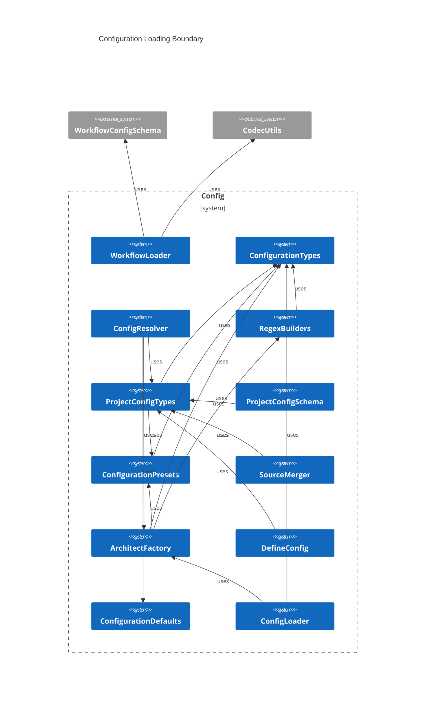
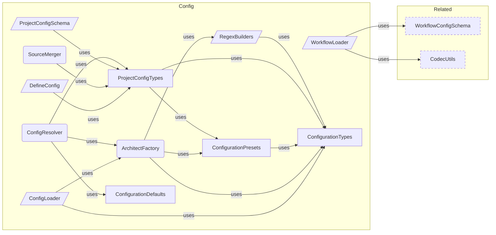

# Configuration Overview

**Purpose:** Configuration product area overview
**Detail Level:** Full reference

---

**How do I configure the tool?** Configuration is the entry boundary — it transforms a user-authored `architect.config.ts` file into a fully resolved `ArchitectInstance` that powers the entire pipeline. The flow is: `defineConfig()` provides type-safe authoring (Vite convention, zero validation), `ConfigLoader` discovers and loads the file, `ProjectConfigSchema` validates via Zod, `ConfigResolver` applies defaults and merges stubs into sources, and `ArchitectFactory` builds the final instance with `TagRegistry` and `RegexBuilders`. Three presets define escalating taxonomy complexity — from 3 categories (`generic`, `libar-generic`) to 21 (`ddd-es-cqrs`). `SourceMerger` computes per-generator source overrides, enabling generators like changelog to pull from different feature sets than the base config.

## Key Invariants

- Preset-based taxonomy: `generic` (3 categories, `@docs-`), `libar-generic` (3 categories, `@architect-`), `ddd-es-cqrs` (21 categories, full DDD). Presets replace base categories entirely — they define prefix, categories, and metadata tags as a unit
- Resolution pipeline: defineConfig() → ConfigLoader → ProjectConfigSchema (Zod) → ConfigResolver → ArchitectFactory → ArchitectInstance. Each stage has a single responsibility
- Stubs merged at resolution time: Stub directory globs are appended to typescript sources, making stubs transparent to the downstream pipeline
- Source override composition: SourceMerger applies per-generator overrides (`replaceFeatures`, `additionalFeatures`, `additionalInput`) to base sources. Exclude is always inherited from base

---

## Contents

- [Key Invariants](#key-invariants)
- [Configuration Loading Boundary](#configuration-loading-boundary)
- [Configuration Resolution Pipeline](#configuration-resolution-pipeline)
- [API Types](#api-types)
- [Business Rules](#business-rules)

---

## Configuration Loading Boundary

Scoped architecture diagram showing component relationships:



---

## Configuration Resolution Pipeline

Scoped architecture diagram showing component relationships:



---

## API Types

### ArchitectConfig (interface)

```typescript
/**
 * Configuration for creating a delivery process instance.
 * Uses generics to preserve literal types from presets.
 */
```

````typescript
interface ArchitectConfig {
  /** Tag prefix for directives (e.g., "@docs-" or "@architect-") */
  readonly tagPrefix: string;
  /** File-level opt-in tag (e.g., "@docs" or "@architect") */
  readonly fileOptInTag: string;
  /** Category definitions for pattern classification */
  readonly categories: readonly CategoryDefinition[];
  /** Optional metadata tag definitions */
  readonly metadataTags?: readonly MetadataTagDefinitionForRegistry[];
  /**
   * Optional context inference rules for auto-inferring bounded context from file paths.
   *
   * When provided, these rules are merged with the default rules. User-provided rules
   * take precedence over defaults (applied first in the rule list).
   *
   * @example
   * ```typescript
   * contextInferenceRules: [
   *   { pattern: 'packages/orders/**', context: 'orders' },
   *   { pattern: 'packages/inventory/**', context: 'inventory' },
   * ]
   * ```
   */
  readonly contextInferenceRules?: readonly ContextInferenceRule[];
}
````

| Property              | Description                                                                                                                                                                                                                                                                                                                                                                                       |
| --------------------- | ------------------------------------------------------------------------------------------------------------------------------------------------------------------------------------------------------------------------------------------------------------------------------------------------------------------------------------------------------------------------------------------------- |
| tagPrefix             | Tag prefix for directives (e.g., "@docs-" or "@architect-")                                                                                                                                                                                                                                                                                                                                       |
| fileOptInTag          | File-level opt-in tag (e.g., "@docs" or "@architect")                                                                                                                                                                                                                                                                                                                                             |
| categories            | Category definitions for pattern classification                                                                                                                                                                                                                                                                                                                                                   |
| metadataTags          | Optional metadata tag definitions                                                                                                                                                                                                                                                                                                                                                                 |
| contextInferenceRules | Optional context inference rules for auto-inferring bounded context from file paths. When provided, these rules are merged with the default rules. User-provided rules take precedence over defaults (applied first in the rule list). `typescript contextInferenceRules: [ { pattern: 'packages/orders/**', context: 'orders' }, { pattern: 'packages/inventory/**', context: 'inventory' }, ] ` |

### ArchitectInstance (interface)

```typescript
/**
 * Instance returned by createArchitect with configured registry
 */
```

```typescript
interface ArchitectInstance {
  /** The fully configured tag registry */
  readonly registry: TagRegistry;
  /** Regex builders for tag detection */
  readonly regexBuilders: RegexBuilders;
}
```

| Property      | Description                       |
| ------------- | --------------------------------- |
| registry      | The fully configured tag registry |
| regexBuilders | Regex builders for tag detection  |

### RegexBuilders (interface)

```typescript
/**
 * Regex builders for tag detection
 *
 * Provides type-safe regex operations for detecting and normalizing tags
 * based on the configured tag prefix.
 */
```

```typescript
interface RegexBuilders {
  /** Pattern to match file-level opt-in (e.g., /** @docs *\/) */
  readonly fileOptInPattern: RegExp;
  /** Pattern to match directives (e.g., @docs-pattern, @docs-status) */
  readonly directivePattern: RegExp;
  /** Check if content has the file-level opt-in marker */
  hasFileOptIn(content: string): boolean;
  /** Check if content has any doc directives */
  hasDocDirectives(content: string): boolean;
  /** Normalize a tag by removing @ and prefix (e.g., "@docs-pattern" -> "pattern") */
  normalizeTag(tag: string): string;
}
```

| Property         | Description                                                     |
| ---------------- | --------------------------------------------------------------- |
| fileOptInPattern | Pattern to match file-level opt-in (e.g., /\*_ @docs _\/)       |
| directivePattern | Pattern to match directives (e.g., @docs-pattern, @docs-status) |

### ArchitectProjectConfig (interface)

````typescript
/**
 * Unified project configuration for delivery-process.
 *
 * This is the shape users provide in `architect.config.ts`.
 * `defineConfig()` is an identity function providing type safety.
 *
 * @example
 * ```typescript
 * import { defineConfig } from '@libar-dev/architect/config';
 *
 * export default defineConfig({
 *   preset: 'ddd-es-cqrs',
 *   sources: {
 *     typescript: ['packages/* /src/** /*.ts'],
 *     features: ['architect/specs/** /*.feature'],
 *     stubs: ['architect/stubs/** /*.ts'],
 *   },
 *   output: { directory: 'docs-living', overwrite: true },
 * });
 * ```
 */
````

```typescript
interface ArchitectProjectConfig {
  // --- Taxonomy ---

  /** Use a preset taxonomy configuration */
  readonly preset?: PresetName;

  /** Custom tag prefix (overrides preset, e.g., '@docs-') */
  readonly tagPrefix?: string;

  /** Custom file opt-in tag (overrides preset, e.g., '@docs') */
  readonly fileOptInTag?: string;

  /** Custom categories (replaces preset categories entirely) */
  readonly categories?: ArchitectConfig['categories'];

  // --- Sources ---

  /** Source file glob configuration */
  readonly sources?: SourcesConfig;

  // --- Output ---

  /** Output configuration for generated docs */
  readonly output?: OutputConfig;

  // --- Generators ---

  /** Default generator names to run when CLI doesn't specify --generators */
  readonly generators?: readonly string[];

  /** Per-generator source and output overrides */
  readonly generatorOverrides?: Readonly<Record<string, GeneratorSourceOverride>>;

  // --- Advanced ---

  /** Rules for auto-inferring bounded context from file paths */
  readonly contextInferenceRules?: readonly ContextInferenceRule[];

  /** Path to custom workflow config JSON (relative to config file) */
  readonly workflowPath?: string;

  // --- Codec Options ---

  /**
   * Per-codec options for fine-tuning document generation.
   * Keys match codec names (e.g., 'business-rules', 'patterns').
   * Passed through to codec factories at generation time.
   */
  readonly codecOptions?: CodecOptions;

  // --- Reference Documents ---

  /**
   * Reference document configurations for convention-based doc generation.
   * Each config defines one reference document's content composition via
   * convention tags, shape sources, behavior categories, and diagram scopes.
   *
   * When not specified, no reference generators are registered.
   * Import `LIBAR_REFERENCE_CONFIGS` from the generators module
   * to use the built-in set.
   */
  readonly referenceDocConfigs?: readonly ReferenceDocConfig[];
}
```

| Property              | Description                                                                                                                                                                                                                                                                                                                                                           |
| --------------------- | --------------------------------------------------------------------------------------------------------------------------------------------------------------------------------------------------------------------------------------------------------------------------------------------------------------------------------------------------------------------- |
| preset                | Use a preset taxonomy configuration                                                                                                                                                                                                                                                                                                                                   |
| tagPrefix             | Custom tag prefix (overrides preset, e.g., '@docs-')                                                                                                                                                                                                                                                                                                                  |
| fileOptInTag          | Custom file opt-in tag (overrides preset, e.g., '@docs')                                                                                                                                                                                                                                                                                                              |
| categories            | Custom categories (replaces preset categories entirely)                                                                                                                                                                                                                                                                                                               |
| sources               | Source file glob configuration                                                                                                                                                                                                                                                                                                                                        |
| output                | Output configuration for generated docs                                                                                                                                                                                                                                                                                                                               |
| generators            | Default generator names to run when CLI doesn't specify --generators                                                                                                                                                                                                                                                                                                  |
| generatorOverrides    | Per-generator source and output overrides                                                                                                                                                                                                                                                                                                                             |
| contextInferenceRules | Rules for auto-inferring bounded context from file paths                                                                                                                                                                                                                                                                                                              |
| workflowPath          | Path to custom workflow config JSON (relative to config file)                                                                                                                                                                                                                                                                                                         |
| codecOptions          | Per-codec options for fine-tuning document generation. Keys match codec names (e.g., 'business-rules', 'patterns'). Passed through to codec factories at generation time.                                                                                                                                                                                             |
| referenceDocConfigs   | Reference document configurations for convention-based doc generation. Each config defines one reference document's content composition via convention tags, shape sources, behavior categories, and diagram scopes. When not specified, no reference generators are registered. Import `LIBAR_REFERENCE_CONFIGS` from the generators module to use the built-in set. |

### SourcesConfig (interface)

```typescript
/**
 * Source glob configuration for the project.
 * Centralizes what previously lived in CLI --input/--features flags.
 */
```

```typescript
interface SourcesConfig {
  /** Glob patterns for TypeScript source files (replaces --input) */
  readonly typescript: readonly string[];

  /**
   * Glob patterns for Gherkin feature files (replaces --features).
   * Includes both `.feature` and `.feature.md` files.
   */
  readonly features?: readonly string[];

  /**
   * Glob patterns for design stub files.
   * Stubs are TypeScript files that live outside `src/` (e.g., `architect/stubs/`).
   * Merged into TypeScript sources at resolution time.
   */
  readonly stubs?: readonly string[];

  /** Glob patterns to exclude from all scanning */
  readonly exclude?: readonly string[];
}
```

| Property   | Description                                                                                                                                                             |
| ---------- | ----------------------------------------------------------------------------------------------------------------------------------------------------------------------- |
| typescript | Glob patterns for TypeScript source files (replaces --input)                                                                                                            |
| features   | Glob patterns for Gherkin feature files (replaces --features). Includes both `.feature` and `.feature.md` files.                                                        |
| stubs      | Glob patterns for design stub files. Stubs are TypeScript files that live outside `src/` (e.g., `architect/stubs/`). Merged into TypeScript sources at resolution time. |
| exclude    | Glob patterns to exclude from all scanning                                                                                                                              |

### OutputConfig (interface)

```typescript
/**
 * Output configuration for generated documentation.
 */
```

```typescript
interface OutputConfig {
  /** Output directory for generated docs (default: 'docs/architecture') */
  readonly directory?: string;
  /** Overwrite existing files (default: false) */
  readonly overwrite?: boolean;
}
```

| Property  | Description                                                        |
| --------- | ------------------------------------------------------------------ |
| directory | Output directory for generated docs (default: 'docs/architecture') |
| overwrite | Overwrite existing files (default: false)                          |

### GeneratorSourceOverride (interface)

```typescript
/**
 * Generator-specific source overrides.
 *
 * Some generators need different sources than the base config.
 * For example, `changelog` needs `decisions/*.feature` and `releases/*.feature`
 * in addition to the base feature set.
 *
 * ### Override Semantics
 *
 * - `additionalFeatures` / `additionalInput`: Appended to base sources
 * - `replaceFeatures`: Used INSTEAD of base features (for generators needing a different set)
 * - `outputDirectory`: Override the base output directory for this generator
 *
 * ### Mutual Exclusivity
 *
 * `replaceFeatures` and `additionalFeatures` are mutually exclusive when both are
 * non-empty. This constraint is enforced at runtime by the Zod `.refine()` in
 * {@link GeneratorSourceOverrideSchema} (in `project-config-schema.ts`).
 *
 * The TypeScript type intentionally permits both fields to coexist because
 * `mergeSourcesForGenerator()` treats an empty `replaceFeatures: []` as "no replace",
 * falling through to `additionalFeatures`. Encoding this length-dependent semantics
 * via `never` would reject valid runtime states.
 */
```

```typescript
interface GeneratorSourceOverride {
  /** Additional feature file globs appended to base features */
  readonly additionalFeatures?: readonly string[];
  /** Additional TypeScript globs appended to base TypeScript sources */
  readonly additionalInput?: readonly string[];
  /**
   * Feature globs used INSTEAD of base features.
   * Mutually exclusive with non-empty `additionalFeatures`.
   * @see GeneratorSourceOverrideSchema for runtime validation
   */
  readonly replaceFeatures?: readonly string[];
  /** Override output directory for this generator */
  readonly outputDirectory?: string;
}
```

| Property           | Description                                                                                          |
| ------------------ | ---------------------------------------------------------------------------------------------------- |
| additionalFeatures | Additional feature file globs appended to base features                                              |
| additionalInput    | Additional TypeScript globs appended to base TypeScript sources                                      |
| replaceFeatures    | Feature globs used INSTEAD of base features. Mutually exclusive with non-empty `additionalFeatures`. |
| outputDirectory    | Override output directory for this generator                                                         |

### ResolvedProjectConfig (interface)

```typescript
/**
 * Fully resolved project configuration with all defaults applied.
 */
```

```typescript
interface ResolvedProjectConfig {
  /** Resolved source globs (stubs merged, defaults applied) */
  readonly sources: ResolvedSourcesConfig;
  /** Resolved output config with all defaults */
  readonly output: Readonly<Required<OutputConfig>>;
  /** Default generator names */
  readonly generators: readonly string[];
  /** Per-generator source overrides */
  readonly generatorOverrides: Readonly<Record<string, GeneratorSourceOverride>>;
  /** Context inference rules (user rules prepended to defaults) */
  readonly contextInferenceRules: readonly ContextInferenceRule[];
  /** Workflow config path (null if not specified) */
  readonly workflowPath: string | null;
  /** Per-codec options for document generation (empty if none) */
  readonly codecOptions?: CodecOptions;
  /** Reference document configurations (empty array if none) */
  readonly referenceDocConfigs: readonly ReferenceDocConfig[];
}
```

| Property              | Description                                                |
| --------------------- | ---------------------------------------------------------- |
| sources               | Resolved source globs (stubs merged, defaults applied)     |
| output                | Resolved output config with all defaults                   |
| generators            | Default generator names                                    |
| generatorOverrides    | Per-generator source overrides                             |
| contextInferenceRules | Context inference rules (user rules prepended to defaults) |
| workflowPath          | Workflow config path (null if not specified)               |
| codecOptions          | Per-codec options for document generation (empty if none)  |
| referenceDocConfigs   | Reference document configurations (empty array if none)    |

### ResolvedSourcesConfig (interface)

```typescript
/**
 * Resolved sources config where all optional fields have been applied with defaults.
 */
```

```typescript
interface ResolvedSourcesConfig {
  /** TypeScript source globs (includes merged stubs) */
  readonly typescript: readonly string[];
  /** Gherkin feature file globs */
  readonly features: readonly string[];
  /** Glob patterns to exclude from scanning */
  readonly exclude: readonly string[];
}
```

| Property   | Description                                     |
| ---------- | ----------------------------------------------- |
| typescript | TypeScript source globs (includes merged stubs) |
| features   | Gherkin feature file globs                      |
| exclude    | Glob patterns to exclude from scanning          |

### CreateArchitectOptions (interface)

```typescript
/**
 * Options for creating a delivery process instance
 */
```

```typescript
interface CreateArchitectOptions {
  /** Use a preset configuration */
  preset?: PresetName;
  /** Custom tag prefix (overrides preset) */
  tagPrefix?: string;
  /** Custom file opt-in tag (overrides preset) */
  fileOptInTag?: string;
  /** Custom categories (replaces preset categories entirely) */
  categories?: ArchitectConfig['categories'];
}
```

| Property     | Description                                             |
| ------------ | ------------------------------------------------------- |
| preset       | Use a preset configuration                              |
| tagPrefix    | Custom tag prefix (overrides preset)                    |
| fileOptInTag | Custom file opt-in tag (overrides preset)               |
| categories   | Custom categories (replaces preset categories entirely) |

### ConfigDiscoveryResult (interface)

```typescript
/**
 * Result of config file discovery
 */
```

```typescript
interface ConfigDiscoveryResult {
  /** Whether a config file was found */
  found: boolean;
  /** Absolute path to the config file (if found) */
  path?: string;
  /** The loaded configuration instance */
  instance: ArchitectInstance;
  /** Whether the default configuration was used */
  isDefault: boolean;
}
```

| Property  | Description                                 |
| --------- | ------------------------------------------- |
| found     | Whether a config file was found             |
| path      | Absolute path to the config file (if found) |
| instance  | The loaded configuration instance           |
| isDefault | Whether the default configuration was used  |

### ConfigLoadError (interface)

```typescript
/**
 * Error during config loading
 */
```

```typescript
interface ConfigLoadError {
  /** Discriminant for error type identification */
  type: 'config-load-error';
  /** Absolute path to the config file that failed to load */
  path: string;
  /** Human-readable error description */
  message: string;
  /** The underlying error that caused the failure (if any) */
  cause?: Error | undefined;
}
```

| Property | Description                                           |
| -------- | ----------------------------------------------------- |
| type     | Discriminant for error type identification            |
| path     | Absolute path to the config file that failed to load  |
| message  | Human-readable error description                      |
| cause    | The underlying error that caused the failure (if any) |

### ResolvedConfig (type)

```typescript
/**
 * Fully resolved configuration combining the taxonomy instance
 * and the project-level config.
 *
 * This is the primary type consumed by the orchestrator and CLIs.
 *
 * Discriminated union on `isDefault`:
 * - `isDefault: true` means no config file was found; `configPath` is `undefined`.
 * - `isDefault: false` means a config file was loaded; `configPath` is a `string`.
 */
```

```typescript
type ResolvedConfig =
  | {
      /** The taxonomy instance (registry + regexBuilders) */
      readonly instance: ArchitectInstance;
      /** The resolved project config with defaults applied */
      readonly project: ResolvedProjectConfig;
      /** Config was generated from defaults (no config file found) */
      readonly isDefault: true;
      /** No config file path when using defaults */
      readonly configPath?: undefined;
    }
  | {
      /** The taxonomy instance (registry + regexBuilders) */
      readonly instance: ArchitectInstance;
      /** The resolved project config with defaults applied */
      readonly project: ResolvedProjectConfig;
      /** Config was loaded from a file */
      readonly isDefault: false;
      /** Path to the config file that was loaded */
      readonly configPath: string;
    };
```

### PresetName (type)

```typescript
/**
 * Available preset names
 */
```

```typescript
type PresetName = 'generic' | 'libar-generic' | 'ddd-es-cqrs';
```

### ConfigLoadResult (type)

```typescript
/**
 * Result type for config loading (discriminated union)
 */
```

```typescript
type ConfigLoadResult =
  | {
      /** Indicates successful config resolution */
      ok: true;
      /** The discovery result containing configuration instance */
      value: ConfigDiscoveryResult;
    }
  | {
      /** Indicates config loading failure */
      ok: false;
      /** Error details for the failed load */
      error: ConfigLoadError;
    };
```

### createRegexBuilders (function)

````typescript
/**
 * Creates type-safe regex builders for a given tag prefix configuration.
 * These are used throughout the scanner and validation pipeline.
 *
 * @param tagPrefix - The tag prefix (e.g., "@docs-" or "@architect-")
 * @param fileOptInTag - The file opt-in tag (e.g., "@docs" or "@architect")
 * @returns RegexBuilders instance with pattern matching methods
 *
 * @example
 * ```typescript
 * const builders = createRegexBuilders("@docs-", "@docs");
 *
 * // Check for file opt-in
 * if (builders.hasFileOptIn(sourceCode)) {
 *   console.log("File has @docs marker");
 * }
 *
 * // Normalize a tag
 * const normalized = builders.normalizeTag("@docs-pattern");
 * // Returns: "pattern"
 * ```
 */
````

```typescript
function createRegexBuilders(tagPrefix: string, fileOptInTag: string): RegexBuilders;
```

| Parameter    | Type | Description                                         |
| ------------ | ---- | --------------------------------------------------- |
| tagPrefix    |      | The tag prefix (e.g., "@docs-" or "@architect-")    |
| fileOptInTag |      | The file opt-in tag (e.g., "@docs" or "@architect") |

**Returns:** RegexBuilders instance with pattern matching methods

### createArchitect (function)

````typescript
/**
 * Creates a configured delivery process instance.
 *
 * Configuration resolution order:
 * 1. Start with preset (or libar-generic default)
 * 2. Preset categories REPLACE base taxonomy categories (not merged)
 * 3. Apply explicit overrides (tagPrefix, fileOptInTag, categories)
 * 4. Create regex builders from final configuration
 *
 * Note: Presets define complete category sets. The libar-generic preset
 * has 3 categories (core, api, infra), while ddd-es-cqrs has 21.
 * Categories from the preset replace base categories entirely.
 *
 * @param options - Configuration options
 * @returns Configured delivery process instance
 *
 * @example
 * ```typescript
 * // Use generic preset
 * const dp = createArchitect({ preset: "generic" });
 * ```
 *
 * @example
 * ```typescript
 * // Custom prefix with DDD taxonomy
 * const dp = createArchitect({
 *   preset: "ddd-es-cqrs",
 *   tagPrefix: "@my-project-",
 *   fileOptInTag: "@my-project"
 * });
 * ```
 *
 * @example
 * ```typescript
 * // Default (libar-generic preset with 3 categories)
 * const dp = createArchitect();
 * ```
 */
````

```typescript
function createArchitect(options: CreateArchitectOptions = {}): ArchitectInstance;
```

| Parameter | Type | Description           |
| --------- | ---- | --------------------- |
| options   |      | Configuration options |

**Returns:** Configured delivery process instance

### findConfigFile (function)

```typescript
/**
 * Find config file by walking up from startDir
 *
 * @param startDir - Directory to start searching from
 * @returns Path to config file or null if not found
 */
```

```typescript
async function findConfigFile(startDir: string): Promise<string | null>;
```

| Parameter | Type | Description                       |
| --------- | ---- | --------------------------------- |
| startDir  |      | Directory to start searching from |

**Returns:** Path to config file or null if not found

### loadConfig (function)

````typescript
/**
 * Load configuration from file or use defaults.
 *
 * Delegates to {@link loadProjectConfig} for file discovery and parsing,
 * then maps the result to the legacy {@link ConfigDiscoveryResult} shape.
 *
 * @param baseDir - Directory to start searching from (usually cwd or project root)
 * @returns Result with loaded configuration or error
 *
 * @example
 * ```typescript
 * // In CLI tool
 * const result = await loadConfig(process.cwd());
 * if (!result.ok) {
 *   console.error(result.error.message);
 *   process.exit(1);
 * }
 *
 * const { instance, isDefault, path } = result.value;
 * if (!isDefault) {
 *   console.log(`Using config from: ${path}`);
 * }
 *
 * // Use instance.registry for scanning/extracting
 * ```
 */
````

```typescript
async function loadConfig(baseDir: string): Promise<ConfigLoadResult>;
```

| Parameter | Type | Description                                                     |
| --------- | ---- | --------------------------------------------------------------- |
| baseDir   |      | Directory to start searching from (usually cwd or project root) |

**Returns:** Result with loaded configuration or error

### formatConfigError (function)

```typescript
/**
 * Format config load error for console display
 *
 * @param error - Config load error
 * @returns Formatted error message
 */
```

```typescript
function formatConfigError(error: ConfigLoadError): string;
```

| Parameter | Type | Description       |
| --------- | ---- | ----------------- |
| error     |      | Config load error |

**Returns:** Formatted error message

### GENERIC_PRESET (const)

````typescript
/**
 * Generic preset for non-DDD projects.
 *
 * Minimal categories with @docs- prefix. Suitable for:
 * - Simple documentation needs
 * - Non-DDD architectures
 * - Projects that want basic pattern tracking
 *
 * @example
 * ```typescript
 * import { createArchitect, GENERIC_PRESET } from '@libar-dev/architect';
 *
 * const dp = createArchitect({ preset: "generic" });
 * // Uses @docs-, @docs-pattern, @docs-status, etc.
 * ```
 */
````

```typescript
GENERIC_PRESET = {
  tagPrefix: '@docs-',
  fileOptInTag: '@docs',
  categories: [
    {
      tag: 'core',
      domain: 'Core',
      priority: 1,
      description: 'Core patterns',
      aliases: [],
    },
    {
      tag: 'api',
      domain: 'API',
      priority: 2,
      description: 'Public APIs',
      aliases: [],
    },
    {
      tag: 'infra',
      domain: 'Infrastructure',
      priority: 3,
      description: 'Infrastructure',
      aliases: ['infrastructure'],
    },
  ] as const satisfies readonly CategoryDefinition[],
} as const satisfies ArchitectConfig;
```

### LIBAR_GENERIC_PRESET (const)

````typescript
/**
 * Generic preset with @architect- prefix.
 *
 * Same minimal categories as GENERIC_PRESET but with @architect- prefix.
 * This is the universal default preset for both `createArchitect()` and
 * `loadConfig()` fallback.
 *
 * Suitable for:
 * - Most projects (default choice)
 * - Projects already using @architect- tags
 * - Package-level configuration (simplified categories, same prefix)
 * - Gradual adoption without tag migration
 *
 * @example
 * ```typescript
 * import { createArchitect } from '@libar-dev/architect';
 *
 * // Default preset (libar-generic):
 * const dp = createArchitect();
 * // Uses @architect-, @architect-pattern, @architect-status, etc.
 * // With 3 category tags: @architect-core, @architect-api, @architect-infra
 * ```
 */
````

```typescript
LIBAR_GENERIC_PRESET = {
  tagPrefix: DEFAULT_TAG_PREFIX,
  fileOptInTag: DEFAULT_FILE_OPT_IN_TAG,
  categories: [
    {
      tag: 'core',
      domain: 'Core',
      priority: 1,
      description: 'Core patterns',
      aliases: [],
    },
    {
      tag: 'api',
      domain: 'API',
      priority: 2,
      description: 'Public APIs',
      aliases: [],
    },
    {
      tag: 'infra',
      domain: 'Infrastructure',
      priority: 3,
      description: 'Infrastructure',
      aliases: ['infrastructure'],
    },
  ] as const satisfies readonly CategoryDefinition[],
} as const satisfies ArchitectConfig;
```

### DDD_ES_CQRS_PRESET (const)

````typescript
/**
 * Full DDD/ES/CQRS preset (current @libar-dev taxonomy).
 *
 * Complete 21-category taxonomy with @architect- prefix. Suitable for:
 * - DDD architectures
 * - Event sourcing projects
 * - CQRS implementations
 * - Full roadmap/phase tracking
 *
 * @example
 * ```typescript
 * import { createArchitect, DDD_ES_CQRS_PRESET } from '@libar-dev/architect';
 *
 * const dp = createArchitect({ preset: "ddd-es-cqrs" });
 * ```
 */
````

```typescript
DDD_ES_CQRS_PRESET = {
  tagPrefix: DEFAULT_TAG_PREFIX,
  fileOptInTag: DEFAULT_FILE_OPT_IN_TAG,
  categories: CATEGORIES,
  metadataTags: buildRegistry().metadataTags,
} as const satisfies ArchitectConfig;
```

### PRESETS (const)

````typescript
/**
 * Preset lookup map
 *
 * @example
 * ```typescript
 * import { PRESETS, type PresetName } from '@libar-dev/architect';
 *
 * function getPreset(name: PresetName) {
 *   return PRESETS[name];
 * }
 * ```
 */
````

```typescript
const PRESETS: Record<PresetName, ArchitectConfig>;
```

---

## Business Rules

10 patterns, 47 rules with invariants (47 total)

### Config Based Workflow Definition

| Rule                                                 | Invariant                                                                                                                                                                                            | Rationale                                                                                                                                                                                                                                                                                                                                                                                                                                                                                                        |
| ---------------------------------------------------- | ---------------------------------------------------------------------------------------------------------------------------------------------------------------------------------------------------- | ---------------------------------------------------------------------------------------------------------------------------------------------------------------------------------------------------------------------------------------------------------------------------------------------------------------------------------------------------------------------------------------------------------------------------------------------------------------------------------------------------------------- |
| Default workflow is built from an inline constant    | `loadDefaultWorkflow()` returns a `LoadedWorkflow` without file system access. It cannot fail. The default workflow constant uses only canonical status values from `src/taxonomy/status-values.ts`. | The file-based loading path (`catalogue/workflows/`) has been dead code since monorepo extraction. Both callers (orchestrator, process-api) already handle the failure gracefully, proving the system works without it. Making the function synchronous and infallible removes the try-catch ceremony and the warning noise.                                                                                                                                                                                     |
| Custom workflow files still work via --workflow flag | `loadWorkflowFromPath()` remains available for projects that need custom workflow definitions. The `--workflow <file>` CLI flag and `workflowPath` config field continue to work.                    | The inline default replaces file-based _default_ loading, not file-based _custom_ loading. Projects may define custom phases or additional statuses via JSON files.                                                                                                                                                                                                                                                                                                                                              |
| FSM validation and Process Guard are not affected    | The FSM transition matrix, protection levels, and Process Guard rules remain hardcoded in `src/validation/fsm/` and `src/lint/process-guard/`. They do not read from `LoadedWorkflow`.               | FSM and workflow are separate concerns. FSM enforces status transitions (4-state model from PDR-005). Workflow defines phase structure (6-phase USDP). The workflow JSON declared `transitionsTo` on its statuses, but no code ever read those values — the FSM uses its own `VALID_TRANSITIONS` constant. This separation is correct and intentional. Blast radius analysis confirmed zero workflow imports in: - src/validation/fsm/ (4 files) - src/lint/process-guard/ (5 files) - src/taxonomy/ (all files) |
| Workflow as a configurable preset field is deferred  | The inline default workflow constant is the only workflow source until preset integration is implemented. No preset or project config field exposes workflow customization.                          | Coupling workflow into the preset/config system before the inline fix ships would widen the blast radius and risk type regressions across all config consumers.                                                                                                                                                                                                                                                                                                                                                  |

### Config Loader Testing

| Rule                                                  | Invariant                                                                                                                                                                             | Rationale                                                                                                                                             |
| ----------------------------------------------------- | ------------------------------------------------------------------------------------------------------------------------------------------------------------------------------------- | ----------------------------------------------------------------------------------------------------------------------------------------------------- |
| Config files are discovered by walking up directories | The config loader must search for configuration files starting from the current directory and walking up parent directories until a match is found or the filesystem root is reached. | Projects may run CLI commands from subdirectories — upward traversal ensures the nearest config file is always found regardless of working directory. |
| Config discovery stops at repo root                   | Directory traversal must stop at repository root markers (e.g., .git directory) and not search beyond them.                                                                           | Searching beyond the repo root could find unrelated config files from parent projects, producing confusing cross-project behavior.                    |
| Config is loaded and validated                        | Loaded config files must have a valid default export matching the expected configuration schema, with appropriate error messages for invalid formats.                                 | Invalid configurations produce cryptic downstream errors — early validation with clear messages prevents debugging wasted on malformed config.        |
| Config errors are formatted for display               | Configuration loading errors must be formatted as human-readable messages including the file path and specific error description.                                                     | Raw error objects are not actionable — developers need the config file path and a clear description to diagnose and fix configuration issues.         |

### Config Resolution

| Rule                                       | Invariant                                                                                  | Rationale                                                                                                 |
| ------------------------------------------ | ------------------------------------------------------------------------------------------ | --------------------------------------------------------------------------------------------------------- |
| Default config provides sensible fallbacks | A config created without user input must have isDefault=true and empty source collections. | Downstream consumers need a safe starting point when no config file exists.                               |
| Preset creates correct taxonomy instance   | Each preset must produce a taxonomy with the correct number of categories and tag prefix.  | Presets are the primary user-facing configuration — wrong category counts break downstream scanning.      |
| Stubs are merged into typescript sources   | Stub glob patterns must appear in resolved typescript sources alongside original globs.    | Stubs extend the scanner's source set without requiring users to manually list them.                      |
| Output defaults are applied                | Missing output configuration must resolve to "docs/architecture" with overwrite=false.     | Consistent defaults prevent accidental overwrites and establish a predictable output location.            |
| Generator defaults are applied             | A config with no generators specified must default to the "patterns" generator.            | Patterns is the most commonly needed output — defaulting to it reduces boilerplate.                       |
| Context inference rules are prepended      | User-defined inference rules must appear before built-in defaults in the resolved array.   | Prepending gives user rules priority during context matching without losing defaults.                     |
| Config path is carried from options        | The configPath from resolution options must be preserved unchanged in resolved config.     | Downstream tools need the original config file location for error reporting and relative path resolution. |

### Configuration API

| Rule                                                       | Invariant                                                                                                                                                                  | Rationale                                                                                                                                                           |
| ---------------------------------------------------------- | -------------------------------------------------------------------------------------------------------------------------------------------------------------------------- | ------------------------------------------------------------------------------------------------------------------------------------------------------------------- |
| Factory creates configured instances with correct defaults | The configuration factory must produce a fully initialized instance for any supported preset, with the libar-generic preset as the default when no arguments are provided. | A sensible default preset eliminates boilerplate for the common case while still supporting specialized presets (ddd-es-cqrs) for advanced monorepo configurations. |
| Custom prefix configuration works correctly                | Custom tag prefix and file opt-in tag overrides must be applied to the configuration instance, replacing the preset defaults.                                              | Consuming projects may use different annotation prefixes — custom prefixes enable the toolkit to work with any tag convention without forking presets.              |
| Preset categories replace base categories entirely         | When a preset defines its own category set, it must fully replace (not merge with) the base categories.                                                                    | Category sets are curated per-preset — merging would include irrelevant categories (e.g., DDD categories in a generic project) that pollute taxonomy reports.       |
| Regex builders use configured prefix                       | All regex builders (hasFileOptIn, hasDocDirectives, normalizeTag) must use the configured tag prefix, not a hardcoded one.                                                 | Regex patterns that ignore the configured prefix would miss annotations in projects using custom prefixes, silently skipping source files.                          |

### Define Config Testing

| Rule                                    | Invariant                                                                                                                                                                      | Rationale                                                                                                                                                              |
| --------------------------------------- | ------------------------------------------------------------------------------------------------------------------------------------------------------------------------------ | ---------------------------------------------------------------------------------------------------------------------------------------------------------------------- |
| defineConfig is an identity function    | The defineConfig helper must return its input unchanged, serving only as a type annotation aid for IDE autocomplete.                                                           | defineConfig exists for TypeScript type inference in config files — any transformation would surprise users who expect their config object to pass through unmodified. |
| Schema validates correct configurations | Valid configuration objects (both minimal and fully-specified) must pass schema validation without errors.                                                                     | The schema must accept all legitimate configuration shapes — rejecting valid configs would block users from using supported features.                                  |
| Schema rejects invalid configurations   | The configuration schema must reject invalid values including empty globs, directory traversal patterns, mutually exclusive options, invalid preset names, and unknown fields. | Schema validation is the first line of defense against misconfiguration — permissive validation lets invalid configs produce confusing downstream errors.              |
| Type guards distinguish config formats  | The isProjectConfig and isLegacyInstance type guards must correctly distinguish between new-style project configs and legacy configuration instances.                          | The codebase supports both config formats during migration — incorrect type detection would apply the wrong loading path and produce runtime errors.                   |

### Monorepo Support

| Rule                                                                     | Invariant                                                                                                                                                                                                                                                                                                                                                | Rationale                                                                                                                                                                                         |
| ------------------------------------------------------------------------ | -------------------------------------------------------------------------------------------------------------------------------------------------------------------------------------------------------------------------------------------------------------------------------------------------------------------------------------------------------- | ------------------------------------------------------------------------------------------------------------------------------------------------------------------------------------------------- |
| Config supports workspace-aware package definitions                      | When a packages field is present in the config, each entry maps a package name to its source globs. The top-level sources field becomes optional. Packages without their own feature or stub globs inherit those values from the corresponding top-level feature and stub settings. Repos without packages work exactly as before (backward compatible). | The consumer monorepo has no config file because the system only supports flat glob arrays. Adding packages enables a single config file to replace duplicated globs across 15+ scripts.          |
| Extracted patterns carry package provenance from glob matching           | When packages config is active, every ExtractedPattern has an optional package field set from the matching glob. If no packages config exists, the field is undefined. First match wins on overlapping globs.                                                                                                                                            | Package provenance must be derived automatically from config, not from manual annotation. This ensures zero additional developer effort.                                                          |
| CLI commands accept a package filter that composes with existing filters | The --package flag filters patterns to those from a specific package. It composes with --status, --phase, --category via logical AND.                                                                                                                                                                                                                    | In a 600-file monorepo, unscoped queries return too many results. Package-scoped filtering lets developers focus on a single workspace member.                                                    |
| Cross-package dependencies are visible as a package-level graph          | The cross-package subcommand aggregates pattern-level relationships into package-level edges, showing source package, target package, and the patterns forming the dependency. Intra-package dependencies are excluded.                                                                                                                                  | Understanding cross-package dependencies is essential for release planning and impact analysis. The relationship data already exists in relationshipIndex -- this adds package-level aggregation. |
| Coverage analysis reports annotation completeness per package            | When packages config is active, arch coverage reports per-package annotation counts alongside the aggregate total.                                                                                                                                                                                                                                       | Different packages have different annotation maturity. Per-package breakdown lets teams track their own progress and identify which packages need the most work.                                  |

### Preset System

| Rule                                                             | Invariant                                                                                         | Rationale                                                                                                           |
| ---------------------------------------------------------------- | ------------------------------------------------------------------------------------------------- | ------------------------------------------------------------------------------------------------------------------- |
| Generic preset provides minimal taxonomy                         | The generic preset must provide exactly 3 categories (core, api, infra) with @docs- prefix.       | Simple projects need minimal configuration without DDD-specific categories cluttering the taxonomy.                 |
| Libar generic preset provides minimal taxonomy with libar prefix | The libar-generic preset must provide exactly 3 categories with @architect- prefix.               | This package uses @architect- prefix to avoid collisions with consumer projects' annotations.                       |
| DDD-ES-CQRS preset provides full taxonomy                        | The DDD preset must provide all 21 categories spanning DDD, ES, CQRS, and infrastructure domains. | DDD architectures require fine-grained categorization to distinguish bounded contexts, aggregates, and projections. |
| Presets can be accessed by name                                  | All preset instances must be accessible via the PRESETS map using their canonical string key.     | Programmatic access enables config files to reference presets by name instead of importing instances.               |

### Project Config Loader

| Rule                                                | Invariant                                                                                                | Rationale                                                                                                          |
| --------------------------------------------------- | -------------------------------------------------------------------------------------------------------- | ------------------------------------------------------------------------------------------------------------------ |
| Missing config returns defaults                     | When no config file exists, loadProjectConfig must return a default resolved config with isDefault=true. | Graceful fallback enables zero-config usage — new projects work without requiring config file creation.            |
| New-style config is loaded and resolved             | A file exporting defineConfig must be loaded, validated, and resolved with correct preset categories.    | defineConfig is the primary config format — correct loading is the critical path for all documentation generation. |
| Legacy config is loaded with backward compatibility | A file exporting createArchitect must be loaded and produce a valid resolved config.                     | Backward compatibility prevents breaking existing consumers during migration to the new config format.             |
| Invalid configs produce clear errors                | Config files without a default export or with invalid data must produce descriptive error messages.      | Actionable error messages reduce debugging time — users need to know what to fix, not just that something failed.  |

### Setup Command

| Rule                                                                      | Invariant                                                                                                                                                                                                                                                                                                                                                                                                  | Rationale                                                                                                                                                                                         |
| ------------------------------------------------------------------------- | ---------------------------------------------------------------------------------------------------------------------------------------------------------------------------------------------------------------------------------------------------------------------------------------------------------------------------------------------------------------------------------------------------------- | ------------------------------------------------------------------------------------------------------------------------------------------------------------------------------------------------- |
| Init detects existing project context before making changes               | The init command reads the target directory for package.json, tsconfig.json, architect.config.ts (or .js), and monorepo markers before prompting or generating any files. Detection results determine which steps are skipped.                                                                                                                                                                             | Blindly generating files overwrites user configuration and breaks working setups. Context detection enables safe adoption into existing projects by skipping steps that are already complete.     |
| Interactive prompts configure preset and source paths with smart defaults | The init command prompts for preset selection from the three available presets (generic, libar-generic, ddd-es-cqrs) with descriptions, and for source glob paths with defaults inferred from project structure. The --yes flag skips non-destructive selection prompts and uses defaults. Destructive overwrites require an explicit --force flag; otherwise init exits without modifying existing files. | New users do not know which preset to choose or what glob patterns to use. Smart defaults reduce decisions to confirmations. The --yes flag enables scripted adoption in CI.                      |
| Generated config file uses defineConfig with correct imports              | The generated architect.config.ts (or .js) imports defineConfig from the correct path, uses the selected preset, and includes configured source globs. An existing config file is never overwritten without confirmation.                                                                                                                                                                                  | The config file is the most important artifact. An incorrect import path or malformed glob causes every subsequent command to fail. The overwrite guard prevents destroying custom configuration. |
| Npm scripts are injected using bin command names                          | Injected scripts reference bin names (process-api, generate-docs) resolved via node_modules/.bin, not dist paths. Existing scripts are preserved. The package.json "type" field is preserved. ESM migration is an explicit opt-in via --esm flag.                                                                                                                                                          | The tutorial uses long fragile dist paths. Bin commands are the stable public API. Setting type:module ensures ESM imports work for the config.                                                   |
| Directory structure and example annotation enable immediate first run     | The init command creates directories for configured source globs and generates one example annotated TypeScript file with the minimum annotation set (opt-in marker, pattern tag, status, category, description).                                                                                                                                                                                          | Empty source globs produce a confusing "0 patterns" result. An example file proves the pipeline works and teaches annotation syntax by example.                                                   |
| Init validates the complete setup by running the pipeline                 | After all files are generated, init runs process-api overview and reports whether the pipeline detected the example pattern. Success prints a summary and next steps. Failure prints diagnostic information.                                                                                                                                                                                               | Generating files without verification produces false confidence. Running the pipeline as the final step proves config, globs, directories, and the example annotation all work together.          |

### Source Merging

| Rule                                                | Invariant                                                                                                                                                | Rationale                                                                                                                                                 |
| --------------------------------------------------- | -------------------------------------------------------------------------------------------------------------------------------------------------------- | --------------------------------------------------------------------------------------------------------------------------------------------------------- |
| No override returns base unchanged                  | When no source overrides are provided, the merged result must be identical to the base source configuration.                                             | The merge function must be safe to call unconditionally — returning modified results without overrides would corrupt default source paths.                |
| Feature overrides control feature source selection  | additionalFeatures must append to base feature sources while replaceFeatures must completely replace them, and these two options are mutually exclusive. | Projects need both additive and replacement strategies — additive for extending (monorepo packages), replacement for narrowing (focused generation runs). |
| TypeScript source overrides append additional input | additionalInput must append to (not replace) the base TypeScript source paths.                                                                           | TypeScript sources are always additive — the base sources contain core patterns that must always be included alongside project-specific additions.        |
| Combined overrides apply together                   | Feature overrides and TypeScript overrides must compose independently when both are provided simultaneously.                                             | Real configs often specify both feature and TypeScript overrides — they must not interfere with each other or produce order-dependent results.            |
| Exclude is always inherited from base               | The exclude patterns must always come from the base configuration, never from overrides.                                                                 | Exclude patterns are a safety mechanism — allowing overrides to modify excludes could accidentally include sensitive or generated files in the scan.      |

---
